
### 1 [电磁感应基本概念与历史背景](#1)
#### 1.1 [电磁感应现象的发现](#1)
##### 1.1.1 [法拉第电磁感应实验](#1)
##### 1.1.2 [电磁感应的历史意义](#1)
#### 1.2 [电磁感应的基本定义](#1)
##### 1.2.1 [感应电动势的概念](#1)
##### 1.2.2 [磁通量的定义与计算](#1)
### 2 [法拉第电磁感应定律](#2)
#### 2.1 [法拉第定律的表述](#2)
##### 2.1.1 [定律的数学表达式](#2)
##### 2.1.2 [负号的物理意义 楞次定律](#2)
#### 2.2 [法拉第定律的应用](#2)
##### 2.2.1 [单匝线圈中的感应电动势](#2)
##### 2.2.2 [多匝线圈中的感应电动势](#2)
### 3 [楞次定律](#3)
#### 3.1 [楞次定律的表述](#3)
##### 3.1.1 [能量守恒与楞次定律](#3)
##### 3.1.2 [感应电流方向的判断方法](#3)
#### 3.2 [楞次定律的应用实例](#3)
##### 3.2.1 [磁铁靠近和远离线圈](#3)
##### 3.2.2 [变化磁场中的导体环](#3)
### 4 [动生电动势](#4)
#### 4.1 [动生电动势的产生机制](#4)
##### 4.1.1 [导体在磁场中运动](#4)
##### 4.1.2 [洛伦兹力与动生电动势](#4)
#### 4.2 [动生电动势的计算](#4)
##### 4.2.1 [直导体在均匀磁场中运动](#4)
##### 4.2.2 [曲线形状导体的动生电动势](#4)
### 5 [感生电动势](#5)
#### 5.1 [感生电动势的产生机制](#5)
##### 5.1.1 [变化磁场产生的涡旋电场](#5)
##### 5.1.2 [麦克斯韦方程组的相关内容](#5)
#### 5.2 [感生电动势的计算与应用](#5)
##### 5.2.1 [长直螺线管中的感生电场](#5)
##### 5.2.2 [变压器中的电磁感应现象](#5)
### 6 [自感与互感](#6)
#### 6.1 [自感现象](#6)
##### 6.1.1 [自感系数的定义](#6)
##### 6.1.2 [自感电动势的计算](#6)
#### 6.2 [互感现象](#6)
##### 6.2.1 [互感系数的定义](#6)
##### 6.2.2 [互感电动势的计算](#6)
#### 6.3 [自感与互感的比较](#6)
##### 6.3.1 [物理本质的区别](#6)
##### 6.3.2 [在实际电路中的应用](#6)
### 7 [磁场的能量](#7)
#### 7.1 [自感磁能](#7)
##### 7.1.1 [自感线圈储存的能量](#7)
##### 7.1.2 [磁能密度表达式](#7)
#### 7.2 [互感磁能](#7)
##### 7.2.1 [两个耦合线圈的磁能](#7)
##### 7.2.2 [磁能的计算方法](#7)
### 8 [RL电路](#8)
#### 8.1 [RL电路的暂态过程](#8)
##### 8.1.1 [RL电路的充电过程](#8)
##### 8.1.2 [RL电路的放电过程](#8)
#### 8.2 [RL电路的时间常数](#8)
##### 8.2.1 [时间常数的物理意义](#8)
##### 8.2.2 [时间常数的计算方法](#8)
### 9 [交流电路中的电磁感应](#9)
#### 9.1 [交流发电机原理](#9)
##### 9.1.1 [旋转线圈中的感应电动势](#9)
##### 9.1.2 [交流电的产生机制](#9)
#### 9.2 [变压器原理](#9)
##### 9.2.1 [理想变压器](#9)
##### 9.2.2 [实际变压器的效率](#9)
### 10 [涡电流](#10)
#### 10.1 [涡电流的产生](#10)
##### 10.1.1 [导体在变化磁场中的涡电流](#10)
##### 10.1.2 [涡电流的分布特点](#10)
#### 10.2 [涡电流的应用与危害](#10)
##### 10.2.1 [电磁炉、感应加热等应用](#10)
##### 10.2.2 [变压器铁芯中的涡流损耗](#10)
### 11 [电磁感应的实际应用](#11)
#### 11.1 [电磁感应在电力系统中的应用](#11)
##### 11.1.1 [发电机](#11)
##### 11.1.2 [电动机](#11)
#### 11.2 [电磁感应在电子技术中的应用](#11)
##### 11.2.1 [电感元件](#11)
##### 11.2.2 [传感器](#11)
### 12 [电磁感应与电磁波](#12)
#### 12.1 [麦克斯韦电磁理论](#12)
##### 12.1.1 [位移电流假说](#12)
##### 12.1.2 [电磁波的预言](#12)
#### 12.2 [电磁波的产生与传播](#12)
##### 12.2.1 [振荡电路辐射电磁波](#12)
##### 12.2.2 [电磁波的基本性质](#12)




### 1 电磁感应基本概念与历史背景

---
### 1 电磁感应基本概念与历史背景
___
#### 1.1 电磁感应现象的发现
___
##### 1.1.1 法拉第电磁感应实验
___
##### 1.1.2 电磁感应的历史意义
___
#### 1.2 电磁感应的基本定义
___
##### 1.2.1 感应电动势的概念
___
##### 1.2.2 磁通量的定义与计算
### 2 法拉第电磁感应定律

---
### 2 法拉第电磁感应定律
___
#### 2.1 法拉第定律的表述
___
##### 2.1.1 定律的数学表达式
___
##### 2.1.2 负号的物理意义 楞次定律
___
#### 2.2 法拉第定律的应用
___
##### 2.2.1 单匝线圈中的感应电动势
___
##### 2.2.2 多匝线圈中的感应电动势
### 3 楞次定律

---
### 3 楞次定律
___
#### 3.1 楞次定律的表述
___
##### 3.1.1 能量守恒与楞次定律
___
##### 3.1.2 感应电流方向的判断方法
___
#### 3.2 楞次定律的应用实例
___
##### 3.2.1 磁铁靠近和远离线圈
___
##### 3.2.2 变化磁场中的导体环
### 4 动生电动势

---
### 4 动生电动势
___
#### 4.1 动生电动势的产生机制
___
##### 4.1.1 导体在磁场中运动
___
##### 4.1.2 洛伦兹力与动生电动势
___
#### 4.2 动生电动势的计算
___
##### 4.2.1 直导体在均匀磁场中运动
___
##### 4.2.2 曲线形状导体的动生电动势
### 5 感生电动势

---
### 5 感生电动势
___
#### 5.1 感生电动势的产生机制
___
##### 5.1.1 变化磁场产生的涡旋电场
___
##### 5.1.2 麦克斯韦方程组的相关内容
___
#### 5.2 感生电动势的计算与应用
___
##### 5.2.1 长直螺线管中的感生电场
___
##### 5.2.2 变压器中的电磁感应现象
### 6 自感与互感

---
### 6 自感与互感
___
#### 6.1 自感现象
___
##### 6.1.1 自感系数的定义
___
##### 6.1.2 自感电动势的计算
___
#### 6.2 互感现象
___
##### 6.2.1 互感系数的定义
___
##### 6.2.2 互感电动势的计算
___
#### 6.3 自感与互感的比较
___
##### 6.3.1 物理本质的区别
___
##### 6.3.2 在实际电路中的应用
### 7 磁场的能量

---
### 7 磁场的能量
___
#### 7.1 自感磁能
___
##### 7.1.1 自感线圈储存的能量
___
##### 7.1.2 磁能密度表达式
___
#### 7.2 互感磁能
___
##### 7.2.1 两个耦合线圈的磁能
___
##### 7.2.2 磁能的计算方法
### 8 RL电路

---
### 8 RL电路
___
#### 8.1 RL电路的暂态过程
___
##### 8.1.1 RL电路的充电过程
___
##### 8.1.2 RL电路的放电过程
___
#### 8.2 RL电路的时间常数
___
##### 8.2.1 时间常数的物理意义
___
##### 8.2.2 时间常数的计算方法
### 9 交流电路中的电磁感应

---
### 9 交流电路中的电磁感应
___
#### 9.1 交流发电机原理
___
##### 9.1.1 旋转线圈中的感应电动势
___
##### 9.1.2 交流电的产生机制
___
#### 9.2 变压器原理
___
##### 9.2.1 理想变压器
___
##### 9.2.2 实际变压器的效率
### 10 涡电流

---
### 10 涡电流
___
#### 10.1 涡电流的产生
___
##### 10.1.1 导体在变化磁场中的涡电流
___
##### 10.1.2 涡电流的分布特点
___
#### 10.2 涡电流的应用与危害
___
##### 10.2.1 电磁炉、感应加热等应用
___
##### 10.2.2 变压器铁芯中的涡流损耗
### 11 电磁感应的实际应用

---
### 11 电磁感应的实际应用
___
#### 11.1 电磁感应在电力系统中的应用
___
##### 11.1.1 发电机
___
##### 11.1.2 电动机
___
#### 11.2 电磁感应在电子技术中的应用
___
##### 11.2.1 电感元件
___
##### 11.2.2 传感器
### 12 电磁感应与电磁波

---
### 12 电磁感应与电磁波
___
#### 12.1 麦克斯韦电磁理论
___
##### 12.1.1 位移电流假说
___
##### 12.1.2 电磁波的预言
___
#### 12.2 电磁波的产生与传播
___
##### 12.2.1 振荡电路辐射电磁波
___
##### 12.2.2 电磁波的基本性质


### 1 电磁感应基本概念与历史背景{#1}

{}
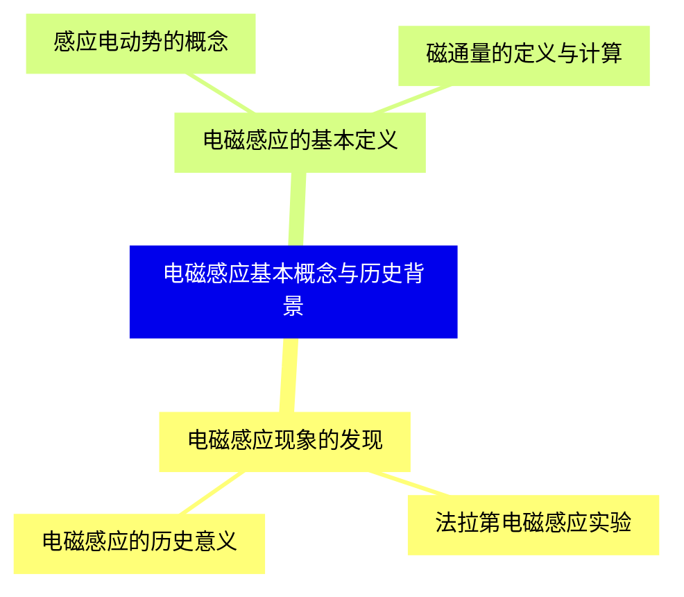

<--->
{}
{}
{}
{}
{}
{}
{}
{}
{}
{}
{}
{}
{}

### 2 法拉第电磁感应定律{#2}

{}
{}
{}
{}
{}
{}
{}
{}
{}
{}
{}
{}
{}
<--->
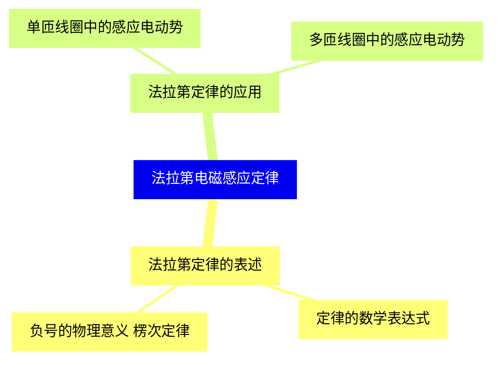

{}

### 3 楞次定律{#3}

{}
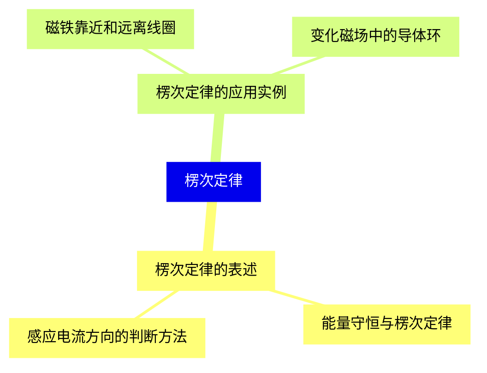

<--->
{}
{}
{}
{}
{}
{}
{}
{}
{}
{}
{}
{}
{}

### 4 动生电动势{#4}

{}
{}
{}
{}
{}
{}
{}
{}
{}
{}
{}
{}
{}
<--->
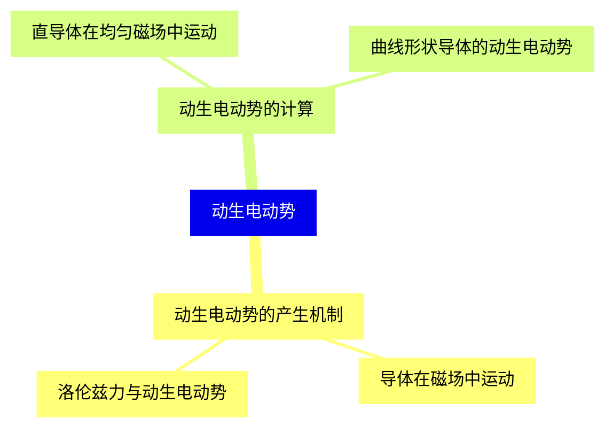

{}

### 5 感生电动势{#5}

{}
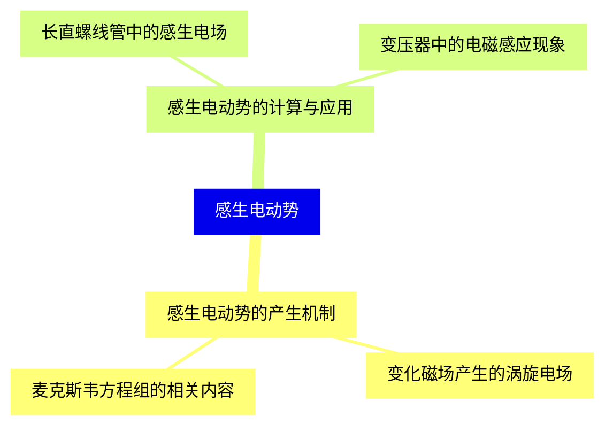

<--->
{}
{}
{}
{}
{}
{}
{}
{}
{}
{}
{}
{}
{}

### 6 自感与互感{#6}

{}
{}
{}
{}
{}
{}
{}
{}
{}
{}
{}
{}
{}
{}
{}
{}
{}
{}
{}
<--->
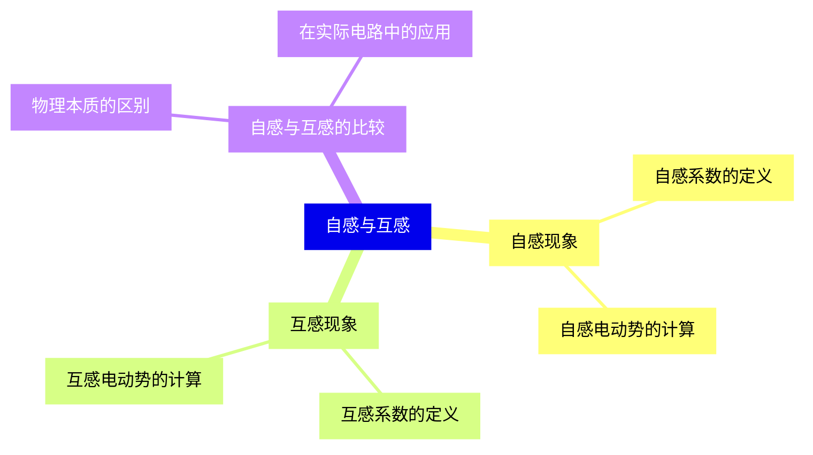

{}

### 7 磁场的能量{#7}

{}
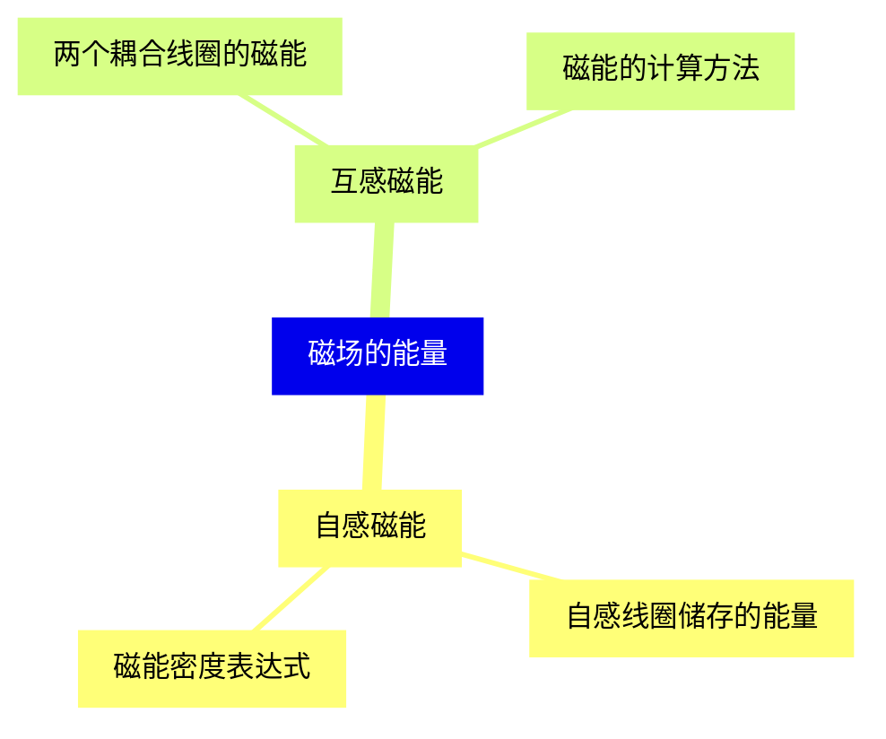

<--->
{}
{}
{}
{}
{}
{}
{}
{}
{}
{}
{}
{}
{}

### 8 RL电路{#8}

{}
{}
{}
{}
{}
{}
{}
{}
{}
{}
{}
{}
{}
<--->
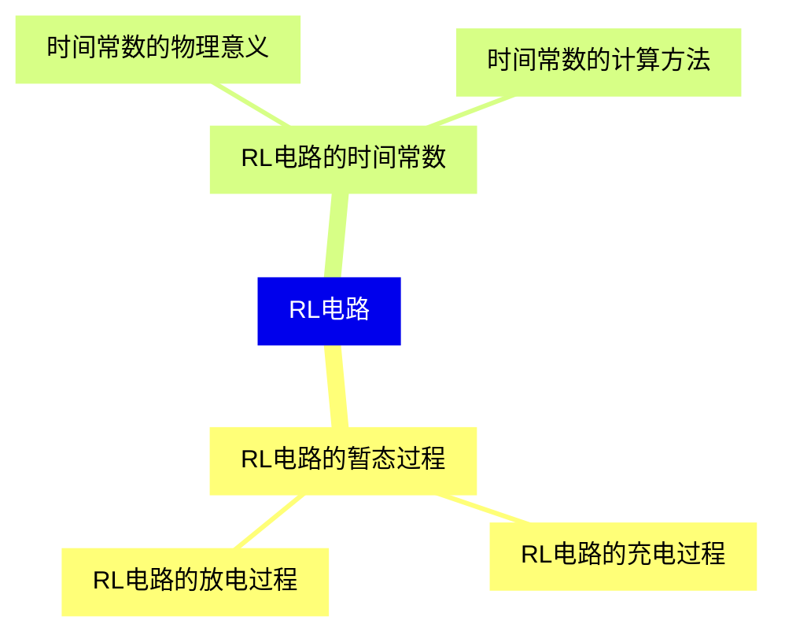

{}

### 9 交流电路中的电磁感应{#9}

{}
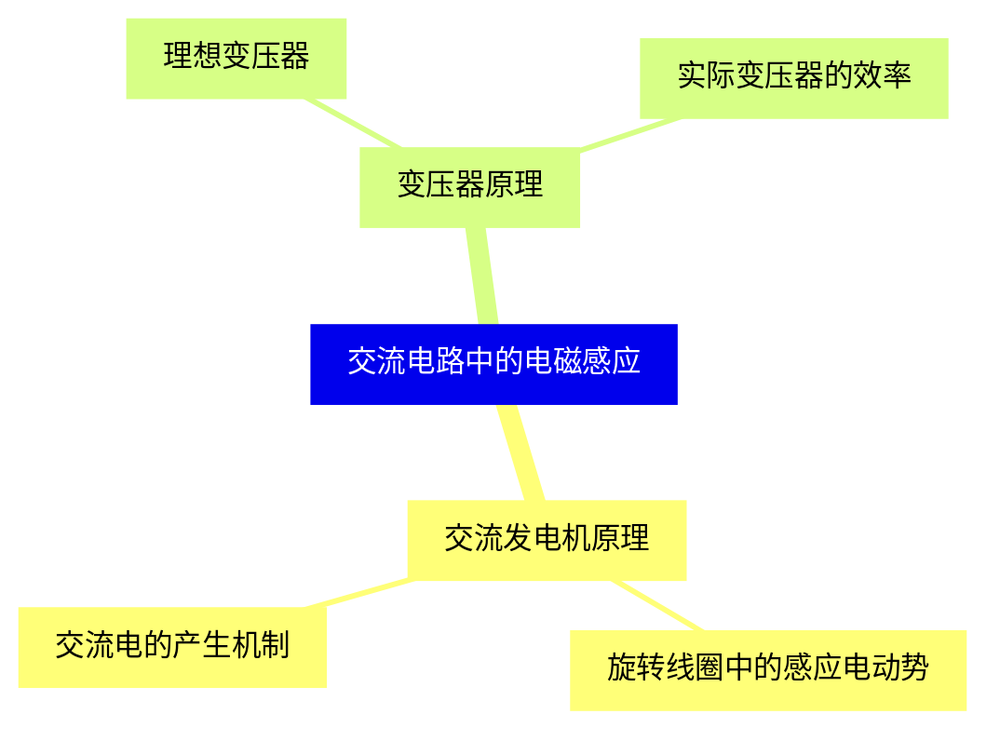

<--->
{}
{}
{}
{}
{}
{}
{}
{}
{}
{}
{}
{}
{}

### 10 涡电流{#10}

{}
{}
{}
{}
{}
{}
{}
{}
{}
{}
{}
{}
{}
<--->
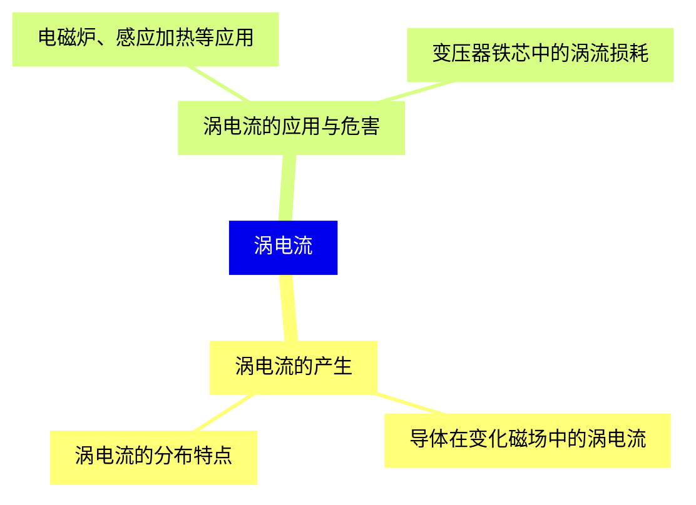

{}

### 11 电磁感应的实际应用{#11}

{}
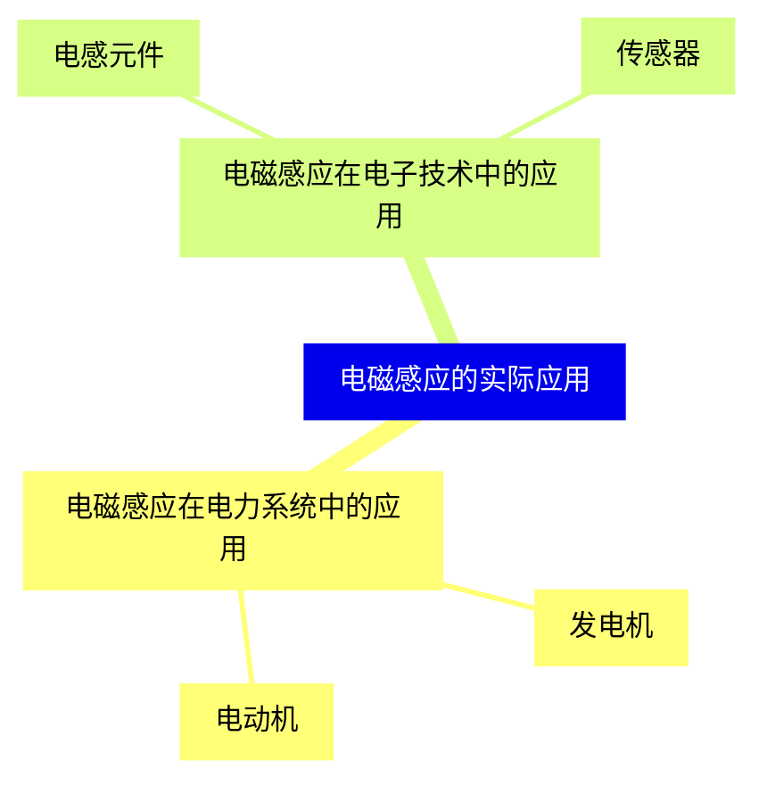

<--->
{}
{}
{}
{}
{}
{}
{}
{}
{}
{}
{}
{}
{}

### 12 电磁感应与电磁波{#12}

{}
{}
{}
{}
{}
{}
{}
{}
{}
{}
{}
{}
{}
<--->
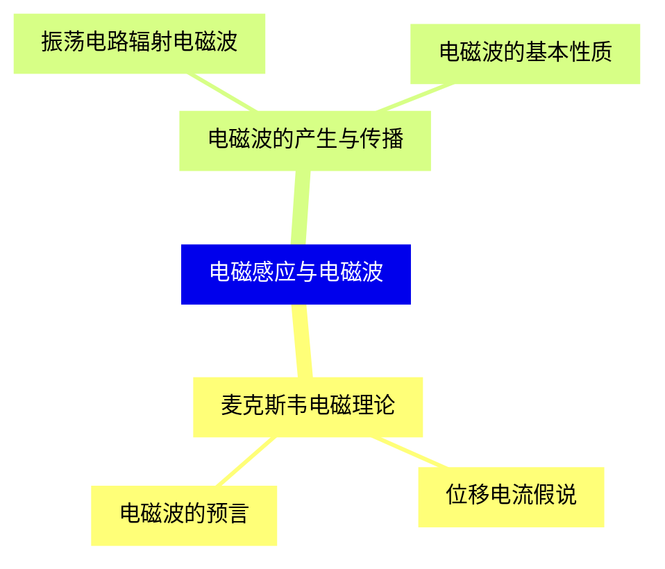

{}
