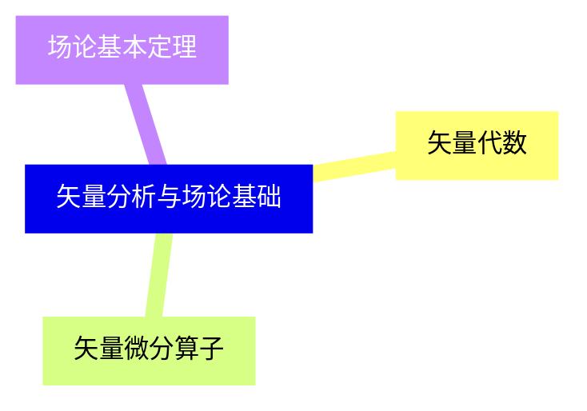
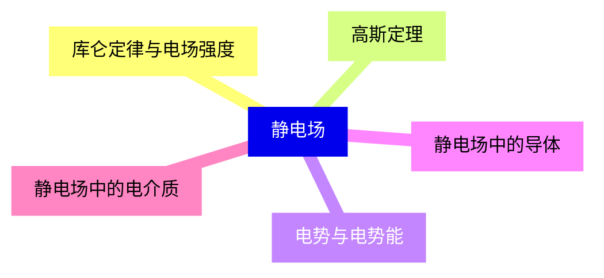
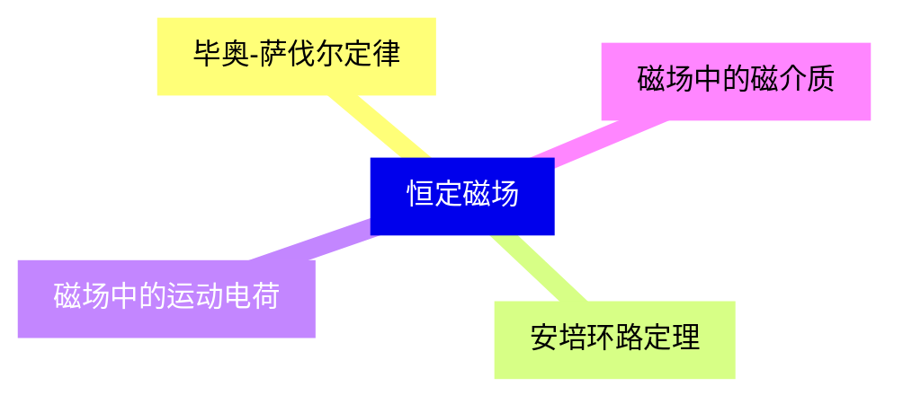
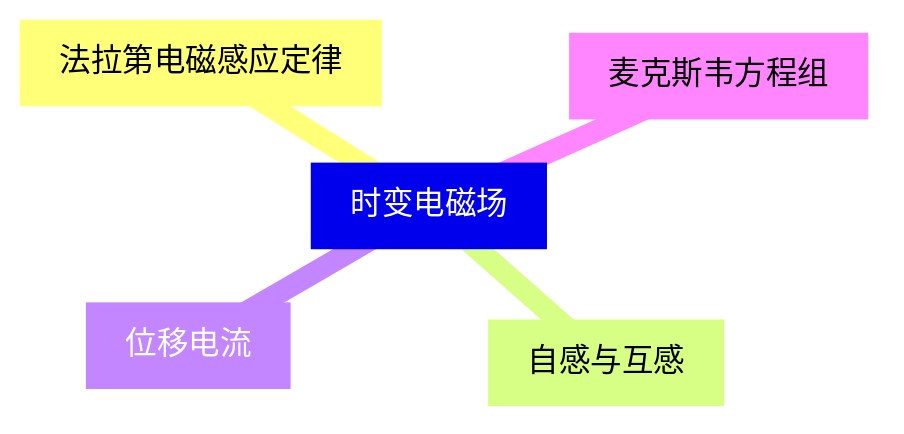
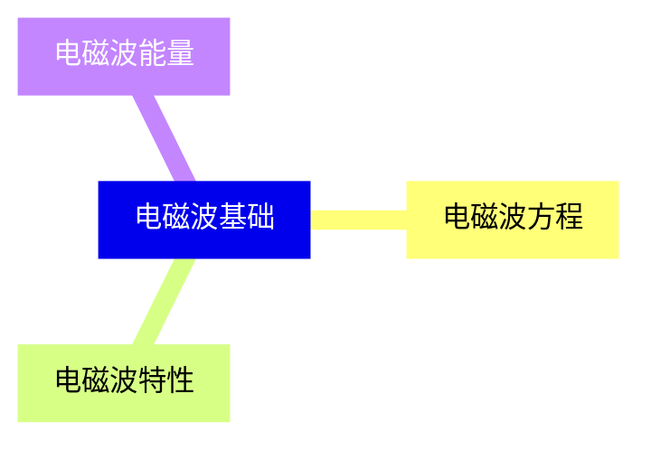
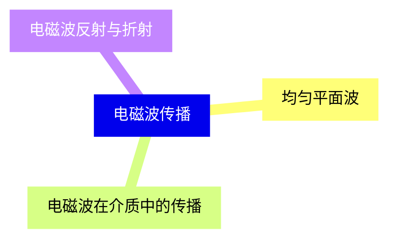
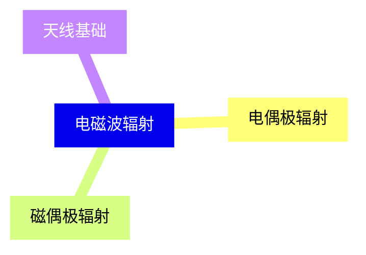
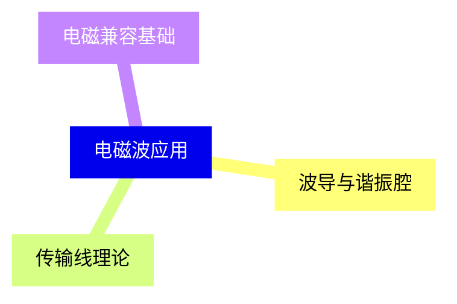
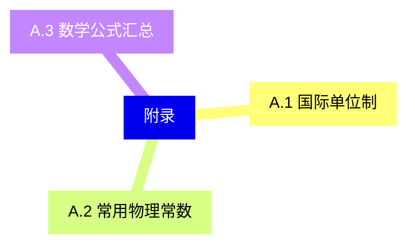


### 1 [矢量分析与场论基础](#1)
#### 1.1 [矢量代数](#1)
#### 1.2 [矢量微分算子](#1)
#### 1.3 [场论基本定理](#1)
### 2 [静电场](#2)
#### 2.1 [库仑定律与电场强度](#2)
#### 2.2 [高斯定理](#2)
#### 2.3 [电势与电势能](#2)
#### 2.4 [静电场中的导体](#2)
#### 2.5 [静电场中的电介质](#2)
### 3 [恒定磁场](#3)
#### 3.1 [毕奥-萨伐尔定律](#3)
#### 3.2 [安培环路定理](#3)
#### 3.3 [磁场中的运动电荷](#3)
#### 3.4 [磁场中的磁介质](#3)
### 4 [时变电磁场](#4)
#### 4.1 [法拉第电磁感应定律](#4)
#### 4.2 [自感与互感](#4)
#### 4.3 [位移电流](#4)
#### 4.4 [麦克斯韦方程组](#4)
### 5 [电磁波基础](#5)
#### 5.1 [电磁波方程](#5)
#### 5.2 [电磁波特性](#5)
#### 5.3 [电磁波能量](#5)
### 6 [电磁波传播](#6)
#### 6.1 [均匀平面波](#6)
#### 6.2 [电磁波在介质中的传播](#6)
#### 6.3 [电磁波反射与折射](#6)
### 7 [电磁波辐射](#7)
#### 7.1 [电偶极辐射](#7)
#### 7.2 [磁偶极辐射](#7)
#### 7.3 [天线基础](#7)
### 8 [电磁波应用](#8)
#### 8.1 [波导与谐振腔](#8)
#### 8.2 [传输线理论](#8)
#### 8.3 [电磁兼容基础](#8)
### 9 [相对论电动力学](#9)
#### 9.1 [狭义相对论基础](#9)
#### 9.2 [相对论电磁场](#9)
### 10 [附录](#10)
#### 10.1 [A.1 国际单位制](#10)
#### 10.2 [A.2 常用物理常数](#10)
#### 10.3 [A.3 数学公式汇总](#10)




### 1 矢量分析与场论基础
  - 1.1.1 矢量运算
  - 1.1.2 标量积与矢量积
  - 1.2.1 梯度
  - 1.2.2 散度
  - 1.2.3 旋度
  - 1.3.1 高斯散度定理
  - 1.3.2 斯托克斯旋度定理

---
### 1 矢量分析与场论基础
___
#### 1.1 矢量代数
___
#### 1.2 矢量微分算子
___
#### 1.3 场论基本定理
### 2 静电场
  - 2.1.1 点电荷电场
  - 2.1.2 连续电荷分布电场
  - 2.2.1 高斯定理应用
  - 2.2.2 对称性分析
  - 2.3.1 电势计算
  - 2.3.2 等势面
  - 2.4.1 导体静电平衡
  - 2.4.2 电容与电容器
  - 2.5.1 极化现象
  - 2.5.2 电位移矢量

---
### 2 静电场
___
#### 2.1 库仑定律与电场强度
___
#### 2.2 高斯定理
___
#### 2.3 电势与电势能
___
#### 2.4 静电场中的导体
___
#### 2.5 静电场中的电介质
### 3 恒定磁场
  - 3.1.1 电流元磁场
  - 3.1.2 典型电流分布磁场
  - 3.2.1 安培定理应用
  - 3.2.2 磁场对称性
  - 3.3.1 洛伦兹力
  - 3.3.2 霍尔效应
  - 3.4.1 磁化强度
  - 3.4.2 磁场强度

---
### 3 恒定磁场
___
#### 3.1 毕奥-萨伐尔定律
___
#### 3.2 安培环路定理
___
#### 3.3 磁场中的运动电荷
___
#### 3.4 磁场中的磁介质
### 4 时变电磁场
  - 4.1.1 动生电动势
  - 4.1.2 感生电动势
  - 4.2.1 自感系数
  - 4.2.2 互感系数
  - 4.3.1 位移电流概念
  - 4.3.2 安培环路定理修正
  - 4.4.1 积分形式
  - 4.4.2 微分形式

---
### 4 时变电磁场
___
#### 4.1 法拉第电磁感应定律
___
#### 4.2 自感与互感
___
#### 4.3 位移电流
___
#### 4.4 麦克斯韦方程组
### 5 电磁波基础
  - 5.1.1 波动方程推导
  - 5.1.2 平面波解
  - 5.2.1 横波特性
  - 5.2.2 偏振状态
  - 5.3.1 坡印廷矢量
  - 5.3.2 能量密度

---
### 5 电磁波基础
___
#### 5.1 电磁波方程
___
#### 5.2 电磁波特性
___
#### 5.3 电磁波能量
### 6 电磁波传播
  - 6.1.1 波动方程解
  - 6.1.2 波阻抗
  - 6.2.1 介电常数与磁导率
  - 6.2.2 损耗介质
  - 6.3.1 边界条件
  - 6.3.2 斯涅尔定律

---
### 6 电磁波传播
___
#### 6.1 均匀平面波
___
#### 6.2 电磁波在介质中的传播
___
#### 6.3 电磁波反射与折射
### 7 电磁波辐射
  - 7.1.1 振荡电偶极子
  - 7.1.2 辐射场分布
  - 7.2.1 振荡磁偶极子
  - 7.2.2 辐射特性比较
  - 7.3.1 天线参数
  - 7.3.2 基本天线类型

---
### 7 电磁波辐射
___
#### 7.1 电偶极辐射
___
#### 7.2 磁偶极辐射
___
#### 7.3 天线基础
### 8 电磁波应用
  - 8.1.1 矩形波导
  - 8.1.2 谐振腔模式
  - 8.2.1 分布参数电路
  - 8.2.2 阻抗匹配
  - 8.3.1 电磁干扰
  - 8.3.2 屏蔽技术

---
### 8 电磁波应用
___
#### 8.1 波导与谐振腔
___
#### 8.2 传输线理论
___
#### 8.3 电磁兼容基础
### 9 相对论电动力学
  - 9.1.1 洛伦兹变换
  - 9.1.2 四维矢量
  - 9.2.1 场张量
  - 9.2.2 协变形式

---
### 9 相对论电动力学
___
#### 9.1 狭义相对论基础
___
#### 9.2 相对论电磁场
### 10 附录

---
### 10 附录
___
#### 10.1 A.1 国际单位制
___
#### 10.2 A.2 常用物理常数
___
#### 10.3 A.3 数学公式汇总


### 1 矢量分析与场论基础{#1}
  - 1.1.1 矢量运算
  - 1.1.2 标量积与矢量积
  - 1.2.1 梯度
  - 1.2.2 散度
  - 1.2.3 旋度
  - 1.3.1 高斯散度定理
  - 1.3.2 斯托克斯旋度定理

{}

<--->
{}
{}
{}
{}
{}
{}
{}

### 2 静电场{#2}
  - 2.1.1 点电荷电场
  - 2.1.2 连续电荷分布电场
  - 2.2.1 高斯定理应用
  - 2.2.2 对称性分析
  - 2.3.1 电势计算
  - 2.3.2 等势面
  - 2.4.1 导体静电平衡
  - 2.4.2 电容与电容器
  - 2.5.1 极化现象
  - 2.5.2 电位移矢量

{}
{}
{}
{}
{}
{}
{}
{}
{}
{}
{}
<--->

{}

### 3 恒定磁场{#3}
  - 3.1.1 电流元磁场
  - 3.1.2 典型电流分布磁场
  - 3.2.1 安培定理应用
  - 3.2.2 磁场对称性
  - 3.3.1 洛伦兹力
  - 3.3.2 霍尔效应
  - 3.4.1 磁化强度
  - 3.4.2 磁场强度

{}

<--->
{}
{}
{}
{}
{}
{}
{}
{}
{}

### 4 时变电磁场{#4}
  - 4.1.1 动生电动势
  - 4.1.2 感生电动势
  - 4.2.1 自感系数
  - 4.2.2 互感系数
  - 4.3.1 位移电流概念
  - 4.3.2 安培环路定理修正
  - 4.4.1 积分形式
  - 4.4.2 微分形式

{}
{}
{}
{}
{}
{}
{}
{}
{}
<--->

{}

### 5 电磁波基础{#5}
  - 5.1.1 波动方程推导
  - 5.1.2 平面波解
  - 5.2.1 横波特性
  - 5.2.2 偏振状态
  - 5.3.1 坡印廷矢量
  - 5.3.2 能量密度

{}

<--->
{}
{}
{}
{}
{}
{}
{}

### 6 电磁波传播{#6}
  - 6.1.1 波动方程解
  - 6.1.2 波阻抗
  - 6.2.1 介电常数与磁导率
  - 6.2.2 损耗介质
  - 6.3.1 边界条件
  - 6.3.2 斯涅尔定律

{}
{}
{}
{}
{}
{}
{}
<--->

{}

### 7 电磁波辐射{#7}
  - 7.1.1 振荡电偶极子
  - 7.1.2 辐射场分布
  - 7.2.1 振荡磁偶极子
  - 7.2.2 辐射特性比较
  - 7.3.1 天线参数
  - 7.3.2 基本天线类型

{}

<--->
{}
{}
{}
{}
{}
{}
{}

### 8 电磁波应用{#8}
  - 8.1.1 矩形波导
  - 8.1.2 谐振腔模式
  - 8.2.1 分布参数电路
  - 8.2.2 阻抗匹配
  - 8.3.1 电磁干扰
  - 8.3.2 屏蔽技术

{}
{}
{}
{}
{}
{}
{}
<--->

{}

### 9 相对论电动力学{#9}
  - 9.1.1 洛伦兹变换
  - 9.1.2 四维矢量
  - 9.2.1 场张量
  - 9.2.2 协变形式

{}

<--->
{}
{}
{}
{}
{}

### 10 附录{#10}

{}
{}
{}
{}
{}
{}
{}
<--->

{}
