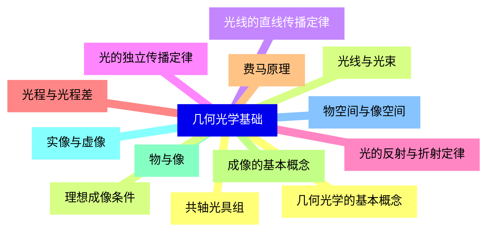
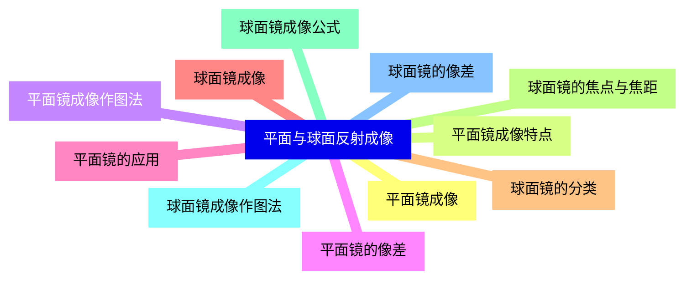
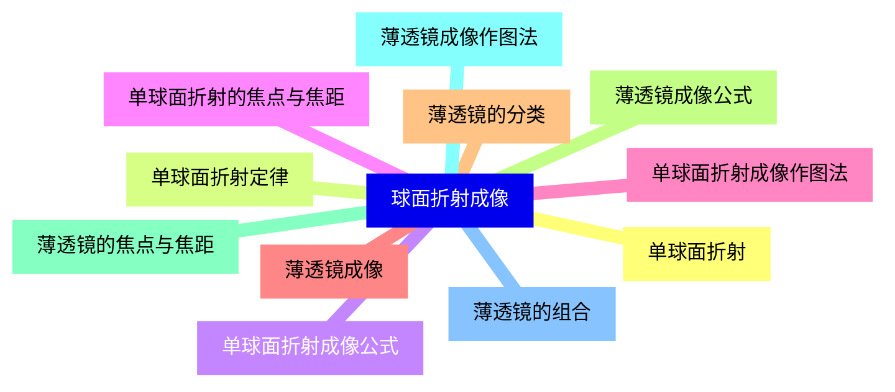
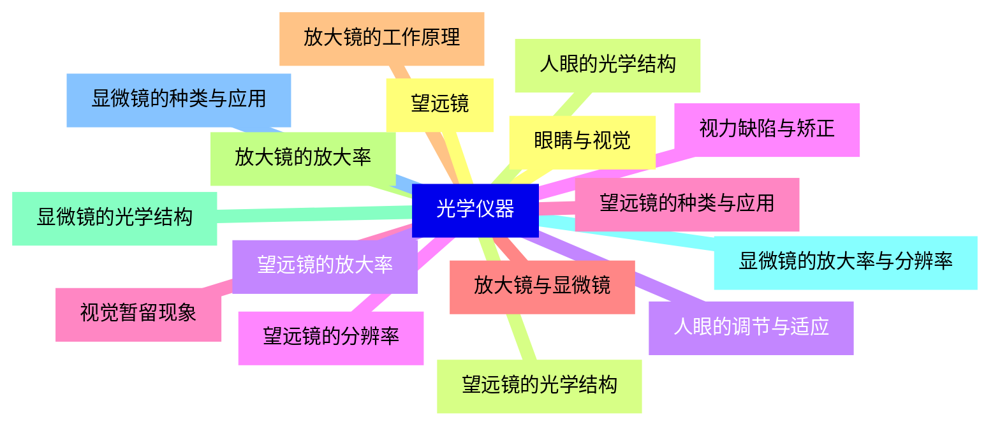
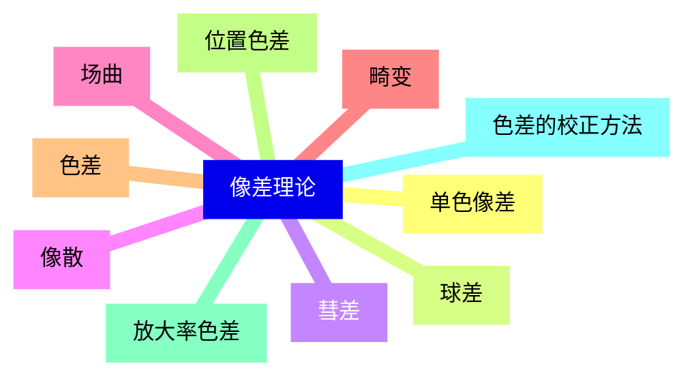
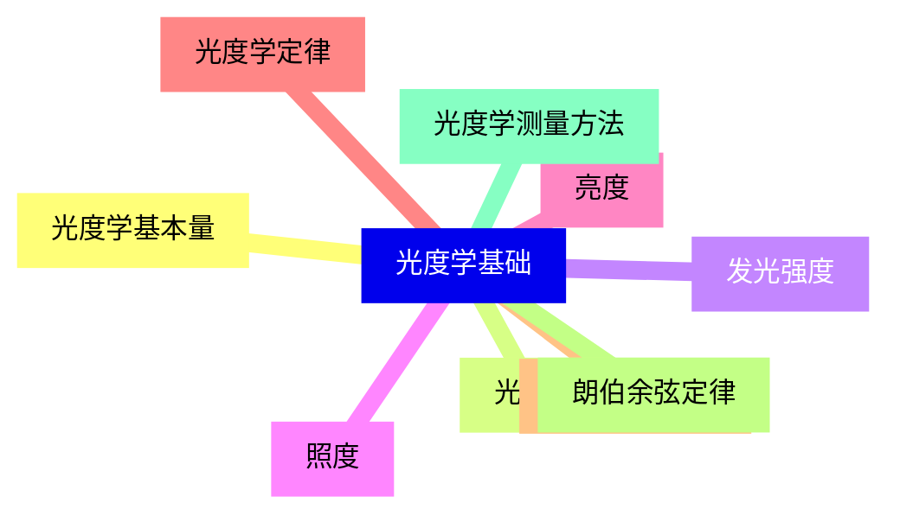
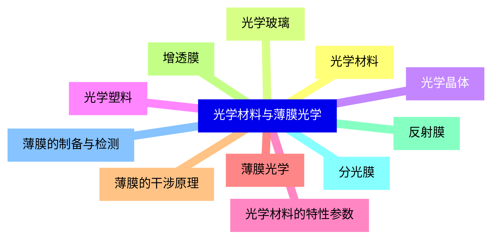
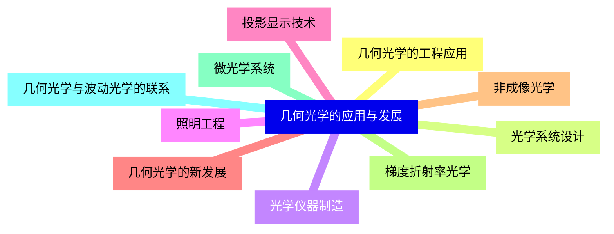


### 1 [几何光学基础](#1)
#### 1.1 [几何光学的基本概念](#1)
#### 1.2 [光线与光束](#1)
#### 1.3 [光线的直线传播定律](#1)
#### 1.4 [光的独立传播定律](#1)
#### 1.5 [光的反射与折射定律](#1)
#### 1.6 [光程与光程差](#1)
#### 1.7 [费马原理](#1)
#### 1.8 [成像的基本概念](#1)
#### 1.9 [物与像](#1)
#### 1.10 [实像与虚像](#1)
#### 1.11 [物空间与像空间](#1)
#### 1.12 [共轴光具组](#1)
#### 1.13 [理想成像条件](#1)
### 2 [平面与球面反射成像](#2)
#### 2.1 [平面镜成像](#2)
#### 2.2 [平面镜成像特点](#2)
#### 2.3 [平面镜成像作图法](#2)
#### 2.4 [平面镜的像差](#2)
#### 2.5 [平面镜的应用](#2)
#### 2.6 [球面镜成像](#2)
#### 2.7 [球面镜的分类](#2)
#### 2.8 [球面镜的焦点与焦距](#2)
#### 2.9 [球面镜成像公式](#2)
#### 2.10 [球面镜成像作图法](#2)
#### 2.11 [球面镜的像差](#2)
### 3 [球面折射成像](#3)
#### 3.1 [单球面折射](#3)
#### 3.2 [单球面折射定律](#3)
#### 3.3 [单球面折射成像公式](#3)
#### 3.4 [单球面折射的焦点与焦距](#3)
#### 3.5 [单球面折射成像作图法](#3)
#### 3.6 [薄透镜成像](#3)
#### 3.7 [薄透镜的分类](#3)
#### 3.8 [薄透镜成像公式](#3)
#### 3.9 [薄透镜的焦点与焦距](#3)
#### 3.10 [薄透镜成像作图法](#3)
#### 3.11 [薄透镜的组合](#3)
### 4 [光学仪器](#4)
#### 4.1 [眼睛与视觉](#4)
#### 4.2 [人眼的光学结构](#4)
#### 4.3 [人眼的调节与适应](#4)
#### 4.4 [视力缺陷与矫正](#4)
#### 4.5 [视觉暂留现象](#4)
#### 4.6 [放大镜与显微镜](#4)
#### 4.7 [放大镜的工作原理](#4)
#### 4.8 [放大镜的放大率](#4)
#### 4.9 [显微镜的光学结构](#4)
#### 4.10 [显微镜的放大率与分辨率](#4)
#### 4.11 [显微镜的种类与应用](#4)
#### 4.12 [望远镜](#4)
#### 4.13 [望远镜的光学结构](#4)
#### 4.14 [望远镜的放大率](#4)
#### 4.15 [望远镜的分辨率](#4)
#### 4.16 [望远镜的种类与应用](#4)
### 5 [像差理论](#5)
#### 5.1 [单色像差](#5)
#### 5.2 [球差](#5)
#### 5.3 [彗差](#5)
#### 5.4 [像散](#5)
#### 5.5 [场曲](#5)
#### 5.6 [畸变](#5)
#### 5.7 [色差](#5)
#### 5.8 [位置色差](#5)
#### 5.9 [放大率色差](#5)
#### 5.10 [色差的校正方法](#5)
### 6 [光度学基础](#6)
#### 6.1 [光度学基本量](#6)
#### 6.2 [光通量](#6)
#### 6.3 [发光强度](#6)
#### 6.4 [照度](#6)
#### 6.5 [亮度](#6)
#### 6.6 [光度学定律](#6)
#### 6.7 [平方反比定律](#6)
#### 6.8 [朗伯余弦定律](#6)
#### 6.9 [光度学测量方法](#6)
### 7 [光学材料与薄膜光学](#7)
#### 7.1 [光学材料](#7)
#### 7.2 [光学玻璃](#7)
#### 7.3 [光学晶体](#7)
#### 7.4 [光学塑料](#7)
#### 7.5 [光学材料的特性参数](#7)
#### 7.6 [薄膜光学](#7)
#### 7.7 [薄膜的干涉原理](#7)
#### 7.8 [增透膜](#7)
#### 7.9 [反射膜](#7)
#### 7.10 [分光膜](#7)
#### 7.11 [薄膜的制备与检测](#7)
### 8 [几何光学的应用与发展](#8)
#### 8.1 [几何光学的工程应用](#8)
#### 8.2 [光学系统设计](#8)
#### 8.3 [光学仪器制造](#8)
#### 8.4 [照明工程](#8)
#### 8.5 [投影显示技术](#8)
#### 8.6 [几何光学的新发展](#8)
#### 8.7 [非成像光学](#8)
#### 8.8 [梯度折射率光学](#8)
#### 8.9 [微光学系统](#8)
#### 8.10 [几何光学与波动光学的联系](#8)




### 1 几何光学基础

---
### 1 几何光学基础
___
#### 1.1 几何光学的基本概念
___
#### 1.2 光线与光束
___
#### 1.3 光线的直线传播定律
___
#### 1.4 光的独立传播定律
___
#### 1.5 光的反射与折射定律
___
#### 1.6 光程与光程差
___
#### 1.7 费马原理
___
#### 1.8 成像的基本概念
___
#### 1.9 物与像
___
#### 1.10 实像与虚像
___
#### 1.11 物空间与像空间
___
#### 1.12 共轴光具组
___
#### 1.13 理想成像条件
### 2 平面与球面反射成像

---
### 2 平面与球面反射成像
___
#### 2.1 平面镜成像
___
#### 2.2 平面镜成像特点
___
#### 2.3 平面镜成像作图法
___
#### 2.4 平面镜的像差
___
#### 2.5 平面镜的应用
___
#### 2.6 球面镜成像
___
#### 2.7 球面镜的分类
___
#### 2.8 球面镜的焦点与焦距
___
#### 2.9 球面镜成像公式
___
#### 2.10 球面镜成像作图法
___
#### 2.11 球面镜的像差
### 3 球面折射成像

---
### 3 球面折射成像
___
#### 3.1 单球面折射
___
#### 3.2 单球面折射定律
___
#### 3.3 单球面折射成像公式
___
#### 3.4 单球面折射的焦点与焦距
___
#### 3.5 单球面折射成像作图法
___
#### 3.6 薄透镜成像
___
#### 3.7 薄透镜的分类
___
#### 3.8 薄透镜成像公式
___
#### 3.9 薄透镜的焦点与焦距
___
#### 3.10 薄透镜成像作图法
___
#### 3.11 薄透镜的组合
### 4 光学仪器

---
### 4 光学仪器
___
#### 4.1 眼睛与视觉
___
#### 4.2 人眼的光学结构
___
#### 4.3 人眼的调节与适应
___
#### 4.4 视力缺陷与矫正
___
#### 4.5 视觉暂留现象
___
#### 4.6 放大镜与显微镜
___
#### 4.7 放大镜的工作原理
___
#### 4.8 放大镜的放大率
___
#### 4.9 显微镜的光学结构
___
#### 4.10 显微镜的放大率与分辨率
___
#### 4.11 显微镜的种类与应用
___
#### 4.12 望远镜
___
#### 4.13 望远镜的光学结构
___
#### 4.14 望远镜的放大率
___
#### 4.15 望远镜的分辨率
___
#### 4.16 望远镜的种类与应用
### 5 像差理论

---
### 5 像差理论
___
#### 5.1 单色像差
___
#### 5.2 球差
___
#### 5.3 彗差
___
#### 5.4 像散
___
#### 5.5 场曲
___
#### 5.6 畸变
___
#### 5.7 色差
___
#### 5.8 位置色差
___
#### 5.9 放大率色差
___
#### 5.10 色差的校正方法
### 6 光度学基础

---
### 6 光度学基础
___
#### 6.1 光度学基本量
___
#### 6.2 光通量
___
#### 6.3 发光强度
___
#### 6.4 照度
___
#### 6.5 亮度
___
#### 6.6 光度学定律
___
#### 6.7 平方反比定律
___
#### 6.8 朗伯余弦定律
___
#### 6.9 光度学测量方法
### 7 光学材料与薄膜光学

---
### 7 光学材料与薄膜光学
___
#### 7.1 光学材料
___
#### 7.2 光学玻璃
___
#### 7.3 光学晶体
___
#### 7.4 光学塑料
___
#### 7.5 光学材料的特性参数
___
#### 7.6 薄膜光学
___
#### 7.7 薄膜的干涉原理
___
#### 7.8 增透膜
___
#### 7.9 反射膜
___
#### 7.10 分光膜
___
#### 7.11 薄膜的制备与检测
### 8 几何光学的应用与发展

---
### 8 几何光学的应用与发展
___
#### 8.1 几何光学的工程应用
___
#### 8.2 光学系统设计
___
#### 8.3 光学仪器制造
___
#### 8.4 照明工程
___
#### 8.5 投影显示技术
___
#### 8.6 几何光学的新发展
___
#### 8.7 非成像光学
___
#### 8.8 梯度折射率光学
___
#### 8.9 微光学系统
___
#### 8.10 几何光学与波动光学的联系


### 1 几何光学基础{#1}

{}

<--->
{}
{}
{}
{}
{}
{}
{}
{}
{}
{}
{}
{}
{}
{}
{}
{}
{}
{}
{}
{}
{}
{}
{}
{}
{}
{}
{}

### 2 平面与球面反射成像{#2}

{}
{}
{}
{}
{}
{}
{}
{}
{}
{}
{}
{}
{}
{}
{}
{}
{}
{}
{}
{}
{}
{}
{}
<--->

{}

### 3 球面折射成像{#3}

{}

<--->
{}
{}
{}
{}
{}
{}
{}
{}
{}
{}
{}
{}
{}
{}
{}
{}
{}
{}
{}
{}
{}
{}
{}

### 4 光学仪器{#4}

{}
{}
{}
{}
{}
{}
{}
{}
{}
{}
{}
{}
{}
{}
{}
{}
{}
{}
{}
{}
{}
{}
{}
{}
{}
{}
{}
{}
{}
{}
{}
{}
{}
<--->

{}

### 5 像差理论{#5}

{}

<--->
{}
{}
{}
{}
{}
{}
{}
{}
{}
{}
{}
{}
{}
{}
{}
{}
{}
{}
{}
{}
{}

### 6 光度学基础{#6}

{}
{}
{}
{}
{}
{}
{}
{}
{}
{}
{}
{}
{}
{}
{}
{}
{}
{}
{}
<--->

{}

### 7 光学材料与薄膜光学{#7}

{}

<--->
{}
{}
{}
{}
{}
{}
{}
{}
{}
{}
{}
{}
{}
{}
{}
{}
{}
{}
{}
{}
{}
{}
{}

### 8 几何光学的应用与发展{#8}

{}
{}
{}
{}
{}
{}
{}
{}
{}
{}
{}
{}
{}
{}
{}
{}
{}
{}
{}
{}
{}
<--->

{}
