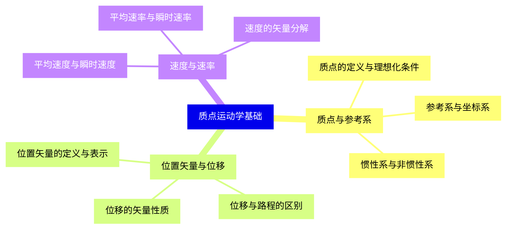
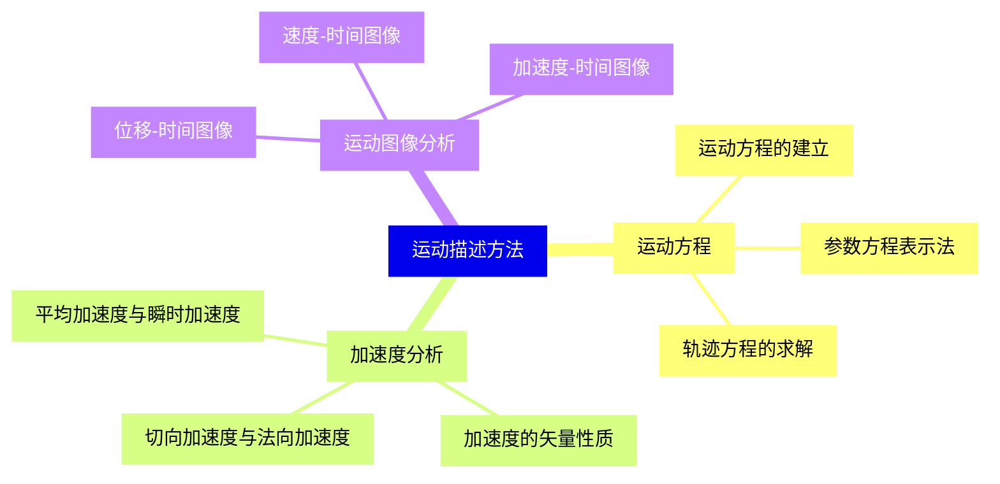
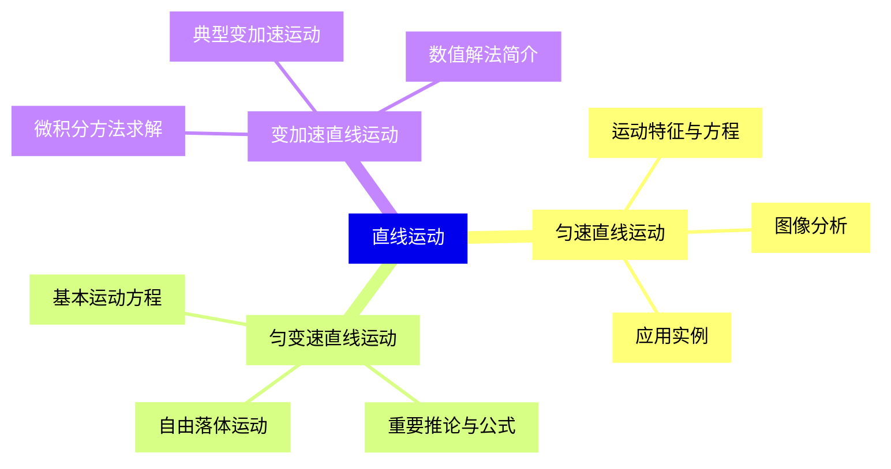
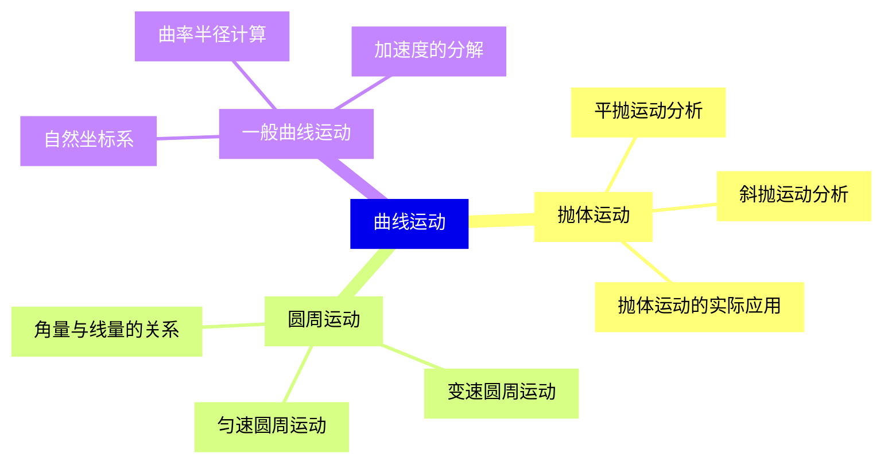
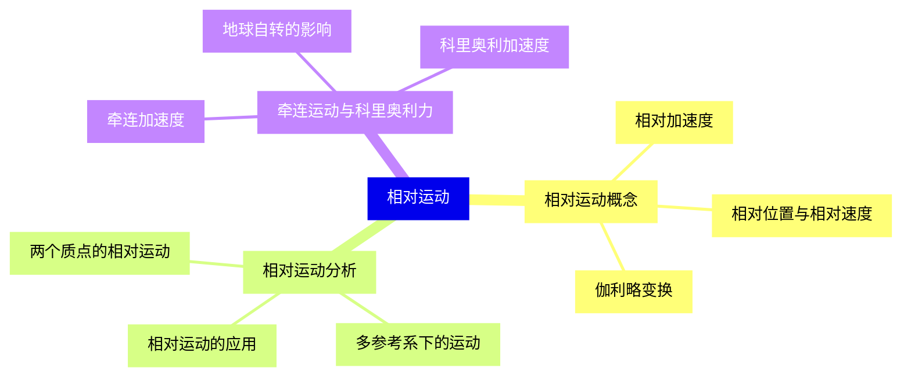
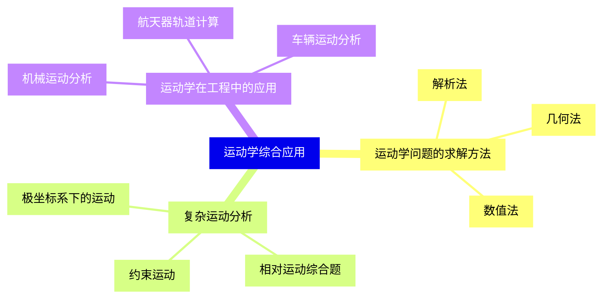
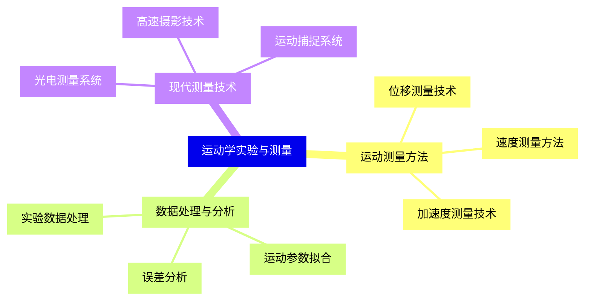


### 1 [质点运动学基础](#1)
#### 1.1 [质点与参考系](#1)
##### 1.1.1 [质点的定义与理想化条件](#1)
##### 1.1.2 [参考系与坐标系](#1)
##### 1.1.3 [惯性系与非惯性系](#1)
#### 1.2 [位置矢量与位移](#1)
##### 1.2.1 [位置矢量的定义与表示](#1)
##### 1.2.2 [位移与路程的区别](#1)
##### 1.2.3 [位移的矢量性质](#1)
#### 1.3 [速度与速率](#1)
##### 1.3.1 [平均速度与瞬时速度](#1)
##### 1.3.2 [平均速率与瞬时速率](#1)
##### 1.3.3 [速度的矢量分解](#1)
### 2 [运动描述方法](#2)
#### 2.1 [运动方程](#2)
##### 2.1.1 [运动方程的建立](#2)
##### 2.1.2 [参数方程表示法](#2)
##### 2.1.3 [轨迹方程的求解](#2)
#### 2.2 [加速度分析](#2)
##### 2.2.1 [平均加速度与瞬时加速度](#2)
##### 2.2.2 [加速度的矢量性质](#2)
##### 2.2.3 [切向加速度与法向加速度](#2)
#### 2.3 [运动图像分析](#2)
##### 2.3.1 [位移-时间图像](#2)
##### 2.3.2 [速度-时间图像](#2)
##### 2.3.3 [加速度-时间图像](#2)
### 3 [直线运动](#3)
#### 3.1 [匀速直线运动](#3)
##### 3.1.1 [运动特征与方程](#3)
##### 3.1.2 [图像分析](#3)
##### 3.1.3 [应用实例](#3)
#### 3.2 [匀变速直线运动](#3)
##### 3.2.1 [基本运动方程](#3)
##### 3.2.2 [重要推论与公式](#3)
##### 3.2.3 [自由落体运动](#3)
#### 3.3 [变加速直线运动](#3)
##### 3.3.1 [微积分方法求解](#3)
##### 3.3.2 [典型变加速运动](#3)
##### 3.3.3 [数值解法简介](#3)
### 4 [曲线运动](#4)
#### 4.1 [抛体运动](#4)
##### 4.1.1 [平抛运动分析](#4)
##### 4.1.2 [斜抛运动分析](#4)
##### 4.1.3 [抛体运动的实际应用](#4)
#### 4.2 [圆周运动](#4)
##### 4.2.1 [角量与线量的关系](#4)
##### 4.2.2 [匀速圆周运动](#4)
##### 4.2.3 [变速圆周运动](#4)
#### 4.3 [一般曲线运动](#4)
##### 4.3.1 [自然坐标系](#4)
##### 4.3.2 [曲率半径计算](#4)
##### 4.3.3 [加速度的分解](#4)
### 5 [相对运动](#5)
#### 5.1 [相对运动概念](#5)
##### 5.1.1 [相对位置与相对速度](#5)
##### 5.1.2 [相对加速度](#5)
##### 5.1.3 [伽利略变换](#5)
#### 5.2 [相对运动分析](#5)
##### 5.2.1 [两个质点的相对运动](#5)
##### 5.2.2 [多参考系下的运动](#5)
##### 5.2.3 [相对运动的应用](#5)
#### 5.3 [牵连运动与科里奥利力](#5)
##### 5.3.1 [牵连加速度](#5)
##### 5.3.2 [科里奥利加速度](#5)
##### 5.3.3 [地球自转的影响](#5)
### 6 [运动学综合应用](#6)
#### 6.1 [运动学问题的求解方法](#6)
##### 6.1.1 [解析法](#6)
##### 6.1.2 [几何法](#6)
##### 6.1.3 [数值法](#6)
#### 6.2 [复杂运动分析](#6)
##### 6.2.1 [约束运动](#6)
##### 6.2.2 [相对运动综合题](#6)
##### 6.2.3 [极坐标系下的运动](#6)
#### 6.3 [运动学在工程中的应用](#6)
##### 6.3.1 [机械运动分析](#6)
##### 6.3.2 [航天器轨道计算](#6)
##### 6.3.3 [车辆运动分析](#6)
### 7 [运动学实验与测量](#7)
#### 7.1 [运动测量方法](#7)
##### 7.1.1 [位移测量技术](#7)
##### 7.1.2 [速度测量方法](#7)
##### 7.1.3 [加速度测量技术](#7)
#### 7.2 [数据处理与分析](#7)
##### 7.2.1 [实验数据处理](#7)
##### 7.2.2 [误差分析](#7)
##### 7.2.3 [运动参数拟合](#7)
#### 7.3 [现代测量技术](#7)
##### 7.3.1 [光电测量系统](#7)
##### 7.3.2 [高速摄影技术](#7)
##### 7.3.3 [运动捕捉系统](#7)




### 1 质点运动学基础

---
### 1 质点运动学基础
___
#### 1.1 质点与参考系
___
##### 1.1.1 质点的定义与理想化条件
___
##### 1.1.2 参考系与坐标系
___
##### 1.1.3 惯性系与非惯性系
___
#### 1.2 位置矢量与位移
___
##### 1.2.1 位置矢量的定义与表示
___
##### 1.2.2 位移与路程的区别
___
##### 1.2.3 位移的矢量性质
___
#### 1.3 速度与速率
___
##### 1.3.1 平均速度与瞬时速度
___
##### 1.3.2 平均速率与瞬时速率
___
##### 1.3.3 速度的矢量分解
### 2 运动描述方法

---
### 2 运动描述方法
___
#### 2.1 运动方程
___
##### 2.1.1 运动方程的建立
___
##### 2.1.2 参数方程表示法
___
##### 2.1.3 轨迹方程的求解
___
#### 2.2 加速度分析
___
##### 2.2.1 平均加速度与瞬时加速度
___
##### 2.2.2 加速度的矢量性质
___
##### 2.2.3 切向加速度与法向加速度
___
#### 2.3 运动图像分析
___
##### 2.3.1 位移-时间图像
___
##### 2.3.2 速度-时间图像
___
##### 2.3.3 加速度-时间图像
### 3 直线运动

---
### 3 直线运动
___
#### 3.1 匀速直线运动
___
##### 3.1.1 运动特征与方程
___
##### 3.1.2 图像分析
___
##### 3.1.3 应用实例
___
#### 3.2 匀变速直线运动
___
##### 3.2.1 基本运动方程
___
##### 3.2.2 重要推论与公式
___
##### 3.2.3 自由落体运动
___
#### 3.3 变加速直线运动
___
##### 3.3.1 微积分方法求解
___
##### 3.3.2 典型变加速运动
___
##### 3.3.3 数值解法简介
### 4 曲线运动

---
### 4 曲线运动
___
#### 4.1 抛体运动
___
##### 4.1.1 平抛运动分析
___
##### 4.1.2 斜抛运动分析
___
##### 4.1.3 抛体运动的实际应用
___
#### 4.2 圆周运动
___
##### 4.2.1 角量与线量的关系
___
##### 4.2.2 匀速圆周运动
___
##### 4.2.3 变速圆周运动
___
#### 4.3 一般曲线运动
___
##### 4.3.1 自然坐标系
___
##### 4.3.2 曲率半径计算
___
##### 4.3.3 加速度的分解
### 5 相对运动

---
### 5 相对运动
___
#### 5.1 相对运动概念
___
##### 5.1.1 相对位置与相对速度
___
##### 5.1.2 相对加速度
___
##### 5.1.3 伽利略变换
___
#### 5.2 相对运动分析
___
##### 5.2.1 两个质点的相对运动
___
##### 5.2.2 多参考系下的运动
___
##### 5.2.3 相对运动的应用
___
#### 5.3 牵连运动与科里奥利力
___
##### 5.3.1 牵连加速度
___
##### 5.3.2 科里奥利加速度
___
##### 5.3.3 地球自转的影响
### 6 运动学综合应用

---
### 6 运动学综合应用
___
#### 6.1 运动学问题的求解方法
___
##### 6.1.1 解析法
___
##### 6.1.2 几何法
___
##### 6.1.3 数值法
___
#### 6.2 复杂运动分析
___
##### 6.2.1 约束运动
___
##### 6.2.2 相对运动综合题
___
##### 6.2.3 极坐标系下的运动
___
#### 6.3 运动学在工程中的应用
___
##### 6.3.1 机械运动分析
___
##### 6.3.2 航天器轨道计算
___
##### 6.3.3 车辆运动分析
### 7 运动学实验与测量

---
### 7 运动学实验与测量
___
#### 7.1 运动测量方法
___
##### 7.1.1 位移测量技术
___
##### 7.1.2 速度测量方法
___
##### 7.1.3 加速度测量技术
___
#### 7.2 数据处理与分析
___
##### 7.2.1 实验数据处理
___
##### 7.2.2 误差分析
___
##### 7.2.3 运动参数拟合
___
#### 7.3 现代测量技术
___
##### 7.3.1 光电测量系统
___
##### 7.3.2 高速摄影技术
___
##### 7.3.3 运动捕捉系统


### 1 质点运动学基础{#1}

{}

<--->
{}
{}
{}
{}
{}
{}
{}
{}
{}
{}
{}
{}
{}
{}
{}
{}
{}
{}
{}
{}
{}
{}
{}
{}
{}

### 2 运动描述方法{#2}

{}
{}
{}
{}
{}
{}
{}
{}
{}
{}
{}
{}
{}
{}
{}
{}
{}
{}
{}
{}
{}
{}
{}
{}
{}
<--->

{}

### 3 直线运动{#3}

{}

<--->
{}
{}
{}
{}
{}
{}
{}
{}
{}
{}
{}
{}
{}
{}
{}
{}
{}
{}
{}
{}
{}
{}
{}
{}
{}

### 4 曲线运动{#4}

{}
{}
{}
{}
{}
{}
{}
{}
{}
{}
{}
{}
{}
{}
{}
{}
{}
{}
{}
{}
{}
{}
{}
{}
{}
<--->

{}

### 5 相对运动{#5}

{}

<--->
{}
{}
{}
{}
{}
{}
{}
{}
{}
{}
{}
{}
{}
{}
{}
{}
{}
{}
{}
{}
{}
{}
{}
{}
{}

### 6 运动学综合应用{#6}

{}
{}
{}
{}
{}
{}
{}
{}
{}
{}
{}
{}
{}
{}
{}
{}
{}
{}
{}
{}
{}
{}
{}
{}
{}
<--->

{}

### 7 运动学实验与测量{#7}

{}

<--->
{}
{}
{}
{}
{}
{}
{}
{}
{}
{}
{}
{}
{}
{}
{}
{}
{}
{}
{}
{}
{}
{}
{}
{}
{}
