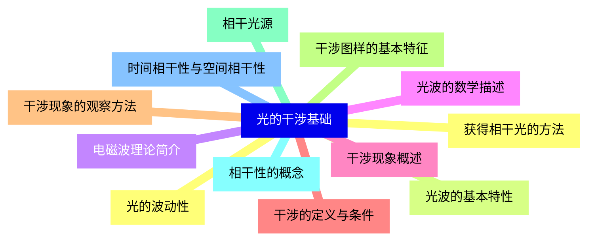
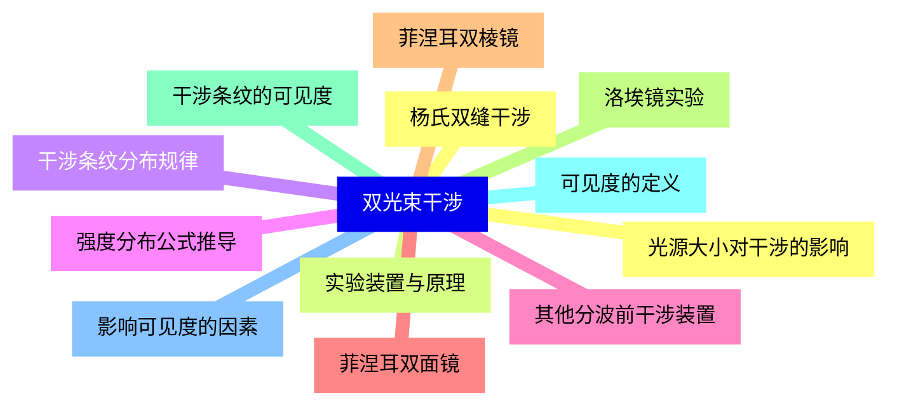
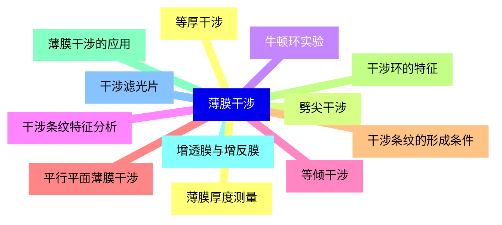
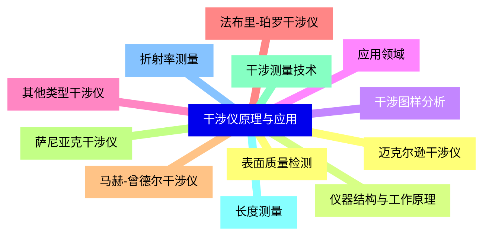
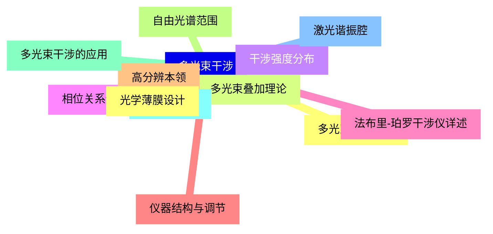
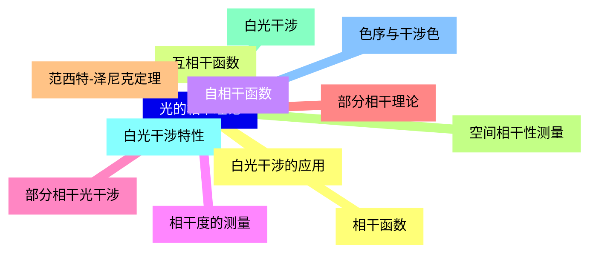
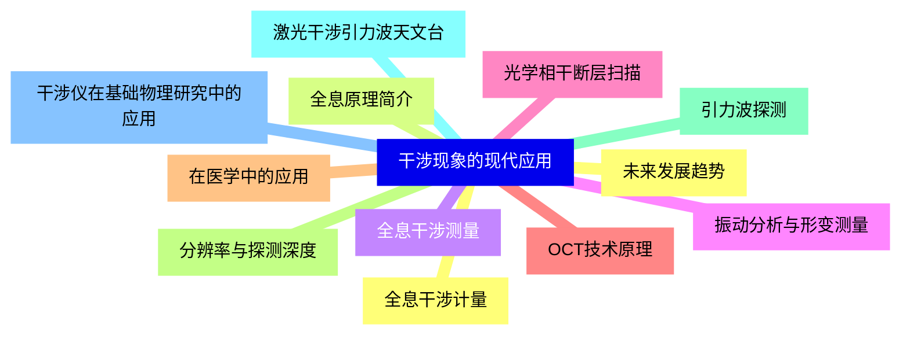
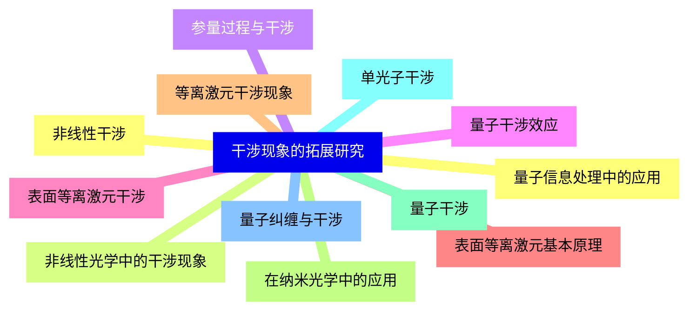


### 1 [光的干涉基础](#1)
#### 1.1 [光的波动性](#1)
#### 1.2 [光波的基本特性](#1)
#### 1.3 [电磁波理论简介](#1)
#### 1.4 [光波的数学描述](#1)
#### 1.5 [干涉现象概述](#1)
#### 1.6 [干涉的定义与条件](#1)
#### 1.7 [干涉现象的观察方法](#1)
#### 1.8 [干涉图样的基本特征](#1)
#### 1.9 [相干光源](#1)
#### 1.10 [相干性的概念](#1)
#### 1.11 [时间相干性与空间相干性](#1)
#### 1.12 [获得相干光的方法](#1)
### 2 [双光束干涉](#2)
#### 2.1 [杨氏双缝干涉](#2)
#### 2.2 [实验装置与原理](#2)
#### 2.3 [干涉条纹分布规律](#2)
#### 2.4 [强度分布公式推导](#2)
#### 2.5 [其他分波前干涉装置](#2)
#### 2.6 [菲涅耳双面镜](#2)
#### 2.7 [菲涅耳双棱镜](#2)
#### 2.8 [洛埃镜实验](#2)
#### 2.9 [干涉条纹的可见度](#2)
#### 2.10 [可见度的定义](#2)
#### 2.11 [影响可见度的因素](#2)
#### 2.12 [光源大小对干涉的影响](#2)
### 3 [薄膜干涉](#3)
#### 3.1 [等厚干涉](#3)
#### 3.2 [劈尖干涉](#3)
#### 3.3 [牛顿环实验](#3)
#### 3.4 [干涉条纹特征分析](#3)
#### 3.5 [等倾干涉](#3)
#### 3.6 [平行平面薄膜干涉](#3)
#### 3.7 [干涉条纹的形成条件](#3)
#### 3.8 [干涉环的特征](#3)
#### 3.9 [薄膜干涉的应用](#3)
#### 3.10 [增透膜与增反膜](#3)
#### 3.11 [干涉滤光片](#3)
#### 3.12 [薄膜厚度测量](#3)
### 4 [干涉仪原理与应用](#4)
#### 4.1 [迈克尔逊干涉仪](#4)
#### 4.2 [仪器结构与工作原理](#4)
#### 4.3 [干涉图样分析](#4)
#### 4.4 [应用领域](#4)
#### 4.5 [其他类型干涉仪](#4)
#### 4.6 [法布里-珀罗干涉仪](#4)
#### 4.7 [马赫-曾德尔干涉仪](#4)
#### 4.8 [萨尼亚克干涉仪](#4)
#### 4.9 [干涉测量技术](#4)
#### 4.10 [长度测量](#4)
#### 4.11 [折射率测量](#4)
#### 4.12 [表面质量检测](#4)
### 5 [多光束干涉](#5)
#### 5.1 [多光束干涉原理](#5)
#### 5.2 [多光束叠加理论](#5)
#### 5.3 [干涉强度分布](#5)
#### 5.4 [相位关系分析](#5)
#### 5.5 [法布里-珀罗干涉仪详述](#5)
#### 5.6 [仪器结构与调节](#5)
#### 5.7 [高分辨本领](#5)
#### 5.8 [自由光谱范围](#5)
#### 5.9 [多光束干涉的应用](#5)
#### 5.10 [光谱学应用](#5)
#### 5.11 [激光谐振腔](#5)
#### 5.12 [光学薄膜设计](#5)
### 6 [光的相干理论](#6)
#### 6.1 [相干函数](#6)
#### 6.2 [互相干函数](#6)
#### 6.3 [自相干函数](#6)
#### 6.4 [相干度的测量](#6)
#### 6.5 [部分相干光干涉](#6)
#### 6.6 [部分相干理论](#6)
#### 6.7 [范西特-泽尼克定理](#6)
#### 6.8 [空间相干性测量](#6)
#### 6.9 [白光干涉](#6)
#### 6.10 [白光干涉特性](#6)
#### 6.11 [色序与干涉色](#6)
#### 6.12 [白光干涉的应用](#6)
### 7 [干涉现象的现代应用](#7)
#### 7.1 [全息干涉计量](#7)
#### 7.2 [全息原理简介](#7)
#### 7.3 [全息干涉测量](#7)
#### 7.4 [振动分析与形变测量](#7)
#### 7.5 [光学相干断层扫描](#7)
#### 7.6 [OCT技术原理](#7)
#### 7.7 [在医学中的应用](#7)
#### 7.8 [分辨率与探测深度](#7)
#### 7.9 [引力波探测](#7)
#### 7.10 [激光干涉引力波天文台](#7)
#### 7.11 [干涉仪在基础物理研究中的应用](#7)
#### 7.12 [未来发展趋势](#7)
### 8 [干涉现象的拓展研究](#8)
#### 8.1 [非线性干涉](#8)
#### 8.2 [非线性光学中的干涉现象](#8)
#### 8.3 [参量过程与干涉](#8)
#### 8.4 [量子干涉效应](#8)
#### 8.5 [表面等离激元干涉](#8)
#### 8.6 [表面等离激元基本原理](#8)
#### 8.7 [等离激元干涉现象](#8)
#### 8.8 [在纳米光学中的应用](#8)
#### 8.9 [量子干涉](#8)
#### 8.10 [单光子干涉](#8)
#### 8.11 [量子纠缠与干涉](#8)
#### 8.12 [量子信息处理中的应用](#8)




### 1 光的干涉基础

---
### 1 光的干涉基础
___
#### 1.1 光的波动性
___
#### 1.2 光波的基本特性
___
#### 1.3 电磁波理论简介
___
#### 1.4 光波的数学描述
___
#### 1.5 干涉现象概述
___
#### 1.6 干涉的定义与条件
___
#### 1.7 干涉现象的观察方法
___
#### 1.8 干涉图样的基本特征
___
#### 1.9 相干光源
___
#### 1.10 相干性的概念
___
#### 1.11 时间相干性与空间相干性
___
#### 1.12 获得相干光的方法
### 2 双光束干涉

---
### 2 双光束干涉
___
#### 2.1 杨氏双缝干涉
___
#### 2.2 实验装置与原理
___
#### 2.3 干涉条纹分布规律
___
#### 2.4 强度分布公式推导
___
#### 2.5 其他分波前干涉装置
___
#### 2.6 菲涅耳双面镜
___
#### 2.7 菲涅耳双棱镜
___
#### 2.8 洛埃镜实验
___
#### 2.9 干涉条纹的可见度
___
#### 2.10 可见度的定义
___
#### 2.11 影响可见度的因素
___
#### 2.12 光源大小对干涉的影响
### 3 薄膜干涉

---
### 3 薄膜干涉
___
#### 3.1 等厚干涉
___
#### 3.2 劈尖干涉
___
#### 3.3 牛顿环实验
___
#### 3.4 干涉条纹特征分析
___
#### 3.5 等倾干涉
___
#### 3.6 平行平面薄膜干涉
___
#### 3.7 干涉条纹的形成条件
___
#### 3.8 干涉环的特征
___
#### 3.9 薄膜干涉的应用
___
#### 3.10 增透膜与增反膜
___
#### 3.11 干涉滤光片
___
#### 3.12 薄膜厚度测量
### 4 干涉仪原理与应用

---
### 4 干涉仪原理与应用
___
#### 4.1 迈克尔逊干涉仪
___
#### 4.2 仪器结构与工作原理
___
#### 4.3 干涉图样分析
___
#### 4.4 应用领域
___
#### 4.5 其他类型干涉仪
___
#### 4.6 法布里-珀罗干涉仪
___
#### 4.7 马赫-曾德尔干涉仪
___
#### 4.8 萨尼亚克干涉仪
___
#### 4.9 干涉测量技术
___
#### 4.10 长度测量
___
#### 4.11 折射率测量
___
#### 4.12 表面质量检测
### 5 多光束干涉

---
### 5 多光束干涉
___
#### 5.1 多光束干涉原理
___
#### 5.2 多光束叠加理论
___
#### 5.3 干涉强度分布
___
#### 5.4 相位关系分析
___
#### 5.5 法布里-珀罗干涉仪详述
___
#### 5.6 仪器结构与调节
___
#### 5.7 高分辨本领
___
#### 5.8 自由光谱范围
___
#### 5.9 多光束干涉的应用
___
#### 5.10 光谱学应用
___
#### 5.11 激光谐振腔
___
#### 5.12 光学薄膜设计
### 6 光的相干理论

---
### 6 光的相干理论
___
#### 6.1 相干函数
___
#### 6.2 互相干函数
___
#### 6.3 自相干函数
___
#### 6.4 相干度的测量
___
#### 6.5 部分相干光干涉
___
#### 6.6 部分相干理论
___
#### 6.7 范西特-泽尼克定理
___
#### 6.8 空间相干性测量
___
#### 6.9 白光干涉
___
#### 6.10 白光干涉特性
___
#### 6.11 色序与干涉色
___
#### 6.12 白光干涉的应用
### 7 干涉现象的现代应用

---
### 7 干涉现象的现代应用
___
#### 7.1 全息干涉计量
___
#### 7.2 全息原理简介
___
#### 7.3 全息干涉测量
___
#### 7.4 振动分析与形变测量
___
#### 7.5 光学相干断层扫描
___
#### 7.6 OCT技术原理
___
#### 7.7 在医学中的应用
___
#### 7.8 分辨率与探测深度
___
#### 7.9 引力波探测
___
#### 7.10 激光干涉引力波天文台
___
#### 7.11 干涉仪在基础物理研究中的应用
___
#### 7.12 未来发展趋势
### 8 干涉现象的拓展研究

---
### 8 干涉现象的拓展研究
___
#### 8.1 非线性干涉
___
#### 8.2 非线性光学中的干涉现象
___
#### 8.3 参量过程与干涉
___
#### 8.4 量子干涉效应
___
#### 8.5 表面等离激元干涉
___
#### 8.6 表面等离激元基本原理
___
#### 8.7 等离激元干涉现象
___
#### 8.8 在纳米光学中的应用
___
#### 8.9 量子干涉
___
#### 8.10 单光子干涉
___
#### 8.11 量子纠缠与干涉
___
#### 8.12 量子信息处理中的应用


### 1 光的干涉基础{#1}

{}

<--->
{}
{}
{}
{}
{}
{}
{}
{}
{}
{}
{}
{}
{}
{}
{}
{}
{}
{}
{}
{}
{}
{}
{}
{}
{}

### 2 双光束干涉{#2}

{}
{}
{}
{}
{}
{}
{}
{}
{}
{}
{}
{}
{}
{}
{}
{}
{}
{}
{}
{}
{}
{}
{}
{}
{}
<--->

{}

### 3 薄膜干涉{#3}

{}

<--->
{}
{}
{}
{}
{}
{}
{}
{}
{}
{}
{}
{}
{}
{}
{}
{}
{}
{}
{}
{}
{}
{}
{}
{}
{}

### 4 干涉仪原理与应用{#4}

{}
{}
{}
{}
{}
{}
{}
{}
{}
{}
{}
{}
{}
{}
{}
{}
{}
{}
{}
{}
{}
{}
{}
{}
{}
<--->

{}

### 5 多光束干涉{#5}

{}

<--->
{}
{}
{}
{}
{}
{}
{}
{}
{}
{}
{}
{}
{}
{}
{}
{}
{}
{}
{}
{}
{}
{}
{}
{}
{}

### 6 光的相干理论{#6}

{}
{}
{}
{}
{}
{}
{}
{}
{}
{}
{}
{}
{}
{}
{}
{}
{}
{}
{}
{}
{}
{}
{}
{}
{}
<--->

{}

### 7 干涉现象的现代应用{#7}

{}

<--->
{}
{}
{}
{}
{}
{}
{}
{}
{}
{}
{}
{}
{}
{}
{}
{}
{}
{}
{}
{}
{}
{}
{}
{}
{}

### 8 干涉现象的拓展研究{#8}

{}
{}
{}
{}
{}
{}
{}
{}
{}
{}
{}
{}
{}
{}
{}
{}
{}
{}
{}
{}
{}
{}
{}
{}
{}
<--->

{}
