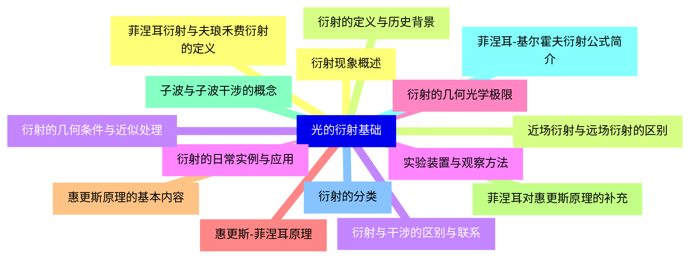
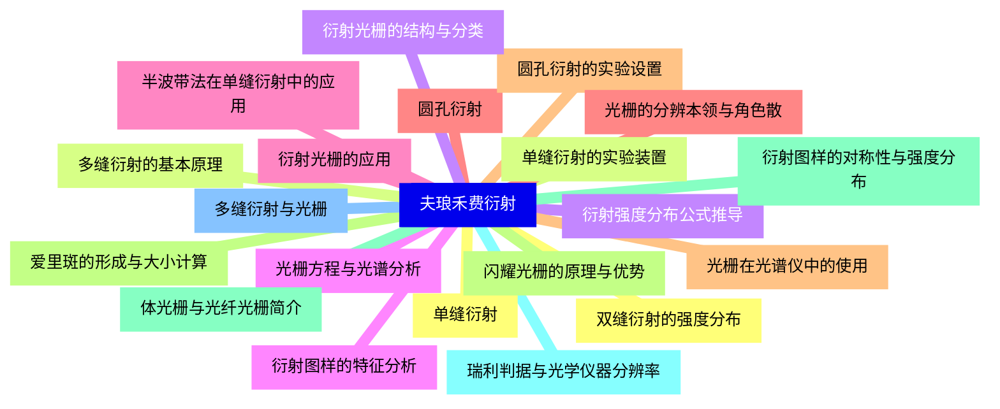
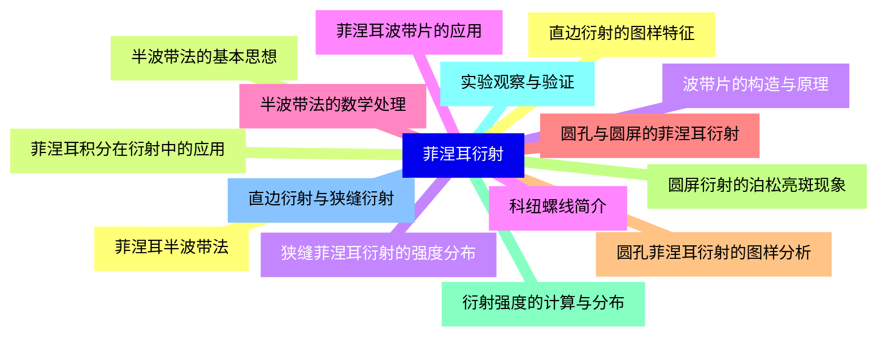
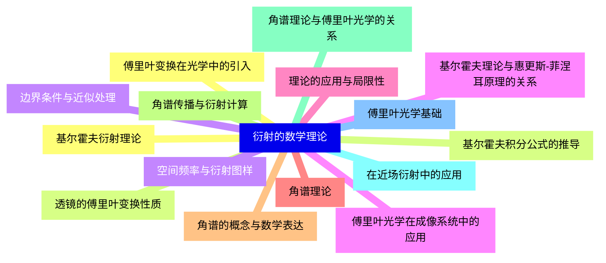
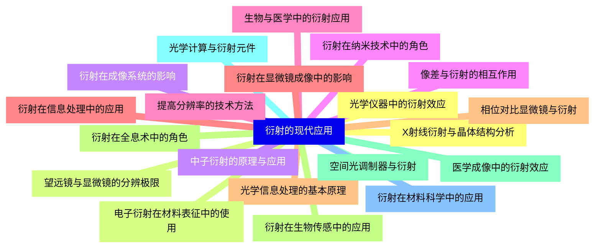
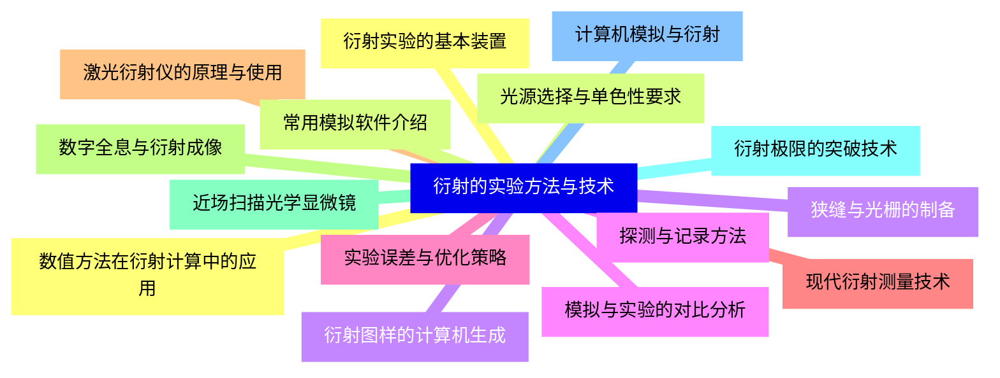
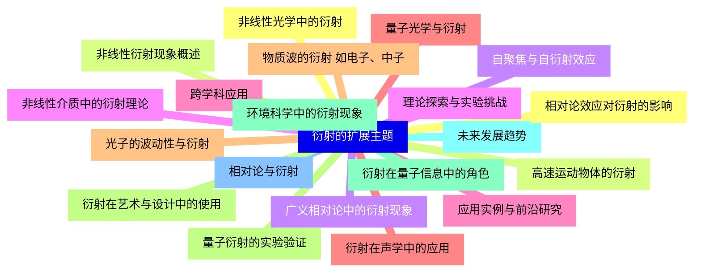


### 1 [光的衍射基础](#1)
#### 1.1 [衍射现象概述](#1)
#### 1.2 [衍射的定义与历史背景](#1)
#### 1.3 [衍射与干涉的区别与联系](#1)
#### 1.4 [衍射的日常实例与应用](#1)
#### 1.5 [衍射的几何光学极限](#1)
#### 1.6 [惠更斯-菲涅耳原理](#1)
#### 1.7 [惠更斯原理的基本内容](#1)
#### 1.8 [菲涅耳对惠更斯原理的补充](#1)
#### 1.9 [子波与子波干涉的概念](#1)
#### 1.10 [菲涅耳-基尔霍夫衍射公式简介](#1)
#### 1.11 [衍射的分类](#1)
#### 1.12 [菲涅耳衍射与夫琅禾费衍射的定义](#1)
#### 1.13 [近场衍射与远场衍射的区别](#1)
#### 1.14 [衍射的几何条件与近似处理](#1)
#### 1.15 [实验装置与观察方法](#1)
### 2 [夫琅禾费衍射](#2)
#### 2.1 [单缝衍射](#2)
#### 2.2 [单缝衍射的实验装置](#2)
#### 2.3 [衍射强度分布公式推导](#2)
#### 2.4 [衍射图样的特征分析](#2)
#### 2.5 [半波带法在单缝衍射中的应用](#2)
#### 2.6 [圆孔衍射](#2)
#### 2.7 [圆孔衍射的实验设置](#2)
#### 2.8 [爱里斑的形成与大小计算](#2)
#### 2.9 [衍射图样的对称性与强度分布](#2)
#### 2.10 [瑞利判据与光学仪器分辨率](#2)
#### 2.11 [多缝衍射与光栅](#2)
#### 2.12 [双缝衍射的强度分布](#2)
#### 2.13 [多缝衍射的基本原理](#2)
#### 2.14 [衍射光栅的结构与分类](#2)
#### 2.15 [光栅方程与光谱分析](#2)
#### 2.16 [衍射光栅的应用](#2)
#### 2.17 [光栅的分辨本领与角色散](#2)
#### 2.18 [光栅在光谱仪中的使用](#2)
#### 2.19 [闪耀光栅的原理与优势](#2)
#### 2.20 [体光栅与光纤光栅简介](#2)
### 3 [菲涅耳衍射](#3)
#### 3.1 [菲涅耳半波带法](#3)
#### 3.2 [半波带法的基本思想](#3)
#### 3.3 [波带片的构造与原理](#3)
#### 3.4 [菲涅耳波带片的应用](#3)
#### 3.5 [半波带法的数学处理](#3)
#### 3.6 [圆孔与圆屏的菲涅耳衍射](#3)
#### 3.7 [圆孔菲涅耳衍射的图样分析](#3)
#### 3.8 [圆屏衍射的泊松亮斑现象](#3)
#### 3.9 [衍射强度的计算与分布](#3)
#### 3.10 [实验观察与验证](#3)
#### 3.11 [直边衍射与狭缝衍射](#3)
#### 3.12 [直边衍射的图样特征](#3)
#### 3.13 [菲涅耳积分在衍射中的应用](#3)
#### 3.14 [狭缝菲涅耳衍射的强度分布](#3)
#### 3.15 [科纽螺线简介](#3)
### 4 [衍射的数学理论](#4)
#### 4.1 [基尔霍夫衍射理论](#4)
#### 4.2 [基尔霍夫积分公式的推导](#4)
#### 4.3 [边界条件与近似处理](#4)
#### 4.4 [基尔霍夫理论与惠更斯-菲涅耳原理的关系](#4)
#### 4.5 [理论的应用与局限性](#4)
#### 4.6 [角谱理论](#4)
#### 4.7 [角谱的概念与数学表达](#4)
#### 4.8 [角谱传播与衍射计算](#4)
#### 4.9 [角谱理论与傅里叶光学的关系](#4)
#### 4.10 [在近场衍射中的应用](#4)
#### 4.11 [傅里叶光学基础](#4)
#### 4.12 [傅里叶变换在光学中的引入](#4)
#### 4.13 [透镜的傅里叶变换性质](#4)
#### 4.14 [空间频率与衍射图样](#4)
#### 4.15 [傅里叶光学在成像系统中的应用](#4)
### 5 [衍射的现代应用](#5)
#### 5.1 [光学仪器中的衍射效应](#5)
#### 5.2 [望远镜与显微镜的分辨极限](#5)
#### 5.3 [衍射在成像系统的影响](#5)
#### 5.4 [像差与衍射的相互作用](#5)
#### 5.5 [提高分辨率的技术方法](#5)
#### 5.6 [衍射在信息处理中的应用](#5)
#### 5.7 [光学信息处理的基本原理](#5)
#### 5.8 [衍射在全息术中的角色](#5)
#### 5.9 [空间光调制器与衍射](#5)
#### 5.10 [光学计算与衍射元件](#5)
#### 5.11 [衍射在材料科学中的应用](#5)
#### 5.12 [X射线衍射与晶体结构分析](#5)
#### 5.13 [电子衍射在材料表征中的使用](#5)
#### 5.14 [中子衍射的原理与应用](#5)
#### 5.15 [衍射在纳米技术中的角色](#5)
#### 5.16 [生物与医学中的衍射应用](#5)
#### 5.17 [衍射在显微镜成像中的影响](#5)
#### 5.18 [相位对比显微镜与衍射](#5)
#### 5.19 [衍射在生物传感中的应用](#5)
#### 5.20 [医学成像中的衍射效应](#5)
### 6 [衍射的实验方法与技术](#6)
#### 6.1 [衍射实验的基本装置](#6)
#### 6.2 [光源选择与单色性要求](#6)
#### 6.3 [狭缝与光栅的制备](#6)
#### 6.4 [探测与记录方法](#6)
#### 6.5 [实验误差与优化策略](#6)
#### 6.6 [现代衍射测量技术](#6)
#### 6.7 [激光衍射仪的原理与使用](#6)
#### 6.8 [数字全息与衍射成像](#6)
#### 6.9 [近场扫描光学显微镜](#6)
#### 6.10 [衍射极限的突破技术](#6)
#### 6.11 [计算机模拟与衍射](#6)
#### 6.12 [数值方法在衍射计算中的应用](#6)
#### 6.13 [常用模拟软件介绍](#6)
#### 6.14 [衍射图样的计算机生成](#6)
#### 6.15 [模拟与实验的对比分析](#6)
### 7 [衍射的扩展主题](#7)
#### 7.1 [非线性光学中的衍射](#7)
#### 7.2 [非线性衍射现象概述](#7)
#### 7.3 [自聚焦与自衍射效应](#7)
#### 7.4 [非线性介质中的衍射理论](#7)
#### 7.5 [应用实例与前沿研究](#7)
#### 7.6 [量子光学与衍射](#7)
#### 7.7 [光子的波动性与衍射](#7)
#### 7.8 [量子衍射的实验验证](#7)
#### 7.9 [衍射在量子信息中的角色](#7)
#### 7.10 [未来发展趋势](#7)
#### 7.11 [相对论与衍射](#7)
#### 7.12 [相对论效应对衍射的影响](#7)
#### 7.13 [高速运动物体的衍射](#7)
#### 7.14 [广义相对论中的衍射现象](#7)
#### 7.15 [理论探索与实验挑战](#7)
#### 7.16 [跨学科应用](#7)
#### 7.17 [衍射在声学中的应用](#7)
#### 7.18 [物质波的衍射 如电子、中子](#7)
#### 7.19 [衍射在艺术与设计中的使用](#7)
#### 7.20 [环境科学中的衍射现象](#7)




### 1 光的衍射基础

---
### 1 光的衍射基础
___
#### 1.1 衍射现象概述
___
#### 1.2 衍射的定义与历史背景
___
#### 1.3 衍射与干涉的区别与联系
___
#### 1.4 衍射的日常实例与应用
___
#### 1.5 衍射的几何光学极限
___
#### 1.6 惠更斯-菲涅耳原理
___
#### 1.7 惠更斯原理的基本内容
___
#### 1.8 菲涅耳对惠更斯原理的补充
___
#### 1.9 子波与子波干涉的概念
___
#### 1.10 菲涅耳-基尔霍夫衍射公式简介
___
#### 1.11 衍射的分类
___
#### 1.12 菲涅耳衍射与夫琅禾费衍射的定义
___
#### 1.13 近场衍射与远场衍射的区别
___
#### 1.14 衍射的几何条件与近似处理
___
#### 1.15 实验装置与观察方法
### 2 夫琅禾费衍射

---
### 2 夫琅禾费衍射
___
#### 2.1 单缝衍射
___
#### 2.2 单缝衍射的实验装置
___
#### 2.3 衍射强度分布公式推导
___
#### 2.4 衍射图样的特征分析
___
#### 2.5 半波带法在单缝衍射中的应用
___
#### 2.6 圆孔衍射
___
#### 2.7 圆孔衍射的实验设置
___
#### 2.8 爱里斑的形成与大小计算
___
#### 2.9 衍射图样的对称性与强度分布
___
#### 2.10 瑞利判据与光学仪器分辨率
___
#### 2.11 多缝衍射与光栅
___
#### 2.12 双缝衍射的强度分布
___
#### 2.13 多缝衍射的基本原理
___
#### 2.14 衍射光栅的结构与分类
___
#### 2.15 光栅方程与光谱分析
___
#### 2.16 衍射光栅的应用
___
#### 2.17 光栅的分辨本领与角色散
___
#### 2.18 光栅在光谱仪中的使用
___
#### 2.19 闪耀光栅的原理与优势
___
#### 2.20 体光栅与光纤光栅简介
### 3 菲涅耳衍射

---
### 3 菲涅耳衍射
___
#### 3.1 菲涅耳半波带法
___
#### 3.2 半波带法的基本思想
___
#### 3.3 波带片的构造与原理
___
#### 3.4 菲涅耳波带片的应用
___
#### 3.5 半波带法的数学处理
___
#### 3.6 圆孔与圆屏的菲涅耳衍射
___
#### 3.7 圆孔菲涅耳衍射的图样分析
___
#### 3.8 圆屏衍射的泊松亮斑现象
___
#### 3.9 衍射强度的计算与分布
___
#### 3.10 实验观察与验证
___
#### 3.11 直边衍射与狭缝衍射
___
#### 3.12 直边衍射的图样特征
___
#### 3.13 菲涅耳积分在衍射中的应用
___
#### 3.14 狭缝菲涅耳衍射的强度分布
___
#### 3.15 科纽螺线简介
### 4 衍射的数学理论

---
### 4 衍射的数学理论
___
#### 4.1 基尔霍夫衍射理论
___
#### 4.2 基尔霍夫积分公式的推导
___
#### 4.3 边界条件与近似处理
___
#### 4.4 基尔霍夫理论与惠更斯-菲涅耳原理的关系
___
#### 4.5 理论的应用与局限性
___
#### 4.6 角谱理论
___
#### 4.7 角谱的概念与数学表达
___
#### 4.8 角谱传播与衍射计算
___
#### 4.9 角谱理论与傅里叶光学的关系
___
#### 4.10 在近场衍射中的应用
___
#### 4.11 傅里叶光学基础
___
#### 4.12 傅里叶变换在光学中的引入
___
#### 4.13 透镜的傅里叶变换性质
___
#### 4.14 空间频率与衍射图样
___
#### 4.15 傅里叶光学在成像系统中的应用
### 5 衍射的现代应用

---
### 5 衍射的现代应用
___
#### 5.1 光学仪器中的衍射效应
___
#### 5.2 望远镜与显微镜的分辨极限
___
#### 5.3 衍射在成像系统的影响
___
#### 5.4 像差与衍射的相互作用
___
#### 5.5 提高分辨率的技术方法
___
#### 5.6 衍射在信息处理中的应用
___
#### 5.7 光学信息处理的基本原理
___
#### 5.8 衍射在全息术中的角色
___
#### 5.9 空间光调制器与衍射
___
#### 5.10 光学计算与衍射元件
___
#### 5.11 衍射在材料科学中的应用
___
#### 5.12 X射线衍射与晶体结构分析
___
#### 5.13 电子衍射在材料表征中的使用
___
#### 5.14 中子衍射的原理与应用
___
#### 5.15 衍射在纳米技术中的角色
___
#### 5.16 生物与医学中的衍射应用
___
#### 5.17 衍射在显微镜成像中的影响
___
#### 5.18 相位对比显微镜与衍射
___
#### 5.19 衍射在生物传感中的应用
___
#### 5.20 医学成像中的衍射效应
### 6 衍射的实验方法与技术

---
### 6 衍射的实验方法与技术
___
#### 6.1 衍射实验的基本装置
___
#### 6.2 光源选择与单色性要求
___
#### 6.3 狭缝与光栅的制备
___
#### 6.4 探测与记录方法
___
#### 6.5 实验误差与优化策略
___
#### 6.6 现代衍射测量技术
___
#### 6.7 激光衍射仪的原理与使用
___
#### 6.8 数字全息与衍射成像
___
#### 6.9 近场扫描光学显微镜
___
#### 6.10 衍射极限的突破技术
___
#### 6.11 计算机模拟与衍射
___
#### 6.12 数值方法在衍射计算中的应用
___
#### 6.13 常用模拟软件介绍
___
#### 6.14 衍射图样的计算机生成
___
#### 6.15 模拟与实验的对比分析
### 7 衍射的扩展主题

本目录涵盖了光的衍射从基础理论到现代应用的广泛知识点，适用于大学物理课程的学习与深入研究。每个章节包含核心概念、数学推导、实验方法和实际应用，帮助学生全面理解衍射现象及其在科学和工程中的重要性。

---
### 7 衍射的扩展主题
___
#### 7.1 非线性光学中的衍射
___
#### 7.2 非线性衍射现象概述
___
#### 7.3 自聚焦与自衍射效应
___
#### 7.4 非线性介质中的衍射理论
___
#### 7.5 应用实例与前沿研究
___
#### 7.6 量子光学与衍射
___
#### 7.7 光子的波动性与衍射
___
#### 7.8 量子衍射的实验验证
___
#### 7.9 衍射在量子信息中的角色
___
#### 7.10 未来发展趋势
___
#### 7.11 相对论与衍射
___
#### 7.12 相对论效应对衍射的影响
___
#### 7.13 高速运动物体的衍射
___
#### 7.14 广义相对论中的衍射现象
___
#### 7.15 理论探索与实验挑战
___
#### 7.16 跨学科应用
___
#### 7.17 衍射在声学中的应用
___
#### 7.18 物质波的衍射 如电子、中子
___
#### 7.19 衍射在艺术与设计中的使用
___
#### 7.20 环境科学中的衍射现象


### 1 光的衍射基础{#1}

{}

<--->
{}
{}
{}
{}
{}
{}
{}
{}
{}
{}
{}
{}
{}
{}
{}
{}
{}
{}
{}
{}
{}
{}
{}
{}
{}
{}
{}
{}
{}
{}
{}

### 2 夫琅禾费衍射{#2}

{}
{}
{}
{}
{}
{}
{}
{}
{}
{}
{}
{}
{}
{}
{}
{}
{}
{}
{}
{}
{}
{}
{}
{}
{}
{}
{}
{}
{}
{}
{}
{}
{}
{}
{}
{}
{}
{}
{}
{}
{}
<--->

{}

### 3 菲涅耳衍射{#3}

{}

<--->
{}
{}
{}
{}
{}
{}
{}
{}
{}
{}
{}
{}
{}
{}
{}
{}
{}
{}
{}
{}
{}
{}
{}
{}
{}
{}
{}
{}
{}
{}
{}

### 4 衍射的数学理论{#4}

{}
{}
{}
{}
{}
{}
{}
{}
{}
{}
{}
{}
{}
{}
{}
{}
{}
{}
{}
{}
{}
{}
{}
{}
{}
{}
{}
{}
{}
{}
{}
<--->

{}

### 5 衍射的现代应用{#5}

{}

<--->
{}
{}
{}
{}
{}
{}
{}
{}
{}
{}
{}
{}
{}
{}
{}
{}
{}
{}
{}
{}
{}
{}
{}
{}
{}
{}
{}
{}
{}
{}
{}
{}
{}
{}
{}
{}
{}
{}
{}
{}
{}

### 6 衍射的实验方法与技术{#6}

{}
{}
{}
{}
{}
{}
{}
{}
{}
{}
{}
{}
{}
{}
{}
{}
{}
{}
{}
{}
{}
{}
{}
{}
{}
{}
{}
{}
{}
{}
{}
<--->

{}

### 7 衍射的扩展主题{#7}

本目录涵盖了光的衍射从基础理论到现代应用的广泛知识点，适用于大学物理课程的学习与深入研究。每个章节包含核心概念、数学推导、实验方法和实际应用，帮助学生全面理解衍射现象及其在科学和工程中的重要性。

{}

<--->
{}
{}
{}
{}
{}
{}
{}
{}
{}
{}
{}
{}
{}
{}
{}
{}
{}
{}
{}
{}
{}
{}
{}
{}
{}
{}
{}
{}
{}
{}
{}
{}
{}
{}
{}
{}
{}
{}
{}
{}
{}
