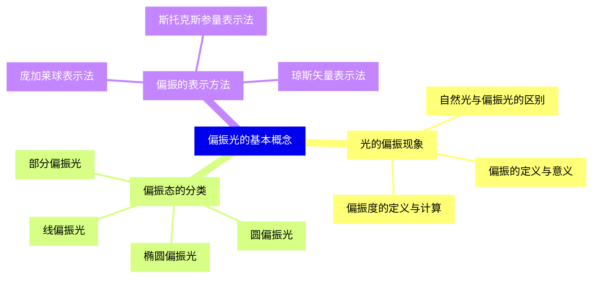
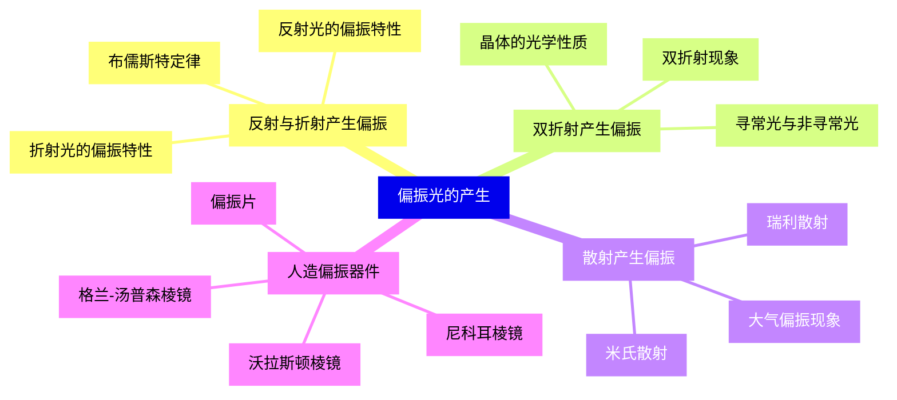
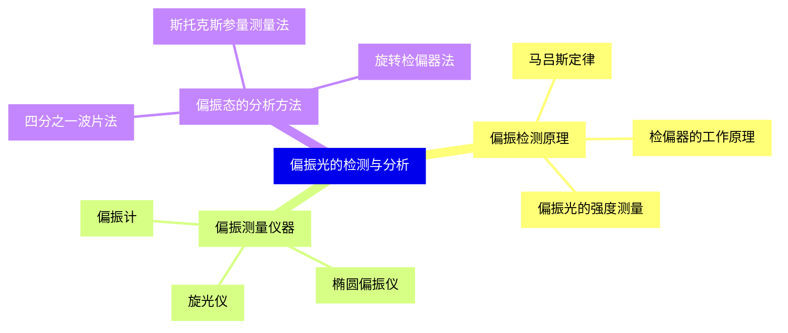
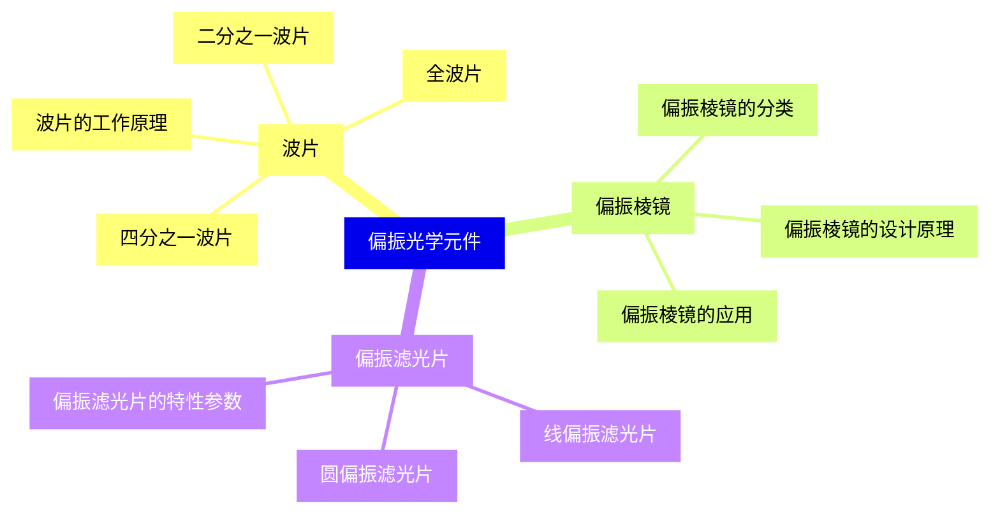
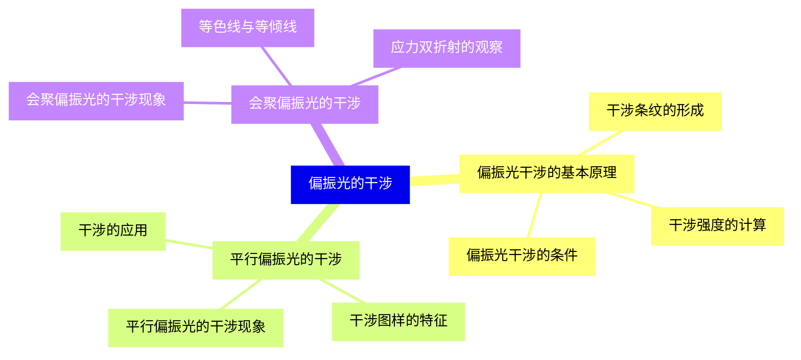
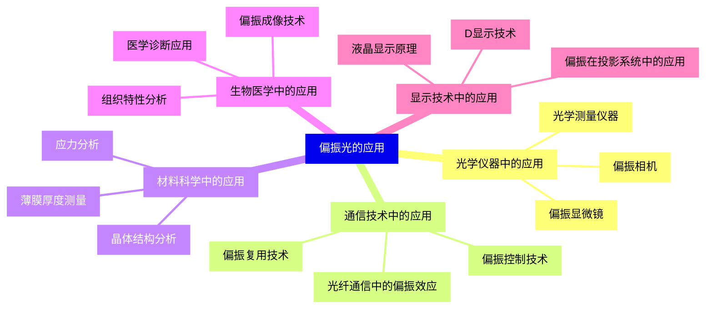
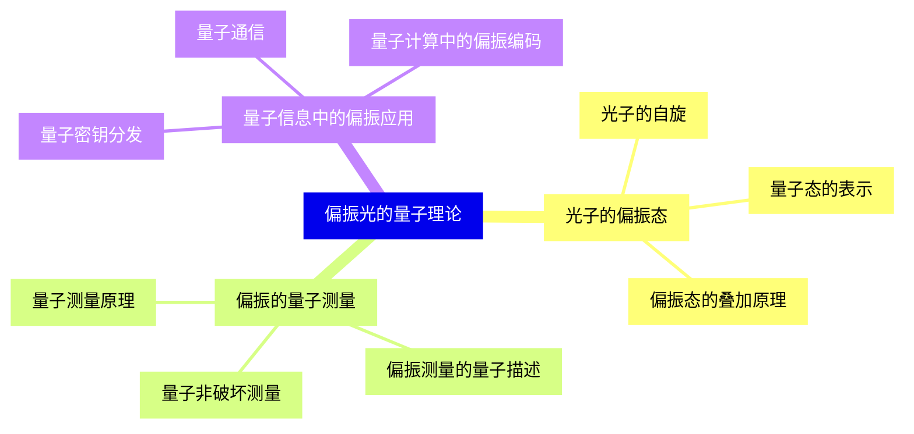
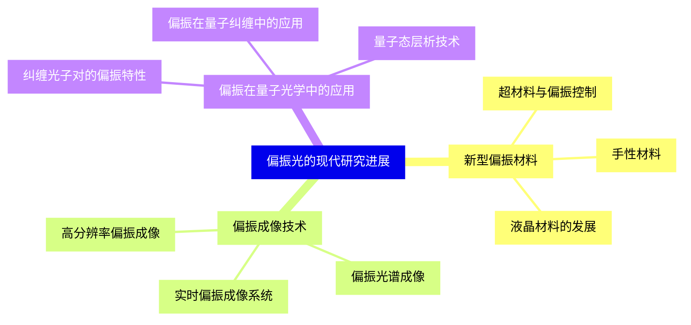


### 1 [偏振光的基本概念](#1)
#### 1.1 [光的偏振现象](#1)
##### 1.1.1 [偏振的定义与意义](#1)
##### 1.1.2 [自然光与偏振光的区别](#1)
##### 1.1.3 [偏振度的定义与计算](#1)
#### 1.2 [偏振态的分类](#1)
##### 1.2.1 [线偏振光](#1)
##### 1.2.2 [圆偏振光](#1)
##### 1.2.3 [椭圆偏振光](#1)
##### 1.2.4 [部分偏振光](#1)
#### 1.3 [偏振的表示方法](#1)
##### 1.3.1 [琼斯矢量表示法](#1)
##### 1.3.2 [斯托克斯参量表示法](#1)
##### 1.3.3 [庞加莱球表示法](#1)
### 2 [偏振光的产生](#2)
#### 2.1 [反射与折射产生偏振](#2)
##### 2.1.1 [布儒斯特定律](#2)
##### 2.1.2 [反射光的偏振特性](#2)
##### 2.1.3 [折射光的偏振特性](#2)
#### 2.2 [双折射产生偏振](#2)
##### 2.2.1 [双折射现象](#2)
##### 2.2.2 [寻常光与非寻常光](#2)
##### 2.2.3 [晶体的光学性质](#2)
#### 2.3 [散射产生偏振](#2)
##### 2.3.1 [瑞利散射](#2)
##### 2.3.2 [米氏散射](#2)
##### 2.3.3 [大气偏振现象](#2)
#### 2.4 [人造偏振器件](#2)
##### 2.4.1 [偏振片](#2)
##### 2.4.2 [尼科耳棱镜](#2)
##### 2.4.3 [沃拉斯顿棱镜](#2)
##### 2.4.4 [格兰-汤普森棱镜](#2)
### 3 [偏振光的检测与分析](#3)
#### 3.1 [偏振检测原理](#3)
##### 3.1.1 [马吕斯定律](#3)
##### 3.1.2 [检偏器的工作原理](#3)
##### 3.1.3 [偏振光的强度测量](#3)
#### 3.2 [偏振测量仪器](#3)
##### 3.2.1 [偏振计](#3)
##### 3.2.2 [椭圆偏振仪](#3)
##### 3.2.3 [旋光仪](#3)
#### 3.3 [偏振态的分析方法](#3)
##### 3.3.1 [四分之一波片法](#3)
##### 3.3.2 [旋转检偏器法](#3)
##### 3.3.3 [斯托克斯参量测量法](#3)
### 4 [偏振光学元件](#4)
#### 4.1 [波片](#4)
##### 4.1.1 [四分之一波片](#4)
##### 4.1.2 [二分之一波片](#4)
##### 4.1.3 [全波片](#4)
##### 4.1.4 [波片的工作原理](#4)
#### 4.2 [偏振棱镜](#4)
##### 4.2.1 [偏振棱镜的分类](#4)
##### 4.2.2 [偏振棱镜的设计原理](#4)
##### 4.2.3 [偏振棱镜的应用](#4)
#### 4.3 [偏振滤光片](#4)
##### 4.3.1 [线偏振滤光片](#4)
##### 4.3.2 [圆偏振滤光片](#4)
##### 4.3.3 [偏振滤光片的特性参数](#4)
### 5 [偏振光的干涉](#5)
#### 5.1 [偏振光干涉的基本原理](#5)
##### 5.1.1 [偏振光干涉的条件](#5)
##### 5.1.2 [干涉条纹的形成](#5)
##### 5.1.3 [干涉强度的计算](#5)
#### 5.2 [平行偏振光的干涉](#5)
##### 5.2.1 [平行偏振光的干涉现象](#5)
##### 5.2.2 [干涉图样的特征](#5)
##### 5.2.3 [干涉的应用](#5)
#### 5.3 [会聚偏振光的干涉](#5)
##### 5.3.1 [会聚偏振光的干涉现象](#5)
##### 5.3.2 [等色线与等倾线](#5)
##### 5.3.3 [应力双折射的观察](#5)
### 6 [偏振光的应用](#6)
#### 6.1 [光学仪器中的应用](#6)
##### 6.1.1 [偏振显微镜](#6)
##### 6.1.2 [偏振相机](#6)
##### 6.1.3 [光学测量仪器](#6)
#### 6.2 [通信技术中的应用](#6)
##### 6.2.1 [偏振复用技术](#6)
##### 6.2.2 [光纤通信中的偏振效应](#6)
##### 6.2.3 [偏振控制技术](#6)
#### 6.3 [材料科学中的应用](#6)
##### 6.3.1 [应力分析](#6)
##### 6.3.2 [晶体结构分析](#6)
##### 6.3.3 [薄膜厚度测量](#6)
#### 6.4 [生物医学中的应用](#6)
##### 6.4.1 [偏振成像技术](#6)
##### 6.4.2 [组织特性分析](#6)
##### 6.4.3 [医学诊断应用](#6)
#### 6.5 [显示技术中的应用](#6)
##### 6.5.1 [液晶显示原理](#6)
##### 6.5.2 [D显示技术](#6)
##### 6.5.3 [偏振在投影系统中的应用](#6)
### 7 [偏振光的量子理论](#7)
#### 7.1 [光子的偏振态](#7)
##### 7.1.1 [光子的自旋](#7)
##### 7.1.2 [量子态的表示](#7)
##### 7.1.3 [偏振态的叠加原理](#7)
#### 7.2 [偏振的量子测量](#7)
##### 7.2.1 [量子测量原理](#7)
##### 7.2.2 [偏振测量的量子描述](#7)
##### 7.2.3 [量子非破坏测量](#7)
#### 7.3 [量子信息中的偏振应用](#7)
##### 7.3.1 [量子密钥分发](#7)
##### 7.3.2 [量子通信](#7)
##### 7.3.3 [量子计算中的偏振编码](#7)
### 8 [偏振光的现代研究进展](#8)
#### 8.1 [新型偏振材料](#8)
##### 8.1.1 [超材料与偏振控制](#8)
##### 8.1.2 [手性材料](#8)
##### 8.1.3 [液晶材料的发展](#8)
#### 8.2 [偏振成像技术](#8)
##### 8.2.1 [高分辨率偏振成像](#8)
##### 8.2.2 [偏振光谱成像](#8)
##### 8.2.3 [实时偏振成像系统](#8)
#### 8.3 [偏振在量子光学中的应用](#8)
##### 8.3.1 [纠缠光子对的偏振特性](#8)
##### 8.3.2 [偏振在量子纠缠中的应用](#8)
##### 8.3.3 [量子态层析技术](#8)




### 1 偏振光的基本概念

---
### 1 偏振光的基本概念
___
#### 1.1 光的偏振现象
___
##### 1.1.1 偏振的定义与意义
___
##### 1.1.2 自然光与偏振光的区别
___
##### 1.1.3 偏振度的定义与计算
___
#### 1.2 偏振态的分类
___
##### 1.2.1 线偏振光
___
##### 1.2.2 圆偏振光
___
##### 1.2.3 椭圆偏振光
___
##### 1.2.4 部分偏振光
___
#### 1.3 偏振的表示方法
___
##### 1.3.1 琼斯矢量表示法
___
##### 1.3.2 斯托克斯参量表示法
___
##### 1.3.3 庞加莱球表示法
### 2 偏振光的产生

---
### 2 偏振光的产生
___
#### 2.1 反射与折射产生偏振
___
##### 2.1.1 布儒斯特定律
___
##### 2.1.2 反射光的偏振特性
___
##### 2.1.3 折射光的偏振特性
___
#### 2.2 双折射产生偏振
___
##### 2.2.1 双折射现象
___
##### 2.2.2 寻常光与非寻常光
___
##### 2.2.3 晶体的光学性质
___
#### 2.3 散射产生偏振
___
##### 2.3.1 瑞利散射
___
##### 2.3.2 米氏散射
___
##### 2.3.3 大气偏振现象
___
#### 2.4 人造偏振器件
___
##### 2.4.1 偏振片
___
##### 2.4.2 尼科耳棱镜
___
##### 2.4.3 沃拉斯顿棱镜
___
##### 2.4.4 格兰-汤普森棱镜
### 3 偏振光的检测与分析

---
### 3 偏振光的检测与分析
___
#### 3.1 偏振检测原理
___
##### 3.1.1 马吕斯定律
___
##### 3.1.2 检偏器的工作原理
___
##### 3.1.3 偏振光的强度测量
___
#### 3.2 偏振测量仪器
___
##### 3.2.1 偏振计
___
##### 3.2.2 椭圆偏振仪
___
##### 3.2.3 旋光仪
___
#### 3.3 偏振态的分析方法
___
##### 3.3.1 四分之一波片法
___
##### 3.3.2 旋转检偏器法
___
##### 3.3.3 斯托克斯参量测量法
### 4 偏振光学元件

---
### 4 偏振光学元件
___
#### 4.1 波片
___
##### 4.1.1 四分之一波片
___
##### 4.1.2 二分之一波片
___
##### 4.1.3 全波片
___
##### 4.1.4 波片的工作原理
___
#### 4.2 偏振棱镜
___
##### 4.2.1 偏振棱镜的分类
___
##### 4.2.2 偏振棱镜的设计原理
___
##### 4.2.3 偏振棱镜的应用
___
#### 4.3 偏振滤光片
___
##### 4.3.1 线偏振滤光片
___
##### 4.3.2 圆偏振滤光片
___
##### 4.3.3 偏振滤光片的特性参数
### 5 偏振光的干涉

---
### 5 偏振光的干涉
___
#### 5.1 偏振光干涉的基本原理
___
##### 5.1.1 偏振光干涉的条件
___
##### 5.1.2 干涉条纹的形成
___
##### 5.1.3 干涉强度的计算
___
#### 5.2 平行偏振光的干涉
___
##### 5.2.1 平行偏振光的干涉现象
___
##### 5.2.2 干涉图样的特征
___
##### 5.2.3 干涉的应用
___
#### 5.3 会聚偏振光的干涉
___
##### 5.3.1 会聚偏振光的干涉现象
___
##### 5.3.2 等色线与等倾线
___
##### 5.3.3 应力双折射的观察
### 6 偏振光的应用

---
### 6 偏振光的应用
___
#### 6.1 光学仪器中的应用
___
##### 6.1.1 偏振显微镜
___
##### 6.1.2 偏振相机
___
##### 6.1.3 光学测量仪器
___
#### 6.2 通信技术中的应用
___
##### 6.2.1 偏振复用技术
___
##### 6.2.2 光纤通信中的偏振效应
___
##### 6.2.3 偏振控制技术
___
#### 6.3 材料科学中的应用
___
##### 6.3.1 应力分析
___
##### 6.3.2 晶体结构分析
___
##### 6.3.3 薄膜厚度测量
___
#### 6.4 生物医学中的应用
___
##### 6.4.1 偏振成像技术
___
##### 6.4.2 组织特性分析
___
##### 6.4.3 医学诊断应用
___
#### 6.5 显示技术中的应用
___
##### 6.5.1 液晶显示原理
___
##### 6.5.2 D显示技术
___
##### 6.5.3 偏振在投影系统中的应用
### 7 偏振光的量子理论

---
### 7 偏振光的量子理论
___
#### 7.1 光子的偏振态
___
##### 7.1.1 光子的自旋
___
##### 7.1.2 量子态的表示
___
##### 7.1.3 偏振态的叠加原理
___
#### 7.2 偏振的量子测量
___
##### 7.2.1 量子测量原理
___
##### 7.2.2 偏振测量的量子描述
___
##### 7.2.3 量子非破坏测量
___
#### 7.3 量子信息中的偏振应用
___
##### 7.3.1 量子密钥分发
___
##### 7.3.2 量子通信
___
##### 7.3.3 量子计算中的偏振编码
### 8 偏振光的现代研究进展

---
### 8 偏振光的现代研究进展
___
#### 8.1 新型偏振材料
___
##### 8.1.1 超材料与偏振控制
___
##### 8.1.2 手性材料
___
##### 8.1.3 液晶材料的发展
___
#### 8.2 偏振成像技术
___
##### 8.2.1 高分辨率偏振成像
___
##### 8.2.2 偏振光谱成像
___
##### 8.2.3 实时偏振成像系统
___
#### 8.3 偏振在量子光学中的应用
___
##### 8.3.1 纠缠光子对的偏振特性
___
##### 8.3.2 偏振在量子纠缠中的应用
___
##### 8.3.3 量子态层析技术


### 1 偏振光的基本概念{#1}

{}

<--->
{}
{}
{}
{}
{}
{}
{}
{}
{}
{}
{}
{}
{}
{}
{}
{}
{}
{}
{}
{}
{}
{}
{}
{}
{}
{}
{}

### 2 偏振光的产生{#2}

{}
{}
{}
{}
{}
{}
{}
{}
{}
{}
{}
{}
{}
{}
{}
{}
{}
{}
{}
{}
{}
{}
{}
{}
{}
{}
{}
{}
{}
{}
{}
{}
{}
{}
{}
<--->

{}

### 3 偏振光的检测与分析{#3}

{}

<--->
{}
{}
{}
{}
{}
{}
{}
{}
{}
{}
{}
{}
{}
{}
{}
{}
{}
{}
{}
{}
{}
{}
{}
{}
{}

### 4 偏振光学元件{#4}

{}
{}
{}
{}
{}
{}
{}
{}
{}
{}
{}
{}
{}
{}
{}
{}
{}
{}
{}
{}
{}
{}
{}
{}
{}
{}
{}
<--->

{}

### 5 偏振光的干涉{#5}

{}

<--->
{}
{}
{}
{}
{}
{}
{}
{}
{}
{}
{}
{}
{}
{}
{}
{}
{}
{}
{}
{}
{}
{}
{}
{}
{}

### 6 偏振光的应用{#6}

{}
{}
{}
{}
{}
{}
{}
{}
{}
{}
{}
{}
{}
{}
{}
{}
{}
{}
{}
{}
{}
{}
{}
{}
{}
{}
{}
{}
{}
{}
{}
{}
{}
{}
{}
{}
{}
{}
{}
{}
{}
<--->

{}

### 7 偏振光的量子理论{#7}

{}

<--->
{}
{}
{}
{}
{}
{}
{}
{}
{}
{}
{}
{}
{}
{}
{}
{}
{}
{}
{}
{}
{}
{}
{}
{}
{}

### 8 偏振光的现代研究进展{#8}

{}
{}
{}
{}
{}
{}
{}
{}
{}
{}
{}
{}
{}
{}
{}
{}
{}
{}
{}
{}
{}
{}
{}
{}
{}
<--->

{}
