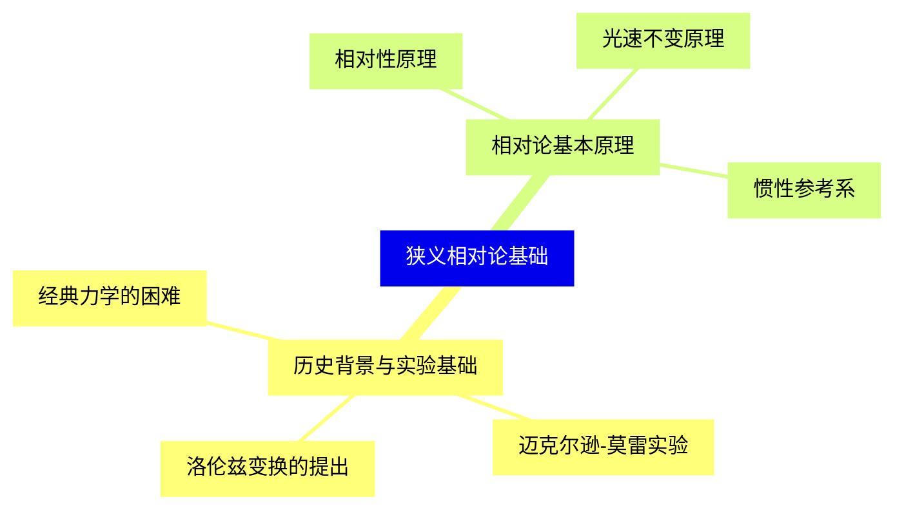
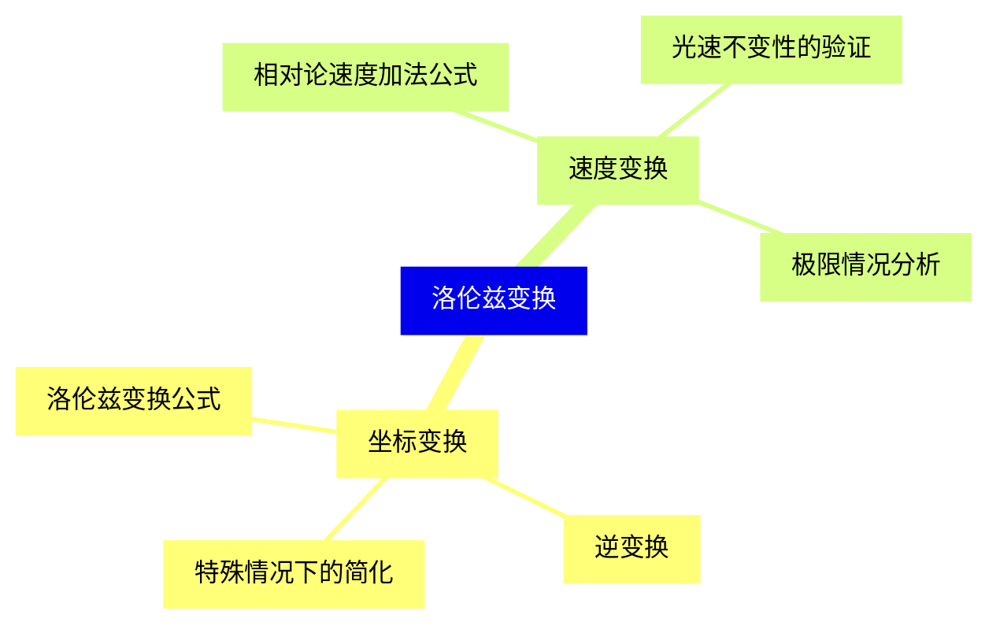
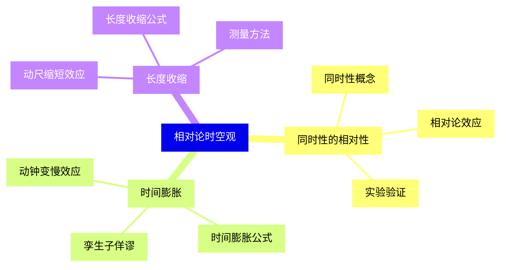
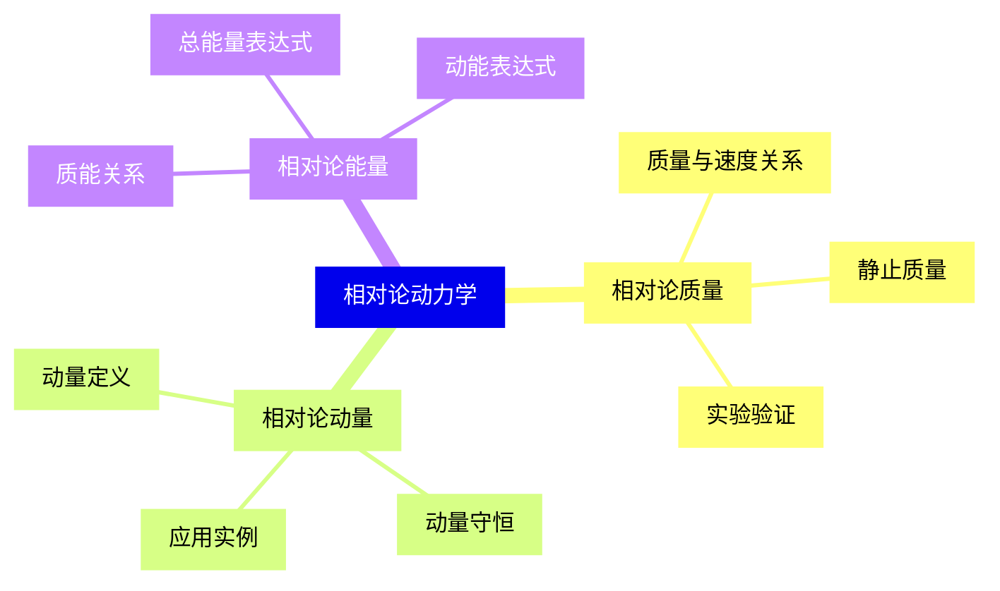
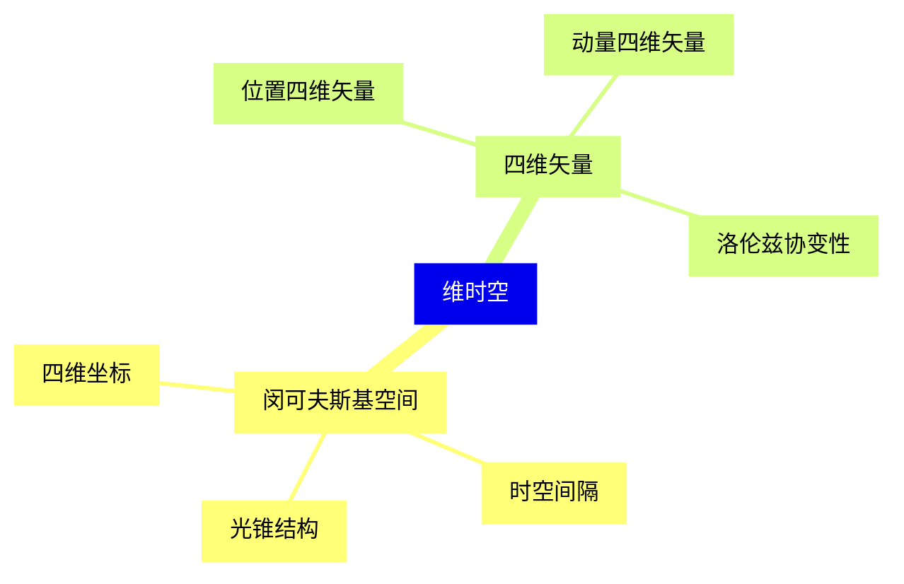
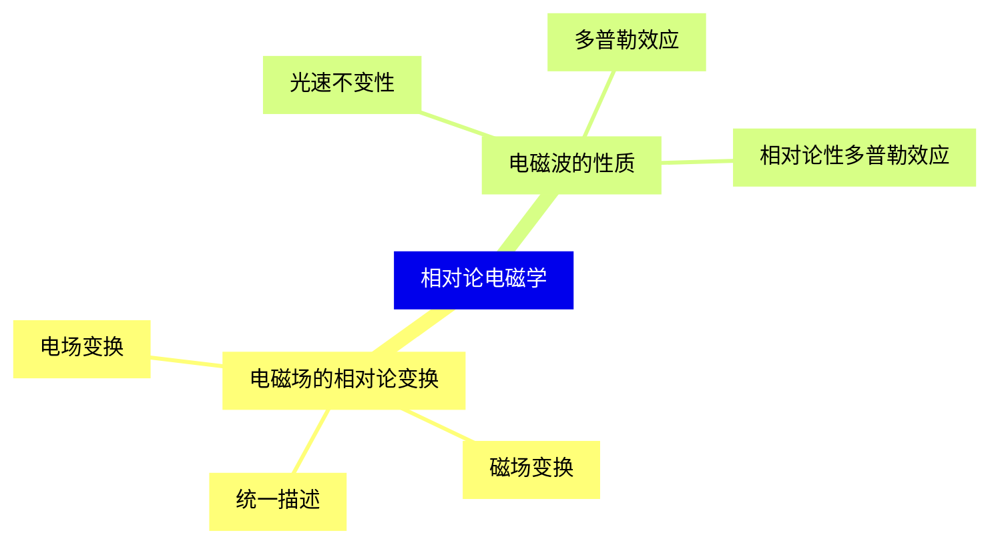
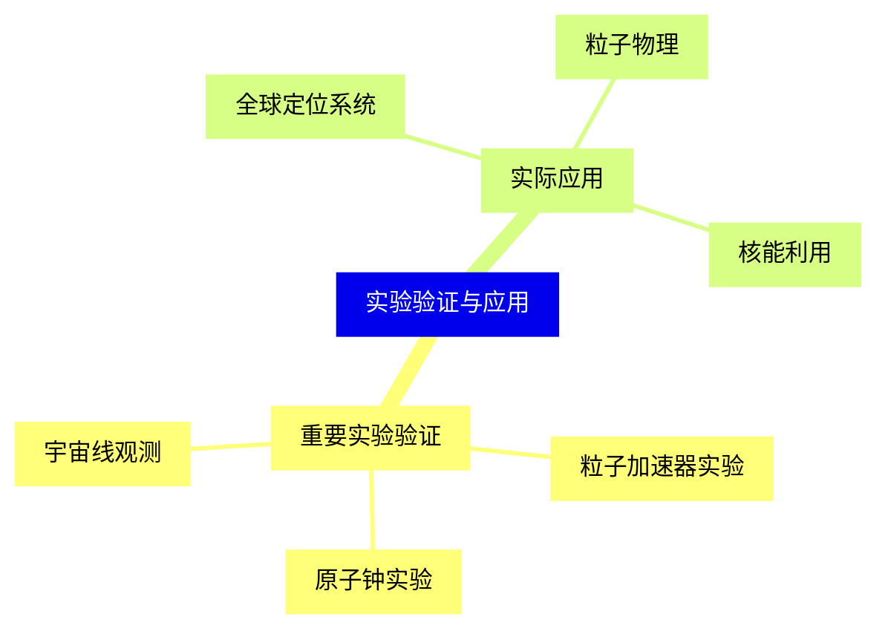
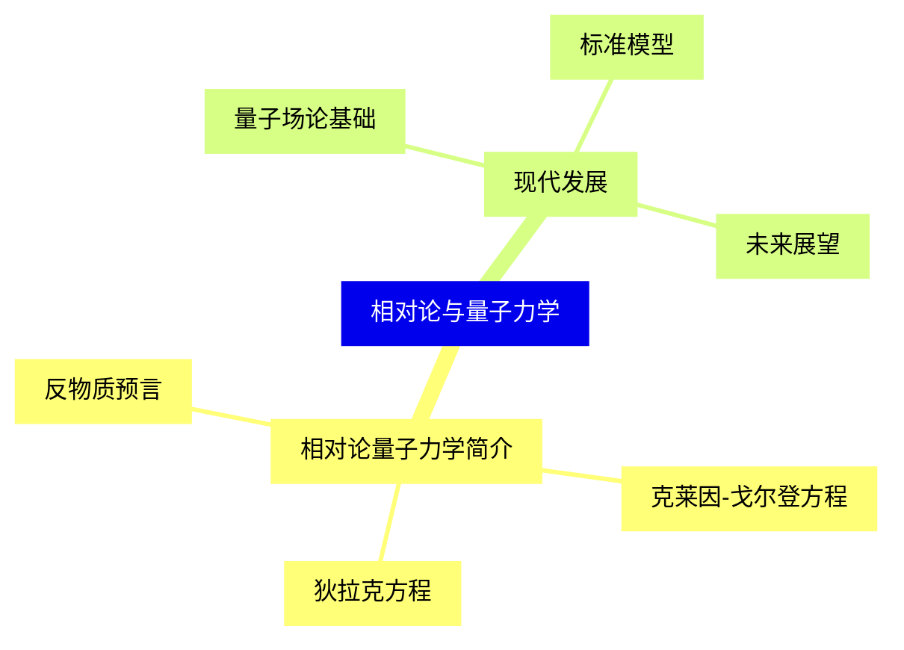


### 1 [狭义相对论基础](#1)
#### 1.1 [历史背景与实验基础](#1)
##### 1.1.1 [经典力学的困难](#1)
##### 1.1.2 [迈克尔逊-莫雷实验](#1)
##### 1.1.3 [洛伦兹变换的提出](#1)
#### 1.2 [相对论基本原理](#1)
##### 1.2.1 [相对性原理](#1)
##### 1.2.2 [光速不变原理](#1)
##### 1.2.3 [惯性参考系](#1)
### 2 [洛伦兹变换](#2)
#### 2.1 [坐标变换](#2)
##### 2.1.1 [洛伦兹变换公式](#2)
##### 2.1.2 [逆变换](#2)
##### 2.1.3 [特殊情况下的简化](#2)
#### 2.2 [速度变换](#2)
##### 2.2.1 [相对论速度加法公式](#2)
##### 2.2.2 [光速不变性的验证](#2)
##### 2.2.3 [极限情况分析](#2)
### 3 [相对论时空观](#3)
#### 3.1 [同时性的相对性](#3)
##### 3.1.1 [同时性概念](#3)
##### 3.1.2 [相对论效应](#3)
##### 3.1.3 [实验验证](#3)
#### 3.2 [时间膨胀](#3)
##### 3.2.1 [动钟变慢效应](#3)
##### 3.2.2 [时间膨胀公式](#3)
##### 3.2.3 [孪生子佯谬](#3)
#### 3.3 [长度收缩](#3)
##### 3.3.1 [动尺缩短效应](#3)
##### 3.3.2 [长度收缩公式](#3)
##### 3.3.3 [测量方法](#3)
### 4 [相对论动力学](#4)
#### 4.1 [相对论质量](#4)
##### 4.1.1 [质量与速度关系](#4)
##### 4.1.2 [静止质量](#4)
##### 4.1.3 [实验验证](#4)
#### 4.2 [相对论动量](#4)
##### 4.2.1 [动量定义](#4)
##### 4.2.2 [动量守恒](#4)
##### 4.2.3 [应用实例](#4)
#### 4.3 [相对论能量](#4)
##### 4.3.1 [质能关系](#4)
##### 4.3.2 [总能量表达式](#4)
##### 4.3.3 [动能表达式](#4)
### 5 [维时空](#5)
#### 5.1 [闵可夫斯基空间](#5)
##### 5.1.1 [四维坐标](#5)
##### 5.1.2 [时空间隔](#5)
##### 5.1.3 [光锥结构](#5)
#### 5.2 [四维矢量](#5)
##### 5.2.1 [位置四维矢量](#5)
##### 5.2.2 [动量四维矢量](#5)
##### 5.2.3 [洛伦兹协变性](#5)
### 6 [相对论电磁学](#6)
#### 6.1 [电磁场的相对论变换](#6)
##### 6.1.1 [电场变换](#6)
##### 6.1.2 [磁场变换](#6)
##### 6.1.3 [统一描述](#6)
#### 6.2 [电磁波的性质](#6)
##### 6.2.1 [光速不变性](#6)
##### 6.2.2 [多普勒效应](#6)
##### 6.2.3 [相对论性多普勒效应](#6)
### 7 [实验验证与应用](#7)
#### 7.1 [重要实验验证](#7)
##### 7.1.1 [粒子加速器实验](#7)
##### 7.1.2 [原子钟实验](#7)
##### 7.1.3 [宇宙线观测](#7)
#### 7.2 [实际应用](#7)
##### 7.2.1 [全球定位系统](#7)
##### 7.2.2 [粒子物理](#7)
##### 7.2.3 [核能利用](#7)
### 8 [相对论与量子力学](#8)
#### 8.1 [相对论量子力学简介](#8)
##### 8.1.1 [克莱因-戈尔登方程](#8)
##### 8.1.2 [狄拉克方程](#8)
##### 8.1.3 [反物质预言](#8)
#### 8.2 [现代发展](#8)
##### 8.2.1 [量子场论基础](#8)
##### 8.2.2 [标准模型](#8)
##### 8.2.3 [未来展望](#8)




### 1 狭义相对论基础

---
### 1 狭义相对论基础
___
#### 1.1 历史背景与实验基础
___
##### 1.1.1 经典力学的困难
___
##### 1.1.2 迈克尔逊-莫雷实验
___
##### 1.1.3 洛伦兹变换的提出
___
#### 1.2 相对论基本原理
___
##### 1.2.1 相对性原理
___
##### 1.2.2 光速不变原理
___
##### 1.2.3 惯性参考系
### 2 洛伦兹变换

---
### 2 洛伦兹变换
___
#### 2.1 坐标变换
___
##### 2.1.1 洛伦兹变换公式
___
##### 2.1.2 逆变换
___
##### 2.1.3 特殊情况下的简化
___
#### 2.2 速度变换
___
##### 2.2.1 相对论速度加法公式
___
##### 2.2.2 光速不变性的验证
___
##### 2.2.3 极限情况分析
### 3 相对论时空观

---
### 3 相对论时空观
___
#### 3.1 同时性的相对性
___
##### 3.1.1 同时性概念
___
##### 3.1.2 相对论效应
___
##### 3.1.3 实验验证
___
#### 3.2 时间膨胀
___
##### 3.2.1 动钟变慢效应
___
##### 3.2.2 时间膨胀公式
___
##### 3.2.3 孪生子佯谬
___
#### 3.3 长度收缩
___
##### 3.3.1 动尺缩短效应
___
##### 3.3.2 长度收缩公式
___
##### 3.3.3 测量方法
### 4 相对论动力学

---
### 4 相对论动力学
___
#### 4.1 相对论质量
___
##### 4.1.1 质量与速度关系
___
##### 4.1.2 静止质量
___
##### 4.1.3 实验验证
___
#### 4.2 相对论动量
___
##### 4.2.1 动量定义
___
##### 4.2.2 动量守恒
___
##### 4.2.3 应用实例
___
#### 4.3 相对论能量
___
##### 4.3.1 质能关系
___
##### 4.3.2 总能量表达式
___
##### 4.3.3 动能表达式
### 5 维时空

---
### 5 维时空
___
#### 5.1 闵可夫斯基空间
___
##### 5.1.1 四维坐标
___
##### 5.1.2 时空间隔
___
##### 5.1.3 光锥结构
___
#### 5.2 四维矢量
___
##### 5.2.1 位置四维矢量
___
##### 5.2.2 动量四维矢量
___
##### 5.2.3 洛伦兹协变性
### 6 相对论电磁学

---
### 6 相对论电磁学
___
#### 6.1 电磁场的相对论变换
___
##### 6.1.1 电场变换
___
##### 6.1.2 磁场变换
___
##### 6.1.3 统一描述
___
#### 6.2 电磁波的性质
___
##### 6.2.1 光速不变性
___
##### 6.2.2 多普勒效应
___
##### 6.2.3 相对论性多普勒效应
### 7 实验验证与应用

---
### 7 实验验证与应用
___
#### 7.1 重要实验验证
___
##### 7.1.1 粒子加速器实验
___
##### 7.1.2 原子钟实验
___
##### 7.1.3 宇宙线观测
___
#### 7.2 实际应用
___
##### 7.2.1 全球定位系统
___
##### 7.2.2 粒子物理
___
##### 7.2.3 核能利用
### 8 相对论与量子力学

---
### 8 相对论与量子力学
___
#### 8.1 相对论量子力学简介
___
##### 8.1.1 克莱因-戈尔登方程
___
##### 8.1.2 狄拉克方程
___
##### 8.1.3 反物质预言
___
#### 8.2 现代发展
___
##### 8.2.1 量子场论基础
___
##### 8.2.2 标准模型
___
##### 8.2.3 未来展望


### 1 狭义相对论基础{#1}

{}

<--->
{}
{}
{}
{}
{}
{}
{}
{}
{}
{}
{}
{}
{}
{}
{}
{}
{}

### 2 洛伦兹变换{#2}

{}
{}
{}
{}
{}
{}
{}
{}
{}
{}
{}
{}
{}
{}
{}
{}
{}
<--->

{}

### 3 相对论时空观{#3}

{}

<--->
{}
{}
{}
{}
{}
{}
{}
{}
{}
{}
{}
{}
{}
{}
{}
{}
{}
{}
{}
{}
{}
{}
{}
{}
{}

### 4 相对论动力学{#4}

{}
{}
{}
{}
{}
{}
{}
{}
{}
{}
{}
{}
{}
{}
{}
{}
{}
{}
{}
{}
{}
{}
{}
{}
{}
<--->

{}

### 5 维时空{#5}

{}

<--->
{}
{}
{}
{}
{}
{}
{}
{}
{}
{}
{}
{}
{}
{}
{}
{}
{}

### 6 相对论电磁学{#6}

{}
{}
{}
{}
{}
{}
{}
{}
{}
{}
{}
{}
{}
{}
{}
{}
{}
<--->

{}

### 7 实验验证与应用{#7}

{}

<--->
{}
{}
{}
{}
{}
{}
{}
{}
{}
{}
{}
{}
{}
{}
{}
{}
{}

### 8 相对论与量子力学{#8}

{}
{}
{}
{}
{}
{}
{}
{}
{}
{}
{}
{}
{}
{}
{}
{}
{}
<--->

{}
