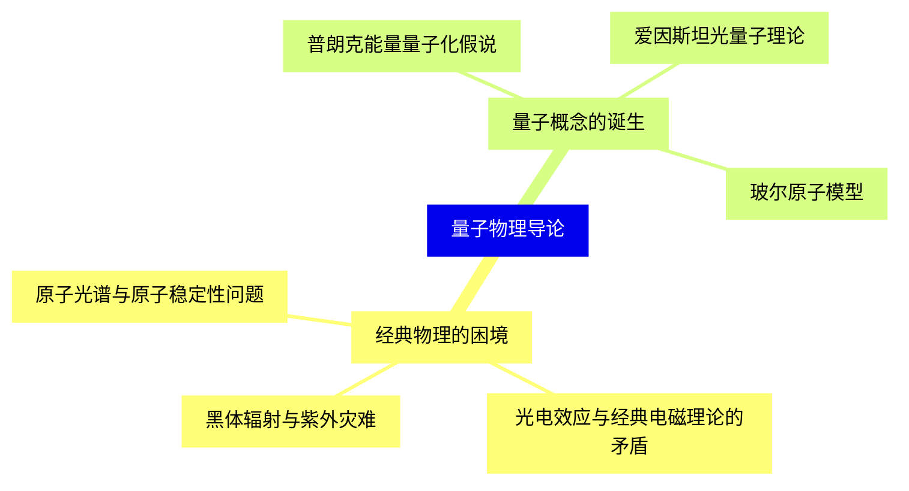
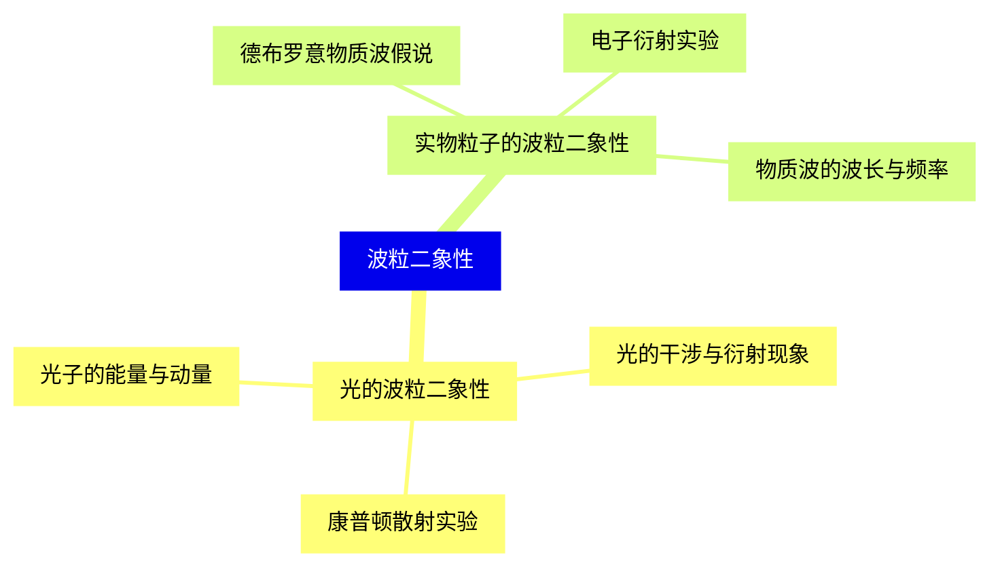
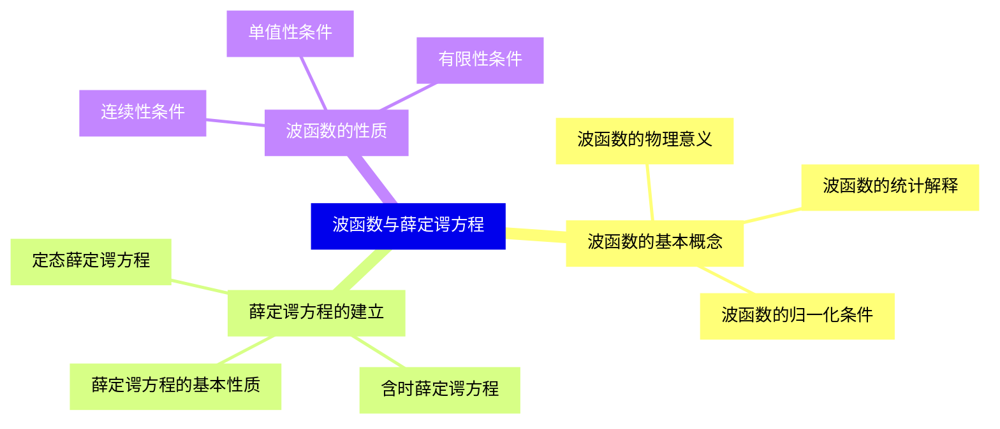
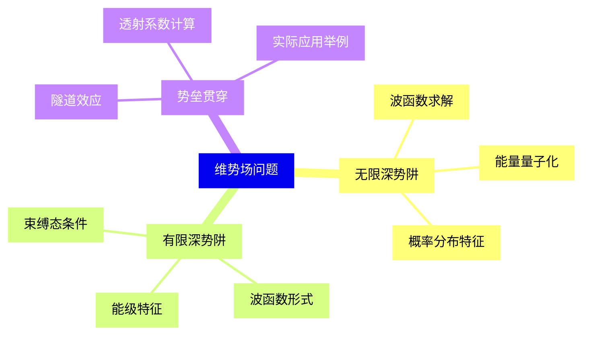
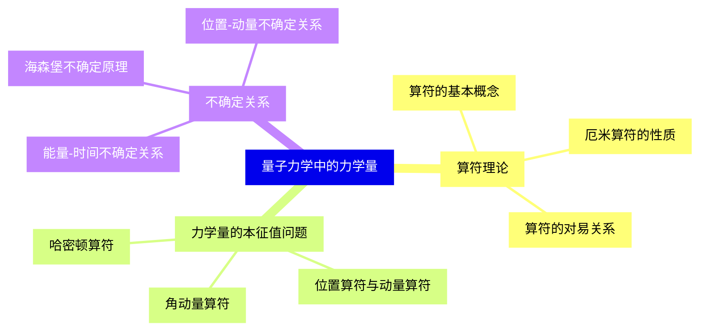
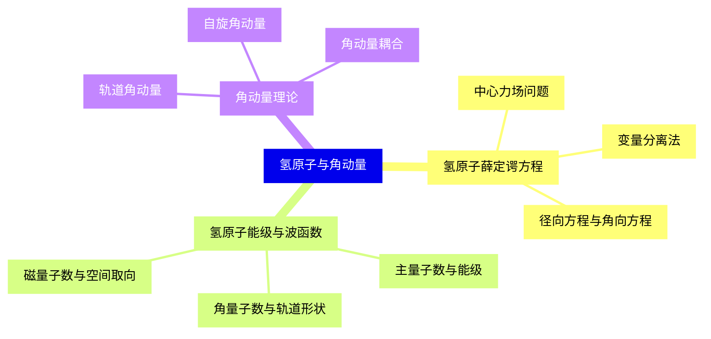
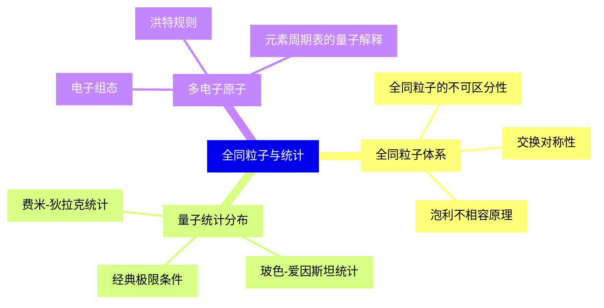
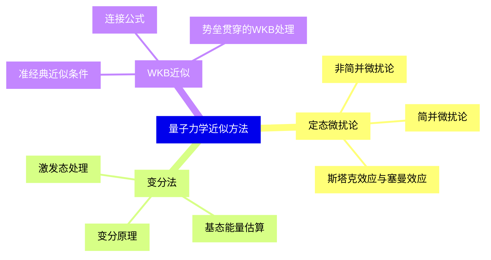
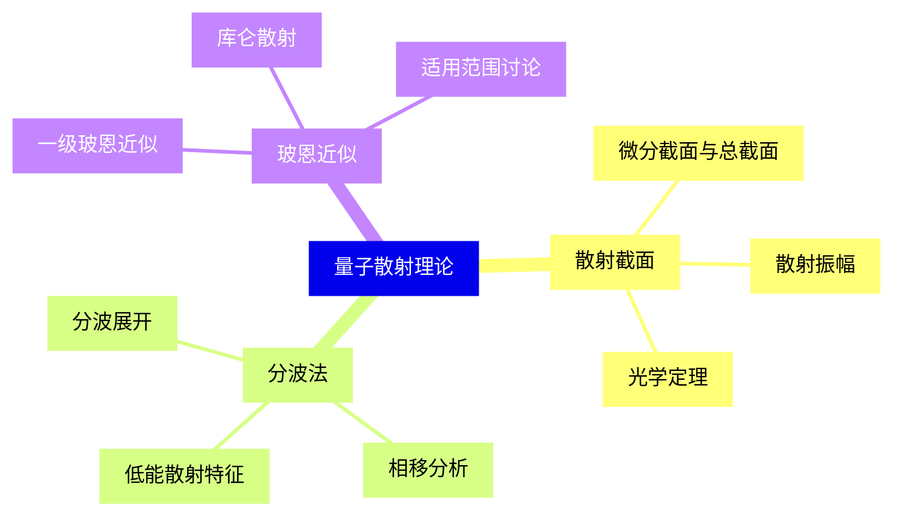
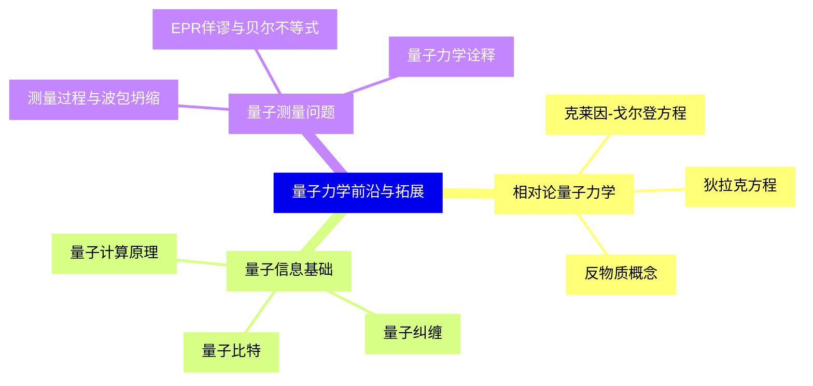


### 1 [量子物理导论](#1)
#### 1.1 [经典物理的困境](#1)
##### 1.1.1 [黑体辐射与紫外灾难](#1)
##### 1.1.2 [光电效应与经典电磁理论的矛盾](#1)
##### 1.1.3 [原子光谱与原子稳定性问题](#1)
#### 1.2 [量子概念的诞生](#1)
##### 1.2.1 [普朗克能量量子化假说](#1)
##### 1.2.2 [爱因斯坦光量子理论](#1)
##### 1.2.3 [玻尔原子模型](#1)
### 2 [波粒二象性](#2)
#### 2.1 [光的波粒二象性](#2)
##### 2.1.1 [光的干涉与衍射现象](#2)
##### 2.1.2 [康普顿散射实验](#2)
##### 2.1.3 [光子的能量与动量](#2)
#### 2.2 [实物粒子的波粒二象性](#2)
##### 2.2.1 [德布罗意物质波假说](#2)
##### 2.2.2 [电子衍射实验](#2)
##### 2.2.3 [物质波的波长与频率](#2)
### 3 [波函数与薛定谔方程](#3)
#### 3.1 [波函数的基本概念](#3)
##### 3.1.1 [波函数的物理意义](#3)
##### 3.1.2 [波函数的统计解释](#3)
##### 3.1.3 [波函数的归一化条件](#3)
#### 3.2 [薛定谔方程的建立](#3)
##### 3.2.1 [定态薛定谔方程](#3)
##### 3.2.2 [含时薛定谔方程](#3)
##### 3.2.3 [薛定谔方程的基本性质](#3)
#### 3.3 [波函数的性质](#3)
##### 3.3.1 [连续性条件](#3)
##### 3.3.2 [单值性条件](#3)
##### 3.3.3 [有限性条件](#3)
### 4 [维势场问题](#4)
#### 4.1 [无限深势阱](#4)
##### 4.1.1 [波函数求解](#4)
##### 4.1.2 [能量量子化](#4)
##### 4.1.3 [概率分布特征](#4)
#### 4.2 [有限深势阱](#4)
##### 4.2.1 [束缚态条件](#4)
##### 4.2.2 [波函数形式](#4)
##### 4.2.3 [能级特征](#4)
#### 4.3 [势垒贯穿](#4)
##### 4.3.1 [隧道效应](#4)
##### 4.3.2 [透射系数计算](#4)
##### 4.3.3 [实际应用举例](#4)
### 5 [量子力学中的力学量](#5)
#### 5.1 [算符理论](#5)
##### 5.1.1 [算符的基本概念](#5)
##### 5.1.2 [厄米算符的性质](#5)
##### 5.1.3 [算符的对易关系](#5)
#### 5.2 [力学量的本征值问题](#5)
##### 5.2.1 [位置算符与动量算符](#5)
##### 5.2.2 [角动量算符](#5)
##### 5.2.3 [哈密顿算符](#5)
#### 5.3 [不确定关系](#5)
##### 5.3.1 [海森堡不确定原理](#5)
##### 5.3.2 [位置-动量不确定关系](#5)
##### 5.3.3 [能量-时间不确定关系](#5)
### 6 [氢原子与角动量](#6)
#### 6.1 [氢原子薛定谔方程](#6)
##### 6.1.1 [中心力场问题](#6)
##### 6.1.2 [变量分离法](#6)
##### 6.1.3 [径向方程与角向方程](#6)
#### 6.2 [氢原子能级与波函数](#6)
##### 6.2.1 [主量子数与能级](#6)
##### 6.2.2 [角量子数与轨道形状](#6)
##### 6.2.3 [磁量子数与空间取向](#6)
#### 6.3 [角动量理论](#6)
##### 6.3.1 [轨道角动量](#6)
##### 6.3.2 [自旋角动量](#6)
##### 6.3.3 [角动量耦合](#6)
### 7 [全同粒子与统计](#7)
#### 7.1 [全同粒子体系](#7)
##### 7.1.1 [全同粒子的不可区分性](#7)
##### 7.1.2 [交换对称性](#7)
##### 7.1.3 [泡利不相容原理](#7)
#### 7.2 [量子统计分布](#7)
##### 7.2.1 [费米-狄拉克统计](#7)
##### 7.2.2 [玻色-爱因斯坦统计](#7)
##### 7.2.3 [经典极限条件](#7)
#### 7.3 [多电子原子](#7)
##### 7.3.1 [电子组态](#7)
##### 7.3.2 [洪特规则](#7)
##### 7.3.3 [元素周期表的量子解释](#7)
### 8 [量子力学近似方法](#8)
#### 8.1 [定态微扰论](#8)
##### 8.1.1 [非简并微扰论](#8)
##### 8.1.2 [简并微扰论](#8)
##### 8.1.3 [斯塔克效应与塞曼效应](#8)
#### 8.2 [变分法](#8)
##### 8.2.1 [变分原理](#8)
##### 8.2.2 [基态能量估算](#8)
##### 8.2.3 [激发态处理](#8)
#### 8.3 [WKB近似](#8)
##### 8.3.1 [准经典近似条件](#8)
##### 8.3.2 [连接公式](#8)
##### 8.3.3 [势垒贯穿的WKB处理](#8)
### 9 [量子散射理论](#9)
#### 9.1 [散射截面](#9)
##### 9.1.1 [微分截面与总截面](#9)
##### 9.1.2 [散射振幅](#9)
##### 9.1.3 [光学定理](#9)
#### 9.2 [分波法](#9)
##### 9.2.1 [分波展开](#9)
##### 9.2.2 [相移分析](#9)
##### 9.2.3 [低能散射特征](#9)
#### 9.3 [玻恩近似](#9)
##### 9.3.1 [一级玻恩近似](#9)
##### 9.3.2 [库仑散射](#9)
##### 9.3.3 [适用范围讨论](#9)
### 10 [量子力学前沿与拓展](#10)
#### 10.1 [相对论量子力学](#10)
##### 10.1.1 [克莱因-戈尔登方程](#10)
##### 10.1.2 [狄拉克方程](#10)
##### 10.1.3 [反物质概念](#10)
#### 10.2 [量子信息基础](#10)
##### 10.2.1 [量子比特](#10)
##### 10.2.2 [量子纠缠](#10)
##### 10.2.3 [量子计算原理](#10)
#### 10.3 [量子测量问题](#10)
##### 10.3.1 [测量过程与波包坍缩](#10)
##### 10.3.2 [EPR佯谬与贝尔不等式](#10)
##### 10.3.3 [量子力学诠释](#10)




### 1 量子物理导论

---
### 1 量子物理导论
___
#### 1.1 经典物理的困境
___
##### 1.1.1 黑体辐射与紫外灾难
___
##### 1.1.2 光电效应与经典电磁理论的矛盾
___
##### 1.1.3 原子光谱与原子稳定性问题
___
#### 1.2 量子概念的诞生
___
##### 1.2.1 普朗克能量量子化假说
___
##### 1.2.2 爱因斯坦光量子理论
___
##### 1.2.3 玻尔原子模型
### 2 波粒二象性

---
### 2 波粒二象性
___
#### 2.1 光的波粒二象性
___
##### 2.1.1 光的干涉与衍射现象
___
##### 2.1.2 康普顿散射实验
___
##### 2.1.3 光子的能量与动量
___
#### 2.2 实物粒子的波粒二象性
___
##### 2.2.1 德布罗意物质波假说
___
##### 2.2.2 电子衍射实验
___
##### 2.2.3 物质波的波长与频率
### 3 波函数与薛定谔方程

---
### 3 波函数与薛定谔方程
___
#### 3.1 波函数的基本概念
___
##### 3.1.1 波函数的物理意义
___
##### 3.1.2 波函数的统计解释
___
##### 3.1.3 波函数的归一化条件
___
#### 3.2 薛定谔方程的建立
___
##### 3.2.1 定态薛定谔方程
___
##### 3.2.2 含时薛定谔方程
___
##### 3.2.3 薛定谔方程的基本性质
___
#### 3.3 波函数的性质
___
##### 3.3.1 连续性条件
___
##### 3.3.2 单值性条件
___
##### 3.3.3 有限性条件
### 4 维势场问题

---
### 4 维势场问题
___
#### 4.1 无限深势阱
___
##### 4.1.1 波函数求解
___
##### 4.1.2 能量量子化
___
##### 4.1.3 概率分布特征
___
#### 4.2 有限深势阱
___
##### 4.2.1 束缚态条件
___
##### 4.2.2 波函数形式
___
##### 4.2.3 能级特征
___
#### 4.3 势垒贯穿
___
##### 4.3.1 隧道效应
___
##### 4.3.2 透射系数计算
___
##### 4.3.3 实际应用举例
### 5 量子力学中的力学量

---
### 5 量子力学中的力学量
___
#### 5.1 算符理论
___
##### 5.1.1 算符的基本概念
___
##### 5.1.2 厄米算符的性质
___
##### 5.1.3 算符的对易关系
___
#### 5.2 力学量的本征值问题
___
##### 5.2.1 位置算符与动量算符
___
##### 5.2.2 角动量算符
___
##### 5.2.3 哈密顿算符
___
#### 5.3 不确定关系
___
##### 5.3.1 海森堡不确定原理
___
##### 5.3.2 位置-动量不确定关系
___
##### 5.3.3 能量-时间不确定关系
### 6 氢原子与角动量

---
### 6 氢原子与角动量
___
#### 6.1 氢原子薛定谔方程
___
##### 6.1.1 中心力场问题
___
##### 6.1.2 变量分离法
___
##### 6.1.3 径向方程与角向方程
___
#### 6.2 氢原子能级与波函数
___
##### 6.2.1 主量子数与能级
___
##### 6.2.2 角量子数与轨道形状
___
##### 6.2.3 磁量子数与空间取向
___
#### 6.3 角动量理论
___
##### 6.3.1 轨道角动量
___
##### 6.3.2 自旋角动量
___
##### 6.3.3 角动量耦合
### 7 全同粒子与统计

---
### 7 全同粒子与统计
___
#### 7.1 全同粒子体系
___
##### 7.1.1 全同粒子的不可区分性
___
##### 7.1.2 交换对称性
___
##### 7.1.3 泡利不相容原理
___
#### 7.2 量子统计分布
___
##### 7.2.1 费米-狄拉克统计
___
##### 7.2.2 玻色-爱因斯坦统计
___
##### 7.2.3 经典极限条件
___
#### 7.3 多电子原子
___
##### 7.3.1 电子组态
___
##### 7.3.2 洪特规则
___
##### 7.3.3 元素周期表的量子解释
### 8 量子力学近似方法

---
### 8 量子力学近似方法
___
#### 8.1 定态微扰论
___
##### 8.1.1 非简并微扰论
___
##### 8.1.2 简并微扰论
___
##### 8.1.3 斯塔克效应与塞曼效应
___
#### 8.2 变分法
___
##### 8.2.1 变分原理
___
##### 8.2.2 基态能量估算
___
##### 8.2.3 激发态处理
___
#### 8.3 WKB近似
___
##### 8.3.1 准经典近似条件
___
##### 8.3.2 连接公式
___
##### 8.3.3 势垒贯穿的WKB处理
### 9 量子散射理论

---
### 9 量子散射理论
___
#### 9.1 散射截面
___
##### 9.1.1 微分截面与总截面
___
##### 9.1.2 散射振幅
___
##### 9.1.3 光学定理
___
#### 9.2 分波法
___
##### 9.2.1 分波展开
___
##### 9.2.2 相移分析
___
##### 9.2.3 低能散射特征
___
#### 9.3 玻恩近似
___
##### 9.3.1 一级玻恩近似
___
##### 9.3.2 库仑散射
___
##### 9.3.3 适用范围讨论
### 10 量子力学前沿与拓展

---
### 10 量子力学前沿与拓展
___
#### 10.1 相对论量子力学
___
##### 10.1.1 克莱因-戈尔登方程
___
##### 10.1.2 狄拉克方程
___
##### 10.1.3 反物质概念
___
#### 10.2 量子信息基础
___
##### 10.2.1 量子比特
___
##### 10.2.2 量子纠缠
___
##### 10.2.3 量子计算原理
___
#### 10.3 量子测量问题
___
##### 10.3.1 测量过程与波包坍缩
___
##### 10.3.2 EPR佯谬与贝尔不等式
___
##### 10.3.3 量子力学诠释


### 1 量子物理导论{#1}

{}

<--->
{}
{}
{}
{}
{}
{}
{}
{}
{}
{}
{}
{}
{}
{}
{}
{}
{}

### 2 波粒二象性{#2}

{}
{}
{}
{}
{}
{}
{}
{}
{}
{}
{}
{}
{}
{}
{}
{}
{}
<--->

{}

### 3 波函数与薛定谔方程{#3}

{}

<--->
{}
{}
{}
{}
{}
{}
{}
{}
{}
{}
{}
{}
{}
{}
{}
{}
{}
{}
{}
{}
{}
{}
{}
{}
{}

### 4 维势场问题{#4}

{}
{}
{}
{}
{}
{}
{}
{}
{}
{}
{}
{}
{}
{}
{}
{}
{}
{}
{}
{}
{}
{}
{}
{}
{}
<--->

{}

### 5 量子力学中的力学量{#5}

{}

<--->
{}
{}
{}
{}
{}
{}
{}
{}
{}
{}
{}
{}
{}
{}
{}
{}
{}
{}
{}
{}
{}
{}
{}
{}
{}

### 6 氢原子与角动量{#6}

{}
{}
{}
{}
{}
{}
{}
{}
{}
{}
{}
{}
{}
{}
{}
{}
{}
{}
{}
{}
{}
{}
{}
{}
{}
<--->

{}

### 7 全同粒子与统计{#7}

{}

<--->
{}
{}
{}
{}
{}
{}
{}
{}
{}
{}
{}
{}
{}
{}
{}
{}
{}
{}
{}
{}
{}
{}
{}
{}
{}

### 8 量子力学近似方法{#8}

{}
{}
{}
{}
{}
{}
{}
{}
{}
{}
{}
{}
{}
{}
{}
{}
{}
{}
{}
{}
{}
{}
{}
{}
{}
<--->

{}

### 9 量子散射理论{#9}

{}

<--->
{}
{}
{}
{}
{}
{}
{}
{}
{}
{}
{}
{}
{}
{}
{}
{}
{}
{}
{}
{}
{}
{}
{}
{}
{}

### 10 量子力学前沿与拓展{#10}

{}
{}
{}
{}
{}
{}
{}
{}
{}
{}
{}
{}
{}
{}
{}
{}
{}
{}
{}
{}
{}
{}
{}
{}
{}
<--->

{}
