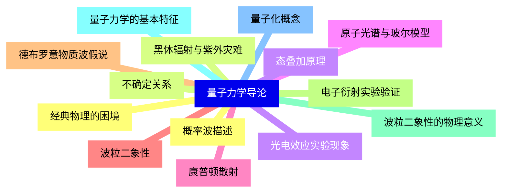
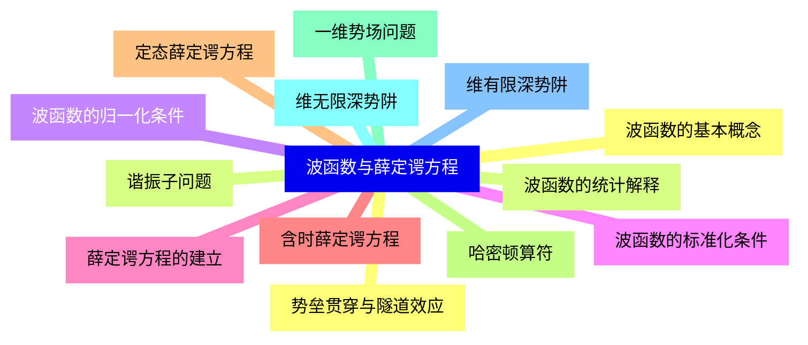
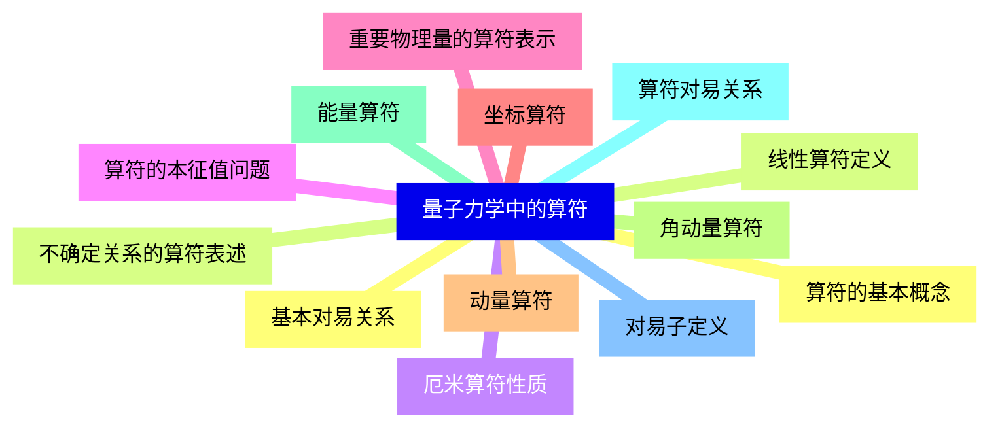
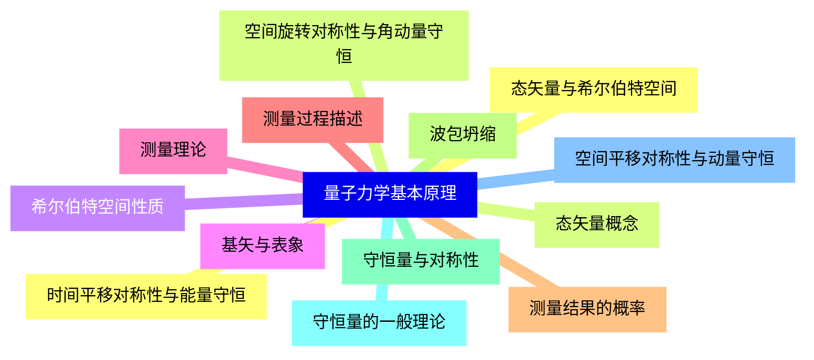
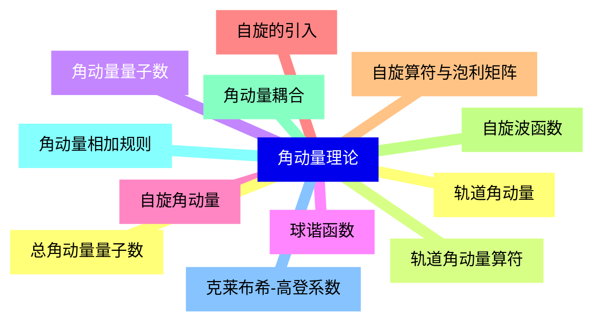
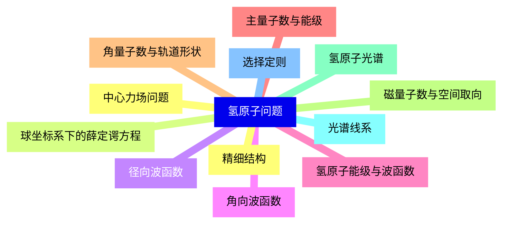
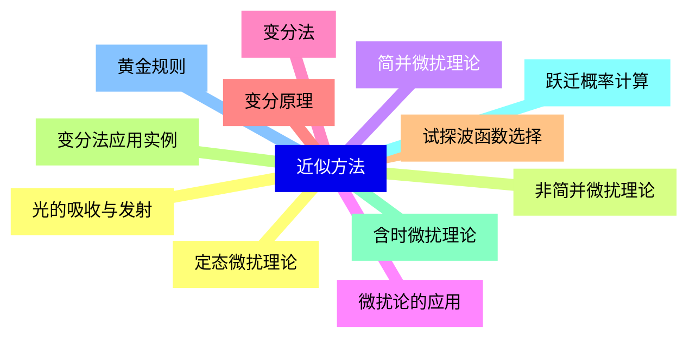
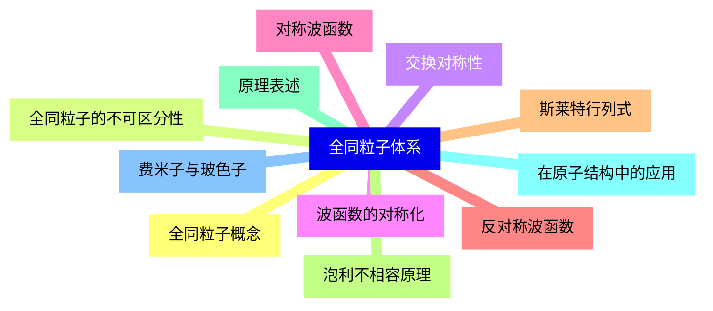
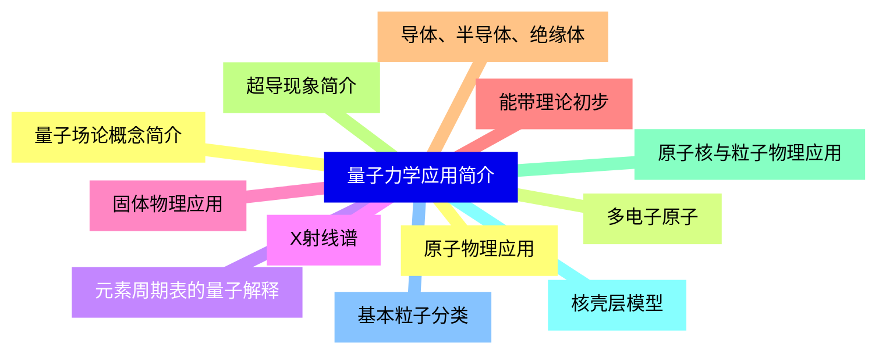
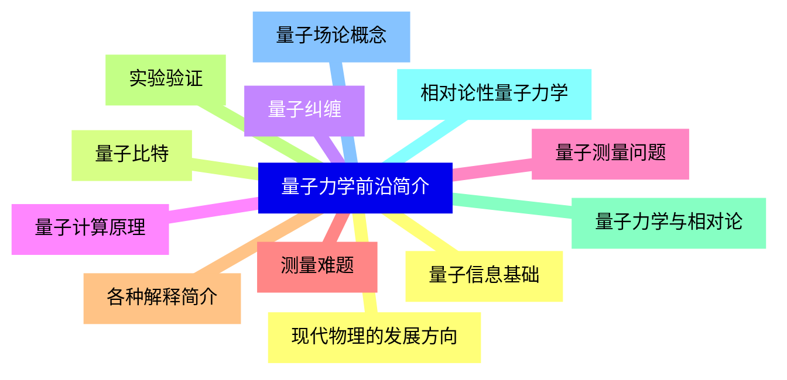


### 1 [量子力学导论](#1)
#### 1.1 [经典物理的困境](#1)
#### 1.2 [黑体辐射与紫外灾难](#1)
#### 1.3 [光电效应实验现象](#1)
#### 1.4 [原子光谱与玻尔模型](#1)
#### 1.5 [康普顿散射](#1)
#### 1.6 [波粒二象性](#1)
#### 1.7 [德布罗意物质波假说](#1)
#### 1.8 [电子衍射实验验证](#1)
#### 1.9 [波粒二象性的物理意义](#1)
#### 1.10 [量子力学的基本特征](#1)
#### 1.11 [量子化概念](#1)
#### 1.12 [概率波描述](#1)
#### 1.13 [不确定关系](#1)
#### 1.14 [态叠加原理](#1)
### 2 [波函数与薛定谔方程](#2)
#### 2.1 [波函数的基本概念](#2)
#### 2.2 [波函数的统计解释](#2)
#### 2.3 [波函数的归一化条件](#2)
#### 2.4 [波函数的标准化条件](#2)
#### 2.5 [薛定谔方程的建立](#2)
#### 2.6 [含时薛定谔方程](#2)
#### 2.7 [定态薛定谔方程](#2)
#### 2.8 [哈密顿算符](#2)
#### 2.9 [一维势场问题](#2)
#### 2.10 [维无限深势阱](#2)
#### 2.11 [维有限深势阱](#2)
#### 2.12 [势垒贯穿与隧道效应](#2)
#### 2.13 [谐振子问题](#2)
### 3 [量子力学中的算符](#3)
#### 3.1 [算符的基本概念](#3)
#### 3.2 [线性算符定义](#3)
#### 3.3 [厄米算符性质](#3)
#### 3.4 [算符的本征值问题](#3)
#### 3.5 [重要物理量的算符表示](#3)
#### 3.6 [坐标算符](#3)
#### 3.7 [动量算符](#3)
#### 3.8 [角动量算符](#3)
#### 3.9 [能量算符](#3)
#### 3.10 [算符对易关系](#3)
#### 3.11 [对易子定义](#3)
#### 3.12 [基本对易关系](#3)
#### 3.13 [不确定关系的算符表述](#3)
### 4 [量子力学基本原理](#4)
#### 4.1 [态矢量与希尔伯特空间](#4)
#### 4.2 [态矢量概念](#4)
#### 4.3 [希尔伯特空间性质](#4)
#### 4.4 [基矢与表象](#4)
#### 4.5 [测量理论](#4)
#### 4.6 [测量过程描述](#4)
#### 4.7 [测量结果的概率](#4)
#### 4.8 [波包坍缩](#4)
#### 4.9 [守恒量与对称性](#4)
#### 4.10 [守恒量的一般理论](#4)
#### 4.11 [空间平移对称性与动量守恒](#4)
#### 4.12 [时间平移对称性与能量守恒](#4)
#### 4.13 [空间旋转对称性与角动量守恒](#4)
### 5 [角动量理论](#5)
#### 5.1 [轨道角动量](#5)
#### 5.2 [轨道角动量算符](#5)
#### 5.3 [角动量量子数](#5)
#### 5.4 [球谐函数](#5)
#### 5.5 [自旋角动量](#5)
#### 5.6 [自旋的引入](#5)
#### 5.7 [自旋算符与泡利矩阵](#5)
#### 5.8 [自旋波函数](#5)
#### 5.9 [角动量耦合](#5)
#### 5.10 [角动量相加规则](#5)
#### 5.11 [克莱布希-高登系数](#5)
#### 5.12 [总角动量量子数](#5)
### 6 [氢原子问题](#6)
#### 6.1 [中心力场问题](#6)
#### 6.2 [球坐标系下的薛定谔方程](#6)
#### 6.3 [径向波函数](#6)
#### 6.4 [角向波函数](#6)
#### 6.5 [氢原子能级与波函数](#6)
#### 6.6 [主量子数与能级](#6)
#### 6.7 [角量子数与轨道形状](#6)
#### 6.8 [磁量子数与空间取向](#6)
#### 6.9 [氢原子光谱](#6)
#### 6.10 [光谱线系](#6)
#### 6.11 [选择定则](#6)
#### 6.12 [精细结构](#6)
### 7 [近似方法](#7)
#### 7.1 [定态微扰理论](#7)
#### 7.2 [非简并微扰理论](#7)
#### 7.3 [简并微扰理论](#7)
#### 7.4 [微扰论的应用](#7)
#### 7.5 [变分法](#7)
#### 7.6 [变分原理](#7)
#### 7.7 [试探波函数选择](#7)
#### 7.8 [变分法应用实例](#7)
#### 7.9 [含时微扰理论](#7)
#### 7.10 [跃迁概率计算](#7)
#### 7.11 [黄金规则](#7)
#### 7.12 [光的吸收与发射](#7)
### 8 [全同粒子体系](#8)
#### 8.1 [全同粒子概念](#8)
#### 8.2 [全同粒子的不可区分性](#8)
#### 8.3 [交换对称性](#8)
#### 8.4 [波函数的对称化](#8)
#### 8.5 [对称波函数](#8)
#### 8.6 [反对称波函数](#8)
#### 8.7 [斯莱特行列式](#8)
#### 8.8 [泡利不相容原理](#8)
#### 8.9 [原理表述](#8)
#### 8.10 [在原子结构中的应用](#8)
#### 8.11 [费米子与玻色子](#8)
### 9 [量子力学应用简介](#9)
#### 9.1 [原子物理应用](#9)
#### 9.2 [多电子原子](#9)
#### 9.3 [元素周期表的量子解释](#9)
#### 9.4 [X射线谱](#9)
#### 9.5 [固体物理应用](#9)
#### 9.6 [能带理论初步](#9)
#### 9.7 [导体、半导体、绝缘体](#9)
#### 9.8 [超导现象简介](#9)
#### 9.9 [原子核与粒子物理应用](#9)
#### 9.10 [核壳层模型](#9)
#### 9.11 [基本粒子分类](#9)
#### 9.12 [量子场论概念简介](#9)
### 10 [量子力学前沿简介](#10)
#### 10.1 [量子信息基础](#10)
#### 10.2 [量子比特](#10)
#### 10.3 [量子纠缠](#10)
#### 10.4 [量子计算原理](#10)
#### 10.5 [量子测量问题](#10)
#### 10.6 [测量难题](#10)
#### 10.7 [各种解释简介](#10)
#### 10.8 [实验验证](#10)
#### 10.9 [量子力学与相对论](#10)
#### 10.10 [相对论性量子力学](#10)
#### 10.11 [量子场论概念](#10)
#### 10.12 [现代物理的发展方向](#10)




### 1 量子力学导论

---
### 1 量子力学导论
___
#### 1.1 经典物理的困境
___
#### 1.2 黑体辐射与紫外灾难
___
#### 1.3 光电效应实验现象
___
#### 1.4 原子光谱与玻尔模型
___
#### 1.5 康普顿散射
___
#### 1.6 波粒二象性
___
#### 1.7 德布罗意物质波假说
___
#### 1.8 电子衍射实验验证
___
#### 1.9 波粒二象性的物理意义
___
#### 1.10 量子力学的基本特征
___
#### 1.11 量子化概念
___
#### 1.12 概率波描述
___
#### 1.13 不确定关系
___
#### 1.14 态叠加原理
### 2 波函数与薛定谔方程

---
### 2 波函数与薛定谔方程
___
#### 2.1 波函数的基本概念
___
#### 2.2 波函数的统计解释
___
#### 2.3 波函数的归一化条件
___
#### 2.4 波函数的标准化条件
___
#### 2.5 薛定谔方程的建立
___
#### 2.6 含时薛定谔方程
___
#### 2.7 定态薛定谔方程
___
#### 2.8 哈密顿算符
___
#### 2.9 一维势场问题
___
#### 2.10 维无限深势阱
___
#### 2.11 维有限深势阱
___
#### 2.12 势垒贯穿与隧道效应
___
#### 2.13 谐振子问题
### 3 量子力学中的算符

---
### 3 量子力学中的算符
___
#### 3.1 算符的基本概念
___
#### 3.2 线性算符定义
___
#### 3.3 厄米算符性质
___
#### 3.4 算符的本征值问题
___
#### 3.5 重要物理量的算符表示
___
#### 3.6 坐标算符
___
#### 3.7 动量算符
___
#### 3.8 角动量算符
___
#### 3.9 能量算符
___
#### 3.10 算符对易关系
___
#### 3.11 对易子定义
___
#### 3.12 基本对易关系
___
#### 3.13 不确定关系的算符表述
### 4 量子力学基本原理

---
### 4 量子力学基本原理
___
#### 4.1 态矢量与希尔伯特空间
___
#### 4.2 态矢量概念
___
#### 4.3 希尔伯特空间性质
___
#### 4.4 基矢与表象
___
#### 4.5 测量理论
___
#### 4.6 测量过程描述
___
#### 4.7 测量结果的概率
___
#### 4.8 波包坍缩
___
#### 4.9 守恒量与对称性
___
#### 4.10 守恒量的一般理论
___
#### 4.11 空间平移对称性与动量守恒
___
#### 4.12 时间平移对称性与能量守恒
___
#### 4.13 空间旋转对称性与角动量守恒
### 5 角动量理论

---
### 5 角动量理论
___
#### 5.1 轨道角动量
___
#### 5.2 轨道角动量算符
___
#### 5.3 角动量量子数
___
#### 5.4 球谐函数
___
#### 5.5 自旋角动量
___
#### 5.6 自旋的引入
___
#### 5.7 自旋算符与泡利矩阵
___
#### 5.8 自旋波函数
___
#### 5.9 角动量耦合
___
#### 5.10 角动量相加规则
___
#### 5.11 克莱布希-高登系数
___
#### 5.12 总角动量量子数
### 6 氢原子问题

---
### 6 氢原子问题
___
#### 6.1 中心力场问题
___
#### 6.2 球坐标系下的薛定谔方程
___
#### 6.3 径向波函数
___
#### 6.4 角向波函数
___
#### 6.5 氢原子能级与波函数
___
#### 6.6 主量子数与能级
___
#### 6.7 角量子数与轨道形状
___
#### 6.8 磁量子数与空间取向
___
#### 6.9 氢原子光谱
___
#### 6.10 光谱线系
___
#### 6.11 选择定则
___
#### 6.12 精细结构
### 7 近似方法

---
### 7 近似方法
___
#### 7.1 定态微扰理论
___
#### 7.2 非简并微扰理论
___
#### 7.3 简并微扰理论
___
#### 7.4 微扰论的应用
___
#### 7.5 变分法
___
#### 7.6 变分原理
___
#### 7.7 试探波函数选择
___
#### 7.8 变分法应用实例
___
#### 7.9 含时微扰理论
___
#### 7.10 跃迁概率计算
___
#### 7.11 黄金规则
___
#### 7.12 光的吸收与发射
### 8 全同粒子体系

---
### 8 全同粒子体系
___
#### 8.1 全同粒子概念
___
#### 8.2 全同粒子的不可区分性
___
#### 8.3 交换对称性
___
#### 8.4 波函数的对称化
___
#### 8.5 对称波函数
___
#### 8.6 反对称波函数
___
#### 8.7 斯莱特行列式
___
#### 8.8 泡利不相容原理
___
#### 8.9 原理表述
___
#### 8.10 在原子结构中的应用
___
#### 8.11 费米子与玻色子
### 9 量子力学应用简介

---
### 9 量子力学应用简介
___
#### 9.1 原子物理应用
___
#### 9.2 多电子原子
___
#### 9.3 元素周期表的量子解释
___
#### 9.4 X射线谱
___
#### 9.5 固体物理应用
___
#### 9.6 能带理论初步
___
#### 9.7 导体、半导体、绝缘体
___
#### 9.8 超导现象简介
___
#### 9.9 原子核与粒子物理应用
___
#### 9.10 核壳层模型
___
#### 9.11 基本粒子分类
___
#### 9.12 量子场论概念简介
### 10 量子力学前沿简介

---
### 10 量子力学前沿简介
___
#### 10.1 量子信息基础
___
#### 10.2 量子比特
___
#### 10.3 量子纠缠
___
#### 10.4 量子计算原理
___
#### 10.5 量子测量问题
___
#### 10.6 测量难题
___
#### 10.7 各种解释简介
___
#### 10.8 实验验证
___
#### 10.9 量子力学与相对论
___
#### 10.10 相对论性量子力学
___
#### 10.11 量子场论概念
___
#### 10.12 现代物理的发展方向


### 1 量子力学导论{#1}

{}

<--->
{}
{}
{}
{}
{}
{}
{}
{}
{}
{}
{}
{}
{}
{}
{}
{}
{}
{}
{}
{}
{}
{}
{}
{}
{}
{}
{}
{}
{}

### 2 波函数与薛定谔方程{#2}

{}
{}
{}
{}
{}
{}
{}
{}
{}
{}
{}
{}
{}
{}
{}
{}
{}
{}
{}
{}
{}
{}
{}
{}
{}
{}
{}
<--->

{}

### 3 量子力学中的算符{#3}

{}

<--->
{}
{}
{}
{}
{}
{}
{}
{}
{}
{}
{}
{}
{}
{}
{}
{}
{}
{}
{}
{}
{}
{}
{}
{}
{}
{}
{}

### 4 量子力学基本原理{#4}

{}
{}
{}
{}
{}
{}
{}
{}
{}
{}
{}
{}
{}
{}
{}
{}
{}
{}
{}
{}
{}
{}
{}
{}
{}
{}
{}
<--->

{}

### 5 角动量理论{#5}

{}

<--->
{}
{}
{}
{}
{}
{}
{}
{}
{}
{}
{}
{}
{}
{}
{}
{}
{}
{}
{}
{}
{}
{}
{}
{}
{}

### 6 氢原子问题{#6}

{}
{}
{}
{}
{}
{}
{}
{}
{}
{}
{}
{}
{}
{}
{}
{}
{}
{}
{}
{}
{}
{}
{}
{}
{}
<--->

{}

### 7 近似方法{#7}

{}

<--->
{}
{}
{}
{}
{}
{}
{}
{}
{}
{}
{}
{}
{}
{}
{}
{}
{}
{}
{}
{}
{}
{}
{}
{}
{}

### 8 全同粒子体系{#8}

{}
{}
{}
{}
{}
{}
{}
{}
{}
{}
{}
{}
{}
{}
{}
{}
{}
{}
{}
{}
{}
{}
{}
<--->

{}

### 9 量子力学应用简介{#9}

{}

<--->
{}
{}
{}
{}
{}
{}
{}
{}
{}
{}
{}
{}
{}
{}
{}
{}
{}
{}
{}
{}
{}
{}
{}
{}
{}

### 10 量子力学前沿简介{#10}

{}
{}
{}
{}
{}
{}
{}
{}
{}
{}
{}
{}
{}
{}
{}
{}
{}
{}
{}
{}
{}
{}
{}
{}
{}
<--->

{}
