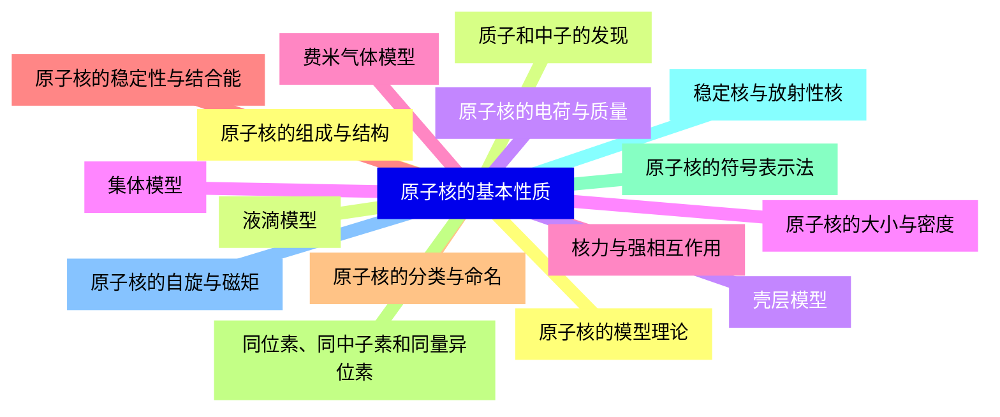
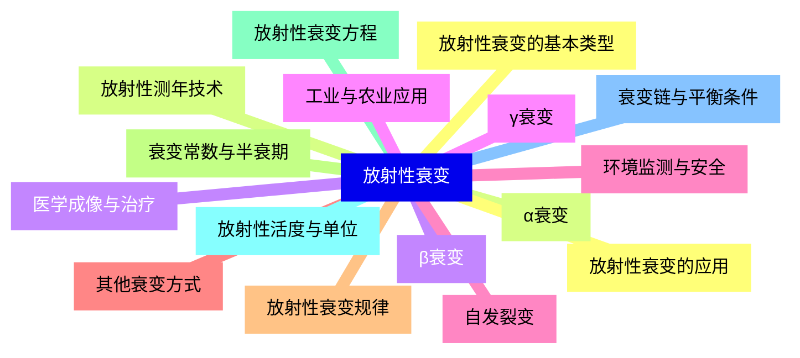
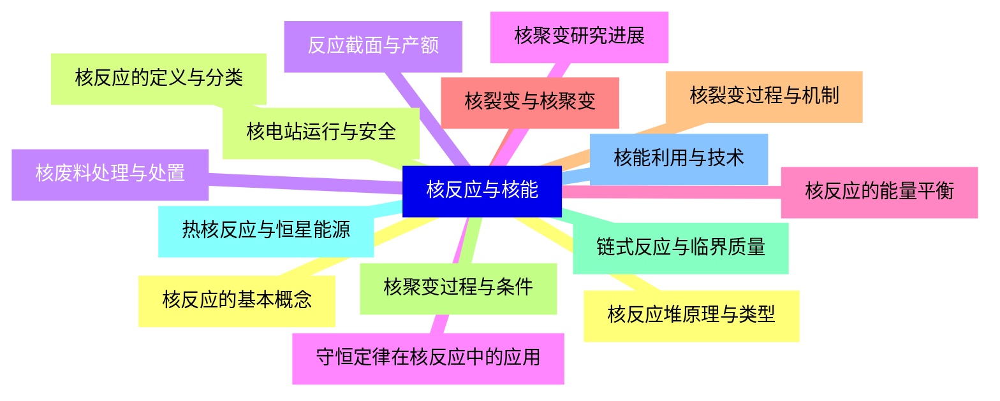
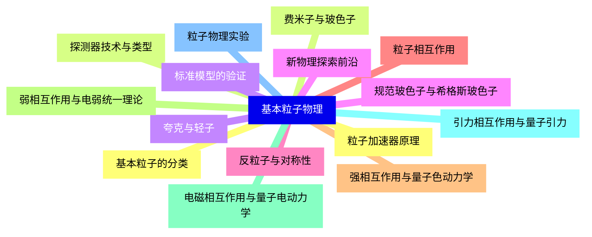
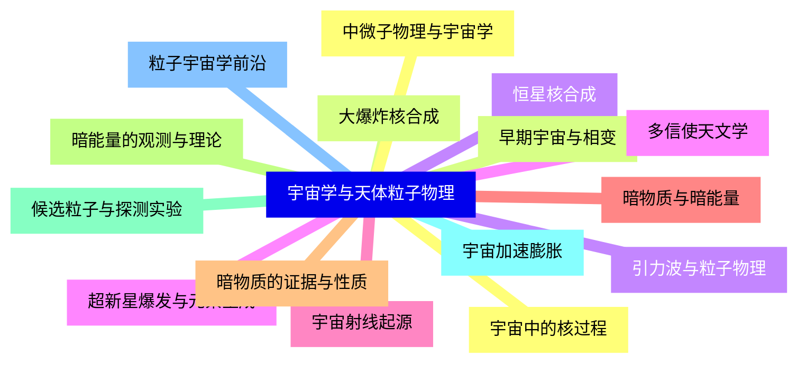
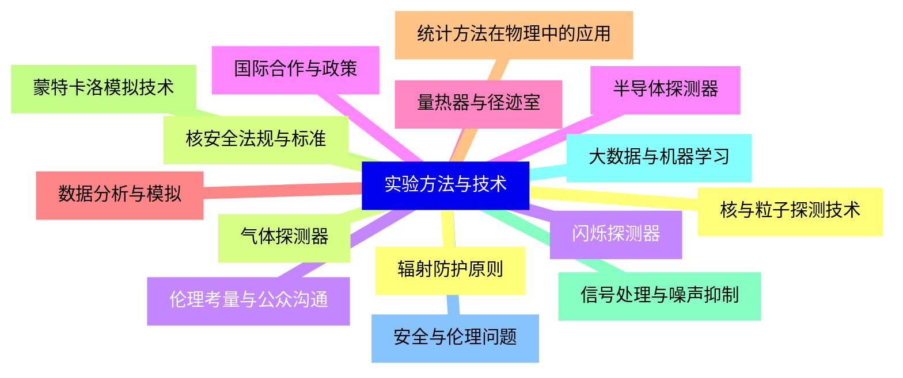
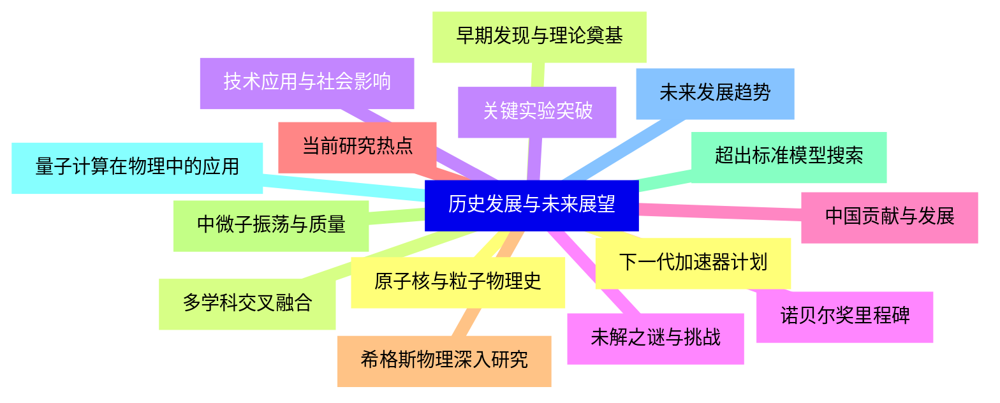


### 1 [原子核的基本性质](#1)
#### 1.1 [原子核的组成与结构](#1)
#### 1.2 [质子和中子的发现](#1)
#### 1.3 [原子核的电荷与质量](#1)
#### 1.4 [原子核的大小与密度](#1)
#### 1.5 [核力与强相互作用](#1)
#### 1.6 [原子核的稳定性与结合能](#1)
#### 1.7 [原子核的分类与命名](#1)
#### 1.8 [同位素、同中子素和同量异位素](#1)
#### 1.9 [原子核的符号表示法](#1)
#### 1.10 [稳定核与放射性核](#1)
#### 1.11 [原子核的自旋与磁矩](#1)
#### 1.12 [原子核的模型理论](#1)
#### 1.13 [液滴模型](#1)
#### 1.14 [壳层模型](#1)
#### 1.15 [集体模型](#1)
#### 1.16 [费米气体模型](#1)
### 2 [放射性衰变](#2)
#### 2.1 [放射性衰变的基本类型](#2)
#### 2.2 [α衰变](#2)
#### 2.3 [β衰变](#2)
#### 2.4 [γ衰变](#2)
#### 2.5 [自发裂变](#2)
#### 2.6 [其他衰变方式](#2)
#### 2.7 [放射性衰变规律](#2)
#### 2.8 [衰变常数与半衰期](#2)
#### 2.9 [放射性衰变方程](#2)
#### 2.10 [放射性活度与单位](#2)
#### 2.11 [衰变链与平衡条件](#2)
#### 2.12 [放射性衰变的应用](#2)
#### 2.13 [放射性测年技术](#2)
#### 2.14 [医学成像与治疗](#2)
#### 2.15 [工业与农业应用](#2)
#### 2.16 [环境监测与安全](#2)
### 3 [核反应与核能](#3)
#### 3.1 [核反应的基本概念](#3)
#### 3.2 [核反应的定义与分类](#3)
#### 3.3 [反应截面与产额](#3)
#### 3.4 [守恒定律在核反应中的应用](#3)
#### 3.5 [核反应的能量平衡](#3)
#### 3.6 [核裂变与核聚变](#3)
#### 3.7 [核裂变过程与机制](#3)
#### 3.8 [核聚变过程与条件](#3)
#### 3.9 [链式反应与临界质量](#3)
#### 3.10 [热核反应与恒星能源](#3)
#### 3.11 [核能利用与技术](#3)
#### 3.12 [核反应堆原理与类型](#3)
#### 3.13 [核电站运行与安全](#3)
#### 3.14 [核废料处理与处置](#3)
#### 3.15 [核聚变研究进展](#3)
### 4 [基本粒子物理](#4)
#### 4.1 [基本粒子的分类](#4)
#### 4.2 [费米子与玻色子](#4)
#### 4.3 [夸克与轻子](#4)
#### 4.4 [规范玻色子与希格斯玻色子](#4)
#### 4.5 [反粒子与对称性](#4)
#### 4.6 [粒子相互作用](#4)
#### 4.7 [强相互作用与量子色动力学](#4)
#### 4.8 [弱相互作用与电弱统一理论](#4)
#### 4.9 [电磁相互作用与量子电动力学](#4)
#### 4.10 [引力相互作用与量子引力](#4)
#### 4.11 [粒子物理实验](#4)
#### 4.12 [粒子加速器原理](#4)
#### 4.13 [探测器技术与类型](#4)
#### 4.14 [标准模型的验证](#4)
#### 4.15 [新物理探索前沿](#4)
### 5 [宇宙学与天体粒子物理](#5)
#### 5.1 [宇宙中的核过程](#5)
#### 5.2 [大爆炸核合成](#5)
#### 5.3 [恒星核合成](#5)
#### 5.4 [超新星爆发与元素生成](#5)
#### 5.5 [宇宙射线起源](#5)
#### 5.6 [暗物质与暗能量](#5)
#### 5.7 [暗物质的证据与性质](#5)
#### 5.8 [暗能量的观测与理论](#5)
#### 5.9 [候选粒子与探测实验](#5)
#### 5.10 [宇宙加速膨胀](#5)
#### 5.11 [粒子宇宙学前沿](#5)
#### 5.12 [中微子物理与宇宙学](#5)
#### 5.13 [早期宇宙与相变](#5)
#### 5.14 [引力波与粒子物理](#5)
#### 5.15 [多信使天文学](#5)
### 6 [实验方法与技术](#6)
#### 6.1 [核与粒子探测技术](#6)
#### 6.2 [气体探测器](#6)
#### 6.3 [闪烁探测器](#6)
#### 6.4 [半导体探测器](#6)
#### 6.5 [量热器与径迹室](#6)
#### 6.6 [数据分析与模拟](#6)
#### 6.7 [统计方法在物理中的应用](#6)
#### 6.8 [蒙特卡洛模拟技术](#6)
#### 6.9 [信号处理与噪声抑制](#6)
#### 6.10 [大数据与机器学习](#6)
#### 6.11 [安全与伦理问题](#6)
#### 6.12 [辐射防护原则](#6)
#### 6.13 [核安全法规与标准](#6)
#### 6.14 [伦理考量与公众沟通](#6)
#### 6.15 [国际合作与政策](#6)
### 7 [历史发展与未来展望](#7)
#### 7.1 [原子核与粒子物理史](#7)
#### 7.2 [早期发现与理论奠基](#7)
#### 7.3 [关键实验突破](#7)
#### 7.4 [诺贝尔奖里程碑](#7)
#### 7.5 [中国贡献与发展](#7)
#### 7.6 [当前研究热点](#7)
#### 7.7 [希格斯物理深入研究](#7)
#### 7.8 [中微子振荡与质量](#7)
#### 7.9 [超出标准模型搜索](#7)
#### 7.10 [量子计算在物理中的应用](#7)
#### 7.11 [未来发展趋势](#7)
#### 7.12 [下一代加速器计划](#7)
#### 7.13 [多学科交叉融合](#7)
#### 7.14 [技术应用与社会影响](#7)
#### 7.15 [未解之谜与挑战](#7)




### 1 原子核的基本性质

---
### 1 原子核的基本性质
___
#### 1.1 原子核的组成与结构
___
#### 1.2 质子和中子的发现
___
#### 1.3 原子核的电荷与质量
___
#### 1.4 原子核的大小与密度
___
#### 1.5 核力与强相互作用
___
#### 1.6 原子核的稳定性与结合能
___
#### 1.7 原子核的分类与命名
___
#### 1.8 同位素、同中子素和同量异位素
___
#### 1.9 原子核的符号表示法
___
#### 1.10 稳定核与放射性核
___
#### 1.11 原子核的自旋与磁矩
___
#### 1.12 原子核的模型理论
___
#### 1.13 液滴模型
___
#### 1.14 壳层模型
___
#### 1.15 集体模型
___
#### 1.16 费米气体模型
### 2 放射性衰变

---
### 2 放射性衰变
___
#### 2.1 放射性衰变的基本类型
___
#### 2.2 α衰变
___
#### 2.3 β衰变
___
#### 2.4 γ衰变
___
#### 2.5 自发裂变
___
#### 2.6 其他衰变方式
___
#### 2.7 放射性衰变规律
___
#### 2.8 衰变常数与半衰期
___
#### 2.9 放射性衰变方程
___
#### 2.10 放射性活度与单位
___
#### 2.11 衰变链与平衡条件
___
#### 2.12 放射性衰变的应用
___
#### 2.13 放射性测年技术
___
#### 2.14 医学成像与治疗
___
#### 2.15 工业与农业应用
___
#### 2.16 环境监测与安全
### 3 核反应与核能

---
### 3 核反应与核能
___
#### 3.1 核反应的基本概念
___
#### 3.2 核反应的定义与分类
___
#### 3.3 反应截面与产额
___
#### 3.4 守恒定律在核反应中的应用
___
#### 3.5 核反应的能量平衡
___
#### 3.6 核裂变与核聚变
___
#### 3.7 核裂变过程与机制
___
#### 3.8 核聚变过程与条件
___
#### 3.9 链式反应与临界质量
___
#### 3.10 热核反应与恒星能源
___
#### 3.11 核能利用与技术
___
#### 3.12 核反应堆原理与类型
___
#### 3.13 核电站运行与安全
___
#### 3.14 核废料处理与处置
___
#### 3.15 核聚变研究进展
### 4 基本粒子物理

---
### 4 基本粒子物理
___
#### 4.1 基本粒子的分类
___
#### 4.2 费米子与玻色子
___
#### 4.3 夸克与轻子
___
#### 4.4 规范玻色子与希格斯玻色子
___
#### 4.5 反粒子与对称性
___
#### 4.6 粒子相互作用
___
#### 4.7 强相互作用与量子色动力学
___
#### 4.8 弱相互作用与电弱统一理论
___
#### 4.9 电磁相互作用与量子电动力学
___
#### 4.10 引力相互作用与量子引力
___
#### 4.11 粒子物理实验
___
#### 4.12 粒子加速器原理
___
#### 4.13 探测器技术与类型
___
#### 4.14 标准模型的验证
___
#### 4.15 新物理探索前沿
### 5 宇宙学与天体粒子物理

---
### 5 宇宙学与天体粒子物理
___
#### 5.1 宇宙中的核过程
___
#### 5.2 大爆炸核合成
___
#### 5.3 恒星核合成
___
#### 5.4 超新星爆发与元素生成
___
#### 5.5 宇宙射线起源
___
#### 5.6 暗物质与暗能量
___
#### 5.7 暗物质的证据与性质
___
#### 5.8 暗能量的观测与理论
___
#### 5.9 候选粒子与探测实验
___
#### 5.10 宇宙加速膨胀
___
#### 5.11 粒子宇宙学前沿
___
#### 5.12 中微子物理与宇宙学
___
#### 5.13 早期宇宙与相变
___
#### 5.14 引力波与粒子物理
___
#### 5.15 多信使天文学
### 6 实验方法与技术

---
### 6 实验方法与技术
___
#### 6.1 核与粒子探测技术
___
#### 6.2 气体探测器
___
#### 6.3 闪烁探测器
___
#### 6.4 半导体探测器
___
#### 6.5 量热器与径迹室
___
#### 6.6 数据分析与模拟
___
#### 6.7 统计方法在物理中的应用
___
#### 6.8 蒙特卡洛模拟技术
___
#### 6.9 信号处理与噪声抑制
___
#### 6.10 大数据与机器学习
___
#### 6.11 安全与伦理问题
___
#### 6.12 辐射防护原则
___
#### 6.13 核安全法规与标准
___
#### 6.14 伦理考量与公众沟通
___
#### 6.15 国际合作与政策
### 7 历史发展与未来展望

---
### 7 历史发展与未来展望
___
#### 7.1 原子核与粒子物理史
___
#### 7.2 早期发现与理论奠基
___
#### 7.3 关键实验突破
___
#### 7.4 诺贝尔奖里程碑
___
#### 7.5 中国贡献与发展
___
#### 7.6 当前研究热点
___
#### 7.7 希格斯物理深入研究
___
#### 7.8 中微子振荡与质量
___
#### 7.9 超出标准模型搜索
___
#### 7.10 量子计算在物理中的应用
___
#### 7.11 未来发展趋势
___
#### 7.12 下一代加速器计划
___
#### 7.13 多学科交叉融合
___
#### 7.14 技术应用与社会影响
___
#### 7.15 未解之谜与挑战


### 1 原子核的基本性质{#1}

{}

<--->
{}
{}
{}
{}
{}
{}
{}
{}
{}
{}
{}
{}
{}
{}
{}
{}
{}
{}
{}
{}
{}
{}
{}
{}
{}
{}
{}
{}
{}
{}
{}
{}
{}

### 2 放射性衰变{#2}

{}
{}
{}
{}
{}
{}
{}
{}
{}
{}
{}
{}
{}
{}
{}
{}
{}
{}
{}
{}
{}
{}
{}
{}
{}
{}
{}
{}
{}
{}
{}
{}
{}
<--->

{}

### 3 核反应与核能{#3}

{}

<--->
{}
{}
{}
{}
{}
{}
{}
{}
{}
{}
{}
{}
{}
{}
{}
{}
{}
{}
{}
{}
{}
{}
{}
{}
{}
{}
{}
{}
{}
{}
{}

### 4 基本粒子物理{#4}

{}
{}
{}
{}
{}
{}
{}
{}
{}
{}
{}
{}
{}
{}
{}
{}
{}
{}
{}
{}
{}
{}
{}
{}
{}
{}
{}
{}
{}
{}
{}
<--->

{}

### 5 宇宙学与天体粒子物理{#5}

{}

<--->
{}
{}
{}
{}
{}
{}
{}
{}
{}
{}
{}
{}
{}
{}
{}
{}
{}
{}
{}
{}
{}
{}
{}
{}
{}
{}
{}
{}
{}
{}
{}

### 6 实验方法与技术{#6}

{}
{}
{}
{}
{}
{}
{}
{}
{}
{}
{}
{}
{}
{}
{}
{}
{}
{}
{}
{}
{}
{}
{}
{}
{}
{}
{}
{}
{}
{}
{}
<--->

{}

### 7 历史发展与未来展望{#7}

{}

<--->
{}
{}
{}
{}
{}
{}
{}
{}
{}
{}
{}
{}
{}
{}
{}
{}
{}
{}
{}
{}
{}
{}
{}
{}
{}
{}
{}
{}
{}
{}
{}
