
### 1 [物理实验概论](#1)
#### 1.1 [物理实验的意义与目的](#1)
#### 1.2 [实验在物理学发展中的作用](#1)
#### 1.3 [科学实验的基本特征](#1)
#### 1.4 [物理实验的教学目标](#1)
#### 1.5 [物理实验的基本程序](#1)
#### 1.6 [实验预习与准备](#1)
#### 1.7 [实验操作与数据记录](#1)
#### 1.8 [数据处理与结果分析](#1)
#### 1.9 [实验报告撰写规范](#1)
#### 1.10 [实验误差理论基础](#1)
#### 1.11 [误差的基本概念与分类](#1)
#### 1.12 [随机误差的统计分布](#1)
#### 1.13 [系统误差的来源与消除](#1)
#### 1.14 [误差的传递与合成](#1)
### 2 [测量与数据处理](#2)
#### 2.1 [测量基本概念](#2)
#### 2.2 [直接测量与间接测量](#2)
#### 2.3 [等精度测量与不等精度测量](#2)
#### 2.4 [测量精度的评价指标](#2)
#### 2.5 [有效数字及其运算](#2)
#### 2.6 [有效数字的定义与确定](#2)
#### 2.7 [有效数字的运算规则](#2)
#### 2.8 [测量结果的数字修约](#2)
#### 2.9 [数据处理方法](#2)
#### 2.10 [列表法与图示法](#2)
#### 2.11 [逐差法处理数据](#2)
#### 2.12 [最小二乘法原理与应用](#2)
#### 2.13 [异常数据的判断与处理](#2)
### 3 [常用实验仪器](#3)
#### 3.1 [长度测量仪器](#3)
#### 3.2 [游标卡尺的原理与使用](#3)
#### 3.3 [螺旋测微器的结构与读数](#3)
#### 3.4 [读数显微镜的操作方法](#3)
#### 3.5 [质量与时间测量](#3)
#### 3.6 [物理天平的使用与校准](#3)
#### 3.7 [电子天平的工作原理](#3)
#### 3.8 [秒表与数字计时器的应用](#3)
#### 3.9 [电学测量仪器](#3)
#### 3.10 [万用表的使用方法](#3)
#### 3.11 [示波器的原理与操作](#3)
#### 3.12 [信号发生器的功能与应用](#3)
#### 3.13 [电桥测量原理](#3)
### 4 [基本实验方法](#4)
#### 4.1 [比较法](#4)
#### 4.2 [直接比较法](#4)
#### 4.3 [替代比较法](#4)
#### 4.4 [差值比较法](#4)
#### 4.5 [放大法](#4)
#### 4.6 [机械放大原理](#4)
#### 4.7 [光学放大技术](#4)
#### 4.8 [电子放大方法](#4)
#### 4.9 [转换测量法](#4)
#### 4.10 [非电量的电测法](#4)
#### 4.11 [光信号转换测量](#4)
#### 4.12 [温度转换测量技术](#4)
#### 4.13 [模拟法](#4)
#### 4.14 [物理模拟方法](#4)
#### 4.15 [数学模拟技术](#4)
#### 4.16 [计算机模拟应用](#4)
### 5 [力学实验](#5)
#### 5.1 [运动学实验](#5)
#### 5.2 [匀变速直线运动研究](#5)
#### 5.3 [自由落体运动实验](#5)
#### 5.4 [抛体运动规律验证](#5)
#### 5.5 [动力学实验](#5)
#### 5.6 [牛顿第二定律验证](#5)
#### 5.7 [动量守恒定律实验](#5)
#### 5.8 [机械能守恒研究](#5)
#### 5.9 [振动与波动实验](#5)
#### 5.10 [简谐振动特性研究](#5)
#### 5.11 [单摆周期测量](#5)
#### 5.12 [机械波传播特性](#5)
### 6 [热学实验](#6)
#### 6.1 [温度测量实验](#6)
#### 6.2 [热电偶测温原理](#6)
#### 6.3 [电阻温度计的使用](#6)
#### 6.4 [红外测温技术](#6)
#### 6.5 [热力学定律验证](#6)
#### 6.6 [比热容测量实验](#6)
#### 6.7 [热功当量测定](#6)
#### 6.8 [理想气体状态方程验证](#6)
#### 6.9 [相变与热传导](#6)
#### 6.10 [熔解热测量](#6)
#### 6.11 [汽化热测定](#6)
#### 6.12 [热传导系数测量](#6)
### 7 [电磁学实验](#7)
#### 7.1 [静电学实验](#7)
#### 7.2 [库仑定律验证](#7)
#### 7.3 [电场分布研究](#7)
#### 7.4 [电容测量方法](#7)
#### 7.5 [直流电路实验](#7)
#### 7.6 [欧姆定律验证](#7)
#### 7.7 [基尔霍夫定律应用](#7)
#### 7.8 [电功率测量](#7)
#### 7.9 [磁场测量实验](#7)
#### 7.10 [亥姆霍兹线圈磁场](#7)
#### 7.11 [磁感应强度测量](#7)
#### 7.12 [霍尔效应实验](#7)
#### 7.13 [电磁感应实验](#7)
#### 7.14 [法拉第电磁感应定律](#7)
#### 7.15 [自感与互感测量](#7)
#### 7.16 [交流电路特性](#7)
### 8 [光学实验](#8)
#### 8.1 [几何光学实验](#8)
#### 8.2 [透镜焦距测量](#8)
#### 8.3 [成像规律研究](#8)
#### 8.4 [光学仪器调节](#8)
#### 8.5 [物理光学实验](#8)
#### 8.6 [光的干涉现象](#8)
#### 8.7 [光的衍射研究](#8)
#### 8.8 [偏振光实验](#8)
#### 8.9 [现代光学实验](#8)
#### 8.10 [激光特性测量](#8)
#### 8.11 [光纤传输实验](#8)
#### 8.12 [光电效应研究](#8)
### 9 [近代物理实验](#9)
#### 9.1 [原子物理实验](#9)
#### 9.2 [弗兰克-赫兹实验](#9)
#### 9.3 [塞曼效应观测](#9)
#### 9.4 [原子光谱分析](#9)
#### 9.5 [核物理实验](#9)
#### 9.6 [放射性测量](#9)
#### 9.7 [核衰变统计规律](#9)
#### 9.8 [辐射防护基础](#9)
#### 9.9 [固体物理实验](#9)
#### 9.10 [半导体特性测量](#9)
#### 9.11 [超导现象观测](#9)
#### 9.12 [材料性能测试](#9)
### 10 [实验设计与创新](#10)
#### 10.1 [实验方案设计](#10)
#### 10.2 [实验目的确定](#10)
#### 10.3 [实验原理选择](#10)
#### 10.4 [实验步骤规划](#10)
#### 10.5 [实验条件优化](#10)
#### 10.6 [仪器选择与配置](#10)
#### 10.7 [测量条件控制](#10)
#### 10.8 [环境因素考虑](#10)
#### 10.9 [创新实验开发](#10)
#### 10.10 [研究性实验设计](#10)
#### 10.11 [综合性实验构建](#10)
#### 10.12 [实验方法改进](#10)
### 11 [实验室安全与规范](#11)
#### 11.1 [实验室安全制度](#11)
#### 11.2 [安全操作规程](#11)
#### 11.3 [危险品管理制度](#11)
#### 11.4 [应急预案制定](#11)
#### 11.5 [仪器维护与保养](#11)
#### 11.6 [常规维护要求](#11)
#### 11.7 [故障排查方法](#11)
#### 11.8 [校准与检定规范](#11)
#### 11.9 [实验伦理与规范](#11)
#### 11.10 [学术诚信要求](#11)
#### 11.11 [数据真实性保障](#11)
#### 11.12 [实验报告规范](#11)




### 1 物理实验概论

---
### 1 物理实验概论
___
#### 1.1 物理实验的意义与目的
___
#### 1.2 实验在物理学发展中的作用
___
#### 1.3 科学实验的基本特征
___
#### 1.4 物理实验的教学目标
___
#### 1.5 物理实验的基本程序
___
#### 1.6 实验预习与准备
___
#### 1.7 实验操作与数据记录
___
#### 1.8 数据处理与结果分析
___
#### 1.9 实验报告撰写规范
___
#### 1.10 实验误差理论基础
___
#### 1.11 误差的基本概念与分类
___
#### 1.12 随机误差的统计分布
___
#### 1.13 系统误差的来源与消除
___
#### 1.14 误差的传递与合成
### 2 测量与数据处理

---
### 2 测量与数据处理
___
#### 2.1 测量基本概念
___
#### 2.2 直接测量与间接测量
___
#### 2.3 等精度测量与不等精度测量
___
#### 2.4 测量精度的评价指标
___
#### 2.5 有效数字及其运算
___
#### 2.6 有效数字的定义与确定
___
#### 2.7 有效数字的运算规则
___
#### 2.8 测量结果的数字修约
___
#### 2.9 数据处理方法
___
#### 2.10 列表法与图示法
___
#### 2.11 逐差法处理数据
___
#### 2.12 最小二乘法原理与应用
___
#### 2.13 异常数据的判断与处理
### 3 常用实验仪器

---
### 3 常用实验仪器
___
#### 3.1 长度测量仪器
___
#### 3.2 游标卡尺的原理与使用
___
#### 3.3 螺旋测微器的结构与读数
___
#### 3.4 读数显微镜的操作方法
___
#### 3.5 质量与时间测量
___
#### 3.6 物理天平的使用与校准
___
#### 3.7 电子天平的工作原理
___
#### 3.8 秒表与数字计时器的应用
___
#### 3.9 电学测量仪器
___
#### 3.10 万用表的使用方法
___
#### 3.11 示波器的原理与操作
___
#### 3.12 信号发生器的功能与应用
___
#### 3.13 电桥测量原理
### 4 基本实验方法

---
### 4 基本实验方法
___
#### 4.1 比较法
___
#### 4.2 直接比较法
___
#### 4.3 替代比较法
___
#### 4.4 差值比较法
___
#### 4.5 放大法
___
#### 4.6 机械放大原理
___
#### 4.7 光学放大技术
___
#### 4.8 电子放大方法
___
#### 4.9 转换测量法
___
#### 4.10 非电量的电测法
___
#### 4.11 光信号转换测量
___
#### 4.12 温度转换测量技术
___
#### 4.13 模拟法
___
#### 4.14 物理模拟方法
___
#### 4.15 数学模拟技术
___
#### 4.16 计算机模拟应用
### 5 力学实验

---
### 5 力学实验
___
#### 5.1 运动学实验
___
#### 5.2 匀变速直线运动研究
___
#### 5.3 自由落体运动实验
___
#### 5.4 抛体运动规律验证
___
#### 5.5 动力学实验
___
#### 5.6 牛顿第二定律验证
___
#### 5.7 动量守恒定律实验
___
#### 5.8 机械能守恒研究
___
#### 5.9 振动与波动实验
___
#### 5.10 简谐振动特性研究
___
#### 5.11 单摆周期测量
___
#### 5.12 机械波传播特性
### 6 热学实验

---
### 6 热学实验
___
#### 6.1 温度测量实验
___
#### 6.2 热电偶测温原理
___
#### 6.3 电阻温度计的使用
___
#### 6.4 红外测温技术
___
#### 6.5 热力学定律验证
___
#### 6.6 比热容测量实验
___
#### 6.7 热功当量测定
___
#### 6.8 理想气体状态方程验证
___
#### 6.9 相变与热传导
___
#### 6.10 熔解热测量
___
#### 6.11 汽化热测定
___
#### 6.12 热传导系数测量
### 7 电磁学实验

---
### 7 电磁学实验
___
#### 7.1 静电学实验
___
#### 7.2 库仑定律验证
___
#### 7.3 电场分布研究
___
#### 7.4 电容测量方法
___
#### 7.5 直流电路实验
___
#### 7.6 欧姆定律验证
___
#### 7.7 基尔霍夫定律应用
___
#### 7.8 电功率测量
___
#### 7.9 磁场测量实验
___
#### 7.10 亥姆霍兹线圈磁场
___
#### 7.11 磁感应强度测量
___
#### 7.12 霍尔效应实验
___
#### 7.13 电磁感应实验
___
#### 7.14 法拉第电磁感应定律
___
#### 7.15 自感与互感测量
___
#### 7.16 交流电路特性
### 8 光学实验

---
### 8 光学实验
___
#### 8.1 几何光学实验
___
#### 8.2 透镜焦距测量
___
#### 8.3 成像规律研究
___
#### 8.4 光学仪器调节
___
#### 8.5 物理光学实验
___
#### 8.6 光的干涉现象
___
#### 8.7 光的衍射研究
___
#### 8.8 偏振光实验
___
#### 8.9 现代光学实验
___
#### 8.10 激光特性测量
___
#### 8.11 光纤传输实验
___
#### 8.12 光电效应研究
### 9 近代物理实验

---
### 9 近代物理实验
___
#### 9.1 原子物理实验
___
#### 9.2 弗兰克-赫兹实验
___
#### 9.3 塞曼效应观测
___
#### 9.4 原子光谱分析
___
#### 9.5 核物理实验
___
#### 9.6 放射性测量
___
#### 9.7 核衰变统计规律
___
#### 9.8 辐射防护基础
___
#### 9.9 固体物理实验
___
#### 9.10 半导体特性测量
___
#### 9.11 超导现象观测
___
#### 9.12 材料性能测试
### 10 实验设计与创新

---
### 10 实验设计与创新
___
#### 10.1 实验方案设计
___
#### 10.2 实验目的确定
___
#### 10.3 实验原理选择
___
#### 10.4 实验步骤规划
___
#### 10.5 实验条件优化
___
#### 10.6 仪器选择与配置
___
#### 10.7 测量条件控制
___
#### 10.8 环境因素考虑
___
#### 10.9 创新实验开发
___
#### 10.10 研究性实验设计
___
#### 10.11 综合性实验构建
___
#### 10.12 实验方法改进
### 11 实验室安全与规范

---
### 11 实验室安全与规范
___
#### 11.1 实验室安全制度
___
#### 11.2 安全操作规程
___
#### 11.3 危险品管理制度
___
#### 11.4 应急预案制定
___
#### 11.5 仪器维护与保养
___
#### 11.6 常规维护要求
___
#### 11.7 故障排查方法
___
#### 11.8 校准与检定规范
___
#### 11.9 实验伦理与规范
___
#### 11.10 学术诚信要求
___
#### 11.11 数据真实性保障
___
#### 11.12 实验报告规范


### 1 物理实验概论{#1}

{}
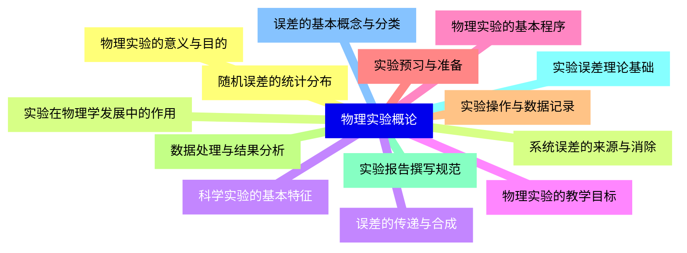

<--->
{}
{}
{}
{}
{}
{}
{}
{}
{}
{}
{}
{}
{}
{}
{}
{}
{}
{}
{}
{}
{}
{}
{}
{}
{}
{}
{}
{}
{}

### 2 测量与数据处理{#2}

{}
{}
{}
{}
{}
{}
{}
{}
{}
{}
{}
{}
{}
{}
{}
{}
{}
{}
{}
{}
{}
{}
{}
{}
{}
{}
{}
<--->
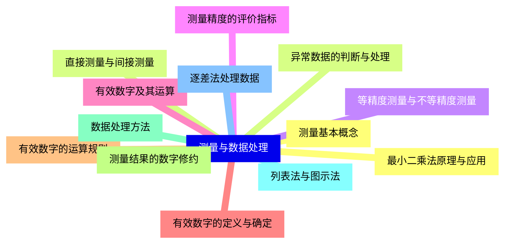

{}

### 3 常用实验仪器{#3}

{}
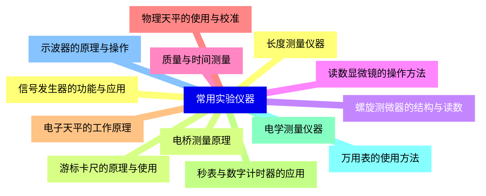

<--->
{}
{}
{}
{}
{}
{}
{}
{}
{}
{}
{}
{}
{}
{}
{}
{}
{}
{}
{}
{}
{}
{}
{}
{}
{}
{}
{}

### 4 基本实验方法{#4}

{}
{}
{}
{}
{}
{}
{}
{}
{}
{}
{}
{}
{}
{}
{}
{}
{}
{}
{}
{}
{}
{}
{}
{}
{}
{}
{}
{}
{}
{}
{}
{}
{}
<--->
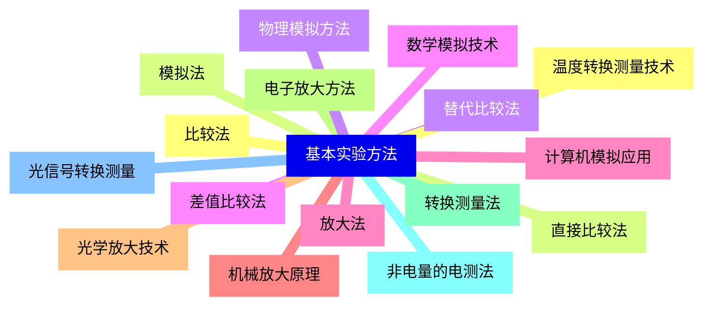

{}

### 5 力学实验{#5}

{}
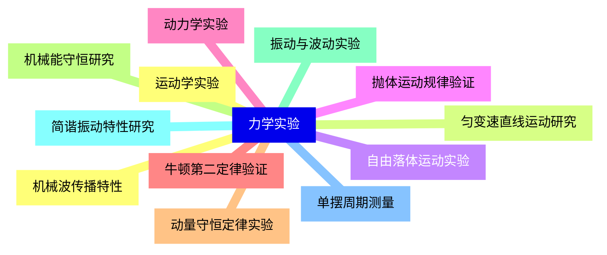

<--->
{}
{}
{}
{}
{}
{}
{}
{}
{}
{}
{}
{}
{}
{}
{}
{}
{}
{}
{}
{}
{}
{}
{}
{}
{}

### 6 热学实验{#6}

{}
{}
{}
{}
{}
{}
{}
{}
{}
{}
{}
{}
{}
{}
{}
{}
{}
{}
{}
{}
{}
{}
{}
{}
{}
<--->
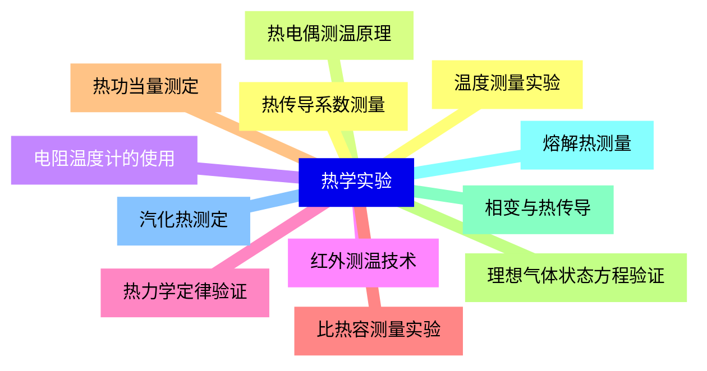

{}

### 7 电磁学实验{#7}

{}
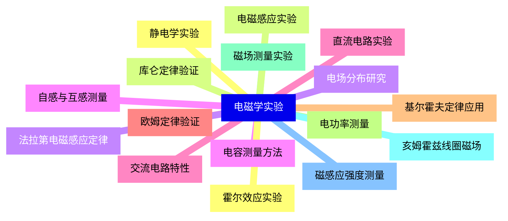

<--->
{}
{}
{}
{}
{}
{}
{}
{}
{}
{}
{}
{}
{}
{}
{}
{}
{}
{}
{}
{}
{}
{}
{}
{}
{}
{}
{}
{}
{}
{}
{}
{}
{}

### 8 光学实验{#8}

{}
{}
{}
{}
{}
{}
{}
{}
{}
{}
{}
{}
{}
{}
{}
{}
{}
{}
{}
{}
{}
{}
{}
{}
{}
<--->
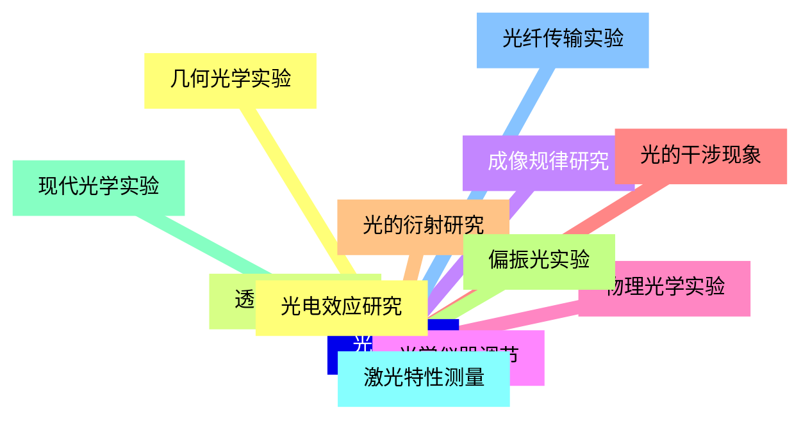

{}

### 9 近代物理实验{#9}

{}
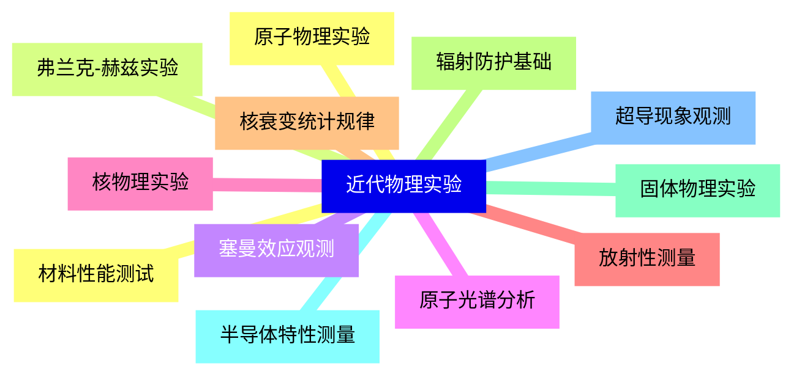

<--->
{}
{}
{}
{}
{}
{}
{}
{}
{}
{}
{}
{}
{}
{}
{}
{}
{}
{}
{}
{}
{}
{}
{}
{}
{}

### 10 实验设计与创新{#10}

{}
{}
{}
{}
{}
{}
{}
{}
{}
{}
{}
{}
{}
{}
{}
{}
{}
{}
{}
{}
{}
{}
{}
{}
{}
<--->
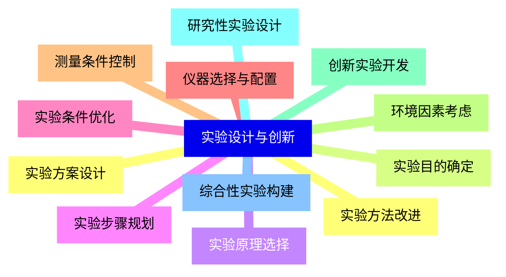

{}

### 11 实验室安全与规范{#11}

{}
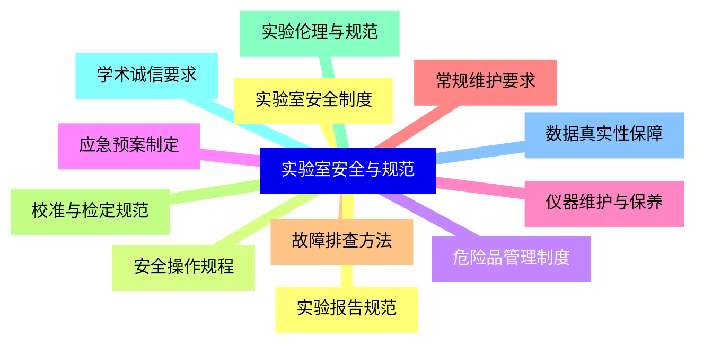

<--->
{}
{}
{}
{}
{}
{}
{}
{}
{}
{}
{}
{}
{}
{}
{}
{}
{}
{}
{}
{}
{}
{}
{}
{}
{}
