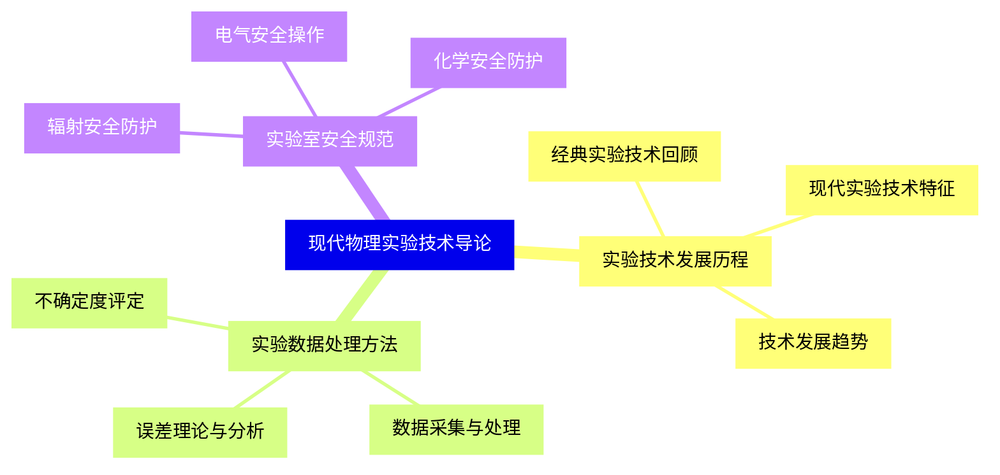
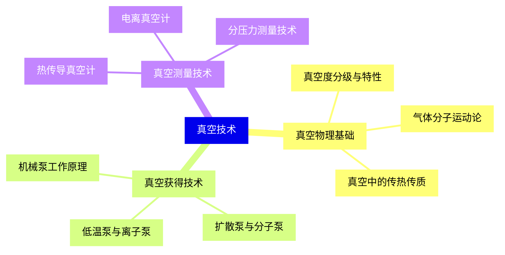
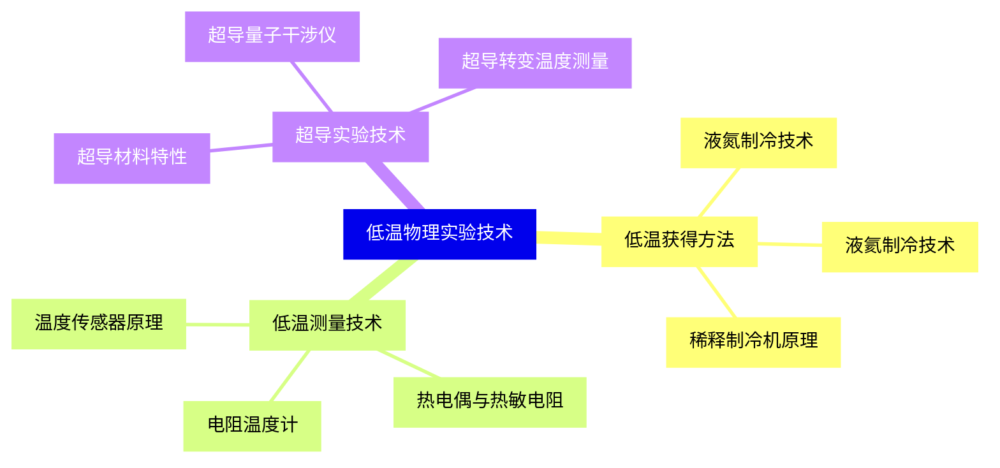
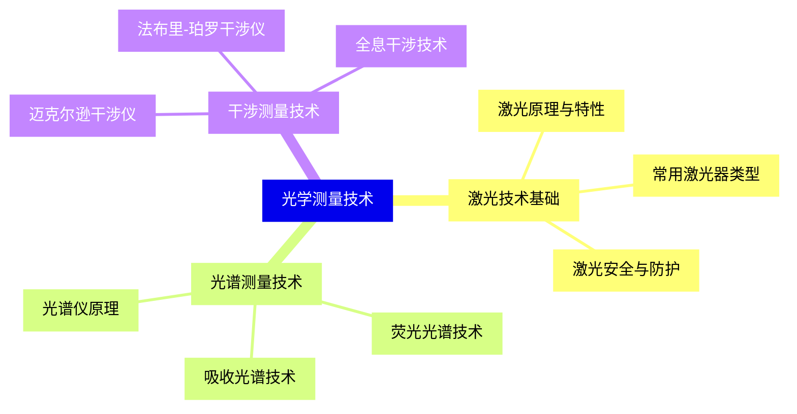
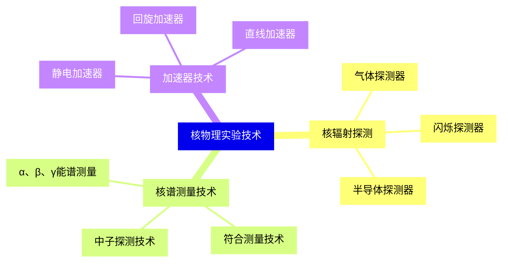
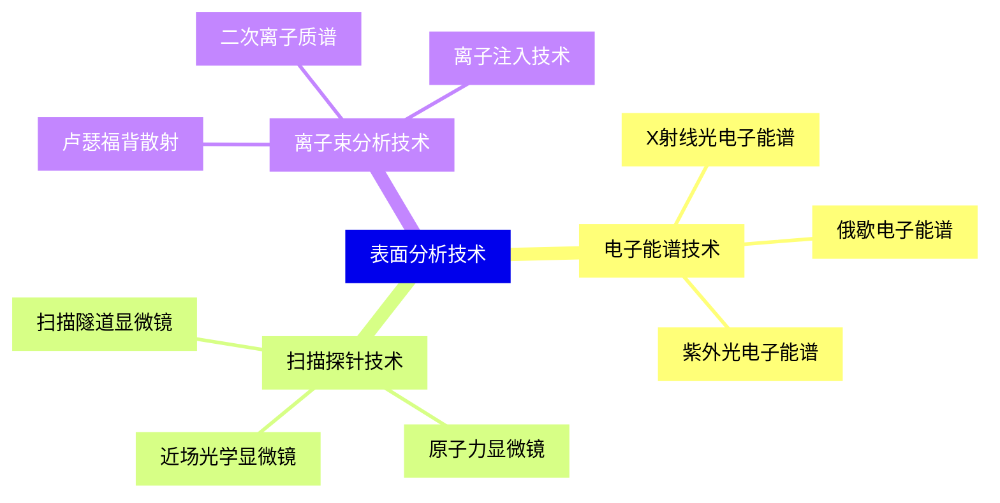
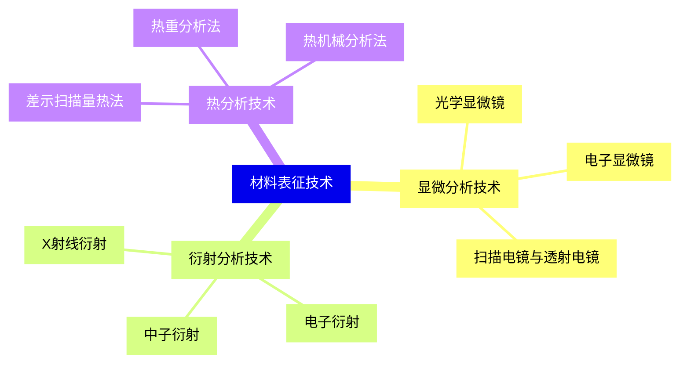
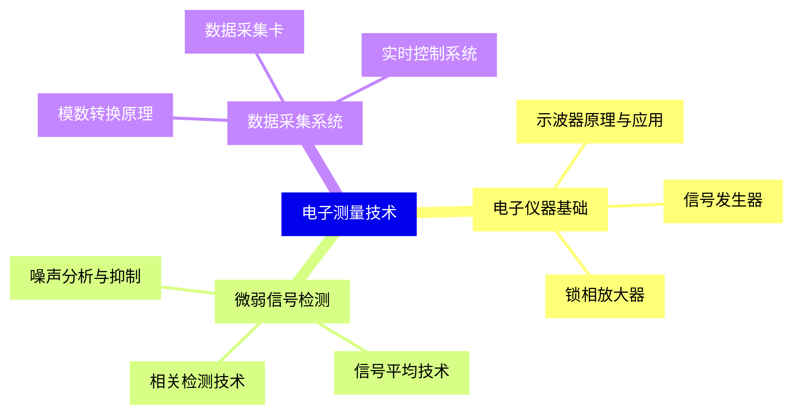
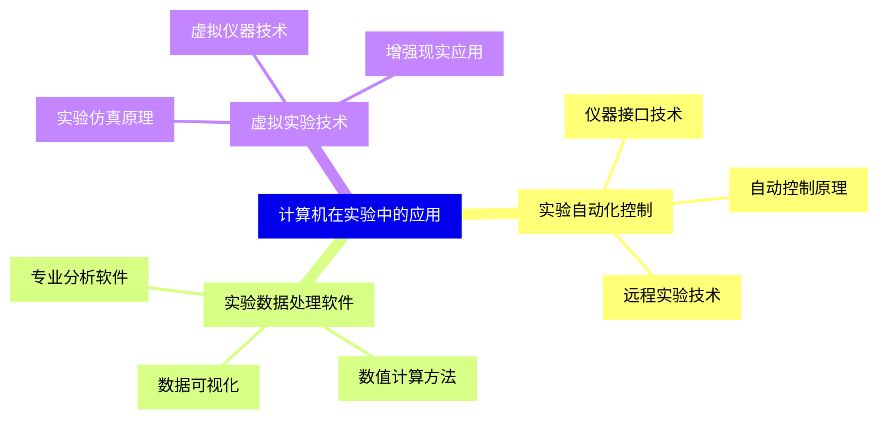
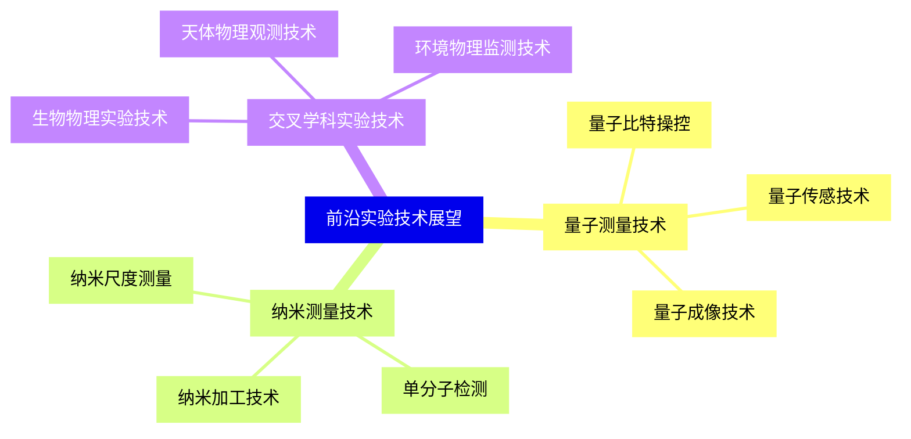


### 1 [现代物理实验技术导论](#1)
#### 1.1 [实验技术发展历程](#1)
##### 1.1.1 [经典实验技术回顾](#1)
##### 1.1.2 [现代实验技术特征](#1)
##### 1.1.3 [技术发展趋势](#1)
#### 1.2 [实验数据处理方法](#1)
##### 1.2.1 [误差理论与分析](#1)
##### 1.2.2 [数据采集与处理](#1)
##### 1.2.3 [不确定度评定](#1)
#### 1.3 [实验室安全规范](#1)
##### 1.3.1 [辐射安全防护](#1)
##### 1.3.2 [电气安全操作](#1)
##### 1.3.3 [化学安全防护](#1)
### 2 [真空技术](#2)
#### 2.1 [真空物理基础](#2)
##### 2.1.1 [真空度分级与特性](#2)
##### 2.1.2 [气体分子运动论](#2)
##### 2.1.3 [真空中的传热传质](#2)
#### 2.2 [真空获得技术](#2)
##### 2.2.1 [机械泵工作原理](#2)
##### 2.2.2 [扩散泵与分子泵](#2)
##### 2.2.3 [低温泵与离子泵](#2)
#### 2.3 [真空测量技术](#2)
##### 2.3.1 [热传导真空计](#2)
##### 2.3.2 [电离真空计](#2)
##### 2.3.3 [分压力测量技术](#2)
### 3 [低温物理实验技术](#3)
#### 3.1 [低温获得方法](#3)
##### 3.1.1 [液氮制冷技术](#3)
##### 3.1.2 [液氦制冷技术](#3)
##### 3.1.3 [稀释制冷机原理](#3)
#### 3.2 [低温测量技术](#3)
##### 3.2.1 [温度传感器原理](#3)
##### 3.2.2 [电阻温度计](#3)
##### 3.2.3 [热电偶与热敏电阻](#3)
#### 3.3 [超导实验技术](#3)
##### 3.3.1 [超导材料特性](#3)
##### 3.3.2 [超导转变温度测量](#3)
##### 3.3.3 [超导量子干涉仪](#3)
### 4 [光学测量技术](#4)
#### 4.1 [激光技术基础](#4)
##### 4.1.1 [激光原理与特性](#4)
##### 4.1.2 [常用激光器类型](#4)
##### 4.1.3 [激光安全与防护](#4)
#### 4.2 [光谱测量技术](#4)
##### 4.2.1 [光谱仪原理](#4)
##### 4.2.2 [吸收光谱技术](#4)
##### 4.2.3 [荧光光谱技术](#4)
#### 4.3 [干涉测量技术](#4)
##### 4.3.1 [迈克尔逊干涉仪](#4)
##### 4.3.2 [法布里-珀罗干涉仪](#4)
##### 4.3.3 [全息干涉技术](#4)
### 5 [核物理实验技术](#5)
#### 5.1 [核辐射探测](#5)
##### 5.1.1 [气体探测器](#5)
##### 5.1.2 [闪烁探测器](#5)
##### 5.1.3 [半导体探测器](#5)
#### 5.2 [核谱测量技术](#5)
##### 5.2.1 [α、β、γ能谱测量](#5)
##### 5.2.2 [符合测量技术](#5)
##### 5.2.3 [中子探测技术](#5)
#### 5.3 [加速器技术](#5)
##### 5.3.1 [静电加速器](#5)
##### 5.3.2 [回旋加速器](#5)
##### 5.3.3 [直线加速器](#5)
### 6 [表面分析技术](#6)
#### 6.1 [电子能谱技术](#6)
##### 6.1.1 [X射线光电子能谱](#6)
##### 6.1.2 [俄歇电子能谱](#6)
##### 6.1.3 [紫外光电子能谱](#6)
#### 6.2 [扫描探针技术](#6)
##### 6.2.1 [扫描隧道显微镜](#6)
##### 6.2.2 [原子力显微镜](#6)
##### 6.2.3 [近场光学显微镜](#6)
#### 6.3 [离子束分析技术](#6)
##### 6.3.1 [卢瑟福背散射](#6)
##### 6.3.2 [二次离子质谱](#6)
##### 6.3.3 [离子注入技术](#6)
### 7 [材料表征技术](#7)
#### 7.1 [显微分析技术](#7)
##### 7.1.1 [光学显微镜](#7)
##### 7.1.2 [电子显微镜](#7)
##### 7.1.3 [扫描电镜与透射电镜](#7)
#### 7.2 [衍射分析技术](#7)
##### 7.2.1 [X射线衍射](#7)
##### 7.2.2 [电子衍射](#7)
##### 7.2.3 [中子衍射](#7)
#### 7.3 [热分析技术](#7)
##### 7.3.1 [差示扫描量热法](#7)
##### 7.3.2 [热重分析法](#7)
##### 7.3.3 [热机械分析法](#7)
### 8 [电子测量技术](#8)
#### 8.1 [电子仪器基础](#8)
##### 8.1.1 [示波器原理与应用](#8)
##### 8.1.2 [信号发生器](#8)
##### 8.1.3 [锁相放大器](#8)
#### 8.2 [微弱信号检测](#8)
##### 8.2.1 [噪声分析与抑制](#8)
##### 8.2.2 [信号平均技术](#8)
##### 8.2.3 [相关检测技术](#8)
#### 8.3 [数据采集系统](#8)
##### 8.3.1 [模数转换原理](#8)
##### 8.3.2 [数据采集卡](#8)
##### 8.3.3 [实时控制系统](#8)
### 9 [计算机在实验中的应用](#9)
#### 9.1 [实验自动化控制](#9)
##### 9.1.1 [仪器接口技术](#9)
##### 9.1.2 [自动控制原理](#9)
##### 9.1.3 [远程实验技术](#9)
#### 9.2 [实验数据处理软件](#9)
##### 9.2.1 [数据可视化](#9)
##### 9.2.2 [数值计算方法](#9)
##### 9.2.3 [专业分析软件](#9)
#### 9.3 [虚拟实验技术](#9)
##### 9.3.1 [实验仿真原理](#9)
##### 9.3.2 [虚拟仪器技术](#9)
##### 9.3.3 [增强现实应用](#9)
### 10 [前沿实验技术展望](#10)
#### 10.1 [量子测量技术](#10)
##### 10.1.1 [量子比特操控](#10)
##### 10.1.2 [量子传感技术](#10)
##### 10.1.3 [量子成像技术](#10)
#### 10.2 [纳米测量技术](#10)
##### 10.2.1 [纳米尺度测量](#10)
##### 10.2.2 [单分子检测](#10)
##### 10.2.3 [纳米加工技术](#10)
#### 10.3 [交叉学科实验技术](#10)
##### 10.3.1 [生物物理实验技术](#10)
##### 10.3.2 [天体物理观测技术](#10)
##### 10.3.3 [环境物理监测技术](#10)




### 1 现代物理实验技术导论

---
### 1 现代物理实验技术导论
___
#### 1.1 实验技术发展历程
___
##### 1.1.1 经典实验技术回顾
___
##### 1.1.2 现代实验技术特征
___
##### 1.1.3 技术发展趋势
___
#### 1.2 实验数据处理方法
___
##### 1.2.1 误差理论与分析
___
##### 1.2.2 数据采集与处理
___
##### 1.2.3 不确定度评定
___
#### 1.3 实验室安全规范
___
##### 1.3.1 辐射安全防护
___
##### 1.3.2 电气安全操作
___
##### 1.3.3 化学安全防护
### 2 真空技术

---
### 2 真空技术
___
#### 2.1 真空物理基础
___
##### 2.1.1 真空度分级与特性
___
##### 2.1.2 气体分子运动论
___
##### 2.1.3 真空中的传热传质
___
#### 2.2 真空获得技术
___
##### 2.2.1 机械泵工作原理
___
##### 2.2.2 扩散泵与分子泵
___
##### 2.2.3 低温泵与离子泵
___
#### 2.3 真空测量技术
___
##### 2.3.1 热传导真空计
___
##### 2.3.2 电离真空计
___
##### 2.3.3 分压力测量技术
### 3 低温物理实验技术

---
### 3 低温物理实验技术
___
#### 3.1 低温获得方法
___
##### 3.1.1 液氮制冷技术
___
##### 3.1.2 液氦制冷技术
___
##### 3.1.3 稀释制冷机原理
___
#### 3.2 低温测量技术
___
##### 3.2.1 温度传感器原理
___
##### 3.2.2 电阻温度计
___
##### 3.2.3 热电偶与热敏电阻
___
#### 3.3 超导实验技术
___
##### 3.3.1 超导材料特性
___
##### 3.3.2 超导转变温度测量
___
##### 3.3.3 超导量子干涉仪
### 4 光学测量技术

---
### 4 光学测量技术
___
#### 4.1 激光技术基础
___
##### 4.1.1 激光原理与特性
___
##### 4.1.2 常用激光器类型
___
##### 4.1.3 激光安全与防护
___
#### 4.2 光谱测量技术
___
##### 4.2.1 光谱仪原理
___
##### 4.2.2 吸收光谱技术
___
##### 4.2.3 荧光光谱技术
___
#### 4.3 干涉测量技术
___
##### 4.3.1 迈克尔逊干涉仪
___
##### 4.3.2 法布里-珀罗干涉仪
___
##### 4.3.3 全息干涉技术
### 5 核物理实验技术

---
### 5 核物理实验技术
___
#### 5.1 核辐射探测
___
##### 5.1.1 气体探测器
___
##### 5.1.2 闪烁探测器
___
##### 5.1.3 半导体探测器
___
#### 5.2 核谱测量技术
___
##### 5.2.1 α、β、γ能谱测量
___
##### 5.2.2 符合测量技术
___
##### 5.2.3 中子探测技术
___
#### 5.3 加速器技术
___
##### 5.3.1 静电加速器
___
##### 5.3.2 回旋加速器
___
##### 5.3.3 直线加速器
### 6 表面分析技术

---
### 6 表面分析技术
___
#### 6.1 电子能谱技术
___
##### 6.1.1 X射线光电子能谱
___
##### 6.1.2 俄歇电子能谱
___
##### 6.1.3 紫外光电子能谱
___
#### 6.2 扫描探针技术
___
##### 6.2.1 扫描隧道显微镜
___
##### 6.2.2 原子力显微镜
___
##### 6.2.3 近场光学显微镜
___
#### 6.3 离子束分析技术
___
##### 6.3.1 卢瑟福背散射
___
##### 6.3.2 二次离子质谱
___
##### 6.3.3 离子注入技术
### 7 材料表征技术

---
### 7 材料表征技术
___
#### 7.1 显微分析技术
___
##### 7.1.1 光学显微镜
___
##### 7.1.2 电子显微镜
___
##### 7.1.3 扫描电镜与透射电镜
___
#### 7.2 衍射分析技术
___
##### 7.2.1 X射线衍射
___
##### 7.2.2 电子衍射
___
##### 7.2.3 中子衍射
___
#### 7.3 热分析技术
___
##### 7.3.1 差示扫描量热法
___
##### 7.3.2 热重分析法
___
##### 7.3.3 热机械分析法
### 8 电子测量技术

---
### 8 电子测量技术
___
#### 8.1 电子仪器基础
___
##### 8.1.1 示波器原理与应用
___
##### 8.1.2 信号发生器
___
##### 8.1.3 锁相放大器
___
#### 8.2 微弱信号检测
___
##### 8.2.1 噪声分析与抑制
___
##### 8.2.2 信号平均技术
___
##### 8.2.3 相关检测技术
___
#### 8.3 数据采集系统
___
##### 8.3.1 模数转换原理
___
##### 8.3.2 数据采集卡
___
##### 8.3.3 实时控制系统
### 9 计算机在实验中的应用

---
### 9 计算机在实验中的应用
___
#### 9.1 实验自动化控制
___
##### 9.1.1 仪器接口技术
___
##### 9.1.2 自动控制原理
___
##### 9.1.3 远程实验技术
___
#### 9.2 实验数据处理软件
___
##### 9.2.1 数据可视化
___
##### 9.2.2 数值计算方法
___
##### 9.2.3 专业分析软件
___
#### 9.3 虚拟实验技术
___
##### 9.3.1 实验仿真原理
___
##### 9.3.2 虚拟仪器技术
___
##### 9.3.3 增强现实应用
### 10 前沿实验技术展望

---
### 10 前沿实验技术展望
___
#### 10.1 量子测量技术
___
##### 10.1.1 量子比特操控
___
##### 10.1.2 量子传感技术
___
##### 10.1.3 量子成像技术
___
#### 10.2 纳米测量技术
___
##### 10.2.1 纳米尺度测量
___
##### 10.2.2 单分子检测
___
##### 10.2.3 纳米加工技术
___
#### 10.3 交叉学科实验技术
___
##### 10.3.1 生物物理实验技术
___
##### 10.3.2 天体物理观测技术
___
##### 10.3.3 环境物理监测技术


### 1 现代物理实验技术导论{#1}

{}

<--->
{}
{}
{}
{}
{}
{}
{}
{}
{}
{}
{}
{}
{}
{}
{}
{}
{}
{}
{}
{}
{}
{}
{}
{}
{}

### 2 真空技术{#2}

{}
{}
{}
{}
{}
{}
{}
{}
{}
{}
{}
{}
{}
{}
{}
{}
{}
{}
{}
{}
{}
{}
{}
{}
{}
<--->

{}

### 3 低温物理实验技术{#3}

{}

<--->
{}
{}
{}
{}
{}
{}
{}
{}
{}
{}
{}
{}
{}
{}
{}
{}
{}
{}
{}
{}
{}
{}
{}
{}
{}

### 4 光学测量技术{#4}

{}
{}
{}
{}
{}
{}
{}
{}
{}
{}
{}
{}
{}
{}
{}
{}
{}
{}
{}
{}
{}
{}
{}
{}
{}
<--->

{}

### 5 核物理实验技术{#5}

{}

<--->
{}
{}
{}
{}
{}
{}
{}
{}
{}
{}
{}
{}
{}
{}
{}
{}
{}
{}
{}
{}
{}
{}
{}
{}
{}

### 6 表面分析技术{#6}

{}
{}
{}
{}
{}
{}
{}
{}
{}
{}
{}
{}
{}
{}
{}
{}
{}
{}
{}
{}
{}
{}
{}
{}
{}
<--->

{}

### 7 材料表征技术{#7}

{}

<--->
{}
{}
{}
{}
{}
{}
{}
{}
{}
{}
{}
{}
{}
{}
{}
{}
{}
{}
{}
{}
{}
{}
{}
{}
{}

### 8 电子测量技术{#8}

{}
{}
{}
{}
{}
{}
{}
{}
{}
{}
{}
{}
{}
{}
{}
{}
{}
{}
{}
{}
{}
{}
{}
{}
{}
<--->

{}

### 9 计算机在实验中的应用{#9}

{}

<--->
{}
{}
{}
{}
{}
{}
{}
{}
{}
{}
{}
{}
{}
{}
{}
{}
{}
{}
{}
{}
{}
{}
{}
{}
{}

### 10 前沿实验技术展望{#10}

{}
{}
{}
{}
{}
{}
{}
{}
{}
{}
{}
{}
{}
{}
{}
{}
{}
{}
{}
{}
{}
{}
{}
{}
{}
<--->

{}
