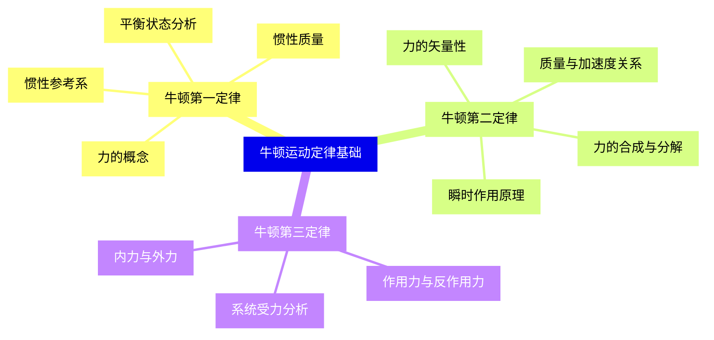
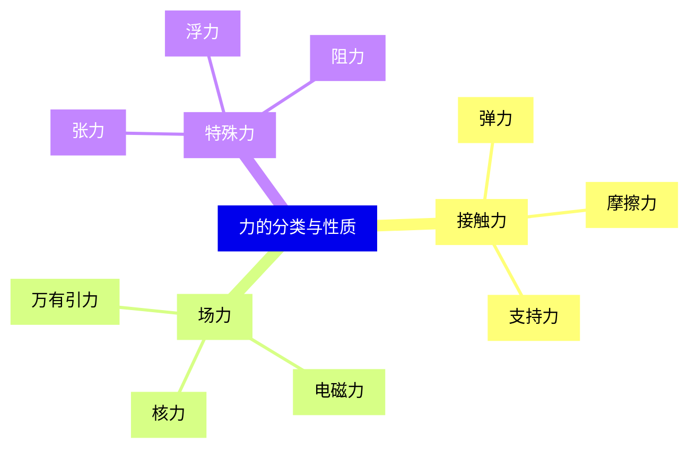
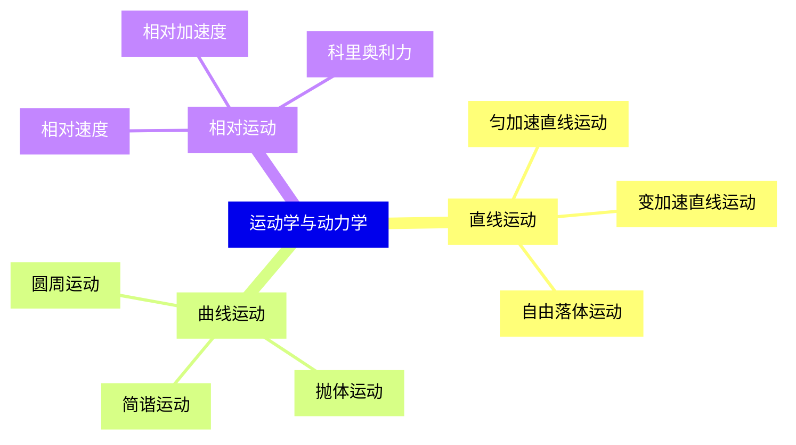
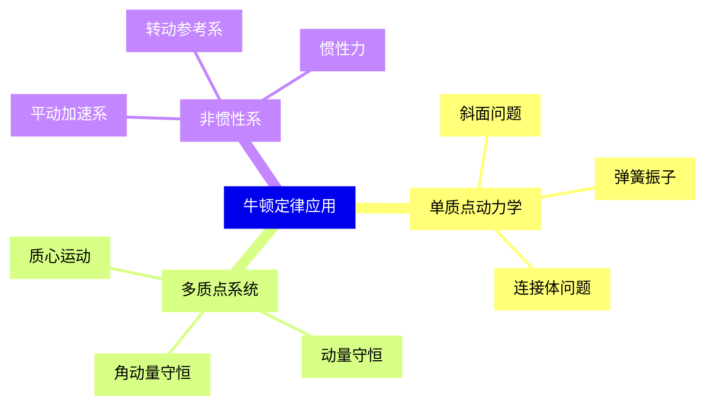
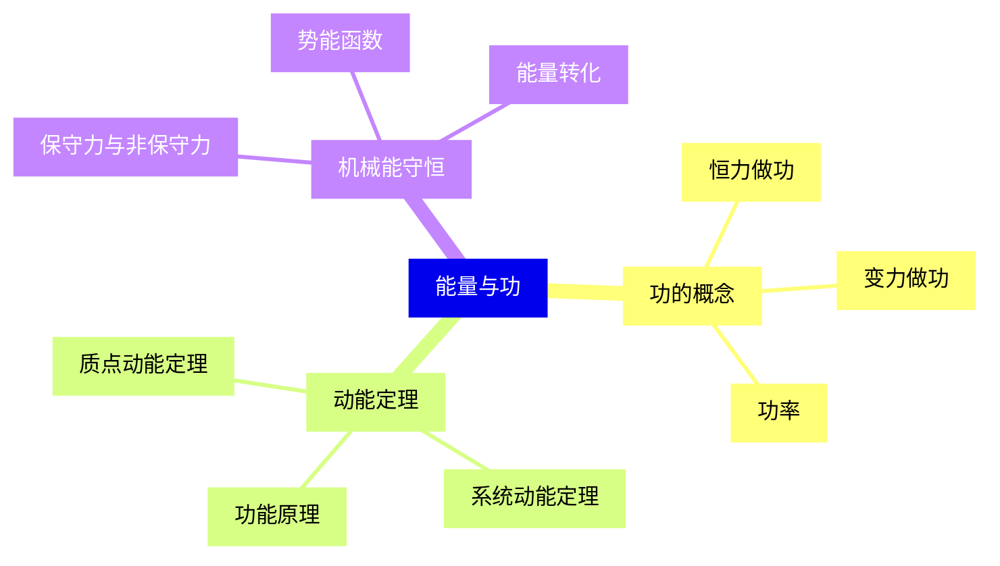
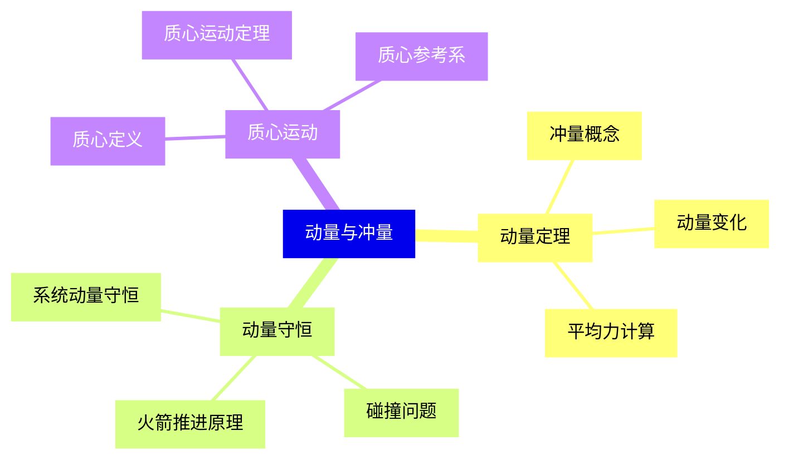
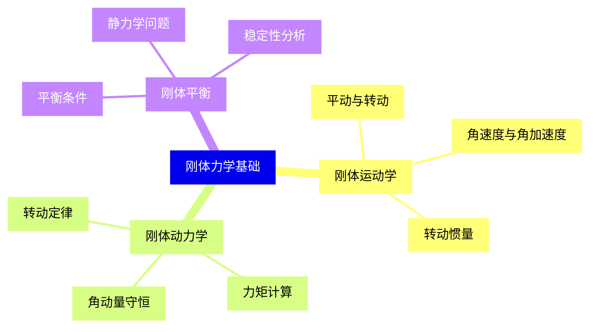
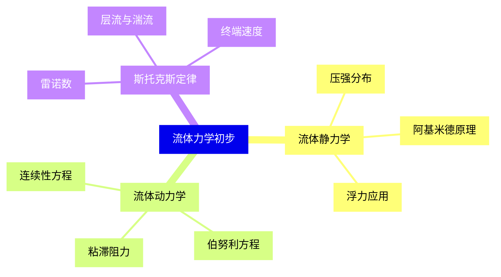
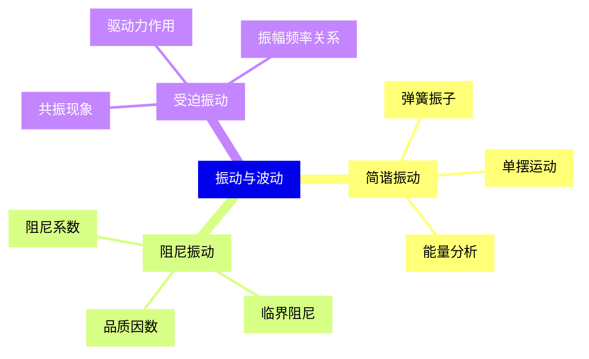
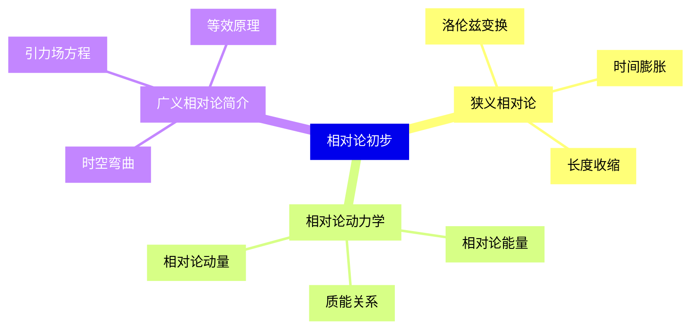


### 1 [牛顿运动定律基础](#1)
#### 1.1 [牛顿第一定律](#1)
##### 1.1.1 [惯性参考系](#1)
##### 1.1.2 [惯性质量](#1)
##### 1.1.3 [力的概念](#1)
##### 1.1.4 [平衡状态分析](#1)
#### 1.2 [牛顿第二定律](#1)
##### 1.2.1 [力的矢量性](#1)
##### 1.2.2 [质量与加速度关系](#1)
##### 1.2.3 [力的合成与分解](#1)
##### 1.2.4 [瞬时作用原理](#1)
#### 1.3 [牛顿第三定律](#1)
##### 1.3.1 [作用力与反作用力](#1)
##### 1.3.2 [内力与外力](#1)
##### 1.3.3 [系统受力分析](#1)
### 2 [力的分类与性质](#2)
#### 2.1 [接触力](#2)
##### 2.1.1 [弹力](#2)
##### 2.1.2 [摩擦力](#2)
##### 2.1.3 [支持力](#2)
#### 2.2 [场力](#2)
##### 2.2.1 [万有引力](#2)
##### 2.2.2 [电磁力](#2)
##### 2.2.3 [核力](#2)
#### 2.3 [特殊力](#2)
##### 2.3.1 [张力](#2)
##### 2.3.2 [浮力](#2)
##### 2.3.3 [阻力](#2)
### 3 [运动学与动力学](#3)
#### 3.1 [直线运动](#3)
##### 3.1.1 [匀加速直线运动](#3)
##### 3.1.2 [变加速直线运动](#3)
##### 3.1.3 [自由落体运动](#3)
#### 3.2 [曲线运动](#3)
##### 3.2.1 [圆周运动](#3)
##### 3.2.2 [抛体运动](#3)
##### 3.2.3 [简谐运动](#3)
#### 3.3 [相对运动](#3)
##### 3.3.1 [相对速度](#3)
##### 3.3.2 [相对加速度](#3)
##### 3.3.3 [科里奥利力](#3)
### 4 [牛顿定律应用](#4)
#### 4.1 [单质点动力学](#4)
##### 4.1.1 [斜面问题](#4)
##### 4.1.2 [弹簧振子](#4)
##### 4.1.3 [连接体问题](#4)
#### 4.2 [多质点系统](#4)
##### 4.2.1 [质心运动](#4)
##### 4.2.2 [动量守恒](#4)
##### 4.2.3 [角动量守恒](#4)
#### 4.3 [非惯性系](#4)
##### 4.3.1 [平动加速系](#4)
##### 4.3.2 [转动参考系](#4)
##### 4.3.3 [惯性力](#4)
### 5 [能量与功](#5)
#### 5.1 [功的概念](#5)
##### 5.1.1 [恒力做功](#5)
##### 5.1.2 [变力做功](#5)
##### 5.1.3 [功率](#5)
#### 5.2 [动能定理](#5)
##### 5.2.1 [质点动能定理](#5)
##### 5.2.2 [系统动能定理](#5)
##### 5.2.3 [功能原理](#5)
#### 5.3 [机械能守恒](#5)
##### 5.3.1 [保守力与非保守力](#5)
##### 5.3.2 [势能函数](#5)
##### 5.3.3 [能量转化](#5)
### 6 [动量与冲量](#6)
#### 6.1 [动量定理](#6)
##### 6.1.1 [冲量概念](#6)
##### 6.1.2 [动量变化](#6)
##### 6.1.3 [平均力计算](#6)
#### 6.2 [动量守恒](#6)
##### 6.2.1 [系统动量守恒](#6)
##### 6.2.2 [碰撞问题](#6)
##### 6.2.3 [火箭推进原理](#6)
#### 6.3 [质心运动](#6)
##### 6.3.1 [质心定义](#6)
##### 6.3.2 [质心运动定理](#6)
##### 6.3.3 [质心参考系](#6)
### 7 [刚体力学基础](#7)
#### 7.1 [刚体运动学](#7)
##### 7.1.1 [平动与转动](#7)
##### 7.1.2 [角速度与角加速度](#7)
##### 7.1.3 [转动惯量](#7)
#### 7.2 [刚体动力学](#7)
##### 7.2.1 [转动定律](#7)
##### 7.2.2 [力矩计算](#7)
##### 7.2.3 [角动量守恒](#7)
#### 7.3 [刚体平衡](#7)
##### 7.3.1 [平衡条件](#7)
##### 7.3.2 [静力学问题](#7)
##### 7.3.3 [稳定性分析](#7)
### 8 [流体力学初步](#8)
#### 8.1 [流体静力学](#8)
##### 8.1.1 [压强分布](#8)
##### 8.1.2 [阿基米德原理](#8)
##### 8.1.3 [浮力应用](#8)
#### 8.2 [流体动力学](#8)
##### 8.2.1 [连续性方程](#8)
##### 8.2.2 [伯努利方程](#8)
##### 8.2.3 [粘滞阻力](#8)
#### 8.3 [斯托克斯定律](#8)
##### 8.3.1 [雷诺数](#8)
##### 8.3.2 [层流与湍流](#8)
##### 8.3.3 [终端速度](#8)
### 9 [振动与波动](#9)
#### 9.1 [简谐振动](#9)
##### 9.1.1 [弹簧振子](#9)
##### 9.1.2 [单摆运动](#9)
##### 9.1.3 [能量分析](#9)
#### 9.2 [阻尼振动](#9)
##### 9.2.1 [阻尼系数](#9)
##### 9.2.2 [临界阻尼](#9)
##### 9.2.3 [品质因数](#9)
#### 9.3 [受迫振动](#9)
##### 9.3.1 [共振现象](#9)
##### 9.3.2 [驱动力作用](#9)
##### 9.3.3 [振幅频率关系](#9)
### 10 [相对论初步](#10)
#### 10.1 [狭义相对论](#10)
##### 10.1.1 [洛伦兹变换](#10)
##### 10.1.2 [时间膨胀](#10)
##### 10.1.3 [长度收缩](#10)
#### 10.2 [相对论动力学](#10)
##### 10.2.1 [相对论动量](#10)
##### 10.2.2 [相对论能量](#10)
##### 10.2.3 [质能关系](#10)
#### 10.3 [广义相对论简介](#10)
##### 10.3.1 [等效原理](#10)
##### 10.3.2 [引力场方程](#10)
##### 10.3.3 [时空弯曲](#10)




### 1 牛顿运动定律基础

---
### 1 牛顿运动定律基础
___
#### 1.1 牛顿第一定律
___
##### 1.1.1 惯性参考系
___
##### 1.1.2 惯性质量
___
##### 1.1.3 力的概念
___
##### 1.1.4 平衡状态分析
___
#### 1.2 牛顿第二定律
___
##### 1.2.1 力的矢量性
___
##### 1.2.2 质量与加速度关系
___
##### 1.2.3 力的合成与分解
___
##### 1.2.4 瞬时作用原理
___
#### 1.3 牛顿第三定律
___
##### 1.3.1 作用力与反作用力
___
##### 1.3.2 内力与外力
___
##### 1.3.3 系统受力分析
### 2 力的分类与性质

---
### 2 力的分类与性质
___
#### 2.1 接触力
___
##### 2.1.1 弹力
___
##### 2.1.2 摩擦力
___
##### 2.1.3 支持力
___
#### 2.2 场力
___
##### 2.2.1 万有引力
___
##### 2.2.2 电磁力
___
##### 2.2.3 核力
___
#### 2.3 特殊力
___
##### 2.3.1 张力
___
##### 2.3.2 浮力
___
##### 2.3.3 阻力
### 3 运动学与动力学

---
### 3 运动学与动力学
___
#### 3.1 直线运动
___
##### 3.1.1 匀加速直线运动
___
##### 3.1.2 变加速直线运动
___
##### 3.1.3 自由落体运动
___
#### 3.2 曲线运动
___
##### 3.2.1 圆周运动
___
##### 3.2.2 抛体运动
___
##### 3.2.3 简谐运动
___
#### 3.3 相对运动
___
##### 3.3.1 相对速度
___
##### 3.3.2 相对加速度
___
##### 3.3.3 科里奥利力
### 4 牛顿定律应用

---
### 4 牛顿定律应用
___
#### 4.1 单质点动力学
___
##### 4.1.1 斜面问题
___
##### 4.1.2 弹簧振子
___
##### 4.1.3 连接体问题
___
#### 4.2 多质点系统
___
##### 4.2.1 质心运动
___
##### 4.2.2 动量守恒
___
##### 4.2.3 角动量守恒
___
#### 4.3 非惯性系
___
##### 4.3.1 平动加速系
___
##### 4.3.2 转动参考系
___
##### 4.3.3 惯性力
### 5 能量与功

---
### 5 能量与功
___
#### 5.1 功的概念
___
##### 5.1.1 恒力做功
___
##### 5.1.2 变力做功
___
##### 5.1.3 功率
___
#### 5.2 动能定理
___
##### 5.2.1 质点动能定理
___
##### 5.2.2 系统动能定理
___
##### 5.2.3 功能原理
___
#### 5.3 机械能守恒
___
##### 5.3.1 保守力与非保守力
___
##### 5.3.2 势能函数
___
##### 5.3.3 能量转化
### 6 动量与冲量

---
### 6 动量与冲量
___
#### 6.1 动量定理
___
##### 6.1.1 冲量概念
___
##### 6.1.2 动量变化
___
##### 6.1.3 平均力计算
___
#### 6.2 动量守恒
___
##### 6.2.1 系统动量守恒
___
##### 6.2.2 碰撞问题
___
##### 6.2.3 火箭推进原理
___
#### 6.3 质心运动
___
##### 6.3.1 质心定义
___
##### 6.3.2 质心运动定理
___
##### 6.3.3 质心参考系
### 7 刚体力学基础

---
### 7 刚体力学基础
___
#### 7.1 刚体运动学
___
##### 7.1.1 平动与转动
___
##### 7.1.2 角速度与角加速度
___
##### 7.1.3 转动惯量
___
#### 7.2 刚体动力学
___
##### 7.2.1 转动定律
___
##### 7.2.2 力矩计算
___
##### 7.2.3 角动量守恒
___
#### 7.3 刚体平衡
___
##### 7.3.1 平衡条件
___
##### 7.3.2 静力学问题
___
##### 7.3.3 稳定性分析
### 8 流体力学初步

---
### 8 流体力学初步
___
#### 8.1 流体静力学
___
##### 8.1.1 压强分布
___
##### 8.1.2 阿基米德原理
___
##### 8.1.3 浮力应用
___
#### 8.2 流体动力学
___
##### 8.2.1 连续性方程
___
##### 8.2.2 伯努利方程
___
##### 8.2.3 粘滞阻力
___
#### 8.3 斯托克斯定律
___
##### 8.3.1 雷诺数
___
##### 8.3.2 层流与湍流
___
##### 8.3.3 终端速度
### 9 振动与波动

---
### 9 振动与波动
___
#### 9.1 简谐振动
___
##### 9.1.1 弹簧振子
___
##### 9.1.2 单摆运动
___
##### 9.1.3 能量分析
___
#### 9.2 阻尼振动
___
##### 9.2.1 阻尼系数
___
##### 9.2.2 临界阻尼
___
##### 9.2.3 品质因数
___
#### 9.3 受迫振动
___
##### 9.3.1 共振现象
___
##### 9.3.2 驱动力作用
___
##### 9.3.3 振幅频率关系
### 10 相对论初步

---
### 10 相对论初步
___
#### 10.1 狭义相对论
___
##### 10.1.1 洛伦兹变换
___
##### 10.1.2 时间膨胀
___
##### 10.1.3 长度收缩
___
#### 10.2 相对论动力学
___
##### 10.2.1 相对论动量
___
##### 10.2.2 相对论能量
___
##### 10.2.3 质能关系
___
#### 10.3 广义相对论简介
___
##### 10.3.1 等效原理
___
##### 10.3.2 引力场方程
___
##### 10.3.3 时空弯曲


### 1 牛顿运动定律基础{#1}

{}

<--->
{}
{}
{}
{}
{}
{}
{}
{}
{}
{}
{}
{}
{}
{}
{}
{}
{}
{}
{}
{}
{}
{}
{}
{}
{}
{}
{}
{}
{}

### 2 力的分类与性质{#2}

{}
{}
{}
{}
{}
{}
{}
{}
{}
{}
{}
{}
{}
{}
{}
{}
{}
{}
{}
{}
{}
{}
{}
{}
{}
<--->

{}

### 3 运动学与动力学{#3}

{}

<--->
{}
{}
{}
{}
{}
{}
{}
{}
{}
{}
{}
{}
{}
{}
{}
{}
{}
{}
{}
{}
{}
{}
{}
{}
{}

### 4 牛顿定律应用{#4}

{}
{}
{}
{}
{}
{}
{}
{}
{}
{}
{}
{}
{}
{}
{}
{}
{}
{}
{}
{}
{}
{}
{}
{}
{}
<--->

{}

### 5 能量与功{#5}

{}

<--->
{}
{}
{}
{}
{}
{}
{}
{}
{}
{}
{}
{}
{}
{}
{}
{}
{}
{}
{}
{}
{}
{}
{}
{}
{}

### 6 动量与冲量{#6}

{}
{}
{}
{}
{}
{}
{}
{}
{}
{}
{}
{}
{}
{}
{}
{}
{}
{}
{}
{}
{}
{}
{}
{}
{}
<--->

{}

### 7 刚体力学基础{#7}

{}

<--->
{}
{}
{}
{}
{}
{}
{}
{}
{}
{}
{}
{}
{}
{}
{}
{}
{}
{}
{}
{}
{}
{}
{}
{}
{}

### 8 流体力学初步{#8}

{}
{}
{}
{}
{}
{}
{}
{}
{}
{}
{}
{}
{}
{}
{}
{}
{}
{}
{}
{}
{}
{}
{}
{}
{}
<--->

{}

### 9 振动与波动{#9}

{}

<--->
{}
{}
{}
{}
{}
{}
{}
{}
{}
{}
{}
{}
{}
{}
{}
{}
{}
{}
{}
{}
{}
{}
{}
{}
{}

### 10 相对论初步{#10}

{}
{}
{}
{}
{}
{}
{}
{}
{}
{}
{}
{}
{}
{}
{}
{}
{}
{}
{}
{}
{}
{}
{}
{}
{}
<--->

{}
