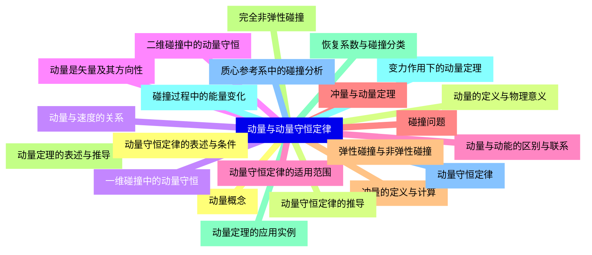
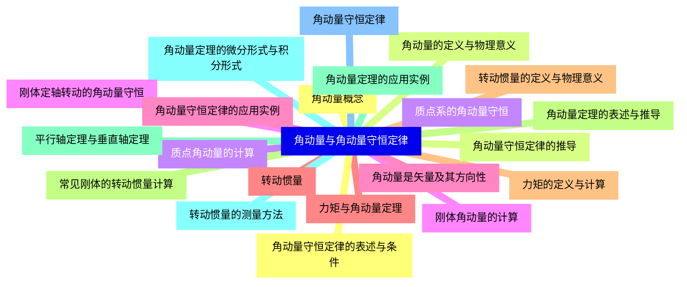
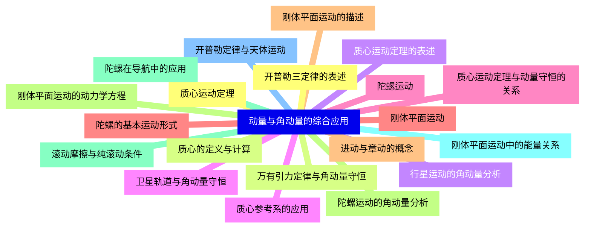
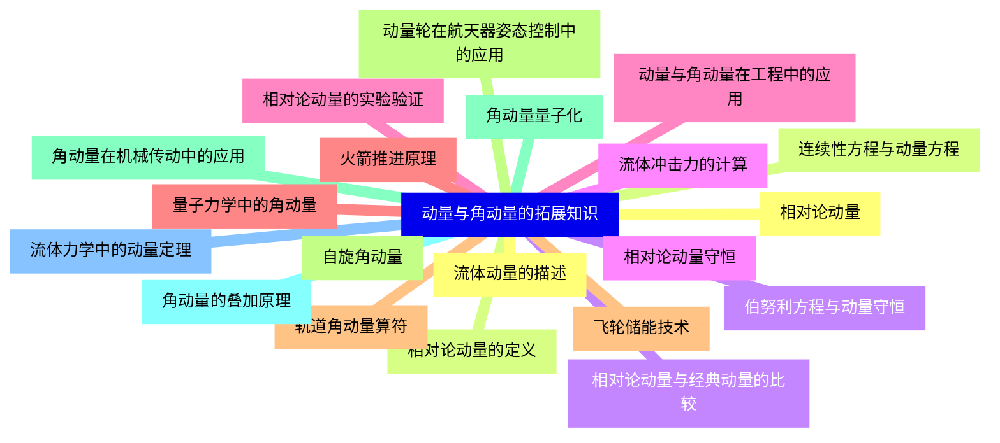


### 1 [动量与动量守恒定律](#1)
#### 1.1 [动量概念](#1)
#### 1.2 [动量的定义与物理意义](#1)
#### 1.3 [动量与速度的关系](#1)
#### 1.4 [动量是矢量及其方向性](#1)
#### 1.5 [动量与动能的区别与联系](#1)
#### 1.6 [冲量与动量定理](#1)
#### 1.7 [冲量的定义与计算](#1)
#### 1.8 [动量定理的表述与推导](#1)
#### 1.9 [动量定理的应用实例](#1)
#### 1.10 [变力作用下的动量定理](#1)
#### 1.11 [动量守恒定律](#1)
#### 1.12 [动量守恒定律的表述与条件](#1)
#### 1.13 [动量守恒定律的推导](#1)
#### 1.14 [一维碰撞中的动量守恒](#1)
#### 1.15 [二维碰撞中的动量守恒](#1)
#### 1.16 [动量守恒定律的适用范围](#1)
#### 1.17 [碰撞问题](#1)
#### 1.18 [弹性碰撞与非弹性碰撞](#1)
#### 1.19 [完全非弹性碰撞](#1)
#### 1.20 [恢复系数与碰撞分类](#1)
#### 1.21 [碰撞过程中的能量变化](#1)
#### 1.22 [质心参考系中的碰撞分析](#1)
### 2 [角动量与角动量守恒定律](#2)
#### 2.1 [角动量概念](#2)
#### 2.2 [角动量的定义与物理意义](#2)
#### 2.3 [质点角动量的计算](#2)
#### 2.4 [刚体角动量的计算](#2)
#### 2.5 [角动量是矢量及其方向性](#2)
#### 2.6 [力矩与角动量定理](#2)
#### 2.7 [力矩的定义与计算](#2)
#### 2.8 [角动量定理的表述与推导](#2)
#### 2.9 [角动量定理的应用实例](#2)
#### 2.10 [角动量定理的微分形式与积分形式](#2)
#### 2.11 [角动量守恒定律](#2)
#### 2.12 [角动量守恒定律的表述与条件](#2)
#### 2.13 [角动量守恒定律的推导](#2)
#### 2.14 [质点系的角动量守恒](#2)
#### 2.15 [刚体定轴转动的角动量守恒](#2)
#### 2.16 [角动量守恒定律的应用实例](#2)
#### 2.17 [转动惯量](#2)
#### 2.18 [转动惯量的定义与物理意义](#2)
#### 2.19 [常见刚体的转动惯量计算](#2)
#### 2.20 [平行轴定理与垂直轴定理](#2)
#### 2.21 [转动惯量的测量方法](#2)
### 3 [动量与角动量的综合应用](#3)
#### 3.1 [质心运动定理](#3)
#### 3.2 [质心的定义与计算](#3)
#### 3.3 [质心运动定理的表述](#3)
#### 3.4 [质心参考系的应用](#3)
#### 3.5 [质心运动定理与动量守恒的关系](#3)
#### 3.6 [刚体平面运动](#3)
#### 3.7 [刚体平面运动的描述](#3)
#### 3.8 [刚体平面运动的动力学方程](#3)
#### 3.9 [滚动摩擦与纯滚动条件](#3)
#### 3.10 [刚体平面运动中的能量关系](#3)
#### 3.11 [开普勒定律与天体运动](#3)
#### 3.12 [开普勒三定律的表述](#3)
#### 3.13 [万有引力定律与角动量守恒](#3)
#### 3.14 [行星运动的角动量分析](#3)
#### 3.15 [卫星轨道与角动量守恒](#3)
#### 3.16 [陀螺运动](#3)
#### 3.17 [陀螺的基本运动形式](#3)
#### 3.18 [进动与章动的概念](#3)
#### 3.19 [陀螺运动的角动量分析](#3)
#### 3.20 [陀螺在导航中的应用](#3)
### 4 [动量与角动量的拓展知识](#4)
#### 4.1 [相对论动量](#4)
#### 4.2 [相对论动量的定义](#4)
#### 4.3 [相对论动量与经典动量的比较](#4)
#### 4.4 [相对论动量守恒](#4)
#### 4.5 [相对论动量的实验验证](#4)
#### 4.6 [量子力学中的角动量](#4)
#### 4.7 [轨道角动量算符](#4)
#### 4.8 [自旋角动量](#4)
#### 4.9 [角动量量子化](#4)
#### 4.10 [角动量的叠加原理](#4)
#### 4.11 [流体力学中的动量定理](#4)
#### 4.12 [流体动量的描述](#4)
#### 4.13 [连续性方程与动量方程](#4)
#### 4.14 [伯努利方程与动量守恒](#4)
#### 4.15 [流体冲击力的计算](#4)
#### 4.16 [动量与角动量在工程中的应用](#4)
#### 4.17 [火箭推进原理](#4)
#### 4.18 [飞轮储能技术](#4)
#### 4.19 [动量轮在航天器姿态控制中的应用](#4)
#### 4.20 [角动量在机械传动中的应用](#4)




### 1 动量与动量守恒定律

---
### 1 动量与动量守恒定律
___
#### 1.1 动量概念
___
#### 1.2 动量的定义与物理意义
___
#### 1.3 动量与速度的关系
___
#### 1.4 动量是矢量及其方向性
___
#### 1.5 动量与动能的区别与联系
___
#### 1.6 冲量与动量定理
___
#### 1.7 冲量的定义与计算
___
#### 1.8 动量定理的表述与推导
___
#### 1.9 动量定理的应用实例
___
#### 1.10 变力作用下的动量定理
___
#### 1.11 动量守恒定律
___
#### 1.12 动量守恒定律的表述与条件
___
#### 1.13 动量守恒定律的推导
___
#### 1.14 一维碰撞中的动量守恒
___
#### 1.15 二维碰撞中的动量守恒
___
#### 1.16 动量守恒定律的适用范围
___
#### 1.17 碰撞问题
___
#### 1.18 弹性碰撞与非弹性碰撞
___
#### 1.19 完全非弹性碰撞
___
#### 1.20 恢复系数与碰撞分类
___
#### 1.21 碰撞过程中的能量变化
___
#### 1.22 质心参考系中的碰撞分析
### 2 角动量与角动量守恒定律

---
### 2 角动量与角动量守恒定律
___
#### 2.1 角动量概念
___
#### 2.2 角动量的定义与物理意义
___
#### 2.3 质点角动量的计算
___
#### 2.4 刚体角动量的计算
___
#### 2.5 角动量是矢量及其方向性
___
#### 2.6 力矩与角动量定理
___
#### 2.7 力矩的定义与计算
___
#### 2.8 角动量定理的表述与推导
___
#### 2.9 角动量定理的应用实例
___
#### 2.10 角动量定理的微分形式与积分形式
___
#### 2.11 角动量守恒定律
___
#### 2.12 角动量守恒定律的表述与条件
___
#### 2.13 角动量守恒定律的推导
___
#### 2.14 质点系的角动量守恒
___
#### 2.15 刚体定轴转动的角动量守恒
___
#### 2.16 角动量守恒定律的应用实例
___
#### 2.17 转动惯量
___
#### 2.18 转动惯量的定义与物理意义
___
#### 2.19 常见刚体的转动惯量计算
___
#### 2.20 平行轴定理与垂直轴定理
___
#### 2.21 转动惯量的测量方法
### 3 动量与角动量的综合应用

---
### 3 动量与角动量的综合应用
___
#### 3.1 质心运动定理
___
#### 3.2 质心的定义与计算
___
#### 3.3 质心运动定理的表述
___
#### 3.4 质心参考系的应用
___
#### 3.5 质心运动定理与动量守恒的关系
___
#### 3.6 刚体平面运动
___
#### 3.7 刚体平面运动的描述
___
#### 3.8 刚体平面运动的动力学方程
___
#### 3.9 滚动摩擦与纯滚动条件
___
#### 3.10 刚体平面运动中的能量关系
___
#### 3.11 开普勒定律与天体运动
___
#### 3.12 开普勒三定律的表述
___
#### 3.13 万有引力定律与角动量守恒
___
#### 3.14 行星运动的角动量分析
___
#### 3.15 卫星轨道与角动量守恒
___
#### 3.16 陀螺运动
___
#### 3.17 陀螺的基本运动形式
___
#### 3.18 进动与章动的概念
___
#### 3.19 陀螺运动的角动量分析
___
#### 3.20 陀螺在导航中的应用
### 4 动量与角动量的拓展知识

---
### 4 动量与角动量的拓展知识
___
#### 4.1 相对论动量
___
#### 4.2 相对论动量的定义
___
#### 4.3 相对论动量与经典动量的比较
___
#### 4.4 相对论动量守恒
___
#### 4.5 相对论动量的实验验证
___
#### 4.6 量子力学中的角动量
___
#### 4.7 轨道角动量算符
___
#### 4.8 自旋角动量
___
#### 4.9 角动量量子化
___
#### 4.10 角动量的叠加原理
___
#### 4.11 流体力学中的动量定理
___
#### 4.12 流体动量的描述
___
#### 4.13 连续性方程与动量方程
___
#### 4.14 伯努利方程与动量守恒
___
#### 4.15 流体冲击力的计算
___
#### 4.16 动量与角动量在工程中的应用
___
#### 4.17 火箭推进原理
___
#### 4.18 飞轮储能技术
___
#### 4.19 动量轮在航天器姿态控制中的应用
___
#### 4.20 角动量在机械传动中的应用


### 1 动量与动量守恒定律{#1}

{}

<--->
{}
{}
{}
{}
{}
{}
{}
{}
{}
{}
{}
{}
{}
{}
{}
{}
{}
{}
{}
{}
{}
{}
{}
{}
{}
{}
{}
{}
{}
{}
{}
{}
{}
{}
{}
{}
{}
{}
{}
{}
{}
{}
{}
{}
{}

### 2 角动量与角动量守恒定律{#2}

{}
{}
{}
{}
{}
{}
{}
{}
{}
{}
{}
{}
{}
{}
{}
{}
{}
{}
{}
{}
{}
{}
{}
{}
{}
{}
{}
{}
{}
{}
{}
{}
{}
{}
{}
{}
{}
{}
{}
{}
{}
{}
{}
<--->

{}

### 3 动量与角动量的综合应用{#3}

{}

<--->
{}
{}
{}
{}
{}
{}
{}
{}
{}
{}
{}
{}
{}
{}
{}
{}
{}
{}
{}
{}
{}
{}
{}
{}
{}
{}
{}
{}
{}
{}
{}
{}
{}
{}
{}
{}
{}
{}
{}
{}
{}

### 4 动量与角动量的拓展知识{#4}

{}
{}
{}
{}
{}
{}
{}
{}
{}
{}
{}
{}
{}
{}
{}
{}
{}
{}
{}
{}
{}
{}
{}
{}
{}
{}
{}
{}
{}
{}
{}
{}
{}
{}
{}
{}
{}
{}
{}
{}
{}
<--->

{}
