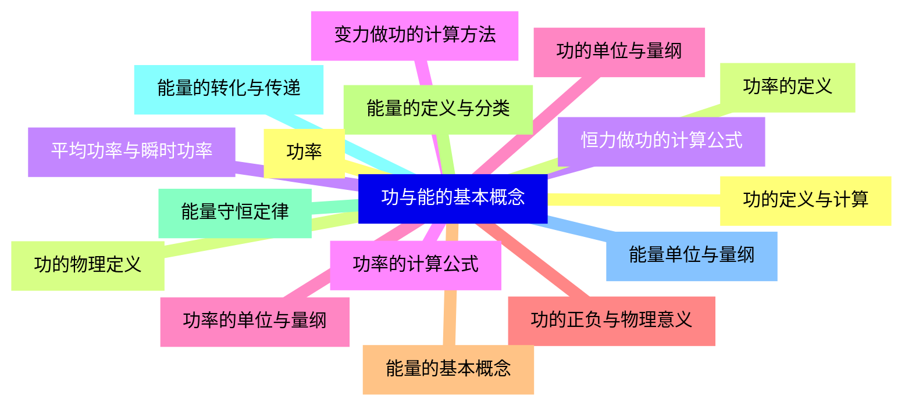
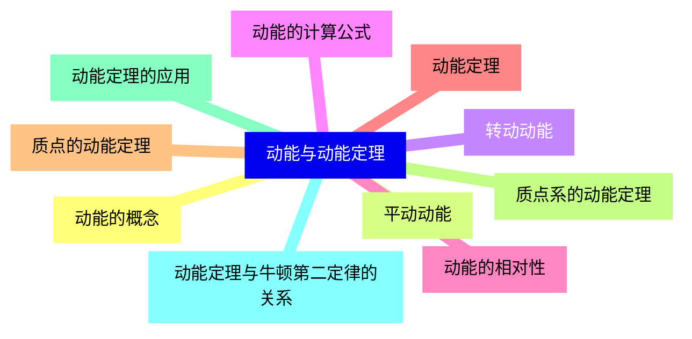
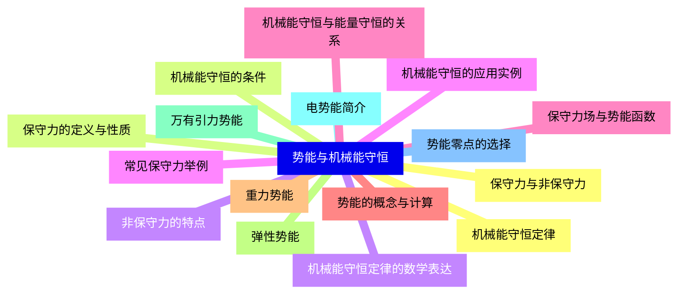
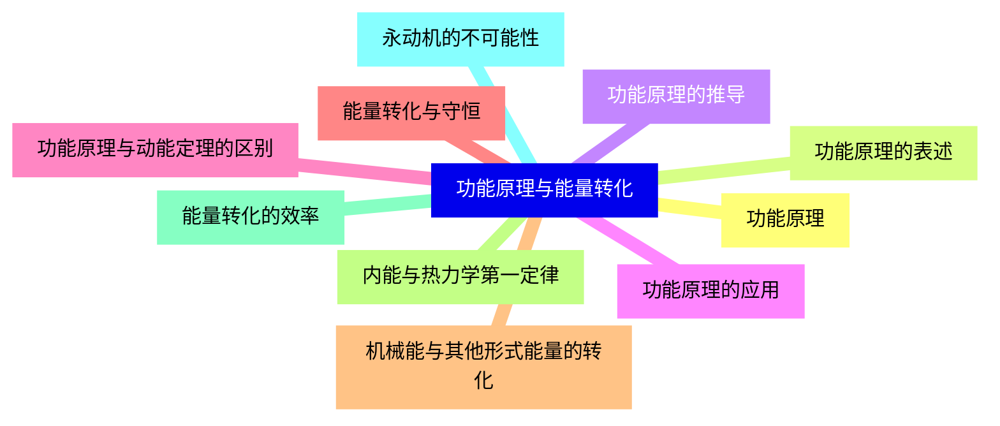
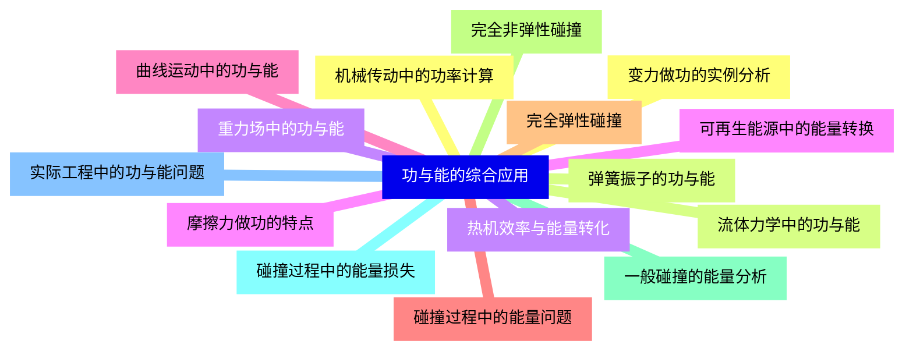
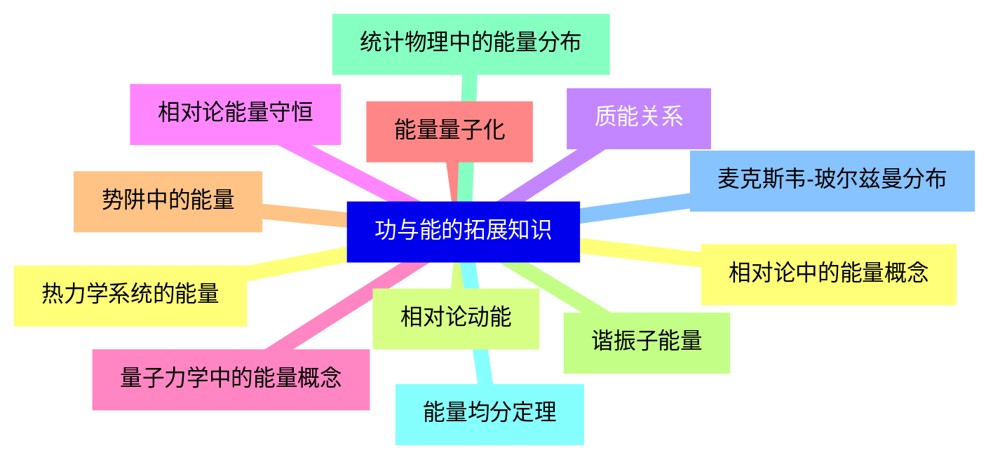


### 1 [功与能的基本概念](#1)
#### 1.1 [功的定义与计算](#1)
#### 1.2 [功的物理定义](#1)
#### 1.3 [恒力做功的计算公式](#1)
#### 1.4 [变力做功的计算方法](#1)
#### 1.5 [功的单位与量纲](#1)
#### 1.6 [功的正负与物理意义](#1)
#### 1.7 [能量的基本概念](#1)
#### 1.8 [能量的定义与分类](#1)
#### 1.9 [能量守恒定律](#1)
#### 1.10 [能量的转化与传递](#1)
#### 1.11 [能量单位与量纲](#1)
#### 1.12 [功率](#1)
#### 1.13 [功率的定义](#1)
#### 1.14 [平均功率与瞬时功率](#1)
#### 1.15 [功率的计算公式](#1)
#### 1.16 [功率的单位与量纲](#1)
### 2 [动能与动能定理](#2)
#### 2.1 [动能的概念](#2)
#### 2.2 [平动动能](#2)
#### 2.3 [转动动能](#2)
#### 2.4 [动能的计算公式](#2)
#### 2.5 [动能的相对性](#2)
#### 2.6 [动能定理](#2)
#### 2.7 [质点的动能定理](#2)
#### 2.8 [质点系的动能定理](#2)
#### 2.9 [动能定理的应用](#2)
#### 2.10 [动能定理与牛顿第二定律的关系](#2)
### 3 [势能与机械能守恒](#3)
#### 3.1 [保守力与非保守力](#3)
#### 3.2 [保守力的定义与性质](#3)
#### 3.3 [非保守力的特点](#3)
#### 3.4 [常见保守力举例](#3)
#### 3.5 [保守力场与势能函数](#3)
#### 3.6 [势能的概念与计算](#3)
#### 3.7 [重力势能](#3)
#### 3.8 [弹性势能](#3)
#### 3.9 [万有引力势能](#3)
#### 3.10 [电势能简介](#3)
#### 3.11 [势能零点的选择](#3)
#### 3.12 [机械能守恒定律](#3)
#### 3.13 [机械能守恒的条件](#3)
#### 3.14 [机械能守恒定律的数学表达](#3)
#### 3.15 [机械能守恒的应用实例](#3)
#### 3.16 [机械能守恒与能量守恒的关系](#3)
### 4 [功能原理与能量转化](#4)
#### 4.1 [功能原理](#4)
#### 4.2 [功能原理的表述](#4)
#### 4.3 [功能原理的推导](#4)
#### 4.4 [功能原理的应用](#4)
#### 4.5 [功能原理与动能定理的区别](#4)
#### 4.6 [能量转化与守恒](#4)
#### 4.7 [机械能与其他形式能量的转化](#4)
#### 4.8 [内能与热力学第一定律](#4)
#### 4.9 [能量转化的效率](#4)
#### 4.10 [永动机的不可能性](#4)
### 5 [功与能的综合应用](#5)
#### 5.1 [变力做功的实例分析](#5)
#### 5.2 [弹簧振子的功与能](#5)
#### 5.3 [重力场中的功与能](#5)
#### 5.4 [摩擦力做功的特点](#5)
#### 5.5 [曲线运动中的功与能](#5)
#### 5.6 [碰撞过程中的能量问题](#5)
#### 5.7 [完全弹性碰撞](#5)
#### 5.8 [完全非弹性碰撞](#5)
#### 5.9 [一般碰撞的能量分析](#5)
#### 5.10 [碰撞过程中的能量损失](#5)
#### 5.11 [实际工程中的功与能问题](#5)
#### 5.12 [机械传动中的功率计算](#5)
#### 5.13 [流体力学中的功与能](#5)
#### 5.14 [热机效率与能量转化](#5)
#### 5.15 [可再生能源中的能量转换](#5)
### 6 [功与能的拓展知识](#6)
#### 6.1 [相对论中的能量概念](#6)
#### 6.2 [相对论动能](#6)
#### 6.3 [质能关系](#6)
#### 6.4 [相对论能量守恒](#6)
#### 6.5 [量子力学中的能量概念](#6)
#### 6.6 [能量量子化](#6)
#### 6.7 [势阱中的能量](#6)
#### 6.8 [谐振子能量](#6)
#### 6.9 [统计物理中的能量分布](#6)
#### 6.10 [能量均分定理](#6)
#### 6.11 [麦克斯韦-玻尔兹曼分布](#6)
#### 6.12 [热力学系统的能量](#6)




### 1 功与能的基本概念

---
### 1 功与能的基本概念
___
#### 1.1 功的定义与计算
___
#### 1.2 功的物理定义
___
#### 1.3 恒力做功的计算公式
___
#### 1.4 变力做功的计算方法
___
#### 1.5 功的单位与量纲
___
#### 1.6 功的正负与物理意义
___
#### 1.7 能量的基本概念
___
#### 1.8 能量的定义与分类
___
#### 1.9 能量守恒定律
___
#### 1.10 能量的转化与传递
___
#### 1.11 能量单位与量纲
___
#### 1.12 功率
___
#### 1.13 功率的定义
___
#### 1.14 平均功率与瞬时功率
___
#### 1.15 功率的计算公式
___
#### 1.16 功率的单位与量纲
### 2 动能与动能定理

---
### 2 动能与动能定理
___
#### 2.1 动能的概念
___
#### 2.2 平动动能
___
#### 2.3 转动动能
___
#### 2.4 动能的计算公式
___
#### 2.5 动能的相对性
___
#### 2.6 动能定理
___
#### 2.7 质点的动能定理
___
#### 2.8 质点系的动能定理
___
#### 2.9 动能定理的应用
___
#### 2.10 动能定理与牛顿第二定律的关系
### 3 势能与机械能守恒

---
### 3 势能与机械能守恒
___
#### 3.1 保守力与非保守力
___
#### 3.2 保守力的定义与性质
___
#### 3.3 非保守力的特点
___
#### 3.4 常见保守力举例
___
#### 3.5 保守力场与势能函数
___
#### 3.6 势能的概念与计算
___
#### 3.7 重力势能
___
#### 3.8 弹性势能
___
#### 3.9 万有引力势能
___
#### 3.10 电势能简介
___
#### 3.11 势能零点的选择
___
#### 3.12 机械能守恒定律
___
#### 3.13 机械能守恒的条件
___
#### 3.14 机械能守恒定律的数学表达
___
#### 3.15 机械能守恒的应用实例
___
#### 3.16 机械能守恒与能量守恒的关系
### 4 功能原理与能量转化

---
### 4 功能原理与能量转化
___
#### 4.1 功能原理
___
#### 4.2 功能原理的表述
___
#### 4.3 功能原理的推导
___
#### 4.4 功能原理的应用
___
#### 4.5 功能原理与动能定理的区别
___
#### 4.6 能量转化与守恒
___
#### 4.7 机械能与其他形式能量的转化
___
#### 4.8 内能与热力学第一定律
___
#### 4.9 能量转化的效率
___
#### 4.10 永动机的不可能性
### 5 功与能的综合应用

---
### 5 功与能的综合应用
___
#### 5.1 变力做功的实例分析
___
#### 5.2 弹簧振子的功与能
___
#### 5.3 重力场中的功与能
___
#### 5.4 摩擦力做功的特点
___
#### 5.5 曲线运动中的功与能
___
#### 5.6 碰撞过程中的能量问题
___
#### 5.7 完全弹性碰撞
___
#### 5.8 完全非弹性碰撞
___
#### 5.9 一般碰撞的能量分析
___
#### 5.10 碰撞过程中的能量损失
___
#### 5.11 实际工程中的功与能问题
___
#### 5.12 机械传动中的功率计算
___
#### 5.13 流体力学中的功与能
___
#### 5.14 热机效率与能量转化
___
#### 5.15 可再生能源中的能量转换
### 6 功与能的拓展知识

---
### 6 功与能的拓展知识
___
#### 6.1 相对论中的能量概念
___
#### 6.2 相对论动能
___
#### 6.3 质能关系
___
#### 6.4 相对论能量守恒
___
#### 6.5 量子力学中的能量概念
___
#### 6.6 能量量子化
___
#### 6.7 势阱中的能量
___
#### 6.8 谐振子能量
___
#### 6.9 统计物理中的能量分布
___
#### 6.10 能量均分定理
___
#### 6.11 麦克斯韦-玻尔兹曼分布
___
#### 6.12 热力学系统的能量


### 1 功与能的基本概念{#1}

{}

<--->
{}
{}
{}
{}
{}
{}
{}
{}
{}
{}
{}
{}
{}
{}
{}
{}
{}
{}
{}
{}
{}
{}
{}
{}
{}
{}
{}
{}
{}
{}
{}
{}
{}

### 2 动能与动能定理{#2}

{}
{}
{}
{}
{}
{}
{}
{}
{}
{}
{}
{}
{}
{}
{}
{}
{}
{}
{}
{}
{}
<--->

{}

### 3 势能与机械能守恒{#3}

{}

<--->
{}
{}
{}
{}
{}
{}
{}
{}
{}
{}
{}
{}
{}
{}
{}
{}
{}
{}
{}
{}
{}
{}
{}
{}
{}
{}
{}
{}
{}
{}
{}
{}
{}

### 4 功能原理与能量转化{#4}

{}
{}
{}
{}
{}
{}
{}
{}
{}
{}
{}
{}
{}
{}
{}
{}
{}
{}
{}
{}
{}
<--->

{}

### 5 功与能的综合应用{#5}

{}

<--->
{}
{}
{}
{}
{}
{}
{}
{}
{}
{}
{}
{}
{}
{}
{}
{}
{}
{}
{}
{}
{}
{}
{}
{}
{}
{}
{}
{}
{}
{}
{}

### 6 功与能的拓展知识{#6}

{}
{}
{}
{}
{}
{}
{}
{}
{}
{}
{}
{}
{}
{}
{}
{}
{}
{}
{}
{}
{}
{}
{}
{}
{}
<--->

{}
