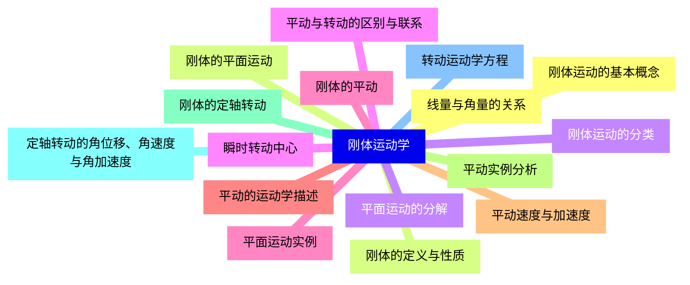
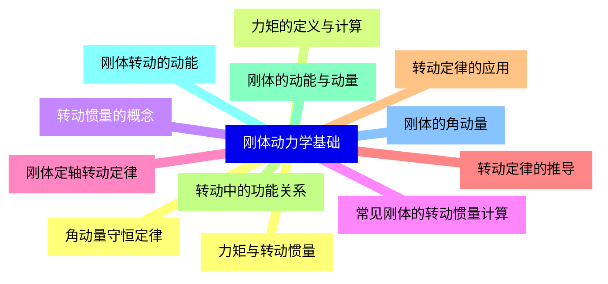
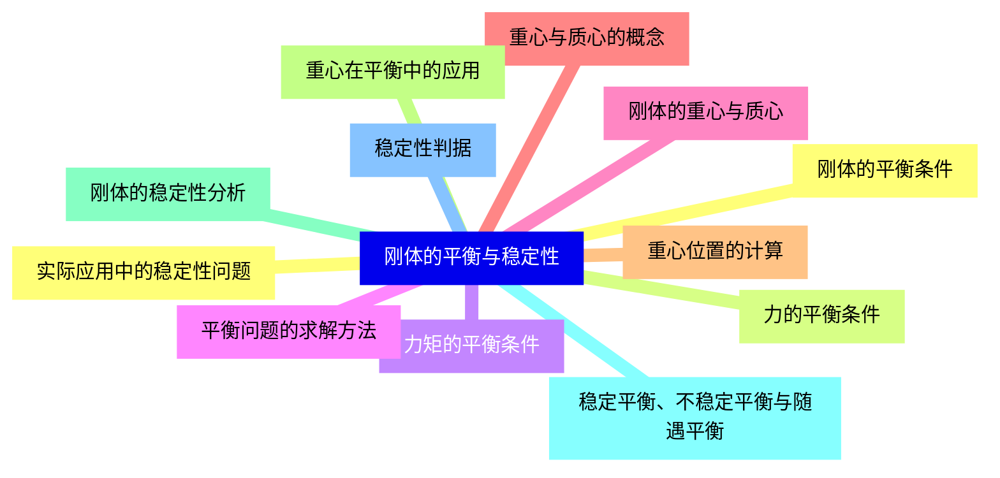
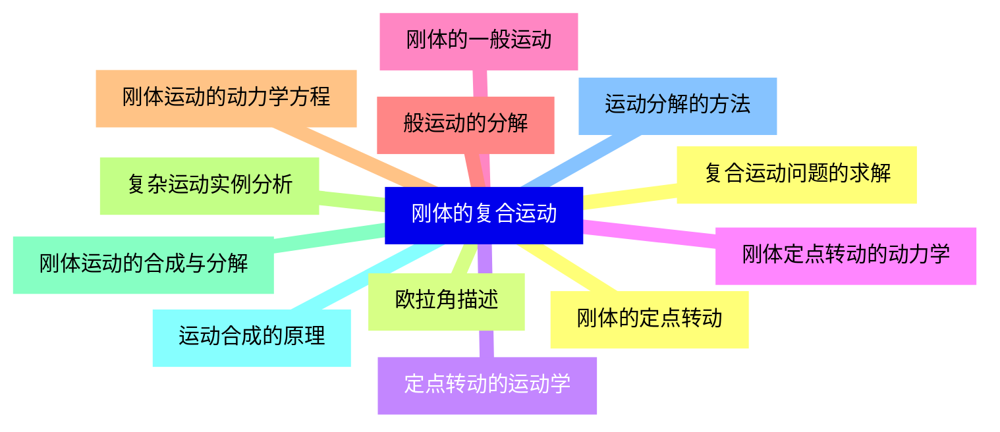
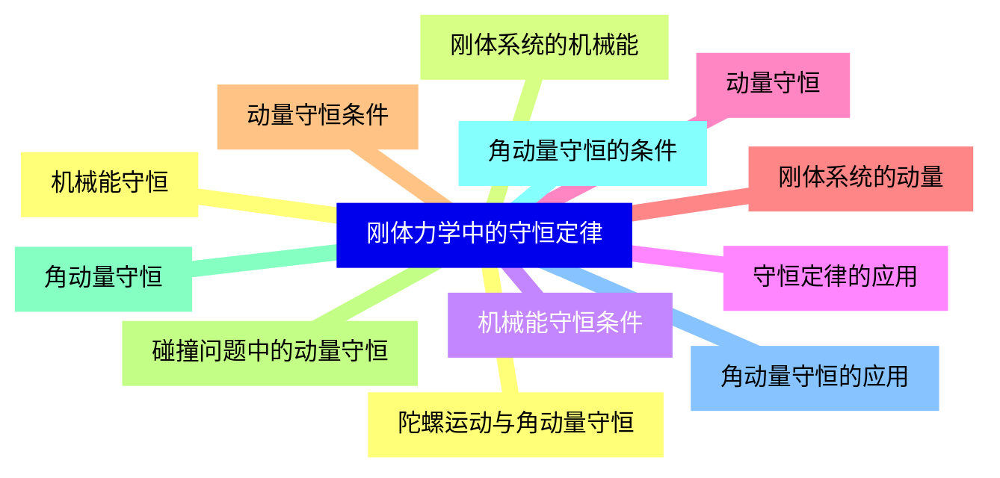
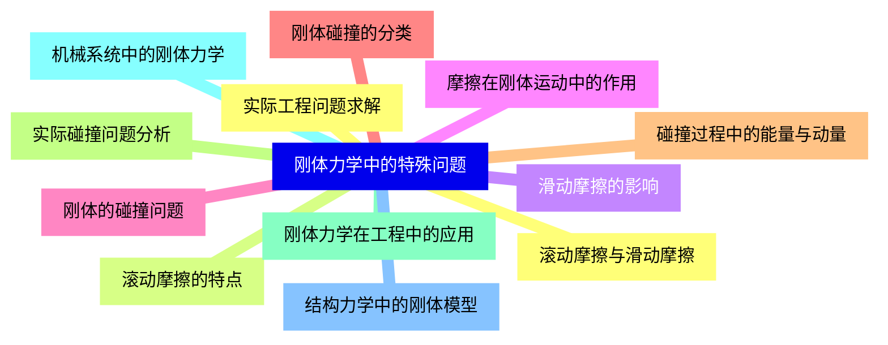
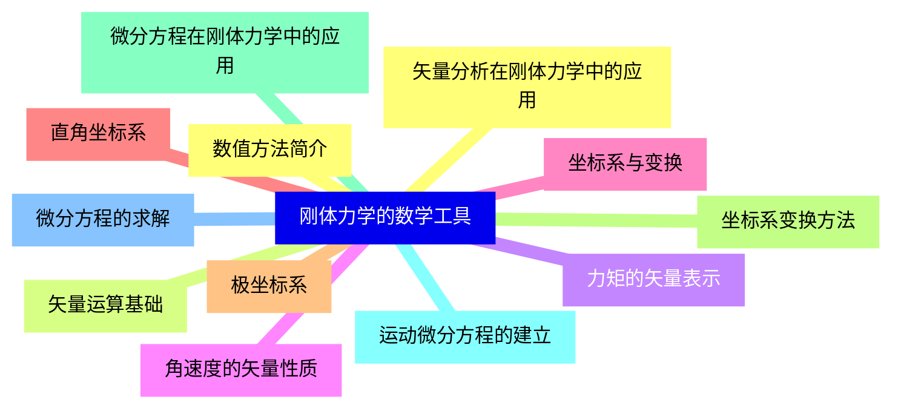
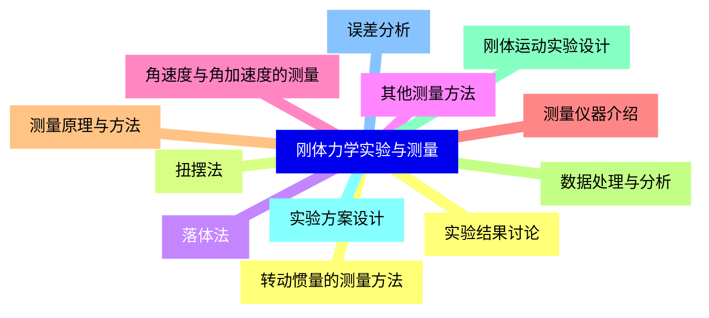


### 1 [刚体运动学](#1)
#### 1.1 [刚体运动的基本概念](#1)
#### 1.2 [刚体的定义与性质](#1)
#### 1.3 [刚体运动的分类](#1)
#### 1.4 [平动与转动的区别与联系](#1)
#### 1.5 [刚体的平动](#1)
#### 1.6 [平动的运动学描述](#1)
#### 1.7 [平动速度与加速度](#1)
#### 1.8 [平动实例分析](#1)
#### 1.9 [刚体的定轴转动](#1)
#### 1.10 [定轴转动的角位移、角速度与角加速度](#1)
#### 1.11 [转动运动学方程](#1)
#### 1.12 [线量与角量的关系](#1)
#### 1.13 [刚体的平面运动](#1)
#### 1.14 [平面运动的分解](#1)
#### 1.15 [瞬时转动中心](#1)
#### 1.16 [平面运动实例](#1)
### 2 [刚体动力学基础](#2)
#### 2.1 [力矩与转动惯量](#2)
#### 2.2 [力矩的定义与计算](#2)
#### 2.3 [转动惯量的概念](#2)
#### 2.4 [常见刚体的转动惯量计算](#2)
#### 2.5 [刚体定轴转动定律](#2)
#### 2.6 [转动定律的推导](#2)
#### 2.7 [转动定律的应用](#2)
#### 2.8 [转动中的功能关系](#2)
#### 2.9 [刚体的动能与动量](#2)
#### 2.10 [刚体转动的动能](#2)
#### 2.11 [刚体的角动量](#2)
#### 2.12 [角动量守恒定律](#2)
### 3 [刚体的平衡与稳定性](#3)
#### 3.1 [刚体的平衡条件](#3)
#### 3.2 [力的平衡条件](#3)
#### 3.3 [力矩的平衡条件](#3)
#### 3.4 [平衡问题的求解方法](#3)
#### 3.5 [刚体的重心与质心](#3)
#### 3.6 [重心与质心的概念](#3)
#### 3.7 [重心位置的计算](#3)
#### 3.8 [重心在平衡中的应用](#3)
#### 3.9 [刚体的稳定性分析](#3)
#### 3.10 [稳定平衡、不稳定平衡与随遇平衡](#3)
#### 3.11 [稳定性判据](#3)
#### 3.12 [实际应用中的稳定性问题](#3)
### 4 [刚体的复合运动](#4)
#### 4.1 [刚体的定点转动](#4)
#### 4.2 [欧拉角描述](#4)
#### 4.3 [定点转动的运动学](#4)
#### 4.4 [刚体定点转动的动力学](#4)
#### 4.5 [刚体的一般运动](#4)
#### 4.6 [般运动的分解](#4)
#### 4.7 [刚体运动的动力学方程](#4)
#### 4.8 [复杂运动实例分析](#4)
#### 4.9 [刚体运动的合成与分解](#4)
#### 4.10 [运动合成的原理](#4)
#### 4.11 [运动分解的方法](#4)
#### 4.12 [复合运动问题的求解](#4)
### 5 [刚体力学中的守恒定律](#5)
#### 5.1 [机械能守恒](#5)
#### 5.2 [刚体系统的机械能](#5)
#### 5.3 [机械能守恒条件](#5)
#### 5.4 [守恒定律的应用](#5)
#### 5.5 [动量守恒](#5)
#### 5.6 [刚体系统的动量](#5)
#### 5.7 [动量守恒条件](#5)
#### 5.8 [碰撞问题中的动量守恒](#5)
#### 5.9 [角动量守恒](#5)
#### 5.10 [角动量守恒的条件](#5)
#### 5.11 [角动量守恒的应用](#5)
#### 5.12 [陀螺运动与角动量守恒](#5)
### 6 [刚体力学中的特殊问题](#6)
#### 6.1 [滚动摩擦与滑动摩擦](#6)
#### 6.2 [滚动摩擦的特点](#6)
#### 6.3 [滑动摩擦的影响](#6)
#### 6.4 [摩擦在刚体运动中的作用](#6)
#### 6.5 [刚体的碰撞问题](#6)
#### 6.6 [刚体碰撞的分类](#6)
#### 6.7 [碰撞过程中的能量与动量](#6)
#### 6.8 [实际碰撞问题分析](#6)
#### 6.9 [刚体力学在工程中的应用](#6)
#### 6.10 [机械系统中的刚体力学](#6)
#### 6.11 [结构力学中的刚体模型](#6)
#### 6.12 [实际工程问题求解](#6)
### 7 [刚体力学的数学工具](#7)
#### 7.1 [矢量分析在刚体力学中的应用](#7)
#### 7.2 [矢量运算基础](#7)
#### 7.3 [力矩的矢量表示](#7)
#### 7.4 [角速度的矢量性质](#7)
#### 7.5 [坐标系与变换](#7)
#### 7.6 [直角坐标系](#7)
#### 7.7 [极坐标系](#7)
#### 7.8 [坐标系变换方法](#7)
#### 7.9 [微分方程在刚体力学中的应用](#7)
#### 7.10 [运动微分方程的建立](#7)
#### 7.11 [微分方程的求解](#7)
#### 7.12 [数值方法简介](#7)
### 8 [刚体力学实验与测量](#8)
#### 8.1 [转动惯量的测量方法](#8)
#### 8.2 [扭摆法](#8)
#### 8.3 [落体法](#8)
#### 8.4 [其他测量方法](#8)
#### 8.5 [角速度与角加速度的测量](#8)
#### 8.6 [测量仪器介绍](#8)
#### 8.7 [测量原理与方法](#8)
#### 8.8 [数据处理与分析](#8)
#### 8.9 [刚体运动实验设计](#8)
#### 8.10 [实验方案设计](#8)
#### 8.11 [误差分析](#8)
#### 8.12 [实验结果讨论](#8)




### 1 刚体运动学

---
### 1 刚体运动学
___
#### 1.1 刚体运动的基本概念
___
#### 1.2 刚体的定义与性质
___
#### 1.3 刚体运动的分类
___
#### 1.4 平动与转动的区别与联系
___
#### 1.5 刚体的平动
___
#### 1.6 平动的运动学描述
___
#### 1.7 平动速度与加速度
___
#### 1.8 平动实例分析
___
#### 1.9 刚体的定轴转动
___
#### 1.10 定轴转动的角位移、角速度与角加速度
___
#### 1.11 转动运动学方程
___
#### 1.12 线量与角量的关系
___
#### 1.13 刚体的平面运动
___
#### 1.14 平面运动的分解
___
#### 1.15 瞬时转动中心
___
#### 1.16 平面运动实例
### 2 刚体动力学基础

---
### 2 刚体动力学基础
___
#### 2.1 力矩与转动惯量
___
#### 2.2 力矩的定义与计算
___
#### 2.3 转动惯量的概念
___
#### 2.4 常见刚体的转动惯量计算
___
#### 2.5 刚体定轴转动定律
___
#### 2.6 转动定律的推导
___
#### 2.7 转动定律的应用
___
#### 2.8 转动中的功能关系
___
#### 2.9 刚体的动能与动量
___
#### 2.10 刚体转动的动能
___
#### 2.11 刚体的角动量
___
#### 2.12 角动量守恒定律
### 3 刚体的平衡与稳定性

---
### 3 刚体的平衡与稳定性
___
#### 3.1 刚体的平衡条件
___
#### 3.2 力的平衡条件
___
#### 3.3 力矩的平衡条件
___
#### 3.4 平衡问题的求解方法
___
#### 3.5 刚体的重心与质心
___
#### 3.6 重心与质心的概念
___
#### 3.7 重心位置的计算
___
#### 3.8 重心在平衡中的应用
___
#### 3.9 刚体的稳定性分析
___
#### 3.10 稳定平衡、不稳定平衡与随遇平衡
___
#### 3.11 稳定性判据
___
#### 3.12 实际应用中的稳定性问题
### 4 刚体的复合运动

---
### 4 刚体的复合运动
___
#### 4.1 刚体的定点转动
___
#### 4.2 欧拉角描述
___
#### 4.3 定点转动的运动学
___
#### 4.4 刚体定点转动的动力学
___
#### 4.5 刚体的一般运动
___
#### 4.6 般运动的分解
___
#### 4.7 刚体运动的动力学方程
___
#### 4.8 复杂运动实例分析
___
#### 4.9 刚体运动的合成与分解
___
#### 4.10 运动合成的原理
___
#### 4.11 运动分解的方法
___
#### 4.12 复合运动问题的求解
### 5 刚体力学中的守恒定律

---
### 5 刚体力学中的守恒定律
___
#### 5.1 机械能守恒
___
#### 5.2 刚体系统的机械能
___
#### 5.3 机械能守恒条件
___
#### 5.4 守恒定律的应用
___
#### 5.5 动量守恒
___
#### 5.6 刚体系统的动量
___
#### 5.7 动量守恒条件
___
#### 5.8 碰撞问题中的动量守恒
___
#### 5.9 角动量守恒
___
#### 5.10 角动量守恒的条件
___
#### 5.11 角动量守恒的应用
___
#### 5.12 陀螺运动与角动量守恒
### 6 刚体力学中的特殊问题

---
### 6 刚体力学中的特殊问题
___
#### 6.1 滚动摩擦与滑动摩擦
___
#### 6.2 滚动摩擦的特点
___
#### 6.3 滑动摩擦的影响
___
#### 6.4 摩擦在刚体运动中的作用
___
#### 6.5 刚体的碰撞问题
___
#### 6.6 刚体碰撞的分类
___
#### 6.7 碰撞过程中的能量与动量
___
#### 6.8 实际碰撞问题分析
___
#### 6.9 刚体力学在工程中的应用
___
#### 6.10 机械系统中的刚体力学
___
#### 6.11 结构力学中的刚体模型
___
#### 6.12 实际工程问题求解
### 7 刚体力学的数学工具

---
### 7 刚体力学的数学工具
___
#### 7.1 矢量分析在刚体力学中的应用
___
#### 7.2 矢量运算基础
___
#### 7.3 力矩的矢量表示
___
#### 7.4 角速度的矢量性质
___
#### 7.5 坐标系与变换
___
#### 7.6 直角坐标系
___
#### 7.7 极坐标系
___
#### 7.8 坐标系变换方法
___
#### 7.9 微分方程在刚体力学中的应用
___
#### 7.10 运动微分方程的建立
___
#### 7.11 微分方程的求解
___
#### 7.12 数值方法简介
### 8 刚体力学实验与测量

---
### 8 刚体力学实验与测量
___
#### 8.1 转动惯量的测量方法
___
#### 8.2 扭摆法
___
#### 8.3 落体法
___
#### 8.4 其他测量方法
___
#### 8.5 角速度与角加速度的测量
___
#### 8.6 测量仪器介绍
___
#### 8.7 测量原理与方法
___
#### 8.8 数据处理与分析
___
#### 8.9 刚体运动实验设计
___
#### 8.10 实验方案设计
___
#### 8.11 误差分析
___
#### 8.12 实验结果讨论


### 1 刚体运动学{#1}

{}

<--->
{}
{}
{}
{}
{}
{}
{}
{}
{}
{}
{}
{}
{}
{}
{}
{}
{}
{}
{}
{}
{}
{}
{}
{}
{}
{}
{}
{}
{}
{}
{}
{}
{}

### 2 刚体动力学基础{#2}

{}
{}
{}
{}
{}
{}
{}
{}
{}
{}
{}
{}
{}
{}
{}
{}
{}
{}
{}
{}
{}
{}
{}
{}
{}
<--->

{}

### 3 刚体的平衡与稳定性{#3}

{}

<--->
{}
{}
{}
{}
{}
{}
{}
{}
{}
{}
{}
{}
{}
{}
{}
{}
{}
{}
{}
{}
{}
{}
{}
{}
{}

### 4 刚体的复合运动{#4}

{}
{}
{}
{}
{}
{}
{}
{}
{}
{}
{}
{}
{}
{}
{}
{}
{}
{}
{}
{}
{}
{}
{}
{}
{}
<--->

{}

### 5 刚体力学中的守恒定律{#5}

{}

<--->
{}
{}
{}
{}
{}
{}
{}
{}
{}
{}
{}
{}
{}
{}
{}
{}
{}
{}
{}
{}
{}
{}
{}
{}
{}

### 6 刚体力学中的特殊问题{#6}

{}
{}
{}
{}
{}
{}
{}
{}
{}
{}
{}
{}
{}
{}
{}
{}
{}
{}
{}
{}
{}
{}
{}
{}
{}
<--->

{}

### 7 刚体力学的数学工具{#7}

{}

<--->
{}
{}
{}
{}
{}
{}
{}
{}
{}
{}
{}
{}
{}
{}
{}
{}
{}
{}
{}
{}
{}
{}
{}
{}
{}

### 8 刚体力学实验与测量{#8}

{}
{}
{}
{}
{}
{}
{}
{}
{}
{}
{}
{}
{}
{}
{}
{}
{}
{}
{}
{}
{}
{}
{}
{}
{}
<--->

{}
