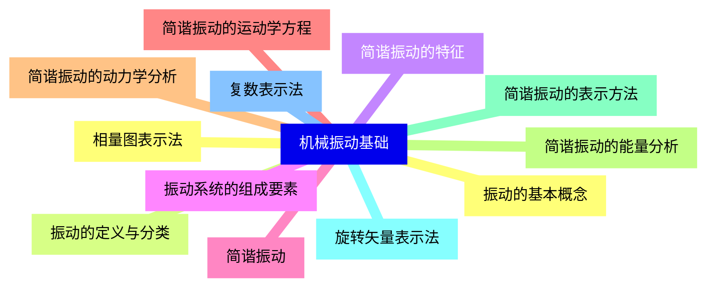
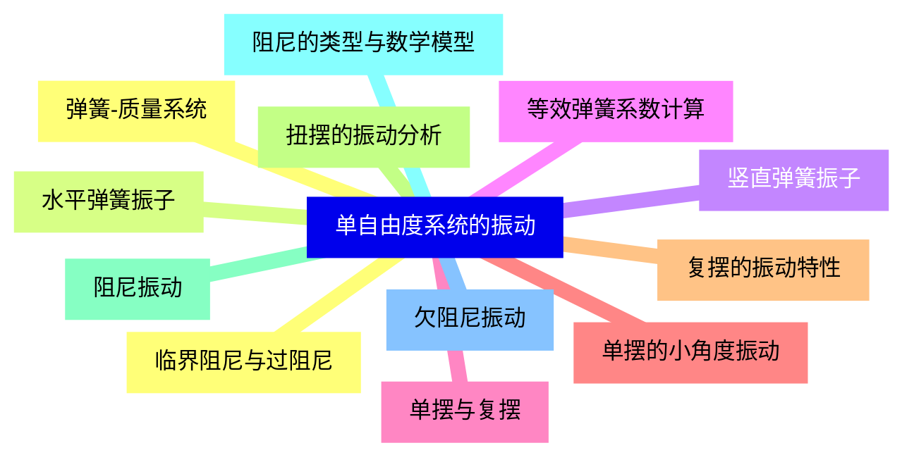
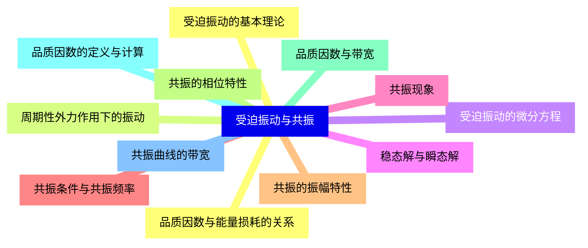
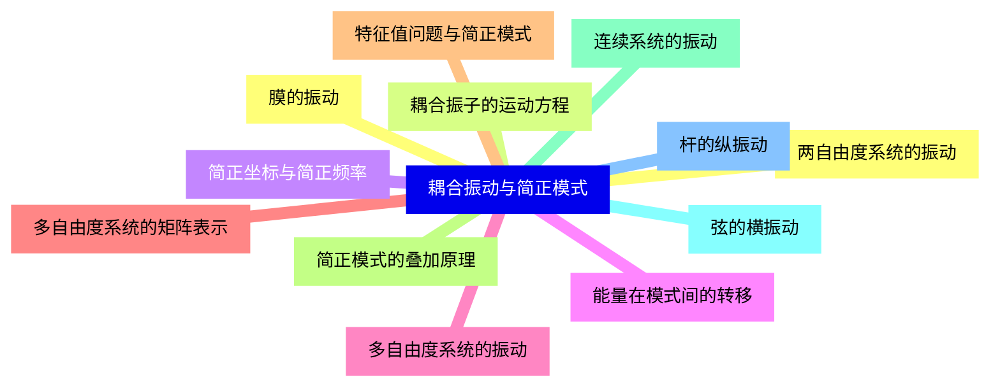
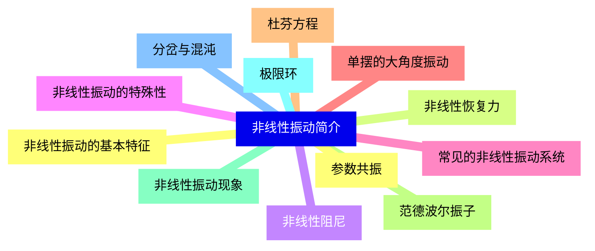
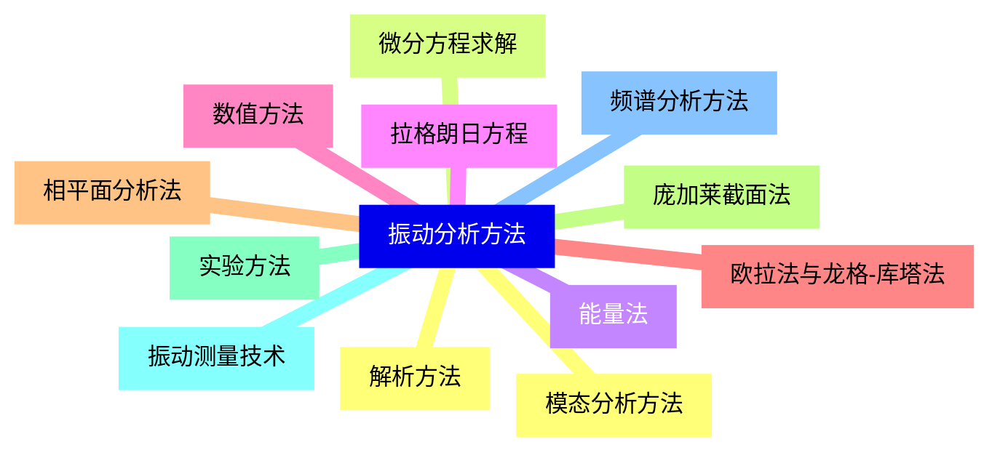
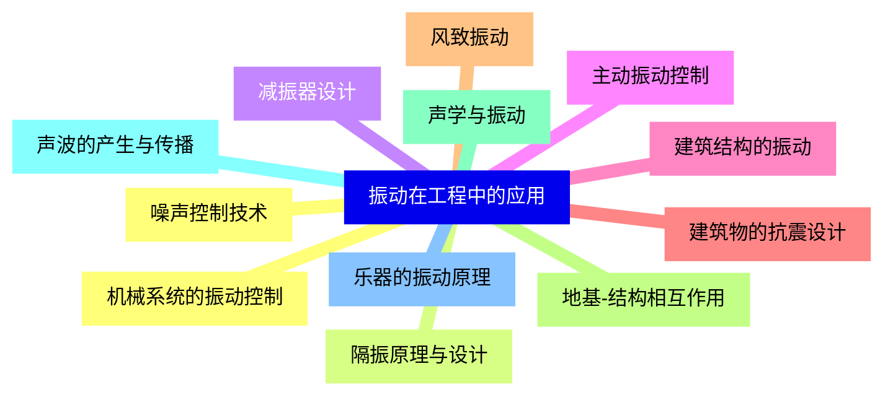


### 1 [机械振动基础](#1)
#### 1.1 [振动的基本概念](#1)
#### 1.2 [振动的定义与分类](#1)
#### 1.3 [简谐振动的特征](#1)
#### 1.4 [振动系统的组成要素](#1)
#### 1.5 [简谐振动](#1)
#### 1.6 [简谐振动的运动学方程](#1)
#### 1.7 [简谐振动的动力学分析](#1)
#### 1.8 [简谐振动的能量分析](#1)
#### 1.9 [简谐振动的表示方法](#1)
#### 1.10 [旋转矢量表示法](#1)
#### 1.11 [复数表示法](#1)
#### 1.12 [相量图表示法](#1)
### 2 [单自由度系统的振动](#2)
#### 2.1 [弹簧-质量系统](#2)
#### 2.2 [水平弹簧振子](#2)
#### 2.3 [竖直弹簧振子](#2)
#### 2.4 [等效弹簧系数计算](#2)
#### 2.5 [单摆与复摆](#2)
#### 2.6 [单摆的小角度振动](#2)
#### 2.7 [复摆的振动特性](#2)
#### 2.8 [扭摆的振动分析](#2)
#### 2.9 [阻尼振动](#2)
#### 2.10 [阻尼的类型与数学模型](#2)
#### 2.11 [欠阻尼振动](#2)
#### 2.12 [临界阻尼与过阻尼](#2)
### 3 [受迫振动与共振](#3)
#### 3.1 [受迫振动的基本理论](#3)
#### 3.2 [周期性外力作用下的振动](#3)
#### 3.3 [受迫振动的微分方程](#3)
#### 3.4 [稳态解与瞬态解](#3)
#### 3.5 [共振现象](#3)
#### 3.6 [共振条件与共振频率](#3)
#### 3.7 [共振的振幅特性](#3)
#### 3.8 [共振的相位特性](#3)
#### 3.9 [品质因数与带宽](#3)
#### 3.10 [品质因数的定义与计算](#3)
#### 3.11 [共振曲线的带宽](#3)
#### 3.12 [品质因数与能量损耗的关系](#3)
### 4 [耦合振动与简正模式](#4)
#### 4.1 [两自由度系统的振动](#4)
#### 4.2 [耦合振子的运动方程](#4)
#### 4.3 [简正坐标与简正频率](#4)
#### 4.4 [能量在模式间的转移](#4)
#### 4.5 [多自由度系统的振动](#4)
#### 4.6 [多自由度系统的矩阵表示](#4)
#### 4.7 [特征值问题与简正模式](#4)
#### 4.8 [简正模式的叠加原理](#4)
#### 4.9 [连续系统的振动](#4)
#### 4.10 [弦的横振动](#4)
#### 4.11 [杆的纵振动](#4)
#### 4.12 [膜的振动](#4)
### 5 [非线性振动简介](#5)
#### 5.1 [非线性振动的基本特征](#5)
#### 5.2 [非线性恢复力](#5)
#### 5.3 [非线性阻尼](#5)
#### 5.4 [非线性振动的特殊性](#5)
#### 5.5 [常见的非线性振动系统](#5)
#### 5.6 [单摆的大角度振动](#5)
#### 5.7 [杜芬方程](#5)
#### 5.8 [范德波尔振子](#5)
#### 5.9 [非线性振动现象](#5)
#### 5.10 [极限环](#5)
#### 5.11 [分岔与混沌](#5)
#### 5.12 [参数共振](#5)
### 6 [振动分析方法](#6)
#### 6.1 [解析方法](#6)
#### 6.2 [微分方程求解](#6)
#### 6.3 [能量法](#6)
#### 6.4 [拉格朗日方程](#6)
#### 6.5 [数值方法](#6)
#### 6.6 [欧拉法与龙格-库塔法](#6)
#### 6.7 [相平面分析法](#6)
#### 6.8 [庞加莱截面法](#6)
#### 6.9 [实验方法](#6)
#### 6.10 [振动测量技术](#6)
#### 6.11 [频谱分析方法](#6)
#### 6.12 [模态分析方法](#6)
### 7 [振动在工程中的应用](#7)
#### 7.1 [机械系统的振动控制](#7)
#### 7.2 [隔振原理与设计](#7)
#### 7.3 [减振器设计](#7)
#### 7.4 [主动振动控制](#7)
#### 7.5 [建筑结构的振动](#7)
#### 7.6 [建筑物的抗震设计](#7)
#### 7.7 [风致振动](#7)
#### 7.8 [地基-结构相互作用](#7)
#### 7.9 [声学与振动](#7)
#### 7.10 [声波的产生与传播](#7)
#### 7.11 [乐器的振动原理](#7)
#### 7.12 [噪声控制技术](#7)




### 1 机械振动基础

---
### 1 机械振动基础
___
#### 1.1 振动的基本概念
___
#### 1.2 振动的定义与分类
___
#### 1.3 简谐振动的特征
___
#### 1.4 振动系统的组成要素
___
#### 1.5 简谐振动
___
#### 1.6 简谐振动的运动学方程
___
#### 1.7 简谐振动的动力学分析
___
#### 1.8 简谐振动的能量分析
___
#### 1.9 简谐振动的表示方法
___
#### 1.10 旋转矢量表示法
___
#### 1.11 复数表示法
___
#### 1.12 相量图表示法
### 2 单自由度系统的振动

---
### 2 单自由度系统的振动
___
#### 2.1 弹簧-质量系统
___
#### 2.2 水平弹簧振子
___
#### 2.3 竖直弹簧振子
___
#### 2.4 等效弹簧系数计算
___
#### 2.5 单摆与复摆
___
#### 2.6 单摆的小角度振动
___
#### 2.7 复摆的振动特性
___
#### 2.8 扭摆的振动分析
___
#### 2.9 阻尼振动
___
#### 2.10 阻尼的类型与数学模型
___
#### 2.11 欠阻尼振动
___
#### 2.12 临界阻尼与过阻尼
### 3 受迫振动与共振

---
### 3 受迫振动与共振
___
#### 3.1 受迫振动的基本理论
___
#### 3.2 周期性外力作用下的振动
___
#### 3.3 受迫振动的微分方程
___
#### 3.4 稳态解与瞬态解
___
#### 3.5 共振现象
___
#### 3.6 共振条件与共振频率
___
#### 3.7 共振的振幅特性
___
#### 3.8 共振的相位特性
___
#### 3.9 品质因数与带宽
___
#### 3.10 品质因数的定义与计算
___
#### 3.11 共振曲线的带宽
___
#### 3.12 品质因数与能量损耗的关系
### 4 耦合振动与简正模式

---
### 4 耦合振动与简正模式
___
#### 4.1 两自由度系统的振动
___
#### 4.2 耦合振子的运动方程
___
#### 4.3 简正坐标与简正频率
___
#### 4.4 能量在模式间的转移
___
#### 4.5 多自由度系统的振动
___
#### 4.6 多自由度系统的矩阵表示
___
#### 4.7 特征值问题与简正模式
___
#### 4.8 简正模式的叠加原理
___
#### 4.9 连续系统的振动
___
#### 4.10 弦的横振动
___
#### 4.11 杆的纵振动
___
#### 4.12 膜的振动
### 5 非线性振动简介

---
### 5 非线性振动简介
___
#### 5.1 非线性振动的基本特征
___
#### 5.2 非线性恢复力
___
#### 5.3 非线性阻尼
___
#### 5.4 非线性振动的特殊性
___
#### 5.5 常见的非线性振动系统
___
#### 5.6 单摆的大角度振动
___
#### 5.7 杜芬方程
___
#### 5.8 范德波尔振子
___
#### 5.9 非线性振动现象
___
#### 5.10 极限环
___
#### 5.11 分岔与混沌
___
#### 5.12 参数共振
### 6 振动分析方法

---
### 6 振动分析方法
___
#### 6.1 解析方法
___
#### 6.2 微分方程求解
___
#### 6.3 能量法
___
#### 6.4 拉格朗日方程
___
#### 6.5 数值方法
___
#### 6.6 欧拉法与龙格-库塔法
___
#### 6.7 相平面分析法
___
#### 6.8 庞加莱截面法
___
#### 6.9 实验方法
___
#### 6.10 振动测量技术
___
#### 6.11 频谱分析方法
___
#### 6.12 模态分析方法
### 7 振动在工程中的应用

---
### 7 振动在工程中的应用
___
#### 7.1 机械系统的振动控制
___
#### 7.2 隔振原理与设计
___
#### 7.3 减振器设计
___
#### 7.4 主动振动控制
___
#### 7.5 建筑结构的振动
___
#### 7.6 建筑物的抗震设计
___
#### 7.7 风致振动
___
#### 7.8 地基-结构相互作用
___
#### 7.9 声学与振动
___
#### 7.10 声波的产生与传播
___
#### 7.11 乐器的振动原理
___
#### 7.12 噪声控制技术


### 1 机械振动基础{#1}

{}

<--->
{}
{}
{}
{}
{}
{}
{}
{}
{}
{}
{}
{}
{}
{}
{}
{}
{}
{}
{}
{}
{}
{}
{}
{}
{}

### 2 单自由度系统的振动{#2}

{}
{}
{}
{}
{}
{}
{}
{}
{}
{}
{}
{}
{}
{}
{}
{}
{}
{}
{}
{}
{}
{}
{}
{}
{}
<--->

{}

### 3 受迫振动与共振{#3}

{}

<--->
{}
{}
{}
{}
{}
{}
{}
{}
{}
{}
{}
{}
{}
{}
{}
{}
{}
{}
{}
{}
{}
{}
{}
{}
{}

### 4 耦合振动与简正模式{#4}

{}
{}
{}
{}
{}
{}
{}
{}
{}
{}
{}
{}
{}
{}
{}
{}
{}
{}
{}
{}
{}
{}
{}
{}
{}
<--->

{}

### 5 非线性振动简介{#5}

{}

<--->
{}
{}
{}
{}
{}
{}
{}
{}
{}
{}
{}
{}
{}
{}
{}
{}
{}
{}
{}
{}
{}
{}
{}
{}
{}

### 6 振动分析方法{#6}

{}
{}
{}
{}
{}
{}
{}
{}
{}
{}
{}
{}
{}
{}
{}
{}
{}
{}
{}
{}
{}
{}
{}
{}
{}
<--->

{}

### 7 振动在工程中的应用{#7}

{}

<--->
{}
{}
{}
{}
{}
{}
{}
{}
{}
{}
{}
{}
{}
{}
{}
{}
{}
{}
{}
{}
{}
{}
{}
{}
{}
