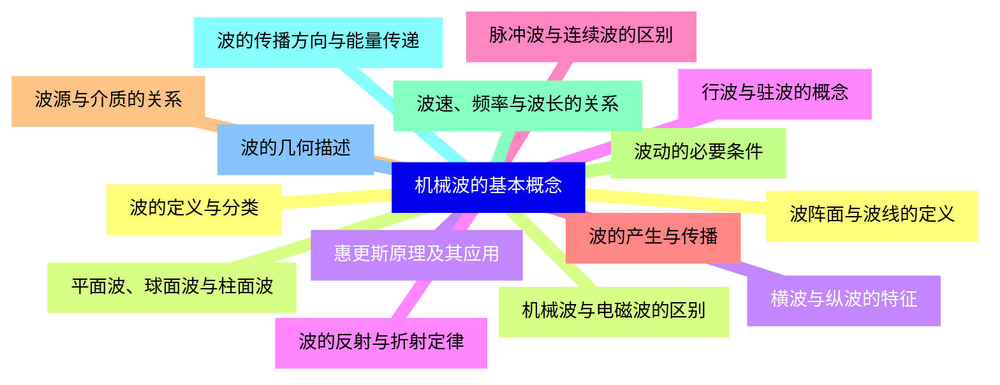
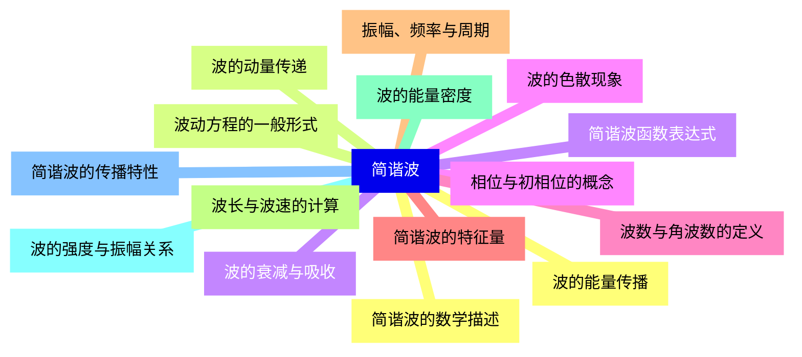
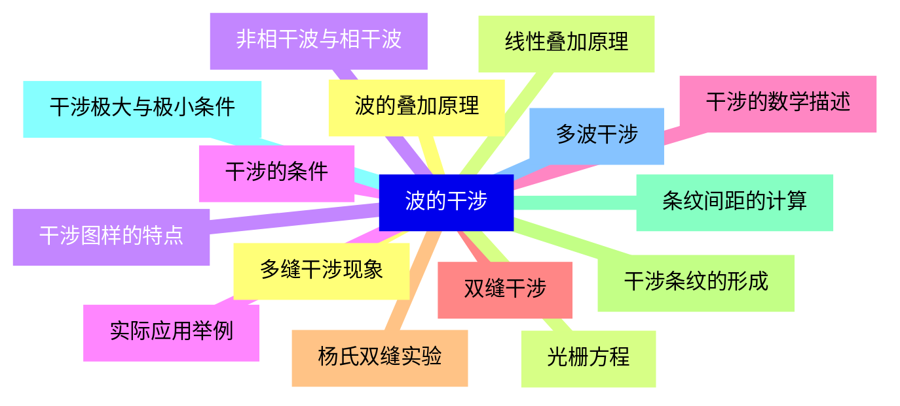
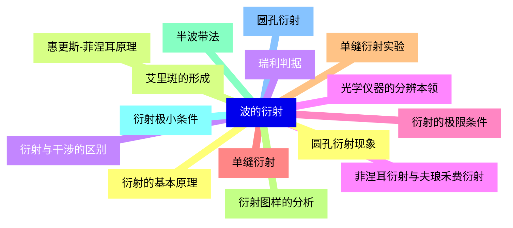
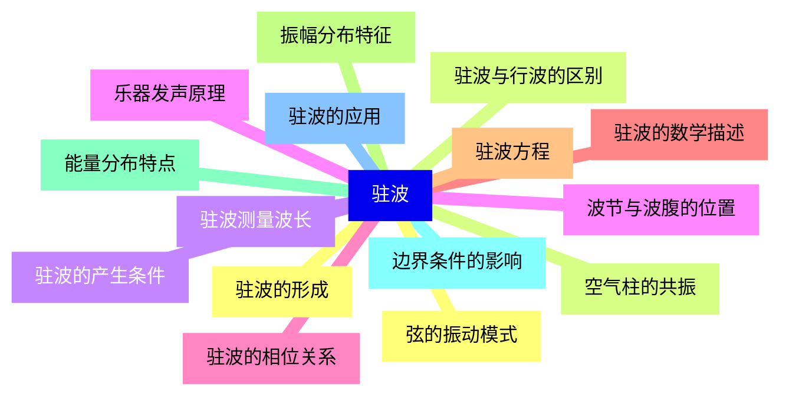
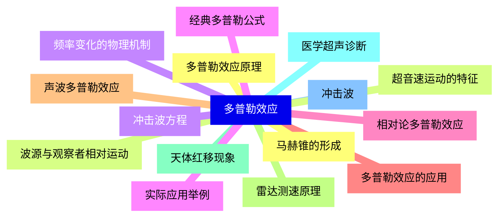
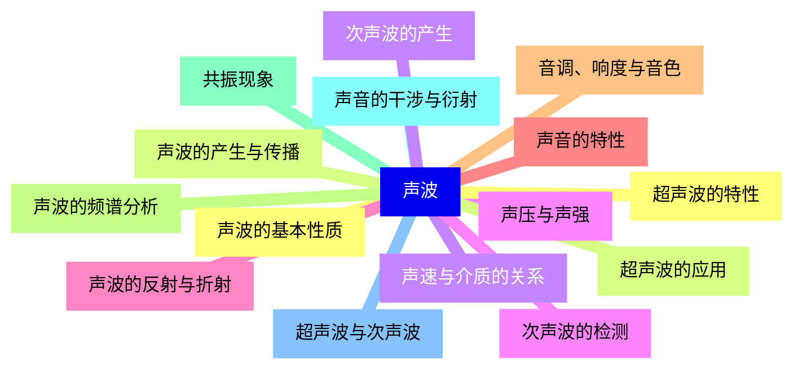
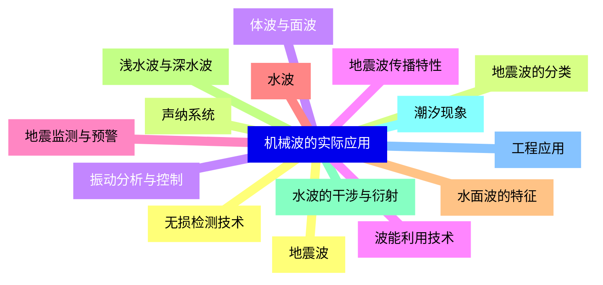


### 1 [机械波的基本概念](#1)
#### 1.1 [波的定义与分类](#1)
#### 1.2 [机械波与电磁波的区别](#1)
#### 1.3 [横波与纵波的特征](#1)
#### 1.4 [行波与驻波的概念](#1)
#### 1.5 [脉冲波与连续波的区别](#1)
#### 1.6 [波的产生与传播](#1)
#### 1.7 [波源与介质的关系](#1)
#### 1.8 [波动的必要条件](#1)
#### 1.9 [波速、频率与波长的关系](#1)
#### 1.10 [波的传播方向与能量传递](#1)
#### 1.11 [波的几何描述](#1)
#### 1.12 [波阵面与波线的定义](#1)
#### 1.13 [平面波、球面波与柱面波](#1)
#### 1.14 [惠更斯原理及其应用](#1)
#### 1.15 [波的反射与折射定律](#1)
### 2 [简谐波](#2)
#### 2.1 [简谐波的数学描述](#2)
#### 2.2 [波动方程的一般形式](#2)
#### 2.3 [简谐波函数表达式](#2)
#### 2.4 [相位与初相位的概念](#2)
#### 2.5 [波数与角波数的定义](#2)
#### 2.6 [简谐波的特征量](#2)
#### 2.7 [振幅、频率与周期](#2)
#### 2.8 [波长与波速的计算](#2)
#### 2.9 [波的能量密度](#2)
#### 2.10 [波的强度与振幅关系](#2)
#### 2.11 [简谐波的传播特性](#2)
#### 2.12 [波的能量传播](#2)
#### 2.13 [波的动量传递](#2)
#### 2.14 [波的衰减与吸收](#2)
#### 2.15 [波的色散现象](#2)
### 3 [波的干涉](#3)
#### 3.1 [波的叠加原理](#3)
#### 3.2 [线性叠加原理](#3)
#### 3.3 [非相干波与相干波](#3)
#### 3.4 [干涉的条件](#3)
#### 3.5 [干涉的数学描述](#3)
#### 3.6 [双缝干涉](#3)
#### 3.7 [杨氏双缝实验](#3)
#### 3.8 [干涉条纹的形成](#3)
#### 3.9 [条纹间距的计算](#3)
#### 3.10 [干涉极大与极小条件](#3)
#### 3.11 [多波干涉](#3)
#### 3.12 [多缝干涉现象](#3)
#### 3.13 [光栅方程](#3)
#### 3.14 [干涉图样的特点](#3)
#### 3.15 [实际应用举例](#3)
### 4 [波的衍射](#4)
#### 4.1 [衍射的基本原理](#4)
#### 4.2 [惠更斯-菲涅耳原理](#4)
#### 4.3 [衍射与干涉的区别](#4)
#### 4.4 [菲涅耳衍射与夫琅禾费衍射](#4)
#### 4.5 [衍射的极限条件](#4)
#### 4.6 [单缝衍射](#4)
#### 4.7 [单缝衍射实验](#4)
#### 4.8 [衍射图样的分析](#4)
#### 4.9 [半波带法](#4)
#### 4.10 [衍射极小条件](#4)
#### 4.11 [圆孔衍射](#4)
#### 4.12 [圆孔衍射现象](#4)
#### 4.13 [艾里斑的形成](#4)
#### 4.14 [瑞利判据](#4)
#### 4.15 [光学仪器的分辨本领](#4)
### 5 [驻波](#5)
#### 5.1 [驻波的形成](#5)
#### 5.2 [驻波与行波的区别](#5)
#### 5.3 [驻波的产生条件](#5)
#### 5.4 [波节与波腹的位置](#5)
#### 5.5 [驻波的相位关系](#5)
#### 5.6 [驻波的数学描述](#5)
#### 5.7 [驻波方程](#5)
#### 5.8 [振幅分布特征](#5)
#### 5.9 [能量分布特点](#5)
#### 5.10 [边界条件的影响](#5)
#### 5.11 [驻波的应用](#5)
#### 5.12 [弦的振动模式](#5)
#### 5.13 [空气柱的共振](#5)
#### 5.14 [驻波测量波长](#5)
#### 5.15 [乐器发声原理](#5)
### 6 [多普勒效应](#6)
#### 6.1 [多普勒效应原理](#6)
#### 6.2 [波源与观察者相对运动](#6)
#### 6.3 [频率变化的物理机制](#6)
#### 6.4 [经典多普勒公式](#6)
#### 6.5 [相对论多普勒效应](#6)
#### 6.6 [多普勒效应的应用](#6)
#### 6.7 [声波多普勒效应](#6)
#### 6.8 [雷达测速原理](#6)
#### 6.9 [天体红移现象](#6)
#### 6.10 [医学超声诊断](#6)
#### 6.11 [冲击波](#6)
#### 6.12 [马赫锥的形成](#6)
#### 6.13 [超音速运动的特征](#6)
#### 6.14 [冲击波方程](#6)
#### 6.15 [实际应用举例](#6)
### 7 [声波](#7)
#### 7.1 [声波的基本性质](#7)
#### 7.2 [声波的产生与传播](#7)
#### 7.3 [声速与介质的关系](#7)
#### 7.4 [声压与声强](#7)
#### 7.5 [声波的反射与折射](#7)
#### 7.6 [声音的特性](#7)
#### 7.7 [音调、响度与音色](#7)
#### 7.8 [声波的频谱分析](#7)
#### 7.9 [共振现象](#7)
#### 7.10 [声音的干涉与衍射](#7)
#### 7.11 [超声波与次声波](#7)
#### 7.12 [超声波的特性](#7)
#### 7.13 [超声波的应用](#7)
#### 7.14 [次声波的产生](#7)
#### 7.15 [次声波的检测](#7)
### 8 [机械波的实际应用](#8)
#### 8.1 [地震波](#8)
#### 8.2 [地震波的分类](#8)
#### 8.3 [体波与面波](#8)
#### 8.4 [地震波传播特性](#8)
#### 8.5 [地震监测与预警](#8)
#### 8.6 [水波](#8)
#### 8.7 [水面波的特征](#8)
#### 8.8 [浅水波与深水波](#8)
#### 8.9 [水波的干涉与衍射](#8)
#### 8.10 [潮汐现象](#8)
#### 8.11 [工程应用](#8)
#### 8.12 [无损检测技术](#8)
#### 8.13 [声纳系统](#8)
#### 8.14 [振动分析与控制](#8)
#### 8.15 [波能利用技术](#8)




### 1 机械波的基本概念

---
### 1 机械波的基本概念
___
#### 1.1 波的定义与分类
___
#### 1.2 机械波与电磁波的区别
___
#### 1.3 横波与纵波的特征
___
#### 1.4 行波与驻波的概念
___
#### 1.5 脉冲波与连续波的区别
___
#### 1.6 波的产生与传播
___
#### 1.7 波源与介质的关系
___
#### 1.8 波动的必要条件
___
#### 1.9 波速、频率与波长的关系
___
#### 1.10 波的传播方向与能量传递
___
#### 1.11 波的几何描述
___
#### 1.12 波阵面与波线的定义
___
#### 1.13 平面波、球面波与柱面波
___
#### 1.14 惠更斯原理及其应用
___
#### 1.15 波的反射与折射定律
### 2 简谐波

---
### 2 简谐波
___
#### 2.1 简谐波的数学描述
___
#### 2.2 波动方程的一般形式
___
#### 2.3 简谐波函数表达式
___
#### 2.4 相位与初相位的概念
___
#### 2.5 波数与角波数的定义
___
#### 2.6 简谐波的特征量
___
#### 2.7 振幅、频率与周期
___
#### 2.8 波长与波速的计算
___
#### 2.9 波的能量密度
___
#### 2.10 波的强度与振幅关系
___
#### 2.11 简谐波的传播特性
___
#### 2.12 波的能量传播
___
#### 2.13 波的动量传递
___
#### 2.14 波的衰减与吸收
___
#### 2.15 波的色散现象
### 3 波的干涉

---
### 3 波的干涉
___
#### 3.1 波的叠加原理
___
#### 3.2 线性叠加原理
___
#### 3.3 非相干波与相干波
___
#### 3.4 干涉的条件
___
#### 3.5 干涉的数学描述
___
#### 3.6 双缝干涉
___
#### 3.7 杨氏双缝实验
___
#### 3.8 干涉条纹的形成
___
#### 3.9 条纹间距的计算
___
#### 3.10 干涉极大与极小条件
___
#### 3.11 多波干涉
___
#### 3.12 多缝干涉现象
___
#### 3.13 光栅方程
___
#### 3.14 干涉图样的特点
___
#### 3.15 实际应用举例
### 4 波的衍射

---
### 4 波的衍射
___
#### 4.1 衍射的基本原理
___
#### 4.2 惠更斯-菲涅耳原理
___
#### 4.3 衍射与干涉的区别
___
#### 4.4 菲涅耳衍射与夫琅禾费衍射
___
#### 4.5 衍射的极限条件
___
#### 4.6 单缝衍射
___
#### 4.7 单缝衍射实验
___
#### 4.8 衍射图样的分析
___
#### 4.9 半波带法
___
#### 4.10 衍射极小条件
___
#### 4.11 圆孔衍射
___
#### 4.12 圆孔衍射现象
___
#### 4.13 艾里斑的形成
___
#### 4.14 瑞利判据
___
#### 4.15 光学仪器的分辨本领
### 5 驻波

---
### 5 驻波
___
#### 5.1 驻波的形成
___
#### 5.2 驻波与行波的区别
___
#### 5.3 驻波的产生条件
___
#### 5.4 波节与波腹的位置
___
#### 5.5 驻波的相位关系
___
#### 5.6 驻波的数学描述
___
#### 5.7 驻波方程
___
#### 5.8 振幅分布特征
___
#### 5.9 能量分布特点
___
#### 5.10 边界条件的影响
___
#### 5.11 驻波的应用
___
#### 5.12 弦的振动模式
___
#### 5.13 空气柱的共振
___
#### 5.14 驻波测量波长
___
#### 5.15 乐器发声原理
### 6 多普勒效应

---
### 6 多普勒效应
___
#### 6.1 多普勒效应原理
___
#### 6.2 波源与观察者相对运动
___
#### 6.3 频率变化的物理机制
___
#### 6.4 经典多普勒公式
___
#### 6.5 相对论多普勒效应
___
#### 6.6 多普勒效应的应用
___
#### 6.7 声波多普勒效应
___
#### 6.8 雷达测速原理
___
#### 6.9 天体红移现象
___
#### 6.10 医学超声诊断
___
#### 6.11 冲击波
___
#### 6.12 马赫锥的形成
___
#### 6.13 超音速运动的特征
___
#### 6.14 冲击波方程
___
#### 6.15 实际应用举例
### 7 声波

---
### 7 声波
___
#### 7.1 声波的基本性质
___
#### 7.2 声波的产生与传播
___
#### 7.3 声速与介质的关系
___
#### 7.4 声压与声强
___
#### 7.5 声波的反射与折射
___
#### 7.6 声音的特性
___
#### 7.7 音调、响度与音色
___
#### 7.8 声波的频谱分析
___
#### 7.9 共振现象
___
#### 7.10 声音的干涉与衍射
___
#### 7.11 超声波与次声波
___
#### 7.12 超声波的特性
___
#### 7.13 超声波的应用
___
#### 7.14 次声波的产生
___
#### 7.15 次声波的检测
### 8 机械波的实际应用

---
### 8 机械波的实际应用
___
#### 8.1 地震波
___
#### 8.2 地震波的分类
___
#### 8.3 体波与面波
___
#### 8.4 地震波传播特性
___
#### 8.5 地震监测与预警
___
#### 8.6 水波
___
#### 8.7 水面波的特征
___
#### 8.8 浅水波与深水波
___
#### 8.9 水波的干涉与衍射
___
#### 8.10 潮汐现象
___
#### 8.11 工程应用
___
#### 8.12 无损检测技术
___
#### 8.13 声纳系统
___
#### 8.14 振动分析与控制
___
#### 8.15 波能利用技术


### 1 机械波的基本概念{#1}

{}

<--->
{}
{}
{}
{}
{}
{}
{}
{}
{}
{}
{}
{}
{}
{}
{}
{}
{}
{}
{}
{}
{}
{}
{}
{}
{}
{}
{}
{}
{}
{}
{}

### 2 简谐波{#2}

{}
{}
{}
{}
{}
{}
{}
{}
{}
{}
{}
{}
{}
{}
{}
{}
{}
{}
{}
{}
{}
{}
{}
{}
{}
{}
{}
{}
{}
{}
{}
<--->

{}

### 3 波的干涉{#3}

{}

<--->
{}
{}
{}
{}
{}
{}
{}
{}
{}
{}
{}
{}
{}
{}
{}
{}
{}
{}
{}
{}
{}
{}
{}
{}
{}
{}
{}
{}
{}
{}
{}

### 4 波的衍射{#4}

{}
{}
{}
{}
{}
{}
{}
{}
{}
{}
{}
{}
{}
{}
{}
{}
{}
{}
{}
{}
{}
{}
{}
{}
{}
{}
{}
{}
{}
{}
{}
<--->

{}

### 5 驻波{#5}

{}

<--->
{}
{}
{}
{}
{}
{}
{}
{}
{}
{}
{}
{}
{}
{}
{}
{}
{}
{}
{}
{}
{}
{}
{}
{}
{}
{}
{}
{}
{}
{}
{}

### 6 多普勒效应{#6}

{}
{}
{}
{}
{}
{}
{}
{}
{}
{}
{}
{}
{}
{}
{}
{}
{}
{}
{}
{}
{}
{}
{}
{}
{}
{}
{}
{}
{}
{}
{}
<--->

{}

### 7 声波{#7}

{}

<--->
{}
{}
{}
{}
{}
{}
{}
{}
{}
{}
{}
{}
{}
{}
{}
{}
{}
{}
{}
{}
{}
{}
{}
{}
{}
{}
{}
{}
{}
{}
{}

### 8 机械波的实际应用{#8}

{}
{}
{}
{}
{}
{}
{}
{}
{}
{}
{}
{}
{}
{}
{}
{}
{}
{}
{}
{}
{}
{}
{}
{}
{}
{}
{}
{}
{}
{}
{}
<--->

{}
