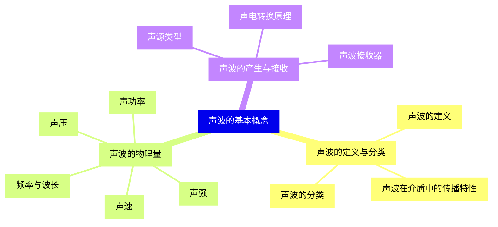
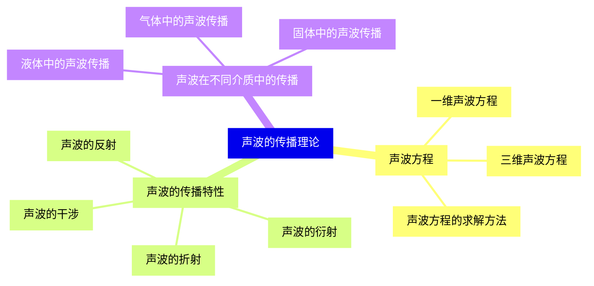
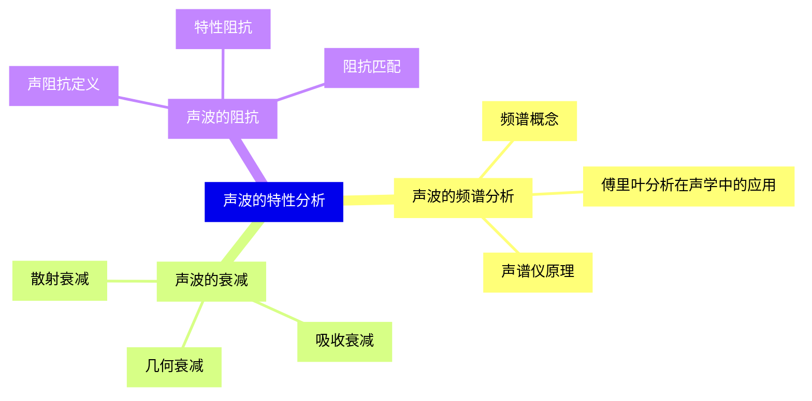
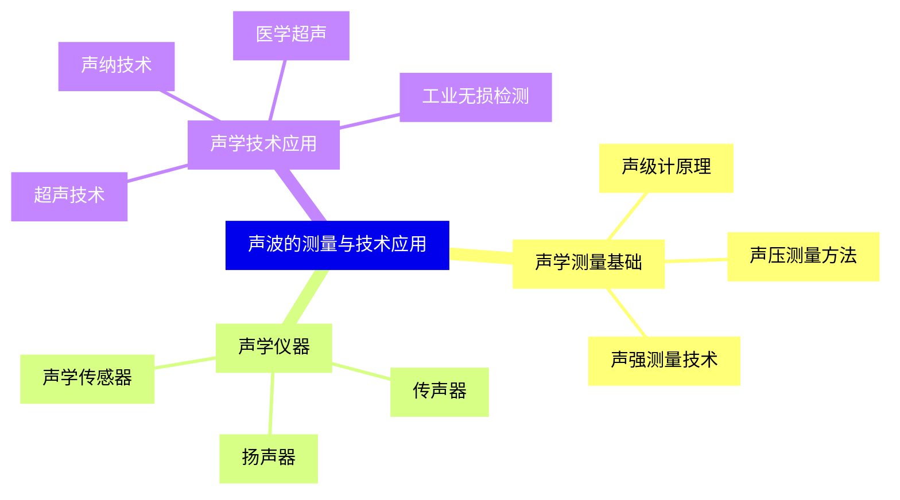
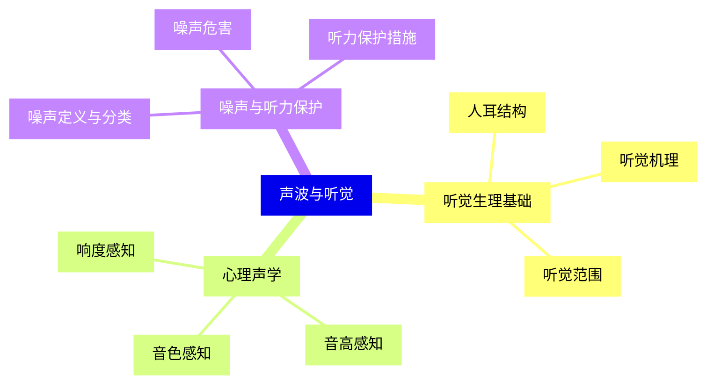
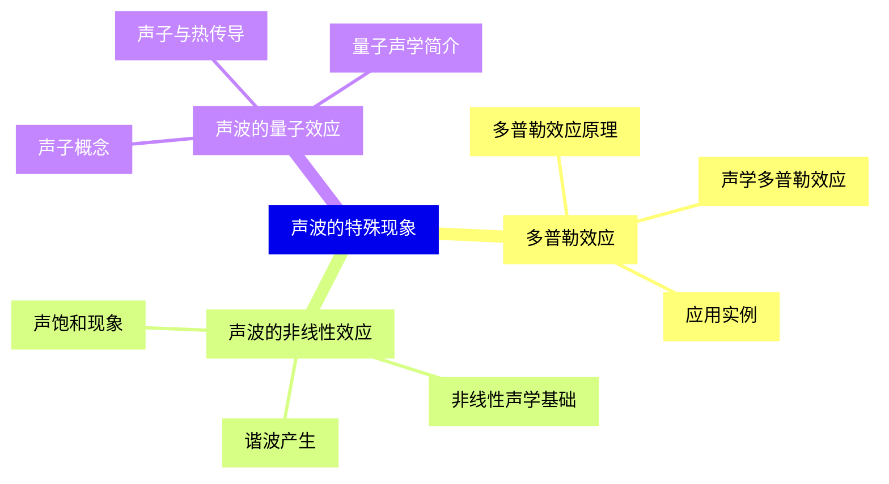
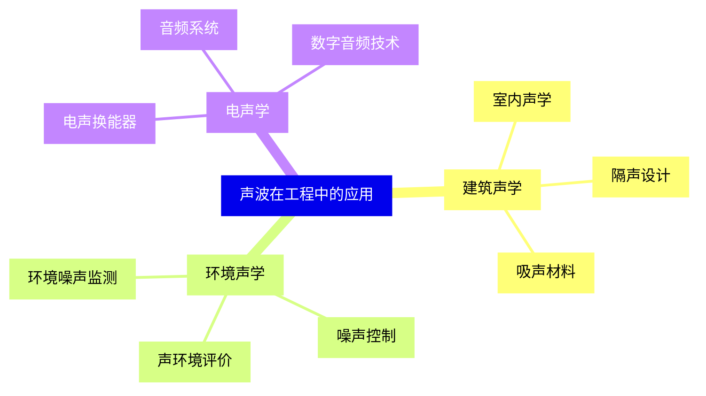
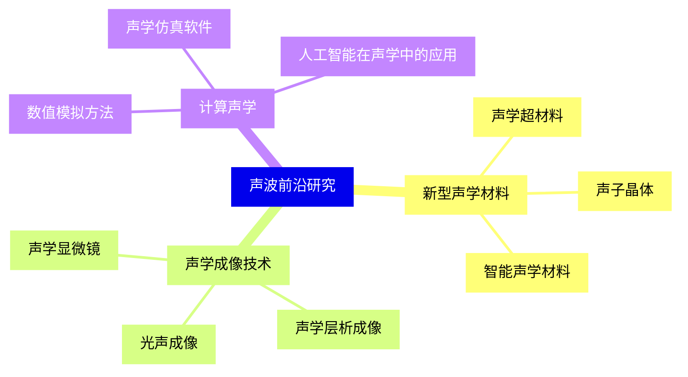


### 1 [声波的基本概念](#1)
#### 1.1 [声波的定义与分类](#1)
##### 1.1.1 [声波的定义](#1)
##### 1.1.2 [声波的分类](#1)
##### 1.1.3 [声波在介质中的传播特性](#1)
#### 1.2 [声波的物理量](#1)
##### 1.2.1 [声压](#1)
##### 1.2.2 [声强](#1)
##### 1.2.3 [声功率](#1)
##### 1.2.4 [声速](#1)
##### 1.2.5 [频率与波长](#1)
#### 1.3 [声波的产生与接收](#1)
##### 1.3.1 [声源类型](#1)
##### 1.3.2 [声波接收器](#1)
##### 1.3.3 [声电转换原理](#1)
### 2 [声波的传播理论](#2)
#### 2.1 [声波方程](#2)
##### 2.1.1 [一维声波方程](#2)
##### 2.1.2 [三维声波方程](#2)
##### 2.1.3 [声波方程的求解方法](#2)
#### 2.2 [声波的传播特性](#2)
##### 2.2.1 [声波的反射](#2)
##### 2.2.2 [声波的折射](#2)
##### 2.2.3 [声波的衍射](#2)
##### 2.2.4 [声波的干涉](#2)
#### 2.3 [声波在不同介质中的传播](#2)
##### 2.3.1 [气体中的声波传播](#2)
##### 2.3.2 [液体中的声波传播](#2)
##### 2.3.3 [固体中的声波传播](#2)
### 3 [声波的特性分析](#3)
#### 3.1 [声波的频谱分析](#3)
##### 3.1.1 [频谱概念](#3)
##### 3.1.2 [傅里叶分析在声学中的应用](#3)
##### 3.1.3 [声谱仪原理](#3)
#### 3.2 [声波的衰减](#3)
##### 3.2.1 [几何衰减](#3)
##### 3.2.2 [吸收衰减](#3)
##### 3.2.3 [散射衰减](#3)
#### 3.3 [声波的阻抗](#3)
##### 3.3.1 [声阻抗定义](#3)
##### 3.3.2 [特性阻抗](#3)
##### 3.3.3 [阻抗匹配](#3)
### 4 [声波的测量与技术应用](#4)
#### 4.1 [声学测量基础](#4)
##### 4.1.1 [声级计原理](#4)
##### 4.1.2 [声压测量方法](#4)
##### 4.1.3 [声强测量技术](#4)
#### 4.2 [声学仪器](#4)
##### 4.2.1 [传声器](#4)
##### 4.2.2 [扬声器](#4)
##### 4.2.3 [声学传感器](#4)
#### 4.3 [声学技术应用](#4)
##### 4.3.1 [超声技术](#4)
##### 4.3.2 [声纳技术](#4)
##### 4.3.3 [医学超声](#4)
##### 4.3.4 [工业无损检测](#4)
### 5 [声波与听觉](#5)
#### 5.1 [听觉生理基础](#5)
##### 5.1.1 [人耳结构](#5)
##### 5.1.2 [听觉机理](#5)
##### 5.1.3 [听觉范围](#5)
#### 5.2 [心理声学](#5)
##### 5.2.1 [响度感知](#5)
##### 5.2.2 [音高感知](#5)
##### 5.2.3 [音色感知](#5)
#### 5.3 [噪声与听力保护](#5)
##### 5.3.1 [噪声定义与分类](#5)
##### 5.3.2 [噪声危害](#5)
##### 5.3.3 [听力保护措施](#5)
### 6 [声波的特殊现象](#6)
#### 6.1 [多普勒效应](#6)
##### 6.1.1 [多普勒效应原理](#6)
##### 6.1.2 [声学多普勒效应](#6)
##### 6.1.3 [应用实例](#6)
#### 6.2 [声波的非线性效应](#6)
##### 6.2.1 [非线性声学基础](#6)
##### 6.2.2 [谐波产生](#6)
##### 6.2.3 [声饱和现象](#6)
#### 6.3 [声波的量子效应](#6)
##### 6.3.1 [声子概念](#6)
##### 6.3.2 [声子与热传导](#6)
##### 6.3.3 [量子声学简介](#6)
### 7 [声波在工程中的应用](#7)
#### 7.1 [建筑声学](#7)
##### 7.1.1 [室内声学](#7)
##### 7.1.2 [隔声设计](#7)
##### 7.1.3 [吸声材料](#7)
#### 7.2 [环境声学](#7)
##### 7.2.1 [环境噪声监测](#7)
##### 7.2.2 [噪声控制](#7)
##### 7.2.3 [声环境评价](#7)
#### 7.3 [电声学](#7)
##### 7.3.1 [电声换能器](#7)
##### 7.3.2 [音频系统](#7)
##### 7.3.3 [数字音频技术](#7)
### 8 [声波前沿研究](#8)
#### 8.1 [新型声学材料](#8)
##### 8.1.1 [声学超材料](#8)
##### 8.1.2 [声子晶体](#8)
##### 8.1.3 [智能声学材料](#8)
#### 8.2 [声学成像技术](#8)
##### 8.2.1 [声学显微镜](#8)
##### 8.2.2 [声学层析成像](#8)
##### 8.2.3 [光声成像](#8)
#### 8.3 [计算声学](#8)
##### 8.3.1 [数值模拟方法](#8)
##### 8.3.2 [声学仿真软件](#8)
##### 8.3.3 [人工智能在声学中的应用](#8)




### 1 声波的基本概念

---
### 1 声波的基本概念
___
#### 1.1 声波的定义与分类
___
##### 1.1.1 声波的定义
___
##### 1.1.2 声波的分类
___
##### 1.1.3 声波在介质中的传播特性
___
#### 1.2 声波的物理量
___
##### 1.2.1 声压
___
##### 1.2.2 声强
___
##### 1.2.3 声功率
___
##### 1.2.4 声速
___
##### 1.2.5 频率与波长
___
#### 1.3 声波的产生与接收
___
##### 1.3.1 声源类型
___
##### 1.3.2 声波接收器
___
##### 1.3.3 声电转换原理
### 2 声波的传播理论

---
### 2 声波的传播理论
___
#### 2.1 声波方程
___
##### 2.1.1 一维声波方程
___
##### 2.1.2 三维声波方程
___
##### 2.1.3 声波方程的求解方法
___
#### 2.2 声波的传播特性
___
##### 2.2.1 声波的反射
___
##### 2.2.2 声波的折射
___
##### 2.2.3 声波的衍射
___
##### 2.2.4 声波的干涉
___
#### 2.3 声波在不同介质中的传播
___
##### 2.3.1 气体中的声波传播
___
##### 2.3.2 液体中的声波传播
___
##### 2.3.3 固体中的声波传播
### 3 声波的特性分析

---
### 3 声波的特性分析
___
#### 3.1 声波的频谱分析
___
##### 3.1.1 频谱概念
___
##### 3.1.2 傅里叶分析在声学中的应用
___
##### 3.1.3 声谱仪原理
___
#### 3.2 声波的衰减
___
##### 3.2.1 几何衰减
___
##### 3.2.2 吸收衰减
___
##### 3.2.3 散射衰减
___
#### 3.3 声波的阻抗
___
##### 3.3.1 声阻抗定义
___
##### 3.3.2 特性阻抗
___
##### 3.3.3 阻抗匹配
### 4 声波的测量与技术应用

---
### 4 声波的测量与技术应用
___
#### 4.1 声学测量基础
___
##### 4.1.1 声级计原理
___
##### 4.1.2 声压测量方法
___
##### 4.1.3 声强测量技术
___
#### 4.2 声学仪器
___
##### 4.2.1 传声器
___
##### 4.2.2 扬声器
___
##### 4.2.3 声学传感器
___
#### 4.3 声学技术应用
___
##### 4.3.1 超声技术
___
##### 4.3.2 声纳技术
___
##### 4.3.3 医学超声
___
##### 4.3.4 工业无损检测
### 5 声波与听觉

---
### 5 声波与听觉
___
#### 5.1 听觉生理基础
___
##### 5.1.1 人耳结构
___
##### 5.1.2 听觉机理
___
##### 5.1.3 听觉范围
___
#### 5.2 心理声学
___
##### 5.2.1 响度感知
___
##### 5.2.2 音高感知
___
##### 5.2.3 音色感知
___
#### 5.3 噪声与听力保护
___
##### 5.3.1 噪声定义与分类
___
##### 5.3.2 噪声危害
___
##### 5.3.3 听力保护措施
### 6 声波的特殊现象

---
### 6 声波的特殊现象
___
#### 6.1 多普勒效应
___
##### 6.1.1 多普勒效应原理
___
##### 6.1.2 声学多普勒效应
___
##### 6.1.3 应用实例
___
#### 6.2 声波的非线性效应
___
##### 6.2.1 非线性声学基础
___
##### 6.2.2 谐波产生
___
##### 6.2.3 声饱和现象
___
#### 6.3 声波的量子效应
___
##### 6.3.1 声子概念
___
##### 6.3.2 声子与热传导
___
##### 6.3.3 量子声学简介
### 7 声波在工程中的应用

---
### 7 声波在工程中的应用
___
#### 7.1 建筑声学
___
##### 7.1.1 室内声学
___
##### 7.1.2 隔声设计
___
##### 7.1.3 吸声材料
___
#### 7.2 环境声学
___
##### 7.2.1 环境噪声监测
___
##### 7.2.2 噪声控制
___
##### 7.2.3 声环境评价
___
#### 7.3 电声学
___
##### 7.3.1 电声换能器
___
##### 7.3.2 音频系统
___
##### 7.3.3 数字音频技术
### 8 声波前沿研究

---
### 8 声波前沿研究
___
#### 8.1 新型声学材料
___
##### 8.1.1 声学超材料
___
##### 8.1.2 声子晶体
___
##### 8.1.3 智能声学材料
___
#### 8.2 声学成像技术
___
##### 8.2.1 声学显微镜
___
##### 8.2.2 声学层析成像
___
##### 8.2.3 光声成像
___
#### 8.3 计算声学
___
##### 8.3.1 数值模拟方法
___
##### 8.3.2 声学仿真软件
___
##### 8.3.3 人工智能在声学中的应用


### 1 声波的基本概念{#1}

{}

<--->
{}
{}
{}
{}
{}
{}
{}
{}
{}
{}
{}
{}
{}
{}
{}
{}
{}
{}
{}
{}
{}
{}
{}
{}
{}
{}
{}
{}
{}

### 2 声波的传播理论{#2}

{}
{}
{}
{}
{}
{}
{}
{}
{}
{}
{}
{}
{}
{}
{}
{}
{}
{}
{}
{}
{}
{}
{}
{}
{}
{}
{}
<--->

{}

### 3 声波的特性分析{#3}

{}

<--->
{}
{}
{}
{}
{}
{}
{}
{}
{}
{}
{}
{}
{}
{}
{}
{}
{}
{}
{}
{}
{}
{}
{}
{}
{}

### 4 声波的测量与技术应用{#4}

{}
{}
{}
{}
{}
{}
{}
{}
{}
{}
{}
{}
{}
{}
{}
{}
{}
{}
{}
{}
{}
{}
{}
{}
{}
{}
{}
<--->

{}

### 5 声波与听觉{#5}

{}

<--->
{}
{}
{}
{}
{}
{}
{}
{}
{}
{}
{}
{}
{}
{}
{}
{}
{}
{}
{}
{}
{}
{}
{}
{}
{}

### 6 声波的特殊现象{#6}

{}
{}
{}
{}
{}
{}
{}
{}
{}
{}
{}
{}
{}
{}
{}
{}
{}
{}
{}
{}
{}
{}
{}
{}
{}
<--->

{}

### 7 声波在工程中的应用{#7}

{}

<--->
{}
{}
{}
{}
{}
{}
{}
{}
{}
{}
{}
{}
{}
{}
{}
{}
{}
{}
{}
{}
{}
{}
{}
{}
{}

### 8 声波前沿研究{#8}

{}
{}
{}
{}
{}
{}
{}
{}
{}
{}
{}
{}
{}
{}
{}
{}
{}
{}
{}
{}
{}
{}
{}
{}
{}
<--->

{}
