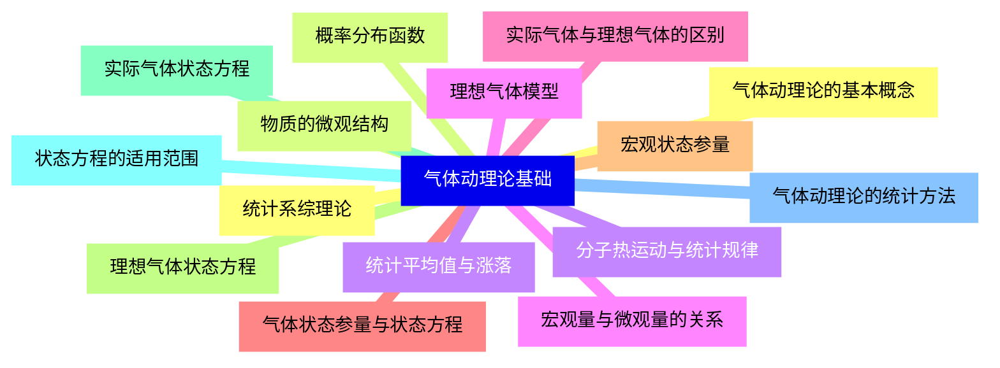
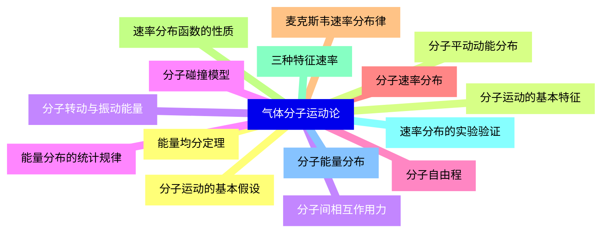
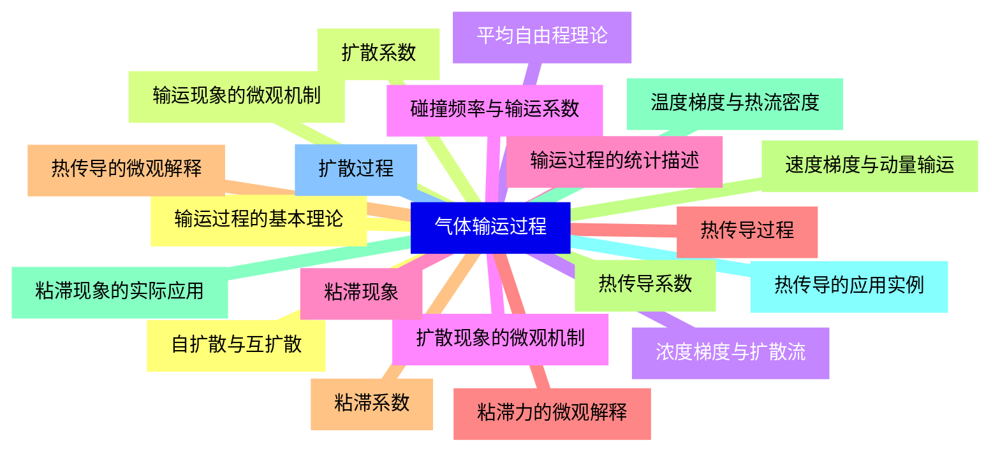
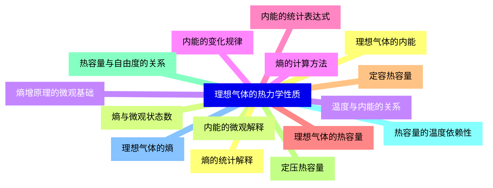
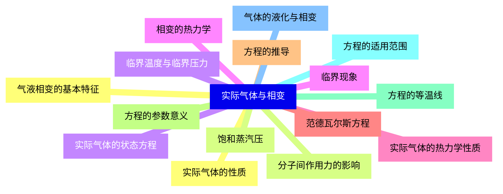
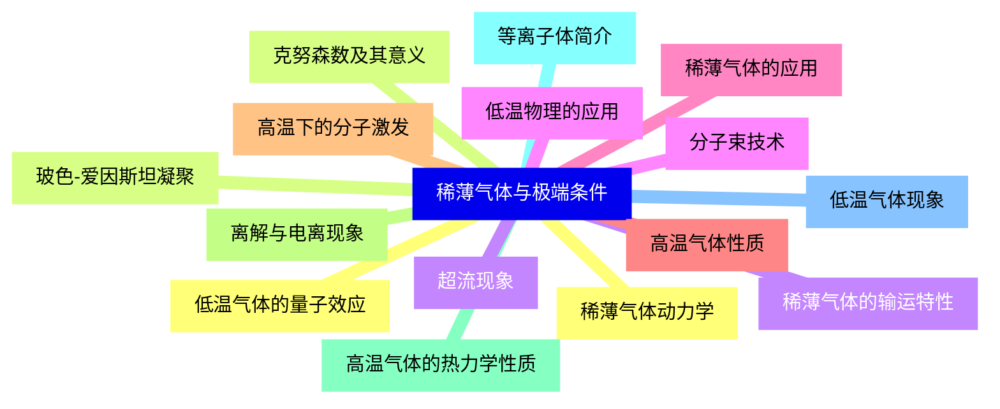
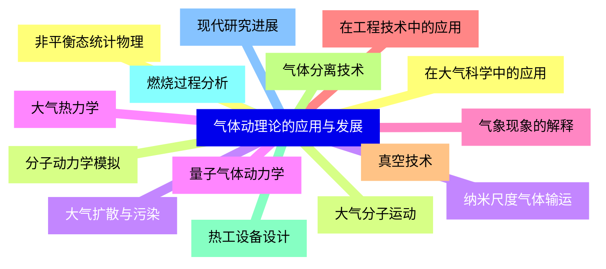


### 1 [气体动理论基础](#1)
#### 1.1 [气体动理论的基本概念](#1)
#### 1.2 [物质的微观结构](#1)
#### 1.3 [分子热运动与统计规律](#1)
#### 1.4 [理想气体模型](#1)
#### 1.5 [实际气体与理想气体的区别](#1)
#### 1.6 [气体状态参量与状态方程](#1)
#### 1.7 [宏观状态参量](#1)
#### 1.8 [理想气体状态方程](#1)
#### 1.9 [实际气体状态方程](#1)
#### 1.10 [状态方程的适用范围](#1)
#### 1.11 [气体动理论的统计方法](#1)
#### 1.12 [统计系综理论](#1)
#### 1.13 [概率分布函数](#1)
#### 1.14 [统计平均值与涨落](#1)
#### 1.15 [宏观量与微观量的关系](#1)
### 2 [气体分子运动论](#2)
#### 2.1 [分子运动的基本假设](#2)
#### 2.2 [分子运动的基本特征](#2)
#### 2.3 [分子间相互作用力](#2)
#### 2.4 [分子碰撞模型](#2)
#### 2.5 [分子自由程](#2)
#### 2.6 [分子速率分布](#2)
#### 2.7 [麦克斯韦速率分布律](#2)
#### 2.8 [速率分布函数的性质](#2)
#### 2.9 [三种特征速率](#2)
#### 2.10 [速率分布的实验验证](#2)
#### 2.11 [分子能量分布](#2)
#### 2.12 [能量均分定理](#2)
#### 2.13 [分子平动动能分布](#2)
#### 2.14 [分子转动与振动能量](#2)
#### 2.15 [能量分布的统计规律](#2)
### 3 [气体输运过程](#3)
#### 3.1 [输运过程的基本理论](#3)
#### 3.2 [输运现象的微观机制](#3)
#### 3.3 [平均自由程理论](#3)
#### 3.4 [碰撞频率与输运系数](#3)
#### 3.5 [输运过程的统计描述](#3)
#### 3.6 [热传导过程](#3)
#### 3.7 [热传导的微观解释](#3)
#### 3.8 [热传导系数](#3)
#### 3.9 [温度梯度与热流密度](#3)
#### 3.10 [热传导的应用实例](#3)
#### 3.11 [扩散过程](#3)
#### 3.12 [自扩散与互扩散](#3)
#### 3.13 [扩散系数](#3)
#### 3.14 [浓度梯度与扩散流](#3)
#### 3.15 [扩散现象的微观机制](#3)
#### 3.16 [粘滞现象](#3)
#### 3.17 [粘滞力的微观解释](#3)
#### 3.18 [粘滞系数](#3)
#### 3.19 [速度梯度与动量输运](#3)
#### 3.20 [粘滞现象的实际应用](#3)
### 4 [理想气体的热力学性质](#4)
#### 4.1 [理想气体的内能](#4)
#### 4.2 [内能的微观解释](#4)
#### 4.3 [温度与内能的关系](#4)
#### 4.4 [内能的变化规律](#4)
#### 4.5 [内能的统计表达式](#4)
#### 4.6 [理想气体的热容量](#4)
#### 4.7 [定容热容量](#4)
#### 4.8 [定压热容量](#4)
#### 4.9 [热容量与自由度的关系](#4)
#### 4.10 [热容量的温度依赖性](#4)
#### 4.11 [理想气体的熵](#4)
#### 4.12 [熵的统计解释](#4)
#### 4.13 [熵与微观状态数](#4)
#### 4.14 [熵增原理的微观基础](#4)
#### 4.15 [熵的计算方法](#4)
### 5 [实际气体与相变](#5)
#### 5.1 [实际气体的性质](#5)
#### 5.2 [分子间作用力的影响](#5)
#### 5.3 [实际气体的状态方程](#5)
#### 5.4 [临界现象](#5)
#### 5.5 [实际气体的热力学性质](#5)
#### 5.6 [范德瓦尔斯方程](#5)
#### 5.7 [方程的推导](#5)
#### 5.8 [方程的参数意义](#5)
#### 5.9 [方程的等温线](#5)
#### 5.10 [方程的适用范围](#5)
#### 5.11 [气体的液化与相变](#5)
#### 5.12 [气液相变的基本特征](#5)
#### 5.13 [饱和蒸汽压](#5)
#### 5.14 [临界温度与临界压力](#5)
#### 5.15 [相变的热力学](#5)
### 6 [稀薄气体与极端条件](#6)
#### 6.1 [稀薄气体动力学](#6)
#### 6.2 [克努森数及其意义](#6)
#### 6.3 [稀薄气体的输运特性](#6)
#### 6.4 [分子束技术](#6)
#### 6.5 [稀薄气体的应用](#6)
#### 6.6 [高温气体性质](#6)
#### 6.7 [高温下的分子激发](#6)
#### 6.8 [离解与电离现象](#6)
#### 6.9 [高温气体的热力学性质](#6)
#### 6.10 [等离子体简介](#6)
#### 6.11 [低温气体现象](#6)
#### 6.12 [低温气体的量子效应](#6)
#### 6.13 [玻色-爱因斯坦凝聚](#6)
#### 6.14 [超流现象](#6)
#### 6.15 [低温物理的应用](#6)
### 7 [气体动理论的应用与发展](#7)
#### 7.1 [在大气科学中的应用](#7)
#### 7.2 [大气分子运动](#7)
#### 7.3 [大气扩散与污染](#7)
#### 7.4 [大气热力学](#7)
#### 7.5 [气象现象的解释](#7)
#### 7.6 [在工程技术中的应用](#7)
#### 7.7 [真空技术](#7)
#### 7.8 [气体分离技术](#7)
#### 7.9 [热工设备设计](#7)
#### 7.10 [燃烧过程分析](#7)
#### 7.11 [现代研究进展](#7)
#### 7.12 [非平衡态统计物理](#7)
#### 7.13 [分子动力学模拟](#7)
#### 7.14 [纳米尺度气体输运](#7)
#### 7.15 [量子气体动力学](#7)




### 1 气体动理论基础

---
### 1 气体动理论基础
___
#### 1.1 气体动理论的基本概念
___
#### 1.2 物质的微观结构
___
#### 1.3 分子热运动与统计规律
___
#### 1.4 理想气体模型
___
#### 1.5 实际气体与理想气体的区别
___
#### 1.6 气体状态参量与状态方程
___
#### 1.7 宏观状态参量
___
#### 1.8 理想气体状态方程
___
#### 1.9 实际气体状态方程
___
#### 1.10 状态方程的适用范围
___
#### 1.11 气体动理论的统计方法
___
#### 1.12 统计系综理论
___
#### 1.13 概率分布函数
___
#### 1.14 统计平均值与涨落
___
#### 1.15 宏观量与微观量的关系
### 2 气体分子运动论

---
### 2 气体分子运动论
___
#### 2.1 分子运动的基本假设
___
#### 2.2 分子运动的基本特征
___
#### 2.3 分子间相互作用力
___
#### 2.4 分子碰撞模型
___
#### 2.5 分子自由程
___
#### 2.6 分子速率分布
___
#### 2.7 麦克斯韦速率分布律
___
#### 2.8 速率分布函数的性质
___
#### 2.9 三种特征速率
___
#### 2.10 速率分布的实验验证
___
#### 2.11 分子能量分布
___
#### 2.12 能量均分定理
___
#### 2.13 分子平动动能分布
___
#### 2.14 分子转动与振动能量
___
#### 2.15 能量分布的统计规律
### 3 气体输运过程

---
### 3 气体输运过程
___
#### 3.1 输运过程的基本理论
___
#### 3.2 输运现象的微观机制
___
#### 3.3 平均自由程理论
___
#### 3.4 碰撞频率与输运系数
___
#### 3.5 输运过程的统计描述
___
#### 3.6 热传导过程
___
#### 3.7 热传导的微观解释
___
#### 3.8 热传导系数
___
#### 3.9 温度梯度与热流密度
___
#### 3.10 热传导的应用实例
___
#### 3.11 扩散过程
___
#### 3.12 自扩散与互扩散
___
#### 3.13 扩散系数
___
#### 3.14 浓度梯度与扩散流
___
#### 3.15 扩散现象的微观机制
___
#### 3.16 粘滞现象
___
#### 3.17 粘滞力的微观解释
___
#### 3.18 粘滞系数
___
#### 3.19 速度梯度与动量输运
___
#### 3.20 粘滞现象的实际应用
### 4 理想气体的热力学性质

---
### 4 理想气体的热力学性质
___
#### 4.1 理想气体的内能
___
#### 4.2 内能的微观解释
___
#### 4.3 温度与内能的关系
___
#### 4.4 内能的变化规律
___
#### 4.5 内能的统计表达式
___
#### 4.6 理想气体的热容量
___
#### 4.7 定容热容量
___
#### 4.8 定压热容量
___
#### 4.9 热容量与自由度的关系
___
#### 4.10 热容量的温度依赖性
___
#### 4.11 理想气体的熵
___
#### 4.12 熵的统计解释
___
#### 4.13 熵与微观状态数
___
#### 4.14 熵增原理的微观基础
___
#### 4.15 熵的计算方法
### 5 实际气体与相变

---
### 5 实际气体与相变
___
#### 5.1 实际气体的性质
___
#### 5.2 分子间作用力的影响
___
#### 5.3 实际气体的状态方程
___
#### 5.4 临界现象
___
#### 5.5 实际气体的热力学性质
___
#### 5.6 范德瓦尔斯方程
___
#### 5.7 方程的推导
___
#### 5.8 方程的参数意义
___
#### 5.9 方程的等温线
___
#### 5.10 方程的适用范围
___
#### 5.11 气体的液化与相变
___
#### 5.12 气液相变的基本特征
___
#### 5.13 饱和蒸汽压
___
#### 5.14 临界温度与临界压力
___
#### 5.15 相变的热力学
### 6 稀薄气体与极端条件

---
### 6 稀薄气体与极端条件
___
#### 6.1 稀薄气体动力学
___
#### 6.2 克努森数及其意义
___
#### 6.3 稀薄气体的输运特性
___
#### 6.4 分子束技术
___
#### 6.5 稀薄气体的应用
___
#### 6.6 高温气体性质
___
#### 6.7 高温下的分子激发
___
#### 6.8 离解与电离现象
___
#### 6.9 高温气体的热力学性质
___
#### 6.10 等离子体简介
___
#### 6.11 低温气体现象
___
#### 6.12 低温气体的量子效应
___
#### 6.13 玻色-爱因斯坦凝聚
___
#### 6.14 超流现象
___
#### 6.15 低温物理的应用
### 7 气体动理论的应用与发展

---
### 7 气体动理论的应用与发展
___
#### 7.1 在大气科学中的应用
___
#### 7.2 大气分子运动
___
#### 7.3 大气扩散与污染
___
#### 7.4 大气热力学
___
#### 7.5 气象现象的解释
___
#### 7.6 在工程技术中的应用
___
#### 7.7 真空技术
___
#### 7.8 气体分离技术
___
#### 7.9 热工设备设计
___
#### 7.10 燃烧过程分析
___
#### 7.11 现代研究进展
___
#### 7.12 非平衡态统计物理
___
#### 7.13 分子动力学模拟
___
#### 7.14 纳米尺度气体输运
___
#### 7.15 量子气体动力学


### 1 气体动理论基础{#1}

{}

<--->
{}
{}
{}
{}
{}
{}
{}
{}
{}
{}
{}
{}
{}
{}
{}
{}
{}
{}
{}
{}
{}
{}
{}
{}
{}
{}
{}
{}
{}
{}
{}

### 2 气体分子运动论{#2}

{}
{}
{}
{}
{}
{}
{}
{}
{}
{}
{}
{}
{}
{}
{}
{}
{}
{}
{}
{}
{}
{}
{}
{}
{}
{}
{}
{}
{}
{}
{}
<--->

{}

### 3 气体输运过程{#3}

{}

<--->
{}
{}
{}
{}
{}
{}
{}
{}
{}
{}
{}
{}
{}
{}
{}
{}
{}
{}
{}
{}
{}
{}
{}
{}
{}
{}
{}
{}
{}
{}
{}
{}
{}
{}
{}
{}
{}
{}
{}
{}
{}

### 4 理想气体的热力学性质{#4}

{}
{}
{}
{}
{}
{}
{}
{}
{}
{}
{}
{}
{}
{}
{}
{}
{}
{}
{}
{}
{}
{}
{}
{}
{}
{}
{}
{}
{}
{}
{}
<--->

{}

### 5 实际气体与相变{#5}

{}

<--->
{}
{}
{}
{}
{}
{}
{}
{}
{}
{}
{}
{}
{}
{}
{}
{}
{}
{}
{}
{}
{}
{}
{}
{}
{}
{}
{}
{}
{}
{}
{}

### 6 稀薄气体与极端条件{#6}

{}
{}
{}
{}
{}
{}
{}
{}
{}
{}
{}
{}
{}
{}
{}
{}
{}
{}
{}
{}
{}
{}
{}
{}
{}
{}
{}
{}
{}
{}
{}
<--->

{}

### 7 气体动理论的应用与发展{#7}

{}

<--->
{}
{}
{}
{}
{}
{}
{}
{}
{}
{}
{}
{}
{}
{}
{}
{}
{}
{}
{}
{}
{}
{}
{}
{}
{}
{}
{}
{}
{}
{}
{}
