
### 1 [线程基础概念](#1)
#### 1.1 [线程定义与特征](#1)
#### 1.2 [线程的基本概念](#1)
#### 1.3 [线程与进程的区别](#1)
#### 1.4 [线程的组成要素](#1)
#### 1.5 [线程的状态与生命周期](#1)
#### 1.6 [线程的优势与挑战](#1)
#### 1.7 [线程带来的性能优势](#1)
#### 1.8 [资源共享与通信便利性](#1)
#### 1.9 [线程同步问题](#1)
#### 1.10 [线程安全性挑战](#1)
### 2 [用户级线程](#2)
#### 2.1 [用户级线程概述](#2)
#### 2.2 [用户级线程定义](#2)
#### 2.3 [用户级线程实现原理](#2)
#### 2.4 [用户级线程管理机制](#2)
#### 2.5 [用户级线程实现技术](#2)
#### 2.6 [线程控制块设计](#2)
#### 2.7 [线程调度算法](#2)
#### 2.8 [上下文切换机制](#2)
#### 2.9 [线程库实现方式](#2)
#### 2.10 [用户级线程优缺点](#2)
#### 2.11 [用户级线程的优势](#2)
#### 2.12 [用户级线程的局限性](#2)
#### 2.13 [适用场景分析](#2)
### 3 [内核级线程](#3)
#### 3.1 [内核级线程概述](#3)
#### 3.2 [内核级线程定义](#3)
#### 3.3 [内核级线程实现原理](#3)
#### 3.4 [内核级线程管理机制](#3)
#### 3.5 [内核级线程实现技术](#3)
#### 3.6 [内核线程控制结构](#3)
#### 3.7 [系统调用接口设计](#3)
#### 3.8 [内核调度器集成](#3)
#### 3.9 [资源管理机制](#3)
#### 3.10 [内核级线程优缺点](#3)
#### 3.11 [内核级线程的优势](#3)
#### 3.12 [内核级线程的局限性](#3)
#### 3.13 [性能与开销分析](#3)
### 4 [混合线程模型](#4)
#### 4.1 [混合模型概述](#4)
#### 4.2 [混合线程模型定义](#4)
#### 4.3 [混合模型设计思想](#4)
#### 4.4 [用户级与内核级结合方式](#4)
#### 4.5 [混合模型实现技术](#4)
#### 4.6 [多对多映射机制](#4)
#### 4.7 [调度器协作设计](#4)
#### 4.8 [资源分配策略](#4)
#### 4.9 [性能优化技术](#4)
#### 4.10 [混合模型应用](#4)
#### 4.11 [实际系统中的应用](#4)
#### 4.12 [性能调优方法](#4)
#### 4.13 [典型实现案例分析](#4)
### 5 [线程调度策略](#5)
#### 5.1 [基本调度算法](#5)
#### 5.2 [先来先服务调度](#5)
#### 5.3 [时间片轮转调度](#5)
#### 5.4 [优先级调度算法](#5)
#### 5.5 [多级反馈队列调度](#5)
#### 5.6 [高级调度技术](#5)
#### 5.7 [负载均衡策略](#5)
#### 5.8 [亲和性调度](#5)
#### 5.9 [实时调度算法](#5)
#### 5.10 [多处理器调度](#5)
### 6 [线程同步机制](#6)
#### 6.1 [基本同步原语](#6)
#### 6.2 [互斥锁实现原理](#6)
#### 6.3 [信号量机制](#6)
#### 6.4 [条件变量设计](#6)
#### 6.5 [读写锁实现](#6)
#### 6.6 [高级同步技术](#6)
#### 6.7 [屏障同步](#6)
#### 6.8 [管程机制](#6)
#### 6.9 [无锁编程技术](#6)
#### 6.10 [事务内存](#6)
### 7 [线程通信机制](#7)
#### 7.1 [进程内线程通信](#7)
#### 7.2 [共享内存通信](#7)
#### 7.3 [消息队列通信](#7)
#### 7.4 [管道通信机制](#7)
#### 7.5 [信号通信方式](#7)
#### 7.6 [跨进程线程通信](#7)
#### 7.7 [套接字通信](#7)
#### 7.8 [远程过程调用](#7)
#### 7.9 [分布式共享内存](#7)
#### 7.10 [消息传递接口](#7)
### 8 [现代操作系统线程实现](#8)
#### 8.1 [Windows线程实现](#8)
#### 8.2 [Windows线程模型](#8)
#### 8.3 [线程调度机制](#8)
#### 8.4 [同步原语实现](#8)
#### 8.5 [线程池技术](#8)
#### 8.6 [Linux线程实现](#8)
#### 8.7 [Linux线程模型演变](#8)
#### 8.8 [NPTL实现机制](#8)
#### 8.9 [调度器设计](#8)
#### 8.10 [CGroup资源控制](#8)
#### 8.11 [其他系统线程实现](#8)
#### 8.12 [macOS GCD技术](#8)
#### 8.13 [Solaris线程模型](#8)
#### 8.14 [FreeBSD线程实现](#8)
#### 8.15 [实时系统线程特性](#8)
### 9 [线程性能优化](#9)
#### 9.1 [性能分析工具](#9)
#### 9.2 [线程性能监控](#9)
#### 9.3 [锁竞争分析](#9)
#### 9.4 [上下文切换开销测量](#9)
#### 9.5 [内存使用分析](#9)
#### 9.6 [优化技术](#9)
#### 9.7 [线程池优化](#9)
#### 9.8 [锁粒度调整](#9)
#### 9.9 [缓存友好设计](#9)
#### 9.10 [并行算法优化](#9)
### 10 [线程安全编程](#10)
#### 10.1 [线程安全问题](#10)
#### 10.2 [竞态条件](#10)
#### 10.3 [死锁产生与预防](#10)
#### 10.4 [活锁与饥饿](#10)
#### 10.5 [内存一致性模型](#10)
#### 10.6 [安全编程实践](#10)
#### 10.7 [线程安全设计模式](#10)
#### 10.8 [锁的使用规范](#10)
#### 10.9 [原子操作应用](#10)
#### 10.10 [不可变对象设计](#10)
### 11 [特殊线程技术](#11)
#### 11.1 [纤程与协程](#11)
#### 11.2 [纤程概念与实现](#11)
#### 11.3 [协程调度机制](#11)
#### 11.4 [应用场景分析](#11)
#### 11.5 [性能对比研究](#11)
#### 11.6 [绿色线程](#11)
#### 11.7 [绿色线程定义](#11)
#### 11.8 [虚拟机线程实现](#11)
#### 11.9 [语言级线程支持](#11)
#### 11.10 [现代语言线程特性](#11)
### 12 [线程发展趋势](#12)
#### 12.1 [新技术发展](#12)
#### 12.2 [异步编程模型](#12)
#### 12.3 [数据并行技术](#12)
#### 12.4 [任务并行库](#12)
#### 12.5 [异构计算线程](#12)
#### 12.6 [未来展望](#12)
#### 12.7 [量子计算线程模型](#12)
#### 12.8 [神经形态计算线程](#12)
#### 12.9 [分布式系统线程](#12)
#### 12.10 [自适应线程技术](#12)




### 1 线程基础概念

---
### 1 线程基础概念
___
#### 1.1 线程定义与特征
___
#### 1.2 线程的基本概念
___
#### 1.3 线程与进程的区别
___
#### 1.4 线程的组成要素
___
#### 1.5 线程的状态与生命周期
___
#### 1.6 线程的优势与挑战
___
#### 1.7 线程带来的性能优势
___
#### 1.8 资源共享与通信便利性
___
#### 1.9 线程同步问题
___
#### 1.10 线程安全性挑战
### 2 用户级线程

---
### 2 用户级线程
___
#### 2.1 用户级线程概述
___
#### 2.2 用户级线程定义
___
#### 2.3 用户级线程实现原理
___
#### 2.4 用户级线程管理机制
___
#### 2.5 用户级线程实现技术
___
#### 2.6 线程控制块设计
___
#### 2.7 线程调度算法
___
#### 2.8 上下文切换机制
___
#### 2.9 线程库实现方式
___
#### 2.10 用户级线程优缺点
___
#### 2.11 用户级线程的优势
___
#### 2.12 用户级线程的局限性
___
#### 2.13 适用场景分析
### 3 内核级线程

---
### 3 内核级线程
___
#### 3.1 内核级线程概述
___
#### 3.2 内核级线程定义
___
#### 3.3 内核级线程实现原理
___
#### 3.4 内核级线程管理机制
___
#### 3.5 内核级线程实现技术
___
#### 3.6 内核线程控制结构
___
#### 3.7 系统调用接口设计
___
#### 3.8 内核调度器集成
___
#### 3.9 资源管理机制
___
#### 3.10 内核级线程优缺点
___
#### 3.11 内核级线程的优势
___
#### 3.12 内核级线程的局限性
___
#### 3.13 性能与开销分析
### 4 混合线程模型

---
### 4 混合线程模型
___
#### 4.1 混合模型概述
___
#### 4.2 混合线程模型定义
___
#### 4.3 混合模型设计思想
___
#### 4.4 用户级与内核级结合方式
___
#### 4.5 混合模型实现技术
___
#### 4.6 多对多映射机制
___
#### 4.7 调度器协作设计
___
#### 4.8 资源分配策略
___
#### 4.9 性能优化技术
___
#### 4.10 混合模型应用
___
#### 4.11 实际系统中的应用
___
#### 4.12 性能调优方法
___
#### 4.13 典型实现案例分析
### 5 线程调度策略

---
### 5 线程调度策略
___
#### 5.1 基本调度算法
___
#### 5.2 先来先服务调度
___
#### 5.3 时间片轮转调度
___
#### 5.4 优先级调度算法
___
#### 5.5 多级反馈队列调度
___
#### 5.6 高级调度技术
___
#### 5.7 负载均衡策略
___
#### 5.8 亲和性调度
___
#### 5.9 实时调度算法
___
#### 5.10 多处理器调度
### 6 线程同步机制

---
### 6 线程同步机制
___
#### 6.1 基本同步原语
___
#### 6.2 互斥锁实现原理
___
#### 6.3 信号量机制
___
#### 6.4 条件变量设计
___
#### 6.5 读写锁实现
___
#### 6.6 高级同步技术
___
#### 6.7 屏障同步
___
#### 6.8 管程机制
___
#### 6.9 无锁编程技术
___
#### 6.10 事务内存
### 7 线程通信机制

---
### 7 线程通信机制
___
#### 7.1 进程内线程通信
___
#### 7.2 共享内存通信
___
#### 7.3 消息队列通信
___
#### 7.4 管道通信机制
___
#### 7.5 信号通信方式
___
#### 7.6 跨进程线程通信
___
#### 7.7 套接字通信
___
#### 7.8 远程过程调用
___
#### 7.9 分布式共享内存
___
#### 7.10 消息传递接口
### 8 现代操作系统线程实现

---
### 8 现代操作系统线程实现
___
#### 8.1 Windows线程实现
___
#### 8.2 Windows线程模型
___
#### 8.3 线程调度机制
___
#### 8.4 同步原语实现
___
#### 8.5 线程池技术
___
#### 8.6 Linux线程实现
___
#### 8.7 Linux线程模型演变
___
#### 8.8 NPTL实现机制
___
#### 8.9 调度器设计
___
#### 8.10 CGroup资源控制
___
#### 8.11 其他系统线程实现
___
#### 8.12 macOS GCD技术
___
#### 8.13 Solaris线程模型
___
#### 8.14 FreeBSD线程实现
___
#### 8.15 实时系统线程特性
### 9 线程性能优化

---
### 9 线程性能优化
___
#### 9.1 性能分析工具
___
#### 9.2 线程性能监控
___
#### 9.3 锁竞争分析
___
#### 9.4 上下文切换开销测量
___
#### 9.5 内存使用分析
___
#### 9.6 优化技术
___
#### 9.7 线程池优化
___
#### 9.8 锁粒度调整
___
#### 9.9 缓存友好设计
___
#### 9.10 并行算法优化
### 10 线程安全编程

---
### 10 线程安全编程
___
#### 10.1 线程安全问题
___
#### 10.2 竞态条件
___
#### 10.3 死锁产生与预防
___
#### 10.4 活锁与饥饿
___
#### 10.5 内存一致性模型
___
#### 10.6 安全编程实践
___
#### 10.7 线程安全设计模式
___
#### 10.8 锁的使用规范
___
#### 10.9 原子操作应用
___
#### 10.10 不可变对象设计
### 11 特殊线程技术

---
### 11 特殊线程技术
___
#### 11.1 纤程与协程
___
#### 11.2 纤程概念与实现
___
#### 11.3 协程调度机制
___
#### 11.4 应用场景分析
___
#### 11.5 性能对比研究
___
#### 11.6 绿色线程
___
#### 11.7 绿色线程定义
___
#### 11.8 虚拟机线程实现
___
#### 11.9 语言级线程支持
___
#### 11.10 现代语言线程特性
### 12 线程发展趋势

---
### 12 线程发展趋势
___
#### 12.1 新技术发展
___
#### 12.2 异步编程模型
___
#### 12.3 数据并行技术
___
#### 12.4 任务并行库
___
#### 12.5 异构计算线程
___
#### 12.6 未来展望
___
#### 12.7 量子计算线程模型
___
#### 12.8 神经形态计算线程
___
#### 12.9 分布式系统线程
___
#### 12.10 自适应线程技术


### 1 线程基础概念{#1}

{}
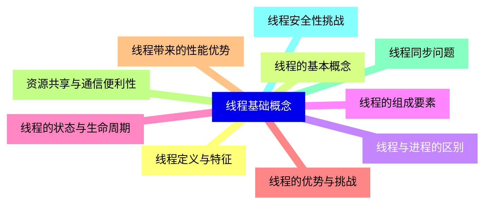

<--->
{}
{}
{}
{}
{}
{}
{}
{}
{}
{}
{}
{}
{}
{}
{}
{}
{}
{}
{}
{}
{}

### 2 用户级线程{#2}

{}
{}
{}
{}
{}
{}
{}
{}
{}
{}
{}
{}
{}
{}
{}
{}
{}
{}
{}
{}
{}
{}
{}
{}
{}
{}
{}
<--->
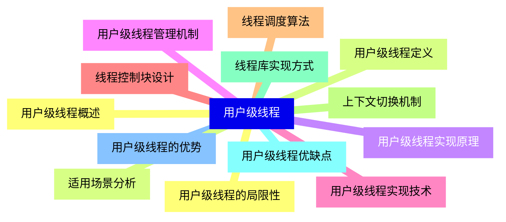

{}

### 3 内核级线程{#3}

{}
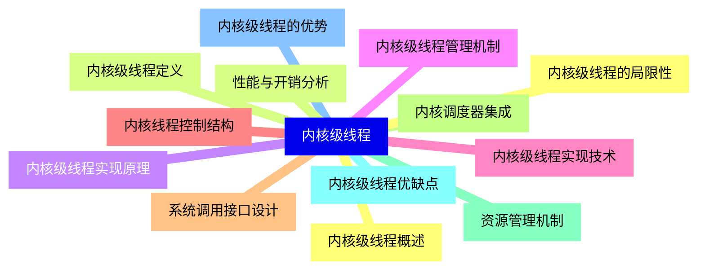

<--->
{}
{}
{}
{}
{}
{}
{}
{}
{}
{}
{}
{}
{}
{}
{}
{}
{}
{}
{}
{}
{}
{}
{}
{}
{}
{}
{}

### 4 混合线程模型{#4}

{}
{}
{}
{}
{}
{}
{}
{}
{}
{}
{}
{}
{}
{}
{}
{}
{}
{}
{}
{}
{}
{}
{}
{}
{}
{}
{}
<--->
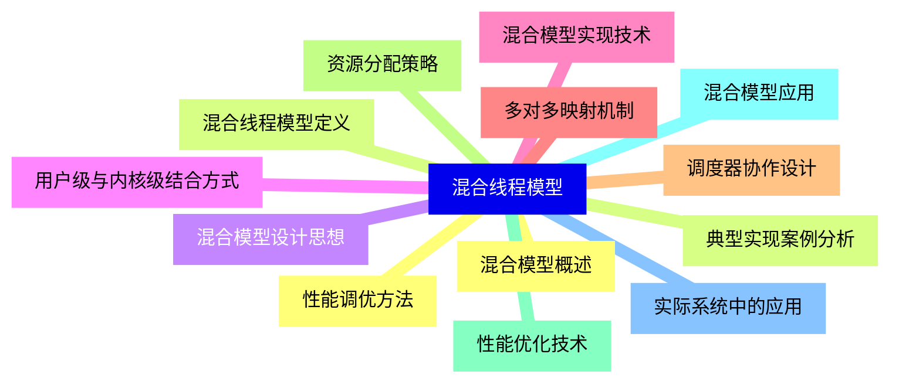

{}

### 5 线程调度策略{#5}

{}
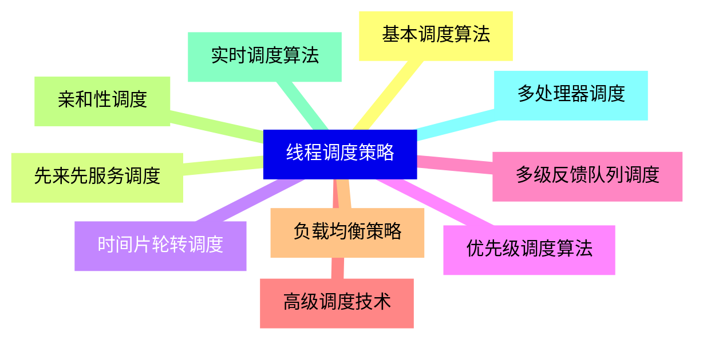

<--->
{}
{}
{}
{}
{}
{}
{}
{}
{}
{}
{}
{}
{}
{}
{}
{}
{}
{}
{}
{}
{}

### 6 线程同步机制{#6}

{}
{}
{}
{}
{}
{}
{}
{}
{}
{}
{}
{}
{}
{}
{}
{}
{}
{}
{}
{}
{}
<--->
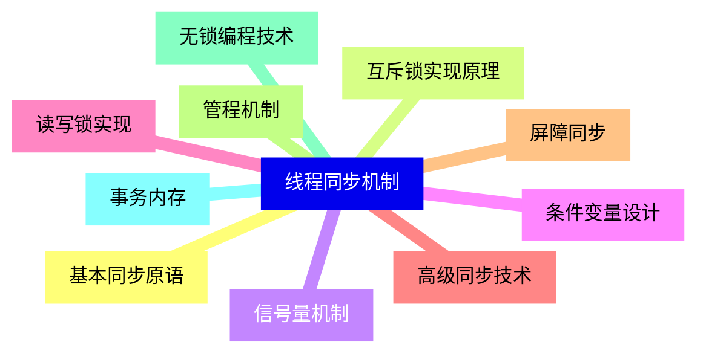

{}

### 7 线程通信机制{#7}

{}
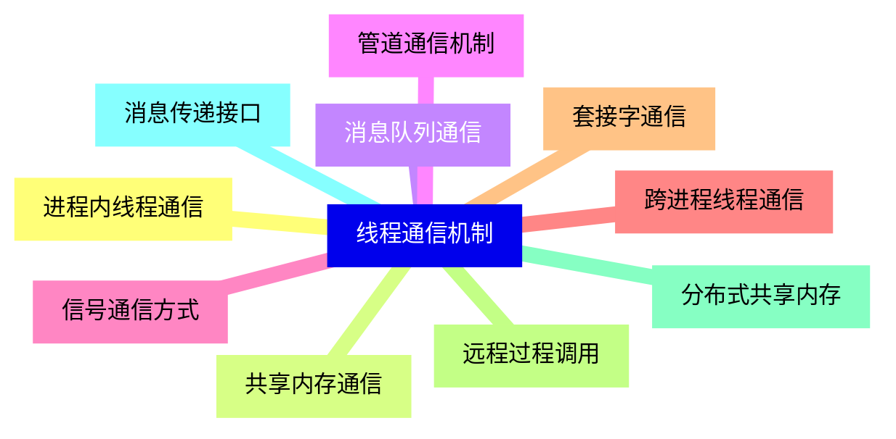

<--->
{}
{}
{}
{}
{}
{}
{}
{}
{}
{}
{}
{}
{}
{}
{}
{}
{}
{}
{}
{}
{}

### 8 现代操作系统线程实现{#8}

{}
{}
{}
{}
{}
{}
{}
{}
{}
{}
{}
{}
{}
{}
{}
{}
{}
{}
{}
{}
{}
{}
{}
{}
{}
{}
{}
{}
{}
{}
{}
<--->
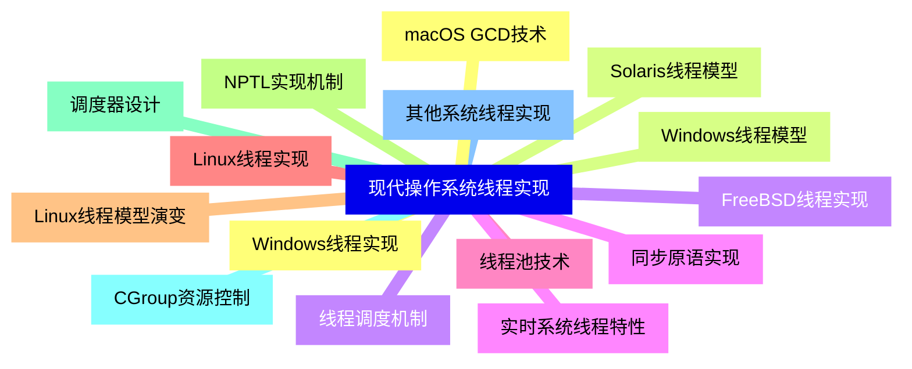

{}

### 9 线程性能优化{#9}

{}
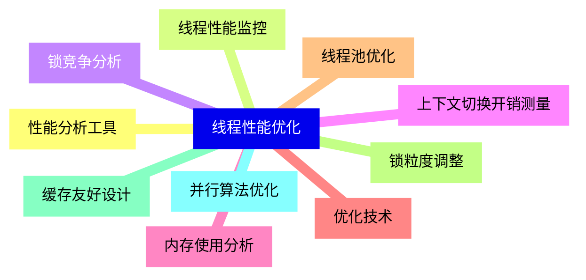

<--->
{}
{}
{}
{}
{}
{}
{}
{}
{}
{}
{}
{}
{}
{}
{}
{}
{}
{}
{}
{}
{}

### 10 线程安全编程{#10}

{}
{}
{}
{}
{}
{}
{}
{}
{}
{}
{}
{}
{}
{}
{}
{}
{}
{}
{}
{}
{}
<--->
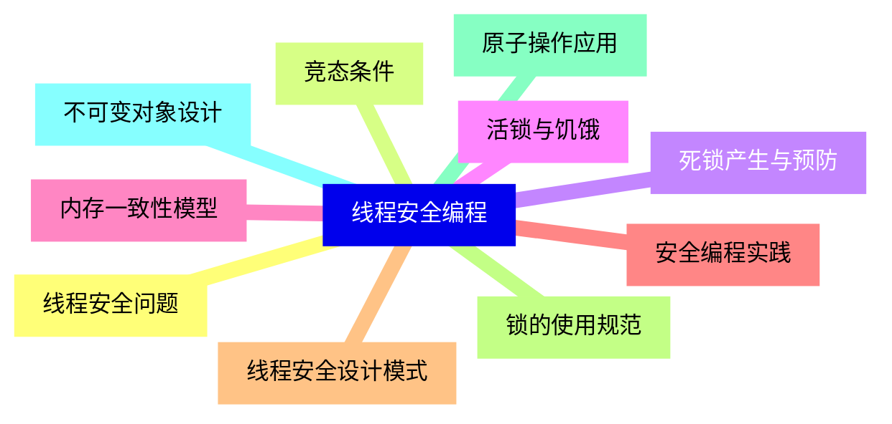

{}

### 11 特殊线程技术{#11}

{}
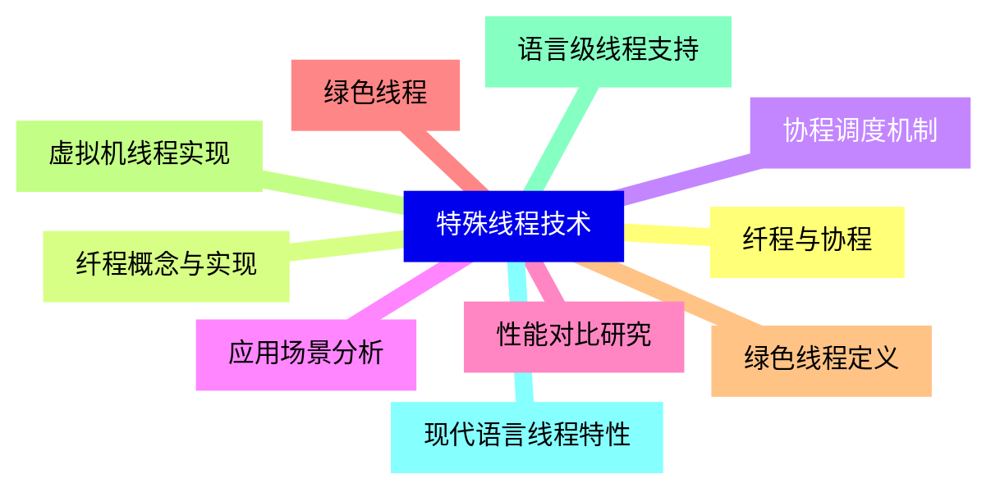

<--->
{}
{}
{}
{}
{}
{}
{}
{}
{}
{}
{}
{}
{}
{}
{}
{}
{}
{}
{}
{}
{}

### 12 线程发展趋势{#12}

{}
{}
{}
{}
{}
{}
{}
{}
{}
{}
{}
{}
{}
{}
{}
{}
{}
{}
{}
{}
{}
<--->
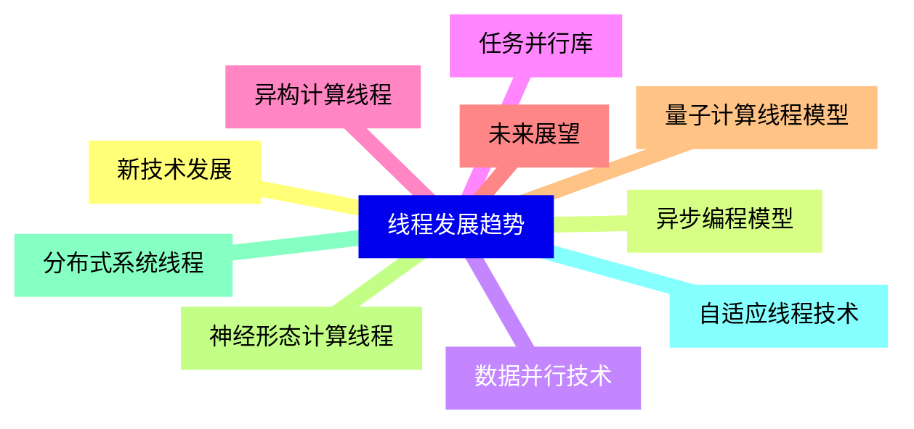

{}
