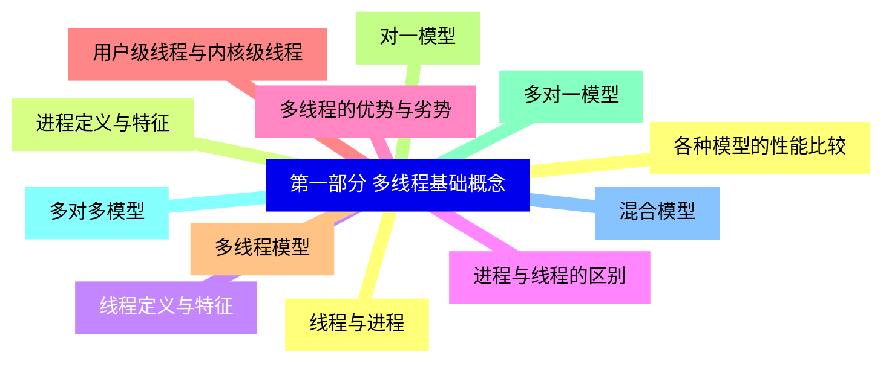
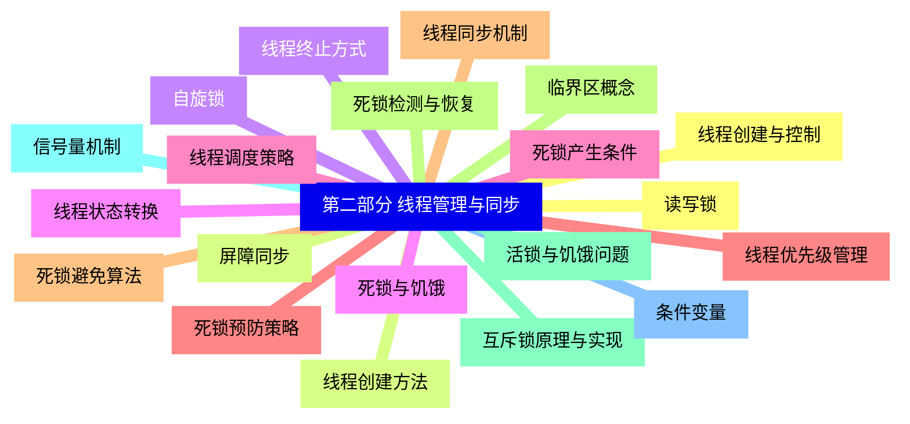
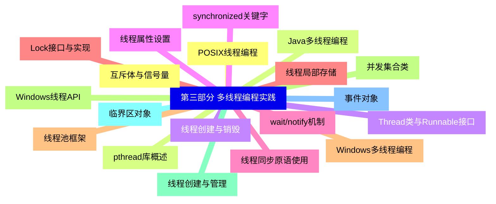
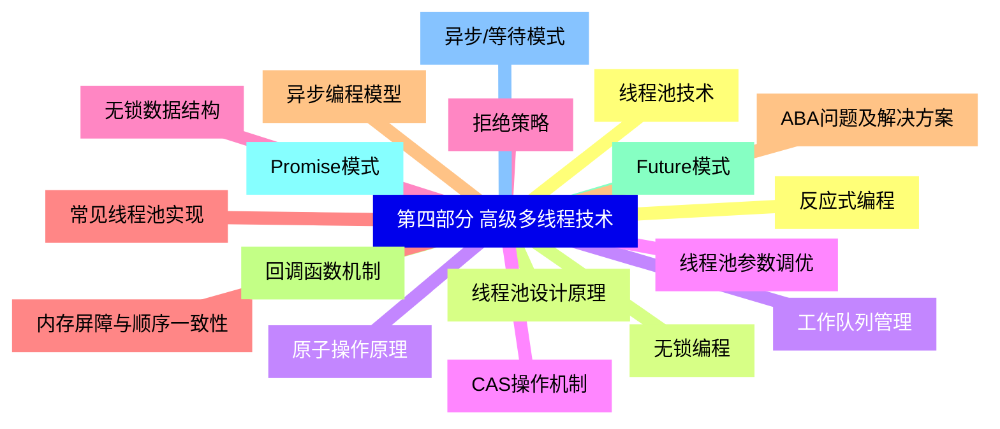
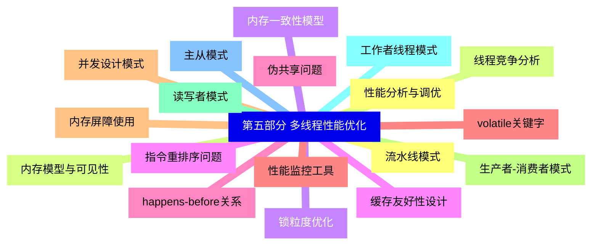
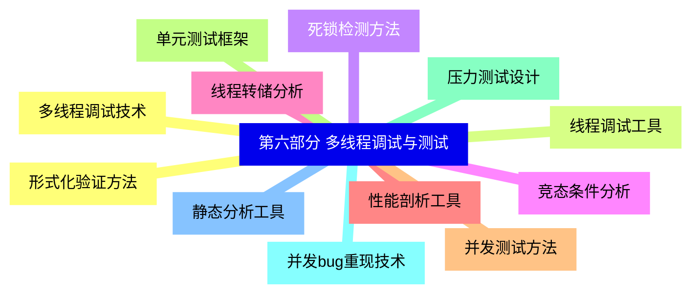
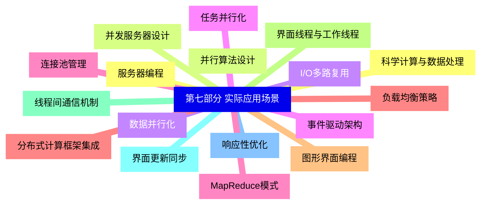


### 1 [第一部分 多线程基础概念](#1)
#### 1.1 [线程与进程](#1)
#### 1.2 [进程定义与特征](#1)
#### 1.3 [线程定义与特征](#1)
#### 1.4 [进程与线程的区别](#1)
#### 1.5 [多线程的优势与劣势](#1)
#### 1.6 [用户级线程与内核级线程](#1)
#### 1.7 [多线程模型](#1)
#### 1.8 [对一模型](#1)
#### 1.9 [多对一模型](#1)
#### 1.10 [多对多模型](#1)
#### 1.11 [混合模型](#1)
#### 1.12 [各种模型的性能比较](#1)
### 2 [第二部分 线程管理与同步](#2)
#### 2.1 [线程创建与控制](#2)
#### 2.2 [线程创建方法](#2)
#### 2.3 [线程终止方式](#2)
#### 2.4 [线程状态转换](#2)
#### 2.5 [线程调度策略](#2)
#### 2.6 [线程优先级管理](#2)
#### 2.7 [线程同步机制](#2)
#### 2.8 [临界区概念](#2)
#### 2.9 [互斥锁原理与实现](#2)
#### 2.10 [信号量机制](#2)
#### 2.11 [条件变量](#2)
#### 2.12 [读写锁](#2)
#### 2.13 [屏障同步](#2)
#### 2.14 [自旋锁](#2)
#### 2.15 [死锁与饥饿](#2)
#### 2.16 [死锁产生条件](#2)
#### 2.17 [死锁预防策略](#2)
#### 2.18 [死锁避免算法](#2)
#### 2.19 [死锁检测与恢复](#2)
#### 2.20 [活锁与饥饿问题](#2)
### 3 [第三部分 多线程编程实践](#3)
#### 3.1 [POSIX线程编程](#3)
#### 3.2 [pthread库概述](#3)
#### 3.3 [线程创建与销毁](#3)
#### 3.4 [线程属性设置](#3)
#### 3.5 [线程同步原语使用](#3)
#### 3.6 [线程局部存储](#3)
#### 3.7 [Windows多线程编程](#3)
#### 3.8 [Windows线程API](#3)
#### 3.9 [线程创建与管理](#3)
#### 3.10 [临界区对象](#3)
#### 3.11 [事件对象](#3)
#### 3.12 [互斥体与信号量](#3)
#### 3.13 [Java多线程编程](#3)
#### 3.14 [Thread类与Runnable接口](#3)
#### 3.15 [synchronized关键字](#3)
#### 3.16 [wait/notify机制](#3)
#### 3.17 [Lock接口与实现](#3)
#### 3.18 [线程池框架](#3)
#### 3.19 [并发集合类](#3)
### 4 [第四部分 高级多线程技术](#4)
#### 4.1 [线程池技术](#4)
#### 4.2 [线程池设计原理](#4)
#### 4.3 [工作队列管理](#4)
#### 4.4 [线程池参数调优](#4)
#### 4.5 [拒绝策略](#4)
#### 4.6 [常见线程池实现](#4)
#### 4.7 [异步编程模型](#4)
#### 4.8 [回调函数机制](#4)
#### 4.9 [Future模式](#4)
#### 4.10 [Promise模式](#4)
#### 4.11 [异步/等待模式](#4)
#### 4.12 [反应式编程](#4)
#### 4.13 [无锁编程](#4)
#### 4.14 [原子操作原理](#4)
#### 4.15 [CAS操作机制](#4)
#### 4.16 [无锁数据结构](#4)
#### 4.17 [内存屏障与顺序一致性](#4)
#### 4.18 [ABA问题及解决方案](#4)
### 5 [第五部分 多线程性能优化](#5)
#### 5.1 [性能分析与调优](#5)
#### 5.2 [线程竞争分析](#5)
#### 5.3 [锁粒度优化](#5)
#### 5.4 [缓存友好性设计](#5)
#### 5.5 [伪共享问题](#5)
#### 5.6 [性能监控工具](#5)
#### 5.7 [并发设计模式](#5)
#### 5.8 [生产者-消费者模式](#5)
#### 5.9 [读写者模式](#5)
#### 5.10 [工作者线程模式](#5)
#### 5.11 [主从模式](#5)
#### 5.12 [流水线模式](#5)
#### 5.13 [内存模型与可见性](#5)
#### 5.14 [内存一致性模型](#5)
#### 5.15 [指令重排序问题](#5)
#### 5.16 [happens-before关系](#5)
#### 5.17 [volatile关键字](#5)
#### 5.18 [内存屏障使用](#5)
### 6 [第六部分 多线程调试与测试](#6)
#### 6.1 [多线程调试技术](#6)
#### 6.2 [线程调试工具](#6)
#### 6.3 [死锁检测方法](#6)
#### 6.4 [竞态条件分析](#6)
#### 6.5 [线程转储分析](#6)
#### 6.6 [性能剖析工具](#6)
#### 6.7 [并发测试方法](#6)
#### 6.8 [单元测试框架](#6)
#### 6.9 [压力测试设计](#6)
#### 6.10 [并发bug重现技术](#6)
#### 6.11 [静态分析工具](#6)
#### 6.12 [形式化验证方法](#6)
### 7 [第七部分 实际应用场景](#7)
#### 7.1 [服务器编程](#7)
#### 7.2 [并发服务器设计](#7)
#### 7.3 [I/O多路复用](#7)
#### 7.4 [事件驱动架构](#7)
#### 7.5 [连接池管理](#7)
#### 7.6 [负载均衡策略](#7)
#### 7.7 [图形界面编程](#7)
#### 7.8 [界面线程与工作线程](#7)
#### 7.9 [线程间通信机制](#7)
#### 7.10 [界面更新同步](#7)
#### 7.11 [响应性优化](#7)
#### 7.12 [科学计算与数据处理](#7)
#### 7.13 [并行算法设计](#7)
#### 7.14 [数据并行化](#7)
#### 7.15 [任务并行化](#7)
#### 7.16 [MapReduce模式](#7)
#### 7.17 [分布式计算框架集成](#7)




### 1 第一部分 多线程基础概念

---
### 1 第一部分 多线程基础概念
___
#### 1.1 线程与进程
___
#### 1.2 进程定义与特征
___
#### 1.3 线程定义与特征
___
#### 1.4 进程与线程的区别
___
#### 1.5 多线程的优势与劣势
___
#### 1.6 用户级线程与内核级线程
___
#### 1.7 多线程模型
___
#### 1.8 对一模型
___
#### 1.9 多对一模型
___
#### 1.10 多对多模型
___
#### 1.11 混合模型
___
#### 1.12 各种模型的性能比较
### 2 第二部分 线程管理与同步

---
### 2 第二部分 线程管理与同步
___
#### 2.1 线程创建与控制
___
#### 2.2 线程创建方法
___
#### 2.3 线程终止方式
___
#### 2.4 线程状态转换
___
#### 2.5 线程调度策略
___
#### 2.6 线程优先级管理
___
#### 2.7 线程同步机制
___
#### 2.8 临界区概念
___
#### 2.9 互斥锁原理与实现
___
#### 2.10 信号量机制
___
#### 2.11 条件变量
___
#### 2.12 读写锁
___
#### 2.13 屏障同步
___
#### 2.14 自旋锁
___
#### 2.15 死锁与饥饿
___
#### 2.16 死锁产生条件
___
#### 2.17 死锁预防策略
___
#### 2.18 死锁避免算法
___
#### 2.19 死锁检测与恢复
___
#### 2.20 活锁与饥饿问题
### 3 第三部分 多线程编程实践

---
### 3 第三部分 多线程编程实践
___
#### 3.1 POSIX线程编程
___
#### 3.2 pthread库概述
___
#### 3.3 线程创建与销毁
___
#### 3.4 线程属性设置
___
#### 3.5 线程同步原语使用
___
#### 3.6 线程局部存储
___
#### 3.7 Windows多线程编程
___
#### 3.8 Windows线程API
___
#### 3.9 线程创建与管理
___
#### 3.10 临界区对象
___
#### 3.11 事件对象
___
#### 3.12 互斥体与信号量
___
#### 3.13 Java多线程编程
___
#### 3.14 Thread类与Runnable接口
___
#### 3.15 synchronized关键字
___
#### 3.16 wait/notify机制
___
#### 3.17 Lock接口与实现
___
#### 3.18 线程池框架
___
#### 3.19 并发集合类
### 4 第四部分 高级多线程技术

---
### 4 第四部分 高级多线程技术
___
#### 4.1 线程池技术
___
#### 4.2 线程池设计原理
___
#### 4.3 工作队列管理
___
#### 4.4 线程池参数调优
___
#### 4.5 拒绝策略
___
#### 4.6 常见线程池实现
___
#### 4.7 异步编程模型
___
#### 4.8 回调函数机制
___
#### 4.9 Future模式
___
#### 4.10 Promise模式
___
#### 4.11 异步/等待模式
___
#### 4.12 反应式编程
___
#### 4.13 无锁编程
___
#### 4.14 原子操作原理
___
#### 4.15 CAS操作机制
___
#### 4.16 无锁数据结构
___
#### 4.17 内存屏障与顺序一致性
___
#### 4.18 ABA问题及解决方案
### 5 第五部分 多线程性能优化

---
### 5 第五部分 多线程性能优化
___
#### 5.1 性能分析与调优
___
#### 5.2 线程竞争分析
___
#### 5.3 锁粒度优化
___
#### 5.4 缓存友好性设计
___
#### 5.5 伪共享问题
___
#### 5.6 性能监控工具
___
#### 5.7 并发设计模式
___
#### 5.8 生产者-消费者模式
___
#### 5.9 读写者模式
___
#### 5.10 工作者线程模式
___
#### 5.11 主从模式
___
#### 5.12 流水线模式
___
#### 5.13 内存模型与可见性
___
#### 5.14 内存一致性模型
___
#### 5.15 指令重排序问题
___
#### 5.16 happens-before关系
___
#### 5.17 volatile关键字
___
#### 5.18 内存屏障使用
### 6 第六部分 多线程调试与测试

---
### 6 第六部分 多线程调试与测试
___
#### 6.1 多线程调试技术
___
#### 6.2 线程调试工具
___
#### 6.3 死锁检测方法
___
#### 6.4 竞态条件分析
___
#### 6.5 线程转储分析
___
#### 6.6 性能剖析工具
___
#### 6.7 并发测试方法
___
#### 6.8 单元测试框架
___
#### 6.9 压力测试设计
___
#### 6.10 并发bug重现技术
___
#### 6.11 静态分析工具
___
#### 6.12 形式化验证方法
### 7 第七部分 实际应用场景

---
### 7 第七部分 实际应用场景
___
#### 7.1 服务器编程
___
#### 7.2 并发服务器设计
___
#### 7.3 I/O多路复用
___
#### 7.4 事件驱动架构
___
#### 7.5 连接池管理
___
#### 7.6 负载均衡策略
___
#### 7.7 图形界面编程
___
#### 7.8 界面线程与工作线程
___
#### 7.9 线程间通信机制
___
#### 7.10 界面更新同步
___
#### 7.11 响应性优化
___
#### 7.12 科学计算与数据处理
___
#### 7.13 并行算法设计
___
#### 7.14 数据并行化
___
#### 7.15 任务并行化
___
#### 7.16 MapReduce模式
___
#### 7.17 分布式计算框架集成


### 1 第一部分 多线程基础概念{#1}

{}

<--->
{}
{}
{}
{}
{}
{}
{}
{}
{}
{}
{}
{}
{}
{}
{}
{}
{}
{}
{}
{}
{}
{}
{}
{}
{}

### 2 第二部分 线程管理与同步{#2}

{}
{}
{}
{}
{}
{}
{}
{}
{}
{}
{}
{}
{}
{}
{}
{}
{}
{}
{}
{}
{}
{}
{}
{}
{}
{}
{}
{}
{}
{}
{}
{}
{}
{}
{}
{}
{}
{}
{}
{}
{}
<--->

{}

### 3 第三部分 多线程编程实践{#3}

{}

<--->
{}
{}
{}
{}
{}
{}
{}
{}
{}
{}
{}
{}
{}
{}
{}
{}
{}
{}
{}
{}
{}
{}
{}
{}
{}
{}
{}
{}
{}
{}
{}
{}
{}
{}
{}
{}
{}
{}
{}

### 4 第四部分 高级多线程技术{#4}

{}
{}
{}
{}
{}
{}
{}
{}
{}
{}
{}
{}
{}
{}
{}
{}
{}
{}
{}
{}
{}
{}
{}
{}
{}
{}
{}
{}
{}
{}
{}
{}
{}
{}
{}
{}
{}
<--->

{}

### 5 第五部分 多线程性能优化{#5}

{}

<--->
{}
{}
{}
{}
{}
{}
{}
{}
{}
{}
{}
{}
{}
{}
{}
{}
{}
{}
{}
{}
{}
{}
{}
{}
{}
{}
{}
{}
{}
{}
{}
{}
{}
{}
{}
{}
{}

### 6 第六部分 多线程调试与测试{#6}

{}
{}
{}
{}
{}
{}
{}
{}
{}
{}
{}
{}
{}
{}
{}
{}
{}
{}
{}
{}
{}
{}
{}
{}
{}
<--->

{}

### 7 第七部分 实际应用场景{#7}

{}

<--->
{}
{}
{}
{}
{}
{}
{}
{}
{}
{}
{}
{}
{}
{}
{}
{}
{}
{}
{}
{}
{}
{}
{}
{}
{}
{}
{}
{}
{}
{}
{}
{}
{}
{}
{}
