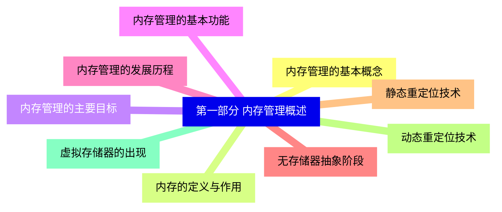
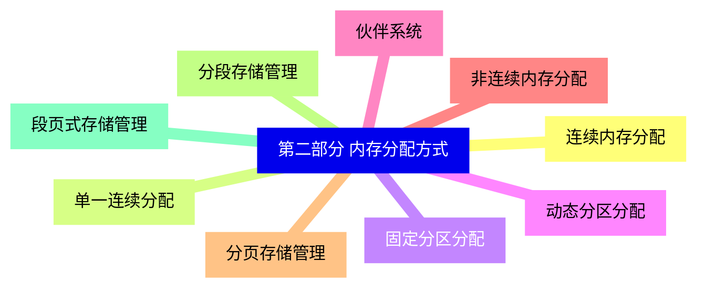
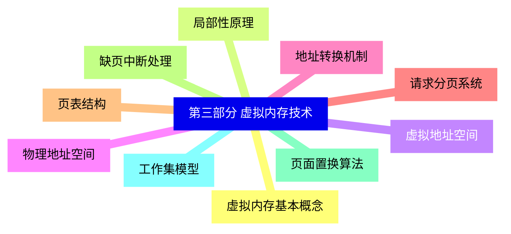
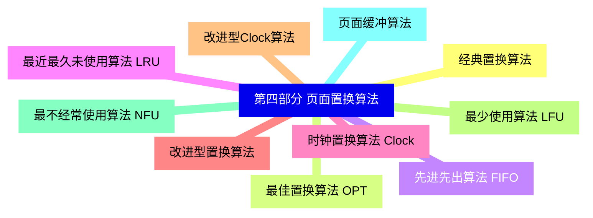
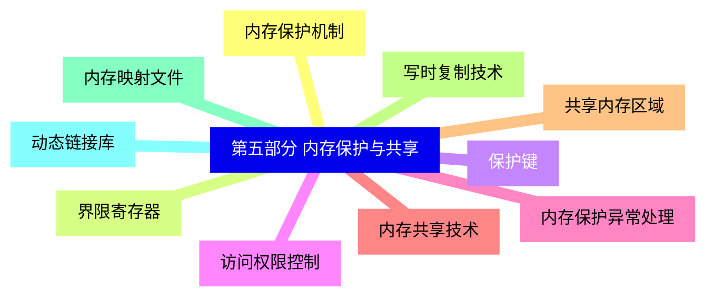
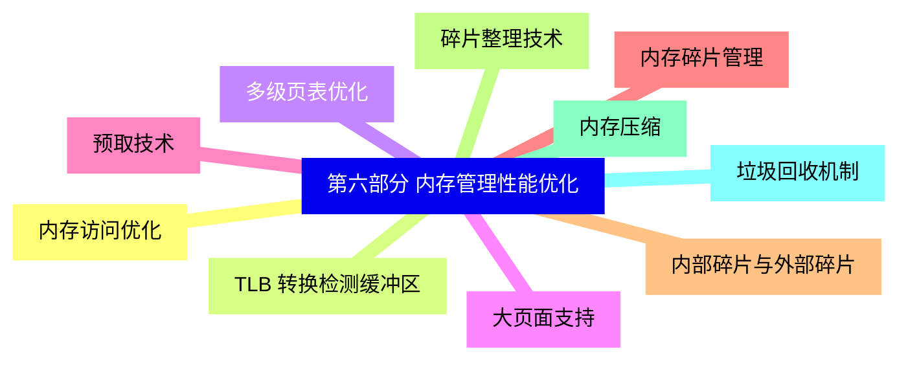
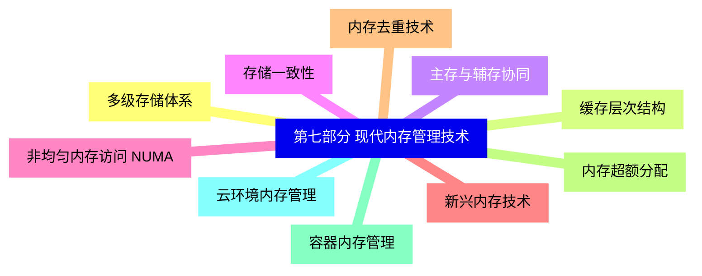
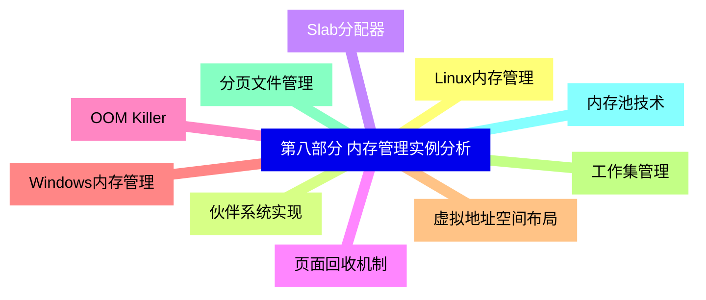


### 1 [第一部分 内存管理概述](#1)
#### 1.1 [内存管理的基本概念](#1)
#### 1.2 [内存的定义与作用](#1)
#### 1.3 [内存管理的主要目标](#1)
#### 1.4 [内存管理的基本功能](#1)
#### 1.5 [内存管理的发展历程](#1)
#### 1.6 [无存储器抽象阶段](#1)
#### 1.7 [静态重定位技术](#1)
#### 1.8 [动态重定位技术](#1)
#### 1.9 [虚拟存储器的出现](#1)
### 2 [第二部分 内存分配方式](#2)
#### 2.1 [连续内存分配](#2)
#### 2.2 [单一连续分配](#2)
#### 2.3 [固定分区分配](#2)
#### 2.4 [动态分区分配](#2)
#### 2.5 [伙伴系统](#2)
#### 2.6 [非连续内存分配](#2)
#### 2.7 [分页存储管理](#2)
#### 2.8 [分段存储管理](#2)
#### 2.9 [段页式存储管理](#2)
### 3 [第三部分 虚拟内存技术](#3)
#### 3.1 [虚拟内存基本概念](#3)
#### 3.2 [局部性原理](#3)
#### 3.3 [虚拟地址空间](#3)
#### 3.4 [物理地址空间](#3)
#### 3.5 [地址转换机制](#3)
#### 3.6 [请求分页系统](#3)
#### 3.7 [页表结构](#3)
#### 3.8 [缺页中断处理](#3)
#### 3.9 [页面置换算法](#3)
#### 3.10 [工作集模型](#3)
### 4 [第四部分 页面置换算法](#4)
#### 4.1 [经典置换算法](#4)
#### 4.2 [最佳置换算法 OPT](#4)
#### 4.3 [先进先出算法 FIFO](#4)
#### 4.4 [最近最久未使用算法 LRU](#4)
#### 4.5 [时钟置换算法 Clock](#4)
#### 4.6 [改进型置换算法](#4)
#### 4.7 [改进型Clock算法](#4)
#### 4.8 [最少使用算法 LFU](#4)
#### 4.9 [最不经常使用算法 NFU](#4)
#### 4.10 [页面缓冲算法](#4)
### 5 [第五部分 内存保护与共享](#5)
#### 5.1 [内存保护机制](#5)
#### 5.2 [界限寄存器](#5)
#### 5.3 [保护键](#5)
#### 5.4 [访问权限控制](#5)
#### 5.5 [内存保护异常处理](#5)
#### 5.6 [内存共享技术](#5)
#### 5.7 [共享内存区域](#5)
#### 5.8 [写时复制技术](#5)
#### 5.9 [内存映射文件](#5)
#### 5.10 [动态链接库](#5)
### 6 [第六部分 内存管理性能优化](#6)
#### 6.1 [内存访问优化](#6)
#### 6.2 [TLB 转换检测缓冲区](#6)
#### 6.3 [多级页表优化](#6)
#### 6.4 [大页面支持](#6)
#### 6.5 [预取技术](#6)
#### 6.6 [内存碎片管理](#6)
#### 6.7 [内部碎片与外部碎片](#6)
#### 6.8 [碎片整理技术](#6)
#### 6.9 [内存压缩](#6)
#### 6.10 [垃圾回收机制](#6)
### 7 [第七部分 现代内存管理技术](#7)
#### 7.1 [多级存储体系](#7)
#### 7.2 [缓存层次结构](#7)
#### 7.3 [主存与辅存协同](#7)
#### 7.4 [存储一致性](#7)
#### 7.5 [非均匀内存访问 NUMA](#7)
#### 7.6 [新兴内存技术](#7)
#### 7.7 [内存去重技术](#7)
#### 7.8 [内存超额分配](#7)
#### 7.9 [容器内存管理](#7)
#### 7.10 [云环境内存管理](#7)
### 8 [第八部分 内存管理实例分析](#8)
#### 8.1 [Linux内存管理](#8)
#### 8.2 [伙伴系统实现](#8)
#### 8.3 [Slab分配器](#8)
#### 8.4 [页面回收机制](#8)
#### 8.5 [OOM Killer](#8)
#### 8.6 [Windows内存管理](#8)
#### 8.7 [虚拟地址空间布局](#8)
#### 8.8 [工作集管理](#8)
#### 8.9 [分页文件管理](#8)
#### 8.10 [内存池技术](#8)




### 1 第一部分 内存管理概述

---
### 1 第一部分 内存管理概述
___
#### 1.1 内存管理的基本概念
___
#### 1.2 内存的定义与作用
___
#### 1.3 内存管理的主要目标
___
#### 1.4 内存管理的基本功能
___
#### 1.5 内存管理的发展历程
___
#### 1.6 无存储器抽象阶段
___
#### 1.7 静态重定位技术
___
#### 1.8 动态重定位技术
___
#### 1.9 虚拟存储器的出现
### 2 第二部分 内存分配方式

---
### 2 第二部分 内存分配方式
___
#### 2.1 连续内存分配
___
#### 2.2 单一连续分配
___
#### 2.3 固定分区分配
___
#### 2.4 动态分区分配
___
#### 2.5 伙伴系统
___
#### 2.6 非连续内存分配
___
#### 2.7 分页存储管理
___
#### 2.8 分段存储管理
___
#### 2.9 段页式存储管理
### 3 第三部分 虚拟内存技术

---
### 3 第三部分 虚拟内存技术
___
#### 3.1 虚拟内存基本概念
___
#### 3.2 局部性原理
___
#### 3.3 虚拟地址空间
___
#### 3.4 物理地址空间
___
#### 3.5 地址转换机制
___
#### 3.6 请求分页系统
___
#### 3.7 页表结构
___
#### 3.8 缺页中断处理
___
#### 3.9 页面置换算法
___
#### 3.10 工作集模型
### 4 第四部分 页面置换算法

---
### 4 第四部分 页面置换算法
___
#### 4.1 经典置换算法
___
#### 4.2 最佳置换算法 OPT
___
#### 4.3 先进先出算法 FIFO
___
#### 4.4 最近最久未使用算法 LRU
___
#### 4.5 时钟置换算法 Clock
___
#### 4.6 改进型置换算法
___
#### 4.7 改进型Clock算法
___
#### 4.8 最少使用算法 LFU
___
#### 4.9 最不经常使用算法 NFU
___
#### 4.10 页面缓冲算法
### 5 第五部分 内存保护与共享

---
### 5 第五部分 内存保护与共享
___
#### 5.1 内存保护机制
___
#### 5.2 界限寄存器
___
#### 5.3 保护键
___
#### 5.4 访问权限控制
___
#### 5.5 内存保护异常处理
___
#### 5.6 内存共享技术
___
#### 5.7 共享内存区域
___
#### 5.8 写时复制技术
___
#### 5.9 内存映射文件
___
#### 5.10 动态链接库
### 6 第六部分 内存管理性能优化

---
### 6 第六部分 内存管理性能优化
___
#### 6.1 内存访问优化
___
#### 6.2 TLB 转换检测缓冲区
___
#### 6.3 多级页表优化
___
#### 6.4 大页面支持
___
#### 6.5 预取技术
___
#### 6.6 内存碎片管理
___
#### 6.7 内部碎片与外部碎片
___
#### 6.8 碎片整理技术
___
#### 6.9 内存压缩
___
#### 6.10 垃圾回收机制
### 7 第七部分 现代内存管理技术

---
### 7 第七部分 现代内存管理技术
___
#### 7.1 多级存储体系
___
#### 7.2 缓存层次结构
___
#### 7.3 主存与辅存协同
___
#### 7.4 存储一致性
___
#### 7.5 非均匀内存访问 NUMA
___
#### 7.6 新兴内存技术
___
#### 7.7 内存去重技术
___
#### 7.8 内存超额分配
___
#### 7.9 容器内存管理
___
#### 7.10 云环境内存管理
### 8 第八部分 内存管理实例分析

---
### 8 第八部分 内存管理实例分析
___
#### 8.1 Linux内存管理
___
#### 8.2 伙伴系统实现
___
#### 8.3 Slab分配器
___
#### 8.4 页面回收机制
___
#### 8.5 OOM Killer
___
#### 8.6 Windows内存管理
___
#### 8.7 虚拟地址空间布局
___
#### 8.8 工作集管理
___
#### 8.9 分页文件管理
___
#### 8.10 内存池技术


### 1 第一部分 内存管理概述{#1}

{}

<--->
{}
{}
{}
{}
{}
{}
{}
{}
{}
{}
{}
{}
{}
{}
{}
{}
{}
{}
{}

### 2 第二部分 内存分配方式{#2}

{}
{}
{}
{}
{}
{}
{}
{}
{}
{}
{}
{}
{}
{}
{}
{}
{}
{}
{}
<--->

{}

### 3 第三部分 虚拟内存技术{#3}

{}

<--->
{}
{}
{}
{}
{}
{}
{}
{}
{}
{}
{}
{}
{}
{}
{}
{}
{}
{}
{}
{}
{}

### 4 第四部分 页面置换算法{#4}

{}
{}
{}
{}
{}
{}
{}
{}
{}
{}
{}
{}
{}
{}
{}
{}
{}
{}
{}
{}
{}
<--->

{}

### 5 第五部分 内存保护与共享{#5}

{}

<--->
{}
{}
{}
{}
{}
{}
{}
{}
{}
{}
{}
{}
{}
{}
{}
{}
{}
{}
{}
{}
{}

### 6 第六部分 内存管理性能优化{#6}

{}
{}
{}
{}
{}
{}
{}
{}
{}
{}
{}
{}
{}
{}
{}
{}
{}
{}
{}
{}
{}
<--->

{}

### 7 第七部分 现代内存管理技术{#7}

{}

<--->
{}
{}
{}
{}
{}
{}
{}
{}
{}
{}
{}
{}
{}
{}
{}
{}
{}
{}
{}
{}
{}

### 8 第八部分 内存管理实例分析{#8}

{}
{}
{}
{}
{}
{}
{}
{}
{}
{}
{}
{}
{}
{}
{}
{}
{}
{}
{}
{}
{}
<--->

{}
