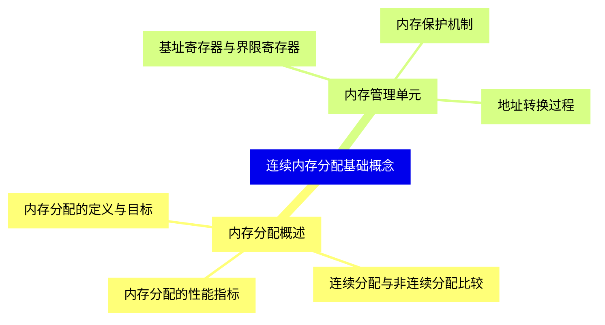
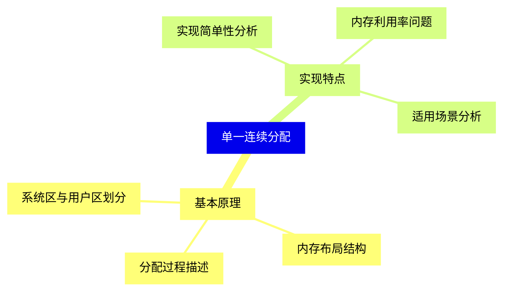
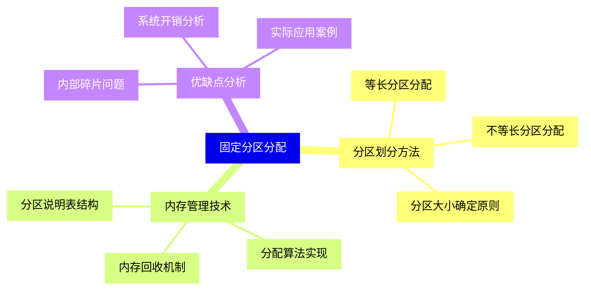
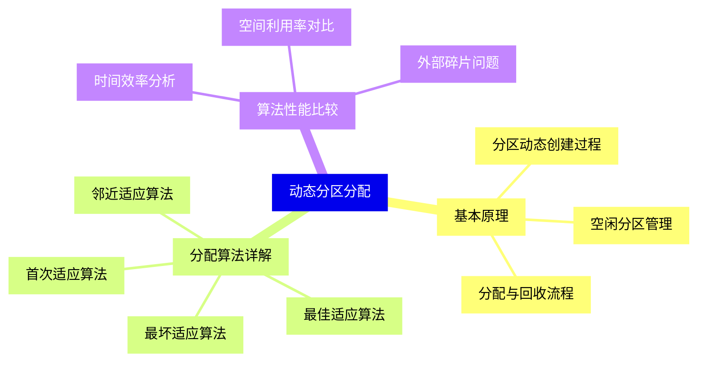
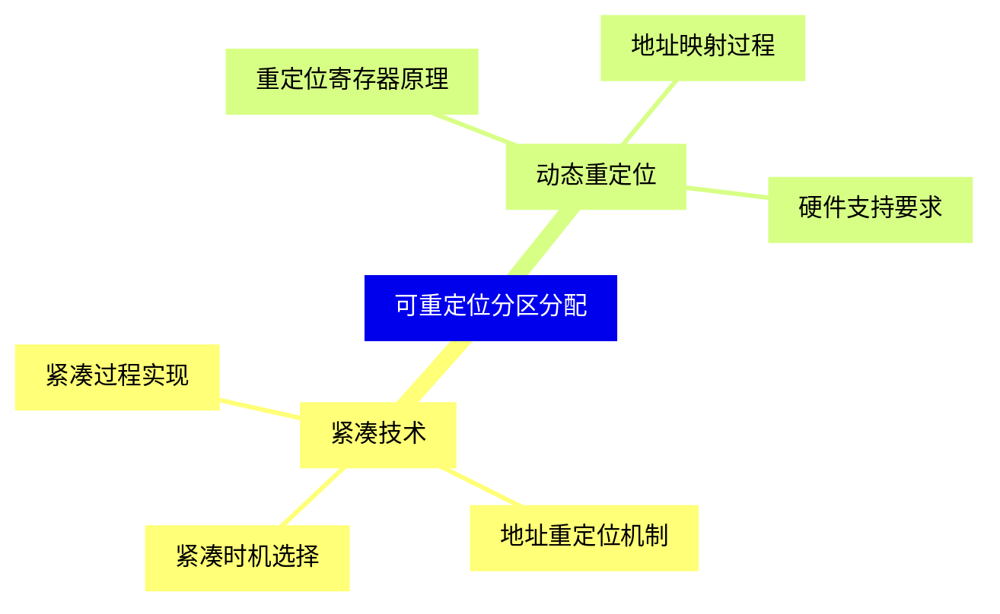
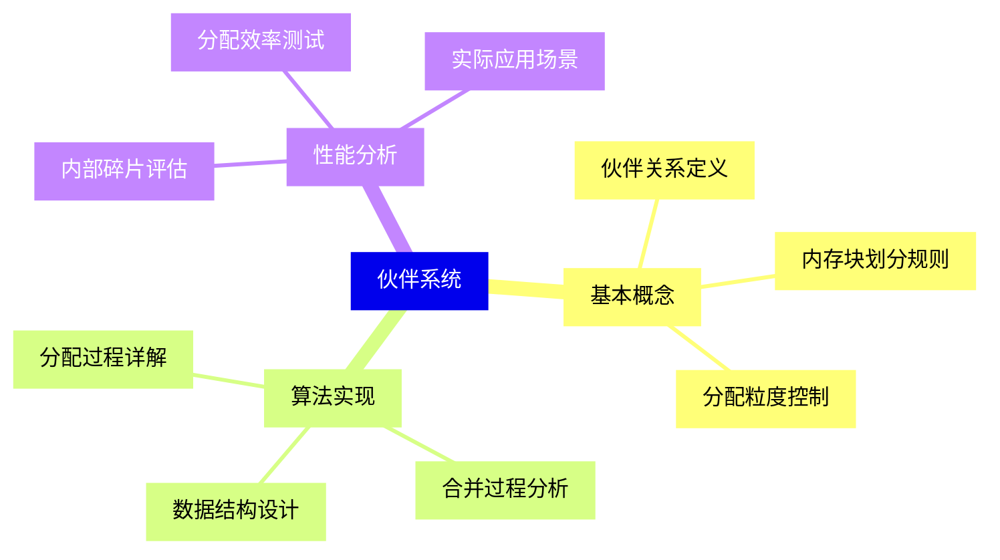
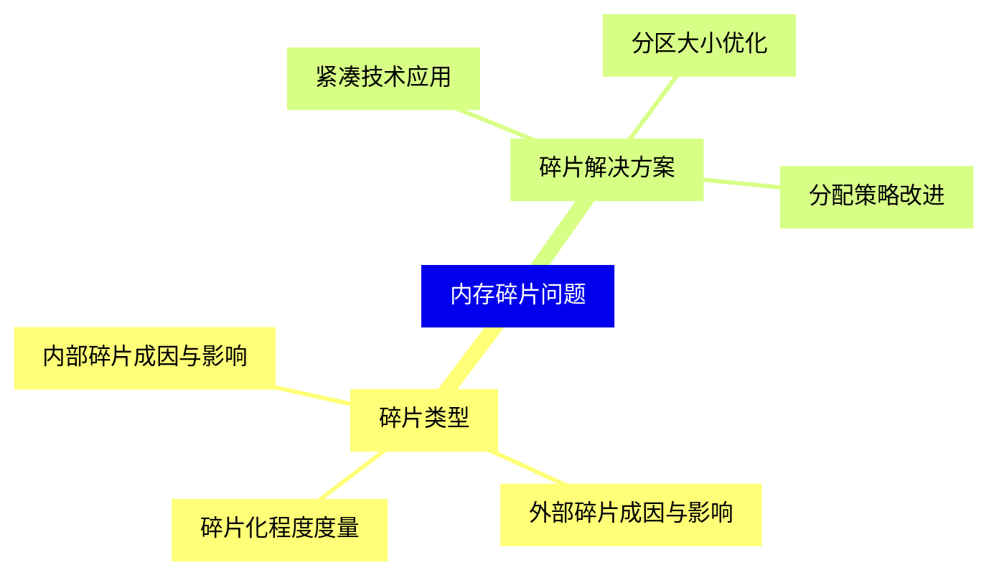
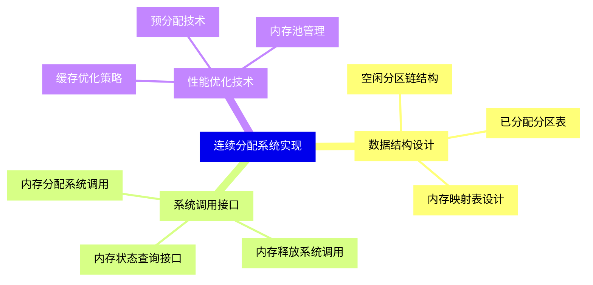
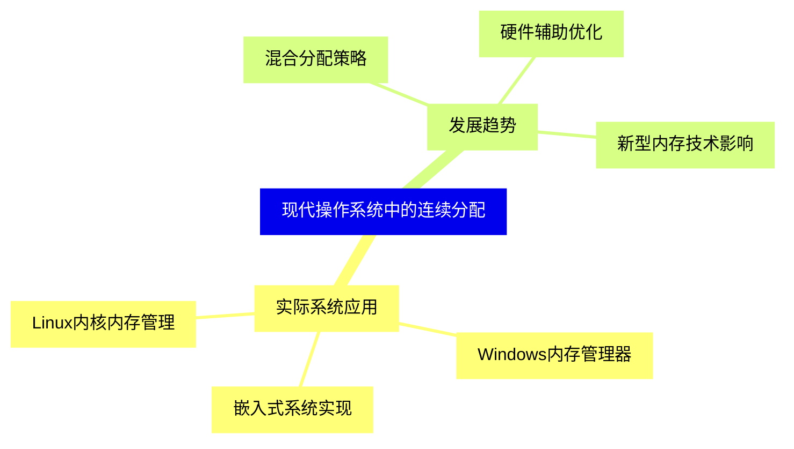


### 1 [连续内存分配基础概念](#1)
#### 1.1 [内存分配概述](#1)
##### 1.1.1 [内存分配的定义与目标](#1)
##### 1.1.2 [连续分配与非连续分配比较](#1)
##### 1.1.3 [内存分配的性能指标](#1)
#### 1.2 [内存管理单元](#1)
##### 1.2.1 [基址寄存器与界限寄存器](#1)
##### 1.2.2 [内存保护机制](#1)
##### 1.2.3 [地址转换过程](#1)
### 2 [单一连续分配](#2)
#### 2.1 [基本原理](#2)
##### 2.1.1 [系统区与用户区划分](#2)
##### 2.1.2 [内存布局结构](#2)
##### 2.1.3 [分配过程描述](#2)
#### 2.2 [实现特点](#2)
##### 2.2.1 [实现简单性分析](#2)
##### 2.2.2 [内存利用率问题](#2)
##### 2.2.3 [适用场景分析](#2)
### 3 [固定分区分配](#3)
#### 3.1 [分区划分方法](#3)
##### 3.1.1 [等长分区分配](#3)
##### 3.1.2 [不等长分区分配](#3)
##### 3.1.3 [分区大小确定原则](#3)
#### 3.2 [内存管理技术](#3)
##### 3.2.1 [分区说明表结构](#3)
##### 3.2.2 [分配算法实现](#3)
##### 3.2.3 [内存回收机制](#3)
#### 3.3 [优缺点分析](#3)
##### 3.3.1 [内部碎片问题](#3)
##### 3.3.2 [系统开销分析](#3)
##### 3.3.3 [实际应用案例](#3)
### 4 [动态分区分配](#4)
#### 4.1 [基本原理](#4)
##### 4.1.1 [分区动态创建过程](#4)
##### 4.1.2 [空闲分区管理](#4)
##### 4.1.3 [分配与回收流程](#4)
#### 4.2 [分配算法详解](#4)
##### 4.2.1 [首次适应算法](#4)
##### 4.2.2 [最佳适应算法](#4)
##### 4.2.3 [最坏适应算法](#4)
##### 4.2.4 [邻近适应算法](#4)
#### 4.3 [算法性能比较](#4)
##### 4.3.1 [时间效率分析](#4)
##### 4.3.2 [空间利用率对比](#4)
##### 4.3.3 [外部碎片问题](#4)
### 5 [可重定位分区分配](#5)
#### 5.1 [紧凑技术](#5)
##### 5.1.1 [紧凑过程实现](#5)
##### 5.1.2 [地址重定位机制](#5)
##### 5.1.3 [紧凑时机选择](#5)
#### 5.2 [动态重定位](#5)
##### 5.2.1 [重定位寄存器原理](#5)
##### 5.2.2 [地址映射过程](#5)
##### 5.2.3 [硬件支持要求](#5)
### 6 [伙伴系统](#6)
#### 6.1 [基本概念](#6)
##### 6.1.1 [伙伴关系定义](#6)
##### 6.1.2 [内存块划分规则](#6)
##### 6.1.3 [分配粒度控制](#6)
#### 6.2 [算法实现](#6)
##### 6.2.1 [分配过程详解](#6)
##### 6.2.2 [合并过程分析](#6)
##### 6.2.3 [数据结构设计](#6)
#### 6.3 [性能分析](#6)
##### 6.3.1 [内部碎片评估](#6)
##### 6.3.2 [分配效率测试](#6)
##### 6.3.3 [实际应用场景](#6)
### 7 [内存碎片问题](#7)
#### 7.1 [碎片类型](#7)
##### 7.1.1 [内部碎片成因与影响](#7)
##### 7.1.2 [外部碎片成因与影响](#7)
##### 7.1.3 [碎片化程度度量](#7)
#### 7.2 [碎片解决方案](#7)
##### 7.2.1 [紧凑技术应用](#7)
##### 7.2.2 [分区大小优化](#7)
##### 7.2.3 [分配策略改进](#7)
### 8 [连续分配系统实现](#8)
#### 8.1 [数据结构设计](#8)
##### 8.1.1 [空闲分区链结构](#8)
##### 8.1.2 [已分配分区表](#8)
##### 8.1.3 [内存映射表设计](#8)
#### 8.2 [系统调用接口](#8)
##### 8.2.1 [内存分配系统调用](#8)
##### 8.2.2 [内存释放系统调用](#8)
##### 8.2.3 [内存状态查询接口](#8)
#### 8.3 [性能优化技术](#8)
##### 8.3.1 [缓存优化策略](#8)
##### 8.3.2 [预分配技术](#8)
##### 8.3.3 [内存池管理](#8)
### 9 [现代操作系统中的连续分配](#9)
#### 9.1 [实际系统应用](#9)
##### 9.1.1 [Linux内核内存管理](#9)
##### 9.1.2 [Windows内存管理器](#9)
##### 9.1.3 [嵌入式系统实现](#9)
#### 9.2 [发展趋势](#9)
##### 9.2.1 [混合分配策略](#9)
##### 9.2.2 [硬件辅助优化](#9)
##### 9.2.3 [新型内存技术影响](#9)




### 1 连续内存分配基础概念

---
### 1 连续内存分配基础概念
___
#### 1.1 内存分配概述
___
##### 1.1.1 内存分配的定义与目标
___
##### 1.1.2 连续分配与非连续分配比较
___
##### 1.1.3 内存分配的性能指标
___
#### 1.2 内存管理单元
___
##### 1.2.1 基址寄存器与界限寄存器
___
##### 1.2.2 内存保护机制
___
##### 1.2.3 地址转换过程
### 2 单一连续分配

---
### 2 单一连续分配
___
#### 2.1 基本原理
___
##### 2.1.1 系统区与用户区划分
___
##### 2.1.2 内存布局结构
___
##### 2.1.3 分配过程描述
___
#### 2.2 实现特点
___
##### 2.2.1 实现简单性分析
___
##### 2.2.2 内存利用率问题
___
##### 2.2.3 适用场景分析
### 3 固定分区分配

---
### 3 固定分区分配
___
#### 3.1 分区划分方法
___
##### 3.1.1 等长分区分配
___
##### 3.1.2 不等长分区分配
___
##### 3.1.3 分区大小确定原则
___
#### 3.2 内存管理技术
___
##### 3.2.1 分区说明表结构
___
##### 3.2.2 分配算法实现
___
##### 3.2.3 内存回收机制
___
#### 3.3 优缺点分析
___
##### 3.3.1 内部碎片问题
___
##### 3.3.2 系统开销分析
___
##### 3.3.3 实际应用案例
### 4 动态分区分配

---
### 4 动态分区分配
___
#### 4.1 基本原理
___
##### 4.1.1 分区动态创建过程
___
##### 4.1.2 空闲分区管理
___
##### 4.1.3 分配与回收流程
___
#### 4.2 分配算法详解
___
##### 4.2.1 首次适应算法
___
##### 4.2.2 最佳适应算法
___
##### 4.2.3 最坏适应算法
___
##### 4.2.4 邻近适应算法
___
#### 4.3 算法性能比较
___
##### 4.3.1 时间效率分析
___
##### 4.3.2 空间利用率对比
___
##### 4.3.3 外部碎片问题
### 5 可重定位分区分配

---
### 5 可重定位分区分配
___
#### 5.1 紧凑技术
___
##### 5.1.1 紧凑过程实现
___
##### 5.1.2 地址重定位机制
___
##### 5.1.3 紧凑时机选择
___
#### 5.2 动态重定位
___
##### 5.2.1 重定位寄存器原理
___
##### 5.2.2 地址映射过程
___
##### 5.2.3 硬件支持要求
### 6 伙伴系统

---
### 6 伙伴系统
___
#### 6.1 基本概念
___
##### 6.1.1 伙伴关系定义
___
##### 6.1.2 内存块划分规则
___
##### 6.1.3 分配粒度控制
___
#### 6.2 算法实现
___
##### 6.2.1 分配过程详解
___
##### 6.2.2 合并过程分析
___
##### 6.2.3 数据结构设计
___
#### 6.3 性能分析
___
##### 6.3.1 内部碎片评估
___
##### 6.3.2 分配效率测试
___
##### 6.3.3 实际应用场景
### 7 内存碎片问题

---
### 7 内存碎片问题
___
#### 7.1 碎片类型
___
##### 7.1.1 内部碎片成因与影响
___
##### 7.1.2 外部碎片成因与影响
___
##### 7.1.3 碎片化程度度量
___
#### 7.2 碎片解决方案
___
##### 7.2.1 紧凑技术应用
___
##### 7.2.2 分区大小优化
___
##### 7.2.3 分配策略改进
### 8 连续分配系统实现

---
### 8 连续分配系统实现
___
#### 8.1 数据结构设计
___
##### 8.1.1 空闲分区链结构
___
##### 8.1.2 已分配分区表
___
##### 8.1.3 内存映射表设计
___
#### 8.2 系统调用接口
___
##### 8.2.1 内存分配系统调用
___
##### 8.2.2 内存释放系统调用
___
##### 8.2.3 内存状态查询接口
___
#### 8.3 性能优化技术
___
##### 8.3.1 缓存优化策略
___
##### 8.3.2 预分配技术
___
##### 8.3.3 内存池管理
### 9 现代操作系统中的连续分配

---
### 9 现代操作系统中的连续分配
___
#### 9.1 实际系统应用
___
##### 9.1.1 Linux内核内存管理
___
##### 9.1.2 Windows内存管理器
___
##### 9.1.3 嵌入式系统实现
___
#### 9.2 发展趋势
___
##### 9.2.1 混合分配策略
___
##### 9.2.2 硬件辅助优化
___
##### 9.2.3 新型内存技术影响


### 1 连续内存分配基础概念{#1}

{}

<--->
{}
{}
{}
{}
{}
{}
{}
{}
{}
{}
{}
{}
{}
{}
{}
{}
{}

### 2 单一连续分配{#2}

{}
{}
{}
{}
{}
{}
{}
{}
{}
{}
{}
{}
{}
{}
{}
{}
{}
<--->

{}

### 3 固定分区分配{#3}

{}

<--->
{}
{}
{}
{}
{}
{}
{}
{}
{}
{}
{}
{}
{}
{}
{}
{}
{}
{}
{}
{}
{}
{}
{}
{}
{}

### 4 动态分区分配{#4}

{}
{}
{}
{}
{}
{}
{}
{}
{}
{}
{}
{}
{}
{}
{}
{}
{}
{}
{}
{}
{}
{}
{}
{}
{}
{}
{}
<--->

{}

### 5 可重定位分区分配{#5}

{}

<--->
{}
{}
{}
{}
{}
{}
{}
{}
{}
{}
{}
{}
{}
{}
{}
{}
{}

### 6 伙伴系统{#6}

{}
{}
{}
{}
{}
{}
{}
{}
{}
{}
{}
{}
{}
{}
{}
{}
{}
{}
{}
{}
{}
{}
{}
{}
{}
<--->

{}

### 7 内存碎片问题{#7}

{}

<--->
{}
{}
{}
{}
{}
{}
{}
{}
{}
{}
{}
{}
{}
{}
{}
{}
{}

### 8 连续分配系统实现{#8}

{}
{}
{}
{}
{}
{}
{}
{}
{}
{}
{}
{}
{}
{}
{}
{}
{}
{}
{}
{}
{}
{}
{}
{}
{}
<--->

{}

### 9 现代操作系统中的连续分配{#9}

{}

<--->
{}
{}
{}
{}
{}
{}
{}
{}
{}
{}
{}
{}
{}
{}
{}
{}
{}
