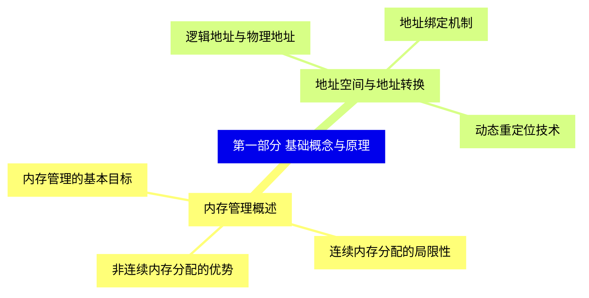
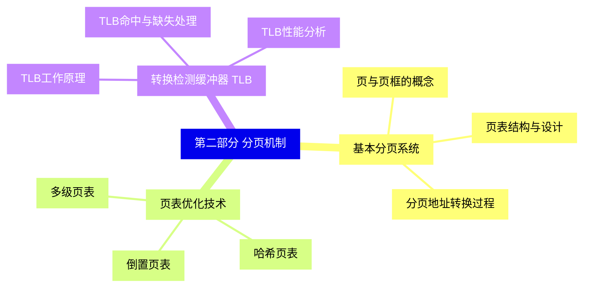
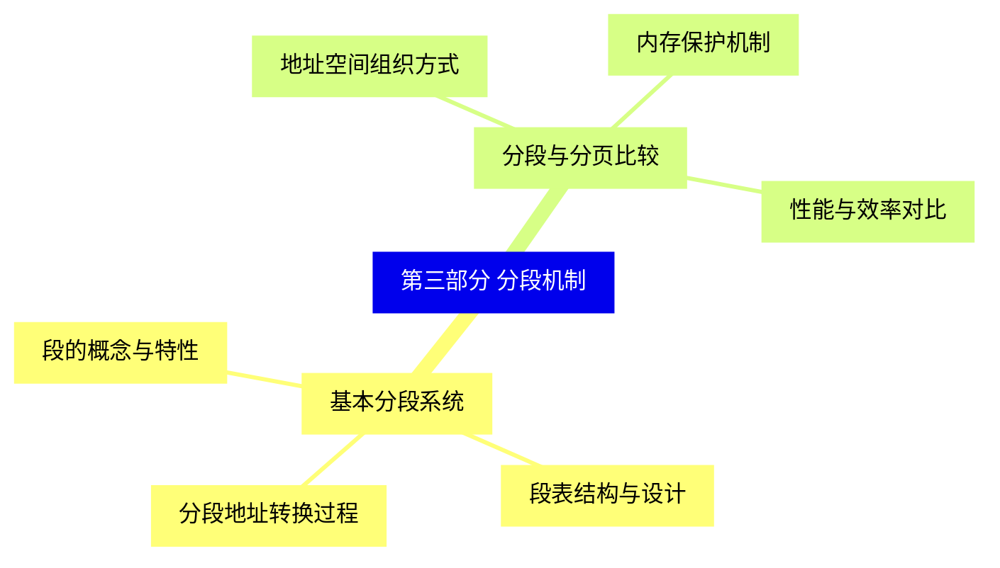
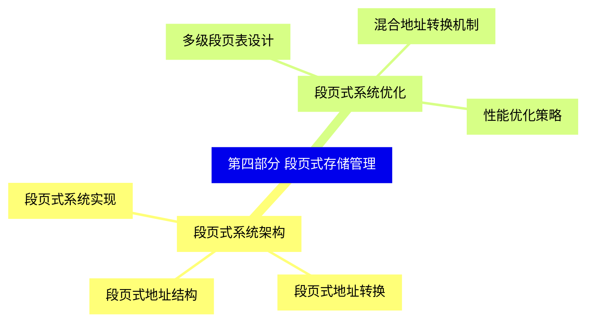
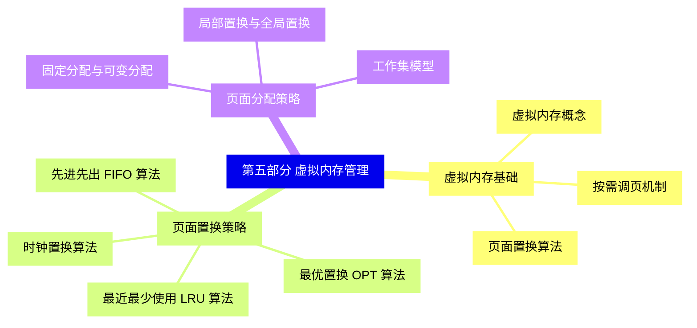
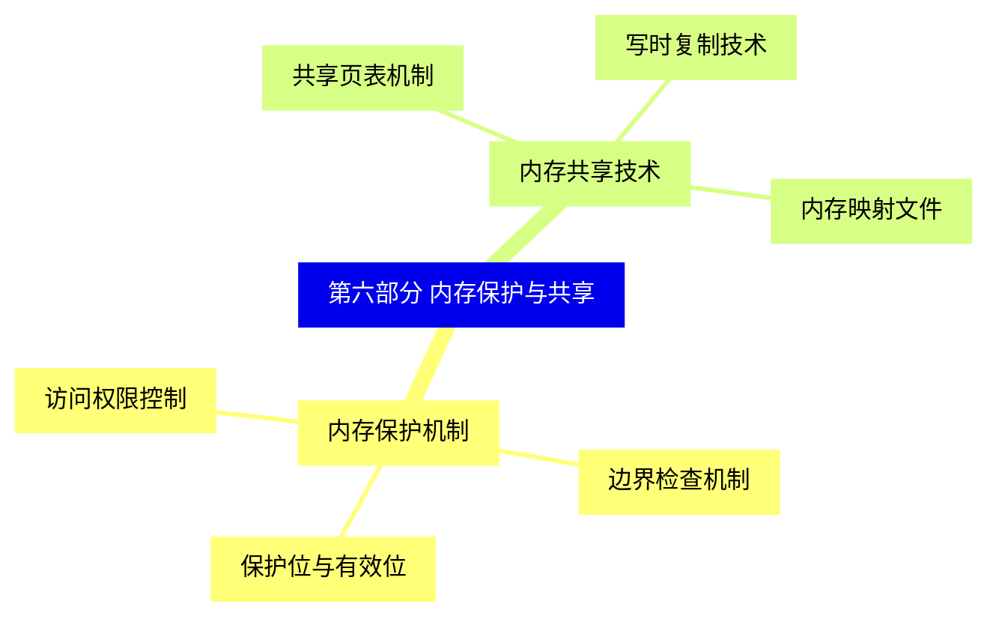
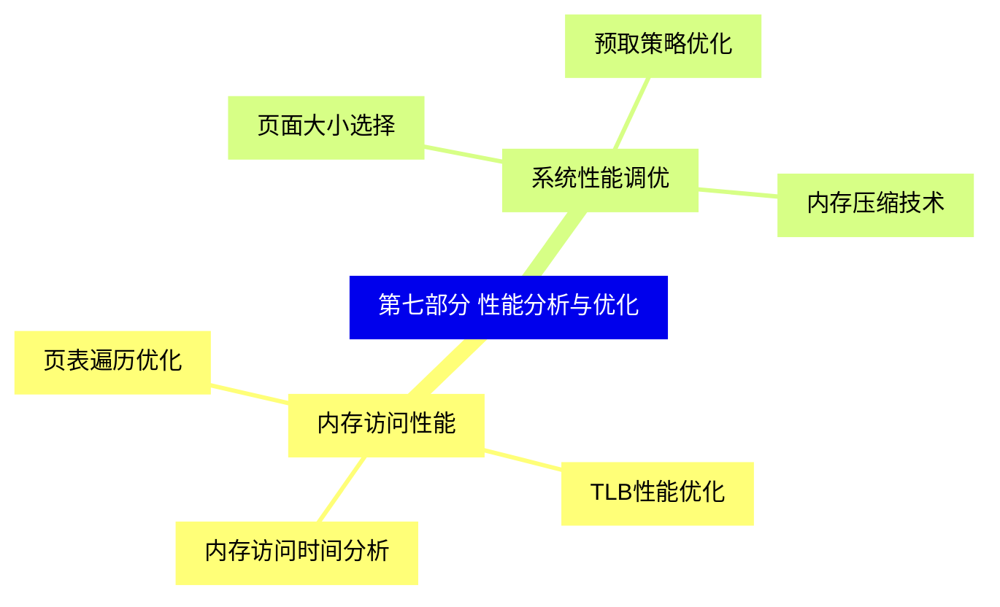
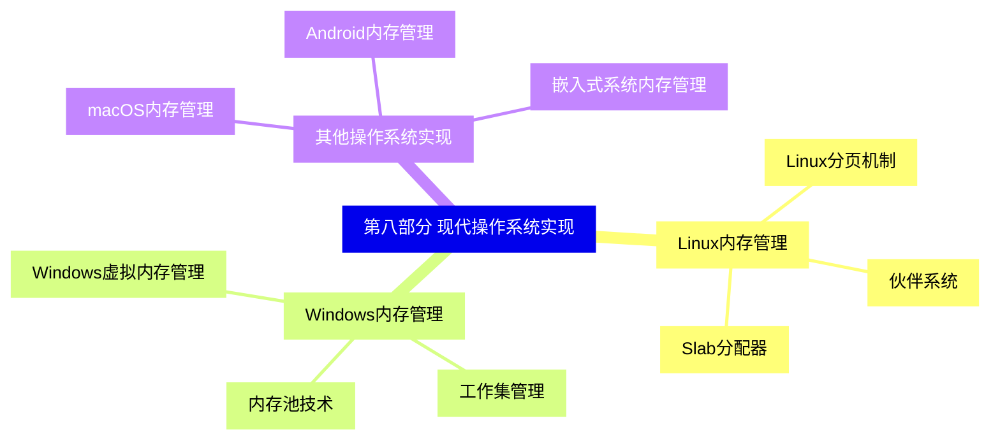
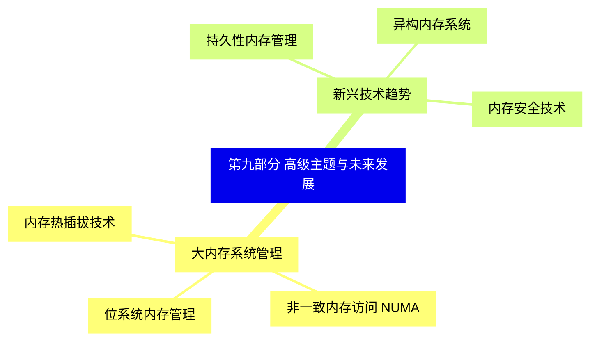


### 1 [第一部分 基础概念与原理](#1)
#### 1.1 [内存管理概述](#1)
##### 1.1.1 [内存管理的基本目标](#1)
##### 1.1.2 [连续内存分配的局限性](#1)
##### 1.1.3 [非连续内存分配的优势](#1)
#### 1.2 [地址空间与地址转换](#1)
##### 1.2.1 [逻辑地址与物理地址](#1)
##### 1.2.2 [地址绑定机制](#1)
##### 1.2.3 [动态重定位技术](#1)
### 2 [第二部分 分页机制](#2)
#### 2.1 [基本分页系统](#2)
##### 2.1.1 [页与页框的概念](#2)
##### 2.1.2 [页表结构与设计](#2)
##### 2.1.3 [分页地址转换过程](#2)
#### 2.2 [页表优化技术](#2)
##### 2.2.1 [多级页表](#2)
##### 2.2.2 [哈希页表](#2)
##### 2.2.3 [倒置页表](#2)
#### 2.3 [转换检测缓冲器 TLB](#2)
##### 2.3.1 [TLB工作原理](#2)
##### 2.3.2 [TLB命中与缺失处理](#2)
##### 2.3.3 [TLB性能分析](#2)
### 3 [第三部分 分段机制](#3)
#### 3.1 [基本分段系统](#3)
##### 3.1.1 [段的概念与特性](#3)
##### 3.1.2 [段表结构与设计](#3)
##### 3.1.3 [分段地址转换过程](#3)
#### 3.2 [分段与分页比较](#3)
##### 3.2.1 [地址空间组织方式](#3)
##### 3.2.2 [内存保护机制](#3)
##### 3.2.3 [性能与效率对比](#3)
### 4 [第四部分 段页式存储管理](#4)
#### 4.1 [段页式系统架构](#4)
##### 4.1.1 [段页式地址结构](#4)
##### 4.1.2 [段页式地址转换](#4)
##### 4.1.3 [段页式系统实现](#4)
#### 4.2 [段页式系统优化](#4)
##### 4.2.1 [多级段页表设计](#4)
##### 4.2.2 [混合地址转换机制](#4)
##### 4.2.3 [性能优化策略](#4)
### 5 [第五部分 虚拟内存管理](#5)
#### 5.1 [虚拟内存基础](#5)
##### 5.1.1 [虚拟内存概念](#5)
##### 5.1.2 [按需调页机制](#5)
##### 5.1.3 [页面置换算法](#5)
#### 5.2 [页面置换策略](#5)
##### 5.2.1 [先进先出 FIFO 算法](#5)
##### 5.2.2 [最优置换 OPT 算法](#5)
##### 5.2.3 [最近最少使用 LRU 算法](#5)
##### 5.2.4 [时钟置换算法](#5)
#### 5.3 [页面分配策略](#5)
##### 5.3.1 [固定分配与可变分配](#5)
##### 5.3.2 [局部置换与全局置换](#5)
##### 5.3.3 [工作集模型](#5)
### 6 [第六部分 内存保护与共享](#6)
#### 6.1 [内存保护机制](#6)
##### 6.1.1 [访问权限控制](#6)
##### 6.1.2 [边界检查机制](#6)
##### 6.1.3 [保护位与有效位](#6)
#### 6.2 [内存共享技术](#6)
##### 6.2.1 [共享页表机制](#6)
##### 6.2.2 [写时复制技术](#6)
##### 6.2.3 [内存映射文件](#6)
### 7 [第七部分 性能分析与优化](#7)
#### 7.1 [内存访问性能](#7)
##### 7.1.1 [内存访问时间分析](#7)
##### 7.1.2 [TLB性能优化](#7)
##### 7.1.3 [页表遍历优化](#7)
#### 7.2 [系统性能调优](#7)
##### 7.2.1 [页面大小选择](#7)
##### 7.2.2 [预取策略优化](#7)
##### 7.2.3 [内存压缩技术](#7)
### 8 [第八部分 现代操作系统实现](#8)
#### 8.1 [Linux内存管理](#8)
##### 8.1.1 [Linux分页机制](#8)
##### 8.1.2 [伙伴系统](#8)
##### 8.1.3 [Slab分配器](#8)
#### 8.2 [Windows内存管理](#8)
##### 8.2.1 [Windows虚拟内存管理](#8)
##### 8.2.2 [工作集管理](#8)
##### 8.2.3 [内存池技术](#8)
#### 8.3 [其他操作系统实现](#8)
##### 8.3.1 [macOS内存管理](#8)
##### 8.3.2 [Android内存管理](#8)
##### 8.3.3 [嵌入式系统内存管理](#8)
### 9 [第九部分 高级主题与未来发展](#9)
#### 9.1 [大内存系统管理](#9)
##### 9.1.1 [位系统内存管理](#9)
##### 9.1.2 [非一致内存访问 NUMA](#9)
##### 9.1.3 [内存热插拔技术](#9)
#### 9.2 [新兴技术趋势](#9)
##### 9.2.1 [持久性内存管理](#9)
##### 9.2.2 [异构内存系统](#9)
##### 9.2.3 [内存安全技术](#9)




### 1 第一部分 基础概念与原理

---
### 1 第一部分 基础概念与原理
___
#### 1.1 内存管理概述
___
##### 1.1.1 内存管理的基本目标
___
##### 1.1.2 连续内存分配的局限性
___
##### 1.1.3 非连续内存分配的优势
___
#### 1.2 地址空间与地址转换
___
##### 1.2.1 逻辑地址与物理地址
___
##### 1.2.2 地址绑定机制
___
##### 1.2.3 动态重定位技术
### 2 第二部分 分页机制

---
### 2 第二部分 分页机制
___
#### 2.1 基本分页系统
___
##### 2.1.1 页与页框的概念
___
##### 2.1.2 页表结构与设计
___
##### 2.1.3 分页地址转换过程
___
#### 2.2 页表优化技术
___
##### 2.2.1 多级页表
___
##### 2.2.2 哈希页表
___
##### 2.2.3 倒置页表
___
#### 2.3 转换检测缓冲器 TLB
___
##### 2.3.1 TLB工作原理
___
##### 2.3.2 TLB命中与缺失处理
___
##### 2.3.3 TLB性能分析
### 3 第三部分 分段机制

---
### 3 第三部分 分段机制
___
#### 3.1 基本分段系统
___
##### 3.1.1 段的概念与特性
___
##### 3.1.2 段表结构与设计
___
##### 3.1.3 分段地址转换过程
___
#### 3.2 分段与分页比较
___
##### 3.2.1 地址空间组织方式
___
##### 3.2.2 内存保护机制
___
##### 3.2.3 性能与效率对比
### 4 第四部分 段页式存储管理

---
### 4 第四部分 段页式存储管理
___
#### 4.1 段页式系统架构
___
##### 4.1.1 段页式地址结构
___
##### 4.1.2 段页式地址转换
___
##### 4.1.3 段页式系统实现
___
#### 4.2 段页式系统优化
___
##### 4.2.1 多级段页表设计
___
##### 4.2.2 混合地址转换机制
___
##### 4.2.3 性能优化策略
### 5 第五部分 虚拟内存管理

---
### 5 第五部分 虚拟内存管理
___
#### 5.1 虚拟内存基础
___
##### 5.1.1 虚拟内存概念
___
##### 5.1.2 按需调页机制
___
##### 5.1.3 页面置换算法
___
#### 5.2 页面置换策略
___
##### 5.2.1 先进先出 FIFO 算法
___
##### 5.2.2 最优置换 OPT 算法
___
##### 5.2.3 最近最少使用 LRU 算法
___
##### 5.2.4 时钟置换算法
___
#### 5.3 页面分配策略
___
##### 5.3.1 固定分配与可变分配
___
##### 5.3.2 局部置换与全局置换
___
##### 5.3.3 工作集模型
### 6 第六部分 内存保护与共享

---
### 6 第六部分 内存保护与共享
___
#### 6.1 内存保护机制
___
##### 6.1.1 访问权限控制
___
##### 6.1.2 边界检查机制
___
##### 6.1.3 保护位与有效位
___
#### 6.2 内存共享技术
___
##### 6.2.1 共享页表机制
___
##### 6.2.2 写时复制技术
___
##### 6.2.3 内存映射文件
### 7 第七部分 性能分析与优化

---
### 7 第七部分 性能分析与优化
___
#### 7.1 内存访问性能
___
##### 7.1.1 内存访问时间分析
___
##### 7.1.2 TLB性能优化
___
##### 7.1.3 页表遍历优化
___
#### 7.2 系统性能调优
___
##### 7.2.1 页面大小选择
___
##### 7.2.2 预取策略优化
___
##### 7.2.3 内存压缩技术
### 8 第八部分 现代操作系统实现

---
### 8 第八部分 现代操作系统实现
___
#### 8.1 Linux内存管理
___
##### 8.1.1 Linux分页机制
___
##### 8.1.2 伙伴系统
___
##### 8.1.3 Slab分配器
___
#### 8.2 Windows内存管理
___
##### 8.2.1 Windows虚拟内存管理
___
##### 8.2.2 工作集管理
___
##### 8.2.3 内存池技术
___
#### 8.3 其他操作系统实现
___
##### 8.3.1 macOS内存管理
___
##### 8.3.2 Android内存管理
___
##### 8.3.3 嵌入式系统内存管理
### 9 第九部分 高级主题与未来发展

---
### 9 第九部分 高级主题与未来发展
___
#### 9.1 大内存系统管理
___
##### 9.1.1 位系统内存管理
___
##### 9.1.2 非一致内存访问 NUMA
___
##### 9.1.3 内存热插拔技术
___
#### 9.2 新兴技术趋势
___
##### 9.2.1 持久性内存管理
___
##### 9.2.2 异构内存系统
___
##### 9.2.3 内存安全技术


### 1 第一部分 基础概念与原理{#1}

{}

<--->
{}
{}
{}
{}
{}
{}
{}
{}
{}
{}
{}
{}
{}
{}
{}
{}
{}

### 2 第二部分 分页机制{#2}

{}
{}
{}
{}
{}
{}
{}
{}
{}
{}
{}
{}
{}
{}
{}
{}
{}
{}
{}
{}
{}
{}
{}
{}
{}
<--->

{}

### 3 第三部分 分段机制{#3}

{}

<--->
{}
{}
{}
{}
{}
{}
{}
{}
{}
{}
{}
{}
{}
{}
{}
{}
{}

### 4 第四部分 段页式存储管理{#4}

{}
{}
{}
{}
{}
{}
{}
{}
{}
{}
{}
{}
{}
{}
{}
{}
{}
<--->

{}

### 5 第五部分 虚拟内存管理{#5}

{}

<--->
{}
{}
{}
{}
{}
{}
{}
{}
{}
{}
{}
{}
{}
{}
{}
{}
{}
{}
{}
{}
{}
{}
{}
{}
{}
{}
{}

### 6 第六部分 内存保护与共享{#6}

{}
{}
{}
{}
{}
{}
{}
{}
{}
{}
{}
{}
{}
{}
{}
{}
{}
<--->

{}

### 7 第七部分 性能分析与优化{#7}

{}

<--->
{}
{}
{}
{}
{}
{}
{}
{}
{}
{}
{}
{}
{}
{}
{}
{}
{}

### 8 第八部分 现代操作系统实现{#8}

{}
{}
{}
{}
{}
{}
{}
{}
{}
{}
{}
{}
{}
{}
{}
{}
{}
{}
{}
{}
{}
{}
{}
{}
{}
<--->

{}

### 9 第九部分 高级主题与未来发展{#9}

{}

<--->
{}
{}
{}
{}
{}
{}
{}
{}
{}
{}
{}
{}
{}
{}
{}
{}
{}
