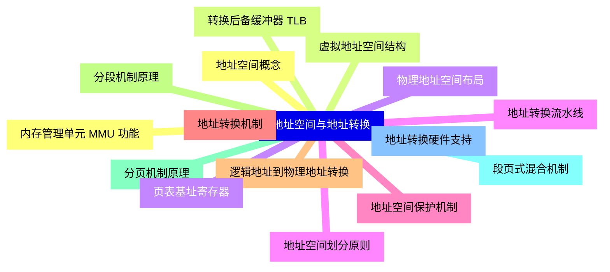
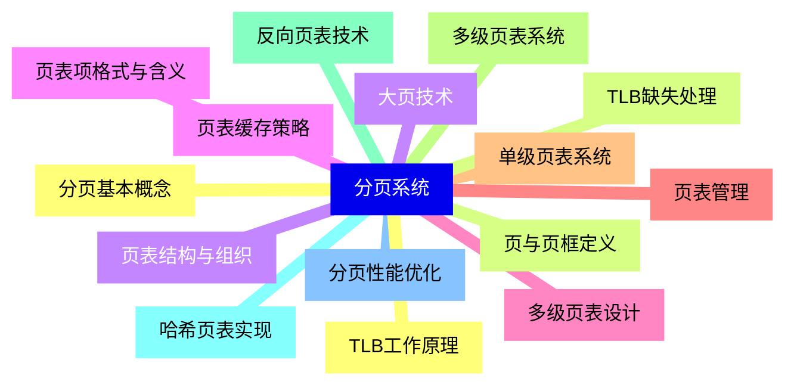
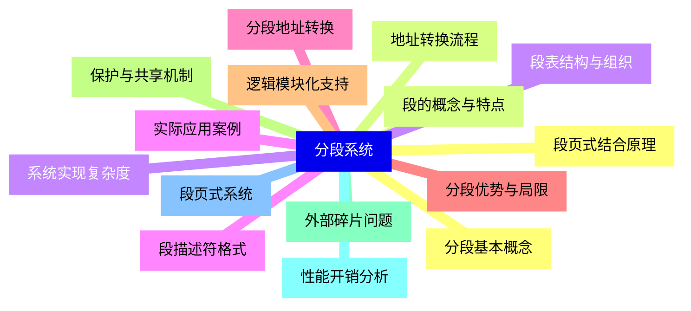
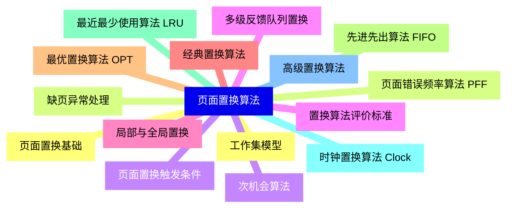
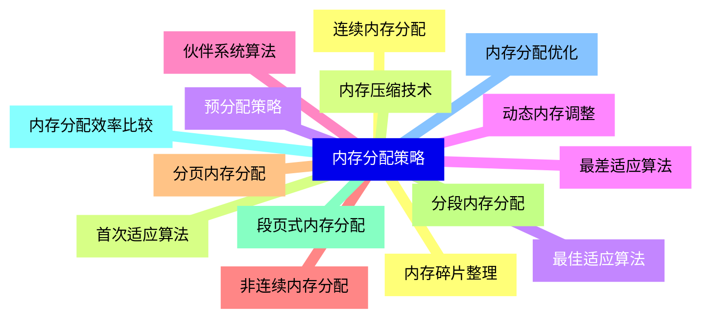
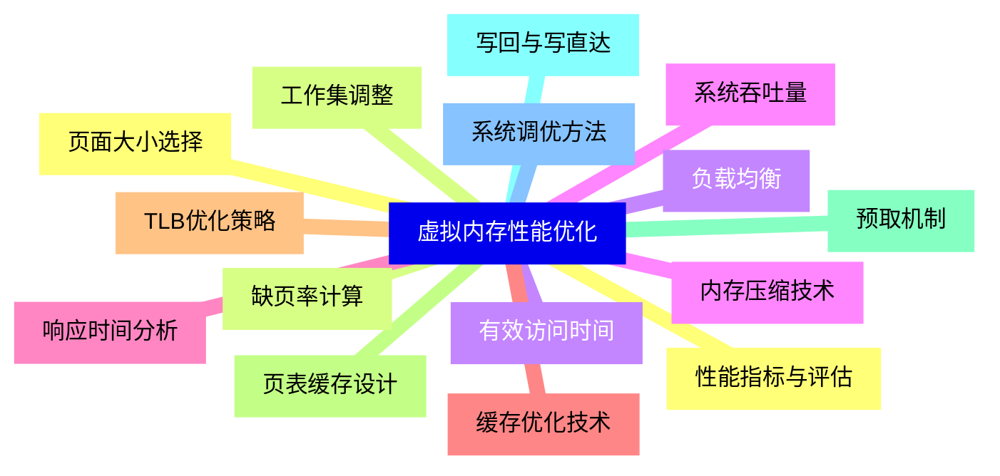
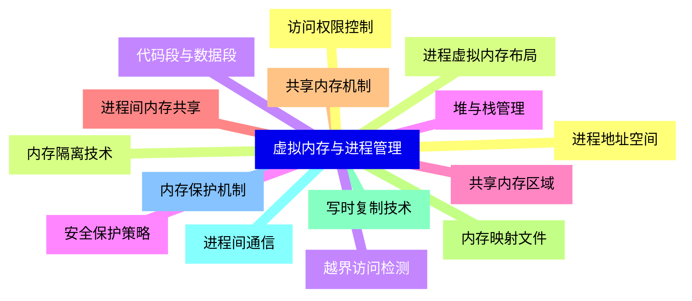
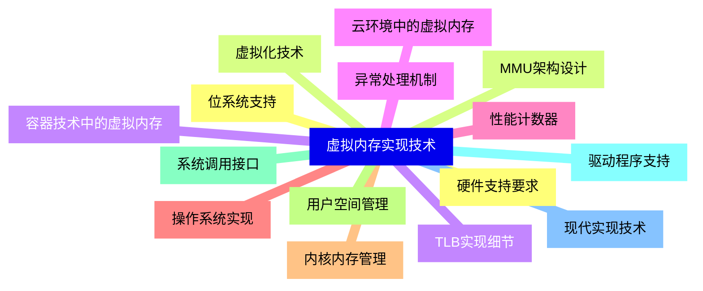
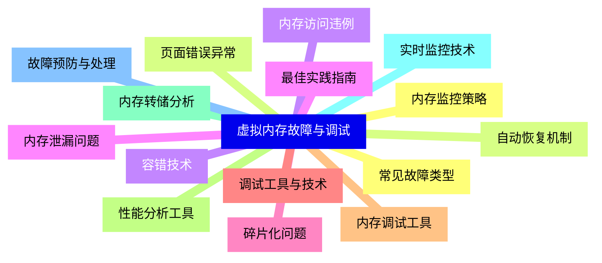
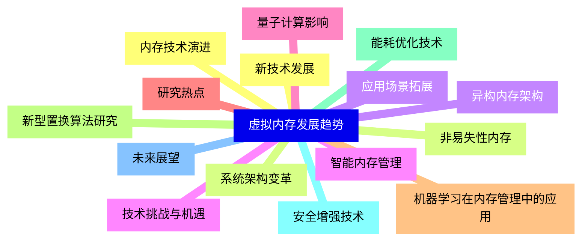


### 1 [虚拟内存基础概念](#1)
#### 1.1 [虚拟内存定义与原理](#1)
#### 1.2 [虚拟内存的基本概念](#1)
#### 1.3 [虚拟内存与物理内存的关系](#1)
#### 1.4 [虚拟内存的发展历史](#1)
#### 1.5 [虚拟内存的主要目标](#1)
#### 1.6 [虚拟内存的优势与意义](#1)
#### 1.7 [内存扩展功能](#1)
#### 1.8 [进程隔离与保护](#1)
#### 1.9 [简化编程模型](#1)
#### 1.10 [内存共享机制](#1)
#### 1.11 [虚拟内存系统组成](#1)
#### 1.12 [虚拟地址空间](#1)
#### 1.13 [物理地址空间](#1)
#### 1.14 [地址转换机制](#1)
#### 1.15 [内存管理单元 MMU](#1)
### 2 [地址空间与地址转换](#2)
#### 2.1 [地址空间概念](#2)
#### 2.2 [虚拟地址空间结构](#2)
#### 2.3 [物理地址空间布局](#2)
#### 2.4 [地址空间划分原则](#2)
#### 2.5 [地址空间保护机制](#2)
#### 2.6 [地址转换机制](#2)
#### 2.7 [逻辑地址到物理地址转换](#2)
#### 2.8 [分段机制原理](#2)
#### 2.9 [分页机制原理](#2)
#### 2.10 [段页式混合机制](#2)
#### 2.11 [地址转换硬件支持](#2)
#### 2.12 [内存管理单元 MMU 功能](#2)
#### 2.13 [转换后备缓冲器 TLB](#2)
#### 2.14 [页表基址寄存器](#2)
#### 2.15 [地址转换流水线](#2)
### 3 [分页系统](#3)
#### 3.1 [分页基本概念](#3)
#### 3.2 [页与页框定义](#3)
#### 3.3 [页表结构与组织](#3)
#### 3.4 [页表项格式与含义](#3)
#### 3.5 [多级页表设计](#3)
#### 3.6 [页表管理](#3)
#### 3.7 [单级页表系统](#3)
#### 3.8 [多级页表系统](#3)
#### 3.9 [反向页表技术](#3)
#### 3.10 [哈希页表实现](#3)
#### 3.11 [分页性能优化](#3)
#### 3.12 [TLB工作原理](#3)
#### 3.13 [TLB缺失处理](#3)
#### 3.14 [大页技术](#3)
#### 3.15 [页表缓存策略](#3)
### 4 [分段系统](#4)
#### 4.1 [分段基本概念](#4)
#### 4.2 [段的概念与特点](#4)
#### 4.3 [段表结构与组织](#4)
#### 4.4 [段描述符格式](#4)
#### 4.5 [分段地址转换](#4)
#### 4.6 [分段优势与局限](#4)
#### 4.7 [逻辑模块化支持](#4)
#### 4.8 [保护与共享机制](#4)
#### 4.9 [外部碎片问题](#4)
#### 4.10 [性能开销分析](#4)
#### 4.11 [段页式系统](#4)
#### 4.12 [段页式结合原理](#4)
#### 4.13 [地址转换流程](#4)
#### 4.14 [系统实现复杂度](#4)
#### 4.15 [实际应用案例](#4)
### 5 [页面置换算法](#5)
#### 5.1 [页面置换基础](#5)
#### 5.2 [缺页异常处理](#5)
#### 5.3 [页面置换触发条件](#5)
#### 5.4 [置换算法评价标准](#5)
#### 5.5 [局部与全局置换](#5)
#### 5.6 [经典置换算法](#5)
#### 5.7 [最优置换算法 OPT](#5)
#### 5.8 [先进先出算法 FIFO](#5)
#### 5.9 [最近最少使用算法 LRU](#5)
#### 5.10 [时钟置换算法 Clock](#5)
#### 5.11 [高级置换算法](#5)
#### 5.12 [工作集模型](#5)
#### 5.13 [页面错误频率算法 PFF](#5)
#### 5.14 [次机会算法](#5)
#### 5.15 [多级反馈队列置换](#5)
### 6 [内存分配策略](#6)
#### 6.1 [连续内存分配](#6)
#### 6.2 [首次适应算法](#6)
#### 6.3 [最佳适应算法](#6)
#### 6.4 [最差适应算法](#6)
#### 6.5 [伙伴系统算法](#6)
#### 6.6 [非连续内存分配](#6)
#### 6.7 [分页内存分配](#6)
#### 6.8 [分段内存分配](#6)
#### 6.9 [段页式内存分配](#6)
#### 6.10 [内存分配效率比较](#6)
#### 6.11 [内存分配优化](#6)
#### 6.12 [内存碎片整理](#6)
#### 6.13 [内存压缩技术](#6)
#### 6.14 [预分配策略](#6)
#### 6.15 [动态内存调整](#6)
### 7 [虚拟内存性能优化](#7)
#### 7.1 [性能指标与评估](#7)
#### 7.2 [缺页率计算](#7)
#### 7.3 [有效访问时间](#7)
#### 7.4 [系统吞吐量](#7)
#### 7.5 [响应时间分析](#7)
#### 7.6 [缓存优化技术](#7)
#### 7.7 [TLB优化策略](#7)
#### 7.8 [页表缓存设计](#7)
#### 7.9 [预取机制](#7)
#### 7.10 [写回与写直达](#7)
#### 7.11 [系统调优方法](#7)
#### 7.12 [页面大小选择](#7)
#### 7.13 [工作集调整](#7)
#### 7.14 [负载均衡](#7)
#### 7.15 [内存压缩技术](#7)
### 8 [虚拟内存与进程管理](#8)
#### 8.1 [进程地址空间](#8)
#### 8.2 [进程虚拟内存布局](#8)
#### 8.3 [代码段与数据段](#8)
#### 8.4 [堆与栈管理](#8)
#### 8.5 [共享内存区域](#8)
#### 8.6 [进程间内存共享](#8)
#### 8.7 [共享内存机制](#8)
#### 8.8 [内存映射文件](#8)
#### 8.9 [写时复制技术](#8)
#### 8.10 [进程间通信](#8)
#### 8.11 [内存保护机制](#8)
#### 8.12 [访问权限控制](#8)
#### 8.13 [内存隔离技术](#8)
#### 8.14 [越界访问检测](#8)
#### 8.15 [安全保护策略](#8)
### 9 [虚拟内存实现技术](#9)
#### 9.1 [硬件支持要求](#9)
#### 9.2 [MMU架构设计](#9)
#### 9.3 [TLB实现细节](#9)
#### 9.4 [异常处理机制](#9)
#### 9.5 [性能计数器](#9)
#### 9.6 [操作系统实现](#9)
#### 9.7 [内核内存管理](#9)
#### 9.8 [用户空间管理](#9)
#### 9.9 [系统调用接口](#9)
#### 9.10 [驱动程序支持](#9)
#### 9.11 [现代实现技术](#9)
#### 9.12 [位系统支持](#9)
#### 9.13 [虚拟化技术](#9)
#### 9.14 [容器技术中的虚拟内存](#9)
#### 9.15 [云环境中的虚拟内存](#9)
### 10 [虚拟内存故障与调试](#10)
#### 10.1 [常见故障类型](#10)
#### 10.2 [页面错误异常](#10)
#### 10.3 [内存访问违例](#10)
#### 10.4 [内存泄漏问题](#10)
#### 10.5 [碎片化问题](#10)
#### 10.6 [调试工具与技术](#10)
#### 10.7 [内存调试工具](#10)
#### 10.8 [性能分析工具](#10)
#### 10.9 [内存转储分析](#10)
#### 10.10 [实时监控技术](#10)
#### 10.11 [故障预防与处理](#10)
#### 10.12 [内存监控策略](#10)
#### 10.13 [自动恢复机制](#10)
#### 10.14 [容错技术](#10)
#### 10.15 [最佳实践指南](#10)
### 11 [虚拟内存发展趋势](#11)
#### 11.1 [新技术发展](#11)
#### 11.2 [非易失性内存](#11)
#### 11.3 [异构内存架构](#11)
#### 11.4 [智能内存管理](#11)
#### 11.5 [量子计算影响](#11)
#### 11.6 [研究热点](#11)
#### 11.7 [机器学习在内存管理中的应用](#11)
#### 11.8 [新型置换算法研究](#11)
#### 11.9 [能耗优化技术](#11)
#### 11.10 [安全增强技术](#11)
#### 11.11 [未来展望](#11)
#### 11.12 [内存技术演进](#11)
#### 11.13 [系统架构变革](#11)
#### 11.14 [应用场景拓展](#11)
#### 11.15 [技术挑战与机遇](#11)




### 1 虚拟内存基础概念

---
### 1 虚拟内存基础概念
___
#### 1.1 虚拟内存定义与原理
___
#### 1.2 虚拟内存的基本概念
___
#### 1.3 虚拟内存与物理内存的关系
___
#### 1.4 虚拟内存的发展历史
___
#### 1.5 虚拟内存的主要目标
___
#### 1.6 虚拟内存的优势与意义
___
#### 1.7 内存扩展功能
___
#### 1.8 进程隔离与保护
___
#### 1.9 简化编程模型
___
#### 1.10 内存共享机制
___
#### 1.11 虚拟内存系统组成
___
#### 1.12 虚拟地址空间
___
#### 1.13 物理地址空间
___
#### 1.14 地址转换机制
___
#### 1.15 内存管理单元 MMU
### 2 地址空间与地址转换

---
### 2 地址空间与地址转换
___
#### 2.1 地址空间概念
___
#### 2.2 虚拟地址空间结构
___
#### 2.3 物理地址空间布局
___
#### 2.4 地址空间划分原则
___
#### 2.5 地址空间保护机制
___
#### 2.6 地址转换机制
___
#### 2.7 逻辑地址到物理地址转换
___
#### 2.8 分段机制原理
___
#### 2.9 分页机制原理
___
#### 2.10 段页式混合机制
___
#### 2.11 地址转换硬件支持
___
#### 2.12 内存管理单元 MMU 功能
___
#### 2.13 转换后备缓冲器 TLB
___
#### 2.14 页表基址寄存器
___
#### 2.15 地址转换流水线
### 3 分页系统

---
### 3 分页系统
___
#### 3.1 分页基本概念
___
#### 3.2 页与页框定义
___
#### 3.3 页表结构与组织
___
#### 3.4 页表项格式与含义
___
#### 3.5 多级页表设计
___
#### 3.6 页表管理
___
#### 3.7 单级页表系统
___
#### 3.8 多级页表系统
___
#### 3.9 反向页表技术
___
#### 3.10 哈希页表实现
___
#### 3.11 分页性能优化
___
#### 3.12 TLB工作原理
___
#### 3.13 TLB缺失处理
___
#### 3.14 大页技术
___
#### 3.15 页表缓存策略
### 4 分段系统

---
### 4 分段系统
___
#### 4.1 分段基本概念
___
#### 4.2 段的概念与特点
___
#### 4.3 段表结构与组织
___
#### 4.4 段描述符格式
___
#### 4.5 分段地址转换
___
#### 4.6 分段优势与局限
___
#### 4.7 逻辑模块化支持
___
#### 4.8 保护与共享机制
___
#### 4.9 外部碎片问题
___
#### 4.10 性能开销分析
___
#### 4.11 段页式系统
___
#### 4.12 段页式结合原理
___
#### 4.13 地址转换流程
___
#### 4.14 系统实现复杂度
___
#### 4.15 实际应用案例
### 5 页面置换算法

---
### 5 页面置换算法
___
#### 5.1 页面置换基础
___
#### 5.2 缺页异常处理
___
#### 5.3 页面置换触发条件
___
#### 5.4 置换算法评价标准
___
#### 5.5 局部与全局置换
___
#### 5.6 经典置换算法
___
#### 5.7 最优置换算法 OPT
___
#### 5.8 先进先出算法 FIFO
___
#### 5.9 最近最少使用算法 LRU
___
#### 5.10 时钟置换算法 Clock
___
#### 5.11 高级置换算法
___
#### 5.12 工作集模型
___
#### 5.13 页面错误频率算法 PFF
___
#### 5.14 次机会算法
___
#### 5.15 多级反馈队列置换
### 6 内存分配策略

---
### 6 内存分配策略
___
#### 6.1 连续内存分配
___
#### 6.2 首次适应算法
___
#### 6.3 最佳适应算法
___
#### 6.4 最差适应算法
___
#### 6.5 伙伴系统算法
___
#### 6.6 非连续内存分配
___
#### 6.7 分页内存分配
___
#### 6.8 分段内存分配
___
#### 6.9 段页式内存分配
___
#### 6.10 内存分配效率比较
___
#### 6.11 内存分配优化
___
#### 6.12 内存碎片整理
___
#### 6.13 内存压缩技术
___
#### 6.14 预分配策略
___
#### 6.15 动态内存调整
### 7 虚拟内存性能优化

---
### 7 虚拟内存性能优化
___
#### 7.1 性能指标与评估
___
#### 7.2 缺页率计算
___
#### 7.3 有效访问时间
___
#### 7.4 系统吞吐量
___
#### 7.5 响应时间分析
___
#### 7.6 缓存优化技术
___
#### 7.7 TLB优化策略
___
#### 7.8 页表缓存设计
___
#### 7.9 预取机制
___
#### 7.10 写回与写直达
___
#### 7.11 系统调优方法
___
#### 7.12 页面大小选择
___
#### 7.13 工作集调整
___
#### 7.14 负载均衡
___
#### 7.15 内存压缩技术
### 8 虚拟内存与进程管理

---
### 8 虚拟内存与进程管理
___
#### 8.1 进程地址空间
___
#### 8.2 进程虚拟内存布局
___
#### 8.3 代码段与数据段
___
#### 8.4 堆与栈管理
___
#### 8.5 共享内存区域
___
#### 8.6 进程间内存共享
___
#### 8.7 共享内存机制
___
#### 8.8 内存映射文件
___
#### 8.9 写时复制技术
___
#### 8.10 进程间通信
___
#### 8.11 内存保护机制
___
#### 8.12 访问权限控制
___
#### 8.13 内存隔离技术
___
#### 8.14 越界访问检测
___
#### 8.15 安全保护策略
### 9 虚拟内存实现技术

---
### 9 虚拟内存实现技术
___
#### 9.1 硬件支持要求
___
#### 9.2 MMU架构设计
___
#### 9.3 TLB实现细节
___
#### 9.4 异常处理机制
___
#### 9.5 性能计数器
___
#### 9.6 操作系统实现
___
#### 9.7 内核内存管理
___
#### 9.8 用户空间管理
___
#### 9.9 系统调用接口
___
#### 9.10 驱动程序支持
___
#### 9.11 现代实现技术
___
#### 9.12 位系统支持
___
#### 9.13 虚拟化技术
___
#### 9.14 容器技术中的虚拟内存
___
#### 9.15 云环境中的虚拟内存
### 10 虚拟内存故障与调试

---
### 10 虚拟内存故障与调试
___
#### 10.1 常见故障类型
___
#### 10.2 页面错误异常
___
#### 10.3 内存访问违例
___
#### 10.4 内存泄漏问题
___
#### 10.5 碎片化问题
___
#### 10.6 调试工具与技术
___
#### 10.7 内存调试工具
___
#### 10.8 性能分析工具
___
#### 10.9 内存转储分析
___
#### 10.10 实时监控技术
___
#### 10.11 故障预防与处理
___
#### 10.12 内存监控策略
___
#### 10.13 自动恢复机制
___
#### 10.14 容错技术
___
#### 10.15 最佳实践指南
### 11 虚拟内存发展趋势

---
### 11 虚拟内存发展趋势
___
#### 11.1 新技术发展
___
#### 11.2 非易失性内存
___
#### 11.3 异构内存架构
___
#### 11.4 智能内存管理
___
#### 11.5 量子计算影响
___
#### 11.6 研究热点
___
#### 11.7 机器学习在内存管理中的应用
___
#### 11.8 新型置换算法研究
___
#### 11.9 能耗优化技术
___
#### 11.10 安全增强技术
___
#### 11.11 未来展望
___
#### 11.12 内存技术演进
___
#### 11.13 系统架构变革
___
#### 11.14 应用场景拓展
___
#### 11.15 技术挑战与机遇


### 1 虚拟内存基础概念{#1}

{}

<--->
{}
{}
{}
{}
{}
{}
{}
{}
{}
{}
{}
{}
{}
{}
{}
{}
{}
{}
{}
{}
{}
{}
{}
{}
{}
{}
{}
{}
{}
{}
{}

### 2 地址空间与地址转换{#2}

{}
{}
{}
{}
{}
{}
{}
{}
{}
{}
{}
{}
{}
{}
{}
{}
{}
{}
{}
{}
{}
{}
{}
{}
{}
{}
{}
{}
{}
{}
{}
<--->

{}

### 3 分页系统{#3}

{}

<--->
{}
{}
{}
{}
{}
{}
{}
{}
{}
{}
{}
{}
{}
{}
{}
{}
{}
{}
{}
{}
{}
{}
{}
{}
{}
{}
{}
{}
{}
{}
{}

### 4 分段系统{#4}

{}
{}
{}
{}
{}
{}
{}
{}
{}
{}
{}
{}
{}
{}
{}
{}
{}
{}
{}
{}
{}
{}
{}
{}
{}
{}
{}
{}
{}
{}
{}
<--->

{}

### 5 页面置换算法{#5}

{}

<--->
{}
{}
{}
{}
{}
{}
{}
{}
{}
{}
{}
{}
{}
{}
{}
{}
{}
{}
{}
{}
{}
{}
{}
{}
{}
{}
{}
{}
{}
{}
{}

### 6 内存分配策略{#6}

{}
{}
{}
{}
{}
{}
{}
{}
{}
{}
{}
{}
{}
{}
{}
{}
{}
{}
{}
{}
{}
{}
{}
{}
{}
{}
{}
{}
{}
{}
{}
<--->

{}

### 7 虚拟内存性能优化{#7}

{}

<--->
{}
{}
{}
{}
{}
{}
{}
{}
{}
{}
{}
{}
{}
{}
{}
{}
{}
{}
{}
{}
{}
{}
{}
{}
{}
{}
{}
{}
{}
{}
{}

### 8 虚拟内存与进程管理{#8}

{}
{}
{}
{}
{}
{}
{}
{}
{}
{}
{}
{}
{}
{}
{}
{}
{}
{}
{}
{}
{}
{}
{}
{}
{}
{}
{}
{}
{}
{}
{}
<--->

{}

### 9 虚拟内存实现技术{#9}

{}

<--->
{}
{}
{}
{}
{}
{}
{}
{}
{}
{}
{}
{}
{}
{}
{}
{}
{}
{}
{}
{}
{}
{}
{}
{}
{}
{}
{}
{}
{}
{}
{}

### 10 虚拟内存故障与调试{#10}

{}
{}
{}
{}
{}
{}
{}
{}
{}
{}
{}
{}
{}
{}
{}
{}
{}
{}
{}
{}
{}
{}
{}
{}
{}
{}
{}
{}
{}
{}
{}
<--->

{}

### 11 虚拟内存发展趋势{#11}

{}

<--->
{}
{}
{}
{}
{}
{}
{}
{}
{}
{}
{}
{}
{}
{}
{}
{}
{}
{}
{}
{}
{}
{}
{}
{}
{}
{}
{}
{}
{}
{}
{}
