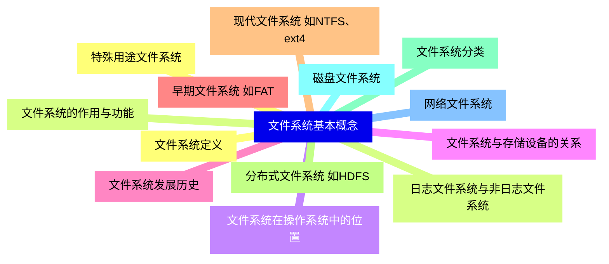
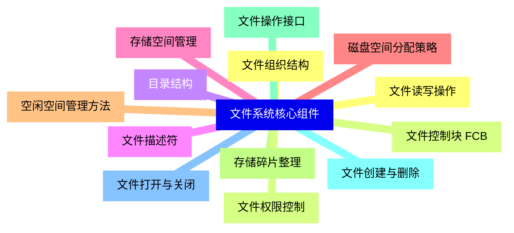
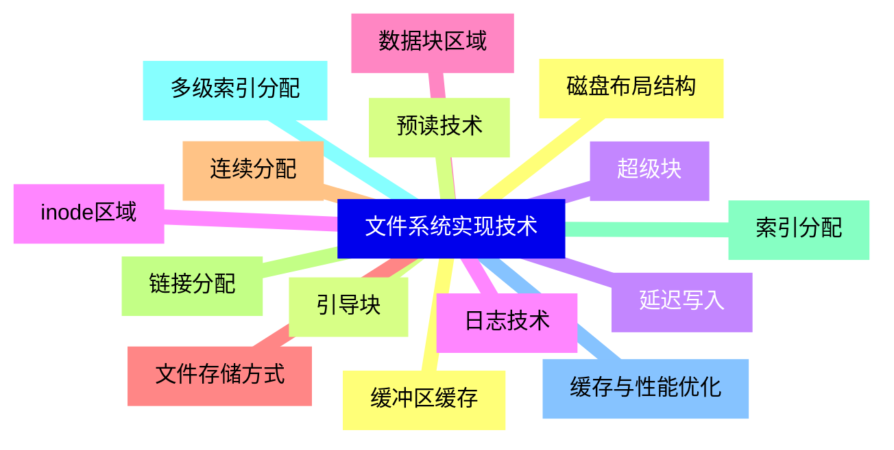
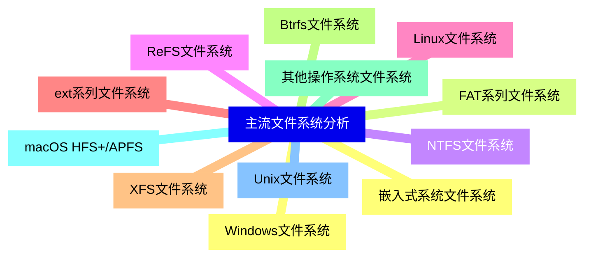
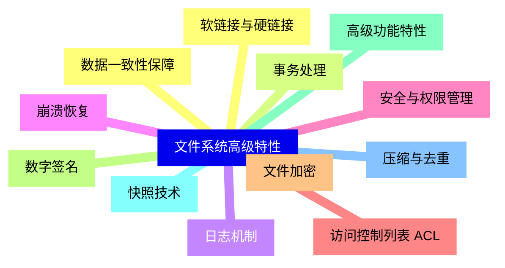
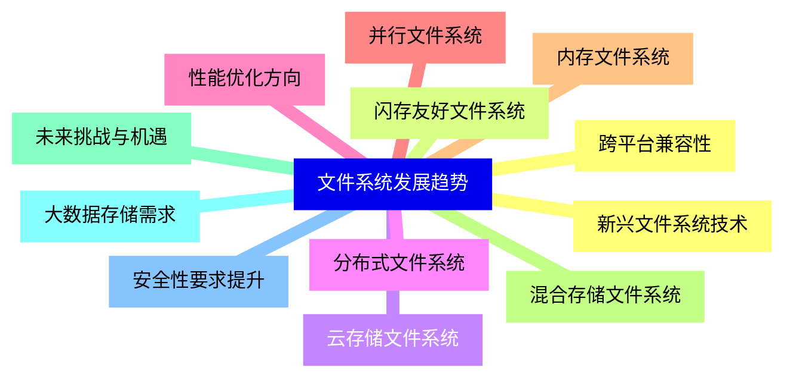


### 1 [文件系统基本概念](#1)
#### 1.1 [文件系统定义](#1)
#### 1.2 [文件系统的作用与功能](#1)
#### 1.3 [文件系统在操作系统中的位置](#1)
#### 1.4 [文件系统与存储设备的关系](#1)
#### 1.5 [文件系统发展历史](#1)
#### 1.6 [早期文件系统 如FAT](#1)
#### 1.7 [现代文件系统 如NTFS、ext4](#1)
#### 1.8 [分布式文件系统 如HDFS](#1)
#### 1.9 [文件系统分类](#1)
#### 1.10 [磁盘文件系统](#1)
#### 1.11 [网络文件系统](#1)
#### 1.12 [特殊用途文件系统](#1)
#### 1.13 [日志文件系统与非日志文件系统](#1)
### 2 [文件系统核心组件](#2)
#### 2.1 [文件组织结构](#2)
#### 2.2 [文件控制块 FCB](#2)
#### 2.3 [目录结构](#2)
#### 2.4 [文件描述符](#2)
#### 2.5 [存储空间管理](#2)
#### 2.6 [磁盘空间分配策略](#2)
#### 2.7 [空闲空间管理方法](#2)
#### 2.8 [存储碎片整理](#2)
#### 2.9 [文件操作接口](#2)
#### 2.10 [文件创建与删除](#2)
#### 2.11 [文件打开与关闭](#2)
#### 2.12 [文件读写操作](#2)
#### 2.13 [文件权限控制](#2)
### 3 [文件系统实现技术](#3)
#### 3.1 [磁盘布局结构](#3)
#### 3.2 [引导块](#3)
#### 3.3 [超级块](#3)
#### 3.4 [inode区域](#3)
#### 3.5 [数据块区域](#3)
#### 3.6 [文件存储方式](#3)
#### 3.7 [连续分配](#3)
#### 3.8 [链接分配](#3)
#### 3.9 [索引分配](#3)
#### 3.10 [多级索引分配](#3)
#### 3.11 [缓存与性能优化](#3)
#### 3.12 [缓冲区缓存](#3)
#### 3.13 [预读技术](#3)
#### 3.14 [延迟写入](#3)
#### 3.15 [日志技术](#3)
### 4 [主流文件系统分析](#4)
#### 4.1 [Windows文件系统](#4)
#### 4.2 [FAT系列文件系统](#4)
#### 4.3 [NTFS文件系统](#4)
#### 4.4 [ReFS文件系统](#4)
#### 4.5 [Linux文件系统](#4)
#### 4.6 [ext系列文件系统](#4)
#### 4.7 [XFS文件系统](#4)
#### 4.8 [Btrfs文件系统](#4)
#### 4.9 [其他操作系统文件系统](#4)
#### 4.10 [macOS HFS+/APFS](#4)
#### 4.11 [Unix文件系统](#4)
#### 4.12 [嵌入式系统文件系统](#4)
### 5 [文件系统高级特性](#5)
#### 5.1 [数据一致性保障](#5)
#### 5.2 [事务处理](#5)
#### 5.3 [日志机制](#5)
#### 5.4 [崩溃恢复](#5)
#### 5.5 [安全与权限管理](#5)
#### 5.6 [访问控制列表 ACL](#5)
#### 5.7 [文件加密](#5)
#### 5.8 [数字签名](#5)
#### 5.9 [高级功能特性](#5)
#### 5.10 [快照技术](#5)
#### 5.11 [压缩与去重](#5)
#### 5.12 [软链接与硬链接](#5)
### 6 [文件系统发展趋势](#6)
#### 6.1 [新兴文件系统技术](#6)
#### 6.2 [闪存友好文件系统](#6)
#### 6.3 [云存储文件系统](#6)
#### 6.4 [分布式文件系统](#6)
#### 6.5 [性能优化方向](#6)
#### 6.6 [并行文件系统](#6)
#### 6.7 [内存文件系统](#6)
#### 6.8 [混合存储文件系统](#6)
#### 6.9 [未来挑战与机遇](#6)
#### 6.10 [大数据存储需求](#6)
#### 6.11 [安全性要求提升](#6)
#### 6.12 [跨平台兼容性](#6)




### 1 文件系统基本概念

---
### 1 文件系统基本概念
___
#### 1.1 文件系统定义
___
#### 1.2 文件系统的作用与功能
___
#### 1.3 文件系统在操作系统中的位置
___
#### 1.4 文件系统与存储设备的关系
___
#### 1.5 文件系统发展历史
___
#### 1.6 早期文件系统 如FAT
___
#### 1.7 现代文件系统 如NTFS、ext4
___
#### 1.8 分布式文件系统 如HDFS
___
#### 1.9 文件系统分类
___
#### 1.10 磁盘文件系统
___
#### 1.11 网络文件系统
___
#### 1.12 特殊用途文件系统
___
#### 1.13 日志文件系统与非日志文件系统
### 2 文件系统核心组件

---
### 2 文件系统核心组件
___
#### 2.1 文件组织结构
___
#### 2.2 文件控制块 FCB
___
#### 2.3 目录结构
___
#### 2.4 文件描述符
___
#### 2.5 存储空间管理
___
#### 2.6 磁盘空间分配策略
___
#### 2.7 空闲空间管理方法
___
#### 2.8 存储碎片整理
___
#### 2.9 文件操作接口
___
#### 2.10 文件创建与删除
___
#### 2.11 文件打开与关闭
___
#### 2.12 文件读写操作
___
#### 2.13 文件权限控制
### 3 文件系统实现技术

---
### 3 文件系统实现技术
___
#### 3.1 磁盘布局结构
___
#### 3.2 引导块
___
#### 3.3 超级块
___
#### 3.4 inode区域
___
#### 3.5 数据块区域
___
#### 3.6 文件存储方式
___
#### 3.7 连续分配
___
#### 3.8 链接分配
___
#### 3.9 索引分配
___
#### 3.10 多级索引分配
___
#### 3.11 缓存与性能优化
___
#### 3.12 缓冲区缓存
___
#### 3.13 预读技术
___
#### 3.14 延迟写入
___
#### 3.15 日志技术
### 4 主流文件系统分析

---
### 4 主流文件系统分析
___
#### 4.1 Windows文件系统
___
#### 4.2 FAT系列文件系统
___
#### 4.3 NTFS文件系统
___
#### 4.4 ReFS文件系统
___
#### 4.5 Linux文件系统
___
#### 4.6 ext系列文件系统
___
#### 4.7 XFS文件系统
___
#### 4.8 Btrfs文件系统
___
#### 4.9 其他操作系统文件系统
___
#### 4.10 macOS HFS+/APFS
___
#### 4.11 Unix文件系统
___
#### 4.12 嵌入式系统文件系统
### 5 文件系统高级特性

---
### 5 文件系统高级特性
___
#### 5.1 数据一致性保障
___
#### 5.2 事务处理
___
#### 5.3 日志机制
___
#### 5.4 崩溃恢复
___
#### 5.5 安全与权限管理
___
#### 5.6 访问控制列表 ACL
___
#### 5.7 文件加密
___
#### 5.8 数字签名
___
#### 5.9 高级功能特性
___
#### 5.10 快照技术
___
#### 5.11 压缩与去重
___
#### 5.12 软链接与硬链接
### 6 文件系统发展趋势

---
### 6 文件系统发展趋势
___
#### 6.1 新兴文件系统技术
___
#### 6.2 闪存友好文件系统
___
#### 6.3 云存储文件系统
___
#### 6.4 分布式文件系统
___
#### 6.5 性能优化方向
___
#### 6.6 并行文件系统
___
#### 6.7 内存文件系统
___
#### 6.8 混合存储文件系统
___
#### 6.9 未来挑战与机遇
___
#### 6.10 大数据存储需求
___
#### 6.11 安全性要求提升
___
#### 6.12 跨平台兼容性


### 1 文件系统基本概念{#1}

{}

<--->
{}
{}
{}
{}
{}
{}
{}
{}
{}
{}
{}
{}
{}
{}
{}
{}
{}
{}
{}
{}
{}
{}
{}
{}
{}
{}
{}

### 2 文件系统核心组件{#2}

{}
{}
{}
{}
{}
{}
{}
{}
{}
{}
{}
{}
{}
{}
{}
{}
{}
{}
{}
{}
{}
{}
{}
{}
{}
{}
{}
<--->

{}

### 3 文件系统实现技术{#3}

{}

<--->
{}
{}
{}
{}
{}
{}
{}
{}
{}
{}
{}
{}
{}
{}
{}
{}
{}
{}
{}
{}
{}
{}
{}
{}
{}
{}
{}
{}
{}
{}
{}

### 4 主流文件系统分析{#4}

{}
{}
{}
{}
{}
{}
{}
{}
{}
{}
{}
{}
{}
{}
{}
{}
{}
{}
{}
{}
{}
{}
{}
{}
{}
<--->

{}

### 5 文件系统高级特性{#5}

{}

<--->
{}
{}
{}
{}
{}
{}
{}
{}
{}
{}
{}
{}
{}
{}
{}
{}
{}
{}
{}
{}
{}
{}
{}
{}
{}

### 6 文件系统发展趋势{#6}

{}
{}
{}
{}
{}
{}
{}
{}
{}
{}
{}
{}
{}
{}
{}
{}
{}
{}
{}
{}
{}
{}
{}
{}
{}
<--->

{}
