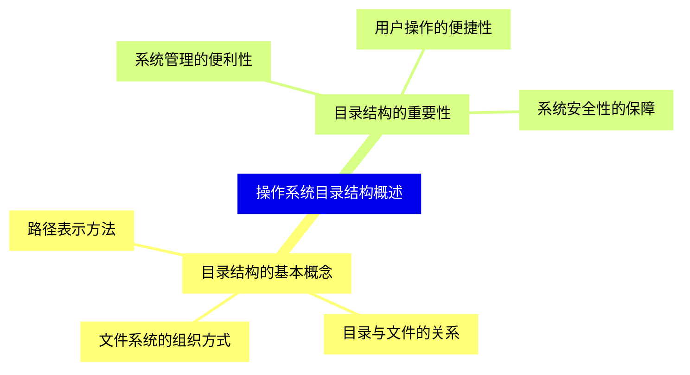
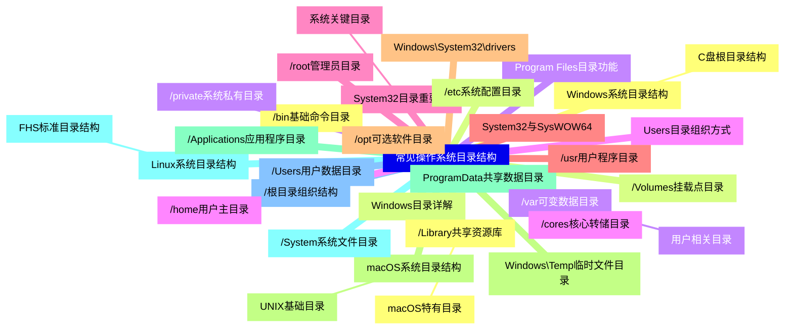
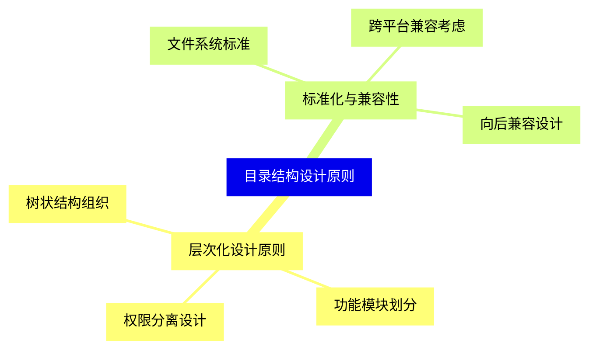
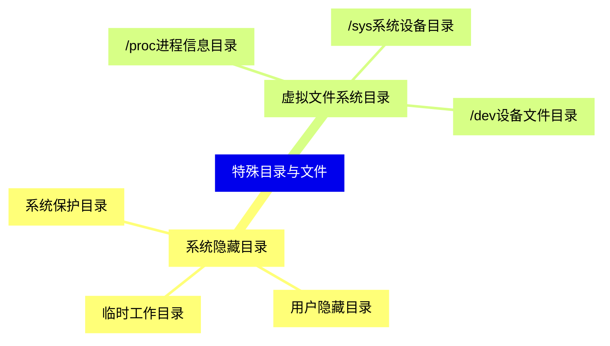
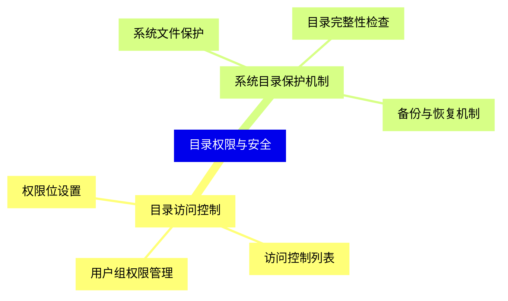
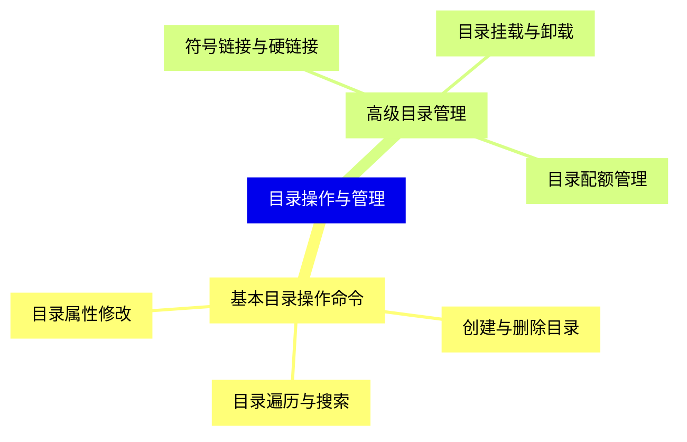
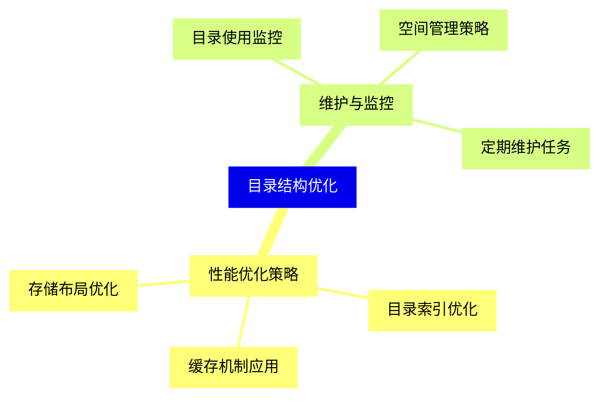
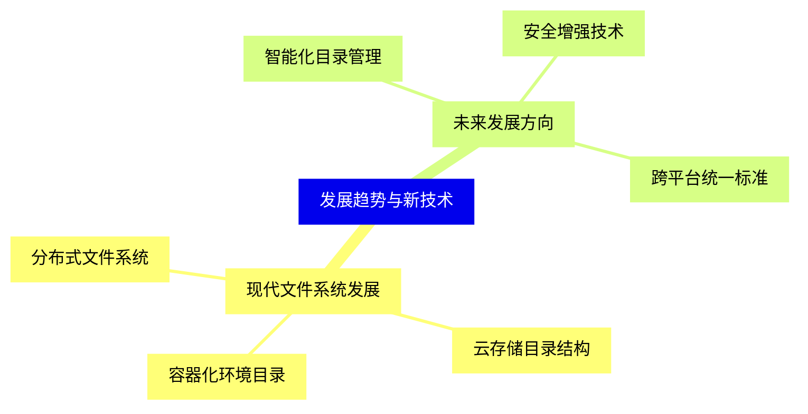


### 1 [操作系统目录结构概述](#1)
#### 1.1 [目录结构的基本概念](#1)
##### 1.1.1 [文件系统的组织方式](#1)
##### 1.1.2 [目录与文件的关系](#1)
##### 1.1.3 [路径表示方法](#1)
#### 1.2 [目录结构的重要性](#1)
##### 1.2.1 [系统管理的便利性](#1)
##### 1.2.2 [用户操作的便捷性](#1)
##### 1.2.3 [系统安全性的保障](#1)
### 2 [常见操作系统目录结构](#2)
#### 2.1 [Windows系统目录结构](#2)
##### 2.1.1 [C盘根目录结构](#2)
#### 2.2 [Windows目录详解](#2)
#### 2.3 [Program Files目录功能](#2)
#### 2.4 [Users目录组织方式](#2)
#### 2.5 [System32目录重要性](#2)
##### 2.5.1 [系统关键目录](#2)
#### 2.6 [System32与SysWOW64](#2)
#### 2.7 [Windows\System32\drivers](#2)
#### 2.8 [Windows\Temp临时文件目录](#2)
#### 2.9 [ProgramData共享数据目录](#2)
#### 2.10 [Linux系统目录结构](#2)
##### 2.10.1 [FHS标准目录结构](#2)
#### 2.11 [/根目录组织结构](#2)
#### 2.12 [/bin基础命令目录](#2)
#### 2.13 [/etc系统配置目录](#2)
#### 2.14 [/var可变数据目录](#2)
##### 2.14.1 [用户相关目录](#2)
#### 2.15 [/home用户主目录](#2)
#### 2.16 [/root管理员目录](#2)
#### 2.17 [/usr用户程序目录](#2)
#### 2.18 [/opt可选软件目录](#2)
#### 2.19 [macOS系统目录结构](#2)
##### 2.19.1 [UNIX基础目录](#2)
#### 2.20 [/Applications应用程序目录](#2)
#### 2.21 [/System系统文件目录](#2)
#### 2.22 [/Users用户数据目录](#2)
#### 2.23 [/Library共享资源库](#2)
##### 2.23.1 [macOS特有目录](#2)
#### 2.24 [/Volumes挂载点目录](#2)
#### 2.25 [/private系统私有目录](#2)
#### 2.26 [/cores核心转储目录](#2)
### 3 [目录结构设计原则](#3)
#### 3.1 [层次化设计原则](#3)
##### 3.1.1 [树状结构组织](#3)
##### 3.1.2 [功能模块划分](#3)
##### 3.1.3 [权限分离设计](#3)
#### 3.2 [标准化与兼容性](#3)
##### 3.2.1 [文件系统标准](#3)
##### 3.2.2 [跨平台兼容考虑](#3)
##### 3.2.3 [向后兼容设计](#3)
### 4 [特殊目录与文件](#4)
#### 4.1 [系统隐藏目录](#4)
##### 4.1.1 [系统保护目录](#4)
##### 4.1.2 [用户隐藏目录](#4)
##### 4.1.3 [临时工作目录](#4)
#### 4.2 [虚拟文件系统目录](#4)
##### 4.2.1 [/proc进程信息目录](#4)
##### 4.2.2 [/sys系统设备目录](#4)
##### 4.2.3 [/dev设备文件目录](#4)
### 5 [目录权限与安全](#5)
#### 5.1 [目录访问控制](#5)
##### 5.1.1 [权限位设置](#5)
##### 5.1.2 [访问控制列表](#5)
##### 5.1.3 [用户组权限管理](#5)
#### 5.2 [系统目录保护机制](#5)
##### 5.2.1 [系统文件保护](#5)
##### 5.2.2 [目录完整性检查](#5)
##### 5.2.3 [备份与恢复机制](#5)
### 6 [目录操作与管理](#6)
#### 6.1 [基本目录操作命令](#6)
##### 6.1.1 [创建与删除目录](#6)
##### 6.1.2 [目录遍历与搜索](#6)
##### 6.1.3 [目录属性修改](#6)
#### 6.2 [高级目录管理](#6)
##### 6.2.1 [符号链接与硬链接](#6)
##### 6.2.2 [目录挂载与卸载](#6)
##### 6.2.3 [目录配额管理](#6)
### 7 [目录结构优化](#7)
#### 7.1 [性能优化策略](#7)
##### 7.1.1 [目录索引优化](#7)
##### 7.1.2 [缓存机制应用](#7)
##### 7.1.3 [存储布局优化](#7)
#### 7.2 [维护与监控](#7)
##### 7.2.1 [目录使用监控](#7)
##### 7.2.2 [空间管理策略](#7)
##### 7.2.3 [定期维护任务](#7)
### 8 [发展趋势与新技术](#8)
#### 8.1 [现代文件系统发展](#8)
##### 8.1.1 [分布式文件系统](#8)
##### 8.1.2 [云存储目录结构](#8)
##### 8.1.3 [容器化环境目录](#8)
#### 8.2 [未来发展方向](#8)
##### 8.2.1 [智能化目录管理](#8)
##### 8.2.2 [安全增强技术](#8)
##### 8.2.3 [跨平台统一标准](#8)




### 1 操作系统目录结构概述

---
### 1 操作系统目录结构概述
___
#### 1.1 目录结构的基本概念
___
##### 1.1.1 文件系统的组织方式
___
##### 1.1.2 目录与文件的关系
___
##### 1.1.3 路径表示方法
___
#### 1.2 目录结构的重要性
___
##### 1.2.1 系统管理的便利性
___
##### 1.2.2 用户操作的便捷性
___
##### 1.2.3 系统安全性的保障
### 2 常见操作系统目录结构

---
### 2 常见操作系统目录结构
___
#### 2.1 Windows系统目录结构
___
##### 2.1.1 C盘根目录结构
___
#### 2.2 Windows目录详解
___
#### 2.3 Program Files目录功能
___
#### 2.4 Users目录组织方式
___
#### 2.5 System32目录重要性
___
##### 2.5.1 系统关键目录
___
#### 2.6 System32与SysWOW64
___
#### 2.7 Windows\System32\drivers
___
#### 2.8 Windows\Temp临时文件目录
___
#### 2.9 ProgramData共享数据目录
___
#### 2.10 Linux系统目录结构
___
##### 2.10.1 FHS标准目录结构
___
#### 2.11 /根目录组织结构
___
#### 2.12 /bin基础命令目录
___
#### 2.13 /etc系统配置目录
___
#### 2.14 /var可变数据目录
___
##### 2.14.1 用户相关目录
___
#### 2.15 /home用户主目录
___
#### 2.16 /root管理员目录
___
#### 2.17 /usr用户程序目录
___
#### 2.18 /opt可选软件目录
___
#### 2.19 macOS系统目录结构
___
##### 2.19.1 UNIX基础目录
___
#### 2.20 /Applications应用程序目录
___
#### 2.21 /System系统文件目录
___
#### 2.22 /Users用户数据目录
___
#### 2.23 /Library共享资源库
___
##### 2.23.1 macOS特有目录
___
#### 2.24 /Volumes挂载点目录
___
#### 2.25 /private系统私有目录
___
#### 2.26 /cores核心转储目录
### 3 目录结构设计原则

---
### 3 目录结构设计原则
___
#### 3.1 层次化设计原则
___
##### 3.1.1 树状结构组织
___
##### 3.1.2 功能模块划分
___
##### 3.1.3 权限分离设计
___
#### 3.2 标准化与兼容性
___
##### 3.2.1 文件系统标准
___
##### 3.2.2 跨平台兼容考虑
___
##### 3.2.3 向后兼容设计
### 4 特殊目录与文件

---
### 4 特殊目录与文件
___
#### 4.1 系统隐藏目录
___
##### 4.1.1 系统保护目录
___
##### 4.1.2 用户隐藏目录
___
##### 4.1.3 临时工作目录
___
#### 4.2 虚拟文件系统目录
___
##### 4.2.1 /proc进程信息目录
___
##### 4.2.2 /sys系统设备目录
___
##### 4.2.3 /dev设备文件目录
### 5 目录权限与安全

---
### 5 目录权限与安全
___
#### 5.1 目录访问控制
___
##### 5.1.1 权限位设置
___
##### 5.1.2 访问控制列表
___
##### 5.1.3 用户组权限管理
___
#### 5.2 系统目录保护机制
___
##### 5.2.1 系统文件保护
___
##### 5.2.2 目录完整性检查
___
##### 5.2.3 备份与恢复机制
### 6 目录操作与管理

---
### 6 目录操作与管理
___
#### 6.1 基本目录操作命令
___
##### 6.1.1 创建与删除目录
___
##### 6.1.2 目录遍历与搜索
___
##### 6.1.3 目录属性修改
___
#### 6.2 高级目录管理
___
##### 6.2.1 符号链接与硬链接
___
##### 6.2.2 目录挂载与卸载
___
##### 6.2.3 目录配额管理
### 7 目录结构优化

---
### 7 目录结构优化
___
#### 7.1 性能优化策略
___
##### 7.1.1 目录索引优化
___
##### 7.1.2 缓存机制应用
___
##### 7.1.3 存储布局优化
___
#### 7.2 维护与监控
___
##### 7.2.1 目录使用监控
___
##### 7.2.2 空间管理策略
___
##### 7.2.3 定期维护任务
### 8 发展趋势与新技术

---
### 8 发展趋势与新技术
___
#### 8.1 现代文件系统发展
___
##### 8.1.1 分布式文件系统
___
##### 8.1.2 云存储目录结构
___
##### 8.1.3 容器化环境目录
___
#### 8.2 未来发展方向
___
##### 8.2.1 智能化目录管理
___
##### 8.2.2 安全增强技术
___
##### 8.2.3 跨平台统一标准


### 1 操作系统目录结构概述{#1}

{}

<--->
{}
{}
{}
{}
{}
{}
{}
{}
{}
{}
{}
{}
{}
{}
{}
{}
{}

### 2 常见操作系统目录结构{#2}

{}
{}
{}
{}
{}
{}
{}
{}
{}
{}
{}
{}
{}
{}
{}
{}
{}
{}
{}
{}
{}
{}
{}
{}
{}
{}
{}
{}
{}
{}
{}
{}
{}
{}
{}
{}
{}
{}
{}
{}
{}
{}
{}
{}
{}
{}
{}
{}
{}
{}
{}
{}
{}
{}
{}
{}
{}
{}
{}
{}
{}
{}
{}
{}
{}
<--->

{}

### 3 目录结构设计原则{#3}

{}

<--->
{}
{}
{}
{}
{}
{}
{}
{}
{}
{}
{}
{}
{}
{}
{}
{}
{}

### 4 特殊目录与文件{#4}

{}
{}
{}
{}
{}
{}
{}
{}
{}
{}
{}
{}
{}
{}
{}
{}
{}
<--->

{}

### 5 目录权限与安全{#5}

{}

<--->
{}
{}
{}
{}
{}
{}
{}
{}
{}
{}
{}
{}
{}
{}
{}
{}
{}

### 6 目录操作与管理{#6}

{}
{}
{}
{}
{}
{}
{}
{}
{}
{}
{}
{}
{}
{}
{}
{}
{}
<--->

{}

### 7 目录结构优化{#7}

{}

<--->
{}
{}
{}
{}
{}
{}
{}
{}
{}
{}
{}
{}
{}
{}
{}
{}
{}

### 8 发展趋势与新技术{#8}

{}
{}
{}
{}
{}
{}
{}
{}
{}
{}
{}
{}
{}
{}
{}
{}
{}
<--->

{}
