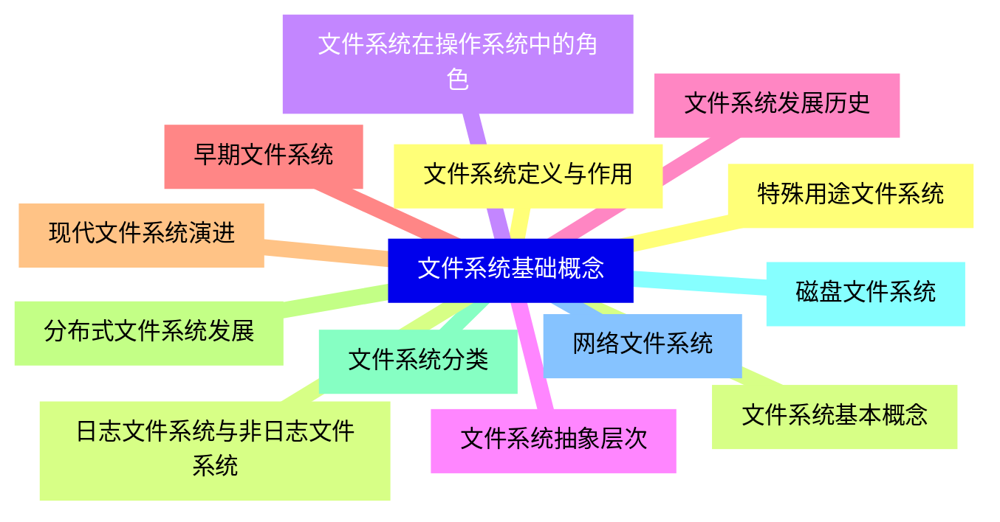
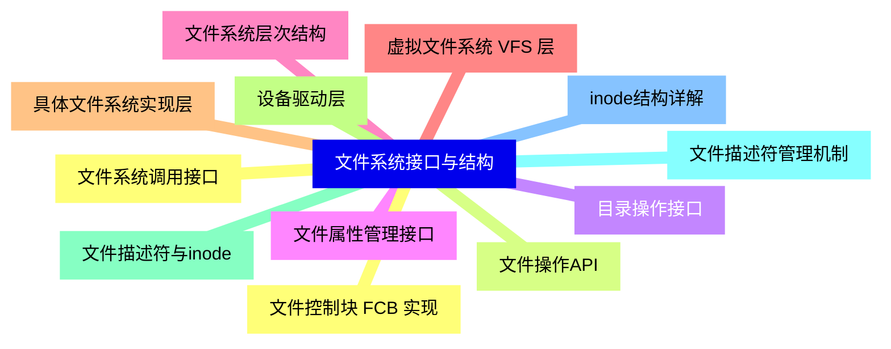
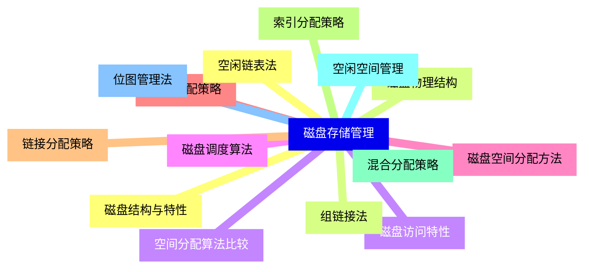
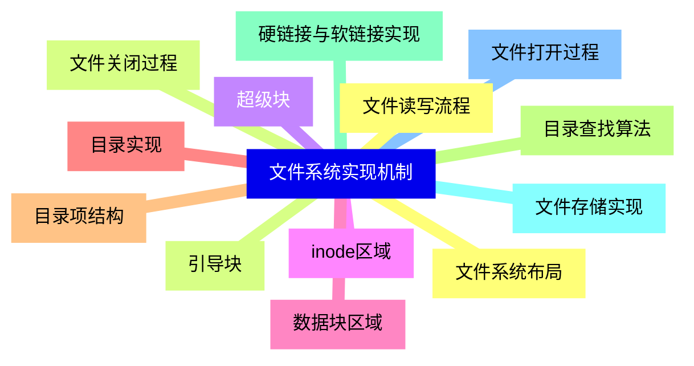
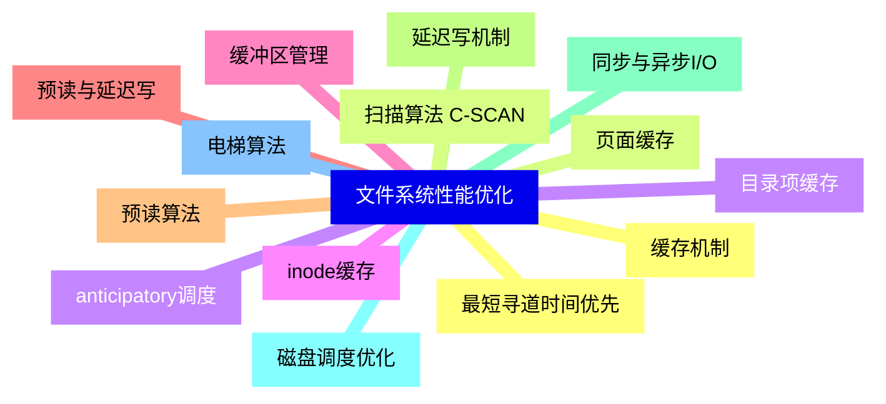
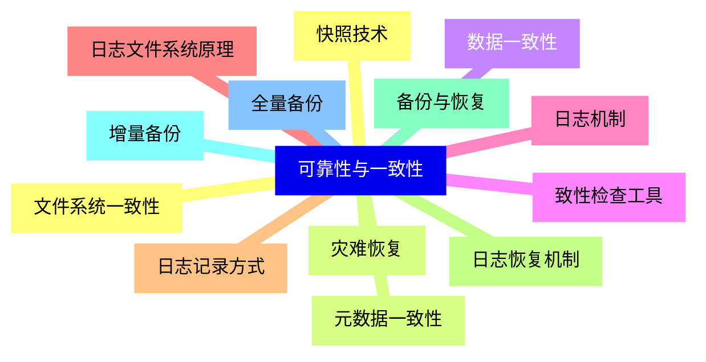
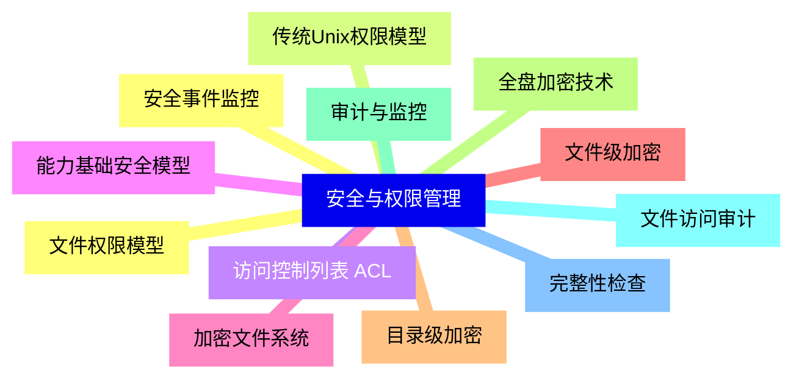
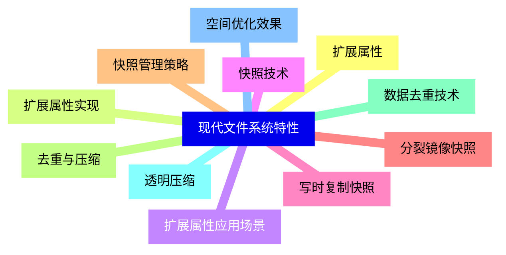
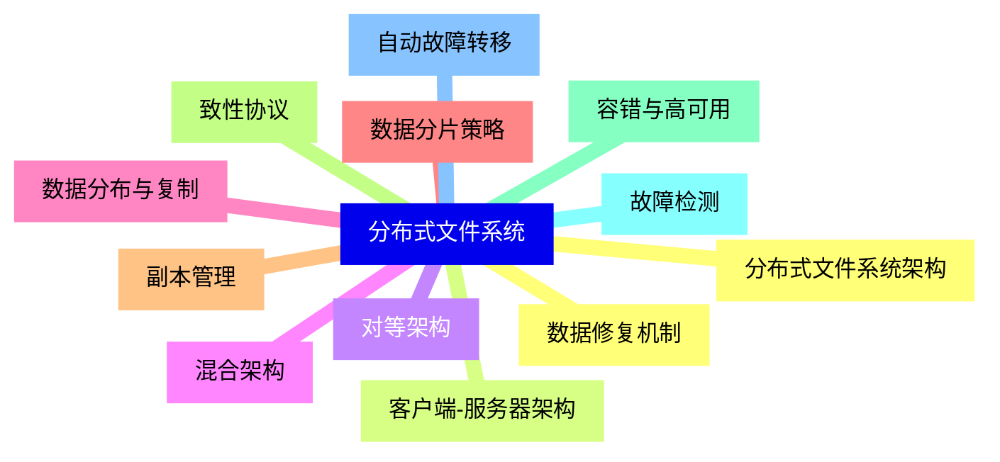
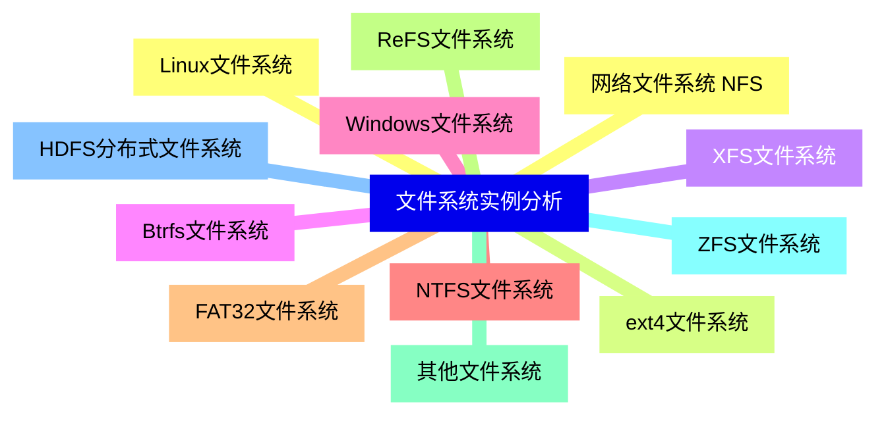


### 1 [文件系统基础概念](#1)
#### 1.1 [文件系统定义与作用](#1)
#### 1.2 [文件系统基本概念](#1)
#### 1.3 [文件系统在操作系统中的角色](#1)
#### 1.4 [文件系统抽象层次](#1)
#### 1.5 [文件系统发展历史](#1)
#### 1.6 [早期文件系统](#1)
#### 1.7 [现代文件系统演进](#1)
#### 1.8 [分布式文件系统发展](#1)
#### 1.9 [文件系统分类](#1)
#### 1.10 [磁盘文件系统](#1)
#### 1.11 [网络文件系统](#1)
#### 1.12 [特殊用途文件系统](#1)
#### 1.13 [日志文件系统与非日志文件系统](#1)
### 2 [文件系统接口与结构](#2)
#### 2.1 [文件系统调用接口](#2)
#### 2.2 [文件操作API](#2)
#### 2.3 [目录操作接口](#2)
#### 2.4 [文件属性管理接口](#2)
#### 2.5 [文件系统层次结构](#2)
#### 2.6 [虚拟文件系统 VFS 层](#2)
#### 2.7 [具体文件系统实现层](#2)
#### 2.8 [设备驱动层](#2)
#### 2.9 [文件描述符与inode](#2)
#### 2.10 [文件描述符管理机制](#2)
#### 2.11 [inode结构详解](#2)
#### 2.12 [文件控制块 FCB 实现](#2)
### 3 [磁盘存储管理](#3)
#### 3.1 [磁盘结构与特性](#3)
#### 3.2 [磁盘物理结构](#3)
#### 3.3 [磁盘访问特性](#3)
#### 3.4 [磁盘调度算法](#3)
#### 3.5 [磁盘空间分配方法](#3)
#### 3.6 [连续分配策略](#3)
#### 3.7 [链接分配策略](#3)
#### 3.8 [索引分配策略](#3)
#### 3.9 [混合分配策略](#3)
#### 3.10 [空闲空间管理](#3)
#### 3.11 [位图管理法](#3)
#### 3.12 [空闲链表法](#3)
#### 3.13 [组链接法](#3)
#### 3.14 [空间分配算法比较](#3)
### 4 [文件系统实现机制](#4)
#### 4.1 [文件系统布局](#4)
#### 4.2 [引导块](#4)
#### 4.3 [超级块](#4)
#### 4.4 [inode区域](#4)
#### 4.5 [数据块区域](#4)
#### 4.6 [目录实现](#4)
#### 4.7 [目录项结构](#4)
#### 4.8 [目录查找算法](#4)
#### 4.9 [硬链接与软链接实现](#4)
#### 4.10 [文件存储实现](#4)
#### 4.11 [文件打开过程](#4)
#### 4.12 [文件读写流程](#4)
#### 4.13 [文件关闭过程](#4)
### 5 [文件系统性能优化](#5)
#### 5.1 [缓存机制](#5)
#### 5.2 [页面缓存](#5)
#### 5.3 [目录项缓存](#5)
#### 5.4 [inode缓存](#5)
#### 5.5 [缓冲区管理](#5)
#### 5.6 [预读与延迟写](#5)
#### 5.7 [预读算法](#5)
#### 5.8 [延迟写机制](#5)
#### 5.9 [同步与异步I/O](#5)
#### 5.10 [磁盘调度优化](#5)
#### 5.11 [电梯算法](#5)
#### 5.12 [最短寻道时间优先](#5)
#### 5.13 [扫描算法 C-SCAN](#5)
#### 5.14 [anticipatory调度](#5)
### 6 [可靠性与一致性](#6)
#### 6.1 [文件系统一致性](#6)
#### 6.2 [元数据一致性](#6)
#### 6.3 [数据一致性](#6)
#### 6.4 [致性检查工具](#6)
#### 6.5 [日志机制](#6)
#### 6.6 [日志文件系统原理](#6)
#### 6.7 [日志记录方式](#6)
#### 6.8 [日志恢复机制](#6)
#### 6.9 [备份与恢复](#6)
#### 6.10 [增量备份](#6)
#### 6.11 [全量备份](#6)
#### 6.12 [快照技术](#6)
#### 6.13 [灾难恢复](#6)
### 7 [安全与权限管理](#7)
#### 7.1 [文件权限模型](#7)
#### 7.2 [传统Unix权限模型](#7)
#### 7.3 [访问控制列表 ACL](#7)
#### 7.4 [能力基础安全模型](#7)
#### 7.5 [加密文件系统](#7)
#### 7.6 [文件级加密](#7)
#### 7.7 [目录级加密](#7)
#### 7.8 [全盘加密技术](#7)
#### 7.9 [审计与监控](#7)
#### 7.10 [文件访问审计](#7)
#### 7.11 [完整性检查](#7)
#### 7.12 [安全事件监控](#7)
### 8 [现代文件系统特性](#8)
#### 8.1 [扩展属性](#8)
#### 8.2 [扩展属性实现](#8)
#### 8.3 [扩展属性应用场景](#8)
#### 8.4 [快照技术](#8)
#### 8.5 [写时复制快照](#8)
#### 8.6 [分裂镜像快照](#8)
#### 8.7 [快照管理策略](#8)
#### 8.8 [去重与压缩](#8)
#### 8.9 [数据去重技术](#8)
#### 8.10 [透明压缩](#8)
#### 8.11 [空间优化效果](#8)
### 9 [分布式文件系统](#9)
#### 9.1 [分布式文件系统架构](#9)
#### 9.2 [客户端-服务器架构](#9)
#### 9.3 [对等架构](#9)
#### 9.4 [混合架构](#9)
#### 9.5 [数据分布与复制](#9)
#### 9.6 [数据分片策略](#9)
#### 9.7 [副本管理](#9)
#### 9.8 [致性协议](#9)
#### 9.9 [容错与高可用](#9)
#### 9.10 [故障检测](#9)
#### 9.11 [自动故障转移](#9)
#### 9.12 [数据修复机制](#9)
### 10 [文件系统实例分析](#10)
#### 10.1 [Linux文件系统](#10)
#### 10.2 [ext4文件系统](#10)
#### 10.3 [XFS文件系统](#10)
#### 10.4 [Btrfs文件系统](#10)
#### 10.5 [Windows文件系统](#10)
#### 10.6 [NTFS文件系统](#10)
#### 10.7 [FAT32文件系统](#10)
#### 10.8 [ReFS文件系统](#10)
#### 10.9 [其他文件系统](#10)
#### 10.10 [ZFS文件系统](#10)
#### 10.11 [HDFS分布式文件系统](#10)
#### 10.12 [网络文件系统 NFS](#10)




### 1 文件系统基础概念

---
### 1 文件系统基础概念
___
#### 1.1 文件系统定义与作用
___
#### 1.2 文件系统基本概念
___
#### 1.3 文件系统在操作系统中的角色
___
#### 1.4 文件系统抽象层次
___
#### 1.5 文件系统发展历史
___
#### 1.6 早期文件系统
___
#### 1.7 现代文件系统演进
___
#### 1.8 分布式文件系统发展
___
#### 1.9 文件系统分类
___
#### 1.10 磁盘文件系统
___
#### 1.11 网络文件系统
___
#### 1.12 特殊用途文件系统
___
#### 1.13 日志文件系统与非日志文件系统
### 2 文件系统接口与结构

---
### 2 文件系统接口与结构
___
#### 2.1 文件系统调用接口
___
#### 2.2 文件操作API
___
#### 2.3 目录操作接口
___
#### 2.4 文件属性管理接口
___
#### 2.5 文件系统层次结构
___
#### 2.6 虚拟文件系统 VFS 层
___
#### 2.7 具体文件系统实现层
___
#### 2.8 设备驱动层
___
#### 2.9 文件描述符与inode
___
#### 2.10 文件描述符管理机制
___
#### 2.11 inode结构详解
___
#### 2.12 文件控制块 FCB 实现
### 3 磁盘存储管理

---
### 3 磁盘存储管理
___
#### 3.1 磁盘结构与特性
___
#### 3.2 磁盘物理结构
___
#### 3.3 磁盘访问特性
___
#### 3.4 磁盘调度算法
___
#### 3.5 磁盘空间分配方法
___
#### 3.6 连续分配策略
___
#### 3.7 链接分配策略
___
#### 3.8 索引分配策略
___
#### 3.9 混合分配策略
___
#### 3.10 空闲空间管理
___
#### 3.11 位图管理法
___
#### 3.12 空闲链表法
___
#### 3.13 组链接法
___
#### 3.14 空间分配算法比较
### 4 文件系统实现机制

---
### 4 文件系统实现机制
___
#### 4.1 文件系统布局
___
#### 4.2 引导块
___
#### 4.3 超级块
___
#### 4.4 inode区域
___
#### 4.5 数据块区域
___
#### 4.6 目录实现
___
#### 4.7 目录项结构
___
#### 4.8 目录查找算法
___
#### 4.9 硬链接与软链接实现
___
#### 4.10 文件存储实现
___
#### 4.11 文件打开过程
___
#### 4.12 文件读写流程
___
#### 4.13 文件关闭过程
### 5 文件系统性能优化

---
### 5 文件系统性能优化
___
#### 5.1 缓存机制
___
#### 5.2 页面缓存
___
#### 5.3 目录项缓存
___
#### 5.4 inode缓存
___
#### 5.5 缓冲区管理
___
#### 5.6 预读与延迟写
___
#### 5.7 预读算法
___
#### 5.8 延迟写机制
___
#### 5.9 同步与异步I/O
___
#### 5.10 磁盘调度优化
___
#### 5.11 电梯算法
___
#### 5.12 最短寻道时间优先
___
#### 5.13 扫描算法 C-SCAN
___
#### 5.14 anticipatory调度
### 6 可靠性与一致性

---
### 6 可靠性与一致性
___
#### 6.1 文件系统一致性
___
#### 6.2 元数据一致性
___
#### 6.3 数据一致性
___
#### 6.4 致性检查工具
___
#### 6.5 日志机制
___
#### 6.6 日志文件系统原理
___
#### 6.7 日志记录方式
___
#### 6.8 日志恢复机制
___
#### 6.9 备份与恢复
___
#### 6.10 增量备份
___
#### 6.11 全量备份
___
#### 6.12 快照技术
___
#### 6.13 灾难恢复
### 7 安全与权限管理

---
### 7 安全与权限管理
___
#### 7.1 文件权限模型
___
#### 7.2 传统Unix权限模型
___
#### 7.3 访问控制列表 ACL
___
#### 7.4 能力基础安全模型
___
#### 7.5 加密文件系统
___
#### 7.6 文件级加密
___
#### 7.7 目录级加密
___
#### 7.8 全盘加密技术
___
#### 7.9 审计与监控
___
#### 7.10 文件访问审计
___
#### 7.11 完整性检查
___
#### 7.12 安全事件监控
### 8 现代文件系统特性

---
### 8 现代文件系统特性
___
#### 8.1 扩展属性
___
#### 8.2 扩展属性实现
___
#### 8.3 扩展属性应用场景
___
#### 8.4 快照技术
___
#### 8.5 写时复制快照
___
#### 8.6 分裂镜像快照
___
#### 8.7 快照管理策略
___
#### 8.8 去重与压缩
___
#### 8.9 数据去重技术
___
#### 8.10 透明压缩
___
#### 8.11 空间优化效果
### 9 分布式文件系统

---
### 9 分布式文件系统
___
#### 9.1 分布式文件系统架构
___
#### 9.2 客户端-服务器架构
___
#### 9.3 对等架构
___
#### 9.4 混合架构
___
#### 9.5 数据分布与复制
___
#### 9.6 数据分片策略
___
#### 9.7 副本管理
___
#### 9.8 致性协议
___
#### 9.9 容错与高可用
___
#### 9.10 故障检测
___
#### 9.11 自动故障转移
___
#### 9.12 数据修复机制
### 10 文件系统实例分析

---
### 10 文件系统实例分析
___
#### 10.1 Linux文件系统
___
#### 10.2 ext4文件系统
___
#### 10.3 XFS文件系统
___
#### 10.4 Btrfs文件系统
___
#### 10.5 Windows文件系统
___
#### 10.6 NTFS文件系统
___
#### 10.7 FAT32文件系统
___
#### 10.8 ReFS文件系统
___
#### 10.9 其他文件系统
___
#### 10.10 ZFS文件系统
___
#### 10.11 HDFS分布式文件系统
___
#### 10.12 网络文件系统 NFS


### 1 文件系统基础概念{#1}

{}

<--->
{}
{}
{}
{}
{}
{}
{}
{}
{}
{}
{}
{}
{}
{}
{}
{}
{}
{}
{}
{}
{}
{}
{}
{}
{}
{}
{}

### 2 文件系统接口与结构{#2}

{}
{}
{}
{}
{}
{}
{}
{}
{}
{}
{}
{}
{}
{}
{}
{}
{}
{}
{}
{}
{}
{}
{}
{}
{}
<--->

{}

### 3 磁盘存储管理{#3}

{}

<--->
{}
{}
{}
{}
{}
{}
{}
{}
{}
{}
{}
{}
{}
{}
{}
{}
{}
{}
{}
{}
{}
{}
{}
{}
{}
{}
{}
{}
{}

### 4 文件系统实现机制{#4}

{}
{}
{}
{}
{}
{}
{}
{}
{}
{}
{}
{}
{}
{}
{}
{}
{}
{}
{}
{}
{}
{}
{}
{}
{}
{}
{}
<--->

{}

### 5 文件系统性能优化{#5}

{}

<--->
{}
{}
{}
{}
{}
{}
{}
{}
{}
{}
{}
{}
{}
{}
{}
{}
{}
{}
{}
{}
{}
{}
{}
{}
{}
{}
{}
{}
{}

### 6 可靠性与一致性{#6}

{}
{}
{}
{}
{}
{}
{}
{}
{}
{}
{}
{}
{}
{}
{}
{}
{}
{}
{}
{}
{}
{}
{}
{}
{}
{}
{}
<--->

{}

### 7 安全与权限管理{#7}

{}

<--->
{}
{}
{}
{}
{}
{}
{}
{}
{}
{}
{}
{}
{}
{}
{}
{}
{}
{}
{}
{}
{}
{}
{}
{}
{}

### 8 现代文件系统特性{#8}

{}
{}
{}
{}
{}
{}
{}
{}
{}
{}
{}
{}
{}
{}
{}
{}
{}
{}
{}
{}
{}
{}
{}
<--->

{}

### 9 分布式文件系统{#9}

{}

<--->
{}
{}
{}
{}
{}
{}
{}
{}
{}
{}
{}
{}
{}
{}
{}
{}
{}
{}
{}
{}
{}
{}
{}
{}
{}

### 10 文件系统实例分析{#10}

{}
{}
{}
{}
{}
{}
{}
{}
{}
{}
{}
{}
{}
{}
{}
{}
{}
{}
{}
{}
{}
{}
{}
{}
{}
<--->

{}
