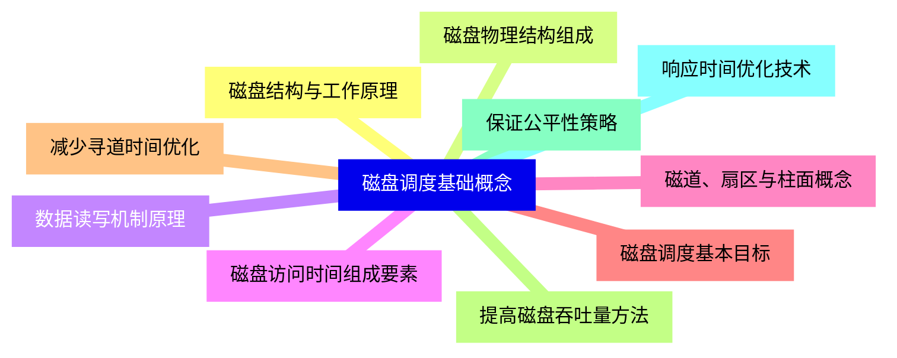
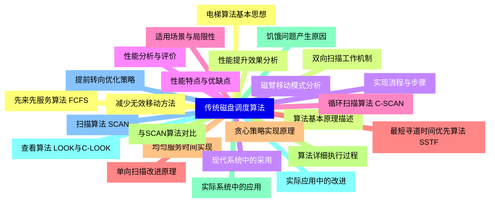
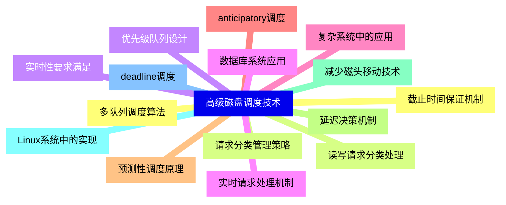
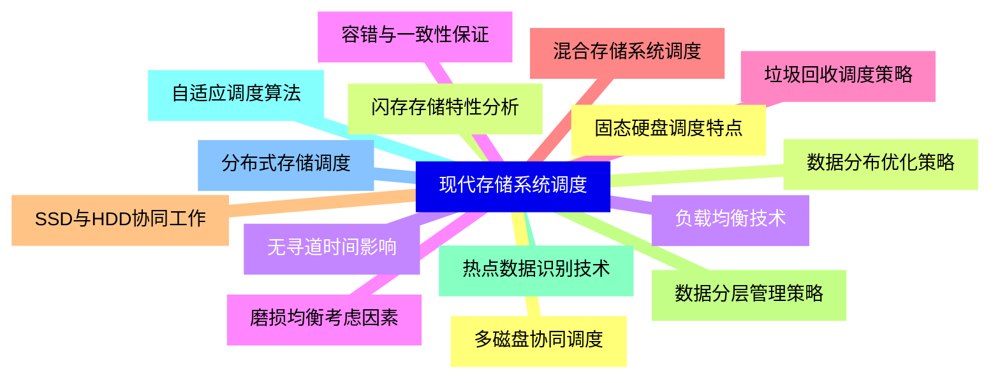
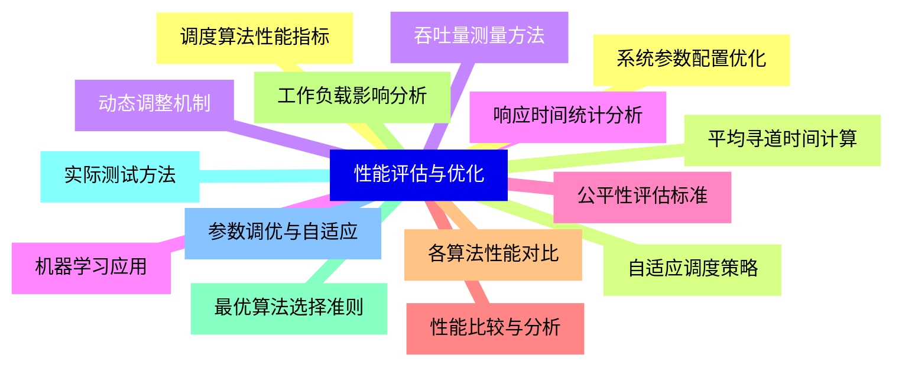
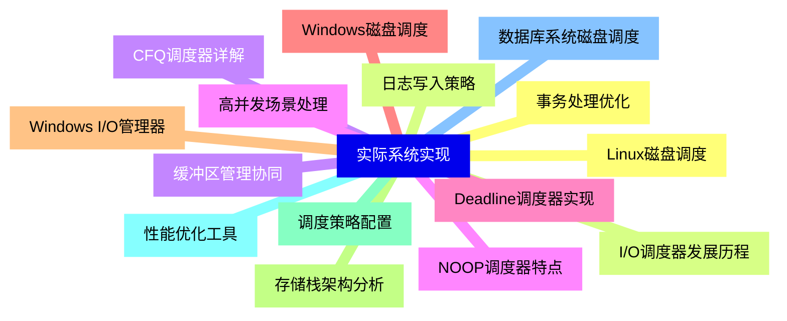
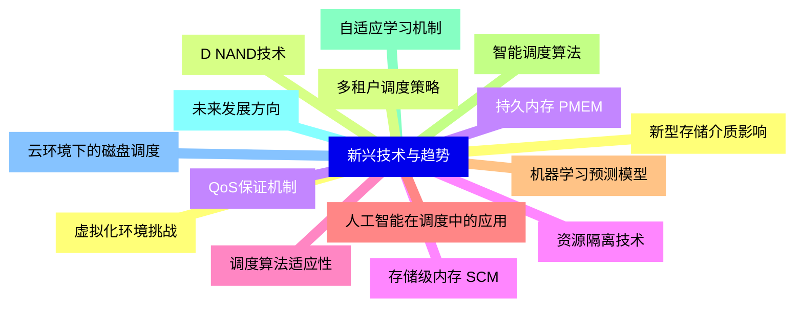


### 1 [磁盘调度基础概念](#1)
#### 1.1 [磁盘结构与工作原理](#1)
#### 1.2 [磁盘物理结构组成](#1)
#### 1.3 [数据读写机制原理](#1)
#### 1.4 [磁盘访问时间组成要素](#1)
#### 1.5 [磁道、扇区与柱面概念](#1)
#### 1.6 [磁盘调度基本目标](#1)
#### 1.7 [减少寻道时间优化](#1)
#### 1.8 [提高磁盘吞吐量方法](#1)
#### 1.9 [保证公平性策略](#1)
#### 1.10 [响应时间优化技术](#1)
### 2 [传统磁盘调度算法](#2)
#### 2.1 [先来先服务算法 FCFS](#2)
#### 2.2 [算法基本原理描述](#2)
#### 2.3 [实现流程与步骤](#2)
#### 2.4 [性能分析与评价](#2)
#### 2.5 [适用场景与局限性](#2)
#### 2.6 [最短寻道时间优先算法 SSTF](#2)
#### 2.7 [贪心策略实现原理](#2)
#### 2.8 [算法详细执行过程](#2)
#### 2.9 [饥饿问题产生原因](#2)
#### 2.10 [实际应用中的改进](#2)
#### 2.11 [扫描算法 SCAN](#2)
#### 2.12 [电梯算法基本思想](#2)
#### 2.13 [双向扫描工作机制](#2)
#### 2.14 [磁臂移动模式分析](#2)
#### 2.15 [性能特点与优缺点](#2)
#### 2.16 [循环扫描算法 C-SCAN](#2)
#### 2.17 [单向扫描改进原理](#2)
#### 2.18 [均匀服务时间实现](#2)
#### 2.19 [与SCAN算法对比](#2)
#### 2.20 [实际系统中的应用](#2)
#### 2.21 [查看算法 LOOK与C-LOOK](#2)
#### 2.22 [提前转向优化策略](#2)
#### 2.23 [减少无效移动方法](#2)
#### 2.24 [性能提升效果分析](#2)
#### 2.25 [现代系统中的采用](#2)
### 3 [高级磁盘调度技术](#3)
#### 3.1 [多队列调度算法](#3)
#### 3.2 [请求分类管理策略](#3)
#### 3.3 [优先级队列设计](#3)
#### 3.4 [实时请求处理机制](#3)
#### 3.5 [复杂系统中的应用](#3)
#### 3.6 [anticipatory调度](#3)
#### 3.7 [预测性调度原理](#3)
#### 3.8 [延迟决策机制](#3)
#### 3.9 [减少磁头移动技术](#3)
#### 3.10 [Linux系统中的实现](#3)
#### 3.11 [deadline调度](#3)
#### 3.12 [截止时间保证机制](#3)
#### 3.13 [读写请求分类处理](#3)
#### 3.14 [实时性要求满足](#3)
#### 3.15 [数据库系统应用](#3)
### 4 [现代存储系统调度](#4)
#### 4.1 [固态硬盘调度特点](#4)
#### 4.2 [闪存存储特性分析](#4)
#### 4.3 [无寻道时间影响](#4)
#### 4.4 [磨损均衡考虑因素](#4)
#### 4.5 [垃圾回收调度策略](#4)
#### 4.6 [混合存储系统调度](#4)
#### 4.7 [SSD与HDD协同工作](#4)
#### 4.8 [数据分层管理策略](#4)
#### 4.9 [热点数据识别技术](#4)
#### 4.10 [自适应调度算法](#4)
#### 4.11 [分布式存储调度](#4)
#### 4.12 [多磁盘协同调度](#4)
#### 4.13 [数据分布优化策略](#4)
#### 4.14 [负载均衡技术](#4)
#### 4.15 [容错与一致性保证](#4)
### 5 [性能评估与优化](#5)
#### 5.1 [调度算法性能指标](#5)
#### 5.2 [平均寻道时间计算](#5)
#### 5.3 [吞吐量测量方法](#5)
#### 5.4 [响应时间统计分析](#5)
#### 5.5 [公平性评估标准](#5)
#### 5.6 [性能比较与分析](#5)
#### 5.7 [各算法性能对比](#5)
#### 5.8 [工作负载影响分析](#5)
#### 5.9 [最优算法选择准则](#5)
#### 5.10 [实际测试方法](#5)
#### 5.11 [参数调优与自适应](#5)
#### 5.12 [系统参数配置优化](#5)
#### 5.13 [自适应调度策略](#5)
#### 5.14 [动态调整机制](#5)
#### 5.15 [机器学习应用](#5)
### 6 [实际系统实现](#6)
#### 6.1 [Linux磁盘调度](#6)
#### 6.2 [I/O调度器发展历程](#6)
#### 6.3 [CFQ调度器详解](#6)
#### 6.4 [NOOP调度器特点](#6)
#### 6.5 [Deadline调度器实现](#6)
#### 6.6 [Windows磁盘调度](#6)
#### 6.7 [Windows I/O管理器](#6)
#### 6.8 [存储栈架构分析](#6)
#### 6.9 [调度策略配置](#6)
#### 6.10 [性能优化工具](#6)
#### 6.11 [数据库系统磁盘调度](#6)
#### 6.12 [事务处理优化](#6)
#### 6.13 [日志写入策略](#6)
#### 6.14 [缓冲区管理协同](#6)
#### 6.15 [高并发场景处理](#6)
### 7 [新兴技术与趋势](#7)
#### 7.1 [新型存储介质影响](#7)
#### 7.2 [D NAND技术](#7)
#### 7.3 [持久内存 PMEM](#7)
#### 7.4 [存储级内存 SCM](#7)
#### 7.5 [调度算法适应性](#7)
#### 7.6 [人工智能在调度中的应用](#7)
#### 7.7 [机器学习预测模型](#7)
#### 7.8 [智能调度算法](#7)
#### 7.9 [自适应学习机制](#7)
#### 7.10 [未来发展方向](#7)
#### 7.11 [云环境下的磁盘调度](#7)
#### 7.12 [虚拟化环境挑战](#7)
#### 7.13 [多租户调度策略](#7)
#### 7.14 [QoS保证机制](#7)
#### 7.15 [资源隔离技术](#7)




### 1 磁盘调度基础概念

---
### 1 磁盘调度基础概念
___
#### 1.1 磁盘结构与工作原理
___
#### 1.2 磁盘物理结构组成
___
#### 1.3 数据读写机制原理
___
#### 1.4 磁盘访问时间组成要素
___
#### 1.5 磁道、扇区与柱面概念
___
#### 1.6 磁盘调度基本目标
___
#### 1.7 减少寻道时间优化
___
#### 1.8 提高磁盘吞吐量方法
___
#### 1.9 保证公平性策略
___
#### 1.10 响应时间优化技术
### 2 传统磁盘调度算法

---
### 2 传统磁盘调度算法
___
#### 2.1 先来先服务算法 FCFS
___
#### 2.2 算法基本原理描述
___
#### 2.3 实现流程与步骤
___
#### 2.4 性能分析与评价
___
#### 2.5 适用场景与局限性
___
#### 2.6 最短寻道时间优先算法 SSTF
___
#### 2.7 贪心策略实现原理
___
#### 2.8 算法详细执行过程
___
#### 2.9 饥饿问题产生原因
___
#### 2.10 实际应用中的改进
___
#### 2.11 扫描算法 SCAN
___
#### 2.12 电梯算法基本思想
___
#### 2.13 双向扫描工作机制
___
#### 2.14 磁臂移动模式分析
___
#### 2.15 性能特点与优缺点
___
#### 2.16 循环扫描算法 C-SCAN
___
#### 2.17 单向扫描改进原理
___
#### 2.18 均匀服务时间实现
___
#### 2.19 与SCAN算法对比
___
#### 2.20 实际系统中的应用
___
#### 2.21 查看算法 LOOK与C-LOOK
___
#### 2.22 提前转向优化策略
___
#### 2.23 减少无效移动方法
___
#### 2.24 性能提升效果分析
___
#### 2.25 现代系统中的采用
### 3 高级磁盘调度技术

---
### 3 高级磁盘调度技术
___
#### 3.1 多队列调度算法
___
#### 3.2 请求分类管理策略
___
#### 3.3 优先级队列设计
___
#### 3.4 实时请求处理机制
___
#### 3.5 复杂系统中的应用
___
#### 3.6 anticipatory调度
___
#### 3.7 预测性调度原理
___
#### 3.8 延迟决策机制
___
#### 3.9 减少磁头移动技术
___
#### 3.10 Linux系统中的实现
___
#### 3.11 deadline调度
___
#### 3.12 截止时间保证机制
___
#### 3.13 读写请求分类处理
___
#### 3.14 实时性要求满足
___
#### 3.15 数据库系统应用
### 4 现代存储系统调度

---
### 4 现代存储系统调度
___
#### 4.1 固态硬盘调度特点
___
#### 4.2 闪存存储特性分析
___
#### 4.3 无寻道时间影响
___
#### 4.4 磨损均衡考虑因素
___
#### 4.5 垃圾回收调度策略
___
#### 4.6 混合存储系统调度
___
#### 4.7 SSD与HDD协同工作
___
#### 4.8 数据分层管理策略
___
#### 4.9 热点数据识别技术
___
#### 4.10 自适应调度算法
___
#### 4.11 分布式存储调度
___
#### 4.12 多磁盘协同调度
___
#### 4.13 数据分布优化策略
___
#### 4.14 负载均衡技术
___
#### 4.15 容错与一致性保证
### 5 性能评估与优化

---
### 5 性能评估与优化
___
#### 5.1 调度算法性能指标
___
#### 5.2 平均寻道时间计算
___
#### 5.3 吞吐量测量方法
___
#### 5.4 响应时间统计分析
___
#### 5.5 公平性评估标准
___
#### 5.6 性能比较与分析
___
#### 5.7 各算法性能对比
___
#### 5.8 工作负载影响分析
___
#### 5.9 最优算法选择准则
___
#### 5.10 实际测试方法
___
#### 5.11 参数调优与自适应
___
#### 5.12 系统参数配置优化
___
#### 5.13 自适应调度策略
___
#### 5.14 动态调整机制
___
#### 5.15 机器学习应用
### 6 实际系统实现

---
### 6 实际系统实现
___
#### 6.1 Linux磁盘调度
___
#### 6.2 I/O调度器发展历程
___
#### 6.3 CFQ调度器详解
___
#### 6.4 NOOP调度器特点
___
#### 6.5 Deadline调度器实现
___
#### 6.6 Windows磁盘调度
___
#### 6.7 Windows I/O管理器
___
#### 6.8 存储栈架构分析
___
#### 6.9 调度策略配置
___
#### 6.10 性能优化工具
___
#### 6.11 数据库系统磁盘调度
___
#### 6.12 事务处理优化
___
#### 6.13 日志写入策略
___
#### 6.14 缓冲区管理协同
___
#### 6.15 高并发场景处理
### 7 新兴技术与趋势

---
### 7 新兴技术与趋势
___
#### 7.1 新型存储介质影响
___
#### 7.2 D NAND技术
___
#### 7.3 持久内存 PMEM
___
#### 7.4 存储级内存 SCM
___
#### 7.5 调度算法适应性
___
#### 7.6 人工智能在调度中的应用
___
#### 7.7 机器学习预测模型
___
#### 7.8 智能调度算法
___
#### 7.9 自适应学习机制
___
#### 7.10 未来发展方向
___
#### 7.11 云环境下的磁盘调度
___
#### 7.12 虚拟化环境挑战
___
#### 7.13 多租户调度策略
___
#### 7.14 QoS保证机制
___
#### 7.15 资源隔离技术


### 1 磁盘调度基础概念{#1}

{}

<--->
{}
{}
{}
{}
{}
{}
{}
{}
{}
{}
{}
{}
{}
{}
{}
{}
{}
{}
{}
{}
{}

### 2 传统磁盘调度算法{#2}

{}
{}
{}
{}
{}
{}
{}
{}
{}
{}
{}
{}
{}
{}
{}
{}
{}
{}
{}
{}
{}
{}
{}
{}
{}
{}
{}
{}
{}
{}
{}
{}
{}
{}
{}
{}
{}
{}
{}
{}
{}
{}
{}
{}
{}
{}
{}
{}
{}
{}
{}
<--->

{}

### 3 高级磁盘调度技术{#3}

{}

<--->
{}
{}
{}
{}
{}
{}
{}
{}
{}
{}
{}
{}
{}
{}
{}
{}
{}
{}
{}
{}
{}
{}
{}
{}
{}
{}
{}
{}
{}
{}
{}

### 4 现代存储系统调度{#4}

{}
{}
{}
{}
{}
{}
{}
{}
{}
{}
{}
{}
{}
{}
{}
{}
{}
{}
{}
{}
{}
{}
{}
{}
{}
{}
{}
{}
{}
{}
{}
<--->

{}

### 5 性能评估与优化{#5}

{}

<--->
{}
{}
{}
{}
{}
{}
{}
{}
{}
{}
{}
{}
{}
{}
{}
{}
{}
{}
{}
{}
{}
{}
{}
{}
{}
{}
{}
{}
{}
{}
{}

### 6 实际系统实现{#6}

{}
{}
{}
{}
{}
{}
{}
{}
{}
{}
{}
{}
{}
{}
{}
{}
{}
{}
{}
{}
{}
{}
{}
{}
{}
{}
{}
{}
{}
{}
{}
<--->

{}

### 7 新兴技术与趋势{#7}

{}

<--->
{}
{}
{}
{}
{}
{}
{}
{}
{}
{}
{}
{}
{}
{}
{}
{}
{}
{}
{}
{}
{}
{}
{}
{}
{}
{}
{}
{}
{}
{}
{}
