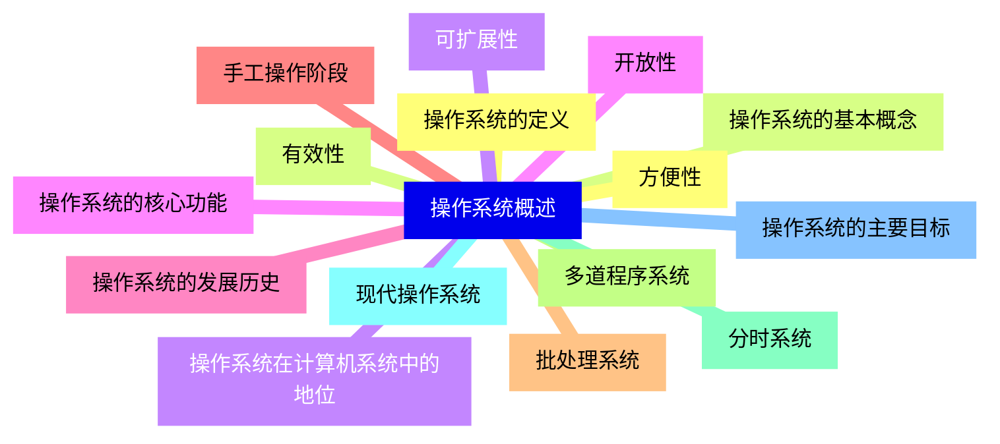
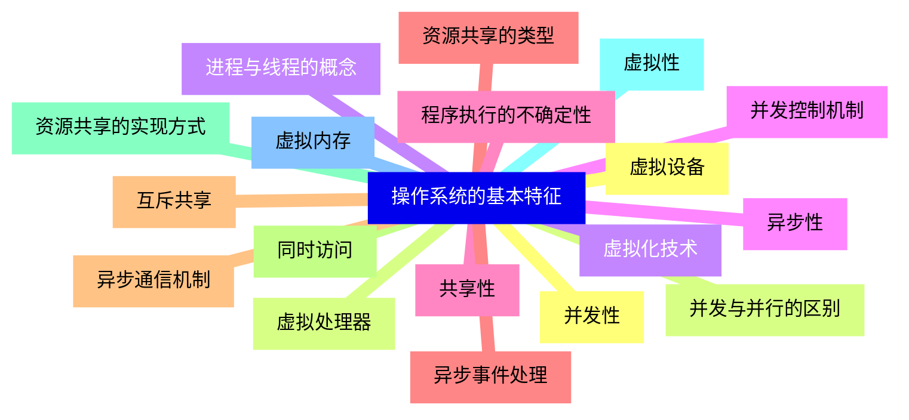
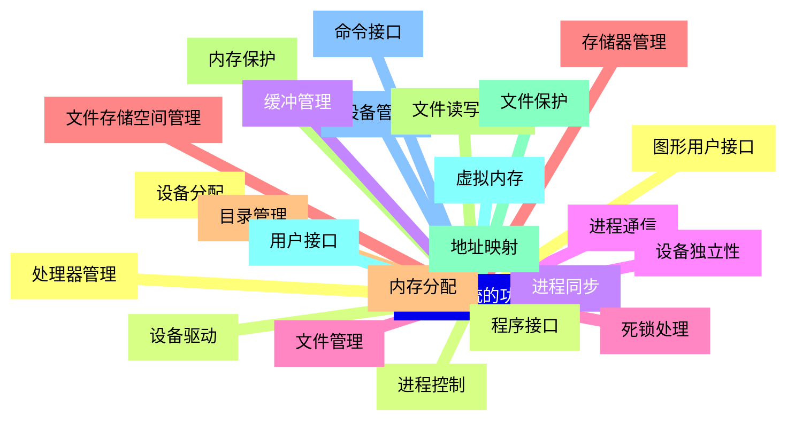
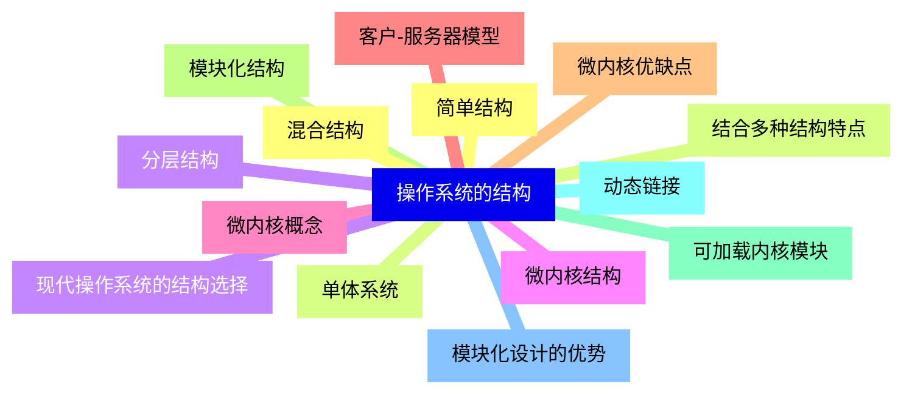
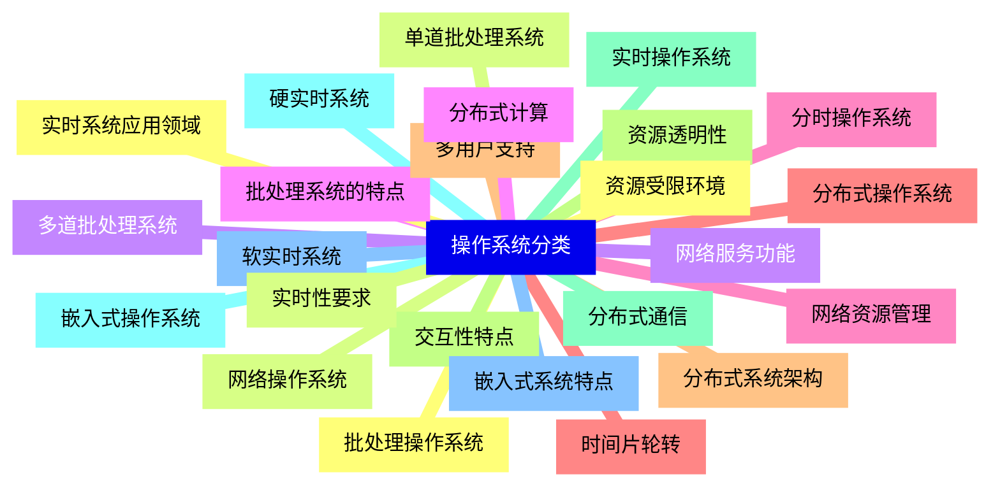
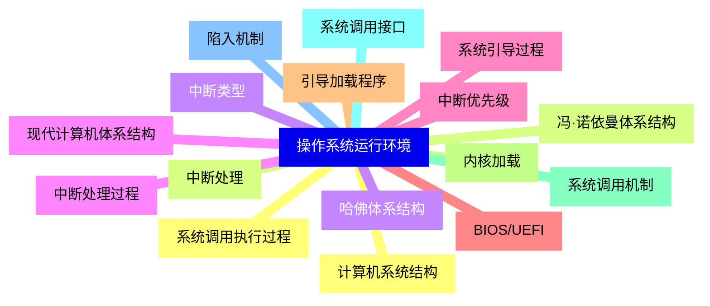
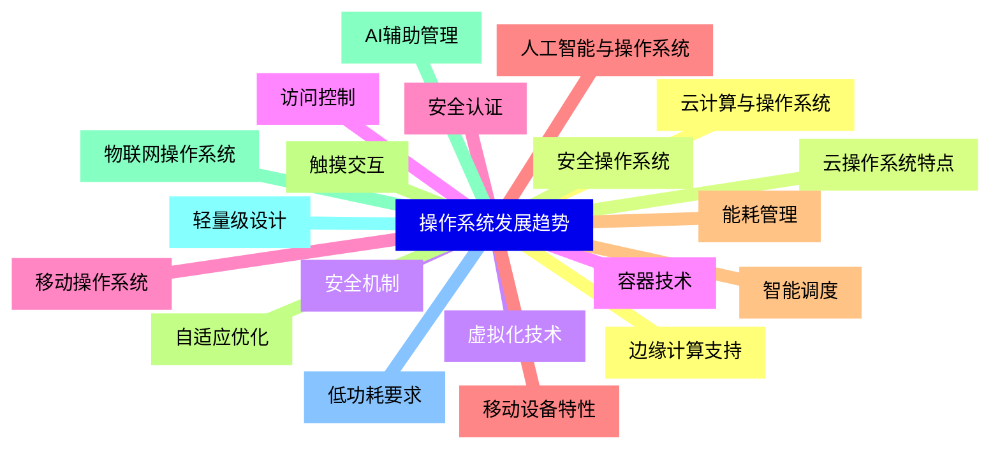


### 1 [操作系统概述](#1)
#### 1.1 [操作系统的定义](#1)
#### 1.2 [操作系统的基本概念](#1)
#### 1.3 [操作系统在计算机系统中的地位](#1)
#### 1.4 [操作系统的核心功能](#1)
#### 1.5 [操作系统的发展历史](#1)
#### 1.6 [手工操作阶段](#1)
#### 1.7 [批处理系统](#1)
#### 1.8 [多道程序系统](#1)
#### 1.9 [分时系统](#1)
#### 1.10 [现代操作系统](#1)
#### 1.11 [操作系统的主要目标](#1)
#### 1.12 [方便性](#1)
#### 1.13 [有效性](#1)
#### 1.14 [可扩展性](#1)
#### 1.15 [开放性](#1)
### 2 [操作系统的基本特征](#2)
#### 2.1 [并发性](#2)
#### 2.2 [并发与并行的区别](#2)
#### 2.3 [进程与线程的概念](#2)
#### 2.4 [并发控制机制](#2)
#### 2.5 [共享性](#2)
#### 2.6 [资源共享的类型](#2)
#### 2.7 [互斥共享](#2)
#### 2.8 [同时访问](#2)
#### 2.9 [资源共享的实现方式](#2)
#### 2.10 [虚拟性](#2)
#### 2.11 [虚拟内存](#2)
#### 2.12 [虚拟设备](#2)
#### 2.13 [虚拟处理器](#2)
#### 2.14 [虚拟化技术](#2)
#### 2.15 [异步性](#2)
#### 2.16 [程序执行的不确定性](#2)
#### 2.17 [异步事件处理](#2)
#### 2.18 [异步通信机制](#2)
### 3 [操作系统的功能](#3)
#### 3.1 [处理器管理](#3)
#### 3.2 [进程控制](#3)
#### 3.3 [进程同步](#3)
#### 3.4 [进程通信](#3)
#### 3.5 [死锁处理](#3)
#### 3.6 [存储器管理](#3)
#### 3.7 [内存分配](#3)
#### 3.8 [内存保护](#3)
#### 3.9 [地址映射](#3)
#### 3.10 [虚拟内存](#3)
#### 3.11 [设备管理](#3)
#### 3.12 [设备分配](#3)
#### 3.13 [设备驱动](#3)
#### 3.14 [缓冲管理](#3)
#### 3.15 [设备独立性](#3)
#### 3.16 [文件管理](#3)
#### 3.17 [文件存储空间管理](#3)
#### 3.18 [目录管理](#3)
#### 3.19 [文件读写管理](#3)
#### 3.20 [文件保护](#3)
#### 3.21 [用户接口](#3)
#### 3.22 [命令接口](#3)
#### 3.23 [图形用户接口](#3)
#### 3.24 [程序接口](#3)
### 4 [操作系统的结构](#4)
#### 4.1 [简单结构](#4)
#### 4.2 [单体系统](#4)
#### 4.3 [分层结构](#4)
#### 4.4 [微内核结构](#4)
#### 4.5 [微内核概念](#4)
#### 4.6 [客户-服务器模型](#4)
#### 4.7 [微内核优缺点](#4)
#### 4.8 [模块化结构](#4)
#### 4.9 [可加载内核模块](#4)
#### 4.10 [动态链接](#4)
#### 4.11 [模块化设计的优势](#4)
#### 4.12 [混合结构](#4)
#### 4.13 [结合多种结构特点](#4)
#### 4.14 [现代操作系统的结构选择](#4)
### 5 [操作系统分类](#5)
#### 5.1 [批处理操作系统](#5)
#### 5.2 [单道批处理系统](#5)
#### 5.3 [多道批处理系统](#5)
#### 5.4 [批处理系统的特点](#5)
#### 5.5 [分时操作系统](#5)
#### 5.6 [时间片轮转](#5)
#### 5.7 [多用户支持](#5)
#### 5.8 [交互性特点](#5)
#### 5.9 [实时操作系统](#5)
#### 5.10 [硬实时系统](#5)
#### 5.11 [软实时系统](#5)
#### 5.12 [实时系统应用领域](#5)
#### 5.13 [网络操作系统](#5)
#### 5.14 [网络服务功能](#5)
#### 5.15 [分布式计算](#5)
#### 5.16 [网络资源管理](#5)
#### 5.17 [分布式操作系统](#5)
#### 5.18 [分布式系统架构](#5)
#### 5.19 [资源透明性](#5)
#### 5.20 [分布式通信](#5)
#### 5.21 [嵌入式操作系统](#5)
#### 5.22 [嵌入式系统特点](#5)
#### 5.23 [资源受限环境](#5)
#### 5.24 [实时性要求](#5)
### 6 [操作系统运行环境](#6)
#### 6.1 [计算机系统结构](#6)
#### 6.2 [冯·诺依曼体系结构](#6)
#### 6.3 [哈佛体系结构](#6)
#### 6.4 [现代计算机体系结构](#6)
#### 6.5 [系统引导过程](#6)
#### 6.6 [BIOS/UEFI](#6)
#### 6.7 [引导加载程序](#6)
#### 6.8 [内核加载](#6)
#### 6.9 [系统调用机制](#6)
#### 6.10 [系统调用接口](#6)
#### 6.11 [陷入机制](#6)
#### 6.12 [系统调用执行过程](#6)
#### 6.13 [中断处理](#6)
#### 6.14 [中断类型](#6)
#### 6.15 [中断处理过程](#6)
#### 6.16 [中断优先级](#6)
### 7 [操作系统发展趋势](#7)
#### 7.1 [云计算与操作系统](#7)
#### 7.2 [云操作系统特点](#7)
#### 7.3 [虚拟化技术](#7)
#### 7.4 [容器技术](#7)
#### 7.5 [移动操作系统](#7)
#### 7.6 [移动设备特性](#7)
#### 7.7 [能耗管理](#7)
#### 7.8 [触摸交互](#7)
#### 7.9 [物联网操作系统](#7)
#### 7.10 [轻量级设计](#7)
#### 7.11 [低功耗要求](#7)
#### 7.12 [边缘计算支持](#7)
#### 7.13 [安全操作系统](#7)
#### 7.14 [安全机制](#7)
#### 7.15 [访问控制](#7)
#### 7.16 [安全认证](#7)
#### 7.17 [人工智能与操作系统](#7)
#### 7.18 [智能调度](#7)
#### 7.19 [自适应优化](#7)
#### 7.20 [AI辅助管理](#7)




### 1 操作系统概述

---
### 1 操作系统概述
___
#### 1.1 操作系统的定义
___
#### 1.2 操作系统的基本概念
___
#### 1.3 操作系统在计算机系统中的地位
___
#### 1.4 操作系统的核心功能
___
#### 1.5 操作系统的发展历史
___
#### 1.6 手工操作阶段
___
#### 1.7 批处理系统
___
#### 1.8 多道程序系统
___
#### 1.9 分时系统
___
#### 1.10 现代操作系统
___
#### 1.11 操作系统的主要目标
___
#### 1.12 方便性
___
#### 1.13 有效性
___
#### 1.14 可扩展性
___
#### 1.15 开放性
### 2 操作系统的基本特征

---
### 2 操作系统的基本特征
___
#### 2.1 并发性
___
#### 2.2 并发与并行的区别
___
#### 2.3 进程与线程的概念
___
#### 2.4 并发控制机制
___
#### 2.5 共享性
___
#### 2.6 资源共享的类型
___
#### 2.7 互斥共享
___
#### 2.8 同时访问
___
#### 2.9 资源共享的实现方式
___
#### 2.10 虚拟性
___
#### 2.11 虚拟内存
___
#### 2.12 虚拟设备
___
#### 2.13 虚拟处理器
___
#### 2.14 虚拟化技术
___
#### 2.15 异步性
___
#### 2.16 程序执行的不确定性
___
#### 2.17 异步事件处理
___
#### 2.18 异步通信机制
### 3 操作系统的功能

---
### 3 操作系统的功能
___
#### 3.1 处理器管理
___
#### 3.2 进程控制
___
#### 3.3 进程同步
___
#### 3.4 进程通信
___
#### 3.5 死锁处理
___
#### 3.6 存储器管理
___
#### 3.7 内存分配
___
#### 3.8 内存保护
___
#### 3.9 地址映射
___
#### 3.10 虚拟内存
___
#### 3.11 设备管理
___
#### 3.12 设备分配
___
#### 3.13 设备驱动
___
#### 3.14 缓冲管理
___
#### 3.15 设备独立性
___
#### 3.16 文件管理
___
#### 3.17 文件存储空间管理
___
#### 3.18 目录管理
___
#### 3.19 文件读写管理
___
#### 3.20 文件保护
___
#### 3.21 用户接口
___
#### 3.22 命令接口
___
#### 3.23 图形用户接口
___
#### 3.24 程序接口
### 4 操作系统的结构

---
### 4 操作系统的结构
___
#### 4.1 简单结构
___
#### 4.2 单体系统
___
#### 4.3 分层结构
___
#### 4.4 微内核结构
___
#### 4.5 微内核概念
___
#### 4.6 客户-服务器模型
___
#### 4.7 微内核优缺点
___
#### 4.8 模块化结构
___
#### 4.9 可加载内核模块
___
#### 4.10 动态链接
___
#### 4.11 模块化设计的优势
___
#### 4.12 混合结构
___
#### 4.13 结合多种结构特点
___
#### 4.14 现代操作系统的结构选择
### 5 操作系统分类

---
### 5 操作系统分类
___
#### 5.1 批处理操作系统
___
#### 5.2 单道批处理系统
___
#### 5.3 多道批处理系统
___
#### 5.4 批处理系统的特点
___
#### 5.5 分时操作系统
___
#### 5.6 时间片轮转
___
#### 5.7 多用户支持
___
#### 5.8 交互性特点
___
#### 5.9 实时操作系统
___
#### 5.10 硬实时系统
___
#### 5.11 软实时系统
___
#### 5.12 实时系统应用领域
___
#### 5.13 网络操作系统
___
#### 5.14 网络服务功能
___
#### 5.15 分布式计算
___
#### 5.16 网络资源管理
___
#### 5.17 分布式操作系统
___
#### 5.18 分布式系统架构
___
#### 5.19 资源透明性
___
#### 5.20 分布式通信
___
#### 5.21 嵌入式操作系统
___
#### 5.22 嵌入式系统特点
___
#### 5.23 资源受限环境
___
#### 5.24 实时性要求
### 6 操作系统运行环境

---
### 6 操作系统运行环境
___
#### 6.1 计算机系统结构
___
#### 6.2 冯·诺依曼体系结构
___
#### 6.3 哈佛体系结构
___
#### 6.4 现代计算机体系结构
___
#### 6.5 系统引导过程
___
#### 6.6 BIOS/UEFI
___
#### 6.7 引导加载程序
___
#### 6.8 内核加载
___
#### 6.9 系统调用机制
___
#### 6.10 系统调用接口
___
#### 6.11 陷入机制
___
#### 6.12 系统调用执行过程
___
#### 6.13 中断处理
___
#### 6.14 中断类型
___
#### 6.15 中断处理过程
___
#### 6.16 中断优先级
### 7 操作系统发展趋势

---
### 7 操作系统发展趋势
___
#### 7.1 云计算与操作系统
___
#### 7.2 云操作系统特点
___
#### 7.3 虚拟化技术
___
#### 7.4 容器技术
___
#### 7.5 移动操作系统
___
#### 7.6 移动设备特性
___
#### 7.7 能耗管理
___
#### 7.8 触摸交互
___
#### 7.9 物联网操作系统
___
#### 7.10 轻量级设计
___
#### 7.11 低功耗要求
___
#### 7.12 边缘计算支持
___
#### 7.13 安全操作系统
___
#### 7.14 安全机制
___
#### 7.15 访问控制
___
#### 7.16 安全认证
___
#### 7.17 人工智能与操作系统
___
#### 7.18 智能调度
___
#### 7.19 自适应优化
___
#### 7.20 AI辅助管理


### 1 操作系统概述{#1}

{}

<--->
{}
{}
{}
{}
{}
{}
{}
{}
{}
{}
{}
{}
{}
{}
{}
{}
{}
{}
{}
{}
{}
{}
{}
{}
{}
{}
{}
{}
{}
{}
{}

### 2 操作系统的基本特征{#2}

{}
{}
{}
{}
{}
{}
{}
{}
{}
{}
{}
{}
{}
{}
{}
{}
{}
{}
{}
{}
{}
{}
{}
{}
{}
{}
{}
{}
{}
{}
{}
{}
{}
{}
{}
{}
{}
<--->

{}

### 3 操作系统的功能{#3}

{}

<--->
{}
{}
{}
{}
{}
{}
{}
{}
{}
{}
{}
{}
{}
{}
{}
{}
{}
{}
{}
{}
{}
{}
{}
{}
{}
{}
{}
{}
{}
{}
{}
{}
{}
{}
{}
{}
{}
{}
{}
{}
{}
{}
{}
{}
{}
{}
{}
{}
{}

### 4 操作系统的结构{#4}

{}
{}
{}
{}
{}
{}
{}
{}
{}
{}
{}
{}
{}
{}
{}
{}
{}
{}
{}
{}
{}
{}
{}
{}
{}
{}
{}
{}
{}
<--->

{}

### 5 操作系统分类{#5}

{}

<--->
{}
{}
{}
{}
{}
{}
{}
{}
{}
{}
{}
{}
{}
{}
{}
{}
{}
{}
{}
{}
{}
{}
{}
{}
{}
{}
{}
{}
{}
{}
{}
{}
{}
{}
{}
{}
{}
{}
{}
{}
{}
{}
{}
{}
{}
{}
{}
{}
{}

### 6 操作系统运行环境{#6}

{}
{}
{}
{}
{}
{}
{}
{}
{}
{}
{}
{}
{}
{}
{}
{}
{}
{}
{}
{}
{}
{}
{}
{}
{}
{}
{}
{}
{}
{}
{}
{}
{}
<--->

{}

### 7 操作系统发展趋势{#7}

{}

<--->
{}
{}
{}
{}
{}
{}
{}
{}
{}
{}
{}
{}
{}
{}
{}
{}
{}
{}
{}
{}
{}
{}
{}
{}
{}
{}
{}
{}
{}
{}
{}
{}
{}
{}
{}
{}
{}
{}
{}
{}
{}
