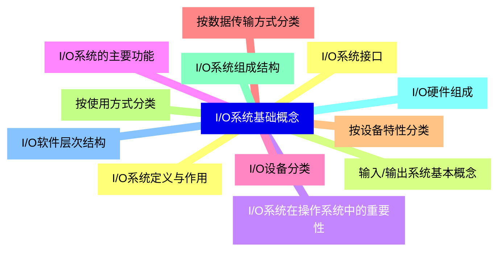
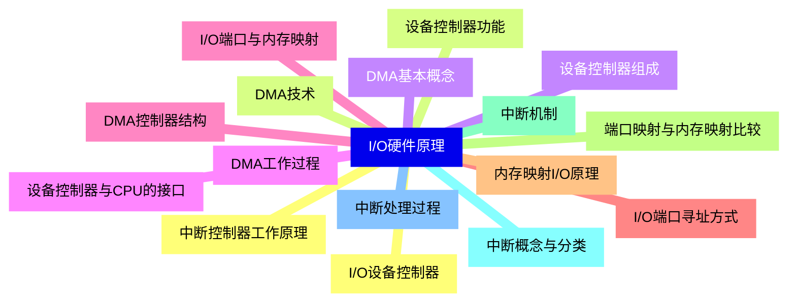
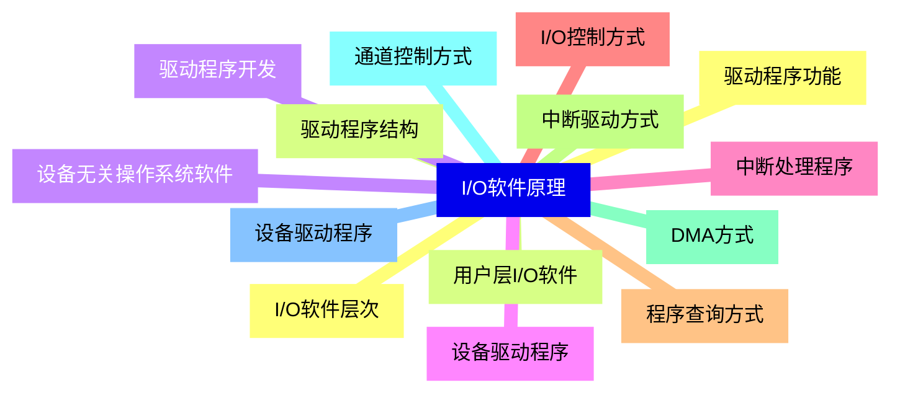
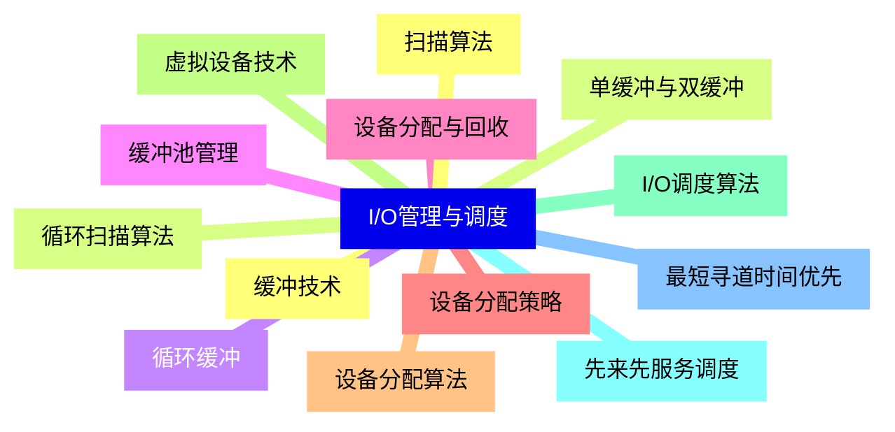
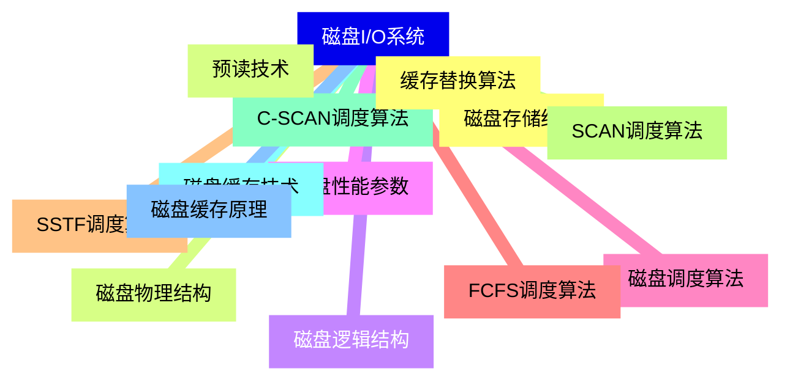
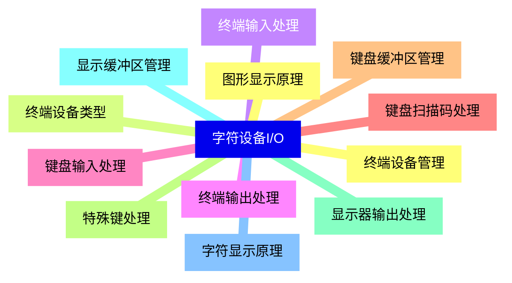
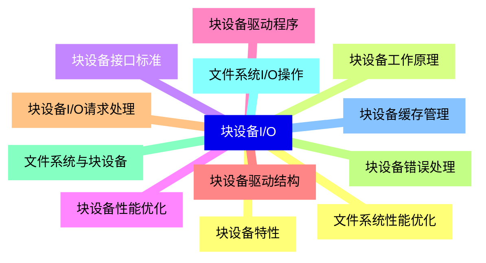
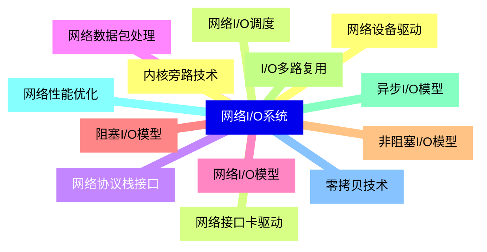
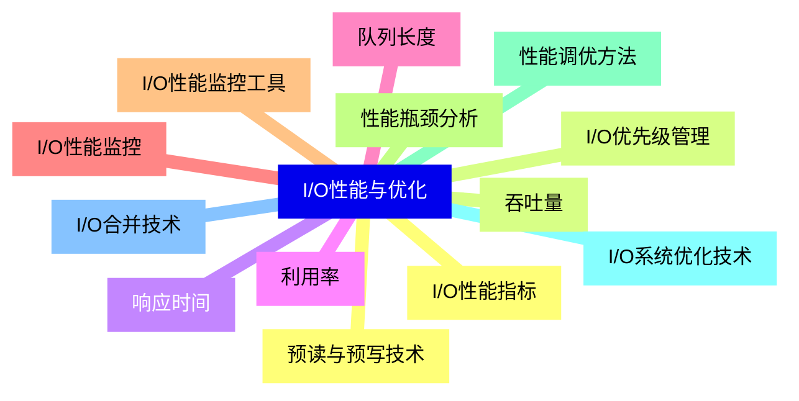
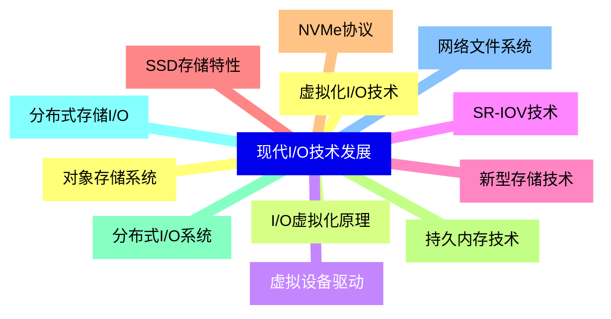


### 1 [I/O系统基础概念](#1)
#### 1.1 [I/O系统定义与作用](#1)
#### 1.2 [输入/输出系统基本概念](#1)
#### 1.3 [I/O系统在操作系统中的重要性](#1)
#### 1.4 [I/O系统的主要功能](#1)
#### 1.5 [I/O设备分类](#1)
#### 1.6 [按数据传输方式分类](#1)
#### 1.7 [按设备特性分类](#1)
#### 1.8 [按使用方式分类](#1)
#### 1.9 [I/O系统组成结构](#1)
#### 1.10 [I/O硬件组成](#1)
#### 1.11 [I/O软件层次结构](#1)
#### 1.12 [I/O系统接口](#1)
### 2 [I/O硬件原理](#2)
#### 2.1 [I/O设备控制器](#2)
#### 2.2 [设备控制器功能](#2)
#### 2.3 [设备控制器组成](#2)
#### 2.4 [设备控制器与CPU的接口](#2)
#### 2.5 [I/O端口与内存映射](#2)
#### 2.6 [I/O端口寻址方式](#2)
#### 2.7 [内存映射I/O原理](#2)
#### 2.8 [端口映射与内存映射比较](#2)
#### 2.9 [中断机制](#2)
#### 2.10 [中断概念与分类](#2)
#### 2.11 [中断处理过程](#2)
#### 2.12 [中断控制器工作原理](#2)
#### 2.13 [DMA技术](#2)
#### 2.14 [DMA基本概念](#2)
#### 2.15 [DMA工作过程](#2)
#### 2.16 [DMA控制器结构](#2)
### 3 [I/O软件原理](#3)
#### 3.1 [I/O软件层次](#3)
#### 3.2 [用户层I/O软件](#3)
#### 3.3 [设备无关操作系统软件](#3)
#### 3.4 [设备驱动程序](#3)
#### 3.5 [中断处理程序](#3)
#### 3.6 [I/O控制方式](#3)
#### 3.7 [程序查询方式](#3)
#### 3.8 [中断驱动方式](#3)
#### 3.9 [DMA方式](#3)
#### 3.10 [通道控制方式](#3)
#### 3.11 [设备驱动程序](#3)
#### 3.12 [驱动程序功能](#3)
#### 3.13 [驱动程序结构](#3)
#### 3.14 [驱动程序开发](#3)
### 4 [I/O管理与调度](#4)
#### 4.1 [缓冲技术](#4)
#### 4.2 [单缓冲与双缓冲](#4)
#### 4.3 [循环缓冲](#4)
#### 4.4 [缓冲池管理](#4)
#### 4.5 [设备分配与回收](#4)
#### 4.6 [设备分配策略](#4)
#### 4.7 [设备分配算法](#4)
#### 4.8 [虚拟设备技术](#4)
#### 4.9 [I/O调度算法](#4)
#### 4.10 [先来先服务调度](#4)
#### 4.11 [最短寻道时间优先](#4)
#### 4.12 [扫描算法](#4)
#### 4.13 [循环扫描算法](#4)
### 5 [磁盘I/O系统](#5)
#### 5.1 [磁盘存储结构](#5)
#### 5.2 [磁盘物理结构](#5)
#### 5.3 [磁盘逻辑结构](#5)
#### 5.4 [磁盘性能参数](#5)
#### 5.5 [磁盘调度算法](#5)
#### 5.6 [FCFS调度算法](#5)
#### 5.7 [SSTF调度算法](#5)
#### 5.8 [SCAN调度算法](#5)
#### 5.9 [C-SCAN调度算法](#5)
#### 5.10 [磁盘缓存技术](#5)
#### 5.11 [磁盘缓存原理](#5)
#### 5.12 [缓存替换算法](#5)
#### 5.13 [预读技术](#5)
### 6 [字符设备I/O](#6)
#### 6.1 [终端设备管理](#6)
#### 6.2 [终端设备类型](#6)
#### 6.3 [终端输入处理](#6)
#### 6.4 [终端输出处理](#6)
#### 6.5 [键盘输入处理](#6)
#### 6.6 [键盘扫描码处理](#6)
#### 6.7 [键盘缓冲区管理](#6)
#### 6.8 [特殊键处理](#6)
#### 6.9 [显示器输出处理](#6)
#### 6.10 [显示缓冲区管理](#6)
#### 6.11 [字符显示原理](#6)
#### 6.12 [图形显示原理](#6)
### 7 [块设备I/O](#7)
#### 7.1 [块设备特性](#7)
#### 7.2 [块设备工作原理](#7)
#### 7.3 [块设备接口标准](#7)
#### 7.4 [块设备性能优化](#7)
#### 7.5 [块设备驱动程序](#7)
#### 7.6 [块设备驱动结构](#7)
#### 7.7 [块设备I/O请求处理](#7)
#### 7.8 [块设备错误处理](#7)
#### 7.9 [文件系统与块设备](#7)
#### 7.10 [文件系统I/O操作](#7)
#### 7.11 [块设备缓存管理](#7)
#### 7.12 [文件系统性能优化](#7)
### 8 [网络I/O系统](#8)
#### 8.1 [网络设备驱动](#8)
#### 8.2 [网络接口卡驱动](#8)
#### 8.3 [网络协议栈接口](#8)
#### 8.4 [网络数据包处理](#8)
#### 8.5 [网络I/O模型](#8)
#### 8.6 [阻塞I/O模型](#8)
#### 8.7 [非阻塞I/O模型](#8)
#### 8.8 [I/O多路复用](#8)
#### 8.9 [异步I/O模型](#8)
#### 8.10 [网络性能优化](#8)
#### 8.11 [零拷贝技术](#8)
#### 8.12 [内核旁路技术](#8)
#### 8.13 [网络I/O调度](#8)
### 9 [I/O性能与优化](#9)
#### 9.1 [I/O性能指标](#9)
#### 9.2 [吞吐量](#9)
#### 9.3 [响应时间](#9)
#### 9.4 [利用率](#9)
#### 9.5 [队列长度](#9)
#### 9.6 [I/O性能监控](#9)
#### 9.7 [I/O性能监控工具](#9)
#### 9.8 [性能瓶颈分析](#9)
#### 9.9 [性能调优方法](#9)
#### 9.10 [I/O系统优化技术](#9)
#### 9.11 [I/O合并技术](#9)
#### 9.12 [预读与预写技术](#9)
#### 9.13 [I/O优先级管理](#9)
### 10 [现代I/O技术发展](#10)
#### 10.1 [虚拟化I/O技术](#10)
#### 10.2 [I/O虚拟化原理](#10)
#### 10.3 [虚拟设备驱动](#10)
#### 10.4 [SR-IOV技术](#10)
#### 10.5 [新型存储技术](#10)
#### 10.6 [SSD存储特性](#10)
#### 10.7 [NVMe协议](#10)
#### 10.8 [持久内存技术](#10)
#### 10.9 [分布式I/O系统](#10)
#### 10.10 [分布式存储I/O](#10)
#### 10.11 [网络文件系统](#10)
#### 10.12 [对象存储系统](#10)




### 1 I/O系统基础概念

---
### 1 I/O系统基础概念
___
#### 1.1 I/O系统定义与作用
___
#### 1.2 输入/输出系统基本概念
___
#### 1.3 I/O系统在操作系统中的重要性
___
#### 1.4 I/O系统的主要功能
___
#### 1.5 I/O设备分类
___
#### 1.6 按数据传输方式分类
___
#### 1.7 按设备特性分类
___
#### 1.8 按使用方式分类
___
#### 1.9 I/O系统组成结构
___
#### 1.10 I/O硬件组成
___
#### 1.11 I/O软件层次结构
___
#### 1.12 I/O系统接口
### 2 I/O硬件原理

---
### 2 I/O硬件原理
___
#### 2.1 I/O设备控制器
___
#### 2.2 设备控制器功能
___
#### 2.3 设备控制器组成
___
#### 2.4 设备控制器与CPU的接口
___
#### 2.5 I/O端口与内存映射
___
#### 2.6 I/O端口寻址方式
___
#### 2.7 内存映射I/O原理
___
#### 2.8 端口映射与内存映射比较
___
#### 2.9 中断机制
___
#### 2.10 中断概念与分类
___
#### 2.11 中断处理过程
___
#### 2.12 中断控制器工作原理
___
#### 2.13 DMA技术
___
#### 2.14 DMA基本概念
___
#### 2.15 DMA工作过程
___
#### 2.16 DMA控制器结构
### 3 I/O软件原理

---
### 3 I/O软件原理
___
#### 3.1 I/O软件层次
___
#### 3.2 用户层I/O软件
___
#### 3.3 设备无关操作系统软件
___
#### 3.4 设备驱动程序
___
#### 3.5 中断处理程序
___
#### 3.6 I/O控制方式
___
#### 3.7 程序查询方式
___
#### 3.8 中断驱动方式
___
#### 3.9 DMA方式
___
#### 3.10 通道控制方式
___
#### 3.11 设备驱动程序
___
#### 3.12 驱动程序功能
___
#### 3.13 驱动程序结构
___
#### 3.14 驱动程序开发
### 4 I/O管理与调度

---
### 4 I/O管理与调度
___
#### 4.1 缓冲技术
___
#### 4.2 单缓冲与双缓冲
___
#### 4.3 循环缓冲
___
#### 4.4 缓冲池管理
___
#### 4.5 设备分配与回收
___
#### 4.6 设备分配策略
___
#### 4.7 设备分配算法
___
#### 4.8 虚拟设备技术
___
#### 4.9 I/O调度算法
___
#### 4.10 先来先服务调度
___
#### 4.11 最短寻道时间优先
___
#### 4.12 扫描算法
___
#### 4.13 循环扫描算法
### 5 磁盘I/O系统

---
### 5 磁盘I/O系统
___
#### 5.1 磁盘存储结构
___
#### 5.2 磁盘物理结构
___
#### 5.3 磁盘逻辑结构
___
#### 5.4 磁盘性能参数
___
#### 5.5 磁盘调度算法
___
#### 5.6 FCFS调度算法
___
#### 5.7 SSTF调度算法
___
#### 5.8 SCAN调度算法
___
#### 5.9 C-SCAN调度算法
___
#### 5.10 磁盘缓存技术
___
#### 5.11 磁盘缓存原理
___
#### 5.12 缓存替换算法
___
#### 5.13 预读技术
### 6 字符设备I/O

---
### 6 字符设备I/O
___
#### 6.1 终端设备管理
___
#### 6.2 终端设备类型
___
#### 6.3 终端输入处理
___
#### 6.4 终端输出处理
___
#### 6.5 键盘输入处理
___
#### 6.6 键盘扫描码处理
___
#### 6.7 键盘缓冲区管理
___
#### 6.8 特殊键处理
___
#### 6.9 显示器输出处理
___
#### 6.10 显示缓冲区管理
___
#### 6.11 字符显示原理
___
#### 6.12 图形显示原理
### 7 块设备I/O

---
### 7 块设备I/O
___
#### 7.1 块设备特性
___
#### 7.2 块设备工作原理
___
#### 7.3 块设备接口标准
___
#### 7.4 块设备性能优化
___
#### 7.5 块设备驱动程序
___
#### 7.6 块设备驱动结构
___
#### 7.7 块设备I/O请求处理
___
#### 7.8 块设备错误处理
___
#### 7.9 文件系统与块设备
___
#### 7.10 文件系统I/O操作
___
#### 7.11 块设备缓存管理
___
#### 7.12 文件系统性能优化
### 8 网络I/O系统

---
### 8 网络I/O系统
___
#### 8.1 网络设备驱动
___
#### 8.2 网络接口卡驱动
___
#### 8.3 网络协议栈接口
___
#### 8.4 网络数据包处理
___
#### 8.5 网络I/O模型
___
#### 8.6 阻塞I/O模型
___
#### 8.7 非阻塞I/O模型
___
#### 8.8 I/O多路复用
___
#### 8.9 异步I/O模型
___
#### 8.10 网络性能优化
___
#### 8.11 零拷贝技术
___
#### 8.12 内核旁路技术
___
#### 8.13 网络I/O调度
### 9 I/O性能与优化

---
### 9 I/O性能与优化
___
#### 9.1 I/O性能指标
___
#### 9.2 吞吐量
___
#### 9.3 响应时间
___
#### 9.4 利用率
___
#### 9.5 队列长度
___
#### 9.6 I/O性能监控
___
#### 9.7 I/O性能监控工具
___
#### 9.8 性能瓶颈分析
___
#### 9.9 性能调优方法
___
#### 9.10 I/O系统优化技术
___
#### 9.11 I/O合并技术
___
#### 9.12 预读与预写技术
___
#### 9.13 I/O优先级管理
### 10 现代I/O技术发展

---
### 10 现代I/O技术发展
___
#### 10.1 虚拟化I/O技术
___
#### 10.2 I/O虚拟化原理
___
#### 10.3 虚拟设备驱动
___
#### 10.4 SR-IOV技术
___
#### 10.5 新型存储技术
___
#### 10.6 SSD存储特性
___
#### 10.7 NVMe协议
___
#### 10.8 持久内存技术
___
#### 10.9 分布式I/O系统
___
#### 10.10 分布式存储I/O
___
#### 10.11 网络文件系统
___
#### 10.12 对象存储系统


### 1 I/O系统基础概念{#1}

{}

<--->
{}
{}
{}
{}
{}
{}
{}
{}
{}
{}
{}
{}
{}
{}
{}
{}
{}
{}
{}
{}
{}
{}
{}
{}
{}

### 2 I/O硬件原理{#2}

{}
{}
{}
{}
{}
{}
{}
{}
{}
{}
{}
{}
{}
{}
{}
{}
{}
{}
{}
{}
{}
{}
{}
{}
{}
{}
{}
{}
{}
{}
{}
{}
{}
<--->

{}

### 3 I/O软件原理{#3}

{}

<--->
{}
{}
{}
{}
{}
{}
{}
{}
{}
{}
{}
{}
{}
{}
{}
{}
{}
{}
{}
{}
{}
{}
{}
{}
{}
{}
{}
{}
{}

### 4 I/O管理与调度{#4}

{}
{}
{}
{}
{}
{}
{}
{}
{}
{}
{}
{}
{}
{}
{}
{}
{}
{}
{}
{}
{}
{}
{}
{}
{}
{}
{}
<--->

{}

### 5 磁盘I/O系统{#5}

{}

<--->
{}
{}
{}
{}
{}
{}
{}
{}
{}
{}
{}
{}
{}
{}
{}
{}
{}
{}
{}
{}
{}
{}
{}
{}
{}
{}
{}

### 6 字符设备I/O{#6}

{}
{}
{}
{}
{}
{}
{}
{}
{}
{}
{}
{}
{}
{}
{}
{}
{}
{}
{}
{}
{}
{}
{}
{}
{}
<--->

{}

### 7 块设备I/O{#7}

{}

<--->
{}
{}
{}
{}
{}
{}
{}
{}
{}
{}
{}
{}
{}
{}
{}
{}
{}
{}
{}
{}
{}
{}
{}
{}
{}

### 8 网络I/O系统{#8}

{}
{}
{}
{}
{}
{}
{}
{}
{}
{}
{}
{}
{}
{}
{}
{}
{}
{}
{}
{}
{}
{}
{}
{}
{}
{}
{}
<--->

{}

### 9 I/O性能与优化{#9}

{}

<--->
{}
{}
{}
{}
{}
{}
{}
{}
{}
{}
{}
{}
{}
{}
{}
{}
{}
{}
{}
{}
{}
{}
{}
{}
{}
{}
{}

### 10 现代I/O技术发展{#10}

{}
{}
{}
{}
{}
{}
{}
{}
{}
{}
{}
{}
{}
{}
{}
{}
{}
{}
{}
{}
{}
{}
{}
{}
{}
<--->

{}
