
### 1 [I/O 系统概述](#1)
#### 1.1 [I/O 系统的基本概念](#1)
#### 1.2 [输入/输出定义与作用](#1)
#### 1.3 [I/O 设备分类与特性](#1)
#### 1.4 [I/O 系统组成结构](#1)
#### 1.5 [I/O 性能指标与评价标准](#1)
#### 1.6 [I/O 硬件基础](#1)
#### 1.7 [设备控制器功能与结构](#1)
#### 1.8 [I/O 端口与内存映射I/O](#1)
#### 1.9 [直接内存访问 DMA 原理](#1)
#### 1.10 [中断机制与中断处理](#1)
#### 1.11 [I/O 软件目标与原则](#1)
#### 1.12 [设备独立性](#1)
#### 1.13 [统一命名空间](#1)
#### 1.14 [错误处理机制](#1)
#### 1.15 [同步与异步I/O](#1)
#### 1.16 [缓冲技术原理](#1)
### 2 [I/O 控制方式](#2)
#### 2.1 [程序控制I/O](#2)
#### 2.2 [轮询方式工作原理](#2)
#### 2.3 [忙等待机制](#2)
#### 2.4 [程序控制I/O优缺点](#2)
#### 2.5 [适用场景分析](#2)
#### 2.6 [中断驱动I/O](#2)
#### 2.7 [中断处理流程](#2)
#### 2.8 [中断向量表](#2)
#### 2.9 [中断优先级](#2)
#### 2.10 [中断屏蔽与使能](#2)
#### 2.11 [中断驱动I/O性能分析](#2)
#### 2.12 [直接内存访问](#2)
#### 2.13 [DMA控制器结构](#2)
#### 2.14 [DMA传输过程](#2)
#### 2.15 [周期窃取机制](#2)
#### 2.16 [DMA与处理器协同工作](#2)
#### 2.17 [DMA缓冲区管理](#2)
### 3 [I/O 软件层次结构](#3)
#### 3.1 [中断处理程序](#3)
#### 3.2 [中断服务例程设计](#3)
#### 3.3 [上下文保存与恢复](#3)
#### 3.4 [中断嵌套处理](#3)
#### 3.5 [中断共享机制](#3)
#### 3.6 [设备驱动程序](#3)
#### 3.7 [驱动程序架构](#3)
#### 3.8 [设备初始化与注销](#3)
#### 3.9 [I/O请求处理](#3)
#### 3.10 [设备状态管理](#3)
#### 3.11 [驱动程序接口标准](#3)
#### 3.12 [设备独立层](#3)
#### 3.13 [设备命名与映射](#3)
#### 3.14 [设备保护机制](#3)
#### 3.15 [缓冲管理策略](#3)
#### 3.16 [错误报告与恢复](#3)
#### 3.17 [资源分配与调度](#3)
#### 3.18 [用户空间I/O库](#3)
#### 3.19 [系统调用封装](#3)
#### 3.20 [标准I/O函数](#3)
#### 3.21 [格式化I/O处理](#3)
#### 3.22 [错误代码处理](#3)
#### 3.23 [性能优化接口](#3)
### 4 [I/O 核心子系统](#4)
#### 4.1 [I/O 调度算法](#4)
#### 4.2 [先来先服务调度](#4)
#### 4.3 [最短寻道时间优先](#4)
#### 4.4 [电梯算法 SCAN](#4)
#### 4.5 [循环扫描 C-SCAN](#4)
#### 4.6 [预期调度算法](#4)
#### 4.7 [调度算法性能比较](#4)
#### 4.8 [缓冲管理](#4)
#### 4.9 [单缓冲与双缓冲](#4)
#### 4.10 [循环缓冲](#4)
#### 4.11 [缓冲池管理](#4)
#### 4.12 [缓存替换算法](#4)
#### 4.13 [预读与延迟写](#4)
#### 4.14 [假脱机技术](#4)
#### 4.15 [SPOOLING系统原理](#4)
#### 4.16 [输入井与输出井](#4)
#### 4.17 [假脱机进程管理](#4)
#### 4.18 [打印假脱机实现](#4)
#### 4.19 [网络假脱机应用](#4)
#### 4.20 [设备分配与回收](#4)
#### 4.21 [独占设备分配](#4)
#### 4.22 [共享设备管理](#4)
#### 4.23 [虚拟设备技术](#4)
#### 4.24 [死锁预防与避免](#4)
#### 4.25 [资源分配图](#4)
### 5 [磁盘I/O管理](#5)
#### 5.1 [磁盘存储结构](#5)
#### 5.2 [磁盘物理结构](#5)
#### 5.3 [磁道、扇区与柱面](#5)
#### 5.4 [磁盘格式化](#5)
#### 5.5 [磁盘性能参数](#5)
#### 5.6 [磁盘调度算法](#5)
#### 5.7 [FCFS调度算法](#5)
#### 5.8 [SSTF调度算法](#5)
#### 5.9 [SCAN调度算法](#5)
#### 5.10 [C-SCAN调度算法](#5)
#### 5.11 [LOOK与C-LOOK算法](#5)
#### 5.12 [现代磁盘调度策略](#5)
#### 5.13 [磁盘缓存](#5)
#### 5.14 [磁盘缓存原理](#5)
#### 5.15 [页面缓存机制](#5)
#### 5.16 [写回与写直达](#5)
#### 5.17 [缓存一致性](#5)
#### 5.18 [预取算法优化](#5)
#### 5.19 [RAID技术](#5)
#### 5.20 [RAID级别概述](#5)
#### 5.21 [数据条带化](#5)
#### 5.22 [奇偶校验技术](#5)
#### 5.23 [镜像与双工](#5)
#### 5.24 [RAID性能与可靠性](#5)
### 6 [字符设备I/O](#6)
#### 6.1 [终端设备管理](#6)
#### 6.2 [终端驱动程序](#6)
#### 6.3 [行规程处理](#6)
#### 6.4 [终端控制序列](#6)
#### 6.5 [终端属性设置](#6)
#### 6.6 [伪终端技术](#6)
#### 6.7 [串行端口I/O](#6)
#### 6.8 [串行通信协议](#6)
#### 6.9 [波特率与数据帧](#6)
#### 6.10 [流控制机制](#6)
#### 6.11 [串口缓冲区管理](#6)
#### 6.12 [现代串口应用](#6)
#### 6.13 [键盘与鼠标](#6)
#### 6.14 [键盘扫描码处理](#6)
#### 6.15 [鼠标事件处理](#6)
#### 6.16 [输入设备驱动](#6)
#### 6.17 [热键与快捷键](#6)
#### 6.18 [输入法框架](#6)
### 7 [块设备I/O](#7)
#### 7.1 [块设备驱动](#7)
#### 7.2 [块设备注册](#7)
#### 7.3 [请求队列管理](#7)
#### 7.4 [块I/O操作](#7)
#### 7.5 [设备映射机制](#7)
#### 7.6 [块设备性能优化](#7)
#### 7.7 [文件系统I/O](#7)
#### 7.8 [文件读写操作](#7)
#### 7.9 [文件缓存管理](#7)
#### 7.10 [元数据操作](#7)
#### 7.11 [日志文件系统](#7)
#### 7.12 [分布式文件系统I/O](#7)
#### 7.13 [虚拟内存与I/O](#7)
#### 7.14 [内存映射文件](#7)
#### 7.15 [页面换入换出](#7)
#### 7.16 [交换空间管理](#7)
#### 7.17 [缺页中断处理](#7)
#### 7.18 [I/O与内存管理交互](#7)
### 8 [网络I/O管理](#8)
#### 8.1 [网络设备驱动](#8)
#### 8.2 [网络接口卡驱动](#8)
#### 8.3 [数据包收发](#8)
#### 8.4 [中断合并技术](#8)
#### 8.5 [NAPI机制](#8)
#### 8.6 [现代网络驱动优化](#8)
#### 8.7 [协议栈I/O](#8)
#### 8.8 [套接字接口](#8)
#### 8.9 [协议处理流程](#8)
#### 8.10 [零拷贝技术](#8)
#### 8.11 [大页内存支持](#8)
#### 8.12 [网络I/O性能调优](#8)
#### 8.13 [异步网络I/O](#8)
#### 8.14 [select/poll机制](#8)
#### 8.15 [epoll模型](#8)
#### 8.16 [IOCP技术](#8)
#### 8.17 [异步I/O完成端口](#8)
#### 8.18 [高并发网络服务](#8)
### 9 [高级I/O技术](#9)
#### 9.1 [异步I/O](#9)
#### 9.2 [AIO接口规范](#9)
#### 9.3 [异步I/O实现机制](#9)
#### 9.4 [完成通知方式](#9)
#### 9.5 [异步I/O性能分析](#9)
#### 9.6 [实际应用场景](#9)
#### 9.7 [内存映射I/O](#9)
#### 9.8 [mmap系统调用](#9)
#### 9.9 [共享内存通信](#9)
#### 9.10 [内存映射文件](#9)
#### 9.11 [地址空间管理](#9)
#### 9.12 [性能优势与限制](#9)
#### 9.13 [向量I/O](#9)
#### 9.14 [分散/聚集I/O](#9)
#### 9.15 [readv/writev系统调用](#9)
#### 9.16 [向量I/O优化](#9)
#### 9.17 [应用案例研究](#9)
#### 9.18 [性能测试与比较](#9)
#### 9.19 [I/O多路复用](#9)
#### 9.20 [select系统调用](#9)
#### 9.21 [poll系统调用](#9)
#### 9.22 [epoll机制](#9)
#### 9.23 [kqueue技术](#9)
#### 9.24 [多路复用性能对比](#9)
### 10 [I/O性能优化](#10)
#### 10.1 [I/O性能监控](#10)
#### 10.2 [I/O统计信息](#10)
#### 10.3 [性能监控工具](#10)
#### 10.4 [瓶颈识别方法](#10)
#### 10.5 [性能基准测试](#10)
#### 10.6 [实时性能分析](#10)
#### 10.7 [I/O调优技术](#10)
#### 10.8 [预读优化策略](#10)
#### 10.9 [写合并技术](#10)
#### 10.10 [I/O调度器调优](#10)
#### 10.11 [文件系统优化](#10)
#### 10.12 [硬件配置优化](#10)
#### 10.13 [现代I/O优化](#10)
#### 10.14 [固态硬盘I/O优化](#10)
#### 10.15 [多队列块设备](#10)
#### 10.16 [内核旁路技术](#10)
#### 10.17 [RDMA技术应用](#10)
#### 10.18 [云环境I/O优化](#10)
### 11 [特殊设备I/O](#11)
#### 11.1 [图形设备I/O](#11)
#### 11.2 [帧缓冲区管理](#11)
#### 11.3 [图形加速技术](#11)
#### 11.4 [显示驱动程序](#11)
#### 11.5 [D图形流水线](#11)
#### 11.6 [现代GPU I/O](#11)
#### 11.7 [存储设备I/O](#11)
#### 11.8 [SCSI设备管理](#11)
#### 11.9 [SATA/SAS接口](#11)
#### 11.10 [NVMe协议](#11)
#### 11.11 [存储区域网络](#11)
#### 11.12 [对象存储I/O](#11)
#### 11.13 [嵌入式设备I/O](#11)
#### 11.14 [嵌入式I/O特点](#11)
#### 11.15 [低功耗I/O管理](#11)
#### 11.16 [实时I/O要求](#11)
#### 11.17 [嵌入式驱动开发](#11)
#### 11.18 [物联网设备I/O](#11)
### 12 [I/O安全与可靠性](#12)
#### 12.1 [I/O安全机制](#12)
#### 12.2 [设备访问控制](#12)
#### 12.3 [I/O权限管理](#12)
#### 12.4 [DMA攻击防护](#12)
#### 12.5 [安全I/O协议](#12)
#### 12.6 [可信计算基础](#12)
#### 12.7 [错误检测与恢复](#12)
#### 12.8 [校验和技术](#12)
#### 12.9 [循环冗余校验](#12)
#### 12.10 [错误纠正码](#12)
#### 12.11 [自动重传机制](#12)
#### 12.12 [故障转移技术](#12)
#### 12.13 [数据完整性](#12)
#### 12.14 [原子写操作](#12)
#### 12.15 [事务性I/O](#12)
#### 12.16 [日志结构I/O](#12)
#### 12.17 [数据一致性](#12)
#### 12.18 [崩溃恢复机制](#12)




### 1 I/O 系统概述

---
### 1 I/O 系统概述
___
#### 1.1 I/O 系统的基本概念
___
#### 1.2 输入/输出定义与作用
___
#### 1.3 I/O 设备分类与特性
___
#### 1.4 I/O 系统组成结构
___
#### 1.5 I/O 性能指标与评价标准
___
#### 1.6 I/O 硬件基础
___
#### 1.7 设备控制器功能与结构
___
#### 1.8 I/O 端口与内存映射I/O
___
#### 1.9 直接内存访问 DMA 原理
___
#### 1.10 中断机制与中断处理
___
#### 1.11 I/O 软件目标与原则
___
#### 1.12 设备独立性
___
#### 1.13 统一命名空间
___
#### 1.14 错误处理机制
___
#### 1.15 同步与异步I/O
___
#### 1.16 缓冲技术原理
### 2 I/O 控制方式

---
### 2 I/O 控制方式
___
#### 2.1 程序控制I/O
___
#### 2.2 轮询方式工作原理
___
#### 2.3 忙等待机制
___
#### 2.4 程序控制I/O优缺点
___
#### 2.5 适用场景分析
___
#### 2.6 中断驱动I/O
___
#### 2.7 中断处理流程
___
#### 2.8 中断向量表
___
#### 2.9 中断优先级
___
#### 2.10 中断屏蔽与使能
___
#### 2.11 中断驱动I/O性能分析
___
#### 2.12 直接内存访问
___
#### 2.13 DMA控制器结构
___
#### 2.14 DMA传输过程
___
#### 2.15 周期窃取机制
___
#### 2.16 DMA与处理器协同工作
___
#### 2.17 DMA缓冲区管理
### 3 I/O 软件层次结构

---
### 3 I/O 软件层次结构
___
#### 3.1 中断处理程序
___
#### 3.2 中断服务例程设计
___
#### 3.3 上下文保存与恢复
___
#### 3.4 中断嵌套处理
___
#### 3.5 中断共享机制
___
#### 3.6 设备驱动程序
___
#### 3.7 驱动程序架构
___
#### 3.8 设备初始化与注销
___
#### 3.9 I/O请求处理
___
#### 3.10 设备状态管理
___
#### 3.11 驱动程序接口标准
___
#### 3.12 设备独立层
___
#### 3.13 设备命名与映射
___
#### 3.14 设备保护机制
___
#### 3.15 缓冲管理策略
___
#### 3.16 错误报告与恢复
___
#### 3.17 资源分配与调度
___
#### 3.18 用户空间I/O库
___
#### 3.19 系统调用封装
___
#### 3.20 标准I/O函数
___
#### 3.21 格式化I/O处理
___
#### 3.22 错误代码处理
___
#### 3.23 性能优化接口
### 4 I/O 核心子系统

---
### 4 I/O 核心子系统
___
#### 4.1 I/O 调度算法
___
#### 4.2 先来先服务调度
___
#### 4.3 最短寻道时间优先
___
#### 4.4 电梯算法 SCAN
___
#### 4.5 循环扫描 C-SCAN
___
#### 4.6 预期调度算法
___
#### 4.7 调度算法性能比较
___
#### 4.8 缓冲管理
___
#### 4.9 单缓冲与双缓冲
___
#### 4.10 循环缓冲
___
#### 4.11 缓冲池管理
___
#### 4.12 缓存替换算法
___
#### 4.13 预读与延迟写
___
#### 4.14 假脱机技术
___
#### 4.15 SPOOLING系统原理
___
#### 4.16 输入井与输出井
___
#### 4.17 假脱机进程管理
___
#### 4.18 打印假脱机实现
___
#### 4.19 网络假脱机应用
___
#### 4.20 设备分配与回收
___
#### 4.21 独占设备分配
___
#### 4.22 共享设备管理
___
#### 4.23 虚拟设备技术
___
#### 4.24 死锁预防与避免
___
#### 4.25 资源分配图
### 5 磁盘I/O管理

---
### 5 磁盘I/O管理
___
#### 5.1 磁盘存储结构
___
#### 5.2 磁盘物理结构
___
#### 5.3 磁道、扇区与柱面
___
#### 5.4 磁盘格式化
___
#### 5.5 磁盘性能参数
___
#### 5.6 磁盘调度算法
___
#### 5.7 FCFS调度算法
___
#### 5.8 SSTF调度算法
___
#### 5.9 SCAN调度算法
___
#### 5.10 C-SCAN调度算法
___
#### 5.11 LOOK与C-LOOK算法
___
#### 5.12 现代磁盘调度策略
___
#### 5.13 磁盘缓存
___
#### 5.14 磁盘缓存原理
___
#### 5.15 页面缓存机制
___
#### 5.16 写回与写直达
___
#### 5.17 缓存一致性
___
#### 5.18 预取算法优化
___
#### 5.19 RAID技术
___
#### 5.20 RAID级别概述
___
#### 5.21 数据条带化
___
#### 5.22 奇偶校验技术
___
#### 5.23 镜像与双工
___
#### 5.24 RAID性能与可靠性
### 6 字符设备I/O

---
### 6 字符设备I/O
___
#### 6.1 终端设备管理
___
#### 6.2 终端驱动程序
___
#### 6.3 行规程处理
___
#### 6.4 终端控制序列
___
#### 6.5 终端属性设置
___
#### 6.6 伪终端技术
___
#### 6.7 串行端口I/O
___
#### 6.8 串行通信协议
___
#### 6.9 波特率与数据帧
___
#### 6.10 流控制机制
___
#### 6.11 串口缓冲区管理
___
#### 6.12 现代串口应用
___
#### 6.13 键盘与鼠标
___
#### 6.14 键盘扫描码处理
___
#### 6.15 鼠标事件处理
___
#### 6.16 输入设备驱动
___
#### 6.17 热键与快捷键
___
#### 6.18 输入法框架
### 7 块设备I/O

---
### 7 块设备I/O
___
#### 7.1 块设备驱动
___
#### 7.2 块设备注册
___
#### 7.3 请求队列管理
___
#### 7.4 块I/O操作
___
#### 7.5 设备映射机制
___
#### 7.6 块设备性能优化
___
#### 7.7 文件系统I/O
___
#### 7.8 文件读写操作
___
#### 7.9 文件缓存管理
___
#### 7.10 元数据操作
___
#### 7.11 日志文件系统
___
#### 7.12 分布式文件系统I/O
___
#### 7.13 虚拟内存与I/O
___
#### 7.14 内存映射文件
___
#### 7.15 页面换入换出
___
#### 7.16 交换空间管理
___
#### 7.17 缺页中断处理
___
#### 7.18 I/O与内存管理交互
### 8 网络I/O管理

---
### 8 网络I/O管理
___
#### 8.1 网络设备驱动
___
#### 8.2 网络接口卡驱动
___
#### 8.3 数据包收发
___
#### 8.4 中断合并技术
___
#### 8.5 NAPI机制
___
#### 8.6 现代网络驱动优化
___
#### 8.7 协议栈I/O
___
#### 8.8 套接字接口
___
#### 8.9 协议处理流程
___
#### 8.10 零拷贝技术
___
#### 8.11 大页内存支持
___
#### 8.12 网络I/O性能调优
___
#### 8.13 异步网络I/O
___
#### 8.14 select/poll机制
___
#### 8.15 epoll模型
___
#### 8.16 IOCP技术
___
#### 8.17 异步I/O完成端口
___
#### 8.18 高并发网络服务
### 9 高级I/O技术

---
### 9 高级I/O技术
___
#### 9.1 异步I/O
___
#### 9.2 AIO接口规范
___
#### 9.3 异步I/O实现机制
___
#### 9.4 完成通知方式
___
#### 9.5 异步I/O性能分析
___
#### 9.6 实际应用场景
___
#### 9.7 内存映射I/O
___
#### 9.8 mmap系统调用
___
#### 9.9 共享内存通信
___
#### 9.10 内存映射文件
___
#### 9.11 地址空间管理
___
#### 9.12 性能优势与限制
___
#### 9.13 向量I/O
___
#### 9.14 分散/聚集I/O
___
#### 9.15 readv/writev系统调用
___
#### 9.16 向量I/O优化
___
#### 9.17 应用案例研究
___
#### 9.18 性能测试与比较
___
#### 9.19 I/O多路复用
___
#### 9.20 select系统调用
___
#### 9.21 poll系统调用
___
#### 9.22 epoll机制
___
#### 9.23 kqueue技术
___
#### 9.24 多路复用性能对比
### 10 I/O性能优化

---
### 10 I/O性能优化
___
#### 10.1 I/O性能监控
___
#### 10.2 I/O统计信息
___
#### 10.3 性能监控工具
___
#### 10.4 瓶颈识别方法
___
#### 10.5 性能基准测试
___
#### 10.6 实时性能分析
___
#### 10.7 I/O调优技术
___
#### 10.8 预读优化策略
___
#### 10.9 写合并技术
___
#### 10.10 I/O调度器调优
___
#### 10.11 文件系统优化
___
#### 10.12 硬件配置优化
___
#### 10.13 现代I/O优化
___
#### 10.14 固态硬盘I/O优化
___
#### 10.15 多队列块设备
___
#### 10.16 内核旁路技术
___
#### 10.17 RDMA技术应用
___
#### 10.18 云环境I/O优化
### 11 特殊设备I/O

---
### 11 特殊设备I/O
___
#### 11.1 图形设备I/O
___
#### 11.2 帧缓冲区管理
___
#### 11.3 图形加速技术
___
#### 11.4 显示驱动程序
___
#### 11.5 D图形流水线
___
#### 11.6 现代GPU I/O
___
#### 11.7 存储设备I/O
___
#### 11.8 SCSI设备管理
___
#### 11.9 SATA/SAS接口
___
#### 11.10 NVMe协议
___
#### 11.11 存储区域网络
___
#### 11.12 对象存储I/O
___
#### 11.13 嵌入式设备I/O
___
#### 11.14 嵌入式I/O特点
___
#### 11.15 低功耗I/O管理
___
#### 11.16 实时I/O要求
___
#### 11.17 嵌入式驱动开发
___
#### 11.18 物联网设备I/O
### 12 I/O安全与可靠性

---
### 12 I/O安全与可靠性
___
#### 12.1 I/O安全机制
___
#### 12.2 设备访问控制
___
#### 12.3 I/O权限管理
___
#### 12.4 DMA攻击防护
___
#### 12.5 安全I/O协议
___
#### 12.6 可信计算基础
___
#### 12.7 错误检测与恢复
___
#### 12.8 校验和技术
___
#### 12.9 循环冗余校验
___
#### 12.10 错误纠正码
___
#### 12.11 自动重传机制
___
#### 12.12 故障转移技术
___
#### 12.13 数据完整性
___
#### 12.14 原子写操作
___
#### 12.15 事务性I/O
___
#### 12.16 日志结构I/O
___
#### 12.17 数据一致性
___
#### 12.18 崩溃恢复机制


### 1 I/O 系统概述{#1}

{}
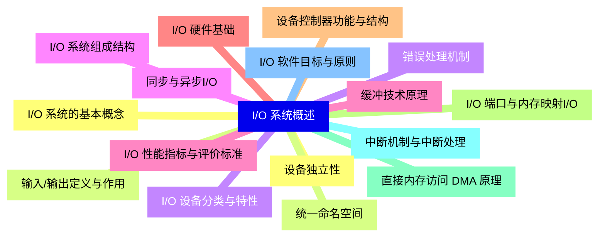

<--->
{}
{}
{}
{}
{}
{}
{}
{}
{}
{}
{}
{}
{}
{}
{}
{}
{}
{}
{}
{}
{}
{}
{}
{}
{}
{}
{}
{}
{}
{}
{}
{}
{}

### 2 I/O 控制方式{#2}

{}
{}
{}
{}
{}
{}
{}
{}
{}
{}
{}
{}
{}
{}
{}
{}
{}
{}
{}
{}
{}
{}
{}
{}
{}
{}
{}
{}
{}
{}
{}
{}
{}
{}
{}
<--->
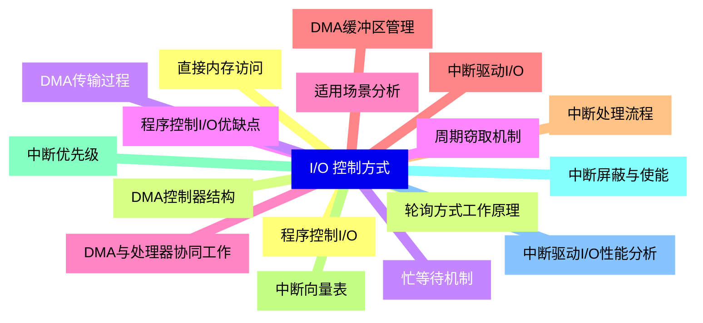

{}

### 3 I/O 软件层次结构{#3}

{}
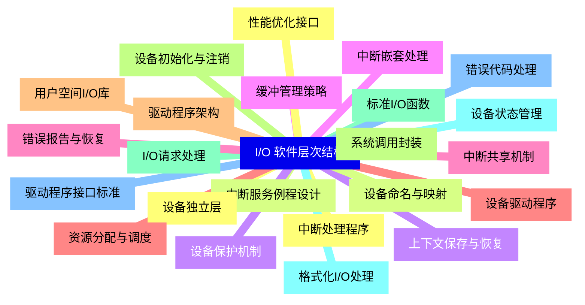

<--->
{}
{}
{}
{}
{}
{}
{}
{}
{}
{}
{}
{}
{}
{}
{}
{}
{}
{}
{}
{}
{}
{}
{}
{}
{}
{}
{}
{}
{}
{}
{}
{}
{}
{}
{}
{}
{}
{}
{}
{}
{}
{}
{}
{}
{}
{}
{}

### 4 I/O 核心子系统{#4}

{}
{}
{}
{}
{}
{}
{}
{}
{}
{}
{}
{}
{}
{}
{}
{}
{}
{}
{}
{}
{}
{}
{}
{}
{}
{}
{}
{}
{}
{}
{}
{}
{}
{}
{}
{}
{}
{}
{}
{}
{}
{}
{}
{}
{}
{}
{}
{}
{}
{}
{}
<--->
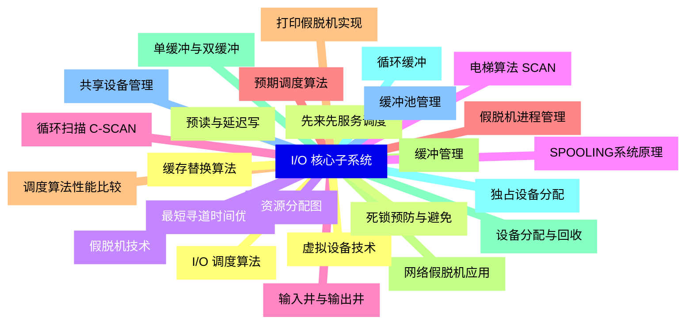

{}

### 5 磁盘I/O管理{#5}

{}
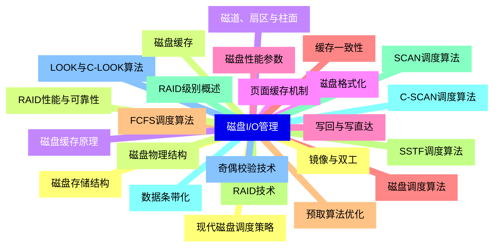

<--->
{}
{}
{}
{}
{}
{}
{}
{}
{}
{}
{}
{}
{}
{}
{}
{}
{}
{}
{}
{}
{}
{}
{}
{}
{}
{}
{}
{}
{}
{}
{}
{}
{}
{}
{}
{}
{}
{}
{}
{}
{}
{}
{}
{}
{}
{}
{}
{}
{}

### 6 字符设备I/O{#6}

{}
{}
{}
{}
{}
{}
{}
{}
{}
{}
{}
{}
{}
{}
{}
{}
{}
{}
{}
{}
{}
{}
{}
{}
{}
{}
{}
{}
{}
{}
{}
{}
{}
{}
{}
{}
{}
<--->
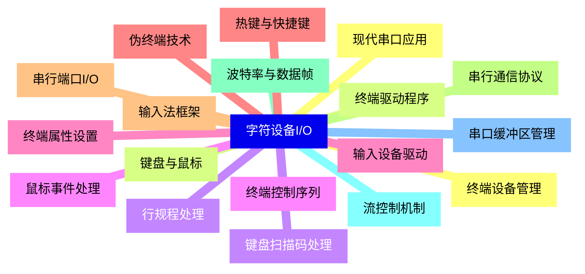

{}

### 7 块设备I/O{#7}

{}
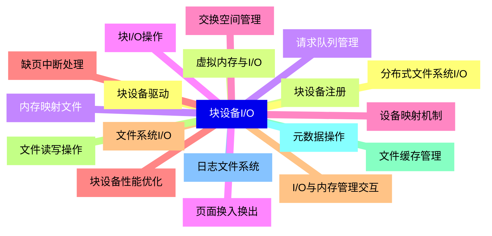

<--->
{}
{}
{}
{}
{}
{}
{}
{}
{}
{}
{}
{}
{}
{}
{}
{}
{}
{}
{}
{}
{}
{}
{}
{}
{}
{}
{}
{}
{}
{}
{}
{}
{}
{}
{}
{}
{}

### 8 网络I/O管理{#8}

{}
{}
{}
{}
{}
{}
{}
{}
{}
{}
{}
{}
{}
{}
{}
{}
{}
{}
{}
{}
{}
{}
{}
{}
{}
{}
{}
{}
{}
{}
{}
{}
{}
{}
{}
{}
{}
<--->
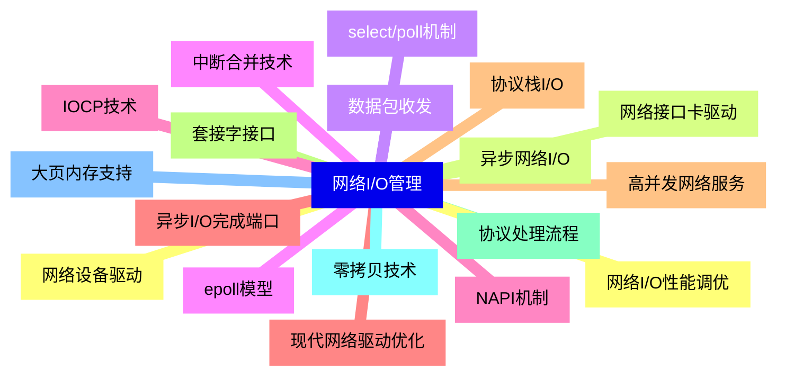

{}

### 9 高级I/O技术{#9}

{}
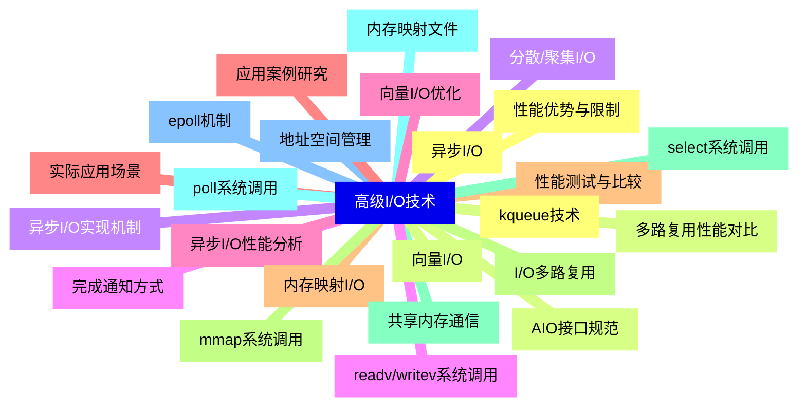

<--->
{}
{}
{}
{}
{}
{}
{}
{}
{}
{}
{}
{}
{}
{}
{}
{}
{}
{}
{}
{}
{}
{}
{}
{}
{}
{}
{}
{}
{}
{}
{}
{}
{}
{}
{}
{}
{}
{}
{}
{}
{}
{}
{}
{}
{}
{}
{}
{}
{}

### 10 I/O性能优化{#10}

{}
{}
{}
{}
{}
{}
{}
{}
{}
{}
{}
{}
{}
{}
{}
{}
{}
{}
{}
{}
{}
{}
{}
{}
{}
{}
{}
{}
{}
{}
{}
{}
{}
{}
{}
{}
{}
<--->
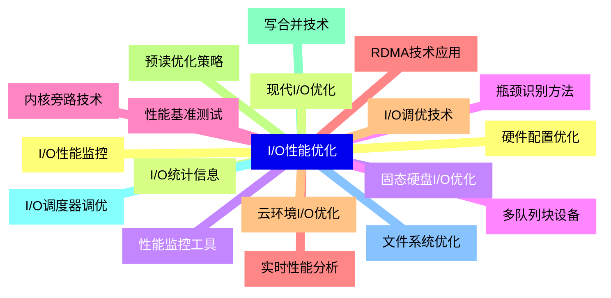

{}

### 11 特殊设备I/O{#11}

{}
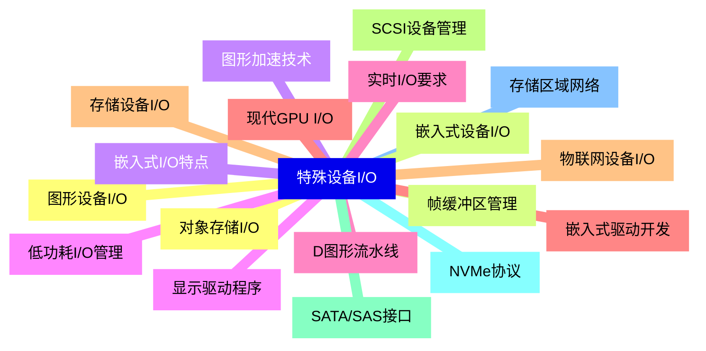

<--->
{}
{}
{}
{}
{}
{}
{}
{}
{}
{}
{}
{}
{}
{}
{}
{}
{}
{}
{}
{}
{}
{}
{}
{}
{}
{}
{}
{}
{}
{}
{}
{}
{}
{}
{}
{}
{}

### 12 I/O安全与可靠性{#12}

{}
{}
{}
{}
{}
{}
{}
{}
{}
{}
{}
{}
{}
{}
{}
{}
{}
{}
{}
{}
{}
{}
{}
{}
{}
{}
{}
{}
{}
{}
{}
{}
{}
{}
{}
{}
{}
<--->
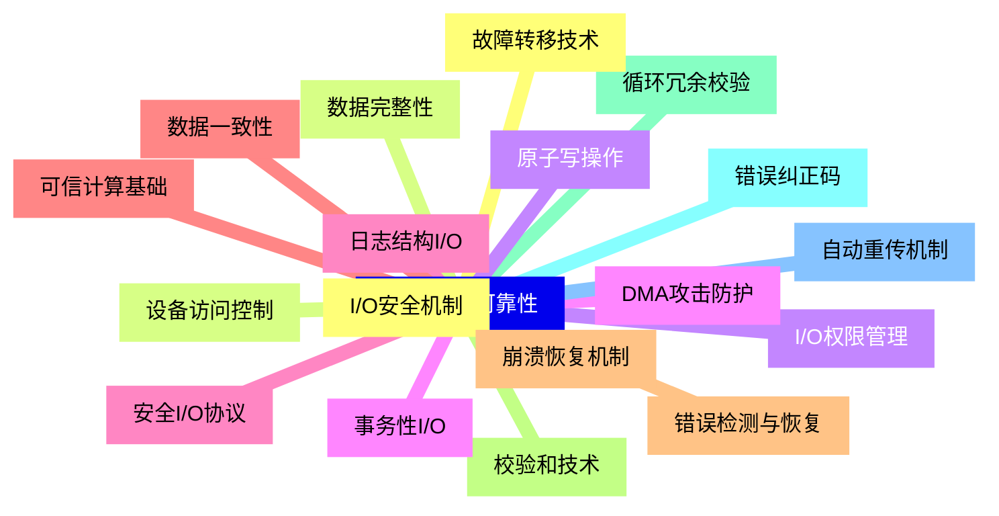

{}
