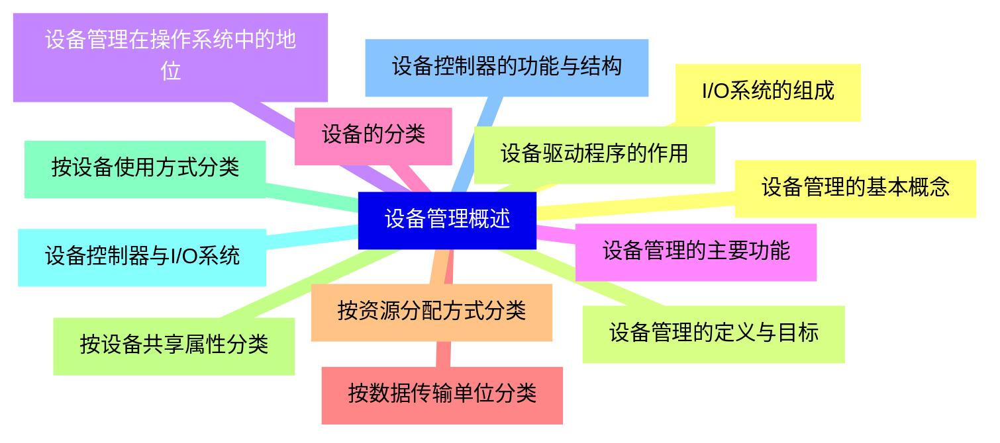
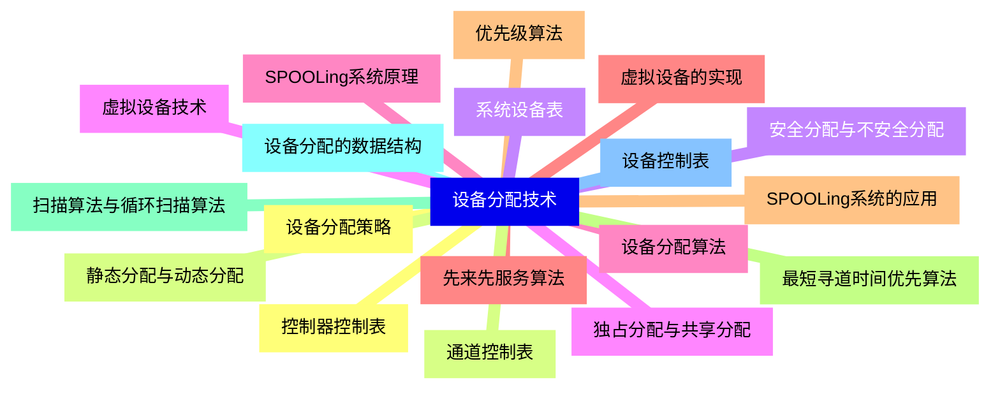
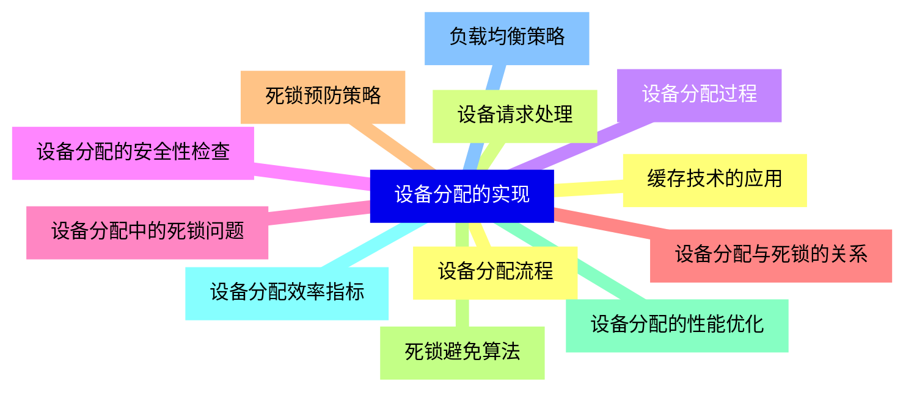
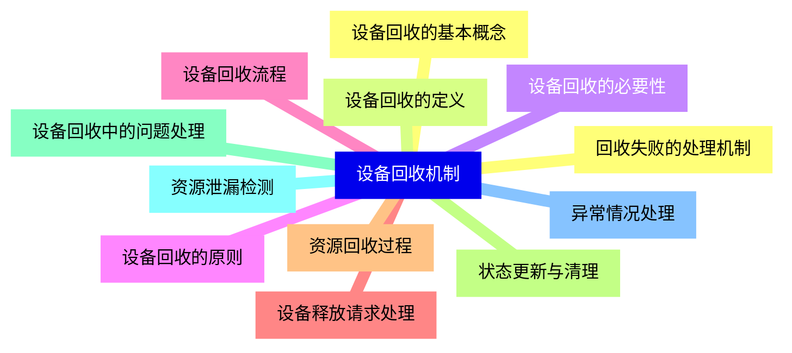
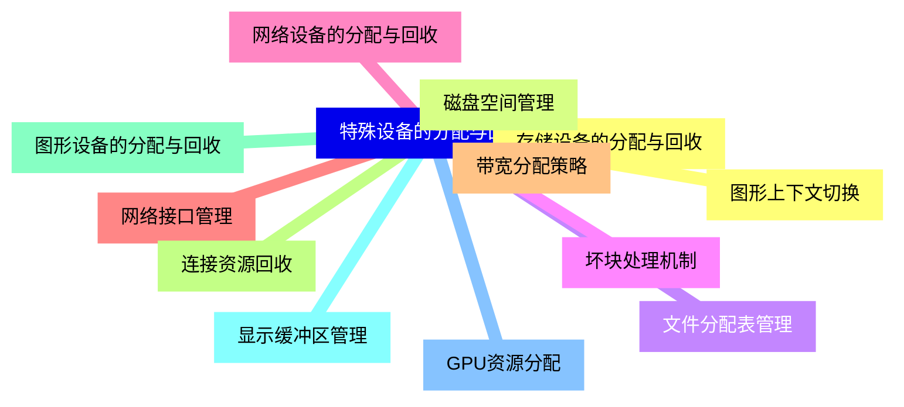
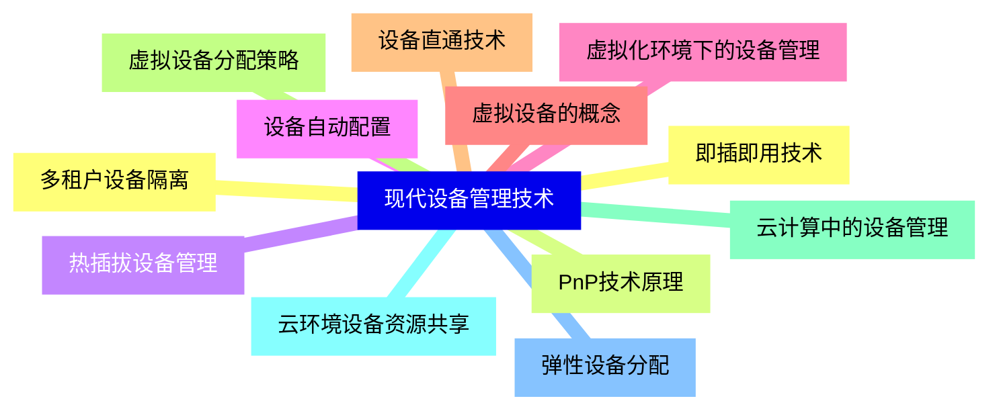
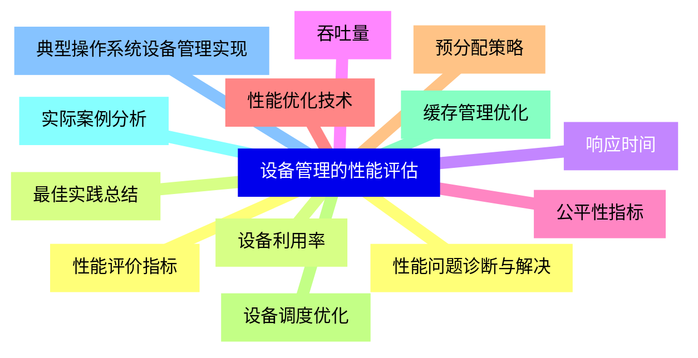


### 1 [设备管理概述](#1)
#### 1.1 [设备管理的基本概念](#1)
#### 1.2 [设备管理的定义与目标](#1)
#### 1.3 [设备管理在操作系统中的地位](#1)
#### 1.4 [设备管理的主要功能](#1)
#### 1.5 [设备的分类](#1)
#### 1.6 [按数据传输单位分类](#1)
#### 1.7 [按资源分配方式分类](#1)
#### 1.8 [按设备共享属性分类](#1)
#### 1.9 [按设备使用方式分类](#1)
#### 1.10 [设备控制器与I/O系统](#1)
#### 1.11 [设备控制器的功能与结构](#1)
#### 1.12 [I/O系统的组成](#1)
#### 1.13 [设备驱动程序的作用](#1)
### 2 [设备分配技术](#2)
#### 2.1 [设备分配策略](#2)
#### 2.2 [静态分配与动态分配](#2)
#### 2.3 [安全分配与不安全分配](#2)
#### 2.4 [独占分配与共享分配](#2)
#### 2.5 [设备分配算法](#2)
#### 2.6 [先来先服务算法](#2)
#### 2.7 [优先级算法](#2)
#### 2.8 [最短寻道时间优先算法](#2)
#### 2.9 [扫描算法与循环扫描算法](#2)
#### 2.10 [设备分配的数据结构](#2)
#### 2.11 [设备控制表](#2)
#### 2.12 [控制器控制表](#2)
#### 2.13 [通道控制表](#2)
#### 2.14 [系统设备表](#2)
#### 2.15 [虚拟设备技术](#2)
#### 2.16 [SPOOLing系统原理](#2)
#### 2.17 [虚拟设备的实现](#2)
#### 2.18 [SPOOLing系统的应用](#2)
### 3 [设备分配的实现](#3)
#### 3.1 [设备分配流程](#3)
#### 3.2 [设备请求处理](#3)
#### 3.3 [设备分配过程](#3)
#### 3.4 [设备分配的安全性检查](#3)
#### 3.5 [设备分配中的死锁问题](#3)
#### 3.6 [设备分配与死锁的关系](#3)
#### 3.7 [死锁预防策略](#3)
#### 3.8 [死锁避免算法](#3)
#### 3.9 [设备分配的性能优化](#3)
#### 3.10 [设备分配效率指标](#3)
#### 3.11 [负载均衡策略](#3)
#### 3.12 [缓存技术的应用](#3)
### 4 [设备回收机制](#4)
#### 4.1 [设备回收的基本概念](#4)
#### 4.2 [设备回收的定义](#4)
#### 4.3 [设备回收的必要性](#4)
#### 4.4 [设备回收的原则](#4)
#### 4.5 [设备回收流程](#4)
#### 4.6 [设备释放请求处理](#4)
#### 4.7 [资源回收过程](#4)
#### 4.8 [状态更新与清理](#4)
#### 4.9 [设备回收中的问题处理](#4)
#### 4.10 [资源泄漏检测](#4)
#### 4.11 [异常情况处理](#4)
#### 4.12 [回收失败的处理机制](#4)
### 5 [特殊设备的分配与回收](#5)
#### 5.1 [存储设备的分配与回收](#5)
#### 5.2 [磁盘空间管理](#5)
#### 5.3 [文件分配表管理](#5)
#### 5.4 [坏块处理机制](#5)
#### 5.5 [网络设备的分配与回收](#5)
#### 5.6 [网络接口管理](#5)
#### 5.7 [带宽分配策略](#5)
#### 5.8 [连接资源回收](#5)
#### 5.9 [图形设备的分配与回收](#5)
#### 5.10 [显示缓冲区管理](#5)
#### 5.11 [GPU资源分配](#5)
#### 5.12 [图形上下文切换](#5)
### 6 [现代设备管理技术](#6)
#### 6.1 [即插即用技术](#6)
#### 6.2 [PnP技术原理](#6)
#### 6.3 [热插拔设备管理](#6)
#### 6.4 [设备自动配置](#6)
#### 6.5 [虚拟化环境下的设备管理](#6)
#### 6.6 [虚拟设备的概念](#6)
#### 6.7 [设备直通技术](#6)
#### 6.8 [虚拟设备分配策略](#6)
#### 6.9 [云计算中的设备管理](#6)
#### 6.10 [云环境设备资源共享](#6)
#### 6.11 [弹性设备分配](#6)
#### 6.12 [多租户设备隔离](#6)
### 7 [设备管理的性能评估](#7)
#### 7.1 [性能评价指标](#7)
#### 7.2 [设备利用率](#7)
#### 7.3 [响应时间](#7)
#### 7.4 [吞吐量](#7)
#### 7.5 [公平性指标](#7)
#### 7.6 [性能优化技术](#7)
#### 7.7 [预分配策略](#7)
#### 7.8 [设备调度优化](#7)
#### 7.9 [缓存管理优化](#7)
#### 7.10 [实际案例分析](#7)
#### 7.11 [典型操作系统设备管理实现](#7)
#### 7.12 [性能问题诊断与解决](#7)
#### 7.13 [最佳实践总结](#7)




### 1 设备管理概述

---
### 1 设备管理概述
___
#### 1.1 设备管理的基本概念
___
#### 1.2 设备管理的定义与目标
___
#### 1.3 设备管理在操作系统中的地位
___
#### 1.4 设备管理的主要功能
___
#### 1.5 设备的分类
___
#### 1.6 按数据传输单位分类
___
#### 1.7 按资源分配方式分类
___
#### 1.8 按设备共享属性分类
___
#### 1.9 按设备使用方式分类
___
#### 1.10 设备控制器与I/O系统
___
#### 1.11 设备控制器的功能与结构
___
#### 1.12 I/O系统的组成
___
#### 1.13 设备驱动程序的作用
### 2 设备分配技术

---
### 2 设备分配技术
___
#### 2.1 设备分配策略
___
#### 2.2 静态分配与动态分配
___
#### 2.3 安全分配与不安全分配
___
#### 2.4 独占分配与共享分配
___
#### 2.5 设备分配算法
___
#### 2.6 先来先服务算法
___
#### 2.7 优先级算法
___
#### 2.8 最短寻道时间优先算法
___
#### 2.9 扫描算法与循环扫描算法
___
#### 2.10 设备分配的数据结构
___
#### 2.11 设备控制表
___
#### 2.12 控制器控制表
___
#### 2.13 通道控制表
___
#### 2.14 系统设备表
___
#### 2.15 虚拟设备技术
___
#### 2.16 SPOOLing系统原理
___
#### 2.17 虚拟设备的实现
___
#### 2.18 SPOOLing系统的应用
### 3 设备分配的实现

---
### 3 设备分配的实现
___
#### 3.1 设备分配流程
___
#### 3.2 设备请求处理
___
#### 3.3 设备分配过程
___
#### 3.4 设备分配的安全性检查
___
#### 3.5 设备分配中的死锁问题
___
#### 3.6 设备分配与死锁的关系
___
#### 3.7 死锁预防策略
___
#### 3.8 死锁避免算法
___
#### 3.9 设备分配的性能优化
___
#### 3.10 设备分配效率指标
___
#### 3.11 负载均衡策略
___
#### 3.12 缓存技术的应用
### 4 设备回收机制

---
### 4 设备回收机制
___
#### 4.1 设备回收的基本概念
___
#### 4.2 设备回收的定义
___
#### 4.3 设备回收的必要性
___
#### 4.4 设备回收的原则
___
#### 4.5 设备回收流程
___
#### 4.6 设备释放请求处理
___
#### 4.7 资源回收过程
___
#### 4.8 状态更新与清理
___
#### 4.9 设备回收中的问题处理
___
#### 4.10 资源泄漏检测
___
#### 4.11 异常情况处理
___
#### 4.12 回收失败的处理机制
### 5 特殊设备的分配与回收

---
### 5 特殊设备的分配与回收
___
#### 5.1 存储设备的分配与回收
___
#### 5.2 磁盘空间管理
___
#### 5.3 文件分配表管理
___
#### 5.4 坏块处理机制
___
#### 5.5 网络设备的分配与回收
___
#### 5.6 网络接口管理
___
#### 5.7 带宽分配策略
___
#### 5.8 连接资源回收
___
#### 5.9 图形设备的分配与回收
___
#### 5.10 显示缓冲区管理
___
#### 5.11 GPU资源分配
___
#### 5.12 图形上下文切换
### 6 现代设备管理技术

---
### 6 现代设备管理技术
___
#### 6.1 即插即用技术
___
#### 6.2 PnP技术原理
___
#### 6.3 热插拔设备管理
___
#### 6.4 设备自动配置
___
#### 6.5 虚拟化环境下的设备管理
___
#### 6.6 虚拟设备的概念
___
#### 6.7 设备直通技术
___
#### 6.8 虚拟设备分配策略
___
#### 6.9 云计算中的设备管理
___
#### 6.10 云环境设备资源共享
___
#### 6.11 弹性设备分配
___
#### 6.12 多租户设备隔离
### 7 设备管理的性能评估

---
### 7 设备管理的性能评估
___
#### 7.1 性能评价指标
___
#### 7.2 设备利用率
___
#### 7.3 响应时间
___
#### 7.4 吞吐量
___
#### 7.5 公平性指标
___
#### 7.6 性能优化技术
___
#### 7.7 预分配策略
___
#### 7.8 设备调度优化
___
#### 7.9 缓存管理优化
___
#### 7.10 实际案例分析
___
#### 7.11 典型操作系统设备管理实现
___
#### 7.12 性能问题诊断与解决
___
#### 7.13 最佳实践总结


### 1 设备管理概述{#1}

{}

<--->
{}
{}
{}
{}
{}
{}
{}
{}
{}
{}
{}
{}
{}
{}
{}
{}
{}
{}
{}
{}
{}
{}
{}
{}
{}
{}
{}

### 2 设备分配技术{#2}

{}
{}
{}
{}
{}
{}
{}
{}
{}
{}
{}
{}
{}
{}
{}
{}
{}
{}
{}
{}
{}
{}
{}
{}
{}
{}
{}
{}
{}
{}
{}
{}
{}
{}
{}
{}
{}
<--->

{}

### 3 设备分配的实现{#3}

{}

<--->
{}
{}
{}
{}
{}
{}
{}
{}
{}
{}
{}
{}
{}
{}
{}
{}
{}
{}
{}
{}
{}
{}
{}
{}
{}

### 4 设备回收机制{#4}

{}
{}
{}
{}
{}
{}
{}
{}
{}
{}
{}
{}
{}
{}
{}
{}
{}
{}
{}
{}
{}
{}
{}
{}
{}
<--->

{}

### 5 特殊设备的分配与回收{#5}

{}

<--->
{}
{}
{}
{}
{}
{}
{}
{}
{}
{}
{}
{}
{}
{}
{}
{}
{}
{}
{}
{}
{}
{}
{}
{}
{}

### 6 现代设备管理技术{#6}

{}
{}
{}
{}
{}
{}
{}
{}
{}
{}
{}
{}
{}
{}
{}
{}
{}
{}
{}
{}
{}
{}
{}
{}
{}
<--->

{}

### 7 设备管理的性能评估{#7}

{}

<--->
{}
{}
{}
{}
{}
{}
{}
{}
{}
{}
{}
{}
{}
{}
{}
{}
{}
{}
{}
{}
{}
{}
{}
{}
{}
{}
{}
