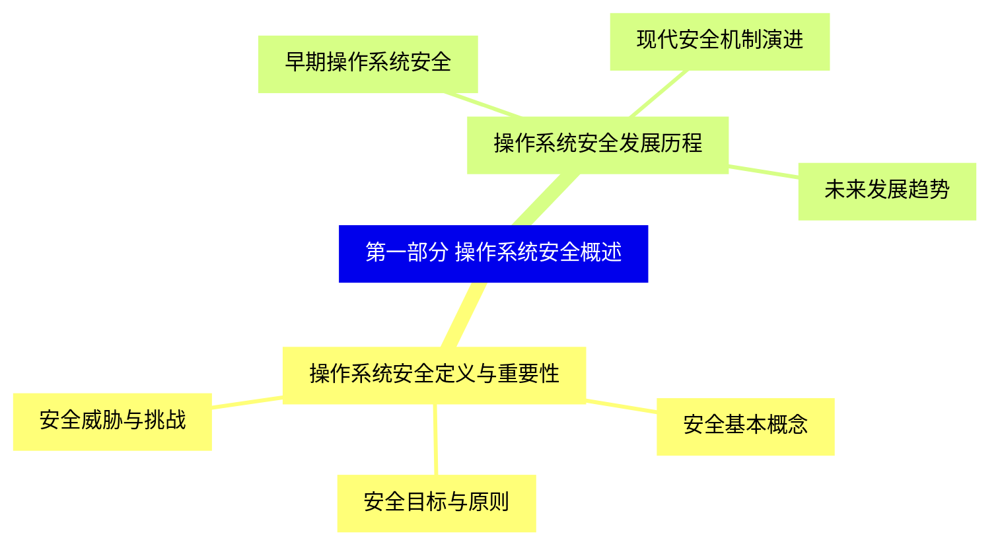
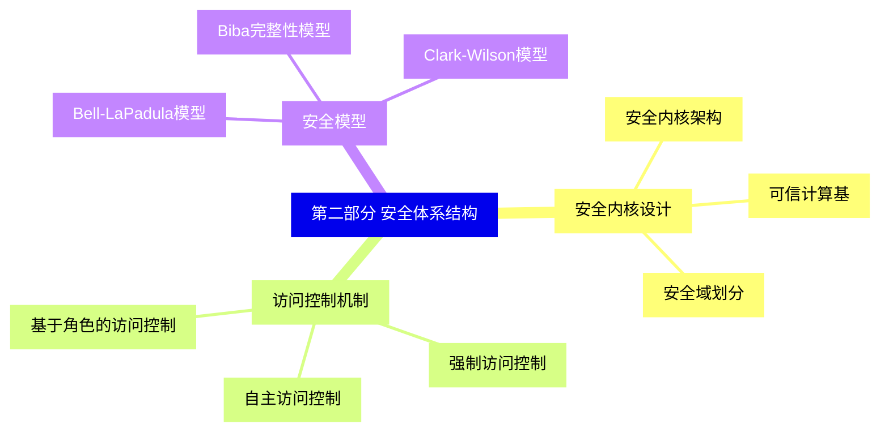
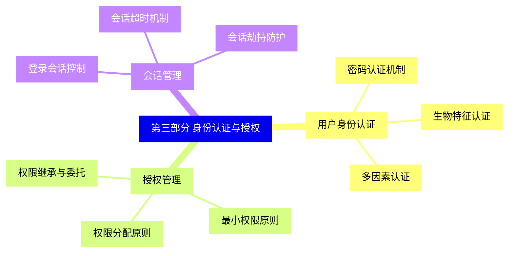
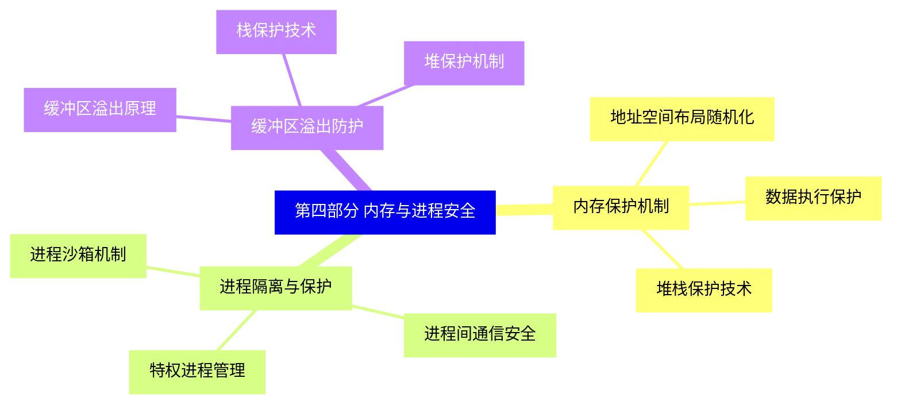
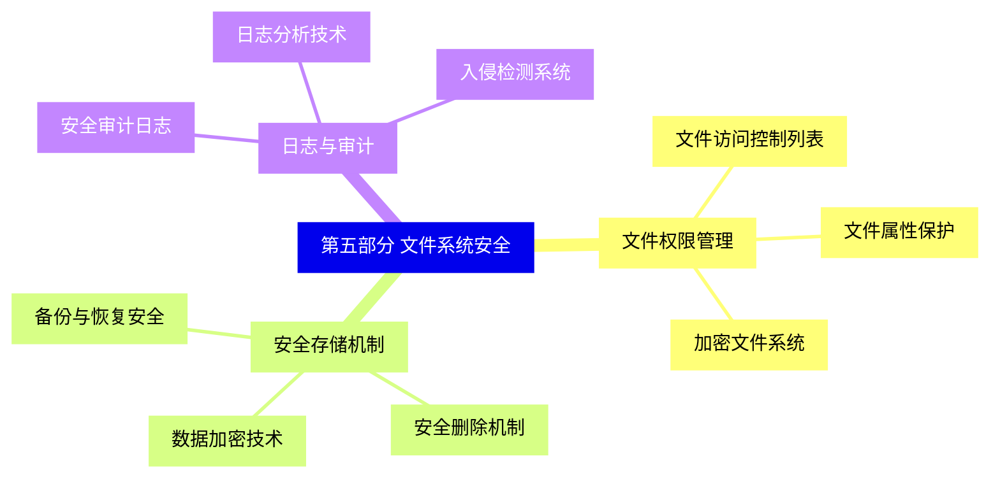
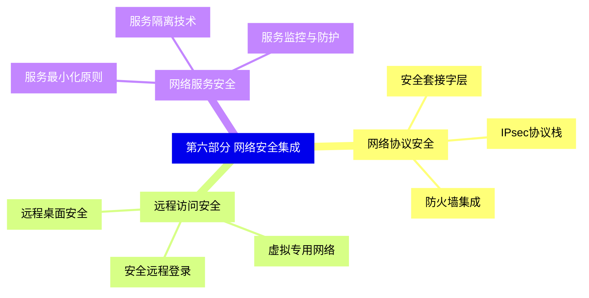
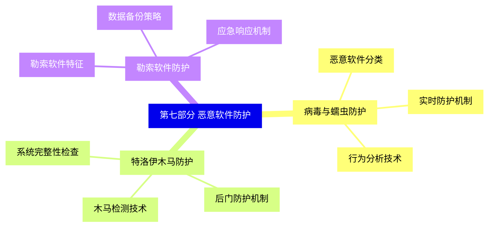
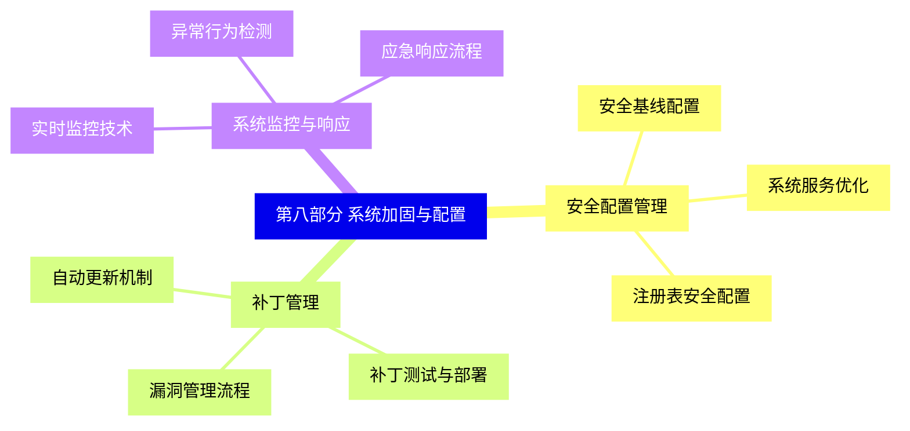
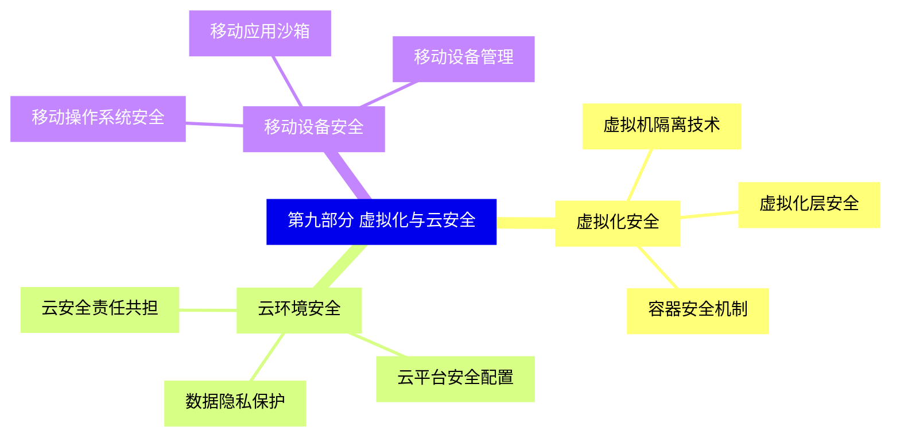
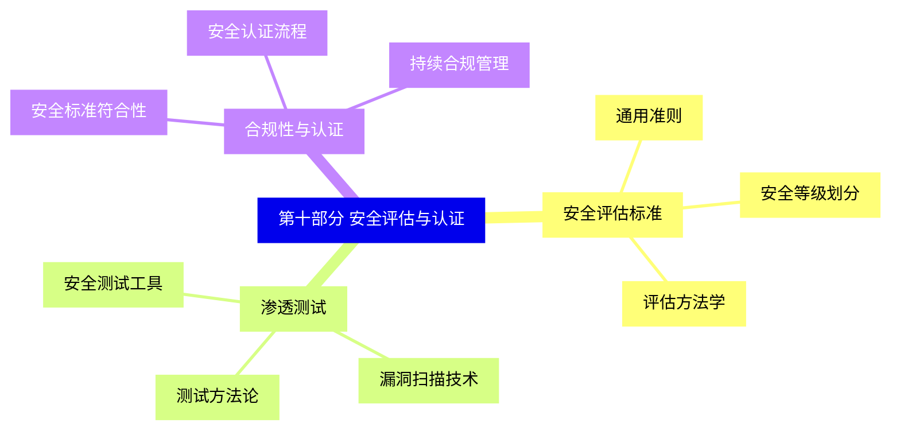


### 1 [第一部分 操作系统安全概述](#1)
#### 1.1 [操作系统安全定义与重要性](#1)
##### 1.1.1 [安全基本概念](#1)
##### 1.1.2 [安全目标与原则](#1)
##### 1.1.3 [安全威胁与挑战](#1)
#### 1.2 [操作系统安全发展历程](#1)
##### 1.2.1 [早期操作系统安全](#1)
##### 1.2.2 [现代安全机制演进](#1)
##### 1.2.3 [未来发展趋势](#1)
### 2 [第二部分 安全体系结构](#2)
#### 2.1 [安全内核设计](#2)
##### 2.1.1 [安全内核架构](#2)
##### 2.1.2 [可信计算基](#2)
##### 2.1.3 [安全域划分](#2)
#### 2.2 [访问控制机制](#2)
##### 2.2.1 [自主访问控制](#2)
##### 2.2.2 [强制访问控制](#2)
##### 2.2.3 [基于角色的访问控制](#2)
#### 2.3 [安全模型](#2)
##### 2.3.1 [Bell-LaPadula模型](#2)
##### 2.3.2 [Biba完整性模型](#2)
##### 2.3.3 [Clark-Wilson模型](#2)
### 3 [第三部分 身份认证与授权](#3)
#### 3.1 [用户身份认证](#3)
##### 3.1.1 [密码认证机制](#3)
##### 3.1.2 [生物特征认证](#3)
##### 3.1.3 [多因素认证](#3)
#### 3.2 [授权管理](#3)
##### 3.2.1 [权限分配原则](#3)
##### 3.2.2 [最小权限原则](#3)
##### 3.2.3 [权限继承与委托](#3)
#### 3.3 [会话管理](#3)
##### 3.3.1 [登录会话控制](#3)
##### 3.3.2 [会话超时机制](#3)
##### 3.3.3 [会话劫持防护](#3)
### 4 [第四部分 内存与进程安全](#4)
#### 4.1 [内存保护机制](#4)
##### 4.1.1 [地址空间布局随机化](#4)
##### 4.1.2 [数据执行保护](#4)
##### 4.1.3 [堆栈保护技术](#4)
#### 4.2 [进程隔离与保护](#4)
##### 4.2.1 [进程沙箱机制](#4)
##### 4.2.2 [进程间通信安全](#4)
##### 4.2.3 [特权进程管理](#4)
#### 4.3 [缓冲区溢出防护](#4)
##### 4.3.1 [缓冲区溢出原理](#4)
##### 4.3.2 [栈保护技术](#4)
##### 4.3.3 [堆保护机制](#4)
### 5 [第五部分 文件系统安全](#5)
#### 5.1 [文件权限管理](#5)
##### 5.1.1 [文件访问控制列表](#5)
##### 5.1.2 [文件属性保护](#5)
##### 5.1.3 [加密文件系统](#5)
#### 5.2 [安全存储机制](#5)
##### 5.2.1 [数据加密技术](#5)
##### 5.2.2 [安全删除机制](#5)
##### 5.2.3 [备份与恢复安全](#5)
#### 5.3 [日志与审计](#5)
##### 5.3.1 [安全审计日志](#5)
##### 5.3.2 [日志分析技术](#5)
##### 5.3.3 [入侵检测系统](#5)
### 6 [第六部分 网络安全集成](#6)
#### 6.1 [网络协议安全](#6)
##### 6.1.1 [安全套接字层](#6)
##### 6.1.2 [IPsec协议栈](#6)
##### 6.1.3 [防火墙集成](#6)
#### 6.2 [远程访问安全](#6)
##### 6.2.1 [安全远程登录](#6)
##### 6.2.2 [虚拟专用网络](#6)
##### 6.2.3 [远程桌面安全](#6)
#### 6.3 [网络服务安全](#6)
##### 6.3.1 [服务最小化原则](#6)
##### 6.3.2 [服务隔离技术](#6)
##### 6.3.3 [服务监控与防护](#6)
### 7 [第七部分 恶意软件防护](#7)
#### 7.1 [病毒与蠕虫防护](#7)
##### 7.1.1 [恶意软件分类](#7)
##### 7.1.2 [实时防护机制](#7)
##### 7.1.3 [行为分析技术](#7)
#### 7.2 [特洛伊木马防护](#7)
##### 7.2.1 [木马检测技术](#7)
##### 7.2.2 [后门防护机制](#7)
##### 7.2.3 [系统完整性检查](#7)
#### 7.3 [勒索软件防护](#7)
##### 7.3.1 [勒索软件特征](#7)
##### 7.3.2 [数据备份策略](#7)
##### 7.3.3 [应急响应机制](#7)
### 8 [第八部分 系统加固与配置](#8)
#### 8.1 [安全配置管理](#8)
##### 8.1.1 [安全基线配置](#8)
##### 8.1.2 [系统服务优化](#8)
##### 8.1.3 [注册表安全配置](#8)
#### 8.2 [补丁管理](#8)
##### 8.2.1 [漏洞管理流程](#8)
##### 8.2.2 [补丁测试与部署](#8)
##### 8.2.3 [自动更新机制](#8)
#### 8.3 [系统监控与响应](#8)
##### 8.3.1 [实时监控技术](#8)
##### 8.3.2 [异常行为检测](#8)
##### 8.3.3 [应急响应流程](#8)
### 9 [第九部分 虚拟化与云安全](#9)
#### 9.1 [虚拟化安全](#9)
##### 9.1.1 [虚拟机隔离技术](#9)
##### 9.1.2 [虚拟化层安全](#9)
##### 9.1.3 [容器安全机制](#9)
#### 9.2 [云环境安全](#9)
##### 9.2.1 [云安全责任共担](#9)
##### 9.2.2 [云平台安全配置](#9)
##### 9.2.3 [数据隐私保护](#9)
#### 9.3 [移动设备安全](#9)
##### 9.3.1 [移动操作系统安全](#9)
##### 9.3.2 [移动应用沙箱](#9)
##### 9.3.3 [移动设备管理](#9)
### 10 [第十部分 安全评估与认证](#10)
#### 10.1 [安全评估标准](#10)
##### 10.1.1 [通用准则](#10)
##### 10.1.2 [安全等级划分](#10)
##### 10.1.3 [评估方法学](#10)
#### 10.2 [渗透测试](#10)
##### 10.2.1 [测试方法论](#10)
##### 10.2.2 [漏洞扫描技术](#10)
##### 10.2.3 [安全测试工具](#10)
#### 10.3 [合规性与认证](#10)
##### 10.3.1 [安全标准符合性](#10)
##### 10.3.2 [安全认证流程](#10)
##### 10.3.3 [持续合规管理](#10)




### 1 第一部分 操作系统安全概述

---
### 1 第一部分 操作系统安全概述
___
#### 1.1 操作系统安全定义与重要性
___
##### 1.1.1 安全基本概念
___
##### 1.1.2 安全目标与原则
___
##### 1.1.3 安全威胁与挑战
___
#### 1.2 操作系统安全发展历程
___
##### 1.2.1 早期操作系统安全
___
##### 1.2.2 现代安全机制演进
___
##### 1.2.3 未来发展趋势
### 2 第二部分 安全体系结构

---
### 2 第二部分 安全体系结构
___
#### 2.1 安全内核设计
___
##### 2.1.1 安全内核架构
___
##### 2.1.2 可信计算基
___
##### 2.1.3 安全域划分
___
#### 2.2 访问控制机制
___
##### 2.2.1 自主访问控制
___
##### 2.2.2 强制访问控制
___
##### 2.2.3 基于角色的访问控制
___
#### 2.3 安全模型
___
##### 2.3.1 Bell-LaPadula模型
___
##### 2.3.2 Biba完整性模型
___
##### 2.3.3 Clark-Wilson模型
### 3 第三部分 身份认证与授权

---
### 3 第三部分 身份认证与授权
___
#### 3.1 用户身份认证
___
##### 3.1.1 密码认证机制
___
##### 3.1.2 生物特征认证
___
##### 3.1.3 多因素认证
___
#### 3.2 授权管理
___
##### 3.2.1 权限分配原则
___
##### 3.2.2 最小权限原则
___
##### 3.2.3 权限继承与委托
___
#### 3.3 会话管理
___
##### 3.3.1 登录会话控制
___
##### 3.3.2 会话超时机制
___
##### 3.3.3 会话劫持防护
### 4 第四部分 内存与进程安全

---
### 4 第四部分 内存与进程安全
___
#### 4.1 内存保护机制
___
##### 4.1.1 地址空间布局随机化
___
##### 4.1.2 数据执行保护
___
##### 4.1.3 堆栈保护技术
___
#### 4.2 进程隔离与保护
___
##### 4.2.1 进程沙箱机制
___
##### 4.2.2 进程间通信安全
___
##### 4.2.3 特权进程管理
___
#### 4.3 缓冲区溢出防护
___
##### 4.3.1 缓冲区溢出原理
___
##### 4.3.2 栈保护技术
___
##### 4.3.3 堆保护机制
### 5 第五部分 文件系统安全

---
### 5 第五部分 文件系统安全
___
#### 5.1 文件权限管理
___
##### 5.1.1 文件访问控制列表
___
##### 5.1.2 文件属性保护
___
##### 5.1.3 加密文件系统
___
#### 5.2 安全存储机制
___
##### 5.2.1 数据加密技术
___
##### 5.2.2 安全删除机制
___
##### 5.2.3 备份与恢复安全
___
#### 5.3 日志与审计
___
##### 5.3.1 安全审计日志
___
##### 5.3.2 日志分析技术
___
##### 5.3.3 入侵检测系统
### 6 第六部分 网络安全集成

---
### 6 第六部分 网络安全集成
___
#### 6.1 网络协议安全
___
##### 6.1.1 安全套接字层
___
##### 6.1.2 IPsec协议栈
___
##### 6.1.3 防火墙集成
___
#### 6.2 远程访问安全
___
##### 6.2.1 安全远程登录
___
##### 6.2.2 虚拟专用网络
___
##### 6.2.3 远程桌面安全
___
#### 6.3 网络服务安全
___
##### 6.3.1 服务最小化原则
___
##### 6.3.2 服务隔离技术
___
##### 6.3.3 服务监控与防护
### 7 第七部分 恶意软件防护

---
### 7 第七部分 恶意软件防护
___
#### 7.1 病毒与蠕虫防护
___
##### 7.1.1 恶意软件分类
___
##### 7.1.2 实时防护机制
___
##### 7.1.3 行为分析技术
___
#### 7.2 特洛伊木马防护
___
##### 7.2.1 木马检测技术
___
##### 7.2.2 后门防护机制
___
##### 7.2.3 系统完整性检查
___
#### 7.3 勒索软件防护
___
##### 7.3.1 勒索软件特征
___
##### 7.3.2 数据备份策略
___
##### 7.3.3 应急响应机制
### 8 第八部分 系统加固与配置

---
### 8 第八部分 系统加固与配置
___
#### 8.1 安全配置管理
___
##### 8.1.1 安全基线配置
___
##### 8.1.2 系统服务优化
___
##### 8.1.3 注册表安全配置
___
#### 8.2 补丁管理
___
##### 8.2.1 漏洞管理流程
___
##### 8.2.2 补丁测试与部署
___
##### 8.2.3 自动更新机制
___
#### 8.3 系统监控与响应
___
##### 8.3.1 实时监控技术
___
##### 8.3.2 异常行为检测
___
##### 8.3.3 应急响应流程
### 9 第九部分 虚拟化与云安全

---
### 9 第九部分 虚拟化与云安全
___
#### 9.1 虚拟化安全
___
##### 9.1.1 虚拟机隔离技术
___
##### 9.1.2 虚拟化层安全
___
##### 9.1.3 容器安全机制
___
#### 9.2 云环境安全
___
##### 9.2.1 云安全责任共担
___
##### 9.2.2 云平台安全配置
___
##### 9.2.3 数据隐私保护
___
#### 9.3 移动设备安全
___
##### 9.3.1 移动操作系统安全
___
##### 9.3.2 移动应用沙箱
___
##### 9.3.3 移动设备管理
### 10 第十部分 安全评估与认证

---
### 10 第十部分 安全评估与认证
___
#### 10.1 安全评估标准
___
##### 10.1.1 通用准则
___
##### 10.1.2 安全等级划分
___
##### 10.1.3 评估方法学
___
#### 10.2 渗透测试
___
##### 10.2.1 测试方法论
___
##### 10.2.2 漏洞扫描技术
___
##### 10.2.3 安全测试工具
___
#### 10.3 合规性与认证
___
##### 10.3.1 安全标准符合性
___
##### 10.3.2 安全认证流程
___
##### 10.3.3 持续合规管理


### 1 第一部分 操作系统安全概述{#1}

{}

<--->
{}
{}
{}
{}
{}
{}
{}
{}
{}
{}
{}
{}
{}
{}
{}
{}
{}

### 2 第二部分 安全体系结构{#2}

{}
{}
{}
{}
{}
{}
{}
{}
{}
{}
{}
{}
{}
{}
{}
{}
{}
{}
{}
{}
{}
{}
{}
{}
{}
<--->

{}

### 3 第三部分 身份认证与授权{#3}

{}

<--->
{}
{}
{}
{}
{}
{}
{}
{}
{}
{}
{}
{}
{}
{}
{}
{}
{}
{}
{}
{}
{}
{}
{}
{}
{}

### 4 第四部分 内存与进程安全{#4}

{}
{}
{}
{}
{}
{}
{}
{}
{}
{}
{}
{}
{}
{}
{}
{}
{}
{}
{}
{}
{}
{}
{}
{}
{}
<--->

{}

### 5 第五部分 文件系统安全{#5}

{}

<--->
{}
{}
{}
{}
{}
{}
{}
{}
{}
{}
{}
{}
{}
{}
{}
{}
{}
{}
{}
{}
{}
{}
{}
{}
{}

### 6 第六部分 网络安全集成{#6}

{}
{}
{}
{}
{}
{}
{}
{}
{}
{}
{}
{}
{}
{}
{}
{}
{}
{}
{}
{}
{}
{}
{}
{}
{}
<--->

{}

### 7 第七部分 恶意软件防护{#7}

{}

<--->
{}
{}
{}
{}
{}
{}
{}
{}
{}
{}
{}
{}
{}
{}
{}
{}
{}
{}
{}
{}
{}
{}
{}
{}
{}

### 8 第八部分 系统加固与配置{#8}

{}
{}
{}
{}
{}
{}
{}
{}
{}
{}
{}
{}
{}
{}
{}
{}
{}
{}
{}
{}
{}
{}
{}
{}
{}
<--->

{}

### 9 第九部分 虚拟化与云安全{#9}

{}

<--->
{}
{}
{}
{}
{}
{}
{}
{}
{}
{}
{}
{}
{}
{}
{}
{}
{}
{}
{}
{}
{}
{}
{}
{}
{}

### 10 第十部分 安全评估与认证{#10}

{}
{}
{}
{}
{}
{}
{}
{}
{}
{}
{}
{}
{}
{}
{}
{}
{}
{}
{}
{}
{}
{}
{}
{}
{}
<--->

{}
