
### 1 [保护机制基础概念](#1)
#### 1.1 [保护机制定义与目标](#1)
#### 1.2 [保护机制的基本概念](#1)
#### 1.3 [保护机制的主要目标](#1)
#### 1.4 [保护与安全的区别与联系](#1)
#### 1.5 [保护机制发展历程](#1)
#### 1.6 [早期操作系统的保护需求](#1)
#### 1.7 [保护机制的演进历史](#1)
#### 1.8 [现代操作系统保护机制特点](#1)
#### 1.9 [保护机制设计原则](#1)
#### 1.10 [最小权限原则](#1)
#### 1.11 [权限分离原则](#1)
#### 1.12 [经济性原则](#1)
#### 1.13 [完全仲裁原则](#1)
#### 1.14 [开放设计原则](#1)
### 2 [硬件支持的保护机制](#2)
#### 2.1 [处理器保护模式](#2)
#### 2.2 [实模式与保护模式](#2)
#### 2.3 [特权级别 Ring 0-3](#2)
#### 2.4 [模式切换机制](#2)
#### 2.5 [内存保护机制](#2)
#### 2.6 [分段机制](#2)
#### 2.7 [分页机制](#2)
#### 2.8 [虚拟内存保护](#2)
#### 2.9 [内存管理单元 MMU](#2)
#### 2.10 [I/O保护机制](#2)
#### 2.11 [I/O端口保护](#2)
#### 2.12 [直接内存访问 DMA 保护](#2)
#### 2.13 [设备驱动程序保护](#2)
### 3 [访问控制机制](#3)
#### 3.1 [访问控制模型](#3)
#### 3.2 [自主访问控制 DAC](#3)
#### 3.3 [强制访问控制 MAC](#3)
#### 3.4 [基于角色的访问控制 RBAC](#3)
#### 3.5 [访问控制列表](#3)
#### 3.6 [ACL基本结构](#3)
#### 3.7 [ACL实现机制](#3)
#### 3.8 [ACL管理策略](#3)
#### 3.9 [能力列表](#3)
#### 3.10 [能力的概念与特性](#3)
#### 3.11 [能力系统的实现](#3)
#### 3.12 [能力传递与撤销](#3)
### 4 [进程保护机制](#4)
#### 4.1 [进程隔离](#4)
#### 4.2 [地址空间隔离](#4)
#### 4.3 [进程间通信保护](#4)
#### 4.4 [资源隔离机制](#4)
#### 4.5 [进程权限管理](#4)
#### 4.6 [用户标识与组标识](#4)
#### 4.7 [有效用户ID与真实用户ID](#4)
#### 4.8 [特权提升与降级](#4)
#### 4.9 [进程间保护](#4)
#### 4.10 [信号量保护](#4)
#### 4.11 [消息队列保护](#4)
#### 4.12 [共享内存保护](#4)
### 5 [文件系统保护](#5)
#### 5.1 [文件权限管理](#5)
#### 5.2 [文件访问权限位](#5)
#### 5.3 [特殊权限位 setuid、setgid、sticky bit](#5)
#### 5.4 [访问控制列表在文件系统中的应用](#5)
#### 5.5 [文件系统安全特性](#5)
#### 5.6 [文件加密机制](#5)
#### 5.7 [文件完整性检查](#5)
#### 5.8 [安全删除机制](#5)
#### 5.9 [备份与恢复保护](#5)
#### 5.10 [备份策略与保护](#5)
#### 5.11 [数据恢复安全机制](#5)
#### 5.12 [版本控制保护](#5)
### 6 [网络安全保护](#6)
#### 6.1 [网络访问控制](#6)
#### 6.2 [防火墙机制](#6)
#### 6.3 [网络隔离技术](#6)
#### 6.4 [虚拟专用网络 VPN](#6)
#### 6.5 [网络通信保护](#6)
#### 6.6 [传输层安全 TLS/SSL](#6)
#### 6.7 [IPsec协议](#6)
#### 6.8 [安全套接字层](#6)
#### 6.9 [网络服务保护](#6)
#### 6.10 [服务访问控制](#6)
#### 6.11 [端口保护机制](#6)
#### 6.12 [网络入侵检测](#6)
### 7 [用户认证与授权](#7)
#### 7.1 [用户身份认证](#7)
#### 7.2 [密码认证机制](#7)
#### 7.3 [生物特征认证](#7)
#### 7.4 [多因素认证](#7)
#### 7.5 [会话管理](#7)
#### 7.6 [会话建立与维护](#7)
#### 7.7 [会话超时控制](#7)
#### 7.8 [会话劫持防护](#7)
#### 7.9 [权限管理](#7)
#### 7.10 [权限分配策略](#7)
#### 7.11 [权限继承机制](#7)
#### 7.12 [权限审计跟踪](#7)
### 8 [系统调用保护](#8)
#### 8.1 [系统调用接口保护](#8)
#### 8.2 [系统调用验证](#8)
#### 8.3 [参数检查机制](#8)
#### 8.4 [返回值保护](#8)
#### 8.5 [内核保护](#8)
#### 8.6 [内核空间保护](#8)
#### 8.7 [系统调用表保护](#8)
#### 8.8 [内核模块安全](#8)
#### 8.9 [系统调用拦截](#8)
#### 8.10 [系统调用挂钩](#8)
#### 8.11 [系统调用过滤](#8)
#### 8.12 [系统调用监控](#8)
### 9 [虚拟化环境保护](#9)
#### 9.1 [虚拟机监控器保护](#9)
#### 9.2 [虚拟机隔离机制](#9)
#### 9.3 [虚拟机监控器安全](#9)
#### 9.4 [虚拟机逃逸防护](#9)
#### 9.5 [容器保护机制](#9)
#### 9.6 [命名空间隔离](#9)
#### 9.7 [控制组限制](#9)
#### 9.8 [容器安全策略](#9)
#### 9.9 [云环境保护](#9)
#### 9.10 [多租户隔离](#9)
#### 9.11 [云资源保护](#9)
#### 9.12 [云安全管理](#9)
### 10 [安全审计与监控](#10)
#### 10.1 [审计机制](#10)
#### 10.2 [审计日志记录](#10)
#### 10.3 [审计事件分类](#10)
#### 10.4 [审计数据分析](#10)
#### 10.5 [系统监控](#10)
#### 10.6 [实时监控机制](#10)
#### 10.7 [异常行为检测](#10)
#### 10.8 [性能监控与保护](#10)
#### 10.9 [入侵检测与防护](#10)
#### 10.10 [入侵检测系统](#10)
#### 10.11 [入侵防护系统](#10)
#### 10.12 [安全事件响应](#10)
### 11 [保护机制实现技术](#11)
#### 11.1 [加密技术应用](#11)
#### 11.2 [数据加密保护](#11)
#### 11.3 [通信加密机制](#11)
#### 11.4 [密钥管理](#11)
#### 11.5 [可信计算技术](#11)
#### 11.6 [可信平台模块](#11)
#### 11.7 [安全启动机制](#11)
#### 11.8 [可信执行环境](#11)
#### 11.9 [沙箱技术](#11)
#### 11.10 [应用程序沙箱](#11)
#### 11.11 [浏览器沙箱](#11)
#### 11.12 [移动应用沙箱](#11)
### 12 [保护机制评估与测试](#12)
#### 12.1 [安全评估方法](#12)
#### 12.2 [威胁建模](#12)
#### 12.3 [风险评估](#12)
#### 12.4 [安全测试方法](#12)
#### 12.5 [保护机制测试](#12)
#### 12.6 [功能测试](#12)
#### 12.7 [性能测试](#12)
#### 12.8 [渗透测试](#12)
#### 12.9 [合规性评估](#12)
#### 12.10 [安全标准符合性](#12)
#### 12.11 [法规要求满足度](#12)
#### 12.12 [认证与认可](#12)




### 1 保护机制基础概念

---
### 1 保护机制基础概念
___
#### 1.1 保护机制定义与目标
___
#### 1.2 保护机制的基本概念
___
#### 1.3 保护机制的主要目标
___
#### 1.4 保护与安全的区别与联系
___
#### 1.5 保护机制发展历程
___
#### 1.6 早期操作系统的保护需求
___
#### 1.7 保护机制的演进历史
___
#### 1.8 现代操作系统保护机制特点
___
#### 1.9 保护机制设计原则
___
#### 1.10 最小权限原则
___
#### 1.11 权限分离原则
___
#### 1.12 经济性原则
___
#### 1.13 完全仲裁原则
___
#### 1.14 开放设计原则
### 2 硬件支持的保护机制

---
### 2 硬件支持的保护机制
___
#### 2.1 处理器保护模式
___
#### 2.2 实模式与保护模式
___
#### 2.3 特权级别 Ring 0-3
___
#### 2.4 模式切换机制
___
#### 2.5 内存保护机制
___
#### 2.6 分段机制
___
#### 2.7 分页机制
___
#### 2.8 虚拟内存保护
___
#### 2.9 内存管理单元 MMU
___
#### 2.10 I/O保护机制
___
#### 2.11 I/O端口保护
___
#### 2.12 直接内存访问 DMA 保护
___
#### 2.13 设备驱动程序保护
### 3 访问控制机制

---
### 3 访问控制机制
___
#### 3.1 访问控制模型
___
#### 3.2 自主访问控制 DAC
___
#### 3.3 强制访问控制 MAC
___
#### 3.4 基于角色的访问控制 RBAC
___
#### 3.5 访问控制列表
___
#### 3.6 ACL基本结构
___
#### 3.7 ACL实现机制
___
#### 3.8 ACL管理策略
___
#### 3.9 能力列表
___
#### 3.10 能力的概念与特性
___
#### 3.11 能力系统的实现
___
#### 3.12 能力传递与撤销
### 4 进程保护机制

---
### 4 进程保护机制
___
#### 4.1 进程隔离
___
#### 4.2 地址空间隔离
___
#### 4.3 进程间通信保护
___
#### 4.4 资源隔离机制
___
#### 4.5 进程权限管理
___
#### 4.6 用户标识与组标识
___
#### 4.7 有效用户ID与真实用户ID
___
#### 4.8 特权提升与降级
___
#### 4.9 进程间保护
___
#### 4.10 信号量保护
___
#### 4.11 消息队列保护
___
#### 4.12 共享内存保护
### 5 文件系统保护

---
### 5 文件系统保护
___
#### 5.1 文件权限管理
___
#### 5.2 文件访问权限位
___
#### 5.3 特殊权限位 setuid、setgid、sticky bit
___
#### 5.4 访问控制列表在文件系统中的应用
___
#### 5.5 文件系统安全特性
___
#### 5.6 文件加密机制
___
#### 5.7 文件完整性检查
___
#### 5.8 安全删除机制
___
#### 5.9 备份与恢复保护
___
#### 5.10 备份策略与保护
___
#### 5.11 数据恢复安全机制
___
#### 5.12 版本控制保护
### 6 网络安全保护

---
### 6 网络安全保护
___
#### 6.1 网络访问控制
___
#### 6.2 防火墙机制
___
#### 6.3 网络隔离技术
___
#### 6.4 虚拟专用网络 VPN
___
#### 6.5 网络通信保护
___
#### 6.6 传输层安全 TLS/SSL
___
#### 6.7 IPsec协议
___
#### 6.8 安全套接字层
___
#### 6.9 网络服务保护
___
#### 6.10 服务访问控制
___
#### 6.11 端口保护机制
___
#### 6.12 网络入侵检测
### 7 用户认证与授权

---
### 7 用户认证与授权
___
#### 7.1 用户身份认证
___
#### 7.2 密码认证机制
___
#### 7.3 生物特征认证
___
#### 7.4 多因素认证
___
#### 7.5 会话管理
___
#### 7.6 会话建立与维护
___
#### 7.7 会话超时控制
___
#### 7.8 会话劫持防护
___
#### 7.9 权限管理
___
#### 7.10 权限分配策略
___
#### 7.11 权限继承机制
___
#### 7.12 权限审计跟踪
### 8 系统调用保护

---
### 8 系统调用保护
___
#### 8.1 系统调用接口保护
___
#### 8.2 系统调用验证
___
#### 8.3 参数检查机制
___
#### 8.4 返回值保护
___
#### 8.5 内核保护
___
#### 8.6 内核空间保护
___
#### 8.7 系统调用表保护
___
#### 8.8 内核模块安全
___
#### 8.9 系统调用拦截
___
#### 8.10 系统调用挂钩
___
#### 8.11 系统调用过滤
___
#### 8.12 系统调用监控
### 9 虚拟化环境保护

---
### 9 虚拟化环境保护
___
#### 9.1 虚拟机监控器保护
___
#### 9.2 虚拟机隔离机制
___
#### 9.3 虚拟机监控器安全
___
#### 9.4 虚拟机逃逸防护
___
#### 9.5 容器保护机制
___
#### 9.6 命名空间隔离
___
#### 9.7 控制组限制
___
#### 9.8 容器安全策略
___
#### 9.9 云环境保护
___
#### 9.10 多租户隔离
___
#### 9.11 云资源保护
___
#### 9.12 云安全管理
### 10 安全审计与监控

---
### 10 安全审计与监控
___
#### 10.1 审计机制
___
#### 10.2 审计日志记录
___
#### 10.3 审计事件分类
___
#### 10.4 审计数据分析
___
#### 10.5 系统监控
___
#### 10.6 实时监控机制
___
#### 10.7 异常行为检测
___
#### 10.8 性能监控与保护
___
#### 10.9 入侵检测与防护
___
#### 10.10 入侵检测系统
___
#### 10.11 入侵防护系统
___
#### 10.12 安全事件响应
### 11 保护机制实现技术

---
### 11 保护机制实现技术
___
#### 11.1 加密技术应用
___
#### 11.2 数据加密保护
___
#### 11.3 通信加密机制
___
#### 11.4 密钥管理
___
#### 11.5 可信计算技术
___
#### 11.6 可信平台模块
___
#### 11.7 安全启动机制
___
#### 11.8 可信执行环境
___
#### 11.9 沙箱技术
___
#### 11.10 应用程序沙箱
___
#### 11.11 浏览器沙箱
___
#### 11.12 移动应用沙箱
### 12 保护机制评估与测试

---
### 12 保护机制评估与测试
___
#### 12.1 安全评估方法
___
#### 12.2 威胁建模
___
#### 12.3 风险评估
___
#### 12.4 安全测试方法
___
#### 12.5 保护机制测试
___
#### 12.6 功能测试
___
#### 12.7 性能测试
___
#### 12.8 渗透测试
___
#### 12.9 合规性评估
___
#### 12.10 安全标准符合性
___
#### 12.11 法规要求满足度
___
#### 12.12 认证与认可


### 1 保护机制基础概念{#1}

{}
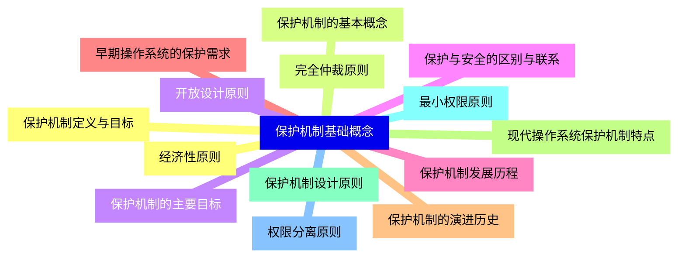

<--->
{}
{}
{}
{}
{}
{}
{}
{}
{}
{}
{}
{}
{}
{}
{}
{}
{}
{}
{}
{}
{}
{}
{}
{}
{}
{}
{}
{}
{}

### 2 硬件支持的保护机制{#2}

{}
{}
{}
{}
{}
{}
{}
{}
{}
{}
{}
{}
{}
{}
{}
{}
{}
{}
{}
{}
{}
{}
{}
{}
{}
{}
{}
<--->
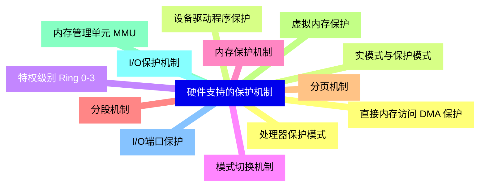

{}

### 3 访问控制机制{#3}

{}
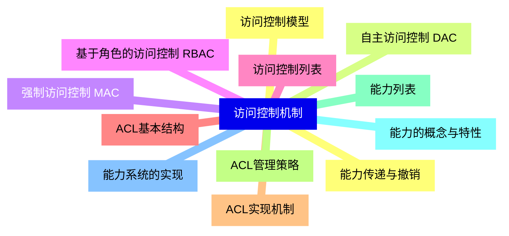

<--->
{}
{}
{}
{}
{}
{}
{}
{}
{}
{}
{}
{}
{}
{}
{}
{}
{}
{}
{}
{}
{}
{}
{}
{}
{}

### 4 进程保护机制{#4}

{}
{}
{}
{}
{}
{}
{}
{}
{}
{}
{}
{}
{}
{}
{}
{}
{}
{}
{}
{}
{}
{}
{}
{}
{}
<--->
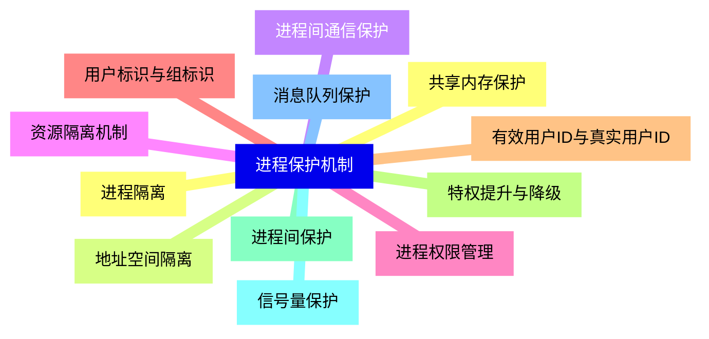

{}

### 5 文件系统保护{#5}

{}
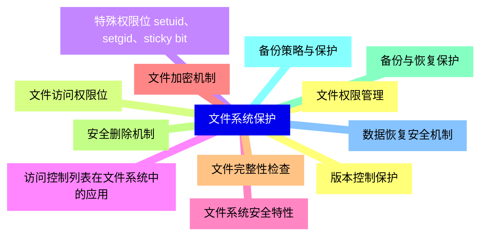

<--->
{}
{}
{}
{}
{}
{}
{}
{}
{}
{}
{}
{}
{}
{}
{}
{}
{}
{}
{}
{}
{}
{}
{}
{}
{}

### 6 网络安全保护{#6}

{}
{}
{}
{}
{}
{}
{}
{}
{}
{}
{}
{}
{}
{}
{}
{}
{}
{}
{}
{}
{}
{}
{}
{}
{}
<--->
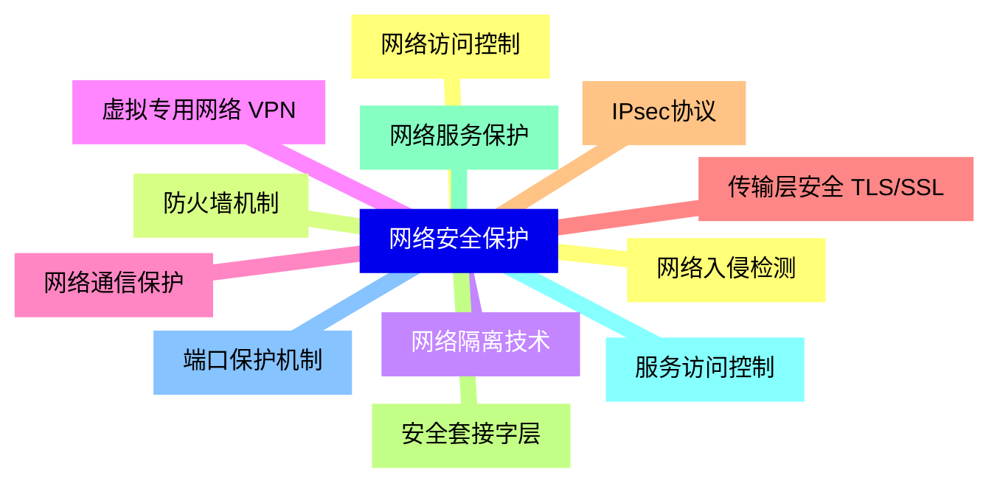

{}

### 7 用户认证与授权{#7}

{}
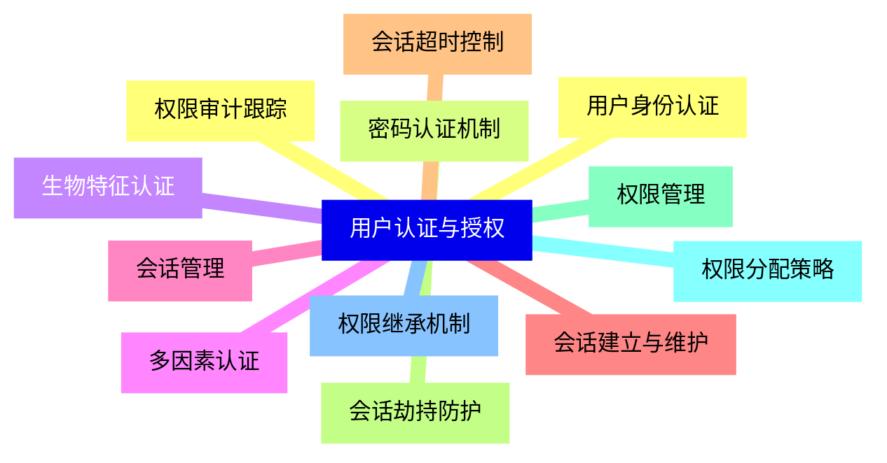

<--->
{}
{}
{}
{}
{}
{}
{}
{}
{}
{}
{}
{}
{}
{}
{}
{}
{}
{}
{}
{}
{}
{}
{}
{}
{}

### 8 系统调用保护{#8}

{}
{}
{}
{}
{}
{}
{}
{}
{}
{}
{}
{}
{}
{}
{}
{}
{}
{}
{}
{}
{}
{}
{}
{}
{}
<--->
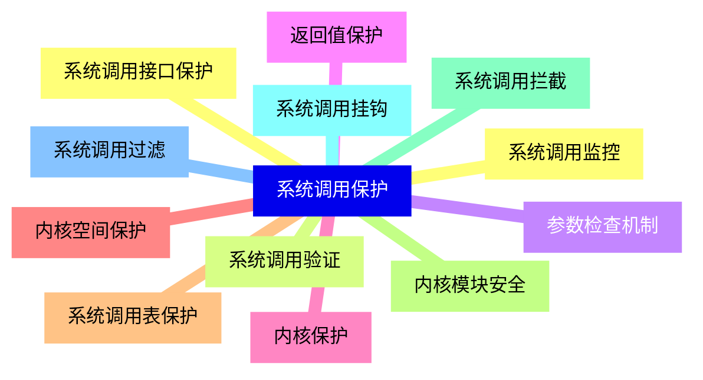

{}

### 9 虚拟化环境保护{#9}

{}
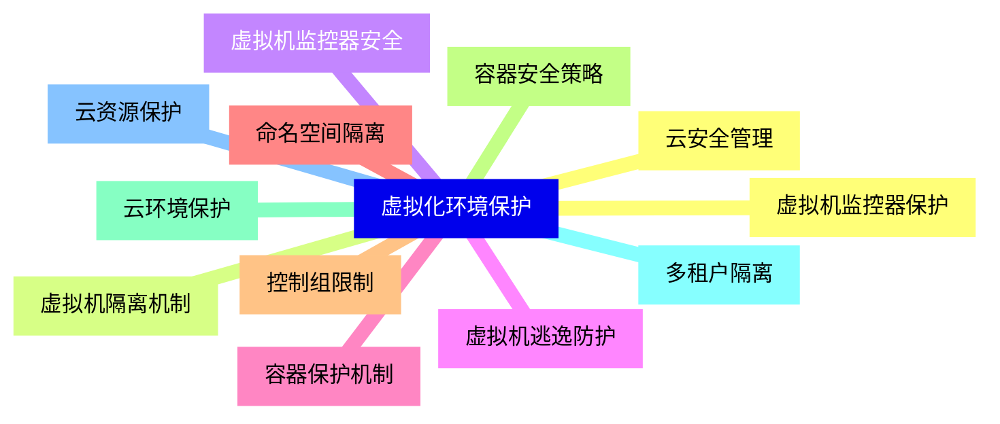

<--->
{}
{}
{}
{}
{}
{}
{}
{}
{}
{}
{}
{}
{}
{}
{}
{}
{}
{}
{}
{}
{}
{}
{}
{}
{}

### 10 安全审计与监控{#10}

{}
{}
{}
{}
{}
{}
{}
{}
{}
{}
{}
{}
{}
{}
{}
{}
{}
{}
{}
{}
{}
{}
{}
{}
{}
<--->
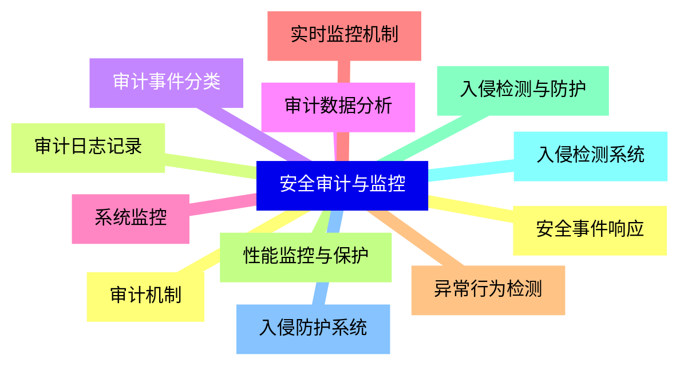

{}

### 11 保护机制实现技术{#11}

{}
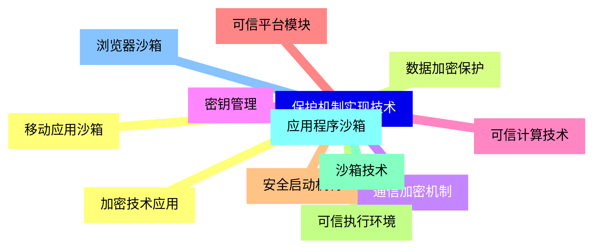

<--->
{}
{}
{}
{}
{}
{}
{}
{}
{}
{}
{}
{}
{}
{}
{}
{}
{}
{}
{}
{}
{}
{}
{}
{}
{}

### 12 保护机制评估与测试{#12}

{}
{}
{}
{}
{}
{}
{}
{}
{}
{}
{}
{}
{}
{}
{}
{}
{}
{}
{}
{}
{}
{}
{}
{}
{}
<--->
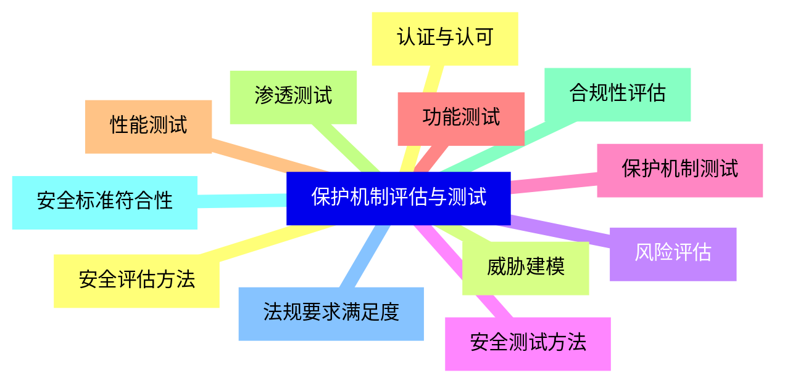

{}
