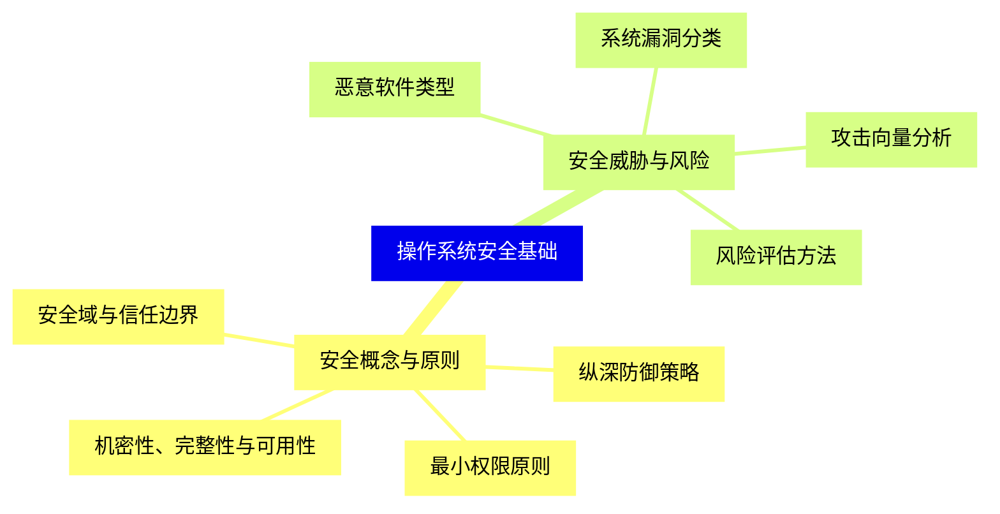
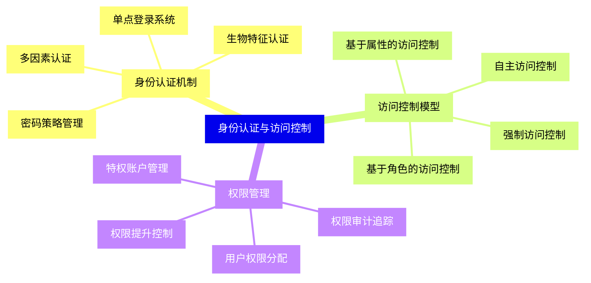
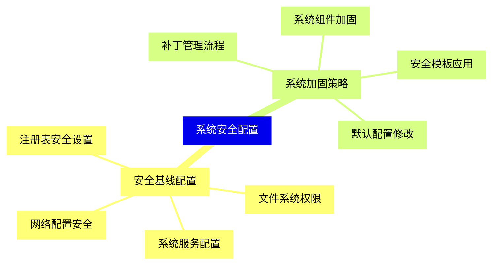
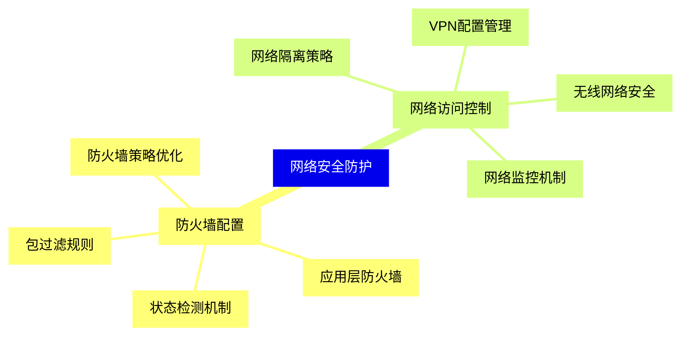
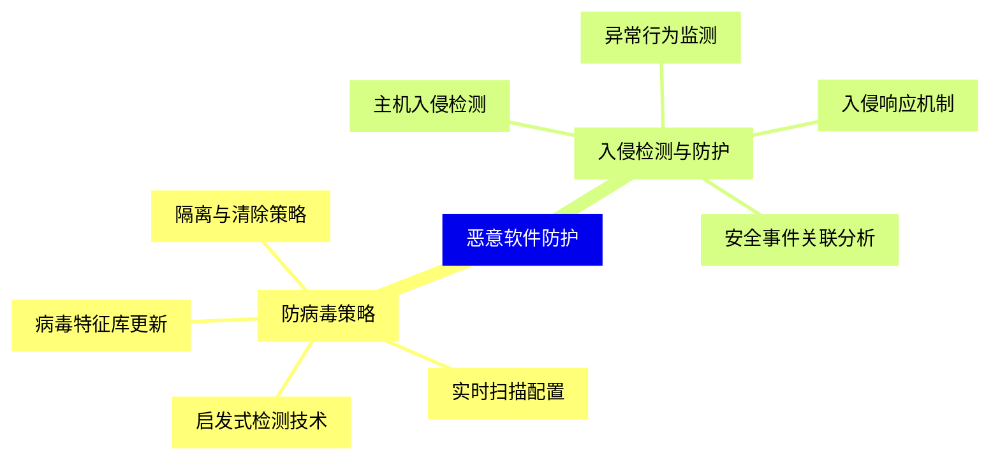
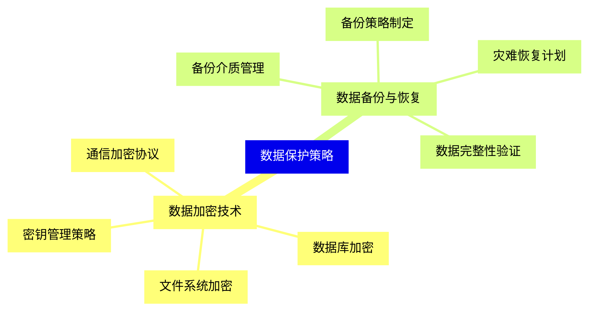
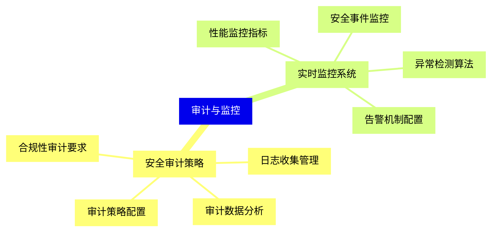
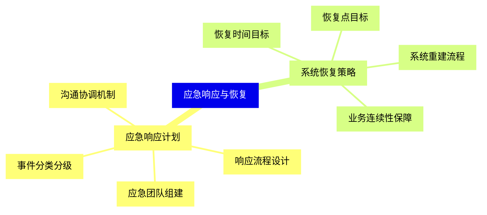
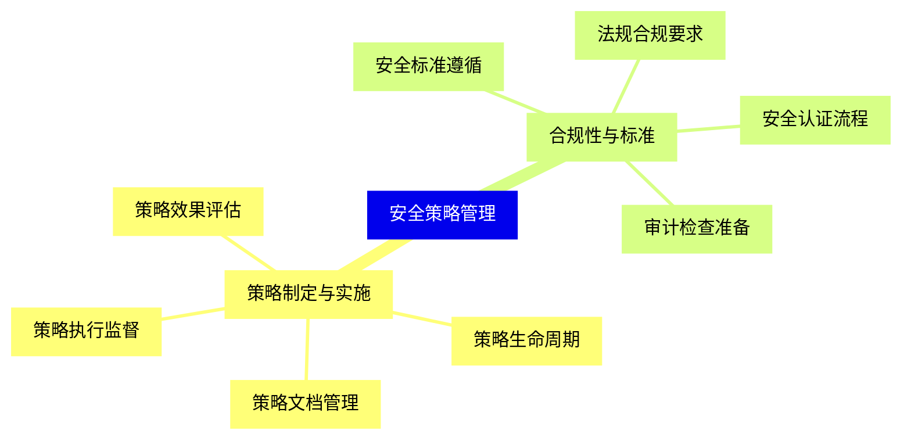
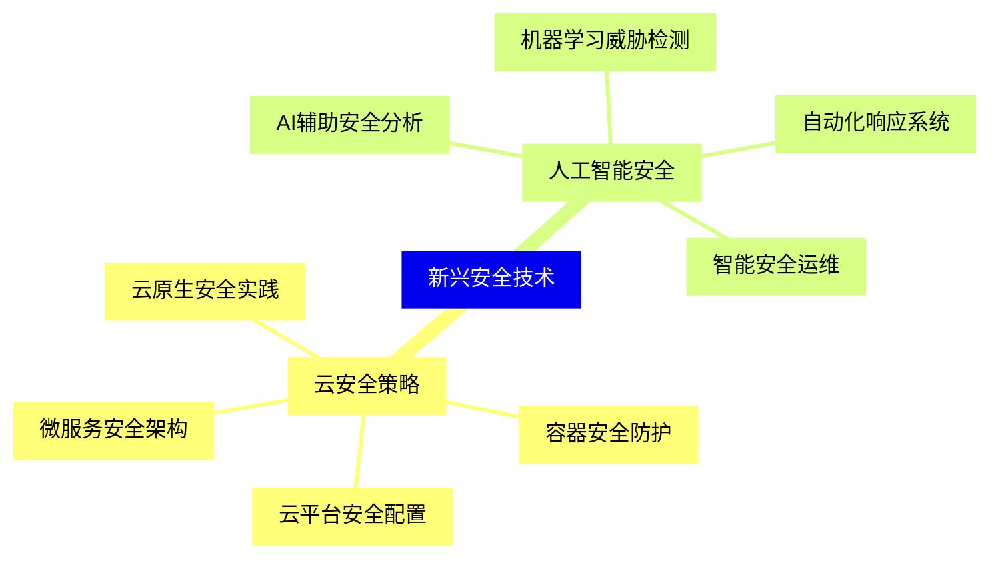


### 1 [操作系统安全基础](#1)
#### 1.1 [安全概念与原则](#1)
##### 1.1.1 [机密性、完整性与可用性](#1)
##### 1.1.2 [最小权限原则](#1)
##### 1.1.3 [纵深防御策略](#1)
##### 1.1.4 [安全域与信任边界](#1)
#### 1.2 [安全威胁与风险](#1)
##### 1.2.1 [恶意软件类型](#1)
##### 1.2.2 [系统漏洞分类](#1)
##### 1.2.3 [攻击向量分析](#1)
##### 1.2.4 [风险评估方法](#1)
### 2 [身份认证与访问控制](#2)
#### 2.1 [身份认证机制](#2)
##### 2.1.1 [密码策略管理](#2)
##### 2.1.2 [多因素认证](#2)
##### 2.1.3 [生物特征认证](#2)
##### 2.1.4 [单点登录系统](#2)
#### 2.2 [访问控制模型](#2)
##### 2.2.1 [自主访问控制](#2)
##### 2.2.2 [强制访问控制](#2)
##### 2.2.3 [基于角色的访问控制](#2)
##### 2.2.4 [基于属性的访问控制](#2)
#### 2.3 [权限管理](#2)
##### 2.3.1 [用户权限分配](#2)
##### 2.3.2 [特权账户管理](#2)
##### 2.3.3 [权限提升控制](#2)
##### 2.3.4 [权限审计追踪](#2)
### 3 [系统安全配置](#3)
#### 3.1 [安全基线配置](#3)
##### 3.1.1 [系统服务配置](#3)
##### 3.1.2 [网络配置安全](#3)
##### 3.1.3 [文件系统权限](#3)
##### 3.1.4 [注册表安全设置](#3)
#### 3.2 [系统加固策略](#3)
##### 3.2.1 [补丁管理流程](#3)
##### 3.2.2 [系统组件加固](#3)
##### 3.2.3 [默认配置修改](#3)
##### 3.2.4 [安全模板应用](#3)
### 4 [网络安全防护](#4)
#### 4.1 [防火墙配置](#4)
##### 4.1.1 [包过滤规则](#4)
##### 4.1.2 [状态检测机制](#4)
##### 4.1.3 [应用层防火墙](#4)
##### 4.1.4 [防火墙策略优化](#4)
#### 4.2 [网络访问控制](#4)
##### 4.2.1 [网络隔离策略](#4)
##### 4.2.2 [VPN配置管理](#4)
##### 4.2.3 [无线网络安全](#4)
##### 4.2.4 [网络监控机制](#4)
### 5 [恶意软件防护](#5)
#### 5.1 [防病毒策略](#5)
##### 5.1.1 [病毒特征库更新](#5)
##### 5.1.2 [实时扫描配置](#5)
##### 5.1.3 [启发式检测技术](#5)
##### 5.1.4 [隔离与清除策略](#5)
#### 5.2 [入侵检测与防护](#5)
##### 5.2.1 [主机入侵检测](#5)
##### 5.2.2 [异常行为监测](#5)
##### 5.2.3 [入侵响应机制](#5)
##### 5.2.4 [安全事件关联分析](#5)
### 6 [数据保护策略](#6)
#### 6.1 [数据加密技术](#6)
##### 6.1.1 [文件系统加密](#6)
##### 6.1.2 [数据库加密](#6)
##### 6.1.3 [通信加密协议](#6)
##### 6.1.4 [密钥管理策略](#6)
#### 6.2 [数据备份与恢复](#6)
##### 6.2.1 [备份策略制定](#6)
##### 6.2.2 [备份介质管理](#6)
##### 6.2.3 [灾难恢复计划](#6)
##### 6.2.4 [数据完整性验证](#6)
### 7 [审计与监控](#7)
#### 7.1 [安全审计策略](#7)
##### 7.1.1 [审计策略配置](#7)
##### 7.1.2 [日志收集管理](#7)
##### 7.1.3 [审计数据分析](#7)
##### 7.1.4 [合规性审计要求](#7)
#### 7.2 [实时监控系统](#7)
##### 7.2.1 [性能监控指标](#7)
##### 7.2.2 [安全事件监控](#7)
##### 7.2.3 [异常检测算法](#7)
##### 7.2.4 [告警机制配置](#7)
### 8 [应急响应与恢复](#8)
#### 8.1 [应急响应计划](#8)
##### 8.1.1 [事件分类分级](#8)
##### 8.1.2 [响应流程设计](#8)
##### 8.1.3 [应急团队组建](#8)
##### 8.1.4 [沟通协调机制](#8)
#### 8.2 [系统恢复策略](#8)
##### 8.2.1 [恢复时间目标](#8)
##### 8.2.2 [恢复点目标](#8)
##### 8.2.3 [系统重建流程](#8)
##### 8.2.4 [业务连续性保障](#8)
### 9 [安全策略管理](#9)
#### 9.1 [策略制定与实施](#9)
##### 9.1.1 [策略生命周期](#9)
##### 9.1.2 [策略文档管理](#9)
##### 9.1.3 [策略执行监督](#9)
##### 9.1.4 [策略效果评估](#9)
#### 9.2 [合规性与标准](#9)
##### 9.2.1 [安全标准遵循](#9)
##### 9.2.2 [法规合规要求](#9)
##### 9.2.3 [安全认证流程](#9)
##### 9.2.4 [审计检查准备](#9)
### 10 [新兴安全技术](#10)
#### 10.1 [云安全策略](#10)
##### 10.1.1 [云平台安全配置](#10)
##### 10.1.2 [容器安全防护](#10)
##### 10.1.3 [微服务安全架构](#10)
##### 10.1.4 [云原生安全实践](#10)
#### 10.2 [人工智能安全](#10)
##### 10.2.1 [AI辅助安全分析](#10)
##### 10.2.2 [机器学习威胁检测](#10)
##### 10.2.3 [自动化响应系统](#10)
##### 10.2.4 [智能安全运维](#10)




### 1 操作系统安全基础

---
### 1 操作系统安全基础
___
#### 1.1 安全概念与原则
___
##### 1.1.1 机密性、完整性与可用性
___
##### 1.1.2 最小权限原则
___
##### 1.1.3 纵深防御策略
___
##### 1.1.4 安全域与信任边界
___
#### 1.2 安全威胁与风险
___
##### 1.2.1 恶意软件类型
___
##### 1.2.2 系统漏洞分类
___
##### 1.2.3 攻击向量分析
___
##### 1.2.4 风险评估方法
### 2 身份认证与访问控制

---
### 2 身份认证与访问控制
___
#### 2.1 身份认证机制
___
##### 2.1.1 密码策略管理
___
##### 2.1.2 多因素认证
___
##### 2.1.3 生物特征认证
___
##### 2.1.4 单点登录系统
___
#### 2.2 访问控制模型
___
##### 2.2.1 自主访问控制
___
##### 2.2.2 强制访问控制
___
##### 2.2.3 基于角色的访问控制
___
##### 2.2.4 基于属性的访问控制
___
#### 2.3 权限管理
___
##### 2.3.1 用户权限分配
___
##### 2.3.2 特权账户管理
___
##### 2.3.3 权限提升控制
___
##### 2.3.4 权限审计追踪
### 3 系统安全配置

---
### 3 系统安全配置
___
#### 3.1 安全基线配置
___
##### 3.1.1 系统服务配置
___
##### 3.1.2 网络配置安全
___
##### 3.1.3 文件系统权限
___
##### 3.1.4 注册表安全设置
___
#### 3.2 系统加固策略
___
##### 3.2.1 补丁管理流程
___
##### 3.2.2 系统组件加固
___
##### 3.2.3 默认配置修改
___
##### 3.2.4 安全模板应用
### 4 网络安全防护

---
### 4 网络安全防护
___
#### 4.1 防火墙配置
___
##### 4.1.1 包过滤规则
___
##### 4.1.2 状态检测机制
___
##### 4.1.3 应用层防火墙
___
##### 4.1.4 防火墙策略优化
___
#### 4.2 网络访问控制
___
##### 4.2.1 网络隔离策略
___
##### 4.2.2 VPN配置管理
___
##### 4.2.3 无线网络安全
___
##### 4.2.4 网络监控机制
### 5 恶意软件防护

---
### 5 恶意软件防护
___
#### 5.1 防病毒策略
___
##### 5.1.1 病毒特征库更新
___
##### 5.1.2 实时扫描配置
___
##### 5.1.3 启发式检测技术
___
##### 5.1.4 隔离与清除策略
___
#### 5.2 入侵检测与防护
___
##### 5.2.1 主机入侵检测
___
##### 5.2.2 异常行为监测
___
##### 5.2.3 入侵响应机制
___
##### 5.2.4 安全事件关联分析
### 6 数据保护策略

---
### 6 数据保护策略
___
#### 6.1 数据加密技术
___
##### 6.1.1 文件系统加密
___
##### 6.1.2 数据库加密
___
##### 6.1.3 通信加密协议
___
##### 6.1.4 密钥管理策略
___
#### 6.2 数据备份与恢复
___
##### 6.2.1 备份策略制定
___
##### 6.2.2 备份介质管理
___
##### 6.2.3 灾难恢复计划
___
##### 6.2.4 数据完整性验证
### 7 审计与监控

---
### 7 审计与监控
___
#### 7.1 安全审计策略
___
##### 7.1.1 审计策略配置
___
##### 7.1.2 日志收集管理
___
##### 7.1.3 审计数据分析
___
##### 7.1.4 合规性审计要求
___
#### 7.2 实时监控系统
___
##### 7.2.1 性能监控指标
___
##### 7.2.2 安全事件监控
___
##### 7.2.3 异常检测算法
___
##### 7.2.4 告警机制配置
### 8 应急响应与恢复

---
### 8 应急响应与恢复
___
#### 8.1 应急响应计划
___
##### 8.1.1 事件分类分级
___
##### 8.1.2 响应流程设计
___
##### 8.1.3 应急团队组建
___
##### 8.1.4 沟通协调机制
___
#### 8.2 系统恢复策略
___
##### 8.2.1 恢复时间目标
___
##### 8.2.2 恢复点目标
___
##### 8.2.3 系统重建流程
___
##### 8.2.4 业务连续性保障
### 9 安全策略管理

---
### 9 安全策略管理
___
#### 9.1 策略制定与实施
___
##### 9.1.1 策略生命周期
___
##### 9.1.2 策略文档管理
___
##### 9.1.3 策略执行监督
___
##### 9.1.4 策略效果评估
___
#### 9.2 合规性与标准
___
##### 9.2.1 安全标准遵循
___
##### 9.2.2 法规合规要求
___
##### 9.2.3 安全认证流程
___
##### 9.2.4 审计检查准备
### 10 新兴安全技术

---
### 10 新兴安全技术
___
#### 10.1 云安全策略
___
##### 10.1.1 云平台安全配置
___
##### 10.1.2 容器安全防护
___
##### 10.1.3 微服务安全架构
___
##### 10.1.4 云原生安全实践
___
#### 10.2 人工智能安全
___
##### 10.2.1 AI辅助安全分析
___
##### 10.2.2 机器学习威胁检测
___
##### 10.2.3 自动化响应系统
___
##### 10.2.4 智能安全运维


### 1 操作系统安全基础{#1}

{}

<--->
{}
{}
{}
{}
{}
{}
{}
{}
{}
{}
{}
{}
{}
{}
{}
{}
{}
{}
{}
{}
{}

### 2 身份认证与访问控制{#2}

{}
{}
{}
{}
{}
{}
{}
{}
{}
{}
{}
{}
{}
{}
{}
{}
{}
{}
{}
{}
{}
{}
{}
{}
{}
{}
{}
{}
{}
{}
{}
<--->

{}

### 3 系统安全配置{#3}

{}

<--->
{}
{}
{}
{}
{}
{}
{}
{}
{}
{}
{}
{}
{}
{}
{}
{}
{}
{}
{}
{}
{}

### 4 网络安全防护{#4}

{}
{}
{}
{}
{}
{}
{}
{}
{}
{}
{}
{}
{}
{}
{}
{}
{}
{}
{}
{}
{}
<--->

{}

### 5 恶意软件防护{#5}

{}

<--->
{}
{}
{}
{}
{}
{}
{}
{}
{}
{}
{}
{}
{}
{}
{}
{}
{}
{}
{}
{}
{}

### 6 数据保护策略{#6}

{}
{}
{}
{}
{}
{}
{}
{}
{}
{}
{}
{}
{}
{}
{}
{}
{}
{}
{}
{}
{}
<--->

{}

### 7 审计与监控{#7}

{}

<--->
{}
{}
{}
{}
{}
{}
{}
{}
{}
{}
{}
{}
{}
{}
{}
{}
{}
{}
{}
{}
{}

### 8 应急响应与恢复{#8}

{}
{}
{}
{}
{}
{}
{}
{}
{}
{}
{}
{}
{}
{}
{}
{}
{}
{}
{}
{}
{}
<--->

{}

### 9 安全策略管理{#9}

{}

<--->
{}
{}
{}
{}
{}
{}
{}
{}
{}
{}
{}
{}
{}
{}
{}
{}
{}
{}
{}
{}
{}

### 10 新兴安全技术{#10}

{}
{}
{}
{}
{}
{}
{}
{}
{}
{}
{}
{}
{}
{}
{}
{}
{}
{}
{}
{}
{}
<--->

{}
