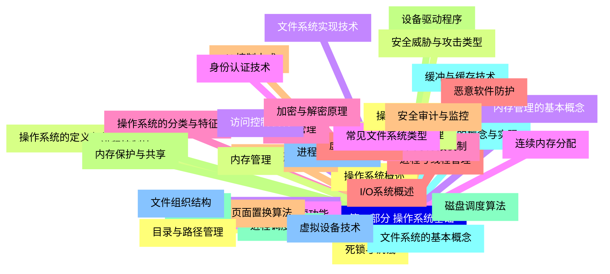
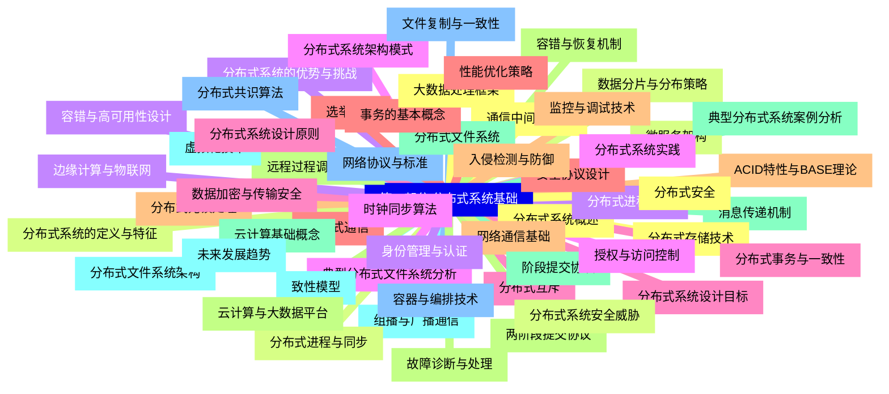


### 1 [第一部分 操作系统基础](#1)
#### 1.1 [操作系统概述](#1)
#### 1.2 [操作系统的定义与作用](#1)
#### 1.3 [操作系统的发展历史](#1)
#### 1.4 [操作系统的主要功能](#1)
#### 1.5 [操作系统的分类与特征](#1)
#### 1.6 [进程与线程管理](#1)
#### 1.7 [进程的概念与状态](#1)
#### 1.8 [进程控制块 PCB](#1)
#### 1.9 [进程调度算法](#1)
#### 1.10 [线程的概念与实现](#1)
#### 1.11 [进程同步与互斥](#1)
#### 1.12 [死锁与饥饿](#1)
#### 1.13 [内存管理](#1)
#### 1.14 [内存管理的基本概念](#1)
#### 1.15 [连续内存分配](#1)
#### 1.16 [分页与分段机制](#1)
#### 1.17 [虚拟内存技术](#1)
#### 1.18 [页面置换算法](#1)
#### 1.19 [内存保护与共享](#1)
#### 1.20 [文件系统](#1)
#### 1.21 [文件系统的基本概念](#1)
#### 1.22 [文件组织结构](#1)
#### 1.23 [目录与路径管理](#1)
#### 1.24 [文件存储空间管理](#1)
#### 1.25 [文件系统实现技术](#1)
#### 1.26 [常见文件系统类型](#1)
#### 1.27 [设备管理](#1)
#### 1.28 [I/O系统概述](#1)
#### 1.29 [I/O控制方式](#1)
#### 1.30 [设备驱动程序](#1)
#### 1.31 [磁盘调度算法](#1)
#### 1.32 [缓冲与缓存技术](#1)
#### 1.33 [虚拟设备技术](#1)
#### 1.34 [操作系统安全](#1)
#### 1.35 [安全威胁与攻击类型](#1)
#### 1.36 [访问控制机制](#1)
#### 1.37 [身份认证技术](#1)
#### 1.38 [加密与解密原理](#1)
#### 1.39 [恶意软件防护](#1)
#### 1.40 [安全审计与监控](#1)
### 2 [第二部分 分布式系统基础](#2)
#### 2.1 [分布式系统概述](#2)
#### 2.2 [分布式系统的定义与特征](#2)
#### 2.3 [分布式系统的优势与挑战](#2)
#### 2.4 [分布式系统架构模式](#2)
#### 2.5 [分布式系统设计目标](#2)
#### 2.6 [分布式通信](#2)
#### 2.7 [网络通信基础](#2)
#### 2.8 [远程过程调用 RPC](#2)
#### 2.9 [消息传递机制](#2)
#### 2.10 [组播与广播通信](#2)
#### 2.11 [网络协议与标准](#2)
#### 2.12 [通信中间件技术](#2)
#### 2.13 [分布式进程与同步](#2)
#### 2.14 [分布式进程管理](#2)
#### 2.15 [时钟同步算法](#2)
#### 2.16 [分布式互斥](#2)
#### 2.17 [选举算法](#2)
#### 2.18 [分布式死锁处理](#2)
#### 2.19 [容错与恢复机制](#2)
#### 2.20 [分布式文件系统](#2)
#### 2.21 [分布式文件系统架构](#2)
#### 2.22 [文件复制与一致性](#2)
#### 2.23 [分布式存储技术](#2)
#### 2.24 [数据分片与分布策略](#2)
#### 2.25 [容错与高可用性设计](#2)
#### 2.26 [典型分布式文件系统分析](#2)
#### 2.27 [分布式事务与一致性](#2)
#### 2.28 [事务的基本概念](#2)
#### 2.29 [ACID特性与BASE理论](#2)
#### 2.30 [两阶段提交协议](#2)
#### 2.31 [阶段提交协议](#2)
#### 2.32 [致性模型](#2)
#### 2.33 [分布式共识算法](#2)
#### 2.34 [分布式安全](#2)
#### 2.35 [分布式系统安全威胁](#2)
#### 2.36 [身份管理与认证](#2)
#### 2.37 [授权与访问控制](#2)
#### 2.38 [数据加密与传输安全](#2)
#### 2.39 [安全协议设计](#2)
#### 2.40 [入侵检测与防御](#2)
#### 2.41 [云计算与大数据平台](#2)
#### 2.42 [云计算基础概念](#2)
#### 2.43 [虚拟化技术](#2)
#### 2.44 [容器与编排技术](#2)
#### 2.45 [大数据处理框架](#2)
#### 2.46 [微服务架构](#2)
#### 2.47 [边缘计算与物联网](#2)
#### 2.48 [分布式系统实践](#2)
#### 2.49 [分布式系统设计原则](#2)
#### 2.50 [性能优化策略](#2)
#### 2.51 [监控与调试技术](#2)
#### 2.52 [故障诊断与处理](#2)
#### 2.53 [典型分布式系统案例分析](#2)
#### 2.54 [未来发展趋势](#2)




### 1 第一部分 操作系统基础

---
### 1 第一部分 操作系统基础
___
#### 1.1 操作系统概述
___
#### 1.2 操作系统的定义与作用
___
#### 1.3 操作系统的发展历史
___
#### 1.4 操作系统的主要功能
___
#### 1.5 操作系统的分类与特征
___
#### 1.6 进程与线程管理
___
#### 1.7 进程的概念与状态
___
#### 1.8 进程控制块 PCB
___
#### 1.9 进程调度算法
___
#### 1.10 线程的概念与实现
___
#### 1.11 进程同步与互斥
___
#### 1.12 死锁与饥饿
___
#### 1.13 内存管理
___
#### 1.14 内存管理的基本概念
___
#### 1.15 连续内存分配
___
#### 1.16 分页与分段机制
___
#### 1.17 虚拟内存技术
___
#### 1.18 页面置换算法
___
#### 1.19 内存保护与共享
___
#### 1.20 文件系统
___
#### 1.21 文件系统的基本概念
___
#### 1.22 文件组织结构
___
#### 1.23 目录与路径管理
___
#### 1.24 文件存储空间管理
___
#### 1.25 文件系统实现技术
___
#### 1.26 常见文件系统类型
___
#### 1.27 设备管理
___
#### 1.28 I/O系统概述
___
#### 1.29 I/O控制方式
___
#### 1.30 设备驱动程序
___
#### 1.31 磁盘调度算法
___
#### 1.32 缓冲与缓存技术
___
#### 1.33 虚拟设备技术
___
#### 1.34 操作系统安全
___
#### 1.35 安全威胁与攻击类型
___
#### 1.36 访问控制机制
___
#### 1.37 身份认证技术
___
#### 1.38 加密与解密原理
___
#### 1.39 恶意软件防护
___
#### 1.40 安全审计与监控
### 2 第二部分 分布式系统基础

---
### 2 第二部分 分布式系统基础
___
#### 2.1 分布式系统概述
___
#### 2.2 分布式系统的定义与特征
___
#### 2.3 分布式系统的优势与挑战
___
#### 2.4 分布式系统架构模式
___
#### 2.5 分布式系统设计目标
___
#### 2.6 分布式通信
___
#### 2.7 网络通信基础
___
#### 2.8 远程过程调用 RPC
___
#### 2.9 消息传递机制
___
#### 2.10 组播与广播通信
___
#### 2.11 网络协议与标准
___
#### 2.12 通信中间件技术
___
#### 2.13 分布式进程与同步
___
#### 2.14 分布式进程管理
___
#### 2.15 时钟同步算法
___
#### 2.16 分布式互斥
___
#### 2.17 选举算法
___
#### 2.18 分布式死锁处理
___
#### 2.19 容错与恢复机制
___
#### 2.20 分布式文件系统
___
#### 2.21 分布式文件系统架构
___
#### 2.22 文件复制与一致性
___
#### 2.23 分布式存储技术
___
#### 2.24 数据分片与分布策略
___
#### 2.25 容错与高可用性设计
___
#### 2.26 典型分布式文件系统分析
___
#### 2.27 分布式事务与一致性
___
#### 2.28 事务的基本概念
___
#### 2.29 ACID特性与BASE理论
___
#### 2.30 两阶段提交协议
___
#### 2.31 阶段提交协议
___
#### 2.32 致性模型
___
#### 2.33 分布式共识算法
___
#### 2.34 分布式安全
___
#### 2.35 分布式系统安全威胁
___
#### 2.36 身份管理与认证
___
#### 2.37 授权与访问控制
___
#### 2.38 数据加密与传输安全
___
#### 2.39 安全协议设计
___
#### 2.40 入侵检测与防御
___
#### 2.41 云计算与大数据平台
___
#### 2.42 云计算基础概念
___
#### 2.43 虚拟化技术
___
#### 2.44 容器与编排技术
___
#### 2.45 大数据处理框架
___
#### 2.46 微服务架构
___
#### 2.47 边缘计算与物联网
___
#### 2.48 分布式系统实践
___
#### 2.49 分布式系统设计原则
___
#### 2.50 性能优化策略
___
#### 2.51 监控与调试技术
___
#### 2.52 故障诊断与处理
___
#### 2.53 典型分布式系统案例分析
___
#### 2.54 未来发展趋势


### 1 第一部分 操作系统基础{#1}

{}

<--->
{}
{}
{}
{}
{}
{}
{}
{}
{}
{}
{}
{}
{}
{}
{}
{}
{}
{}
{}
{}
{}
{}
{}
{}
{}
{}
{}
{}
{}
{}
{}
{}
{}
{}
{}
{}
{}
{}
{}
{}
{}
{}
{}
{}
{}
{}
{}
{}
{}
{}
{}
{}
{}
{}
{}
{}
{}
{}
{}
{}
{}
{}
{}
{}
{}
{}
{}
{}
{}
{}
{}
{}
{}
{}
{}
{}
{}
{}
{}
{}
{}

### 2 第二部分 分布式系统基础{#2}

{}
{}
{}
{}
{}
{}
{}
{}
{}
{}
{}
{}
{}
{}
{}
{}
{}
{}
{}
{}
{}
{}
{}
{}
{}
{}
{}
{}
{}
{}
{}
{}
{}
{}
{}
{}
{}
{}
{}
{}
{}
{}
{}
{}
{}
{}
{}
{}
{}
{}
{}
{}
{}
{}
{}
{}
{}
{}
{}
{}
{}
{}
{}
{}
{}
{}
{}
{}
{}
{}
{}
{}
{}
{}
{}
{}
{}
{}
{}
{}
{}
{}
{}
{}
{}
{}
{}
{}
{}
{}
{}
{}
{}
{}
{}
{}
{}
{}
{}
{}
{}
{}
{}
{}
{}
{}
{}
{}
{}
<--->

{}
