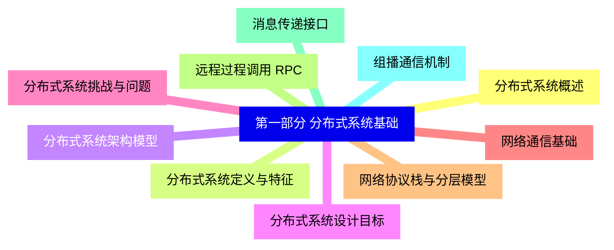
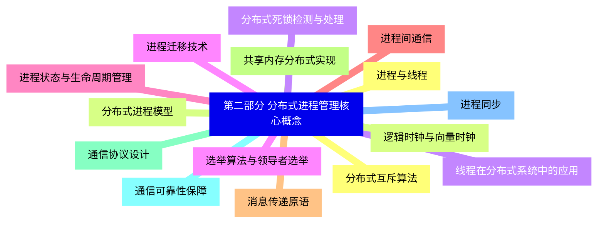
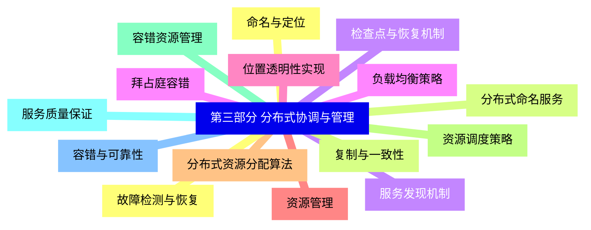
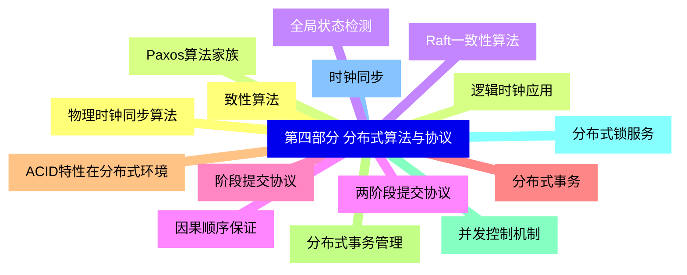
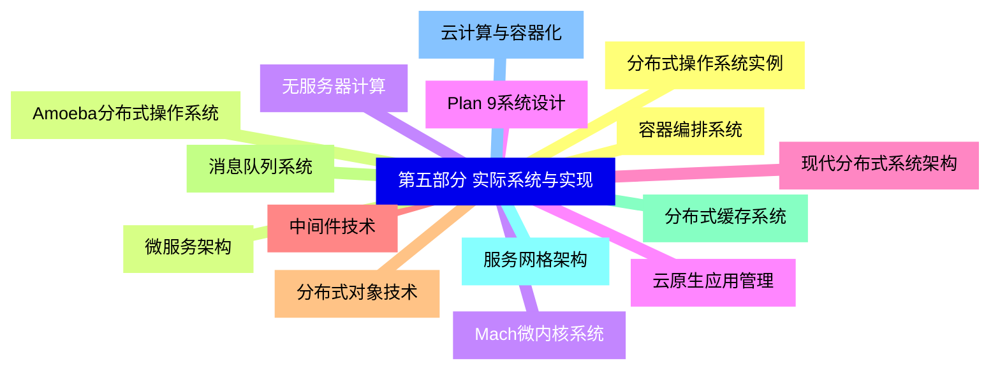
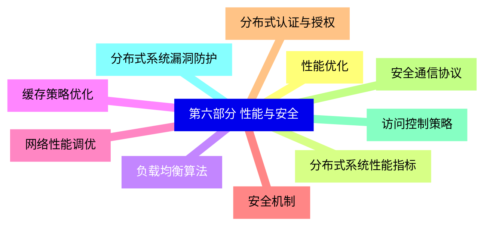
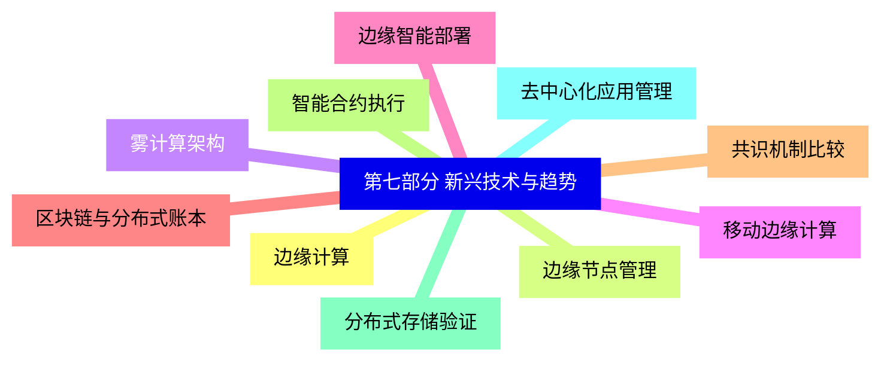


### 1 [第一部分 分布式系统基础](#1)
#### 1.1 [分布式系统概述](#1)
#### 1.2 [分布式系统定义与特征](#1)
#### 1.3 [分布式系统架构模型](#1)
#### 1.4 [分布式系统设计目标](#1)
#### 1.5 [分布式系统挑战与问题](#1)
#### 1.6 [网络通信基础](#1)
#### 1.7 [网络协议栈与分层模型](#1)
#### 1.8 [远程过程调用 RPC](#1)
#### 1.9 [消息传递接口](#1)
#### 1.10 [组播通信机制](#1)
### 2 [第二部分 分布式进程管理核心概念](#2)
#### 2.1 [进程与线程](#2)
#### 2.2 [分布式进程模型](#2)
#### 2.3 [线程在分布式系统中的应用](#2)
#### 2.4 [进程迁移技术](#2)
#### 2.5 [进程状态与生命周期管理](#2)
#### 2.6 [进程间通信](#2)
#### 2.7 [消息传递原语](#2)
#### 2.8 [共享内存分布式实现](#2)
#### 2.9 [通信协议设计](#2)
#### 2.10 [通信可靠性保障](#2)
#### 2.11 [进程同步](#2)
#### 2.12 [分布式互斥算法](#2)
#### 2.13 [逻辑时钟与向量时钟](#2)
#### 2.14 [分布式死锁检测与处理](#2)
#### 2.15 [选举算法与领导者选举](#2)
### 3 [第三部分 分布式协调与管理](#3)
#### 3.1 [命名与定位](#3)
#### 3.2 [分布式命名服务](#3)
#### 3.3 [服务发现机制](#3)
#### 3.4 [负载均衡策略](#3)
#### 3.5 [位置透明性实现](#3)
#### 3.6 [资源管理](#3)
#### 3.7 [分布式资源分配算法](#3)
#### 3.8 [资源调度策略](#3)
#### 3.9 [容错资源管理](#3)
#### 3.10 [服务质量保证](#3)
#### 3.11 [容错与可靠性](#3)
#### 3.12 [故障检测与恢复](#3)
#### 3.13 [复制与一致性](#3)
#### 3.14 [检查点与恢复机制](#3)
#### 3.15 [拜占庭容错](#3)
### 4 [第四部分 分布式算法与协议](#4)
#### 4.1 [致性算法](#4)
#### 4.2 [Paxos算法家族](#4)
#### 4.3 [Raft一致性算法](#4)
#### 4.4 [两阶段提交协议](#4)
#### 4.5 [阶段提交协议](#4)
#### 4.6 [分布式事务](#4)
#### 4.7 [ACID特性在分布式环境](#4)
#### 4.8 [分布式事务管理](#4)
#### 4.9 [并发控制机制](#4)
#### 4.10 [分布式锁服务](#4)
#### 4.11 [时钟同步](#4)
#### 4.12 [物理时钟同步算法](#4)
#### 4.13 [逻辑时钟应用](#4)
#### 4.14 [全局状态检测](#4)
#### 4.15 [因果顺序保证](#4)
### 5 [第五部分 实际系统与实现](#5)
#### 5.1 [分布式操作系统实例](#5)
#### 5.2 [Amoeba分布式操作系统](#5)
#### 5.3 [Mach微内核系统](#5)
#### 5.4 [Plan 9系统设计](#5)
#### 5.5 [现代分布式系统架构](#5)
#### 5.6 [中间件技术](#5)
#### 5.7 [分布式对象技术](#5)
#### 5.8 [消息队列系统](#5)
#### 5.9 [分布式缓存系统](#5)
#### 5.10 [服务网格架构](#5)
#### 5.11 [云计算与容器化](#5)
#### 5.12 [容器编排系统](#5)
#### 5.13 [微服务架构](#5)
#### 5.14 [无服务器计算](#5)
#### 5.15 [云原生应用管理](#5)
### 6 [第六部分 性能与安全](#6)
#### 6.1 [性能优化](#6)
#### 6.2 [分布式系统性能指标](#6)
#### 6.3 [负载均衡算法](#6)
#### 6.4 [缓存策略优化](#6)
#### 6.5 [网络性能调优](#6)
#### 6.6 [安全机制](#6)
#### 6.7 [分布式认证与授权](#6)
#### 6.8 [安全通信协议](#6)
#### 6.9 [访问控制策略](#6)
#### 6.10 [分布式系统漏洞防护](#6)
### 7 [第七部分 新兴技术与趋势](#7)
#### 7.1 [边缘计算](#7)
#### 7.2 [边缘节点管理](#7)
#### 7.3 [雾计算架构](#7)
#### 7.4 [移动边缘计算](#7)
#### 7.5 [边缘智能部署](#7)
#### 7.6 [区块链与分布式账本](#7)
#### 7.7 [共识机制比较](#7)
#### 7.8 [智能合约执行](#7)
#### 7.9 [分布式存储验证](#7)
#### 7.10 [去中心化应用管理](#7)




### 1 第一部分 分布式系统基础

---
### 1 第一部分 分布式系统基础
___
#### 1.1 分布式系统概述
___
#### 1.2 分布式系统定义与特征
___
#### 1.3 分布式系统架构模型
___
#### 1.4 分布式系统设计目标
___
#### 1.5 分布式系统挑战与问题
___
#### 1.6 网络通信基础
___
#### 1.7 网络协议栈与分层模型
___
#### 1.8 远程过程调用 RPC
___
#### 1.9 消息传递接口
___
#### 1.10 组播通信机制
### 2 第二部分 分布式进程管理核心概念

---
### 2 第二部分 分布式进程管理核心概念
___
#### 2.1 进程与线程
___
#### 2.2 分布式进程模型
___
#### 2.3 线程在分布式系统中的应用
___
#### 2.4 进程迁移技术
___
#### 2.5 进程状态与生命周期管理
___
#### 2.6 进程间通信
___
#### 2.7 消息传递原语
___
#### 2.8 共享内存分布式实现
___
#### 2.9 通信协议设计
___
#### 2.10 通信可靠性保障
___
#### 2.11 进程同步
___
#### 2.12 分布式互斥算法
___
#### 2.13 逻辑时钟与向量时钟
___
#### 2.14 分布式死锁检测与处理
___
#### 2.15 选举算法与领导者选举
### 3 第三部分 分布式协调与管理

---
### 3 第三部分 分布式协调与管理
___
#### 3.1 命名与定位
___
#### 3.2 分布式命名服务
___
#### 3.3 服务发现机制
___
#### 3.4 负载均衡策略
___
#### 3.5 位置透明性实现
___
#### 3.6 资源管理
___
#### 3.7 分布式资源分配算法
___
#### 3.8 资源调度策略
___
#### 3.9 容错资源管理
___
#### 3.10 服务质量保证
___
#### 3.11 容错与可靠性
___
#### 3.12 故障检测与恢复
___
#### 3.13 复制与一致性
___
#### 3.14 检查点与恢复机制
___
#### 3.15 拜占庭容错
### 4 第四部分 分布式算法与协议

---
### 4 第四部分 分布式算法与协议
___
#### 4.1 致性算法
___
#### 4.2 Paxos算法家族
___
#### 4.3 Raft一致性算法
___
#### 4.4 两阶段提交协议
___
#### 4.5 阶段提交协议
___
#### 4.6 分布式事务
___
#### 4.7 ACID特性在分布式环境
___
#### 4.8 分布式事务管理
___
#### 4.9 并发控制机制
___
#### 4.10 分布式锁服务
___
#### 4.11 时钟同步
___
#### 4.12 物理时钟同步算法
___
#### 4.13 逻辑时钟应用
___
#### 4.14 全局状态检测
___
#### 4.15 因果顺序保证
### 5 第五部分 实际系统与实现

---
### 5 第五部分 实际系统与实现
___
#### 5.1 分布式操作系统实例
___
#### 5.2 Amoeba分布式操作系统
___
#### 5.3 Mach微内核系统
___
#### 5.4 Plan 9系统设计
___
#### 5.5 现代分布式系统架构
___
#### 5.6 中间件技术
___
#### 5.7 分布式对象技术
___
#### 5.8 消息队列系统
___
#### 5.9 分布式缓存系统
___
#### 5.10 服务网格架构
___
#### 5.11 云计算与容器化
___
#### 5.12 容器编排系统
___
#### 5.13 微服务架构
___
#### 5.14 无服务器计算
___
#### 5.15 云原生应用管理
### 6 第六部分 性能与安全

---
### 6 第六部分 性能与安全
___
#### 6.1 性能优化
___
#### 6.2 分布式系统性能指标
___
#### 6.3 负载均衡算法
___
#### 6.4 缓存策略优化
___
#### 6.5 网络性能调优
___
#### 6.6 安全机制
___
#### 6.7 分布式认证与授权
___
#### 6.8 安全通信协议
___
#### 6.9 访问控制策略
___
#### 6.10 分布式系统漏洞防护
### 7 第七部分 新兴技术与趋势

---
### 7 第七部分 新兴技术与趋势
___
#### 7.1 边缘计算
___
#### 7.2 边缘节点管理
___
#### 7.3 雾计算架构
___
#### 7.4 移动边缘计算
___
#### 7.5 边缘智能部署
___
#### 7.6 区块链与分布式账本
___
#### 7.7 共识机制比较
___
#### 7.8 智能合约执行
___
#### 7.9 分布式存储验证
___
#### 7.10 去中心化应用管理


### 1 第一部分 分布式系统基础{#1}

{}

<--->
{}
{}
{}
{}
{}
{}
{}
{}
{}
{}
{}
{}
{}
{}
{}
{}
{}
{}
{}
{}
{}

### 2 第二部分 分布式进程管理核心概念{#2}

{}
{}
{}
{}
{}
{}
{}
{}
{}
{}
{}
{}
{}
{}
{}
{}
{}
{}
{}
{}
{}
{}
{}
{}
{}
{}
{}
{}
{}
{}
{}
<--->

{}

### 3 第三部分 分布式协调与管理{#3}

{}

<--->
{}
{}
{}
{}
{}
{}
{}
{}
{}
{}
{}
{}
{}
{}
{}
{}
{}
{}
{}
{}
{}
{}
{}
{}
{}
{}
{}
{}
{}
{}
{}

### 4 第四部分 分布式算法与协议{#4}

{}
{}
{}
{}
{}
{}
{}
{}
{}
{}
{}
{}
{}
{}
{}
{}
{}
{}
{}
{}
{}
{}
{}
{}
{}
{}
{}
{}
{}
{}
{}
<--->

{}

### 5 第五部分 实际系统与实现{#5}

{}

<--->
{}
{}
{}
{}
{}
{}
{}
{}
{}
{}
{}
{}
{}
{}
{}
{}
{}
{}
{}
{}
{}
{}
{}
{}
{}
{}
{}
{}
{}
{}
{}

### 6 第六部分 性能与安全{#6}

{}
{}
{}
{}
{}
{}
{}
{}
{}
{}
{}
{}
{}
{}
{}
{}
{}
{}
{}
{}
{}
<--->

{}

### 7 第七部分 新兴技术与趋势{#7}

{}

<--->
{}
{}
{}
{}
{}
{}
{}
{}
{}
{}
{}
{}
{}
{}
{}
{}
{}
{}
{}
{}
{}
