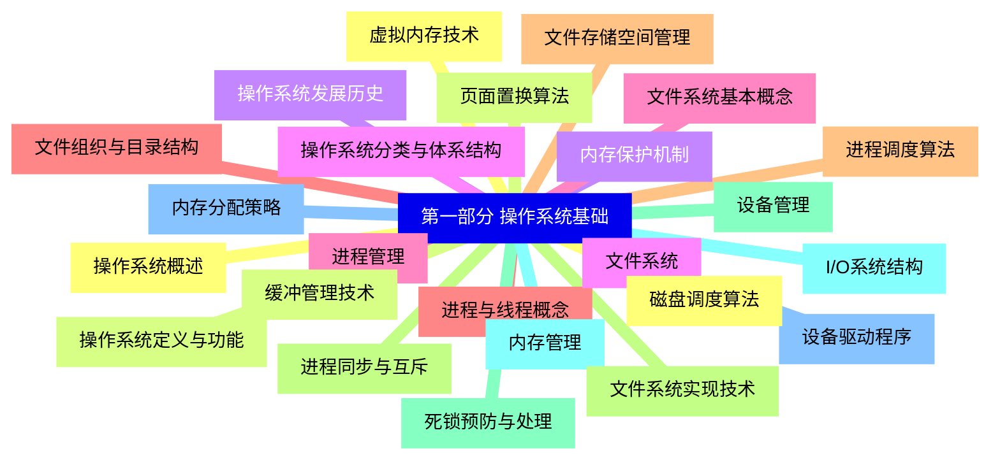
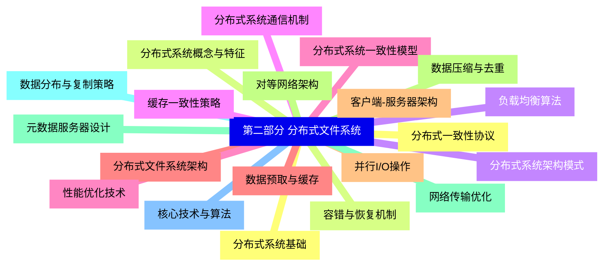
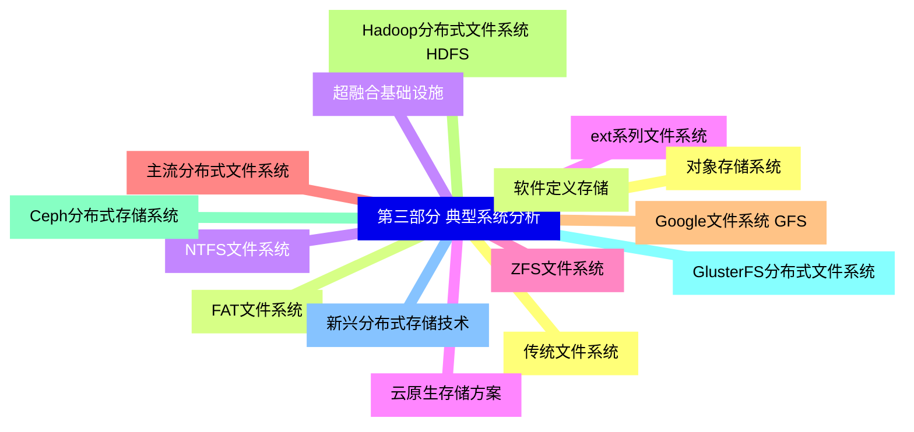
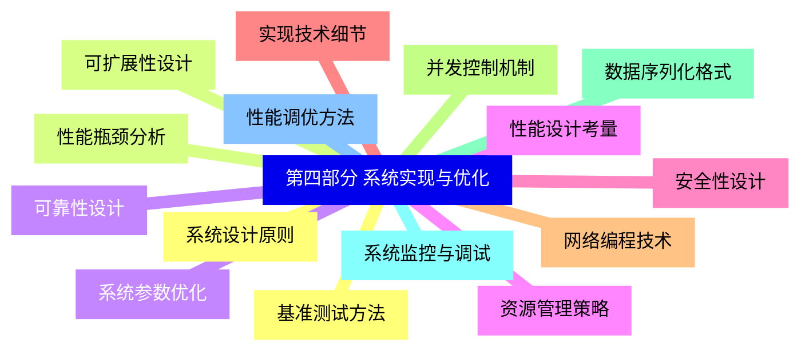
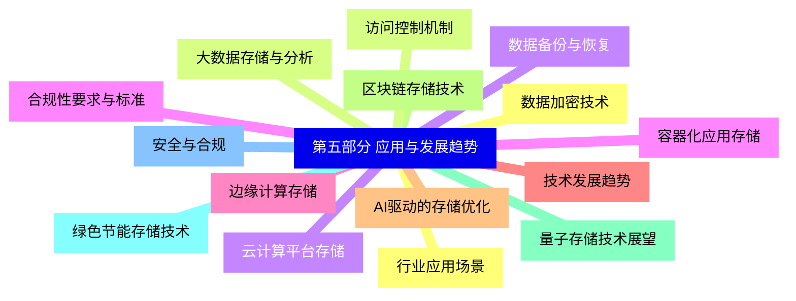


### 1 [第一部分 操作系统基础](#1)
#### 1.1 [操作系统概述](#1)
#### 1.2 [操作系统定义与功能](#1)
#### 1.3 [操作系统发展历史](#1)
#### 1.4 [操作系统分类与体系结构](#1)
#### 1.5 [进程管理](#1)
#### 1.6 [进程与线程概念](#1)
#### 1.7 [进程调度算法](#1)
#### 1.8 [进程同步与互斥](#1)
#### 1.9 [死锁预防与处理](#1)
#### 1.10 [内存管理](#1)
#### 1.11 [内存分配策略](#1)
#### 1.12 [虚拟内存技术](#1)
#### 1.13 [页面置换算法](#1)
#### 1.14 [内存保护机制](#1)
#### 1.15 [文件系统](#1)
#### 1.16 [文件系统基本概念](#1)
#### 1.17 [文件组织与目录结构](#1)
#### 1.18 [文件存储空间管理](#1)
#### 1.19 [文件系统实现技术](#1)
#### 1.20 [设备管理](#1)
#### 1.21 [I/O系统结构](#1)
#### 1.22 [设备驱动程序](#1)
#### 1.23 [磁盘调度算法](#1)
#### 1.24 [缓冲管理技术](#1)
### 2 [第二部分 分布式文件系统](#2)
#### 2.1 [分布式系统基础](#2)
#### 2.2 [分布式系统概念与特征](#2)
#### 2.3 [分布式系统架构模式](#2)
#### 2.4 [分布式系统通信机制](#2)
#### 2.5 [分布式系统一致性模型](#2)
#### 2.6 [分布式文件系统架构](#2)
#### 2.7 [客户端-服务器架构](#2)
#### 2.8 [对等网络架构](#2)
#### 2.9 [元数据服务器设计](#2)
#### 2.10 [数据分布与复制策略](#2)
#### 2.11 [核心技术与算法](#2)
#### 2.12 [分布式一致性协议](#2)
#### 2.13 [容错与恢复机制](#2)
#### 2.14 [负载均衡算法](#2)
#### 2.15 [缓存一致性策略](#2)
#### 2.16 [性能优化技术](#2)
#### 2.17 [数据预取与缓存](#2)
#### 2.18 [并行I/O操作](#2)
#### 2.19 [数据压缩与去重](#2)
#### 2.20 [网络传输优化](#2)
### 3 [第三部分 典型系统分析](#3)
#### 3.1 [传统文件系统](#3)
#### 3.2 [FAT文件系统](#3)
#### 3.3 [NTFS文件系统](#3)
#### 3.4 [ext系列文件系统](#3)
#### 3.5 [ZFS文件系统](#3)
#### 3.6 [主流分布式文件系统](#3)
#### 3.7 [Google文件系统 GFS](#3)
#### 3.8 [Hadoop分布式文件系统 HDFS](#3)
#### 3.9 [Ceph分布式存储系统](#3)
#### 3.10 [GlusterFS分布式文件系统](#3)
#### 3.11 [新兴分布式存储技术](#3)
#### 3.12 [对象存储系统](#3)
#### 3.13 [软件定义存储](#3)
#### 3.14 [超融合基础设施](#3)
#### 3.15 [云原生存储方案](#3)
### 4 [第四部分 系统实现与优化](#4)
#### 4.1 [系统设计原则](#4)
#### 4.2 [可扩展性设计](#4)
#### 4.3 [可靠性设计](#4)
#### 4.4 [性能设计考量](#4)
#### 4.5 [安全性设计](#4)
#### 4.6 [实现技术细节](#4)
#### 4.7 [网络编程技术](#4)
#### 4.8 [并发控制机制](#4)
#### 4.9 [数据序列化格式](#4)
#### 4.10 [系统监控与调试](#4)
#### 4.11 [性能调优方法](#4)
#### 4.12 [基准测试方法](#4)
#### 4.13 [性能瓶颈分析](#4)
#### 4.14 [系统参数优化](#4)
#### 4.15 [资源管理策略](#4)
### 5 [第五部分 应用与发展趋势](#5)
#### 5.1 [行业应用场景](#5)
#### 5.2 [大数据存储与分析](#5)
#### 5.3 [云计算平台存储](#5)
#### 5.4 [容器化应用存储](#5)
#### 5.5 [边缘计算存储](#5)
#### 5.6 [技术发展趋势](#5)
#### 5.7 [AI驱动的存储优化](#5)
#### 5.8 [区块链存储技术](#5)
#### 5.9 [量子存储技术展望](#5)
#### 5.10 [绿色节能存储技术](#5)
#### 5.11 [安全与合规](#5)
#### 5.12 [数据加密技术](#5)
#### 5.13 [访问控制机制](#5)
#### 5.14 [数据备份与恢复](#5)
#### 5.15 [合规性要求与标准](#5)




### 1 第一部分 操作系统基础

---
### 1 第一部分 操作系统基础
___
#### 1.1 操作系统概述
___
#### 1.2 操作系统定义与功能
___
#### 1.3 操作系统发展历史
___
#### 1.4 操作系统分类与体系结构
___
#### 1.5 进程管理
___
#### 1.6 进程与线程概念
___
#### 1.7 进程调度算法
___
#### 1.8 进程同步与互斥
___
#### 1.9 死锁预防与处理
___
#### 1.10 内存管理
___
#### 1.11 内存分配策略
___
#### 1.12 虚拟内存技术
___
#### 1.13 页面置换算法
___
#### 1.14 内存保护机制
___
#### 1.15 文件系统
___
#### 1.16 文件系统基本概念
___
#### 1.17 文件组织与目录结构
___
#### 1.18 文件存储空间管理
___
#### 1.19 文件系统实现技术
___
#### 1.20 设备管理
___
#### 1.21 I/O系统结构
___
#### 1.22 设备驱动程序
___
#### 1.23 磁盘调度算法
___
#### 1.24 缓冲管理技术
### 2 第二部分 分布式文件系统

---
### 2 第二部分 分布式文件系统
___
#### 2.1 分布式系统基础
___
#### 2.2 分布式系统概念与特征
___
#### 2.3 分布式系统架构模式
___
#### 2.4 分布式系统通信机制
___
#### 2.5 分布式系统一致性模型
___
#### 2.6 分布式文件系统架构
___
#### 2.7 客户端-服务器架构
___
#### 2.8 对等网络架构
___
#### 2.9 元数据服务器设计
___
#### 2.10 数据分布与复制策略
___
#### 2.11 核心技术与算法
___
#### 2.12 分布式一致性协议
___
#### 2.13 容错与恢复机制
___
#### 2.14 负载均衡算法
___
#### 2.15 缓存一致性策略
___
#### 2.16 性能优化技术
___
#### 2.17 数据预取与缓存
___
#### 2.18 并行I/O操作
___
#### 2.19 数据压缩与去重
___
#### 2.20 网络传输优化
### 3 第三部分 典型系统分析

---
### 3 第三部分 典型系统分析
___
#### 3.1 传统文件系统
___
#### 3.2 FAT文件系统
___
#### 3.3 NTFS文件系统
___
#### 3.4 ext系列文件系统
___
#### 3.5 ZFS文件系统
___
#### 3.6 主流分布式文件系统
___
#### 3.7 Google文件系统 GFS
___
#### 3.8 Hadoop分布式文件系统 HDFS
___
#### 3.9 Ceph分布式存储系统
___
#### 3.10 GlusterFS分布式文件系统
___
#### 3.11 新兴分布式存储技术
___
#### 3.12 对象存储系统
___
#### 3.13 软件定义存储
___
#### 3.14 超融合基础设施
___
#### 3.15 云原生存储方案
### 4 第四部分 系统实现与优化

---
### 4 第四部分 系统实现与优化
___
#### 4.1 系统设计原则
___
#### 4.2 可扩展性设计
___
#### 4.3 可靠性设计
___
#### 4.4 性能设计考量
___
#### 4.5 安全性设计
___
#### 4.6 实现技术细节
___
#### 4.7 网络编程技术
___
#### 4.8 并发控制机制
___
#### 4.9 数据序列化格式
___
#### 4.10 系统监控与调试
___
#### 4.11 性能调优方法
___
#### 4.12 基准测试方法
___
#### 4.13 性能瓶颈分析
___
#### 4.14 系统参数优化
___
#### 4.15 资源管理策略
### 5 第五部分 应用与发展趋势

---
### 5 第五部分 应用与发展趋势
___
#### 5.1 行业应用场景
___
#### 5.2 大数据存储与分析
___
#### 5.3 云计算平台存储
___
#### 5.4 容器化应用存储
___
#### 5.5 边缘计算存储
___
#### 5.6 技术发展趋势
___
#### 5.7 AI驱动的存储优化
___
#### 5.8 区块链存储技术
___
#### 5.9 量子存储技术展望
___
#### 5.10 绿色节能存储技术
___
#### 5.11 安全与合规
___
#### 5.12 数据加密技术
___
#### 5.13 访问控制机制
___
#### 5.14 数据备份与恢复
___
#### 5.15 合规性要求与标准


### 1 第一部分 操作系统基础{#1}

{}

<--->
{}
{}
{}
{}
{}
{}
{}
{}
{}
{}
{}
{}
{}
{}
{}
{}
{}
{}
{}
{}
{}
{}
{}
{}
{}
{}
{}
{}
{}
{}
{}
{}
{}
{}
{}
{}
{}
{}
{}
{}
{}
{}
{}
{}
{}
{}
{}
{}
{}

### 2 第二部分 分布式文件系统{#2}

{}
{}
{}
{}
{}
{}
{}
{}
{}
{}
{}
{}
{}
{}
{}
{}
{}
{}
{}
{}
{}
{}
{}
{}
{}
{}
{}
{}
{}
{}
{}
{}
{}
{}
{}
{}
{}
{}
{}
{}
{}
<--->

{}

### 3 第三部分 典型系统分析{#3}

{}

<--->
{}
{}
{}
{}
{}
{}
{}
{}
{}
{}
{}
{}
{}
{}
{}
{}
{}
{}
{}
{}
{}
{}
{}
{}
{}
{}
{}
{}
{}
{}
{}

### 4 第四部分 系统实现与优化{#4}

{}
{}
{}
{}
{}
{}
{}
{}
{}
{}
{}
{}
{}
{}
{}
{}
{}
{}
{}
{}
{}
{}
{}
{}
{}
{}
{}
{}
{}
{}
{}
<--->

{}

### 5 第五部分 应用与发展趋势{#5}

{}

<--->
{}
{}
{}
{}
{}
{}
{}
{}
{}
{}
{}
{}
{}
{}
{}
{}
{}
{}
{}
{}
{}
{}
{}
{}
{}
{}
{}
{}
{}
{}
{}
