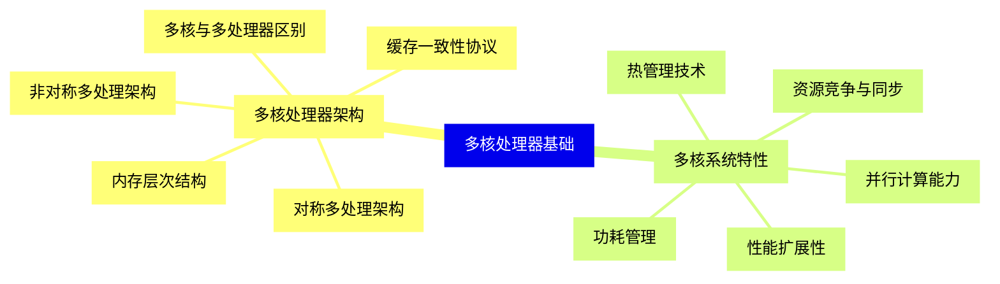
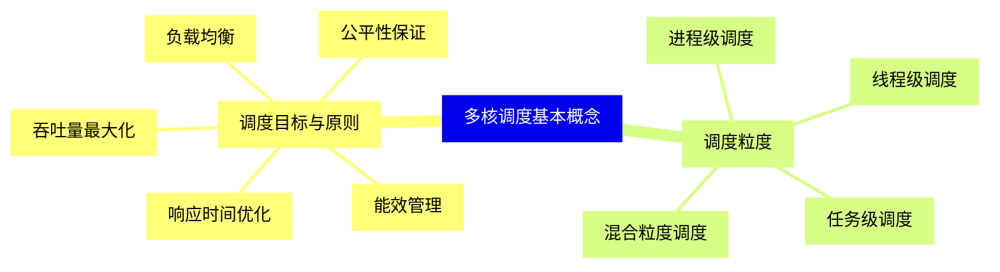
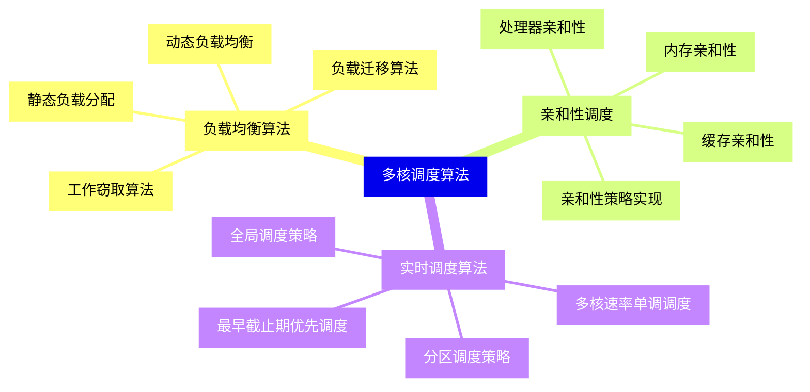
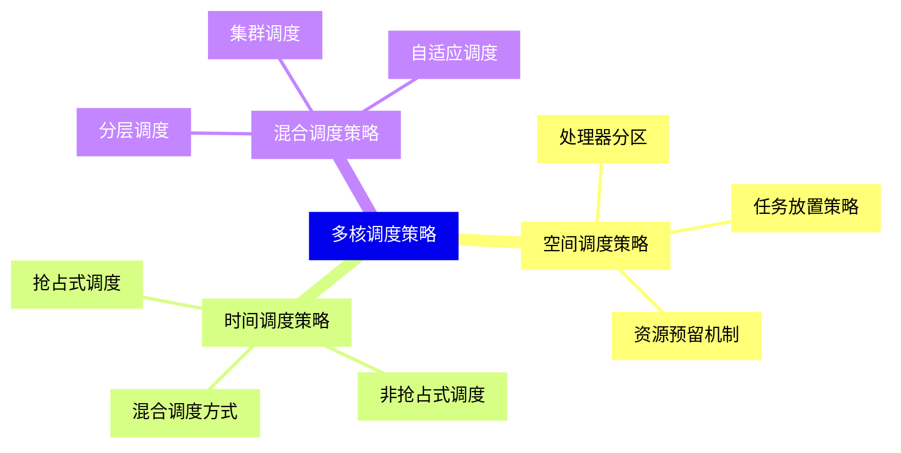
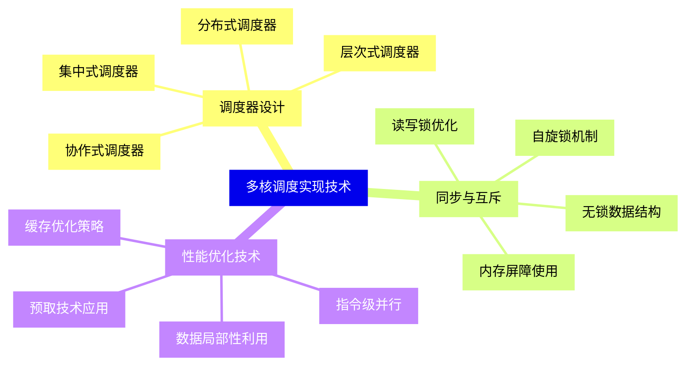
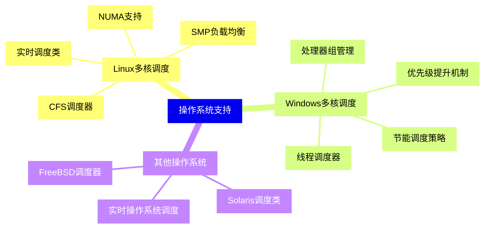
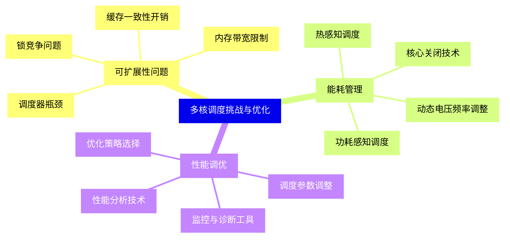
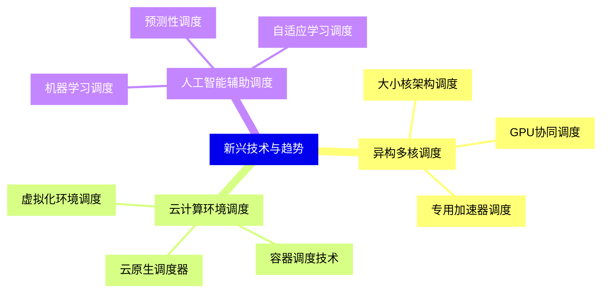


### 1 [多核处理器基础](#1)
#### 1.1 [多核处理器架构](#1)
##### 1.1.1 [对称多处理架构](#1)
##### 1.1.2 [非对称多处理架构](#1)
##### 1.1.3 [多核与多处理器区别](#1)
##### 1.1.4 [缓存一致性协议](#1)
##### 1.1.5 [内存层次结构](#1)
#### 1.2 [多核系统特性](#1)
##### 1.2.1 [并行计算能力](#1)
##### 1.2.2 [资源竞争与同步](#1)
##### 1.2.3 [功耗管理](#1)
##### 1.2.4 [热管理技术](#1)
##### 1.2.5 [性能扩展性](#1)
### 2 [多核调度基本概念](#2)
#### 2.1 [调度目标与原则](#2)
##### 2.1.1 [负载均衡](#2)
##### 2.1.2 [响应时间优化](#2)
##### 2.1.3 [吞吐量最大化](#2)
##### 2.1.4 [公平性保证](#2)
##### 2.1.5 [能效管理](#2)
#### 2.2 [调度粒度](#2)
##### 2.2.1 [进程级调度](#2)
##### 2.2.2 [线程级调度](#2)
##### 2.2.3 [任务级调度](#2)
##### 2.2.4 [混合粒度调度](#2)
### 3 [多核调度算法](#3)
#### 3.1 [负载均衡算法](#3)
##### 3.1.1 [工作窃取算法](#3)
##### 3.1.2 [负载迁移算法](#3)
##### 3.1.3 [动态负载均衡](#3)
##### 3.1.4 [静态负载分配](#3)
#### 3.2 [亲和性调度](#3)
##### 3.2.1 [处理器亲和性](#3)
##### 3.2.2 [缓存亲和性](#3)
##### 3.2.3 [内存亲和性](#3)
##### 3.2.4 [亲和性策略实现](#3)
#### 3.3 [实时调度算法](#3)
##### 3.3.1 [多核速率单调调度](#3)
##### 3.3.2 [最早截止期优先调度](#3)
##### 3.3.3 [分区调度策略](#3)
##### 3.3.4 [全局调度策略](#3)
### 4 [多核调度策略](#4)
#### 4.1 [空间调度策略](#4)
##### 4.1.1 [处理器分区](#4)
##### 4.1.2 [任务放置策略](#4)
##### 4.1.3 [资源预留机制](#4)
#### 4.2 [时间调度策略](#4)
##### 4.2.1 [抢占式调度](#4)
##### 4.2.2 [非抢占式调度](#4)
##### 4.2.3 [混合调度方式](#4)
#### 4.3 [混合调度策略](#4)
##### 4.3.1 [分层调度](#4)
##### 4.3.2 [集群调度](#4)
##### 4.3.3 [自适应调度](#4)
### 5 [多核调度实现技术](#5)
#### 5.1 [调度器设计](#5)
##### 5.1.1 [集中式调度器](#5)
##### 5.1.2 [分布式调度器](#5)
##### 5.1.3 [层次式调度器](#5)
##### 5.1.4 [协作式调度器](#5)
#### 5.2 [同步与互斥](#5)
##### 5.2.1 [自旋锁机制](#5)
##### 5.2.2 [读写锁优化](#5)
##### 5.2.3 [无锁数据结构](#5)
##### 5.2.4 [内存屏障使用](#5)
#### 5.3 [性能优化技术](#5)
##### 5.3.1 [缓存优化策略](#5)
##### 5.3.2 [预取技术应用](#5)
##### 5.3.3 [数据局部性利用](#5)
##### 5.3.4 [指令级并行](#5)
### 6 [操作系统支持](#6)
#### 6.1 [Linux多核调度](#6)
##### 6.1.1 [CFS调度器](#6)
##### 6.1.2 [SMP负载均衡](#6)
##### 6.1.3 [NUMA支持](#6)
##### 6.1.4 [实时调度类](#6)
#### 6.2 [Windows多核调度](#6)
##### 6.2.1 [线程调度器](#6)
##### 6.2.2 [处理器组管理](#6)
##### 6.2.3 [优先级提升机制](#6)
##### 6.2.4 [节能调度策略](#6)
#### 6.3 [其他操作系统](#6)
##### 6.3.1 [FreeBSD调度器](#6)
##### 6.3.2 [Solaris调度类](#6)
##### 6.3.3 [实时操作系统调度](#6)
### 7 [多核调度挑战与优化](#7)
#### 7.1 [可扩展性问题](#7)
##### 7.1.1 [锁竞争问题](#7)
##### 7.1.2 [缓存一致性开销](#7)
##### 7.1.3 [内存带宽限制](#7)
##### 7.1.4 [调度器瓶颈](#7)
#### 7.2 [能耗管理](#7)
##### 7.2.1 [动态电压频率调整](#7)
##### 7.2.2 [核心关闭技术](#7)
##### 7.2.3 [功耗感知调度](#7)
##### 7.2.4 [热感知调度](#7)
#### 7.3 [性能调优](#7)
##### 7.3.1 [调度参数调整](#7)
##### 7.3.2 [监控与诊断工具](#7)
##### 7.3.3 [性能分析技术](#7)
##### 7.3.4 [优化策略选择](#7)
### 8 [新兴技术与趋势](#8)
#### 8.1 [异构多核调度](#8)
##### 8.1.1 [大小核架构调度](#8)
##### 8.1.2 [GPU协同调度](#8)
##### 8.1.3 [专用加速器调度](#8)
#### 8.2 [云计算环境调度](#8)
##### 8.2.1 [虚拟化环境调度](#8)
##### 8.2.2 [容器调度技术](#8)
##### 8.2.3 [云原生调度器](#8)
#### 8.3 [人工智能辅助调度](#8)
##### 8.3.1 [机器学习调度](#8)
##### 8.3.2 [预测性调度](#8)
##### 8.3.3 [自适应学习调度](#8)




### 1 多核处理器基础

---
### 1 多核处理器基础
___
#### 1.1 多核处理器架构
___
##### 1.1.1 对称多处理架构
___
##### 1.1.2 非对称多处理架构
___
##### 1.1.3 多核与多处理器区别
___
##### 1.1.4 缓存一致性协议
___
##### 1.1.5 内存层次结构
___
#### 1.2 多核系统特性
___
##### 1.2.1 并行计算能力
___
##### 1.2.2 资源竞争与同步
___
##### 1.2.3 功耗管理
___
##### 1.2.4 热管理技术
___
##### 1.2.5 性能扩展性
### 2 多核调度基本概念

---
### 2 多核调度基本概念
___
#### 2.1 调度目标与原则
___
##### 2.1.1 负载均衡
___
##### 2.1.2 响应时间优化
___
##### 2.1.3 吞吐量最大化
___
##### 2.1.4 公平性保证
___
##### 2.1.5 能效管理
___
#### 2.2 调度粒度
___
##### 2.2.1 进程级调度
___
##### 2.2.2 线程级调度
___
##### 2.2.3 任务级调度
___
##### 2.2.4 混合粒度调度
### 3 多核调度算法

---
### 3 多核调度算法
___
#### 3.1 负载均衡算法
___
##### 3.1.1 工作窃取算法
___
##### 3.1.2 负载迁移算法
___
##### 3.1.3 动态负载均衡
___
##### 3.1.4 静态负载分配
___
#### 3.2 亲和性调度
___
##### 3.2.1 处理器亲和性
___
##### 3.2.2 缓存亲和性
___
##### 3.2.3 内存亲和性
___
##### 3.2.4 亲和性策略实现
___
#### 3.3 实时调度算法
___
##### 3.3.1 多核速率单调调度
___
##### 3.3.2 最早截止期优先调度
___
##### 3.3.3 分区调度策略
___
##### 3.3.4 全局调度策略
### 4 多核调度策略

---
### 4 多核调度策略
___
#### 4.1 空间调度策略
___
##### 4.1.1 处理器分区
___
##### 4.1.2 任务放置策略
___
##### 4.1.3 资源预留机制
___
#### 4.2 时间调度策略
___
##### 4.2.1 抢占式调度
___
##### 4.2.2 非抢占式调度
___
##### 4.2.3 混合调度方式
___
#### 4.3 混合调度策略
___
##### 4.3.1 分层调度
___
##### 4.3.2 集群调度
___
##### 4.3.3 自适应调度
### 5 多核调度实现技术

---
### 5 多核调度实现技术
___
#### 5.1 调度器设计
___
##### 5.1.1 集中式调度器
___
##### 5.1.2 分布式调度器
___
##### 5.1.3 层次式调度器
___
##### 5.1.4 协作式调度器
___
#### 5.2 同步与互斥
___
##### 5.2.1 自旋锁机制
___
##### 5.2.2 读写锁优化
___
##### 5.2.3 无锁数据结构
___
##### 5.2.4 内存屏障使用
___
#### 5.3 性能优化技术
___
##### 5.3.1 缓存优化策略
___
##### 5.3.2 预取技术应用
___
##### 5.3.3 数据局部性利用
___
##### 5.3.4 指令级并行
### 6 操作系统支持

---
### 6 操作系统支持
___
#### 6.1 Linux多核调度
___
##### 6.1.1 CFS调度器
___
##### 6.1.2 SMP负载均衡
___
##### 6.1.3 NUMA支持
___
##### 6.1.4 实时调度类
___
#### 6.2 Windows多核调度
___
##### 6.2.1 线程调度器
___
##### 6.2.2 处理器组管理
___
##### 6.2.3 优先级提升机制
___
##### 6.2.4 节能调度策略
___
#### 6.3 其他操作系统
___
##### 6.3.1 FreeBSD调度器
___
##### 6.3.2 Solaris调度类
___
##### 6.3.3 实时操作系统调度
### 7 多核调度挑战与优化

---
### 7 多核调度挑战与优化
___
#### 7.1 可扩展性问题
___
##### 7.1.1 锁竞争问题
___
##### 7.1.2 缓存一致性开销
___
##### 7.1.3 内存带宽限制
___
##### 7.1.4 调度器瓶颈
___
#### 7.2 能耗管理
___
##### 7.2.1 动态电压频率调整
___
##### 7.2.2 核心关闭技术
___
##### 7.2.3 功耗感知调度
___
##### 7.2.4 热感知调度
___
#### 7.3 性能调优
___
##### 7.3.1 调度参数调整
___
##### 7.3.2 监控与诊断工具
___
##### 7.3.3 性能分析技术
___
##### 7.3.4 优化策略选择
### 8 新兴技术与趋势

---
### 8 新兴技术与趋势
___
#### 8.1 异构多核调度
___
##### 8.1.1 大小核架构调度
___
##### 8.1.2 GPU协同调度
___
##### 8.1.3 专用加速器调度
___
#### 8.2 云计算环境调度
___
##### 8.2.1 虚拟化环境调度
___
##### 8.2.2 容器调度技术
___
##### 8.2.3 云原生调度器
___
#### 8.3 人工智能辅助调度
___
##### 8.3.1 机器学习调度
___
##### 8.3.2 预测性调度
___
##### 8.3.3 自适应学习调度


### 1 多核处理器基础{#1}

{}

<--->
{}
{}
{}
{}
{}
{}
{}
{}
{}
{}
{}
{}
{}
{}
{}
{}
{}
{}
{}
{}
{}
{}
{}
{}
{}

### 2 多核调度基本概念{#2}

{}
{}
{}
{}
{}
{}
{}
{}
{}
{}
{}
{}
{}
{}
{}
{}
{}
{}
{}
{}
{}
{}
{}
<--->

{}

### 3 多核调度算法{#3}

{}

<--->
{}
{}
{}
{}
{}
{}
{}
{}
{}
{}
{}
{}
{}
{}
{}
{}
{}
{}
{}
{}
{}
{}
{}
{}
{}
{}
{}
{}
{}
{}
{}

### 4 多核调度策略{#4}

{}
{}
{}
{}
{}
{}
{}
{}
{}
{}
{}
{}
{}
{}
{}
{}
{}
{}
{}
{}
{}
{}
{}
{}
{}
<--->

{}

### 5 多核调度实现技术{#5}

{}

<--->
{}
{}
{}
{}
{}
{}
{}
{}
{}
{}
{}
{}
{}
{}
{}
{}
{}
{}
{}
{}
{}
{}
{}
{}
{}
{}
{}
{}
{}
{}
{}

### 6 操作系统支持{#6}

{}
{}
{}
{}
{}
{}
{}
{}
{}
{}
{}
{}
{}
{}
{}
{}
{}
{}
{}
{}
{}
{}
{}
{}
{}
{}
{}
{}
{}
<--->

{}

### 7 多核调度挑战与优化{#7}

{}

<--->
{}
{}
{}
{}
{}
{}
{}
{}
{}
{}
{}
{}
{}
{}
{}
{}
{}
{}
{}
{}
{}
{}
{}
{}
{}
{}
{}
{}
{}
{}
{}

### 8 新兴技术与趋势{#8}

{}
{}
{}
{}
{}
{}
{}
{}
{}
{}
{}
{}
{}
{}
{}
{}
{}
{}
{}
{}
{}
{}
{}
{}
{}
<--->

{}
