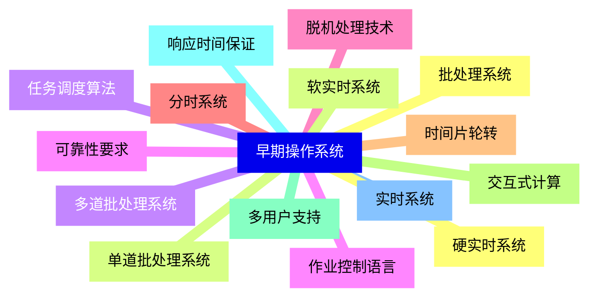
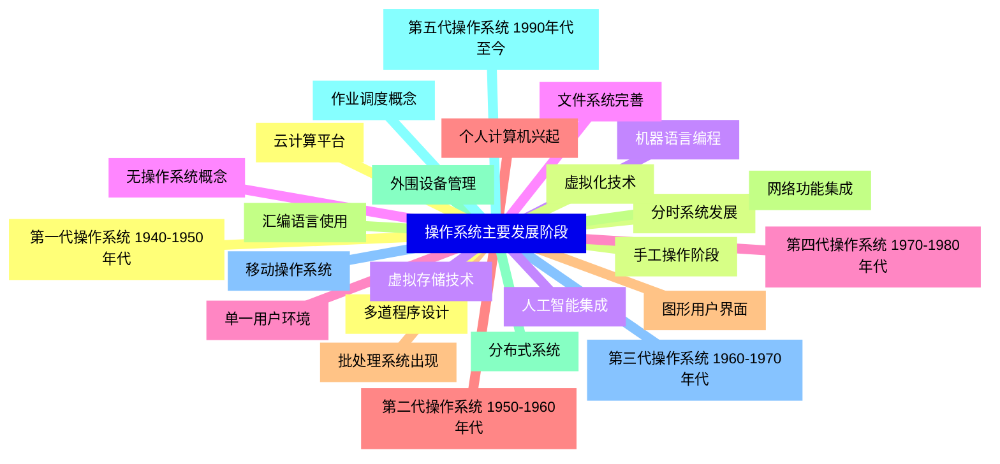
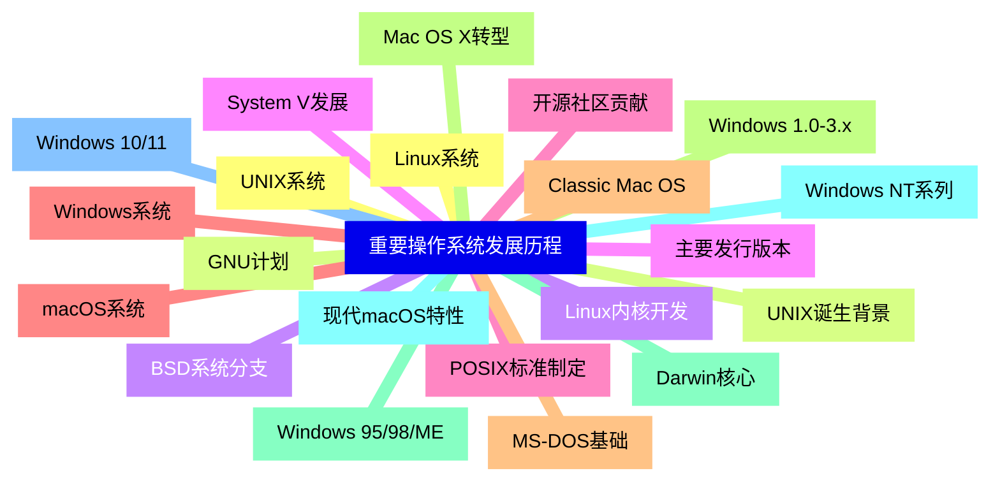
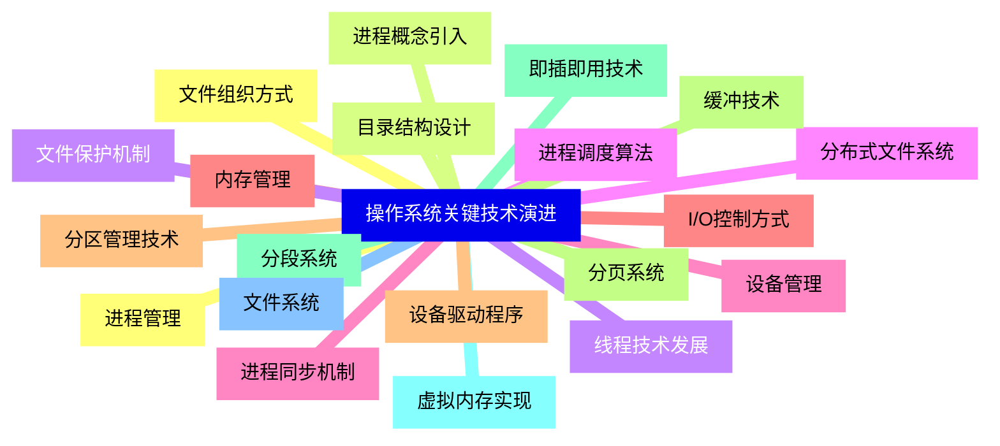
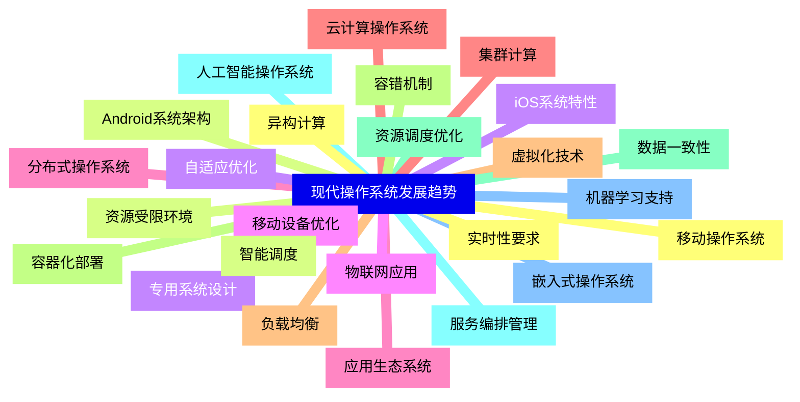
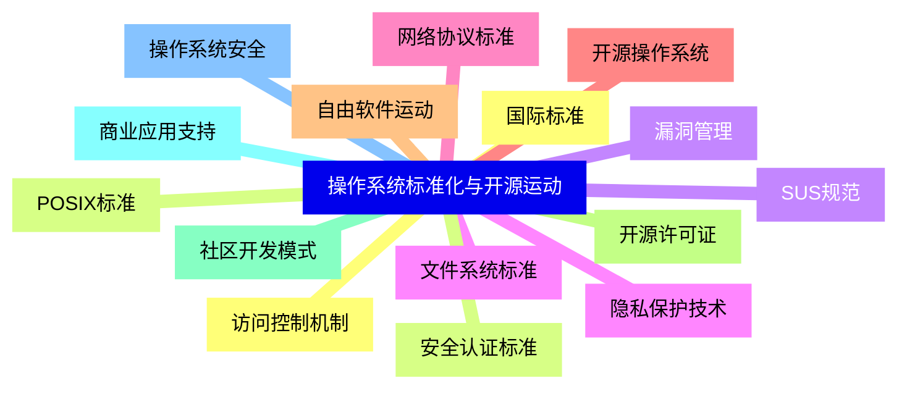
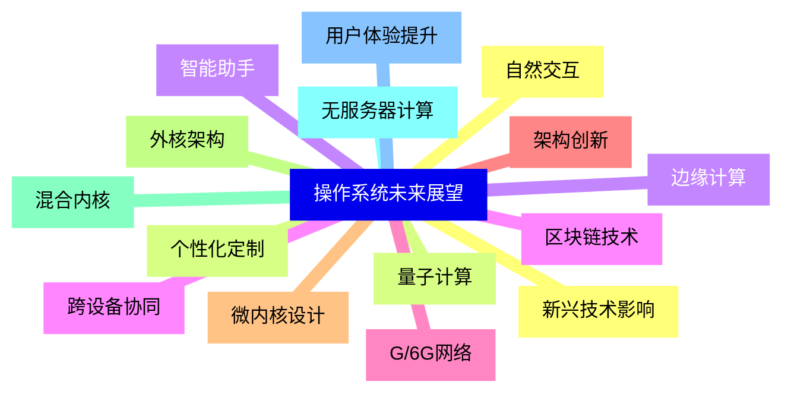


### 1 [早期操作系统](#1)
#### 1.1 [批处理系统](#1)
#### 1.2 [单道批处理系统](#1)
#### 1.3 [多道批处理系统](#1)
#### 1.4 [作业控制语言](#1)
#### 1.5 [脱机处理技术](#1)
#### 1.6 [分时系统](#1)
#### 1.7 [时间片轮转](#1)
#### 1.8 [交互式计算](#1)
#### 1.9 [多用户支持](#1)
#### 1.10 [响应时间保证](#1)
#### 1.11 [实时系统](#1)
#### 1.12 [硬实时系统](#1)
#### 1.13 [软实时系统](#1)
#### 1.14 [任务调度算法](#1)
#### 1.15 [可靠性要求](#1)
### 2 [操作系统主要发展阶段](#2)
#### 2.1 [第一代操作系统 1940-1950年代](#2)
#### 2.2 [手工操作阶段](#2)
#### 2.3 [机器语言编程](#2)
#### 2.4 [无操作系统概念](#2)
#### 2.5 [单一用户环境](#2)
#### 2.6 [第二代操作系统 1950-1960年代](#2)
#### 2.7 [批处理系统出现](#2)
#### 2.8 [汇编语言使用](#2)
#### 2.9 [外围设备管理](#2)
#### 2.10 [作业调度概念](#2)
#### 2.11 [第三代操作系统 1960-1970年代](#2)
#### 2.12 [多道程序设计](#2)
#### 2.13 [分时系统发展](#2)
#### 2.14 [虚拟存储技术](#2)
#### 2.15 [文件系统完善](#2)
#### 2.16 [第四代操作系统 1970-1980年代](#2)
#### 2.17 [个人计算机兴起](#2)
#### 2.18 [图形用户界面](#2)
#### 2.19 [网络功能集成](#2)
#### 2.20 [分布式系统](#2)
#### 2.21 [第五代操作系统 1990年代至今](#2)
#### 2.22 [移动操作系统](#2)
#### 2.23 [云计算平台](#2)
#### 2.24 [虚拟化技术](#2)
#### 2.25 [人工智能集成](#2)
### 3 [重要操作系统发展历程](#3)
#### 3.1 [UNIX系统](#3)
#### 3.2 [UNIX诞生背景](#3)
#### 3.3 [BSD系统分支](#3)
#### 3.4 [System V发展](#3)
#### 3.5 [POSIX标准制定](#3)
#### 3.6 [Windows系统](#3)
#### 3.7 [MS-DOS基础](#3)
#### 3.8 [Windows 1.0-3.x](#3)
#### 3.9 [Windows 95/98/ME](#3)
#### 3.10 [Windows NT系列](#3)
#### 3.11 [Windows 10/11](#3)
#### 3.12 [Linux系统](#3)
#### 3.13 [GNU计划](#3)
#### 3.14 [Linux内核开发](#3)
#### 3.15 [主要发行版本](#3)
#### 3.16 [开源社区贡献](#3)
#### 3.17 [macOS系统](#3)
#### 3.18 [Classic Mac OS](#3)
#### 3.19 [Mac OS X转型](#3)
#### 3.20 [Darwin核心](#3)
#### 3.21 [现代macOS特性](#3)
### 4 [操作系统关键技术演进](#4)
#### 4.1 [进程管理](#4)
#### 4.2 [进程概念引入](#4)
#### 4.3 [线程技术发展](#4)
#### 4.4 [进程调度算法](#4)
#### 4.5 [进程同步机制](#4)
#### 4.6 [内存管理](#4)
#### 4.7 [分区管理技术](#4)
#### 4.8 [分页系统](#4)
#### 4.9 [分段系统](#4)
#### 4.10 [虚拟内存实现](#4)
#### 4.11 [文件系统](#4)
#### 4.12 [文件组织方式](#4)
#### 4.13 [目录结构设计](#4)
#### 4.14 [文件保护机制](#4)
#### 4.15 [分布式文件系统](#4)
#### 4.16 [设备管理](#4)
#### 4.17 [I/O控制方式](#4)
#### 4.18 [设备驱动程序](#4)
#### 4.19 [缓冲技术](#4)
#### 4.20 [即插即用技术](#4)
### 5 [现代操作系统发展趋势](#5)
#### 5.1 [移动操作系统](#5)
#### 5.2 [Android系统架构](#5)
#### 5.3 [iOS系统特性](#5)
#### 5.4 [移动设备优化](#5)
#### 5.5 [应用生态系统](#5)
#### 5.6 [云计算操作系统](#5)
#### 5.7 [虚拟化技术](#5)
#### 5.8 [容器化部署](#5)
#### 5.9 [资源调度优化](#5)
#### 5.10 [服务编排管理](#5)
#### 5.11 [嵌入式操作系统](#5)
#### 5.12 [实时性要求](#5)
#### 5.13 [资源受限环境](#5)
#### 5.14 [专用系统设计](#5)
#### 5.15 [物联网应用](#5)
#### 5.16 [分布式操作系统](#5)
#### 5.17 [集群计算](#5)
#### 5.18 [负载均衡](#5)
#### 5.19 [容错机制](#5)
#### 5.20 [数据一致性](#5)
#### 5.21 [人工智能操作系统](#5)
#### 5.22 [机器学习支持](#5)
#### 5.23 [异构计算](#5)
#### 5.24 [智能调度](#5)
#### 5.25 [自适应优化](#5)
### 6 [操作系统标准化与开源运动](#6)
#### 6.1 [国际标准](#6)
#### 6.2 [POSIX标准](#6)
#### 6.3 [SUS规范](#6)
#### 6.4 [文件系统标准](#6)
#### 6.5 [网络协议标准](#6)
#### 6.6 [开源操作系统](#6)
#### 6.7 [自由软件运动](#6)
#### 6.8 [开源许可证](#6)
#### 6.9 [社区开发模式](#6)
#### 6.10 [商业应用支持](#6)
#### 6.11 [操作系统安全](#6)
#### 6.12 [访问控制机制](#6)
#### 6.13 [安全认证标准](#6)
#### 6.14 [漏洞管理](#6)
#### 6.15 [隐私保护技术](#6)
### 7 [操作系统未来展望](#7)
#### 7.1 [新兴技术影响](#7)
#### 7.2 [量子计算](#7)
#### 7.3 [边缘计算](#7)
#### 7.4 [区块链技术](#7)
#### 7.5 [G/6G网络](#7)
#### 7.6 [架构创新](#7)
#### 7.7 [微内核设计](#7)
#### 7.8 [外核架构](#7)
#### 7.9 [混合内核](#7)
#### 7.10 [无服务器计算](#7)
#### 7.11 [用户体验提升](#7)
#### 7.12 [自然交互](#7)
#### 7.13 [个性化定制](#7)
#### 7.14 [智能助手](#7)
#### 7.15 [跨设备协同](#7)




### 1 早期操作系统

---
### 1 早期操作系统
___
#### 1.1 批处理系统
___
#### 1.2 单道批处理系统
___
#### 1.3 多道批处理系统
___
#### 1.4 作业控制语言
___
#### 1.5 脱机处理技术
___
#### 1.6 分时系统
___
#### 1.7 时间片轮转
___
#### 1.8 交互式计算
___
#### 1.9 多用户支持
___
#### 1.10 响应时间保证
___
#### 1.11 实时系统
___
#### 1.12 硬实时系统
___
#### 1.13 软实时系统
___
#### 1.14 任务调度算法
___
#### 1.15 可靠性要求
### 2 操作系统主要发展阶段

---
### 2 操作系统主要发展阶段
___
#### 2.1 第一代操作系统 1940-1950年代
___
#### 2.2 手工操作阶段
___
#### 2.3 机器语言编程
___
#### 2.4 无操作系统概念
___
#### 2.5 单一用户环境
___
#### 2.6 第二代操作系统 1950-1960年代
___
#### 2.7 批处理系统出现
___
#### 2.8 汇编语言使用
___
#### 2.9 外围设备管理
___
#### 2.10 作业调度概念
___
#### 2.11 第三代操作系统 1960-1970年代
___
#### 2.12 多道程序设计
___
#### 2.13 分时系统发展
___
#### 2.14 虚拟存储技术
___
#### 2.15 文件系统完善
___
#### 2.16 第四代操作系统 1970-1980年代
___
#### 2.17 个人计算机兴起
___
#### 2.18 图形用户界面
___
#### 2.19 网络功能集成
___
#### 2.20 分布式系统
___
#### 2.21 第五代操作系统 1990年代至今
___
#### 2.22 移动操作系统
___
#### 2.23 云计算平台
___
#### 2.24 虚拟化技术
___
#### 2.25 人工智能集成
### 3 重要操作系统发展历程

---
### 3 重要操作系统发展历程
___
#### 3.1 UNIX系统
___
#### 3.2 UNIX诞生背景
___
#### 3.3 BSD系统分支
___
#### 3.4 System V发展
___
#### 3.5 POSIX标准制定
___
#### 3.6 Windows系统
___
#### 3.7 MS-DOS基础
___
#### 3.8 Windows 1.0-3.x
___
#### 3.9 Windows 95/98/ME
___
#### 3.10 Windows NT系列
___
#### 3.11 Windows 10/11
___
#### 3.12 Linux系统
___
#### 3.13 GNU计划
___
#### 3.14 Linux内核开发
___
#### 3.15 主要发行版本
___
#### 3.16 开源社区贡献
___
#### 3.17 macOS系统
___
#### 3.18 Classic Mac OS
___
#### 3.19 Mac OS X转型
___
#### 3.20 Darwin核心
___
#### 3.21 现代macOS特性
### 4 操作系统关键技术演进

---
### 4 操作系统关键技术演进
___
#### 4.1 进程管理
___
#### 4.2 进程概念引入
___
#### 4.3 线程技术发展
___
#### 4.4 进程调度算法
___
#### 4.5 进程同步机制
___
#### 4.6 内存管理
___
#### 4.7 分区管理技术
___
#### 4.8 分页系统
___
#### 4.9 分段系统
___
#### 4.10 虚拟内存实现
___
#### 4.11 文件系统
___
#### 4.12 文件组织方式
___
#### 4.13 目录结构设计
___
#### 4.14 文件保护机制
___
#### 4.15 分布式文件系统
___
#### 4.16 设备管理
___
#### 4.17 I/O控制方式
___
#### 4.18 设备驱动程序
___
#### 4.19 缓冲技术
___
#### 4.20 即插即用技术
### 5 现代操作系统发展趋势

---
### 5 现代操作系统发展趋势
___
#### 5.1 移动操作系统
___
#### 5.2 Android系统架构
___
#### 5.3 iOS系统特性
___
#### 5.4 移动设备优化
___
#### 5.5 应用生态系统
___
#### 5.6 云计算操作系统
___
#### 5.7 虚拟化技术
___
#### 5.8 容器化部署
___
#### 5.9 资源调度优化
___
#### 5.10 服务编排管理
___
#### 5.11 嵌入式操作系统
___
#### 5.12 实时性要求
___
#### 5.13 资源受限环境
___
#### 5.14 专用系统设计
___
#### 5.15 物联网应用
___
#### 5.16 分布式操作系统
___
#### 5.17 集群计算
___
#### 5.18 负载均衡
___
#### 5.19 容错机制
___
#### 5.20 数据一致性
___
#### 5.21 人工智能操作系统
___
#### 5.22 机器学习支持
___
#### 5.23 异构计算
___
#### 5.24 智能调度
___
#### 5.25 自适应优化
### 6 操作系统标准化与开源运动

---
### 6 操作系统标准化与开源运动
___
#### 6.1 国际标准
___
#### 6.2 POSIX标准
___
#### 6.3 SUS规范
___
#### 6.4 文件系统标准
___
#### 6.5 网络协议标准
___
#### 6.6 开源操作系统
___
#### 6.7 自由软件运动
___
#### 6.8 开源许可证
___
#### 6.9 社区开发模式
___
#### 6.10 商业应用支持
___
#### 6.11 操作系统安全
___
#### 6.12 访问控制机制
___
#### 6.13 安全认证标准
___
#### 6.14 漏洞管理
___
#### 6.15 隐私保护技术
### 7 操作系统未来展望

---
### 7 操作系统未来展望
___
#### 7.1 新兴技术影响
___
#### 7.2 量子计算
___
#### 7.3 边缘计算
___
#### 7.4 区块链技术
___
#### 7.5 G/6G网络
___
#### 7.6 架构创新
___
#### 7.7 微内核设计
___
#### 7.8 外核架构
___
#### 7.9 混合内核
___
#### 7.10 无服务器计算
___
#### 7.11 用户体验提升
___
#### 7.12 自然交互
___
#### 7.13 个性化定制
___
#### 7.14 智能助手
___
#### 7.15 跨设备协同


### 1 早期操作系统{#1}

{}

<--->
{}
{}
{}
{}
{}
{}
{}
{}
{}
{}
{}
{}
{}
{}
{}
{}
{}
{}
{}
{}
{}
{}
{}
{}
{}
{}
{}
{}
{}
{}
{}

### 2 操作系统主要发展阶段{#2}

{}
{}
{}
{}
{}
{}
{}
{}
{}
{}
{}
{}
{}
{}
{}
{}
{}
{}
{}
{}
{}
{}
{}
{}
{}
{}
{}
{}
{}
{}
{}
{}
{}
{}
{}
{}
{}
{}
{}
{}
{}
{}
{}
{}
{}
{}
{}
{}
{}
{}
{}
<--->

{}

### 3 重要操作系统发展历程{#3}

{}

<--->
{}
{}
{}
{}
{}
{}
{}
{}
{}
{}
{}
{}
{}
{}
{}
{}
{}
{}
{}
{}
{}
{}
{}
{}
{}
{}
{}
{}
{}
{}
{}
{}
{}
{}
{}
{}
{}
{}
{}
{}
{}
{}
{}

### 4 操作系统关键技术演进{#4}

{}
{}
{}
{}
{}
{}
{}
{}
{}
{}
{}
{}
{}
{}
{}
{}
{}
{}
{}
{}
{}
{}
{}
{}
{}
{}
{}
{}
{}
{}
{}
{}
{}
{}
{}
{}
{}
{}
{}
{}
{}
<--->

{}

### 5 现代操作系统发展趋势{#5}

{}

<--->
{}
{}
{}
{}
{}
{}
{}
{}
{}
{}
{}
{}
{}
{}
{}
{}
{}
{}
{}
{}
{}
{}
{}
{}
{}
{}
{}
{}
{}
{}
{}
{}
{}
{}
{}
{}
{}
{}
{}
{}
{}
{}
{}
{}
{}
{}
{}
{}
{}
{}
{}

### 6 操作系统标准化与开源运动{#6}

{}
{}
{}
{}
{}
{}
{}
{}
{}
{}
{}
{}
{}
{}
{}
{}
{}
{}
{}
{}
{}
{}
{}
{}
{}
{}
{}
{}
{}
{}
{}
<--->

{}

### 7 操作系统未来展望{#7}

{}

<--->
{}
{}
{}
{}
{}
{}
{}
{}
{}
{}
{}
{}
{}
{}
{}
{}
{}
{}
{}
{}
{}
{}
{}
{}
{}
{}
{}
{}
{}
{}
{}
