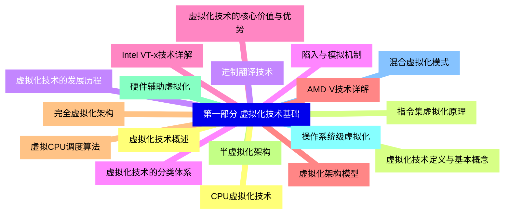
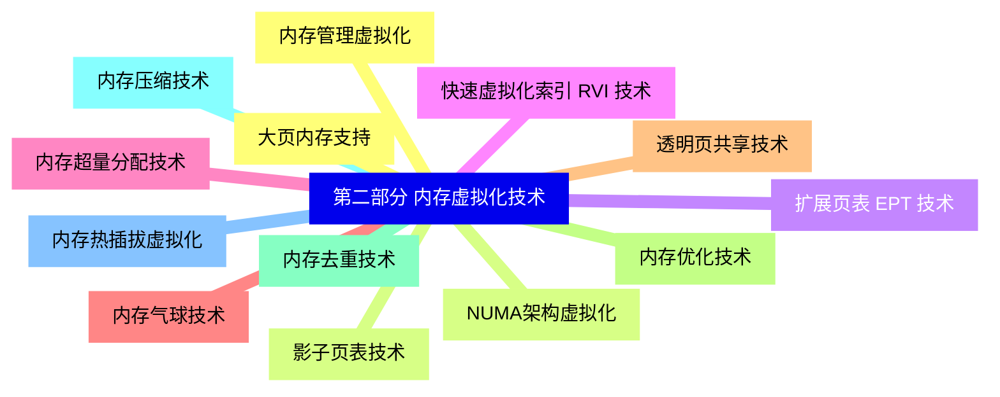
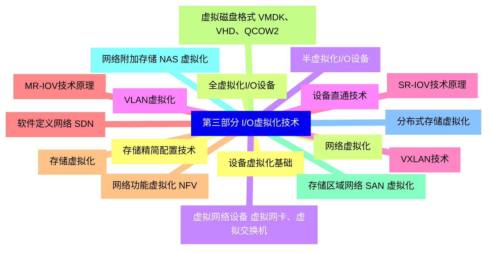
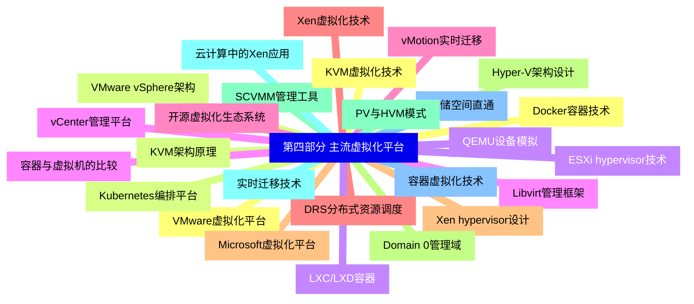
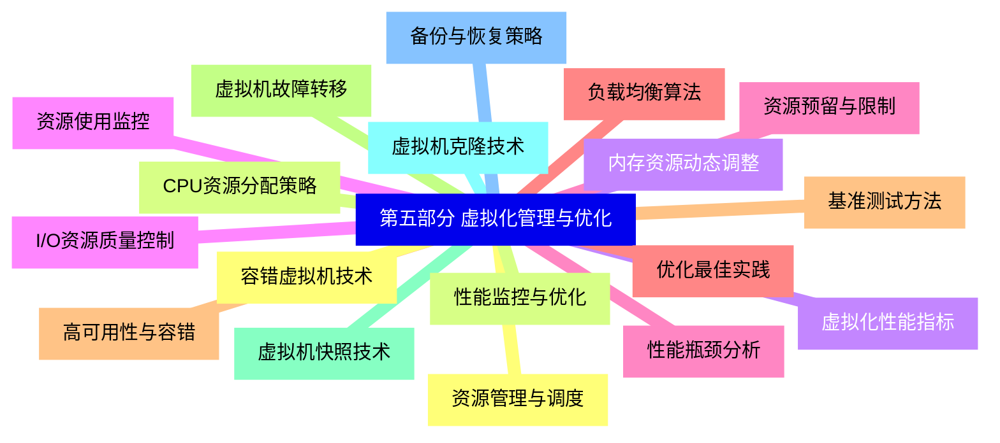
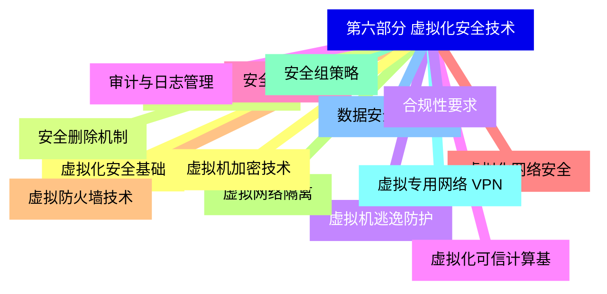
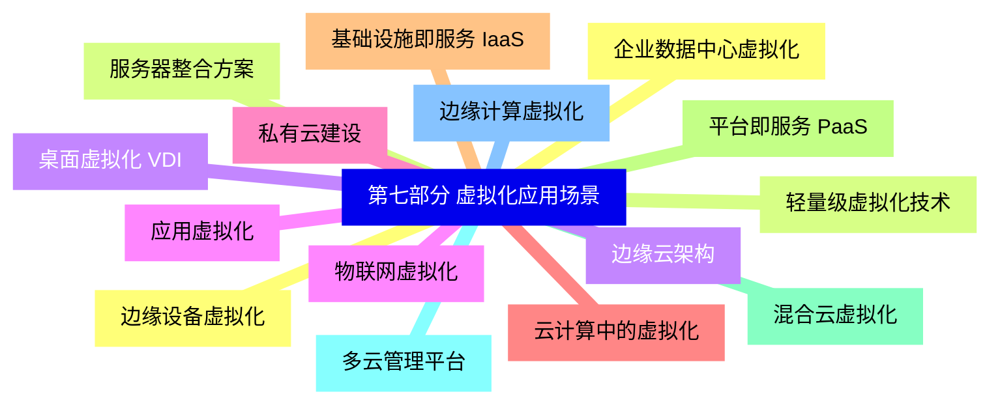
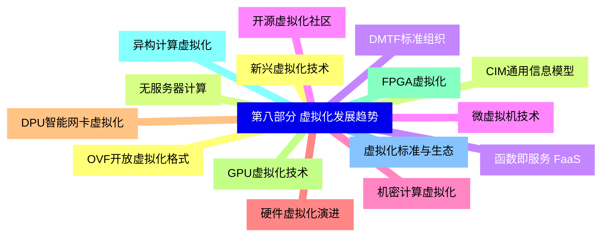


### 1 [第一部分 虚拟化技术基础](#1)
#### 1.1 [虚拟化技术概述](#1)
#### 1.2 [虚拟化技术定义与基本概念](#1)
#### 1.3 [虚拟化技术的发展历程](#1)
#### 1.4 [虚拟化技术的分类体系](#1)
#### 1.5 [虚拟化技术的核心价值与优势](#1)
#### 1.6 [虚拟化架构模型](#1)
#### 1.7 [完全虚拟化架构](#1)
#### 1.8 [半虚拟化架构](#1)
#### 1.9 [硬件辅助虚拟化](#1)
#### 1.10 [操作系统级虚拟化](#1)
#### 1.11 [混合虚拟化模式](#1)
#### 1.12 [CPU虚拟化技术](#1)
#### 1.13 [指令集虚拟化原理](#1)
#### 1.14 [进制翻译技术](#1)
#### 1.15 [陷入与模拟机制](#1)
#### 1.16 [Intel VT-x技术详解](#1)
#### 1.17 [AMD-V技术详解](#1)
#### 1.18 [虚拟CPU调度算法](#1)
### 2 [第二部分 内存虚拟化技术](#2)
#### 2.1 [内存管理虚拟化](#2)
#### 2.2 [影子页表技术](#2)
#### 2.3 [扩展页表 EPT 技术](#2)
#### 2.4 [快速虚拟化索引 RVI 技术](#2)
#### 2.5 [内存超量分配技术](#2)
#### 2.6 [内存气球技术](#2)
#### 2.7 [透明页共享技术](#2)
#### 2.8 [内存优化技术](#2)
#### 2.9 [内存去重技术](#2)
#### 2.10 [内存压缩技术](#2)
#### 2.11 [内存热插拔虚拟化](#2)
#### 2.12 [大页内存支持](#2)
#### 2.13 [NUMA架构虚拟化](#2)
### 3 [第三部分 I/O虚拟化技术](#3)
#### 3.1 [设备虚拟化基础](#3)
#### 3.2 [全虚拟化I/O设备](#3)
#### 3.3 [半虚拟化I/O设备](#3)
#### 3.4 [设备直通技术](#3)
#### 3.5 [SR-IOV技术原理](#3)
#### 3.6 [MR-IOV技术原理](#3)
#### 3.7 [存储虚拟化](#3)
#### 3.8 [虚拟磁盘格式 VMDK、VHD、QCOW2](#3)
#### 3.9 [存储区域网络 SAN 虚拟化](#3)
#### 3.10 [网络附加存储 NAS 虚拟化](#3)
#### 3.11 [分布式存储虚拟化](#3)
#### 3.12 [存储精简配置技术](#3)
#### 3.13 [网络虚拟化](#3)
#### 3.14 [虚拟网络设备 虚拟网卡、虚拟交换机](#3)
#### 3.15 [VLAN虚拟化](#3)
#### 3.16 [VXLAN技术](#3)
#### 3.17 [软件定义网络 SDN](#3)
#### 3.18 [网络功能虚拟化 NFV](#3)
### 4 [第四部分 主流虚拟化平台](#4)
#### 4.1 [VMware虚拟化平台](#4)
#### 4.2 [VMware vSphere架构](#4)
#### 4.3 [ESXi hypervisor技术](#4)
#### 4.4 [vCenter管理平台](#4)
#### 4.5 [vMotion实时迁移](#4)
#### 4.6 [DRS分布式资源调度](#4)
#### 4.7 [Microsoft虚拟化平台](#4)
#### 4.8 [Hyper-V架构设计](#4)
#### 4.9 [SCVMM管理工具](#4)
#### 4.10 [实时迁移技术](#4)
#### 4.11 [存储空间直通](#4)
#### 4.12 [KVM虚拟化技术](#4)
#### 4.13 [KVM架构原理](#4)
#### 4.14 [QEMU设备模拟](#4)
#### 4.15 [Libvirt管理框架](#4)
#### 4.16 [开源虚拟化生态系统](#4)
#### 4.17 [Xen虚拟化技术](#4)
#### 4.18 [Xen hypervisor设计](#4)
#### 4.19 [Domain 0管理域](#4)
#### 4.20 [PV与HVM模式](#4)
#### 4.21 [云计算中的Xen应用](#4)
#### 4.22 [容器虚拟化技术](#4)
#### 4.23 [Docker容器技术](#4)
#### 4.24 [Kubernetes编排平台](#4)
#### 4.25 [LXC/LXD容器](#4)
#### 4.26 [容器与虚拟机的比较](#4)
### 5 [第五部分 虚拟化管理与优化](#5)
#### 5.1 [资源管理与调度](#5)
#### 5.2 [CPU资源分配策略](#5)
#### 5.3 [内存资源动态调整](#5)
#### 5.4 [I/O资源质量控制](#5)
#### 5.5 [资源预留与限制](#5)
#### 5.6 [负载均衡算法](#5)
#### 5.7 [高可用性与容错](#5)
#### 5.8 [虚拟机故障转移](#5)
#### 5.9 [虚拟机快照技术](#5)
#### 5.10 [虚拟机克隆技术](#5)
#### 5.11 [备份与恢复策略](#5)
#### 5.12 [容错虚拟机技术](#5)
#### 5.13 [性能监控与优化](#5)
#### 5.14 [虚拟化性能指标](#5)
#### 5.15 [资源使用监控](#5)
#### 5.16 [性能瓶颈分析](#5)
#### 5.17 [优化最佳实践](#5)
#### 5.18 [基准测试方法](#5)
### 6 [第六部分 虚拟化安全技术](#6)
#### 6.1 [虚拟化安全基础](#6)
#### 6.2 [虚拟化层安全威胁](#6)
#### 6.3 [虚拟机逃逸防护](#6)
#### 6.4 [虚拟化可信计算基](#6)
#### 6.5 [安全启动机制](#6)
#### 6.6 [虚拟化网络安全](#6)
#### 6.7 [虚拟防火墙技术](#6)
#### 6.8 [虚拟网络隔离](#6)
#### 6.9 [安全组策略](#6)
#### 6.10 [虚拟专用网络 VPN](#6)
#### 6.11 [数据安全与合规](#6)
#### 6.12 [虚拟机加密技术](#6)
#### 6.13 [安全删除机制](#6)
#### 6.14 [合规性要求](#6)
#### 6.15 [审计与日志管理](#6)
### 7 [第七部分 虚拟化应用场景](#7)
#### 7.1 [企业数据中心虚拟化](#7)
#### 7.2 [服务器整合方案](#7)
#### 7.3 [桌面虚拟化 VDI](#7)
#### 7.4 [应用虚拟化](#7)
#### 7.5 [私有云建设](#7)
#### 7.6 [云计算中的虚拟化](#7)
#### 7.7 [基础设施即服务 IaaS](#7)
#### 7.8 [平台即服务 PaaS](#7)
#### 7.9 [混合云虚拟化](#7)
#### 7.10 [多云管理平台](#7)
#### 7.11 [边缘计算虚拟化](#7)
#### 7.12 [边缘设备虚拟化](#7)
#### 7.13 [轻量级虚拟化技术](#7)
#### 7.14 [边缘云架构](#7)
#### 7.15 [物联网虚拟化](#7)
### 8 [第八部分 虚拟化发展趋势](#8)
#### 8.1 [新兴虚拟化技术](#8)
#### 8.2 [无服务器计算](#8)
#### 8.3 [函数即服务 FaaS](#8)
#### 8.4 [微虚拟机技术](#8)
#### 8.5 [机密计算虚拟化](#8)
#### 8.6 [硬件虚拟化演进](#8)
#### 8.7 [DPU智能网卡虚拟化](#8)
#### 8.8 [GPU虚拟化技术](#8)
#### 8.9 [FPGA虚拟化](#8)
#### 8.10 [异构计算虚拟化](#8)
#### 8.11 [虚拟化标准与生态](#8)
#### 8.12 [OVF开放虚拟化格式](#8)
#### 8.13 [CIM通用信息模型](#8)
#### 8.14 [DMTF标准组织](#8)
#### 8.15 [开源虚拟化社区](#8)




### 1 第一部分 虚拟化技术基础

---
### 1 第一部分 虚拟化技术基础
___
#### 1.1 虚拟化技术概述
___
#### 1.2 虚拟化技术定义与基本概念
___
#### 1.3 虚拟化技术的发展历程
___
#### 1.4 虚拟化技术的分类体系
___
#### 1.5 虚拟化技术的核心价值与优势
___
#### 1.6 虚拟化架构模型
___
#### 1.7 完全虚拟化架构
___
#### 1.8 半虚拟化架构
___
#### 1.9 硬件辅助虚拟化
___
#### 1.10 操作系统级虚拟化
___
#### 1.11 混合虚拟化模式
___
#### 1.12 CPU虚拟化技术
___
#### 1.13 指令集虚拟化原理
___
#### 1.14 进制翻译技术
___
#### 1.15 陷入与模拟机制
___
#### 1.16 Intel VT-x技术详解
___
#### 1.17 AMD-V技术详解
___
#### 1.18 虚拟CPU调度算法
### 2 第二部分 内存虚拟化技术

---
### 2 第二部分 内存虚拟化技术
___
#### 2.1 内存管理虚拟化
___
#### 2.2 影子页表技术
___
#### 2.3 扩展页表 EPT 技术
___
#### 2.4 快速虚拟化索引 RVI 技术
___
#### 2.5 内存超量分配技术
___
#### 2.6 内存气球技术
___
#### 2.7 透明页共享技术
___
#### 2.8 内存优化技术
___
#### 2.9 内存去重技术
___
#### 2.10 内存压缩技术
___
#### 2.11 内存热插拔虚拟化
___
#### 2.12 大页内存支持
___
#### 2.13 NUMA架构虚拟化
### 3 第三部分 I/O虚拟化技术

---
### 3 第三部分 I/O虚拟化技术
___
#### 3.1 设备虚拟化基础
___
#### 3.2 全虚拟化I/O设备
___
#### 3.3 半虚拟化I/O设备
___
#### 3.4 设备直通技术
___
#### 3.5 SR-IOV技术原理
___
#### 3.6 MR-IOV技术原理
___
#### 3.7 存储虚拟化
___
#### 3.8 虚拟磁盘格式 VMDK、VHD、QCOW2
___
#### 3.9 存储区域网络 SAN 虚拟化
___
#### 3.10 网络附加存储 NAS 虚拟化
___
#### 3.11 分布式存储虚拟化
___
#### 3.12 存储精简配置技术
___
#### 3.13 网络虚拟化
___
#### 3.14 虚拟网络设备 虚拟网卡、虚拟交换机
___
#### 3.15 VLAN虚拟化
___
#### 3.16 VXLAN技术
___
#### 3.17 软件定义网络 SDN
___
#### 3.18 网络功能虚拟化 NFV
### 4 第四部分 主流虚拟化平台

---
### 4 第四部分 主流虚拟化平台
___
#### 4.1 VMware虚拟化平台
___
#### 4.2 VMware vSphere架构
___
#### 4.3 ESXi hypervisor技术
___
#### 4.4 vCenter管理平台
___
#### 4.5 vMotion实时迁移
___
#### 4.6 DRS分布式资源调度
___
#### 4.7 Microsoft虚拟化平台
___
#### 4.8 Hyper-V架构设计
___
#### 4.9 SCVMM管理工具
___
#### 4.10 实时迁移技术
___
#### 4.11 存储空间直通
___
#### 4.12 KVM虚拟化技术
___
#### 4.13 KVM架构原理
___
#### 4.14 QEMU设备模拟
___
#### 4.15 Libvirt管理框架
___
#### 4.16 开源虚拟化生态系统
___
#### 4.17 Xen虚拟化技术
___
#### 4.18 Xen hypervisor设计
___
#### 4.19 Domain 0管理域
___
#### 4.20 PV与HVM模式
___
#### 4.21 云计算中的Xen应用
___
#### 4.22 容器虚拟化技术
___
#### 4.23 Docker容器技术
___
#### 4.24 Kubernetes编排平台
___
#### 4.25 LXC/LXD容器
___
#### 4.26 容器与虚拟机的比较
### 5 第五部分 虚拟化管理与优化

---
### 5 第五部分 虚拟化管理与优化
___
#### 5.1 资源管理与调度
___
#### 5.2 CPU资源分配策略
___
#### 5.3 内存资源动态调整
___
#### 5.4 I/O资源质量控制
___
#### 5.5 资源预留与限制
___
#### 5.6 负载均衡算法
___
#### 5.7 高可用性与容错
___
#### 5.8 虚拟机故障转移
___
#### 5.9 虚拟机快照技术
___
#### 5.10 虚拟机克隆技术
___
#### 5.11 备份与恢复策略
___
#### 5.12 容错虚拟机技术
___
#### 5.13 性能监控与优化
___
#### 5.14 虚拟化性能指标
___
#### 5.15 资源使用监控
___
#### 5.16 性能瓶颈分析
___
#### 5.17 优化最佳实践
___
#### 5.18 基准测试方法
### 6 第六部分 虚拟化安全技术

---
### 6 第六部分 虚拟化安全技术
___
#### 6.1 虚拟化安全基础
___
#### 6.2 虚拟化层安全威胁
___
#### 6.3 虚拟机逃逸防护
___
#### 6.4 虚拟化可信计算基
___
#### 6.5 安全启动机制
___
#### 6.6 虚拟化网络安全
___
#### 6.7 虚拟防火墙技术
___
#### 6.8 虚拟网络隔离
___
#### 6.9 安全组策略
___
#### 6.10 虚拟专用网络 VPN
___
#### 6.11 数据安全与合规
___
#### 6.12 虚拟机加密技术
___
#### 6.13 安全删除机制
___
#### 6.14 合规性要求
___
#### 6.15 审计与日志管理
### 7 第七部分 虚拟化应用场景

---
### 7 第七部分 虚拟化应用场景
___
#### 7.1 企业数据中心虚拟化
___
#### 7.2 服务器整合方案
___
#### 7.3 桌面虚拟化 VDI
___
#### 7.4 应用虚拟化
___
#### 7.5 私有云建设
___
#### 7.6 云计算中的虚拟化
___
#### 7.7 基础设施即服务 IaaS
___
#### 7.8 平台即服务 PaaS
___
#### 7.9 混合云虚拟化
___
#### 7.10 多云管理平台
___
#### 7.11 边缘计算虚拟化
___
#### 7.12 边缘设备虚拟化
___
#### 7.13 轻量级虚拟化技术
___
#### 7.14 边缘云架构
___
#### 7.15 物联网虚拟化
### 8 第八部分 虚拟化发展趋势

---
### 8 第八部分 虚拟化发展趋势
___
#### 8.1 新兴虚拟化技术
___
#### 8.2 无服务器计算
___
#### 8.3 函数即服务 FaaS
___
#### 8.4 微虚拟机技术
___
#### 8.5 机密计算虚拟化
___
#### 8.6 硬件虚拟化演进
___
#### 8.7 DPU智能网卡虚拟化
___
#### 8.8 GPU虚拟化技术
___
#### 8.9 FPGA虚拟化
___
#### 8.10 异构计算虚拟化
___
#### 8.11 虚拟化标准与生态
___
#### 8.12 OVF开放虚拟化格式
___
#### 8.13 CIM通用信息模型
___
#### 8.14 DMTF标准组织
___
#### 8.15 开源虚拟化社区


### 1 第一部分 虚拟化技术基础{#1}

{}

<--->
{}
{}
{}
{}
{}
{}
{}
{}
{}
{}
{}
{}
{}
{}
{}
{}
{}
{}
{}
{}
{}
{}
{}
{}
{}
{}
{}
{}
{}
{}
{}
{}
{}
{}
{}
{}
{}

### 2 第二部分 内存虚拟化技术{#2}

{}
{}
{}
{}
{}
{}
{}
{}
{}
{}
{}
{}
{}
{}
{}
{}
{}
{}
{}
{}
{}
{}
{}
{}
{}
{}
{}
<--->

{}

### 3 第三部分 I/O虚拟化技术{#3}

{}

<--->
{}
{}
{}
{}
{}
{}
{}
{}
{}
{}
{}
{}
{}
{}
{}
{}
{}
{}
{}
{}
{}
{}
{}
{}
{}
{}
{}
{}
{}
{}
{}
{}
{}
{}
{}
{}
{}

### 4 第四部分 主流虚拟化平台{#4}

{}
{}
{}
{}
{}
{}
{}
{}
{}
{}
{}
{}
{}
{}
{}
{}
{}
{}
{}
{}
{}
{}
{}
{}
{}
{}
{}
{}
{}
{}
{}
{}
{}
{}
{}
{}
{}
{}
{}
{}
{}
{}
{}
{}
{}
{}
{}
{}
{}
{}
{}
{}
{}
<--->

{}

### 5 第五部分 虚拟化管理与优化{#5}

{}

<--->
{}
{}
{}
{}
{}
{}
{}
{}
{}
{}
{}
{}
{}
{}
{}
{}
{}
{}
{}
{}
{}
{}
{}
{}
{}
{}
{}
{}
{}
{}
{}
{}
{}
{}
{}
{}
{}

### 6 第六部分 虚拟化安全技术{#6}

{}
{}
{}
{}
{}
{}
{}
{}
{}
{}
{}
{}
{}
{}
{}
{}
{}
{}
{}
{}
{}
{}
{}
{}
{}
{}
{}
{}
{}
{}
{}
<--->

{}

### 7 第七部分 虚拟化应用场景{#7}

{}

<--->
{}
{}
{}
{}
{}
{}
{}
{}
{}
{}
{}
{}
{}
{}
{}
{}
{}
{}
{}
{}
{}
{}
{}
{}
{}
{}
{}
{}
{}
{}
{}

### 8 第八部分 虚拟化发展趋势{#8}

{}
{}
{}
{}
{}
{}
{}
{}
{}
{}
{}
{}
{}
{}
{}
{}
{}
{}
{}
{}
{}
{}
{}
{}
{}
{}
{}
{}
{}
{}
{}
<--->

{}
