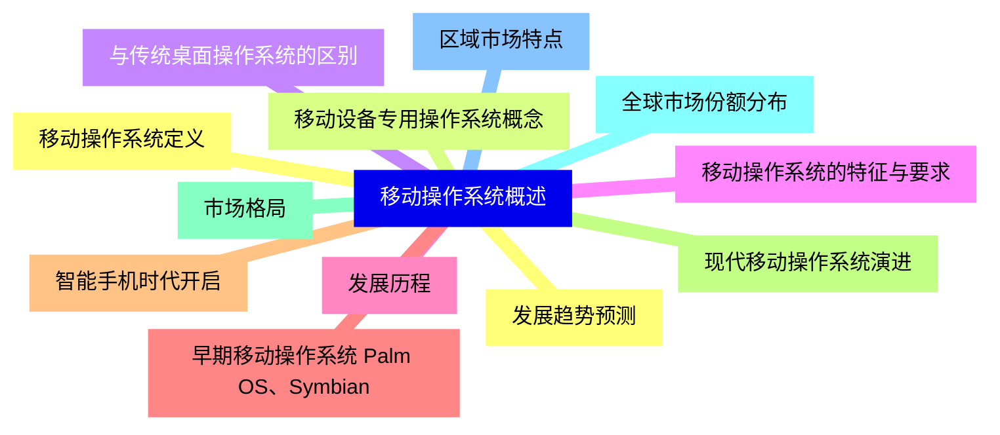
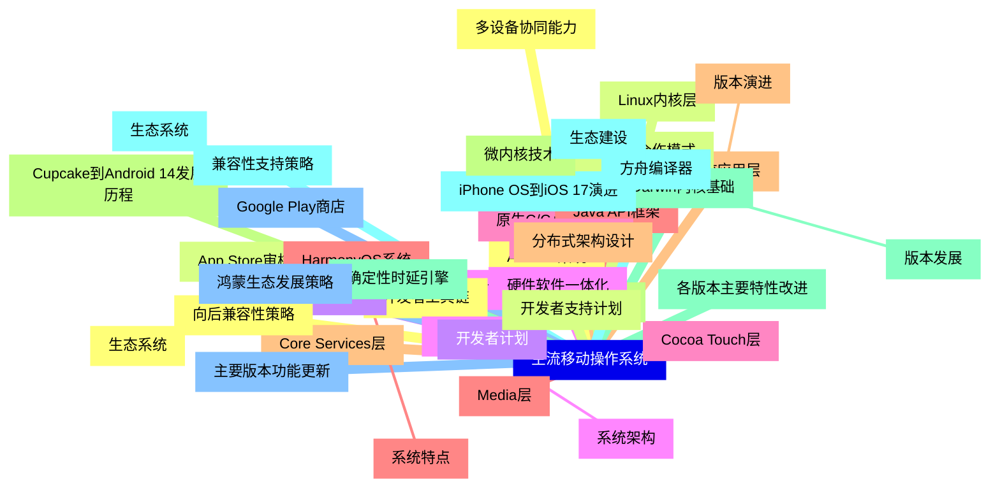
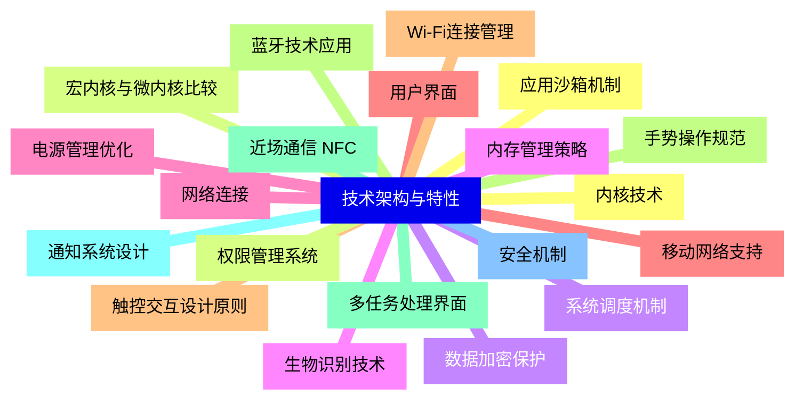
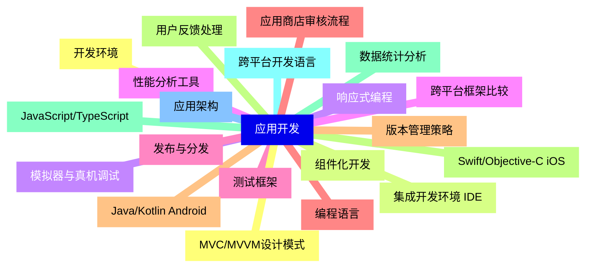
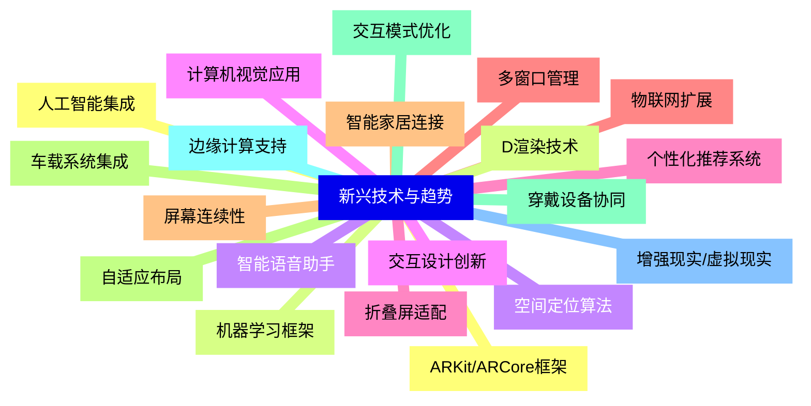
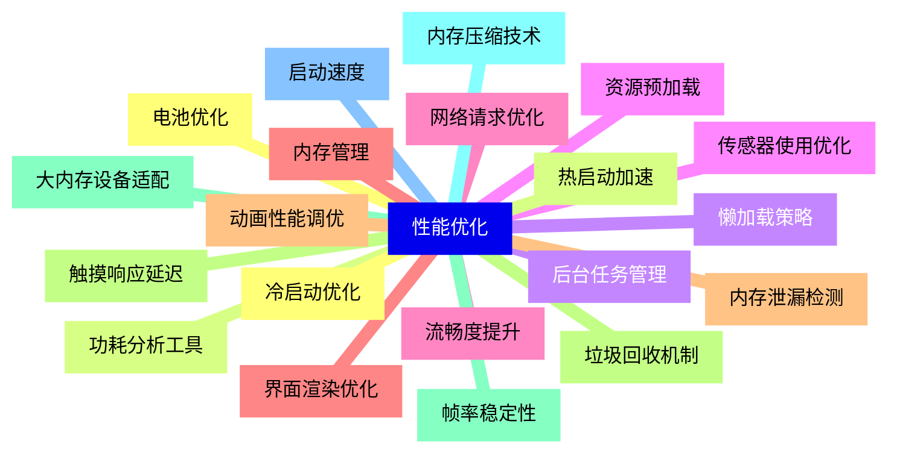
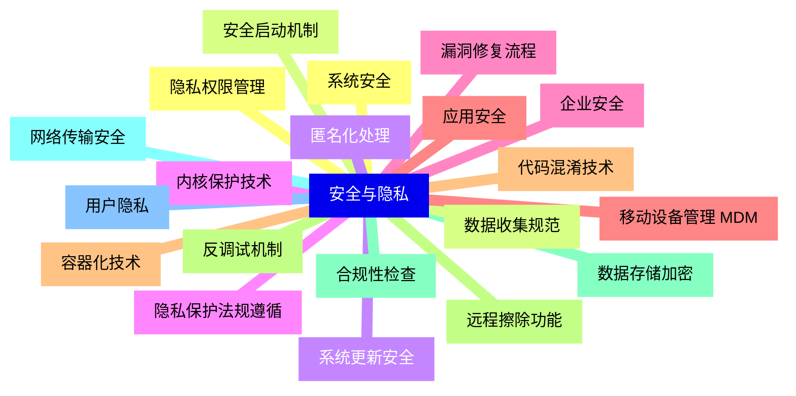
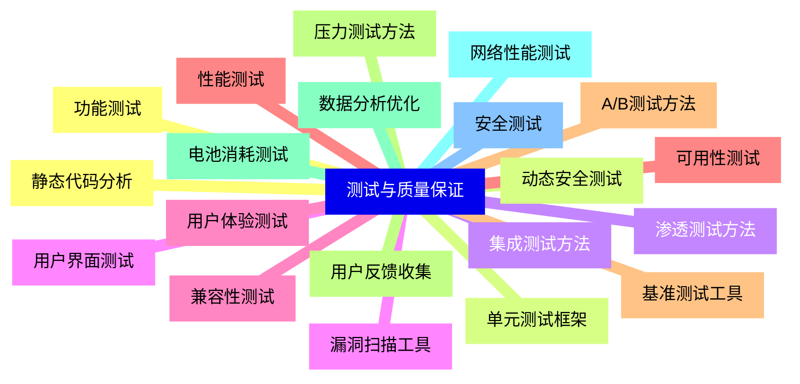
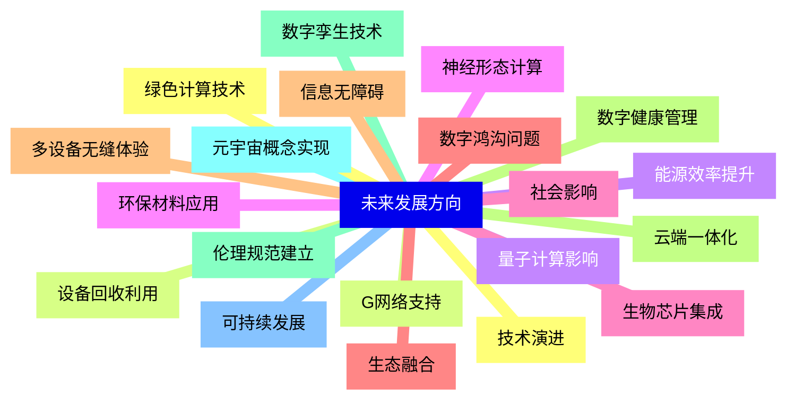


### 1 [移动操作系统概述](#1)
#### 1.1 [移动操作系统定义](#1)
#### 1.2 [移动设备专用操作系统概念](#1)
#### 1.3 [与传统桌面操作系统的区别](#1)
#### 1.4 [移动操作系统的特征与要求](#1)
#### 1.5 [发展历程](#1)
#### 1.6 [早期移动操作系统 Palm OS、Symbian](#1)
#### 1.7 [智能手机时代开启](#1)
#### 1.8 [现代移动操作系统演进](#1)
#### 1.9 [市场格局](#1)
#### 1.10 [全球市场份额分布](#1)
#### 1.11 [区域市场特点](#1)
#### 1.12 [发展趋势预测](#1)
### 2 [主流移动操作系统](#2)
#### 2.1 [Android系统](#2)
##### 2.1.1 [系统架构](#2)
#### 2.2 [Linux内核层](#2)
#### 2.3 [硬件抽象层 HAL](#2)
#### 2.4 [Android运行时环境](#2)
#### 2.5 [原生C/C++库](#2)
#### 2.6 [Java API框架](#2)
#### 2.7 [系统应用层](#2)
##### 2.7.1 [版本演进](#2)
#### 2.8 [Cupcake到Android 14发展历程](#2)
#### 2.9 [各版本主要特性改进](#2)
#### 2.10 [兼容性支持策略](#2)
##### 2.10.1 [生态系统](#2)
#### 2.11 [Google Play商店](#2)
#### 2.12 [开发者工具链](#2)
#### 2.13 [硬件厂商合作模式](#2)
#### 2.14 [开源项目AOSP](#2)
#### 2.15 [iOS系统](#2)
##### 2.15.1 [系统架构](#2)
#### 2.16 [Cocoa Touch层](#2)
#### 2.17 [Media层](#2)
#### 2.18 [Core Services层](#2)
#### 2.19 [Core OS层](#2)
#### 2.20 [Darwin内核基础](#2)
##### 2.20.1 [版本发展](#2)
#### 2.21 [iPhone OS到iOS 17演进](#2)
#### 2.22 [主要版本功能更新](#2)
#### 2.23 [向后兼容性策略](#2)
##### 2.23.1 [生态系统](#2)
#### 2.24 [App Store审核机制](#2)
#### 2.25 [开发者计划](#2)
#### 2.26 [硬件软件一体化](#2)
#### 2.27 [封闭生态优势](#2)
#### 2.28 [HarmonyOS系统](#2)
##### 2.28.1 [系统特点](#2)
#### 2.29 [分布式架构设计](#2)
#### 2.30 [微内核技术](#2)
#### 2.31 [确定性时延引擎](#2)
#### 2.32 [方舟编译器](#2)
##### 2.32.1 [生态建设](#2)
#### 2.33 [鸿蒙生态发展策略](#2)
#### 2.34 [多设备协同能力](#2)
#### 2.35 [开发者支持计划](#2)
### 3 [技术架构与特性](#3)
#### 3.1 [内核技术](#3)
#### 3.2 [宏内核与微内核比较](#3)
#### 3.3 [系统调度机制](#3)
#### 3.4 [内存管理策略](#3)
#### 3.5 [电源管理优化](#3)
#### 3.6 [用户界面](#3)
#### 3.7 [触控交互设计原则](#3)
#### 3.8 [手势操作规范](#3)
#### 3.9 [多任务处理界面](#3)
#### 3.10 [通知系统设计](#3)
#### 3.11 [安全机制](#3)
#### 3.12 [应用沙箱机制](#3)
#### 3.13 [权限管理系统](#3)
#### 3.14 [数据加密保护](#3)
#### 3.15 [生物识别技术](#3)
#### 3.16 [网络连接](#3)
#### 3.17 [移动网络支持](#3)
#### 3.18 [Wi-Fi连接管理](#3)
#### 3.19 [蓝牙技术应用](#3)
#### 3.20 [近场通信 NFC](#3)
### 4 [应用开发](#4)
#### 4.1 [开发环境](#4)
#### 4.2 [集成开发环境 IDE](#4)
#### 4.3 [模拟器与真机调试](#4)
#### 4.4 [性能分析工具](#4)
#### 4.5 [测试框架](#4)
#### 4.6 [编程语言](#4)
#### 4.7 [Java/Kotlin Android](#4)
#### 4.8 [Swift/Objective-C iOS](#4)
#### 4.9 [JavaScript/TypeScript](#4)
#### 4.10 [跨平台开发语言](#4)
#### 4.11 [应用架构](#4)
#### 4.12 [MVC/MVVM设计模式](#4)
#### 4.13 [组件化开发](#4)
#### 4.14 [响应式编程](#4)
#### 4.15 [跨平台框架比较](#4)
#### 4.16 [发布与分发](#4)
#### 4.17 [应用商店审核流程](#4)
#### 4.18 [版本管理策略](#4)
#### 4.19 [用户反馈处理](#4)
#### 4.20 [数据统计分析](#4)
### 5 [新兴技术与趋势](#5)
#### 5.1 [人工智能集成](#5)
#### 5.2 [机器学习框架](#5)
#### 5.3 [智能语音助手](#5)
#### 5.4 [计算机视觉应用](#5)
#### 5.5 [个性化推荐系统](#5)
#### 5.6 [物联网扩展](#5)
#### 5.7 [智能家居连接](#5)
#### 5.8 [车载系统集成](#5)
#### 5.9 [穿戴设备协同](#5)
#### 5.10 [边缘计算支持](#5)
#### 5.11 [增强现实/虚拟现实](#5)
#### 5.12 [ARKit/ARCore框架](#5)
#### 5.13 [D渲染技术](#5)
#### 5.14 [空间定位算法](#5)
#### 5.15 [交互设计创新](#5)
#### 5.16 [折叠屏适配](#5)
#### 5.17 [多窗口管理](#5)
#### 5.18 [屏幕连续性](#5)
#### 5.19 [自适应布局](#5)
#### 5.20 [交互模式优化](#5)
### 6 [性能优化](#6)
#### 6.1 [电池优化](#6)
#### 6.2 [功耗分析工具](#6)
#### 6.3 [后台任务管理](#6)
#### 6.4 [传感器使用优化](#6)
#### 6.5 [网络请求优化](#6)
#### 6.6 [内存管理](#6)
#### 6.7 [内存泄漏检测](#6)
#### 6.8 [垃圾回收机制](#6)
#### 6.9 [大内存设备适配](#6)
#### 6.10 [内存压缩技术](#6)
#### 6.11 [启动速度](#6)
#### 6.12 [冷启动优化](#6)
#### 6.13 [热启动加速](#6)
#### 6.14 [懒加载策略](#6)
#### 6.15 [资源预加载](#6)
#### 6.16 [流畅度提升](#6)
#### 6.17 [界面渲染优化](#6)
#### 6.18 [动画性能调优](#6)
#### 6.19 [触摸响应延迟](#6)
#### 6.20 [帧率稳定性](#6)
### 7 [安全与隐私](#7)
#### 7.1 [系统安全](#7)
#### 7.2 [安全启动机制](#7)
#### 7.3 [系统更新安全](#7)
#### 7.4 [内核保护技术](#7)
#### 7.5 [漏洞修复流程](#7)
#### 7.6 [应用安全](#7)
#### 7.7 [代码混淆技术](#7)
#### 7.8 [反调试机制](#7)
#### 7.9 [数据存储加密](#7)
#### 7.10 [网络传输安全](#7)
#### 7.11 [用户隐私](#7)
#### 7.12 [隐私权限管理](#7)
#### 7.13 [数据收集规范](#7)
#### 7.14 [匿名化处理](#7)
#### 7.15 [隐私保护法规遵循](#7)
#### 7.16 [企业安全](#7)
#### 7.17 [移动设备管理 MDM](#7)
#### 7.18 [容器化技术](#7)
#### 7.19 [远程擦除功能](#7)
#### 7.20 [合规性检查](#7)
### 8 [测试与质量保证](#8)
#### 8.1 [功能测试](#8)
#### 8.2 [单元测试框架](#8)
#### 8.3 [集成测试方法](#8)
#### 8.4 [用户界面测试](#8)
#### 8.5 [兼容性测试](#8)
#### 8.6 [性能测试](#8)
#### 8.7 [基准测试工具](#8)
#### 8.8 [压力测试方法](#8)
#### 8.9 [电池消耗测试](#8)
#### 8.10 [网络性能测试](#8)
#### 8.11 [安全测试](#8)
#### 8.12 [静态代码分析](#8)
#### 8.13 [动态安全测试](#8)
#### 8.14 [渗透测试方法](#8)
#### 8.15 [漏洞扫描工具](#8)
#### 8.16 [用户体验测试](#8)
#### 8.17 [可用性测试](#8)
#### 8.18 [A/B测试方法](#8)
#### 8.19 [用户反馈收集](#8)
#### 8.20 [数据分析优化](#8)
### 9 [未来发展方向](#9)
#### 9.1 [技术演进](#9)
#### 9.2 [G网络支持](#9)
#### 9.3 [量子计算影响](#9)
#### 9.4 [神经形态计算](#9)
#### 9.5 [生物芯片集成](#9)
#### 9.6 [生态融合](#9)
#### 9.7 [多设备无缝体验](#9)
#### 9.8 [云端一体化](#9)
#### 9.9 [数字孪生技术](#9)
#### 9.10 [元宇宙概念实现](#9)
#### 9.11 [可持续发展](#9)
#### 9.12 [绿色计算技术](#9)
#### 9.13 [设备回收利用](#9)
#### 9.14 [能源效率提升](#9)
#### 9.15 [环保材料应用](#9)
#### 9.16 [社会影响](#9)
#### 9.17 [数字鸿沟问题](#9)
#### 9.18 [信息无障碍](#9)
#### 9.19 [数字健康管理](#9)
#### 9.20 [伦理规范建立](#9)




### 1 移动操作系统概述

---
### 1 移动操作系统概述
___
#### 1.1 移动操作系统定义
___
#### 1.2 移动设备专用操作系统概念
___
#### 1.3 与传统桌面操作系统的区别
___
#### 1.4 移动操作系统的特征与要求
___
#### 1.5 发展历程
___
#### 1.6 早期移动操作系统 Palm OS、Symbian
___
#### 1.7 智能手机时代开启
___
#### 1.8 现代移动操作系统演进
___
#### 1.9 市场格局
___
#### 1.10 全球市场份额分布
___
#### 1.11 区域市场特点
___
#### 1.12 发展趋势预测
### 2 主流移动操作系统

---
### 2 主流移动操作系统
___
#### 2.1 Android系统
___
##### 2.1.1 系统架构
___
#### 2.2 Linux内核层
___
#### 2.3 硬件抽象层 HAL
___
#### 2.4 Android运行时环境
___
#### 2.5 原生C/C++库
___
#### 2.6 Java API框架
___
#### 2.7 系统应用层
___
##### 2.7.1 版本演进
___
#### 2.8 Cupcake到Android 14发展历程
___
#### 2.9 各版本主要特性改进
___
#### 2.10 兼容性支持策略
___
##### 2.10.1 生态系统
___
#### 2.11 Google Play商店
___
#### 2.12 开发者工具链
___
#### 2.13 硬件厂商合作模式
___
#### 2.14 开源项目AOSP
___
#### 2.15 iOS系统
___
##### 2.15.1 系统架构
___
#### 2.16 Cocoa Touch层
___
#### 2.17 Media层
___
#### 2.18 Core Services层
___
#### 2.19 Core OS层
___
#### 2.20 Darwin内核基础
___
##### 2.20.1 版本发展
___
#### 2.21 iPhone OS到iOS 17演进
___
#### 2.22 主要版本功能更新
___
#### 2.23 向后兼容性策略
___
##### 2.23.1 生态系统
___
#### 2.24 App Store审核机制
___
#### 2.25 开发者计划
___
#### 2.26 硬件软件一体化
___
#### 2.27 封闭生态优势
___
#### 2.28 HarmonyOS系统
___
##### 2.28.1 系统特点
___
#### 2.29 分布式架构设计
___
#### 2.30 微内核技术
___
#### 2.31 确定性时延引擎
___
#### 2.32 方舟编译器
___
##### 2.32.1 生态建设
___
#### 2.33 鸿蒙生态发展策略
___
#### 2.34 多设备协同能力
___
#### 2.35 开发者支持计划
### 3 技术架构与特性

---
### 3 技术架构与特性
___
#### 3.1 内核技术
___
#### 3.2 宏内核与微内核比较
___
#### 3.3 系统调度机制
___
#### 3.4 内存管理策略
___
#### 3.5 电源管理优化
___
#### 3.6 用户界面
___
#### 3.7 触控交互设计原则
___
#### 3.8 手势操作规范
___
#### 3.9 多任务处理界面
___
#### 3.10 通知系统设计
___
#### 3.11 安全机制
___
#### 3.12 应用沙箱机制
___
#### 3.13 权限管理系统
___
#### 3.14 数据加密保护
___
#### 3.15 生物识别技术
___
#### 3.16 网络连接
___
#### 3.17 移动网络支持
___
#### 3.18 Wi-Fi连接管理
___
#### 3.19 蓝牙技术应用
___
#### 3.20 近场通信 NFC
### 4 应用开发

---
### 4 应用开发
___
#### 4.1 开发环境
___
#### 4.2 集成开发环境 IDE
___
#### 4.3 模拟器与真机调试
___
#### 4.4 性能分析工具
___
#### 4.5 测试框架
___
#### 4.6 编程语言
___
#### 4.7 Java/Kotlin Android
___
#### 4.8 Swift/Objective-C iOS
___
#### 4.9 JavaScript/TypeScript
___
#### 4.10 跨平台开发语言
___
#### 4.11 应用架构
___
#### 4.12 MVC/MVVM设计模式
___
#### 4.13 组件化开发
___
#### 4.14 响应式编程
___
#### 4.15 跨平台框架比较
___
#### 4.16 发布与分发
___
#### 4.17 应用商店审核流程
___
#### 4.18 版本管理策略
___
#### 4.19 用户反馈处理
___
#### 4.20 数据统计分析
### 5 新兴技术与趋势

---
### 5 新兴技术与趋势
___
#### 5.1 人工智能集成
___
#### 5.2 机器学习框架
___
#### 5.3 智能语音助手
___
#### 5.4 计算机视觉应用
___
#### 5.5 个性化推荐系统
___
#### 5.6 物联网扩展
___
#### 5.7 智能家居连接
___
#### 5.8 车载系统集成
___
#### 5.9 穿戴设备协同
___
#### 5.10 边缘计算支持
___
#### 5.11 增强现实/虚拟现实
___
#### 5.12 ARKit/ARCore框架
___
#### 5.13 D渲染技术
___
#### 5.14 空间定位算法
___
#### 5.15 交互设计创新
___
#### 5.16 折叠屏适配
___
#### 5.17 多窗口管理
___
#### 5.18 屏幕连续性
___
#### 5.19 自适应布局
___
#### 5.20 交互模式优化
### 6 性能优化

---
### 6 性能优化
___
#### 6.1 电池优化
___
#### 6.2 功耗分析工具
___
#### 6.3 后台任务管理
___
#### 6.4 传感器使用优化
___
#### 6.5 网络请求优化
___
#### 6.6 内存管理
___
#### 6.7 内存泄漏检测
___
#### 6.8 垃圾回收机制
___
#### 6.9 大内存设备适配
___
#### 6.10 内存压缩技术
___
#### 6.11 启动速度
___
#### 6.12 冷启动优化
___
#### 6.13 热启动加速
___
#### 6.14 懒加载策略
___
#### 6.15 资源预加载
___
#### 6.16 流畅度提升
___
#### 6.17 界面渲染优化
___
#### 6.18 动画性能调优
___
#### 6.19 触摸响应延迟
___
#### 6.20 帧率稳定性
### 7 安全与隐私

---
### 7 安全与隐私
___
#### 7.1 系统安全
___
#### 7.2 安全启动机制
___
#### 7.3 系统更新安全
___
#### 7.4 内核保护技术
___
#### 7.5 漏洞修复流程
___
#### 7.6 应用安全
___
#### 7.7 代码混淆技术
___
#### 7.8 反调试机制
___
#### 7.9 数据存储加密
___
#### 7.10 网络传输安全
___
#### 7.11 用户隐私
___
#### 7.12 隐私权限管理
___
#### 7.13 数据收集规范
___
#### 7.14 匿名化处理
___
#### 7.15 隐私保护法规遵循
___
#### 7.16 企业安全
___
#### 7.17 移动设备管理 MDM
___
#### 7.18 容器化技术
___
#### 7.19 远程擦除功能
___
#### 7.20 合规性检查
### 8 测试与质量保证

---
### 8 测试与质量保证
___
#### 8.1 功能测试
___
#### 8.2 单元测试框架
___
#### 8.3 集成测试方法
___
#### 8.4 用户界面测试
___
#### 8.5 兼容性测试
___
#### 8.6 性能测试
___
#### 8.7 基准测试工具
___
#### 8.8 压力测试方法
___
#### 8.9 电池消耗测试
___
#### 8.10 网络性能测试
___
#### 8.11 安全测试
___
#### 8.12 静态代码分析
___
#### 8.13 动态安全测试
___
#### 8.14 渗透测试方法
___
#### 8.15 漏洞扫描工具
___
#### 8.16 用户体验测试
___
#### 8.17 可用性测试
___
#### 8.18 A/B测试方法
___
#### 8.19 用户反馈收集
___
#### 8.20 数据分析优化
### 9 未来发展方向

---
### 9 未来发展方向
___
#### 9.1 技术演进
___
#### 9.2 G网络支持
___
#### 9.3 量子计算影响
___
#### 9.4 神经形态计算
___
#### 9.5 生物芯片集成
___
#### 9.6 生态融合
___
#### 9.7 多设备无缝体验
___
#### 9.8 云端一体化
___
#### 9.9 数字孪生技术
___
#### 9.10 元宇宙概念实现
___
#### 9.11 可持续发展
___
#### 9.12 绿色计算技术
___
#### 9.13 设备回收利用
___
#### 9.14 能源效率提升
___
#### 9.15 环保材料应用
___
#### 9.16 社会影响
___
#### 9.17 数字鸿沟问题
___
#### 9.18 信息无障碍
___
#### 9.19 数字健康管理
___
#### 9.20 伦理规范建立


### 1 移动操作系统概述{#1}

{}

<--->
{}
{}
{}
{}
{}
{}
{}
{}
{}
{}
{}
{}
{}
{}
{}
{}
{}
{}
{}
{}
{}
{}
{}
{}
{}

### 2 主流移动操作系统{#2}

{}
{}
{}
{}
{}
{}
{}
{}
{}
{}
{}
{}
{}
{}
{}
{}
{}
{}
{}
{}
{}
{}
{}
{}
{}
{}
{}
{}
{}
{}
{}
{}
{}
{}
{}
{}
{}
{}
{}
{}
{}
{}
{}
{}
{}
{}
{}
{}
{}
{}
{}
{}
{}
{}
{}
{}
{}
{}
{}
{}
{}
{}
{}
{}
{}
{}
{}
{}
{}
{}
{}
{}
{}
{}
{}
{}
{}
{}
{}
{}
{}
{}
{}
{}
{}
{}
{}
<--->

{}

### 3 技术架构与特性{#3}

{}

<--->
{}
{}
{}
{}
{}
{}
{}
{}
{}
{}
{}
{}
{}
{}
{}
{}
{}
{}
{}
{}
{}
{}
{}
{}
{}
{}
{}
{}
{}
{}
{}
{}
{}
{}
{}
{}
{}
{}
{}
{}
{}

### 4 应用开发{#4}

{}
{}
{}
{}
{}
{}
{}
{}
{}
{}
{}
{}
{}
{}
{}
{}
{}
{}
{}
{}
{}
{}
{}
{}
{}
{}
{}
{}
{}
{}
{}
{}
{}
{}
{}
{}
{}
{}
{}
{}
{}
<--->

{}

### 5 新兴技术与趋势{#5}

{}

<--->
{}
{}
{}
{}
{}
{}
{}
{}
{}
{}
{}
{}
{}
{}
{}
{}
{}
{}
{}
{}
{}
{}
{}
{}
{}
{}
{}
{}
{}
{}
{}
{}
{}
{}
{}
{}
{}
{}
{}
{}
{}

### 6 性能优化{#6}

{}
{}
{}
{}
{}
{}
{}
{}
{}
{}
{}
{}
{}
{}
{}
{}
{}
{}
{}
{}
{}
{}
{}
{}
{}
{}
{}
{}
{}
{}
{}
{}
{}
{}
{}
{}
{}
{}
{}
{}
{}
<--->

{}

### 7 安全与隐私{#7}

{}

<--->
{}
{}
{}
{}
{}
{}
{}
{}
{}
{}
{}
{}
{}
{}
{}
{}
{}
{}
{}
{}
{}
{}
{}
{}
{}
{}
{}
{}
{}
{}
{}
{}
{}
{}
{}
{}
{}
{}
{}
{}
{}

### 8 测试与质量保证{#8}

{}
{}
{}
{}
{}
{}
{}
{}
{}
{}
{}
{}
{}
{}
{}
{}
{}
{}
{}
{}
{}
{}
{}
{}
{}
{}
{}
{}
{}
{}
{}
{}
{}
{}
{}
{}
{}
{}
{}
{}
{}
<--->

{}

### 9 未来发展方向{#9}

{}

<--->
{}
{}
{}
{}
{}
{}
{}
{}
{}
{}
{}
{}
{}
{}
{}
{}
{}
{}
{}
{}
{}
{}
{}
{}
{}
{}
{}
{}
{}
{}
{}
{}
{}
{}
{}
{}
{}
{}
{}
{}
{}
