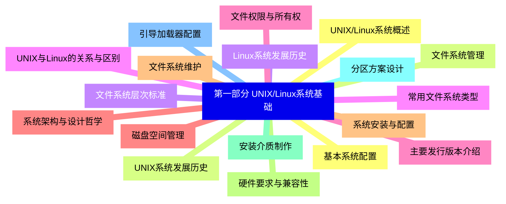
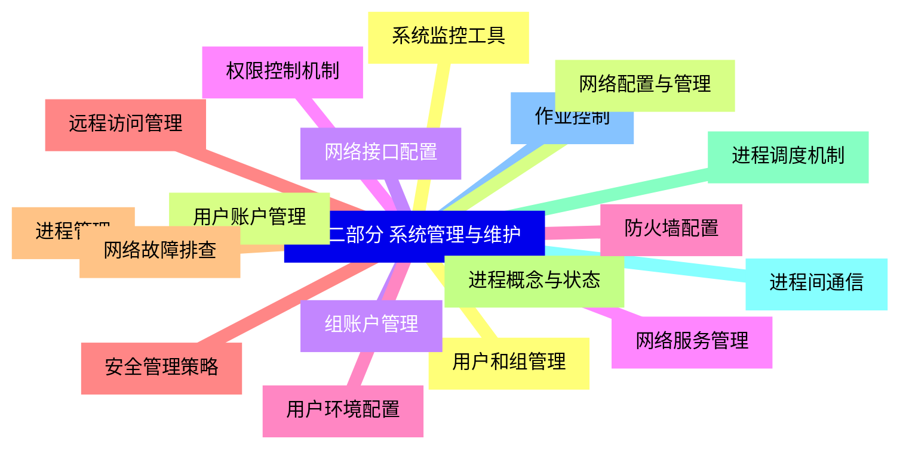
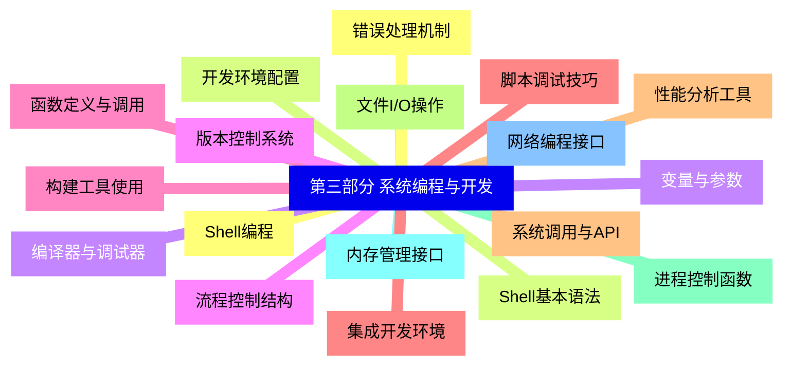
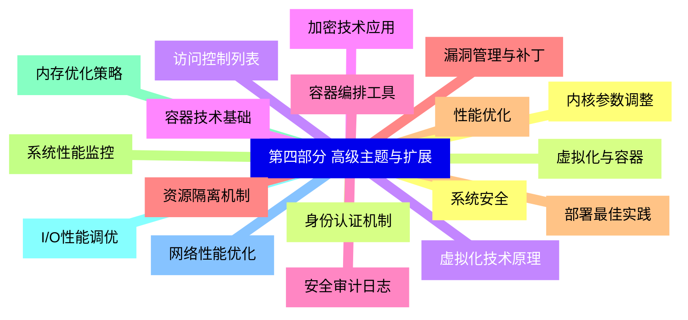
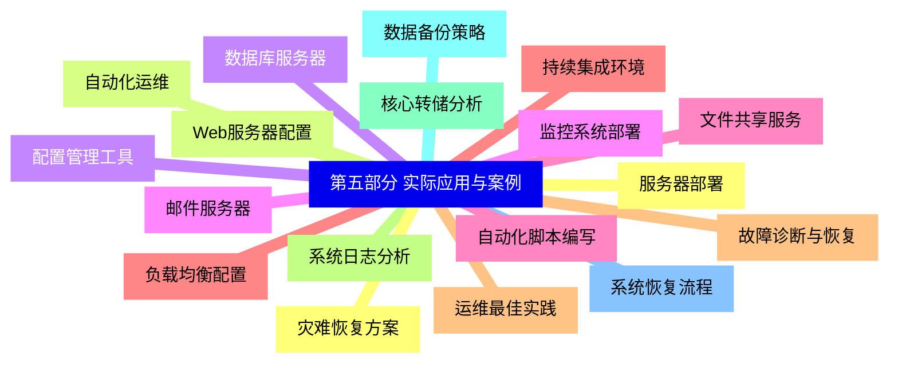


### 1 [第一部分 UNIX/Linux系统基础](#1)
#### 1.1 [UNIX/Linux系统概述](#1)
#### 1.2 [UNIX系统发展历史](#1)
#### 1.3 [Linux系统发展历史](#1)
#### 1.4 [UNIX与Linux的关系与区别](#1)
#### 1.5 [主要发行版本介绍](#1)
#### 1.6 [系统架构与设计哲学](#1)
#### 1.7 [系统安装与配置](#1)
#### 1.8 [硬件要求与兼容性](#1)
#### 1.9 [安装介质制作](#1)
#### 1.10 [分区方案设计](#1)
#### 1.11 [引导加载器配置](#1)
#### 1.12 [基本系统配置](#1)
#### 1.13 [文件系统管理](#1)
#### 1.14 [文件系统层次标准](#1)
#### 1.15 [常用文件系统类型](#1)
#### 1.16 [文件权限与所有权](#1)
#### 1.17 [磁盘空间管理](#1)
#### 1.18 [文件系统维护](#1)
### 2 [第二部分 系统管理与维护](#2)
#### 2.1 [用户和组管理](#2)
#### 2.2 [用户账户管理](#2)
#### 2.3 [组账户管理](#2)
#### 2.4 [权限控制机制](#2)
#### 2.5 [用户环境配置](#2)
#### 2.6 [安全管理策略](#2)
#### 2.7 [进程管理](#2)
#### 2.8 [进程概念与状态](#2)
#### 2.9 [进程调度机制](#2)
#### 2.10 [进程间通信](#2)
#### 2.11 [作业控制](#2)
#### 2.12 [系统监控工具](#2)
#### 2.13 [网络配置与管理](#2)
#### 2.14 [网络接口配置](#2)
#### 2.15 [网络服务管理](#2)
#### 2.16 [防火墙配置](#2)
#### 2.17 [远程访问管理](#2)
#### 2.18 [网络故障排查](#2)
### 3 [第三部分 系统编程与开发](#3)
#### 3.1 [Shell编程](#3)
#### 3.2 [Shell基本语法](#3)
#### 3.3 [变量与参数](#3)
#### 3.4 [流程控制结构](#3)
#### 3.5 [函数定义与调用](#3)
#### 3.6 [脚本调试技巧](#3)
#### 3.7 [系统调用与API](#3)
#### 3.8 [文件I/O操作](#3)
#### 3.9 [进程控制函数](#3)
#### 3.10 [内存管理接口](#3)
#### 3.11 [网络编程接口](#3)
#### 3.12 [错误处理机制](#3)
#### 3.13 [开发环境配置](#3)
#### 3.14 [编译器与调试器](#3)
#### 3.15 [版本控制系统](#3)
#### 3.16 [构建工具使用](#3)
#### 3.17 [集成开发环境](#3)
#### 3.18 [性能分析工具](#3)
### 4 [第四部分 高级主题与扩展](#4)
#### 4.1 [系统安全](#4)
#### 4.2 [身份认证机制](#4)
#### 4.3 [访问控制列表](#4)
#### 4.4 [加密技术应用](#4)
#### 4.5 [安全审计日志](#4)
#### 4.6 [漏洞管理与补丁](#4)
#### 4.7 [性能优化](#4)
#### 4.8 [系统性能监控](#4)
#### 4.9 [内存优化策略](#4)
#### 4.10 [I/O性能调优](#4)
#### 4.11 [网络性能优化](#4)
#### 4.12 [内核参数调整](#4)
#### 4.13 [虚拟化与容器](#4)
#### 4.14 [虚拟化技术原理](#4)
#### 4.15 [容器技术基础](#4)
#### 4.16 [容器编排工具](#4)
#### 4.17 [资源隔离机制](#4)
#### 4.18 [部署最佳实践](#4)
### 5 [第五部分 实际应用与案例](#5)
#### 5.1 [服务器部署](#5)
#### 5.2 [Web服务器配置](#5)
#### 5.3 [数据库服务器](#5)
#### 5.4 [邮件服务器](#5)
#### 5.5 [文件共享服务](#5)
#### 5.6 [负载均衡配置](#5)
#### 5.7 [故障诊断与恢复](#5)
#### 5.8 [系统日志分析](#5)
#### 5.9 [核心转储分析](#5)
#### 5.10 [数据备份策略](#5)
#### 5.11 [系统恢复流程](#5)
#### 5.12 [灾难恢复方案](#5)
#### 5.13 [自动化运维](#5)
#### 5.14 [配置管理工具](#5)
#### 5.15 [监控系统部署](#5)
#### 5.16 [自动化脚本编写](#5)
#### 5.17 [持续集成环境](#5)
#### 5.18 [运维最佳实践](#5)




### 1 第一部分 UNIX/Linux系统基础

---
### 1 第一部分 UNIX/Linux系统基础
___
#### 1.1 UNIX/Linux系统概述
___
#### 1.2 UNIX系统发展历史
___
#### 1.3 Linux系统发展历史
___
#### 1.4 UNIX与Linux的关系与区别
___
#### 1.5 主要发行版本介绍
___
#### 1.6 系统架构与设计哲学
___
#### 1.7 系统安装与配置
___
#### 1.8 硬件要求与兼容性
___
#### 1.9 安装介质制作
___
#### 1.10 分区方案设计
___
#### 1.11 引导加载器配置
___
#### 1.12 基本系统配置
___
#### 1.13 文件系统管理
___
#### 1.14 文件系统层次标准
___
#### 1.15 常用文件系统类型
___
#### 1.16 文件权限与所有权
___
#### 1.17 磁盘空间管理
___
#### 1.18 文件系统维护
### 2 第二部分 系统管理与维护

---
### 2 第二部分 系统管理与维护
___
#### 2.1 用户和组管理
___
#### 2.2 用户账户管理
___
#### 2.3 组账户管理
___
#### 2.4 权限控制机制
___
#### 2.5 用户环境配置
___
#### 2.6 安全管理策略
___
#### 2.7 进程管理
___
#### 2.8 进程概念与状态
___
#### 2.9 进程调度机制
___
#### 2.10 进程间通信
___
#### 2.11 作业控制
___
#### 2.12 系统监控工具
___
#### 2.13 网络配置与管理
___
#### 2.14 网络接口配置
___
#### 2.15 网络服务管理
___
#### 2.16 防火墙配置
___
#### 2.17 远程访问管理
___
#### 2.18 网络故障排查
### 3 第三部分 系统编程与开发

---
### 3 第三部分 系统编程与开发
___
#### 3.1 Shell编程
___
#### 3.2 Shell基本语法
___
#### 3.3 变量与参数
___
#### 3.4 流程控制结构
___
#### 3.5 函数定义与调用
___
#### 3.6 脚本调试技巧
___
#### 3.7 系统调用与API
___
#### 3.8 文件I/O操作
___
#### 3.9 进程控制函数
___
#### 3.10 内存管理接口
___
#### 3.11 网络编程接口
___
#### 3.12 错误处理机制
___
#### 3.13 开发环境配置
___
#### 3.14 编译器与调试器
___
#### 3.15 版本控制系统
___
#### 3.16 构建工具使用
___
#### 3.17 集成开发环境
___
#### 3.18 性能分析工具
### 4 第四部分 高级主题与扩展

---
### 4 第四部分 高级主题与扩展
___
#### 4.1 系统安全
___
#### 4.2 身份认证机制
___
#### 4.3 访问控制列表
___
#### 4.4 加密技术应用
___
#### 4.5 安全审计日志
___
#### 4.6 漏洞管理与补丁
___
#### 4.7 性能优化
___
#### 4.8 系统性能监控
___
#### 4.9 内存优化策略
___
#### 4.10 I/O性能调优
___
#### 4.11 网络性能优化
___
#### 4.12 内核参数调整
___
#### 4.13 虚拟化与容器
___
#### 4.14 虚拟化技术原理
___
#### 4.15 容器技术基础
___
#### 4.16 容器编排工具
___
#### 4.17 资源隔离机制
___
#### 4.18 部署最佳实践
### 5 第五部分 实际应用与案例

---
### 5 第五部分 实际应用与案例
___
#### 5.1 服务器部署
___
#### 5.2 Web服务器配置
___
#### 5.3 数据库服务器
___
#### 5.4 邮件服务器
___
#### 5.5 文件共享服务
___
#### 5.6 负载均衡配置
___
#### 5.7 故障诊断与恢复
___
#### 5.8 系统日志分析
___
#### 5.9 核心转储分析
___
#### 5.10 数据备份策略
___
#### 5.11 系统恢复流程
___
#### 5.12 灾难恢复方案
___
#### 5.13 自动化运维
___
#### 5.14 配置管理工具
___
#### 5.15 监控系统部署
___
#### 5.16 自动化脚本编写
___
#### 5.17 持续集成环境
___
#### 5.18 运维最佳实践


### 1 第一部分 UNIX/Linux系统基础{#1}

{}

<--->
{}
{}
{}
{}
{}
{}
{}
{}
{}
{}
{}
{}
{}
{}
{}
{}
{}
{}
{}
{}
{}
{}
{}
{}
{}
{}
{}
{}
{}
{}
{}
{}
{}
{}
{}
{}
{}

### 2 第二部分 系统管理与维护{#2}

{}
{}
{}
{}
{}
{}
{}
{}
{}
{}
{}
{}
{}
{}
{}
{}
{}
{}
{}
{}
{}
{}
{}
{}
{}
{}
{}
{}
{}
{}
{}
{}
{}
{}
{}
{}
{}
<--->

{}

### 3 第三部分 系统编程与开发{#3}

{}

<--->
{}
{}
{}
{}
{}
{}
{}
{}
{}
{}
{}
{}
{}
{}
{}
{}
{}
{}
{}
{}
{}
{}
{}
{}
{}
{}
{}
{}
{}
{}
{}
{}
{}
{}
{}
{}
{}

### 4 第四部分 高级主题与扩展{#4}

{}
{}
{}
{}
{}
{}
{}
{}
{}
{}
{}
{}
{}
{}
{}
{}
{}
{}
{}
{}
{}
{}
{}
{}
{}
{}
{}
{}
{}
{}
{}
{}
{}
{}
{}
{}
{}
<--->

{}

### 5 第五部分 实际应用与案例{#5}

{}

<--->
{}
{}
{}
{}
{}
{}
{}
{}
{}
{}
{}
{}
{}
{}
{}
{}
{}
{}
{}
{}
{}
{}
{}
{}
{}
{}
{}
{}
{}
{}
{}
{}
{}
{}
{}
{}
{}
