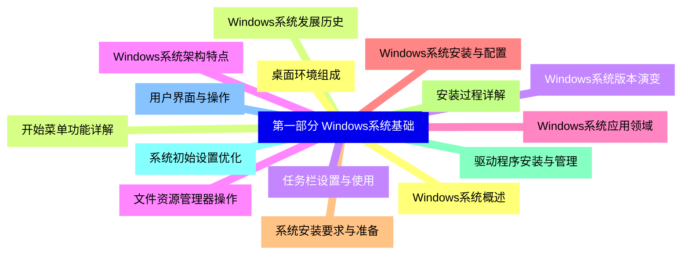
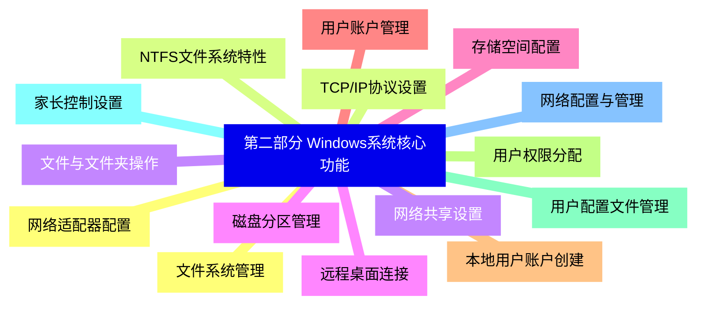
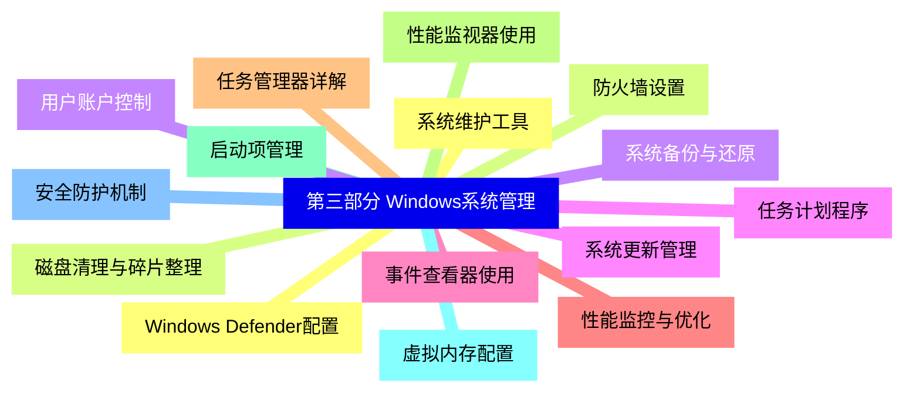
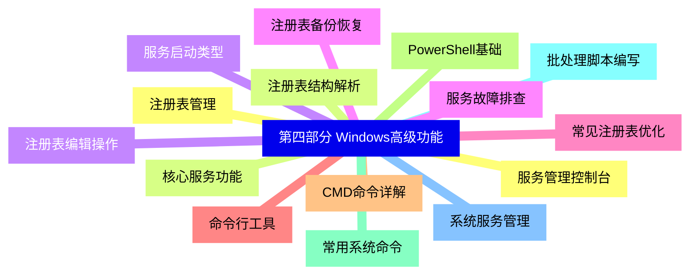
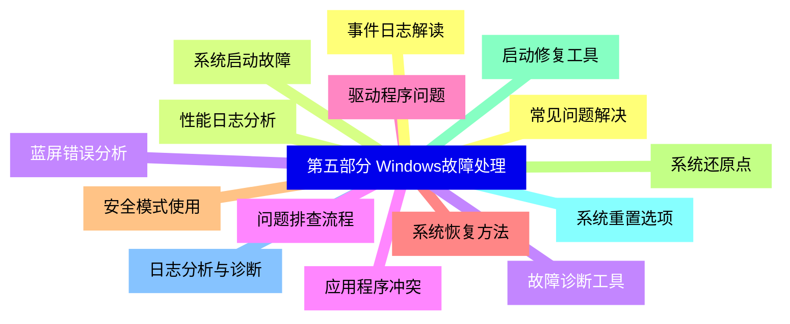
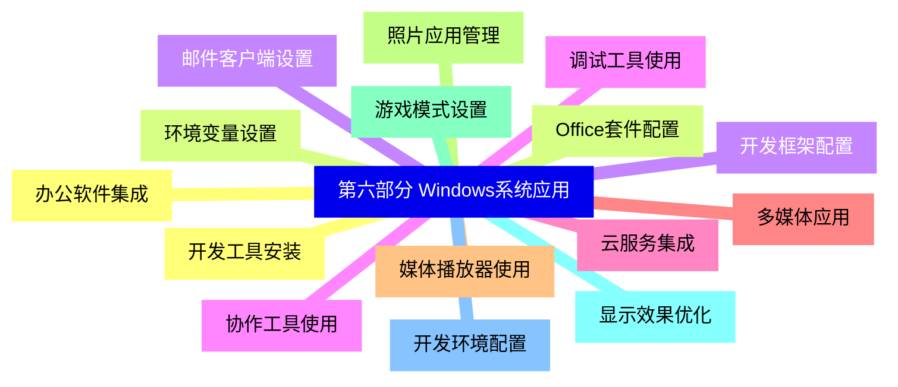


### 1 [第一部分 Windows系统基础](#1)
#### 1.1 [Windows系统概述](#1)
#### 1.2 [Windows系统发展历史](#1)
#### 1.3 [Windows系统版本演变](#1)
#### 1.4 [Windows系统架构特点](#1)
#### 1.5 [Windows系统应用领域](#1)
#### 1.6 [Windows系统安装与配置](#1)
#### 1.7 [系统安装要求与准备](#1)
#### 1.8 [安装过程详解](#1)
#### 1.9 [驱动程序安装与管理](#1)
#### 1.10 [系统初始设置优化](#1)
#### 1.11 [用户界面与操作](#1)
#### 1.12 [桌面环境组成](#1)
#### 1.13 [开始菜单功能详解](#1)
#### 1.14 [任务栏设置与使用](#1)
#### 1.15 [文件资源管理器操作](#1)
### 2 [第二部分 Windows系统核心功能](#2)
#### 2.1 [文件系统管理](#2)
#### 2.2 [NTFS文件系统特性](#2)
#### 2.3 [文件与文件夹操作](#2)
#### 2.4 [磁盘分区管理](#2)
#### 2.5 [存储空间配置](#2)
#### 2.6 [用户账户管理](#2)
#### 2.7 [本地用户账户创建](#2)
#### 2.8 [用户权限分配](#2)
#### 2.9 [用户配置文件管理](#2)
#### 2.10 [家长控制设置](#2)
#### 2.11 [网络配置与管理](#2)
#### 2.12 [网络适配器配置](#2)
#### 2.13 [TCP/IP协议设置](#2)
#### 2.14 [网络共享设置](#2)
#### 2.15 [远程桌面连接](#2)
### 3 [第三部分 Windows系统管理](#3)
#### 3.1 [系统维护工具](#3)
#### 3.2 [磁盘清理与碎片整理](#3)
#### 3.3 [系统备份与还原](#3)
#### 3.4 [任务计划程序](#3)
#### 3.5 [事件查看器使用](#3)
#### 3.6 [性能监控与优化](#3)
#### 3.7 [任务管理器详解](#3)
#### 3.8 [性能监视器使用](#3)
#### 3.9 [启动项管理](#3)
#### 3.10 [虚拟内存配置](#3)
#### 3.11 [安全防护机制](#3)
#### 3.12 [Windows Defender配置](#3)
#### 3.13 [防火墙设置](#3)
#### 3.14 [用户账户控制](#3)
#### 3.15 [系统更新管理](#3)
### 4 [第四部分 Windows高级功能](#4)
#### 4.1 [注册表管理](#4)
#### 4.2 [注册表结构解析](#4)
#### 4.3 [注册表编辑操作](#4)
#### 4.4 [注册表备份恢复](#4)
#### 4.5 [常见注册表优化](#4)
#### 4.6 [命令行工具](#4)
#### 4.7 [CMD命令详解](#4)
#### 4.8 [PowerShell基础](#4)
#### 4.9 [常用系统命令](#4)
#### 4.10 [批处理脚本编写](#4)
#### 4.11 [系统服务管理](#4)
#### 4.12 [服务管理控制台](#4)
#### 4.13 [核心服务功能](#4)
#### 4.14 [服务启动类型](#4)
#### 4.15 [服务故障排查](#4)
### 5 [第五部分 Windows故障处理](#5)
#### 5.1 [常见问题解决](#5)
#### 5.2 [系统启动故障](#5)
#### 5.3 [蓝屏错误分析](#5)
#### 5.4 [应用程序冲突](#5)
#### 5.5 [驱动程序问题](#5)
#### 5.6 [系统恢复方法](#5)
#### 5.7 [安全模式使用](#5)
#### 5.8 [系统还原点](#5)
#### 5.9 [启动修复工具](#5)
#### 5.10 [系统重置选项](#5)
#### 5.11 [日志分析与诊断](#5)
#### 5.12 [事件日志解读](#5)
#### 5.13 [性能日志分析](#5)
#### 5.14 [故障诊断工具](#5)
#### 5.15 [问题排查流程](#5)
### 6 [第六部分 Windows系统应用](#6)
#### 6.1 [办公软件集成](#6)
#### 6.2 [Office套件配置](#6)
#### 6.3 [邮件客户端设置](#6)
#### 6.4 [协作工具使用](#6)
#### 6.5 [云服务集成](#6)
#### 6.6 [多媒体应用](#6)
#### 6.7 [媒体播放器使用](#6)
#### 6.8 [照片应用管理](#6)
#### 6.9 [游戏模式设置](#6)
#### 6.10 [显示效果优化](#6)
#### 6.11 [开发环境配置](#6)
#### 6.12 [开发工具安装](#6)
#### 6.13 [环境变量设置](#6)
#### 6.14 [开发框架配置](#6)
#### 6.15 [调试工具使用](#6)




### 1 第一部分 Windows系统基础

---
### 1 第一部分 Windows系统基础
___
#### 1.1 Windows系统概述
___
#### 1.2 Windows系统发展历史
___
#### 1.3 Windows系统版本演变
___
#### 1.4 Windows系统架构特点
___
#### 1.5 Windows系统应用领域
___
#### 1.6 Windows系统安装与配置
___
#### 1.7 系统安装要求与准备
___
#### 1.8 安装过程详解
___
#### 1.9 驱动程序安装与管理
___
#### 1.10 系统初始设置优化
___
#### 1.11 用户界面与操作
___
#### 1.12 桌面环境组成
___
#### 1.13 开始菜单功能详解
___
#### 1.14 任务栏设置与使用
___
#### 1.15 文件资源管理器操作
### 2 第二部分 Windows系统核心功能

---
### 2 第二部分 Windows系统核心功能
___
#### 2.1 文件系统管理
___
#### 2.2 NTFS文件系统特性
___
#### 2.3 文件与文件夹操作
___
#### 2.4 磁盘分区管理
___
#### 2.5 存储空间配置
___
#### 2.6 用户账户管理
___
#### 2.7 本地用户账户创建
___
#### 2.8 用户权限分配
___
#### 2.9 用户配置文件管理
___
#### 2.10 家长控制设置
___
#### 2.11 网络配置与管理
___
#### 2.12 网络适配器配置
___
#### 2.13 TCP/IP协议设置
___
#### 2.14 网络共享设置
___
#### 2.15 远程桌面连接
### 3 第三部分 Windows系统管理

---
### 3 第三部分 Windows系统管理
___
#### 3.1 系统维护工具
___
#### 3.2 磁盘清理与碎片整理
___
#### 3.3 系统备份与还原
___
#### 3.4 任务计划程序
___
#### 3.5 事件查看器使用
___
#### 3.6 性能监控与优化
___
#### 3.7 任务管理器详解
___
#### 3.8 性能监视器使用
___
#### 3.9 启动项管理
___
#### 3.10 虚拟内存配置
___
#### 3.11 安全防护机制
___
#### 3.12 Windows Defender配置
___
#### 3.13 防火墙设置
___
#### 3.14 用户账户控制
___
#### 3.15 系统更新管理
### 4 第四部分 Windows高级功能

---
### 4 第四部分 Windows高级功能
___
#### 4.1 注册表管理
___
#### 4.2 注册表结构解析
___
#### 4.3 注册表编辑操作
___
#### 4.4 注册表备份恢复
___
#### 4.5 常见注册表优化
___
#### 4.6 命令行工具
___
#### 4.7 CMD命令详解
___
#### 4.8 PowerShell基础
___
#### 4.9 常用系统命令
___
#### 4.10 批处理脚本编写
___
#### 4.11 系统服务管理
___
#### 4.12 服务管理控制台
___
#### 4.13 核心服务功能
___
#### 4.14 服务启动类型
___
#### 4.15 服务故障排查
### 5 第五部分 Windows故障处理

---
### 5 第五部分 Windows故障处理
___
#### 5.1 常见问题解决
___
#### 5.2 系统启动故障
___
#### 5.3 蓝屏错误分析
___
#### 5.4 应用程序冲突
___
#### 5.5 驱动程序问题
___
#### 5.6 系统恢复方法
___
#### 5.7 安全模式使用
___
#### 5.8 系统还原点
___
#### 5.9 启动修复工具
___
#### 5.10 系统重置选项
___
#### 5.11 日志分析与诊断
___
#### 5.12 事件日志解读
___
#### 5.13 性能日志分析
___
#### 5.14 故障诊断工具
___
#### 5.15 问题排查流程
### 6 第六部分 Windows系统应用

---
### 6 第六部分 Windows系统应用
___
#### 6.1 办公软件集成
___
#### 6.2 Office套件配置
___
#### 6.3 邮件客户端设置
___
#### 6.4 协作工具使用
___
#### 6.5 云服务集成
___
#### 6.6 多媒体应用
___
#### 6.7 媒体播放器使用
___
#### 6.8 照片应用管理
___
#### 6.9 游戏模式设置
___
#### 6.10 显示效果优化
___
#### 6.11 开发环境配置
___
#### 6.12 开发工具安装
___
#### 6.13 环境变量设置
___
#### 6.14 开发框架配置
___
#### 6.15 调试工具使用


### 1 第一部分 Windows系统基础{#1}

{}

<--->
{}
{}
{}
{}
{}
{}
{}
{}
{}
{}
{}
{}
{}
{}
{}
{}
{}
{}
{}
{}
{}
{}
{}
{}
{}
{}
{}
{}
{}
{}
{}

### 2 第二部分 Windows系统核心功能{#2}

{}
{}
{}
{}
{}
{}
{}
{}
{}
{}
{}
{}
{}
{}
{}
{}
{}
{}
{}
{}
{}
{}
{}
{}
{}
{}
{}
{}
{}
{}
{}
<--->

{}

### 3 第三部分 Windows系统管理{#3}

{}

<--->
{}
{}
{}
{}
{}
{}
{}
{}
{}
{}
{}
{}
{}
{}
{}
{}
{}
{}
{}
{}
{}
{}
{}
{}
{}
{}
{}
{}
{}
{}
{}

### 4 第四部分 Windows高级功能{#4}

{}
{}
{}
{}
{}
{}
{}
{}
{}
{}
{}
{}
{}
{}
{}
{}
{}
{}
{}
{}
{}
{}
{}
{}
{}
{}
{}
{}
{}
{}
{}
<--->

{}

### 5 第五部分 Windows故障处理{#5}

{}

<--->
{}
{}
{}
{}
{}
{}
{}
{}
{}
{}
{}
{}
{}
{}
{}
{}
{}
{}
{}
{}
{}
{}
{}
{}
{}
{}
{}
{}
{}
{}
{}

### 6 第六部分 Windows系统应用{#6}

{}
{}
{}
{}
{}
{}
{}
{}
{}
{}
{}
{}
{}
{}
{}
{}
{}
{}
{}
{}
{}
{}
{}
{}
{}
{}
{}
{}
{}
{}
{}
<--->

{}
