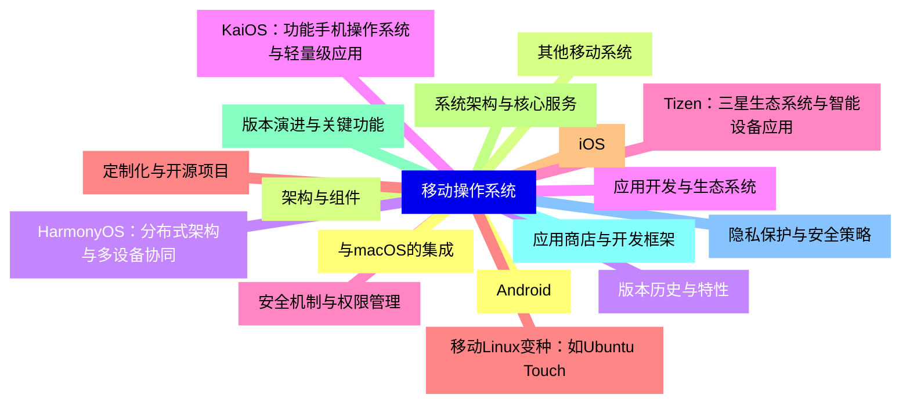
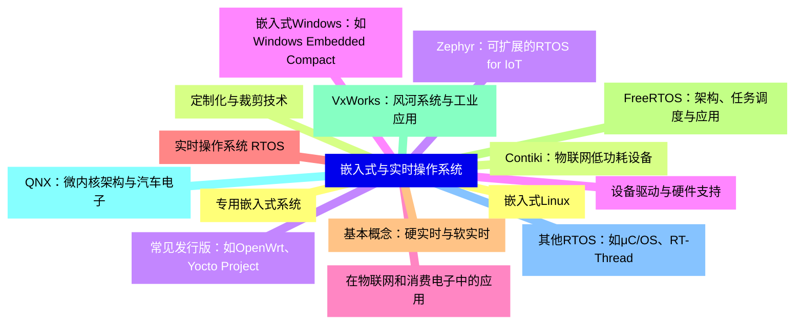
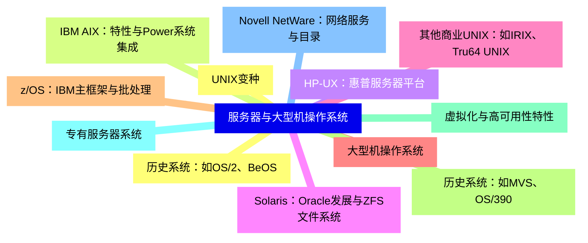
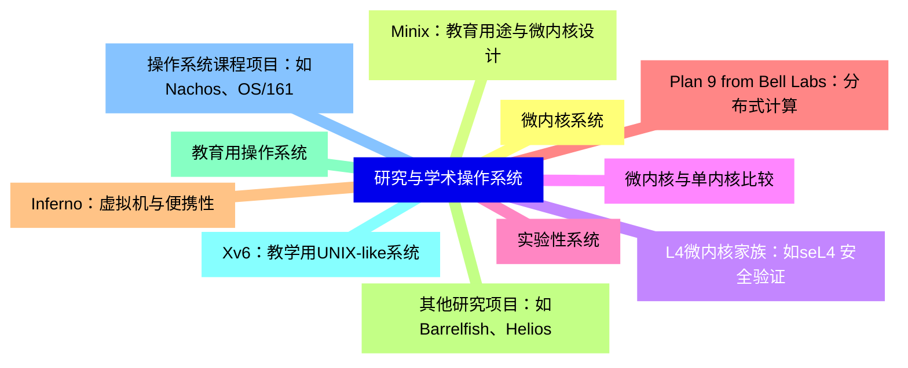
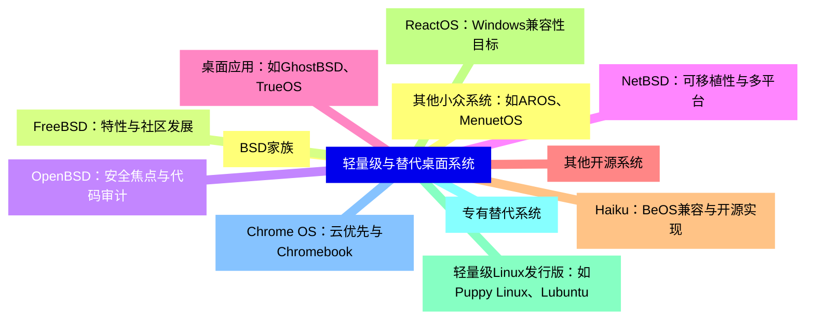
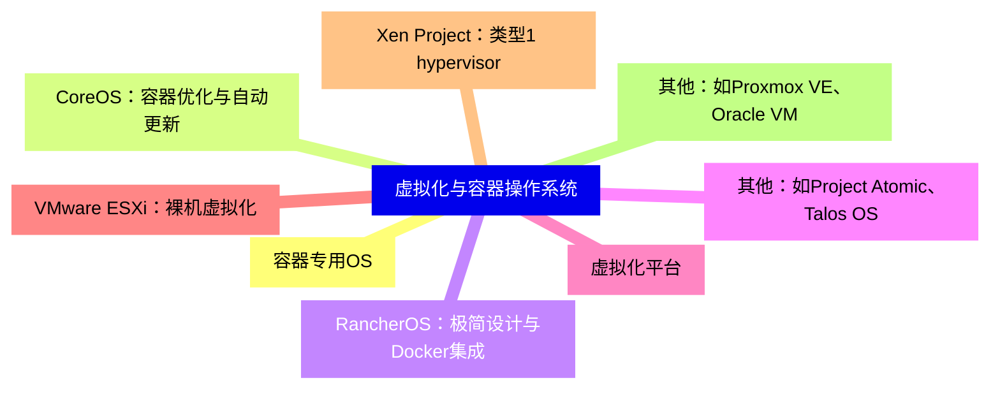
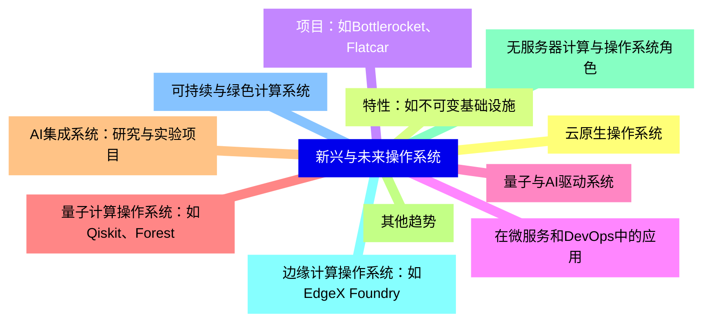


### 1 [移动操作系统](#1)
#### 1.1 [Android](#1)
#### 1.2 [架构与组件](#1)
#### 1.3 [版本历史与特性](#1)
#### 1.4 [应用开发与生态系统](#1)
#### 1.5 [安全机制与权限管理](#1)
#### 1.6 [定制化与开源项目](#1)
#### 1.7 [iOS](#1)
#### 1.8 [系统架构与核心服务](#1)
#### 1.9 [版本演进与关键功能](#1)
#### 1.10 [应用商店与开发框架](#1)
#### 1.11 [隐私保护与安全策略](#1)
#### 1.12 [与macOS的集成](#1)
#### 1.13 [其他移动系统](#1)
#### 1.14 [HarmonyOS：分布式架构与多设备协同](#1)
#### 1.15 [KaiOS：功能手机操作系统与轻量级应用](#1)
#### 1.16 [Tizen：三星生态系统与智能设备应用](#1)
#### 1.17 [移动Linux变种：如Ubuntu Touch](#1)
### 2 [嵌入式与实时操作系统](#2)
#### 2.1 [嵌入式Linux](#2)
#### 2.2 [定制化与裁剪技术](#2)
#### 2.3 [常见发行版：如OpenWrt、Yocto Project](#2)
#### 2.4 [设备驱动与硬件支持](#2)
#### 2.5 [在物联网和消费电子中的应用](#2)
#### 2.6 [实时操作系统 RTOS](#2)
#### 2.7 [基本概念：硬实时与软实时](#2)
#### 2.8 [FreeRTOS：架构、任务调度与应用](#2)
#### 2.9 [VxWorks：风河系统与工业应用](#2)
#### 2.10 [QNX：微内核架构与汽车电子](#2)
#### 2.11 [其他RTOS：如μC/OS、RT-Thread](#2)
#### 2.12 [专用嵌入式系统](#2)
#### 2.13 [Contiki：物联网低功耗设备](#2)
#### 2.14 [Zephyr：可扩展的RTOS for IoT](#2)
#### 2.15 [嵌入式Windows：如Windows Embedded Compact](#2)
### 3 [服务器与大型机操作系统](#3)
#### 3.1 [UNIX变种](#3)
#### 3.2 [IBM AIX：特性与Power系统集成](#3)
#### 3.3 [HP-UX：惠普服务器平台](#3)
#### 3.4 [Solaris：Oracle发展与ZFS文件系统](#3)
#### 3.5 [其他商业UNIX：如IRIX、Tru64 UNIX](#3)
#### 3.6 [大型机操作系统](#3)
#### 3.7 [z/OS：IBM主框架与批处理](#3)
#### 3.8 [历史系统：如MVS、OS/390](#3)
#### 3.9 [虚拟化与高可用性特性](#3)
#### 3.10 [专有服务器系统](#3)
#### 3.11 [Novell NetWare：网络服务与目录](#3)
#### 3.12 [历史系统：如OS/2、BeOS](#3)
### 4 [研究与学术操作系统](#4)
#### 4.1 [微内核系统](#4)
#### 4.2 [Minix：教育用途与微内核设计](#4)
#### 4.3 [L4微内核家族：如seL4 安全验证](#4)
#### 4.4 [微内核与单内核比较](#4)
#### 4.5 [实验性系统](#4)
#### 4.6 [Plan 9 from Bell Labs：分布式计算](#4)
#### 4.7 [Inferno：虚拟机与便携性](#4)
#### 4.8 [其他研究项目：如Barrelfish、Helios](#4)
#### 4.9 [教育用操作系统](#4)
#### 4.10 [Xv6：教学用UNIX-like系统](#4)
#### 4.11 [操作系统课程项目：如Nachos、OS/161](#4)
### 5 [轻量级与替代桌面系统](#5)
#### 5.1 [BSD家族](#5)
#### 5.2 [FreeBSD：特性与社区发展](#5)
#### 5.3 [OpenBSD：安全焦点与代码审计](#5)
#### 5.4 [NetBSD：可移植性与多平台](#5)
#### 5.5 [桌面应用：如GhostBSD、TrueOS](#5)
#### 5.6 [其他开源系统](#5)
#### 5.7 [Haiku：BeOS兼容与开源实现](#5)
#### 5.8 [ReactOS：Windows兼容性目标](#5)
#### 5.9 [轻量级Linux发行版：如Puppy Linux、Lubuntu](#5)
#### 5.10 [专有替代系统](#5)
#### 5.11 [Chrome OS：云优先与Chromebook](#5)
#### 5.12 [其他小众系统：如AROS、MenuetOS](#5)
### 6 [虚拟化与容器操作系统](#6)
#### 6.1 [容器专用OS](#6)
#### 6.2 [CoreOS：容器优化与自动更新](#6)
#### 6.3 [RancherOS：极简设计与Docker集成](#6)
#### 6.4 [其他：如Project Atomic、Talos OS](#6)
#### 6.5 [虚拟化平台](#6)
#### 6.6 [VMware ESXi：裸机虚拟化](#6)
#### 6.7 [Xen Project：类型1 hypervisor](#6)
#### 6.8 [其他：如Proxmox VE、Oracle VM](#6)
### 7 [新兴与未来操作系统](#7)
#### 7.1 [云原生操作系统](#7)
#### 7.2 [特性：如不可变基础设施](#7)
#### 7.3 [项目：如Bottlerocket、Flatcar](#7)
#### 7.4 [在微服务和DevOps中的应用](#7)
#### 7.5 [量子与AI驱动系统](#7)
#### 7.6 [量子计算操作系统：如Qiskit、Forest](#7)
#### 7.7 [AI集成系统：研究与实验项目](#7)
#### 7.8 [其他趋势](#7)
#### 7.9 [无服务器计算与操作系统角色](#7)
#### 7.10 [边缘计算操作系统：如EdgeX Foundry](#7)
#### 7.11 [可持续与绿色计算系统](#7)




### 1 移动操作系统

---
### 1 移动操作系统
___
#### 1.1 Android
___
#### 1.2 架构与组件
___
#### 1.3 版本历史与特性
___
#### 1.4 应用开发与生态系统
___
#### 1.5 安全机制与权限管理
___
#### 1.6 定制化与开源项目
___
#### 1.7 iOS
___
#### 1.8 系统架构与核心服务
___
#### 1.9 版本演进与关键功能
___
#### 1.10 应用商店与开发框架
___
#### 1.11 隐私保护与安全策略
___
#### 1.12 与macOS的集成
___
#### 1.13 其他移动系统
___
#### 1.14 HarmonyOS：分布式架构与多设备协同
___
#### 1.15 KaiOS：功能手机操作系统与轻量级应用
___
#### 1.16 Tizen：三星生态系统与智能设备应用
___
#### 1.17 移动Linux变种：如Ubuntu Touch
### 2 嵌入式与实时操作系统

---
### 2 嵌入式与实时操作系统
___
#### 2.1 嵌入式Linux
___
#### 2.2 定制化与裁剪技术
___
#### 2.3 常见发行版：如OpenWrt、Yocto Project
___
#### 2.4 设备驱动与硬件支持
___
#### 2.5 在物联网和消费电子中的应用
___
#### 2.6 实时操作系统 RTOS
___
#### 2.7 基本概念：硬实时与软实时
___
#### 2.8 FreeRTOS：架构、任务调度与应用
___
#### 2.9 VxWorks：风河系统与工业应用
___
#### 2.10 QNX：微内核架构与汽车电子
___
#### 2.11 其他RTOS：如μC/OS、RT-Thread
___
#### 2.12 专用嵌入式系统
___
#### 2.13 Contiki：物联网低功耗设备
___
#### 2.14 Zephyr：可扩展的RTOS for IoT
___
#### 2.15 嵌入式Windows：如Windows Embedded Compact
### 3 服务器与大型机操作系统

---
### 3 服务器与大型机操作系统
___
#### 3.1 UNIX变种
___
#### 3.2 IBM AIX：特性与Power系统集成
___
#### 3.3 HP-UX：惠普服务器平台
___
#### 3.4 Solaris：Oracle发展与ZFS文件系统
___
#### 3.5 其他商业UNIX：如IRIX、Tru64 UNIX
___
#### 3.6 大型机操作系统
___
#### 3.7 z/OS：IBM主框架与批处理
___
#### 3.8 历史系统：如MVS、OS/390
___
#### 3.9 虚拟化与高可用性特性
___
#### 3.10 专有服务器系统
___
#### 3.11 Novell NetWare：网络服务与目录
___
#### 3.12 历史系统：如OS/2、BeOS
### 4 研究与学术操作系统

---
### 4 研究与学术操作系统
___
#### 4.1 微内核系统
___
#### 4.2 Minix：教育用途与微内核设计
___
#### 4.3 L4微内核家族：如seL4 安全验证
___
#### 4.4 微内核与单内核比较
___
#### 4.5 实验性系统
___
#### 4.6 Plan 9 from Bell Labs：分布式计算
___
#### 4.7 Inferno：虚拟机与便携性
___
#### 4.8 其他研究项目：如Barrelfish、Helios
___
#### 4.9 教育用操作系统
___
#### 4.10 Xv6：教学用UNIX-like系统
___
#### 4.11 操作系统课程项目：如Nachos、OS/161
### 5 轻量级与替代桌面系统

---
### 5 轻量级与替代桌面系统
___
#### 5.1 BSD家族
___
#### 5.2 FreeBSD：特性与社区发展
___
#### 5.3 OpenBSD：安全焦点与代码审计
___
#### 5.4 NetBSD：可移植性与多平台
___
#### 5.5 桌面应用：如GhostBSD、TrueOS
___
#### 5.6 其他开源系统
___
#### 5.7 Haiku：BeOS兼容与开源实现
___
#### 5.8 ReactOS：Windows兼容性目标
___
#### 5.9 轻量级Linux发行版：如Puppy Linux、Lubuntu
___
#### 5.10 专有替代系统
___
#### 5.11 Chrome OS：云优先与Chromebook
___
#### 5.12 其他小众系统：如AROS、MenuetOS
### 6 虚拟化与容器操作系统

---
### 6 虚拟化与容器操作系统
___
#### 6.1 容器专用OS
___
#### 6.2 CoreOS：容器优化与自动更新
___
#### 6.3 RancherOS：极简设计与Docker集成
___
#### 6.4 其他：如Project Atomic、Talos OS
___
#### 6.5 虚拟化平台
___
#### 6.6 VMware ESXi：裸机虚拟化
___
#### 6.7 Xen Project：类型1 hypervisor
___
#### 6.8 其他：如Proxmox VE、Oracle VM
### 7 新兴与未来操作系统

---
### 7 新兴与未来操作系统
___
#### 7.1 云原生操作系统
___
#### 7.2 特性：如不可变基础设施
___
#### 7.3 项目：如Bottlerocket、Flatcar
___
#### 7.4 在微服务和DevOps中的应用
___
#### 7.5 量子与AI驱动系统
___
#### 7.6 量子计算操作系统：如Qiskit、Forest
___
#### 7.7 AI集成系统：研究与实验项目
___
#### 7.8 其他趋势
___
#### 7.9 无服务器计算与操作系统角色
___
#### 7.10 边缘计算操作系统：如EdgeX Foundry
___
#### 7.11 可持续与绿色计算系统


### 1 移动操作系统{#1}

{}

<--->
{}
{}
{}
{}
{}
{}
{}
{}
{}
{}
{}
{}
{}
{}
{}
{}
{}
{}
{}
{}
{}
{}
{}
{}
{}
{}
{}
{}
{}
{}
{}
{}
{}
{}
{}

### 2 嵌入式与实时操作系统{#2}

{}
{}
{}
{}
{}
{}
{}
{}
{}
{}
{}
{}
{}
{}
{}
{}
{}
{}
{}
{}
{}
{}
{}
{}
{}
{}
{}
{}
{}
{}
{}
<--->

{}

### 3 服务器与大型机操作系统{#3}

{}

<--->
{}
{}
{}
{}
{}
{}
{}
{}
{}
{}
{}
{}
{}
{}
{}
{}
{}
{}
{}
{}
{}
{}
{}
{}
{}

### 4 研究与学术操作系统{#4}

{}
{}
{}
{}
{}
{}
{}
{}
{}
{}
{}
{}
{}
{}
{}
{}
{}
{}
{}
{}
{}
{}
{}
<--->

{}

### 5 轻量级与替代桌面系统{#5}

{}

<--->
{}
{}
{}
{}
{}
{}
{}
{}
{}
{}
{}
{}
{}
{}
{}
{}
{}
{}
{}
{}
{}
{}
{}
{}
{}

### 6 虚拟化与容器操作系统{#6}

{}
{}
{}
{}
{}
{}
{}
{}
{}
{}
{}
{}
{}
{}
{}
{}
{}
<--->

{}

### 7 新兴与未来操作系统{#7}

{}

<--->
{}
{}
{}
{}
{}
{}
{}
{}
{}
{}
{}
{}
{}
{}
{}
{}
{}
{}
{}
{}
{}
{}
{}
