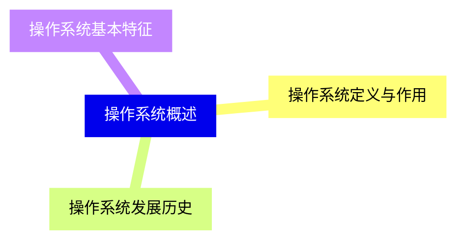
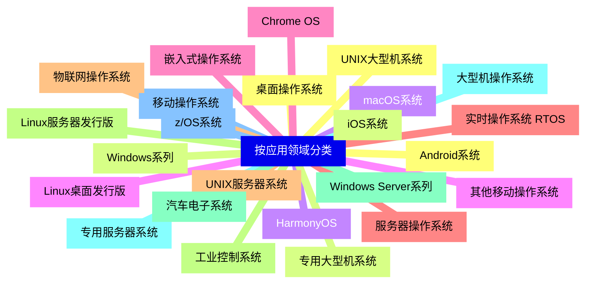
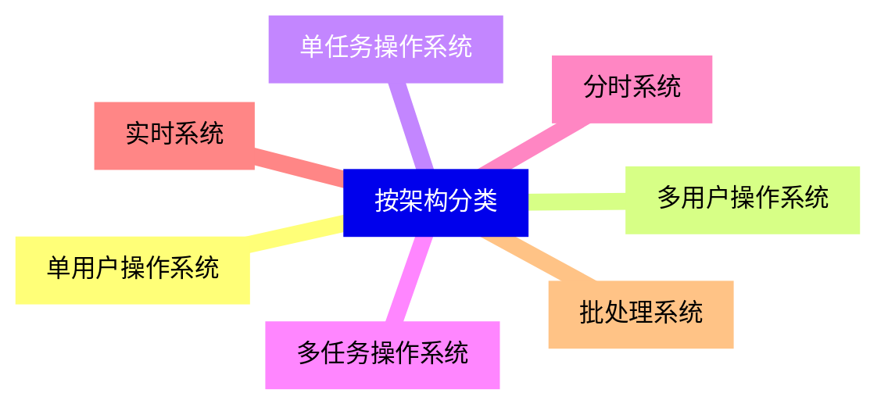
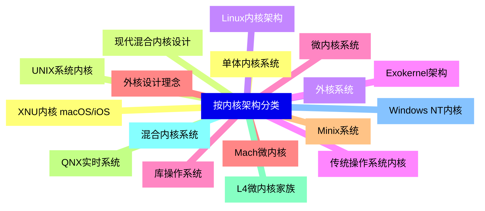
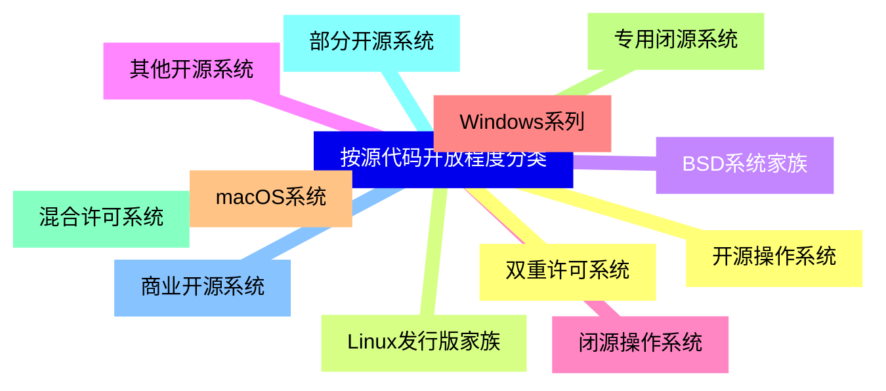
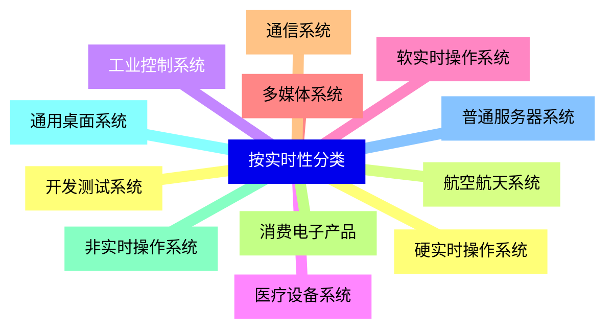
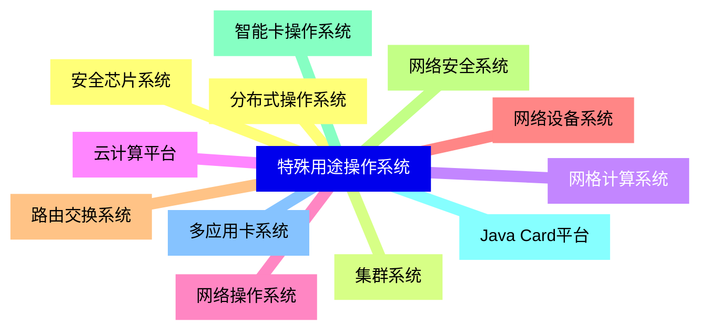
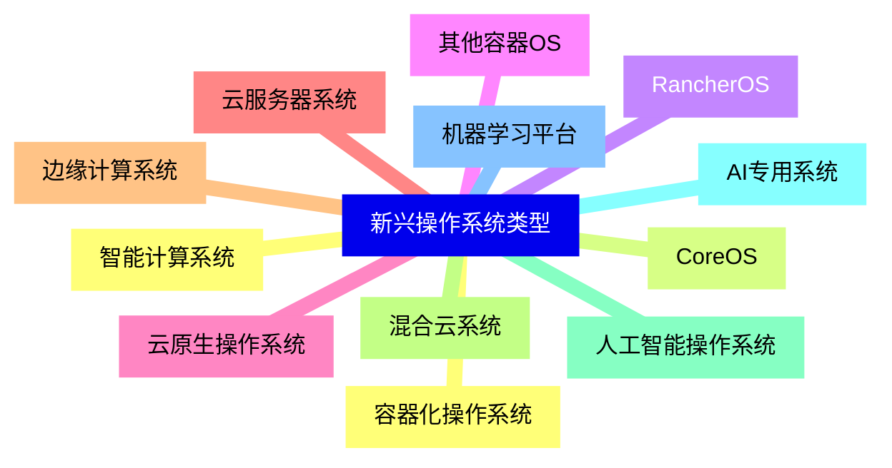
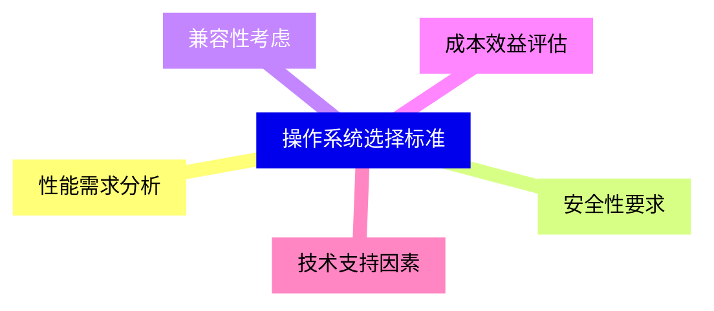


### 1 [操作系统概述](#1)
#### 1.1 [操作系统定义与作用](#1)
#### 1.2 [操作系统发展历史](#1)
#### 1.3 [操作系统基本特征](#1)
### 2 [按应用领域分类](#2)
#### 2.1 [桌面操作系统](#2)
#### 2.2 [Windows系列](#2)
#### 2.3 [macOS系统](#2)
#### 2.4 [Linux桌面发行版](#2)
#### 2.5 [Chrome OS](#2)
#### 2.6 [服务器操作系统](#2)
#### 2.7 [UNIX服务器系统](#2)
#### 2.8 [Linux服务器发行版](#2)
#### 2.9 [Windows Server系列](#2)
#### 2.10 [专用服务器系统](#2)
#### 2.11 [移动操作系统](#2)
#### 2.12 [Android系统](#2)
#### 2.13 [iOS系统](#2)
#### 2.14 [HarmonyOS](#2)
#### 2.15 [其他移动操作系统](#2)
#### 2.16 [嵌入式操作系统](#2)
#### 2.17 [实时操作系统 RTOS](#2)
#### 2.18 [物联网操作系统](#2)
#### 2.19 [工业控制系统](#2)
#### 2.20 [汽车电子系统](#2)
#### 2.21 [大型机操作系统](#2)
#### 2.22 [z/OS系统](#2)
#### 2.23 [UNIX大型机系统](#2)
#### 2.24 [专用大型机系统](#2)
### 3 [按架构分类](#3)
#### 3.1 [单用户操作系统](#3)
#### 3.2 [多用户操作系统](#3)
#### 3.3 [单任务操作系统](#3)
#### 3.4 [多任务操作系统](#3)
#### 3.5 [分时系统](#3)
#### 3.6 [实时系统](#3)
#### 3.7 [批处理系统](#3)
### 4 [按内核架构分类](#4)
#### 4.1 [单体内核系统](#4)
#### 4.2 [UNIX系统内核](#4)
#### 4.3 [Linux内核架构](#4)
#### 4.4 [传统操作系统内核](#4)
#### 4.5 [微内核系统](#4)
#### 4.6 [Mach微内核](#4)
#### 4.7 [Minix系统](#4)
#### 4.8 [QNX实时系统](#4)
#### 4.9 [L4微内核家族](#4)
#### 4.10 [混合内核系统](#4)
#### 4.11 [Windows NT内核](#4)
#### 4.12 [XNU内核 macOS/iOS](#4)
#### 4.13 [现代混合内核设计](#4)
#### 4.14 [外核系统](#4)
#### 4.15 [Exokernel架构](#4)
#### 4.16 [库操作系统](#4)
#### 4.17 [外核设计理念](#4)
### 5 [按源代码开放程度分类](#5)
#### 5.1 [开源操作系统](#5)
#### 5.2 [Linux发行版家族](#5)
#### 5.3 [BSD系统家族](#5)
#### 5.4 [其他开源系统](#5)
#### 5.5 [闭源操作系统](#5)
#### 5.6 [Windows系列](#5)
#### 5.7 [macOS系统](#5)
#### 5.8 [专用闭源系统](#5)
#### 5.9 [混合许可系统](#5)
#### 5.10 [部分开源系统](#5)
#### 5.11 [商业开源系统](#5)
#### 5.12 [双重许可系统](#5)
### 6 [按实时性分类](#6)
#### 6.1 [硬实时操作系统](#6)
#### 6.2 [航空航天系统](#6)
#### 6.3 [工业控制系统](#6)
#### 6.4 [医疗设备系统](#6)
#### 6.5 [软实时操作系统](#6)
#### 6.6 [多媒体系统](#6)
#### 6.7 [通信系统](#6)
#### 6.8 [消费电子产品](#6)
#### 6.9 [非实时操作系统](#6)
#### 6.10 [通用桌面系统](#6)
#### 6.11 [普通服务器系统](#6)
#### 6.12 [开发测试系统](#6)
### 7 [特殊用途操作系统](#7)
#### 7.1 [分布式操作系统](#7)
#### 7.2 [集群系统](#7)
#### 7.3 [网格计算系统](#7)
#### 7.4 [云计算平台](#7)
#### 7.5 [网络操作系统](#7)
#### 7.6 [网络设备系统](#7)
#### 7.7 [路由交换系统](#7)
#### 7.8 [网络安全系统](#7)
#### 7.9 [智能卡操作系统](#7)
#### 7.10 [Java Card平台](#7)
#### 7.11 [多应用卡系统](#7)
#### 7.12 [安全芯片系统](#7)
### 8 [新兴操作系统类型](#8)
#### 8.1 [容器化操作系统](#8)
#### 8.2 [CoreOS](#8)
#### 8.3 [RancherOS](#8)
#### 8.4 [其他容器OS](#8)
#### 8.5 [云原生操作系统](#8)
#### 8.6 [云服务器系统](#8)
#### 8.7 [边缘计算系统](#8)
#### 8.8 [混合云系统](#8)
#### 8.9 [人工智能操作系统](#8)
#### 8.10 [AI专用系统](#8)
#### 8.11 [机器学习平台](#8)
#### 8.12 [智能计算系统](#8)
### 9 [操作系统选择标准](#9)
#### 9.1 [性能需求分析](#9)
#### 9.2 [安全性要求](#9)
#### 9.3 [兼容性考虑](#9)
#### 9.4 [成本效益评估](#9)
#### 9.5 [技术支持因素](#9)




### 1 操作系统概述

---
### 1 操作系统概述
___
#### 1.1 操作系统定义与作用
___
#### 1.2 操作系统发展历史
___
#### 1.3 操作系统基本特征
### 2 按应用领域分类

---
### 2 按应用领域分类
___
#### 2.1 桌面操作系统
___
#### 2.2 Windows系列
___
#### 2.3 macOS系统
___
#### 2.4 Linux桌面发行版
___
#### 2.5 Chrome OS
___
#### 2.6 服务器操作系统
___
#### 2.7 UNIX服务器系统
___
#### 2.8 Linux服务器发行版
___
#### 2.9 Windows Server系列
___
#### 2.10 专用服务器系统
___
#### 2.11 移动操作系统
___
#### 2.12 Android系统
___
#### 2.13 iOS系统
___
#### 2.14 HarmonyOS
___
#### 2.15 其他移动操作系统
___
#### 2.16 嵌入式操作系统
___
#### 2.17 实时操作系统 RTOS
___
#### 2.18 物联网操作系统
___
#### 2.19 工业控制系统
___
#### 2.20 汽车电子系统
___
#### 2.21 大型机操作系统
___
#### 2.22 z/OS系统
___
#### 2.23 UNIX大型机系统
___
#### 2.24 专用大型机系统
### 3 按架构分类

---
### 3 按架构分类
___
#### 3.1 单用户操作系统
___
#### 3.2 多用户操作系统
___
#### 3.3 单任务操作系统
___
#### 3.4 多任务操作系统
___
#### 3.5 分时系统
___
#### 3.6 实时系统
___
#### 3.7 批处理系统
### 4 按内核架构分类

---
### 4 按内核架构分类
___
#### 4.1 单体内核系统
___
#### 4.2 UNIX系统内核
___
#### 4.3 Linux内核架构
___
#### 4.4 传统操作系统内核
___
#### 4.5 微内核系统
___
#### 4.6 Mach微内核
___
#### 4.7 Minix系统
___
#### 4.8 QNX实时系统
___
#### 4.9 L4微内核家族
___
#### 4.10 混合内核系统
___
#### 4.11 Windows NT内核
___
#### 4.12 XNU内核 macOS/iOS
___
#### 4.13 现代混合内核设计
___
#### 4.14 外核系统
___
#### 4.15 Exokernel架构
___
#### 4.16 库操作系统
___
#### 4.17 外核设计理念
### 5 按源代码开放程度分类

---
### 5 按源代码开放程度分类
___
#### 5.1 开源操作系统
___
#### 5.2 Linux发行版家族
___
#### 5.3 BSD系统家族
___
#### 5.4 其他开源系统
___
#### 5.5 闭源操作系统
___
#### 5.6 Windows系列
___
#### 5.7 macOS系统
___
#### 5.8 专用闭源系统
___
#### 5.9 混合许可系统
___
#### 5.10 部分开源系统
___
#### 5.11 商业开源系统
___
#### 5.12 双重许可系统
### 6 按实时性分类

---
### 6 按实时性分类
___
#### 6.1 硬实时操作系统
___
#### 6.2 航空航天系统
___
#### 6.3 工业控制系统
___
#### 6.4 医疗设备系统
___
#### 6.5 软实时操作系统
___
#### 6.6 多媒体系统
___
#### 6.7 通信系统
___
#### 6.8 消费电子产品
___
#### 6.9 非实时操作系统
___
#### 6.10 通用桌面系统
___
#### 6.11 普通服务器系统
___
#### 6.12 开发测试系统
### 7 特殊用途操作系统

---
### 7 特殊用途操作系统
___
#### 7.1 分布式操作系统
___
#### 7.2 集群系统
___
#### 7.3 网格计算系统
___
#### 7.4 云计算平台
___
#### 7.5 网络操作系统
___
#### 7.6 网络设备系统
___
#### 7.7 路由交换系统
___
#### 7.8 网络安全系统
___
#### 7.9 智能卡操作系统
___
#### 7.10 Java Card平台
___
#### 7.11 多应用卡系统
___
#### 7.12 安全芯片系统
### 8 新兴操作系统类型

---
### 8 新兴操作系统类型
___
#### 8.1 容器化操作系统
___
#### 8.2 CoreOS
___
#### 8.3 RancherOS
___
#### 8.4 其他容器OS
___
#### 8.5 云原生操作系统
___
#### 8.6 云服务器系统
___
#### 8.7 边缘计算系统
___
#### 8.8 混合云系统
___
#### 8.9 人工智能操作系统
___
#### 8.10 AI专用系统
___
#### 8.11 机器学习平台
___
#### 8.12 智能计算系统
### 9 操作系统选择标准

---
### 9 操作系统选择标准
___
#### 9.1 性能需求分析
___
#### 9.2 安全性要求
___
#### 9.3 兼容性考虑
___
#### 9.4 成本效益评估
___
#### 9.5 技术支持因素


### 1 操作系统概述{#1}

{}

<--->
{}
{}
{}
{}
{}
{}
{}

### 2 按应用领域分类{#2}

{}
{}
{}
{}
{}
{}
{}
{}
{}
{}
{}
{}
{}
{}
{}
{}
{}
{}
{}
{}
{}
{}
{}
{}
{}
{}
{}
{}
{}
{}
{}
{}
{}
{}
{}
{}
{}
{}
{}
{}
{}
{}
{}
{}
{}
{}
{}
{}
{}
<--->

{}

### 3 按架构分类{#3}

{}

<--->
{}
{}
{}
{}
{}
{}
{}
{}
{}
{}
{}
{}
{}
{}
{}

### 4 按内核架构分类{#4}

{}
{}
{}
{}
{}
{}
{}
{}
{}
{}
{}
{}
{}
{}
{}
{}
{}
{}
{}
{}
{}
{}
{}
{}
{}
{}
{}
{}
{}
{}
{}
{}
{}
{}
{}
<--->

{}

### 5 按源代码开放程度分类{#5}

{}

<--->
{}
{}
{}
{}
{}
{}
{}
{}
{}
{}
{}
{}
{}
{}
{}
{}
{}
{}
{}
{}
{}
{}
{}
{}
{}

### 6 按实时性分类{#6}

{}
{}
{}
{}
{}
{}
{}
{}
{}
{}
{}
{}
{}
{}
{}
{}
{}
{}
{}
{}
{}
{}
{}
{}
{}
<--->

{}

### 7 特殊用途操作系统{#7}

{}

<--->
{}
{}
{}
{}
{}
{}
{}
{}
{}
{}
{}
{}
{}
{}
{}
{}
{}
{}
{}
{}
{}
{}
{}
{}
{}

### 8 新兴操作系统类型{#8}

{}
{}
{}
{}
{}
{}
{}
{}
{}
{}
{}
{}
{}
{}
{}
{}
{}
{}
{}
{}
{}
{}
{}
{}
{}
<--->

{}

### 9 操作系统选择标准{#9}

{}

<--->
{}
{}
{}
{}
{}
{}
{}
{}
{}
{}
{}
