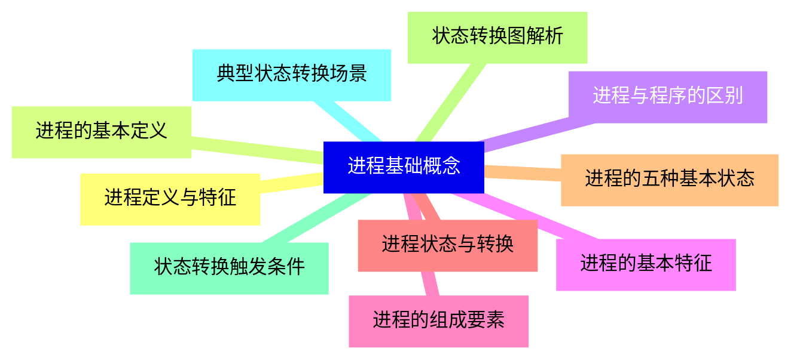
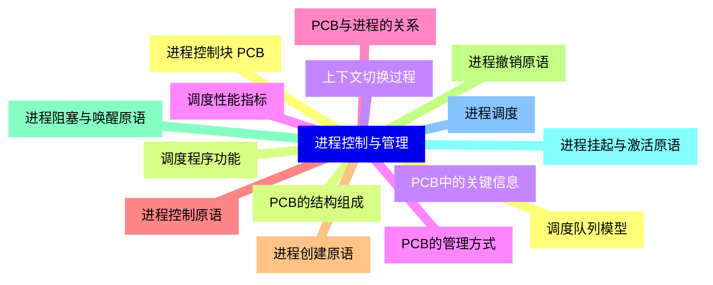
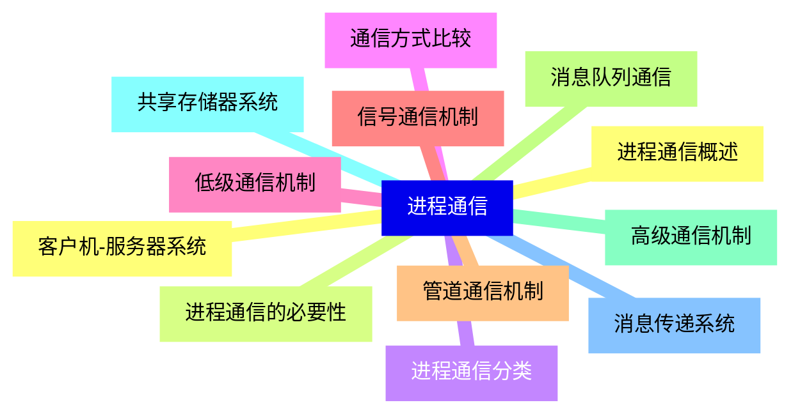
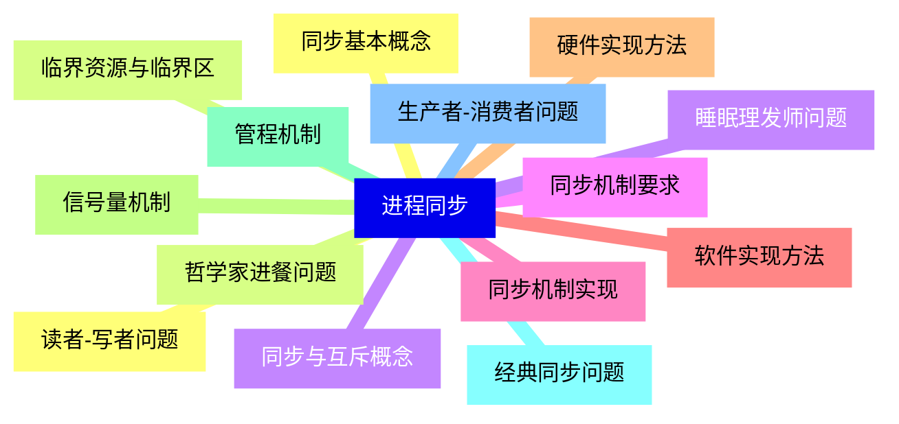
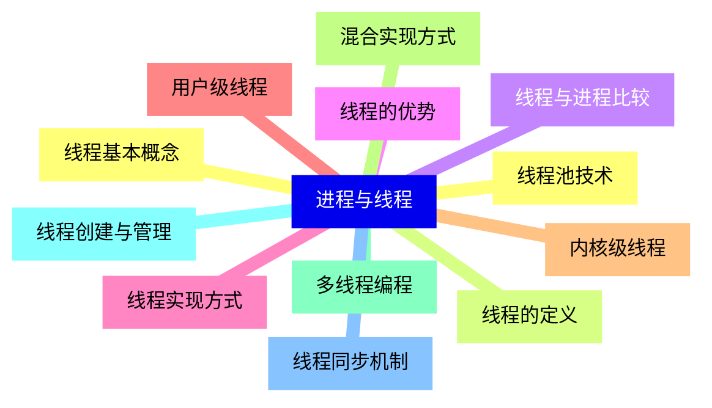
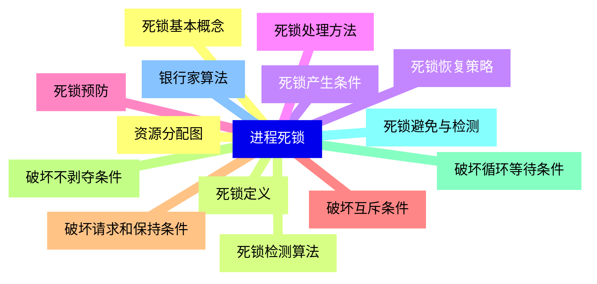
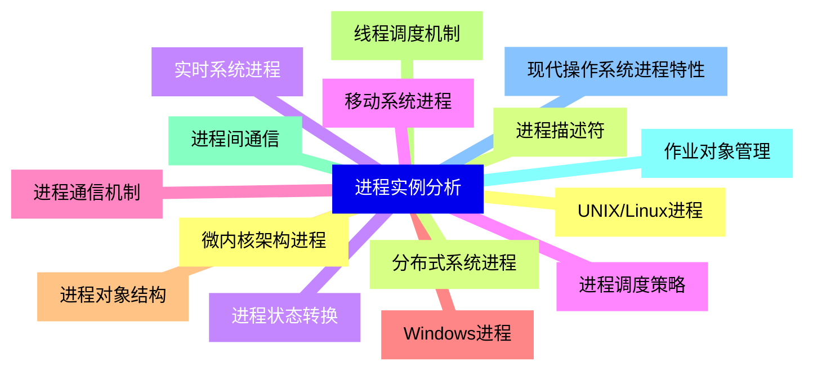


### 1 [进程基础概念](#1)
#### 1.1 [进程定义与特征](#1)
#### 1.2 [进程的基本定义](#1)
#### 1.3 [进程与程序的区别](#1)
#### 1.4 [进程的基本特征](#1)
#### 1.5 [进程的组成要素](#1)
#### 1.6 [进程状态与转换](#1)
#### 1.7 [进程的五种基本状态](#1)
#### 1.8 [状态转换图解析](#1)
#### 1.9 [状态转换触发条件](#1)
#### 1.10 [典型状态转换场景](#1)
### 2 [进程控制与管理](#2)
#### 2.1 [进程控制块 PCB](#2)
#### 2.2 [PCB的结构组成](#2)
#### 2.3 [PCB中的关键信息](#2)
#### 2.4 [PCB的管理方式](#2)
#### 2.5 [PCB与进程的关系](#2)
#### 2.6 [进程控制原语](#2)
#### 2.7 [进程创建原语](#2)
#### 2.8 [进程撤销原语](#2)
#### 2.9 [进程阻塞与唤醒原语](#2)
#### 2.10 [进程挂起与激活原语](#2)
#### 2.11 [进程调度](#2)
#### 2.12 [调度队列模型](#2)
#### 2.13 [调度程序功能](#2)
#### 2.14 [上下文切换过程](#2)
#### 2.15 [调度性能指标](#2)
### 3 [进程通信](#3)
#### 3.1 [进程通信概述](#3)
#### 3.2 [进程通信的必要性](#3)
#### 3.3 [进程通信分类](#3)
#### 3.4 [通信方式比较](#3)
#### 3.5 [低级通信机制](#3)
#### 3.6 [信号通信机制](#3)
#### 3.7 [管道通信机制](#3)
#### 3.8 [消息队列通信](#3)
#### 3.9 [高级通信机制](#3)
#### 3.10 [共享存储器系统](#3)
#### 3.11 [消息传递系统](#3)
#### 3.12 [客户机-服务器系统](#3)
### 4 [进程同步](#4)
#### 4.1 [同步基本概念](#4)
#### 4.2 [临界资源与临界区](#4)
#### 4.3 [同步与互斥概念](#4)
#### 4.4 [同步机制要求](#4)
#### 4.5 [同步机制实现](#4)
#### 4.6 [软件实现方法](#4)
#### 4.7 [硬件实现方法](#4)
#### 4.8 [信号量机制](#4)
#### 4.9 [管程机制](#4)
#### 4.10 [经典同步问题](#4)
#### 4.11 [生产者-消费者问题](#4)
#### 4.12 [读者-写者问题](#4)
#### 4.13 [哲学家进餐问题](#4)
#### 4.14 [睡眠理发师问题](#4)
### 5 [进程与线程](#5)
#### 5.1 [线程基本概念](#5)
#### 5.2 [线程的定义](#5)
#### 5.3 [线程与进程比较](#5)
#### 5.4 [线程的优势](#5)
#### 5.5 [线程实现方式](#5)
#### 5.6 [用户级线程](#5)
#### 5.7 [内核级线程](#5)
#### 5.8 [混合实现方式](#5)
#### 5.9 [多线程编程](#5)
#### 5.10 [线程创建与管理](#5)
#### 5.11 [线程同步机制](#5)
#### 5.12 [线程池技术](#5)
### 6 [进程死锁](#6)
#### 6.1 [死锁基本概念](#6)
#### 6.2 [死锁定义](#6)
#### 6.3 [死锁产生条件](#6)
#### 6.4 [死锁处理方法](#6)
#### 6.5 [死锁预防](#6)
#### 6.6 [破坏互斥条件](#6)
#### 6.7 [破坏请求和保持条件](#6)
#### 6.8 [破坏不剥夺条件](#6)
#### 6.9 [破坏循环等待条件](#6)
#### 6.10 [死锁避免与检测](#6)
#### 6.11 [银行家算法](#6)
#### 6.12 [资源分配图](#6)
#### 6.13 [死锁检测算法](#6)
#### 6.14 [死锁恢复策略](#6)
### 7 [进程实例分析](#7)
#### 7.1 [UNIX/Linux进程](#7)
#### 7.2 [进程描述符](#7)
#### 7.3 [进程状态转换](#7)
#### 7.4 [进程调度策略](#7)
#### 7.5 [进程通信机制](#7)
#### 7.6 [Windows进程](#7)
#### 7.7 [进程对象结构](#7)
#### 7.8 [线程调度机制](#7)
#### 7.9 [进程间通信](#7)
#### 7.10 [作业对象管理](#7)
#### 7.11 [现代操作系统进程特性](#7)
#### 7.12 [微内核架构进程](#7)
#### 7.13 [分布式系统进程](#7)
#### 7.14 [实时系统进程](#7)
#### 7.15 [移动系统进程](#7)




### 1 进程基础概念

---
### 1 进程基础概念
___
#### 1.1 进程定义与特征
___
#### 1.2 进程的基本定义
___
#### 1.3 进程与程序的区别
___
#### 1.4 进程的基本特征
___
#### 1.5 进程的组成要素
___
#### 1.6 进程状态与转换
___
#### 1.7 进程的五种基本状态
___
#### 1.8 状态转换图解析
___
#### 1.9 状态转换触发条件
___
#### 1.10 典型状态转换场景
### 2 进程控制与管理

---
### 2 进程控制与管理
___
#### 2.1 进程控制块 PCB
___
#### 2.2 PCB的结构组成
___
#### 2.3 PCB中的关键信息
___
#### 2.4 PCB的管理方式
___
#### 2.5 PCB与进程的关系
___
#### 2.6 进程控制原语
___
#### 2.7 进程创建原语
___
#### 2.8 进程撤销原语
___
#### 2.9 进程阻塞与唤醒原语
___
#### 2.10 进程挂起与激活原语
___
#### 2.11 进程调度
___
#### 2.12 调度队列模型
___
#### 2.13 调度程序功能
___
#### 2.14 上下文切换过程
___
#### 2.15 调度性能指标
### 3 进程通信

---
### 3 进程通信
___
#### 3.1 进程通信概述
___
#### 3.2 进程通信的必要性
___
#### 3.3 进程通信分类
___
#### 3.4 通信方式比较
___
#### 3.5 低级通信机制
___
#### 3.6 信号通信机制
___
#### 3.7 管道通信机制
___
#### 3.8 消息队列通信
___
#### 3.9 高级通信机制
___
#### 3.10 共享存储器系统
___
#### 3.11 消息传递系统
___
#### 3.12 客户机-服务器系统
### 4 进程同步

---
### 4 进程同步
___
#### 4.1 同步基本概念
___
#### 4.2 临界资源与临界区
___
#### 4.3 同步与互斥概念
___
#### 4.4 同步机制要求
___
#### 4.5 同步机制实现
___
#### 4.6 软件实现方法
___
#### 4.7 硬件实现方法
___
#### 4.8 信号量机制
___
#### 4.9 管程机制
___
#### 4.10 经典同步问题
___
#### 4.11 生产者-消费者问题
___
#### 4.12 读者-写者问题
___
#### 4.13 哲学家进餐问题
___
#### 4.14 睡眠理发师问题
### 5 进程与线程

---
### 5 进程与线程
___
#### 5.1 线程基本概念
___
#### 5.2 线程的定义
___
#### 5.3 线程与进程比较
___
#### 5.4 线程的优势
___
#### 5.5 线程实现方式
___
#### 5.6 用户级线程
___
#### 5.7 内核级线程
___
#### 5.8 混合实现方式
___
#### 5.9 多线程编程
___
#### 5.10 线程创建与管理
___
#### 5.11 线程同步机制
___
#### 5.12 线程池技术
### 6 进程死锁

---
### 6 进程死锁
___
#### 6.1 死锁基本概念
___
#### 6.2 死锁定义
___
#### 6.3 死锁产生条件
___
#### 6.4 死锁处理方法
___
#### 6.5 死锁预防
___
#### 6.6 破坏互斥条件
___
#### 6.7 破坏请求和保持条件
___
#### 6.8 破坏不剥夺条件
___
#### 6.9 破坏循环等待条件
___
#### 6.10 死锁避免与检测
___
#### 6.11 银行家算法
___
#### 6.12 资源分配图
___
#### 6.13 死锁检测算法
___
#### 6.14 死锁恢复策略
### 7 进程实例分析

---
### 7 进程实例分析
___
#### 7.1 UNIX/Linux进程
___
#### 7.2 进程描述符
___
#### 7.3 进程状态转换
___
#### 7.4 进程调度策略
___
#### 7.5 进程通信机制
___
#### 7.6 Windows进程
___
#### 7.7 进程对象结构
___
#### 7.8 线程调度机制
___
#### 7.9 进程间通信
___
#### 7.10 作业对象管理
___
#### 7.11 现代操作系统进程特性
___
#### 7.12 微内核架构进程
___
#### 7.13 分布式系统进程
___
#### 7.14 实时系统进程
___
#### 7.15 移动系统进程


### 1 进程基础概念{#1}

{}

<--->
{}
{}
{}
{}
{}
{}
{}
{}
{}
{}
{}
{}
{}
{}
{}
{}
{}
{}
{}
{}
{}

### 2 进程控制与管理{#2}

{}
{}
{}
{}
{}
{}
{}
{}
{}
{}
{}
{}
{}
{}
{}
{}
{}
{}
{}
{}
{}
{}
{}
{}
{}
{}
{}
{}
{}
{}
{}
<--->

{}

### 3 进程通信{#3}

{}

<--->
{}
{}
{}
{}
{}
{}
{}
{}
{}
{}
{}
{}
{}
{}
{}
{}
{}
{}
{}
{}
{}
{}
{}
{}
{}

### 4 进程同步{#4}

{}
{}
{}
{}
{}
{}
{}
{}
{}
{}
{}
{}
{}
{}
{}
{}
{}
{}
{}
{}
{}
{}
{}
{}
{}
{}
{}
{}
{}
<--->

{}

### 5 进程与线程{#5}

{}

<--->
{}
{}
{}
{}
{}
{}
{}
{}
{}
{}
{}
{}
{}
{}
{}
{}
{}
{}
{}
{}
{}
{}
{}
{}
{}

### 6 进程死锁{#6}

{}
{}
{}
{}
{}
{}
{}
{}
{}
{}
{}
{}
{}
{}
{}
{}
{}
{}
{}
{}
{}
{}
{}
{}
{}
{}
{}
{}
{}
<--->

{}

### 7 进程实例分析{#7}

{}

<--->
{}
{}
{}
{}
{}
{}
{}
{}
{}
{}
{}
{}
{}
{}
{}
{}
{}
{}
{}
{}
{}
{}
{}
{}
{}
{}
{}
{}
{}
{}
{}
